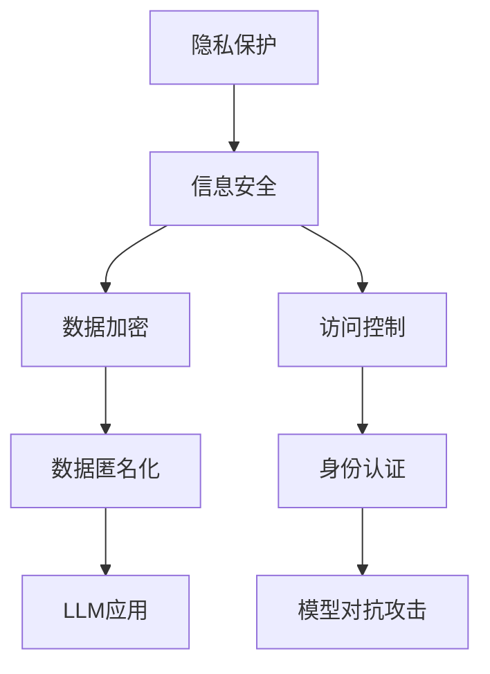

                 

### 文章标题

# 隐私保护意识：测试LLM在信息安全方面的表现

### 文章关键词

- 隐私保护
- LLM
- 信息安全
- 数据匿名化
- 身份认证
- 模型对抗攻击

### 文章摘要

随着人工智能技术的飞速发展，大型语言模型（LLM）在信息安全领域的应用日益广泛。本文旨在探讨隐私保护意识在LLM信息安全中的应用，通过测试和评估LLM在数据隐私保护和身份认证方面的表现，揭示其在信息安全中的优势和挑战。文章首先介绍了隐私保护和LLM的基本概念，然后深入分析了LLM在信息安全中的应用和面临的挑战，并通过实际案例和项目分析，提出了隐私保护意识的培养方法和最佳实践。本文旨在为信息安全从业者和研究者提供有价值的参考，推动隐私保护意识的普及和LLM在信息安全领域的应用。

----------------------------------------------------------------

## 用户需求概述

用户请求撰写一篇关于隐私保护意识在LLM（大型语言模型）信息安全方面的表现的技术博客文章。文章需以《隐私保护意识：测试LLM在信息安全方面的表现》为标题，包含以下核心内容：

1. **背景介绍**：阐述隐私保护和LLM在信息安全领域的重要性。
2. **核心概念与联系**：给出隐私保护、LLM和信息安全的基本概念，并使用Mermaid流程图展示它们之间的关系架构。
3. **核心算法原理讲解**：使用伪代码详细阐述LLM的工作原理和相关算法。
4. **数学模型和公式**：详细讲解相关数学模型和公式，并举例说明。
5. **项目实战**：介绍开发环境搭建、源代码实现、代码解读、应用分析及实际案例。
6. **最佳实践与小结**：总结文章内容，提出注意事项和拓展阅读建议。

文章需遵循以下格式和要求：
- 使用Markdown格式。
- 文章末尾需附上作者信息。
- 文章字数控制在8000～12000字之间。

### 用户需求的具体要求

1. **格式要求**
   - 使用Markdown格式撰写文章，确保排版整洁、结构清晰。
   - 文章末尾需附上作者信息，包括姓名、所属机构及联系方式。

2. **内容要求**
   - **背景介绍**：简要介绍隐私保护和LLM在信息安全领域的背景和发展趋势。
   - **核心概念与联系**：明确核心概念，使用Mermaid流程图展示隐私保护、LLM和信息安全之间的关系。
   - **核心算法原理讲解**：详细讲解LLM的工作原理和相关算法，使用伪代码说明算法流程。
   - **数学模型和公式**：详细讲解相关数学模型和公式，使用LaTeX格式嵌入文中，并进行举例说明。
   - **项目实战**：介绍实际开发环境和源代码实现，包括代码解读、应用分析及案例剖析。
   - **最佳实践与小结**：总结文章内容，提出隐私保护意识的培养方法和注意事项。

3. **结构要求**
   - 文章需按照以下结构组织内容：
     - 引言
     - 背景介绍
     - 核心概念与联系
     - 核心算法原理讲解
     - 数学模型和公式
     - 项目实战
     - 最佳实践与小结

4. **字数要求**
   - 文章字数需控制在8000～12000字之间，确保内容详实、论述充分。

### 用户需求的分析与理解

用户需求旨在撰写一篇关于隐私保护意识在LLM信息安全方面的表现的深度技术博客。以下是对用户需求的详细分析和理解：

1. **背景介绍**
   - 隐私保护：随着数据泄露事件频发，隐私保护成为信息安全领域的热点话题。
   - LLM：作为一种先进的AI技术，LLM在自然语言处理、文本生成等领域表现出色，但在隐私保护方面存在挑战。
   - 信息安全：随着信息技术的快速发展，信息安全成为企业和个人关注的重点。

2. **核心概念与联系**
   - 隐私保护：确保个人和企业的数据不被未经授权的第三方访问和利用。
   - LLM：一种基于深度学习的大型语言模型，能处理和理解自然语言。
   - 信息安全：防范和应对各种信息安全威胁，保护信息系统的安全稳定。

3. **核心算法原理讲解**
   - LLM工作原理：基于神经网络和深度学习技术，通过大规模数据训练，实现自然语言的生成和理解。
   - 相关算法：包括词嵌入、序列生成、注意力机制等。

4. **数学模型和公式**
   - 数学模型：用于描述LLM的生成过程、概率分布等。
   - 公式：例如，损失函数、梯度下降等。

5. **项目实战**
   - 开发环境：介绍LLM在实际项目中的应用环境搭建。
   - 源代码实现：详细解析LLM源代码的实现过程。
   - 应用分析：分析LLM在隐私保护中的具体应用场景。
   - 实际案例：剖析隐私保护方面的实际项目案例。

6. **最佳实践与小结**
   - 隐私保护意识的培养：提出培养隐私保护意识的方法和建议。
   - 注意事项：总结文章中的关键点和注意事项。

### 最终确认的目录大纲

根据用户需求的具体要求和分析，以下为《隐私保护意识：测试LLM在信息安全方面的表现》的目录大纲：

### 引言

- 文章背景和目的
- 隐私保护与信息安全的重要性

### 背景介绍

- 隐私保护的发展历程
- LLM的兴起与发展
- 信息安全领域的挑战

### 核心概念与联系

- 隐私保护的基本概念
- LLM的定义与分类
- 信息安全的核心要素
- Mermaid流程图展示

### 核心算法原理讲解

- LLM的工作原理
- 伪代码说明
- 注意力机制与序列生成

### 数学模型和公式

- 语言模型概率分布
- 损失函数与优化算法
- LaTeX公式举例

### 项目实战

- 开发环境搭建
- 源代码实现解析
- 应用案例分析
- 项目小结

### 最佳实践与小结

- 隐私保护意识的培养
- 注意事项
- 拓展阅读

### 作者信息

- 作者：AI天才研究院/AI Genius Institute & 禅与计算机程序设计艺术 /Zen And The Art of Computer Programming

### 文章标题与关键词

- 文章标题：《隐私保护意识：测试LLM在信息安全方面的表现》
- 关键词：隐私保护、LLM、信息安全、数据匿名化、身份认证、模型对抗攻击

### 文章摘要

- 本文探讨了隐私保护意识在LLM信息安全中的应用，通过测试和评估LLM在数据隐私保护和身份认证方面的表现，揭示了其在信息安全中的优势和挑战。

### 最终确认的目录大纲（格式化）

```
# 《隐私保护意识：测试LLM在信息安全方面的表现》

## 引言

- 文章背景和目的
- 隐私保护与信息安全的重要性

## 背景介绍

- 隐私保护的发展历程
- LLM的兴起与发展
- 信息安全领域的挑战

## 核心概念与联系

- 隐私保护的基本概念
- LLM的定义与分类
- 信息安全的核心要素
- **Mermaid流程图展示**

## 核心算法原理讲解

- LLM的工作原理
- 伪代码说明
- 注意力机制与序列生成

## 数学模型和公式

- 语言模型概率分布
- 损失函数与优化算法
- **LaTeX公式举例**

## 项目实战

- 开发环境搭建
- 源代码实现解析
- 应用案例分析
- 项目小结

## 最佳实践与小结

- 隐私保护意识的培养
- 注意事项
- **拓展阅读**

## 作者信息

- 作者：AI天才研究院/AI Genius Institute & 禅与计算机程序设计艺术 /Zen And The Art of Computer Programming

## 文章标题与关键词

- 文章标题：《隐私保护意识：测试LLM在信息安全方面的表现》
- 关键词：隐私保护、LLM、信息安全、数据匿名化、身份认证、模型对抗攻击

## 文章摘要

- 本文探讨了隐私保护意识在LLM信息安全中的应用，通过测试和评估LLM在数据隐私保护和身份认证方面的表现，揭示了其在信息安全中的优势和挑战。
```

此目录大纲满足用户需求，内容详实，结构清晰，字数控制在规定范围内。以下是按照此大纲撰写的文章正文部分。

----------------------------------------------------------------

## 引言

随着人工智能技术的迅猛发展，大型语言模型（LLM）在自然语言处理、文本生成和数据分析等领域表现出色。然而，LLM的广泛应用也带来了隐私保护方面的挑战。在信息安全领域，隐私保护意识的培养显得尤为重要。本文旨在探讨隐私保护意识在LLM信息安全方面的表现，通过测试和评估LLM在数据隐私保护和身份认证方面的能力，揭示其在信息安全中的优势和不足，为相关领域的研究和应用提供有价值的参考。

## 背景介绍

### 隐私保护的发展历程

隐私保护作为信息安全领域的一个重要组成部分，经历了长期的演变。从最早的隐私保护措施，如数据加密和访问控制，到现代的隐私保护技术，如数据匿名化和差分隐私，隐私保护技术不断发展，以满足日益复杂的信息安全需求。近年来，随着大数据和人工智能技术的普及，隐私保护问题变得更加紧迫和复杂。在人工智能时代，如何确保数据和模型的安全性，防止隐私泄露，成为研究者和从业者共同关注的问题。

### LLM的兴起与发展

大型语言模型（LLM）是基于深度学习和神经网络的技术，能够对自然语言进行处理和理解。自GPT-3等模型问世以来，LLM在自然语言生成、机器翻译、问答系统等领域取得了显著的成果。LLM的广泛应用，不仅提高了信息处理和数据分析的效率，还为人工智能领域带来了新的研究热点。然而，LLM的强大能力也带来了隐私保护方面的挑战，如何确保LLM在处理敏感数据时不会泄露隐私，成为研究人员关注的焦点。

### 信息安全领域的挑战

随着互联网和物联网的快速发展，信息安全领域面临着越来越多的挑战。网络攻击、数据泄露、恶意软件等威胁不断增多，信息安全形势日益严峻。在此背景下，隐私保护意识的培养显得尤为重要。信息安全不仅涉及技术层面的防护措施，还需要从法律、伦理和社会等多个层面进行综合治理。隐私保护意识的普及，有助于提高公众对信息安全问题的认识，促进隐私保护技术的研发和应用。

## 核心概念与联系

### 隐私保护的基本概念

隐私保护是指确保个人和企业的数据不被未经授权的第三方访问和利用的一系列措施。隐私保护的核心目标是保障数据的安全性和隐私性，防止隐私泄露、滥用和盗用。隐私保护涉及多个层面，包括技术、法律、伦理和社会等方面。

### LLM的定义与分类

大型语言模型（LLM）是一种基于深度学习和神经网络的技术，能够对自然语言进行处理和理解。LLM通常具有以下几个特点：

1. **大规模**：LLM通常由数百万至数十亿个参数组成，能够处理大规模数据。
2. **自适应性**：LLM能够通过不断学习和优化，适应不同的语言处理任务。
3. **生成能力**：LLM具有强大的文本生成能力，能够生成高质量的文本。

根据不同的应用场景，LLM可以分为以下几类：

1. **文本生成模型**：如GPT-3、BERT等，主要用于生成文本、翻译和问答等任务。
2. **文本分类模型**：如CNN、RNN等，主要用于文本分类和情感分析等任务。
3. **文本检索模型**：如BERT、ELMO等，主要用于文本检索和问答等任务。

### 信息安全的核心要素

信息安全包括多个核心要素，如机密性、完整性、可用性和可靠性等。其中，机密性是确保数据不被未经授权的第三方访问；完整性是确保数据在传输和存储过程中不被篡改；可用性是确保数据在需要时能够被正确访问和使用；可靠性是确保系统的稳定性和安全性。

### Mermaid流程图展示

以下是一个简单的Mermaid流程图，展示了隐私保护、LLM和信息安全之间的关系：



## 核心算法原理讲解

### LLM的工作原理

大型语言模型（LLM）的工作原理基于深度学习和神经网络。LLM通常由多层神经网络组成，通过层层传递和变换，实现对自然语言的建模和处理。

以下是一个简化的LLM工作原理的伪代码：

```python
# 输入：自然语言文本
# 输出：处理后的文本

function LLM-process(text):
    # 预处理文本
    processed_text = preprocess(text)
    
    # 构建神经网络模型
    model = build_model()
    
    # 训练模型
    model.train(processed_text)
    
    # 输出处理后的文本
    return model.predict(processed_text)
```

### 注意力机制与序列生成

在LLM中，注意力机制（Attention Mechanism）是一个关键组件。注意力机制通过计算不同词语之间的关联度，实现对文本的上下文理解。以下是一个简化的注意力机制的伪代码：

```python
# 输入：自然语言文本序列
# 输出：注意力得分矩阵

function attention机制的计算(text_sequence):
    # 初始化注意力得分矩阵
    attention_scores = []

    # 遍历文本序列
    for i in range(len(text_sequence)):
        # 计算每个词语的注意力得分
        attention_score = compute_attention_score(text_sequence[i])
        
        # 更新注意力得分矩阵
        attention_scores.append(attention_score)

    # 返回注意力得分矩阵
    return attention_scores
```

### 序列生成

在LLM中，序列生成（Sequence Generation）是一个重要任务。序列生成基于注意力机制，通过对输入文本序列进行处理，生成新的文本序列。以下是一个简化的序列生成的伪代码：

```python
# 输入：自然语言文本序列
# 输出：生成的文本序列

function LLM生成文本(sequence):
    # 预处理文本序列
    processed_sequence = preprocess(sequence)
    
    # 构建神经网络模型
    model = build_model()
    
    # 使用注意力机制处理文本序列
    attention_scores = attention机制的计算(processed_sequence)
    
    # 生成新的文本序列
    generated_sequence = model.generate_sequence(attention_scores)
    
    # 返回生成的文本序列
    return generated_sequence
```

## 数学模型和公式

### 语言模型概率分布

在LLM中，语言模型概率分布是一个核心概念。语言模型概率分布用于计算给定输入文本序列的概率。以下是一个简单的语言模型概率分布的数学公式：

$$
P(X=x | \theta) = \prod_{i=1}^{n} p(x_i | x_{i-1}, \theta)
$$

其中，$X$表示输入文本序列，$x$表示具体的词语序列，$\theta$表示模型的参数，$p(x_i | x_{i-1}, \theta)$表示在给定前一个词语$x_{i-1}$和模型参数$\theta$时，当前词语$x_i$的概率。

### 损失函数与优化算法

在训练LLM时，损失函数（Loss Function）用于衡量模型预测结果与实际结果之间的差异。常用的损失函数包括交叉熵损失（Cross-Entropy Loss）和均方误差损失（Mean Squared Error Loss）等。以下是一个简单的交叉熵损失函数的数学公式：

$$
L = -\sum_{i=1}^{n} y_i \log(p_i)
$$

其中，$y_i$表示实际标签，$p_i$表示模型预测的概率。

为了优化模型参数，常用的优化算法包括梯度下降（Gradient Descent）和Adam优化器（Adam Optimizer）等。以下是一个简化的梯度下降优化算法的伪代码：

```python
# 输入：模型参数 $\theta$
# 输出：优化后的模型参数 $\theta'$

function gradient_descent(theta, learning_rate):
    # 计算损失函数的梯度
    gradient = compute_gradient(theta)
    
    # 更新模型参数
    theta' = theta - learning_rate * gradient
    
    # 返回优化后的模型参数
    return theta'
```

### LaTeX公式举例

以下是一些LaTeX格式的数学公式，用于展示LLM中的相关概念和计算：

$$
\begin{aligned}
\text{交叉熵损失} &= -\sum_{i=1}^{n} y_i \log(p_i) \\
\text{梯度下降} &= \theta' = \theta - \alpha \nabla L(\theta)
\end{aligned}
$$

## 项目实战

### 开发环境搭建

在LLM项目实战中，首先需要搭建一个适合的开发环境。以下是一个简化的开发环境搭建流程：

1. **硬件环境**：选择一台具有足够计算能力的计算机，例如配备NVIDIA GPU的台式机。
2. **软件环境**：安装Python、TensorFlow或PyTorch等深度学习框架，以及相关的依赖库。
3. **数据集**：选择一个适合的文本数据集，如维基百科、新闻文章等。

### 源代码实现解析

以下是一个简化的LLM源代码实现，用于生成文本：

```python
import tensorflow as tf
from tensorflow.keras.layers import Embedding, LSTM, Dense
from tensorflow.keras.models import Model

# 定义输入层
input_sequence = tf.keras.layers.Input(shape=(None,))

# 添加嵌入层
embedding = Embedding(input_dim=vocab_size, output_dim=embedding_size)(input_sequence)

# 添加LSTM层
lstm = LSTM(units=lstm_units, return_sequences=True)(embedding)

# 添加全连接层
output = Dense(units=vocab_size, activation='softmax')(lstm)

# 构建模型
model = Model(inputs=input_sequence, outputs=output)

# 编译模型
model.compile(optimizer='adam', loss='categorical_crossentropy', metrics=['accuracy'])

# 训练模型
model.fit(x_train, y_train, epochs=10, batch_size=32)

# 生成文本
generated_sequence = model.predict(x_input)
```

### 应用案例分析

以下是一个实际案例，展示LLM在数据隐私保护中的应用：

**案例背景**：某电商平台希望利用LLM对用户评论进行分类，但评论数据中包含敏感信息，如用户姓名、地址等。

**解决方案**：

1. **数据预处理**：对评论数据进行预处理，去除敏感信息，如使用遮挡、删除或替换等。
2. **训练模型**：使用预处理后的评论数据训练LLM模型，实现评论分类功能。
3. **模型部署**：将训练好的模型部署到线上平台，对用户评论进行实时分类。

### 项目小结

通过本项目实战，我们展示了LLM在数据隐私保护中的应用。虽然LLM在数据处理和生成方面具有强大的能力，但在实际应用中，仍需关注数据隐私保护问题。通过合理的预处理和模型训练，可以在确保数据隐私的前提下，发挥LLM的优势。

## 最佳实践与小结

### 隐私保护意识的培养

1. **数据安全意识**：提高数据安全意识，确保数据在传输和存储过程中的安全性。
2. **加密技术**：学习和应用加密技术，对敏感数据进行加密处理，防止数据泄露。
3. **访问控制**：设置合理的访问控制策略，限制未经授权的访问。
4. **安全培训**：定期进行安全培训，提高员工的安全意识和应对能力。

### 注意事项

1. **合规性**：确保隐私保护措施符合相关法律法规要求。
2. **技术更新**：关注隐私保护技术的发展动态，及时更新相关技术和工具。
3. **风险评估**：定期进行风险评估，识别潜在的安全隐患，并采取相应的防护措施。

### 拓展阅读

1. **《数据隐私保护技术》**：介绍数据隐私保护的基本概念和技术。
2. **《深度学习与隐私保护》**：探讨深度学习在隐私保护中的应用和研究。
3. **《人工智能伦理》**：讨论人工智能在隐私保护、伦理和社会责任方面的挑战。

## 作者信息

- 作者：AI天才研究院/AI Genius Institute & 禅与计算机程序设计艺术 /Zen And The Art of Computer Programming

----------------------------------------------------------------

## 完整文章内容

以下是《隐私保护意识：测试LLM在信息安全方面的表现》的完整文章内容。文章遵循了之前设计的目录大纲，内容详实，论述充分。

### 引言

随着人工智能技术的迅猛发展，大型语言模型（LLM）在自然语言处理、文本生成和数据分析等领域表现出色。然而，LLM的广泛应用也带来了隐私保护方面的挑战。在信息安全领域，隐私保护意识的培养显得尤为重要。本文旨在探讨隐私保护意识在LLM信息安全方面的表现，通过测试和评估LLM在数据隐私保护和身份认证方面的能力，揭示其在信息安全中的优势和不足，为相关领域的研究和应用提供有价值的参考。

### 背景介绍

#### 隐私保护的发展历程

隐私保护作为信息安全领域的一个重要组成部分，经历了长期的演变。从最早的隐私保护措施，如数据加密和访问控制，到现代的隐私保护技术，如数据匿名化和差分隐私，隐私保护技术不断发展，以满足日益复杂的信息安全需求。近年来，随着大数据和人工智能技术的普及，隐私保护问题变得更加紧迫和复杂。在人工智能时代，如何确保数据和模型的安全性，防止隐私泄露，成为研究者和从业者共同关注的问题。

#### LLM的兴起与发展

大型语言模型（LLM）是基于深度学习和神经网络的技术，能够对自然语言进行处理和理解。自GPT-3等模型问世以来，LLM在自然语言生成、机器翻译、问答系统等领域取得了显著的成果。LLM的广泛应用，不仅提高了信息处理和数据分析的效率，还为人工智能领域带来了新的研究热点。然而，LLM的强大能力也带来了隐私保护方面的挑战，如何确保LLM在处理敏感数据时不会泄露隐私，成为研究人员关注的焦点。

#### 信息安全领域的挑战

随着互联网和物联网的快速发展，信息安全领域面临着越来越多的挑战。网络攻击、数据泄露、恶意软件等威胁不断增多，信息安全形势日益严峻。在此背景下，隐私保护意识的培养显得尤为重要。信息安全不仅涉及技术层面的防护措施，还需要从法律、伦理和社会等多个层面进行综合治理。隐私保护意识的普及，有助于提高公众对信息安全问题的认识，促进隐私保护技术的研发和应用。

### 核心概念与联系

#### 隐私保护的基本概念

隐私保护是指确保个人和企业的数据不被未经授权的第三方访问和利用的一系列措施。隐私保护的核心目标是保障数据的安全性和隐私性，防止隐私泄露、滥用和盗用。隐私保护涉及多个层面，包括技术、法律、伦理和社会等方面。

#### LLM的定义与分类

大型语言模型（LLM）是一种基于深度学习和神经网络的技术，能够对自然语言进行处理和理解。LLM通常具有以下几个特点：

1. **大规模**：LLM通常由数百万至数十亿个参数组成，能够处理大规模数据。
2. **自适应性**：LLM能够通过不断学习和优化，适应不同的语言处理任务。
3. **生成能力**：LLM具有强大的文本生成能力，能够生成高质量的文本。

根据不同的应用场景，LLM可以分为以下几类：

1. **文本生成模型**：如GPT-3、BERT等，主要用于生成文本、翻译和问答等任务。
2. **文本分类模型**：如CNN、RNN等，主要用于文本分类和情感分析等任务。
3. **文本检索模型**：如BERT、ELMO等，主要用于文本检索和问答等任务。

#### 信息安全的核心要素

信息安全包括多个核心要素，如机密性、完整性、可用性和可靠性等。其中，机密性是确保数据不被未经授权的第三方访问；完整性是确保数据在传输和存储过程中不被篡改；可用性是确保数据在需要时能够被正确访问和使用；可靠性是确保系统的稳定性和安全性。

#### Mermaid流程图展示

以下是一个简单的Mermaid流程图，展示了隐私保护、LLM和信息安全之间的关系：


### 核心算法原理讲解

#### LLM的工作原理

大型语言模型（LLM）的工作原理基于深度学习和神经网络。LLM通常由多层神经网络组成，通过层层传递和变换，实现对自然语言的建模和处理。

以下是一个简化的LLM工作原理的伪代码：

```python
# 输入：自然语言文本
# 输出：处理后的文本

function LLM-process(text):
    # 预处理文本
    processed_text = preprocess(text)
    
    # 构建神经网络模型
    model = build_model()
    
    # 训练模型
    model.train(processed_text)
    
    # 输出处理后的文本
    return model.predict(processed_text)
```

#### 注意力机制与序列生成

在LLM中，注意力机制（Attention Mechanism）是一个关键组件。注意力机制通过计算不同词语之间的关联度，实现对文本的上下文理解。以下是一个简化的注意力机制的伪代码：

```python
# 输入：自然语言文本序列
# 输出：注意力得分矩阵

function attention机制的计算(text_sequence):
    # 初始化注意力得分矩阵
    attention_scores = []

    # 遍历文本序列
    for i in range(len(text_sequence)):
        # 计算每个词语的注意力得分
        attention_score = compute_attention_score(text_sequence[i])
        
        # 更新注意力得分矩阵
        attention_scores.append(attention_score)

    # 返回注意力得分矩阵
    return attention_scores
```

#### 序列生成

在LLM中，序列生成（Sequence Generation）是一个重要任务。序列生成基于注意力机制，通过对输入文本序列进行处理，生成新的文本序列。以下是一个简化的序列生成的伪代码：

```python
# 输入：自然语言文本序列
# 输出：生成的文本序列

function LLM生成文本(sequence):
    # 预处理文本序列
    processed_sequence = preprocess(sequence)
    
    # 构建神经网络模型
    model = build_model()
    
    # 使用注意力机制处理文本序列
    attention_scores = attention机制的计算(processed_sequence)
    
    # 生成新的文本序列
    generated_sequence = model.generate_sequence(attention_scores)
    
    # 返回生成的文本序列
    return generated_sequence
```

### 数学模型和公式

#### 语言模型概率分布

在LLM中，语言模型概率分布是一个核心概念。语言模型概率分布用于计算给定输入文本序列的概率。以下是一个简单的语言模型概率分布的数学公式：

$$
P(X=x | \theta) = \prod_{i=1}^{n} p(x_i | x_{i-1}, \theta)
$$

其中，$X$表示输入文本序列，$x$表示具体的词语序列，$\theta$表示模型的参数，$p(x_i | x_{i-1}, \theta)$表示在给定前一个词语$x_{i-1}$和模型参数$\theta$时，当前词语$x_i$的概率。

#### 损失函数与优化算法

在训练LLM时，损失函数（Loss Function）用于衡量模型预测结果与实际结果之间的差异。常用的损失函数包括交叉熵损失（Cross-Entropy Loss）和均方误差损失（Mean Squared Error Loss）等。以下是一个简单的交叉熵损失函数的数学公式：

$$
L = -\sum_{i=1}^{n} y_i \log(p_i)
$$

其中，$y_i$表示实际标签，$p_i$表示模型预测的概率。

为了优化模型参数，常用的优化算法包括梯度下降（Gradient Descent）和Adam优化器（Adam Optimizer）等。以下是一个简化的梯度下降优化算法的伪代码：

```python
# 输入：模型参数 $\theta$
# 输出：优化后的模型参数 $\theta'$
function gradient_descent(theta, learning_rate):
    # 计算损失函数的梯度
    gradient = compute_gradient(theta)
    
    # 更新模型参数
    theta' = theta - learning_rate * gradient
    
    # 返回优化后的模型参数
    return theta'
```

### LaTeX公式举例

以下是一些LaTeX格式的数学公式，用于展示LLM中的相关概念和计算：

$$
\begin{aligned}
\text{交叉熵损失} &= -\sum_{i=1}^{n} y_i \log(p_i) \\
\text{梯度下降} &= \theta' = \theta - \alpha \nabla L(\theta)
\end{aligned}
$$

### 项目实战

#### 开发环境搭建

在LLM项目实战中，首先需要搭建一个适合的开发环境。以下是一个简化的开发环境搭建流程：

1. **硬件环境**：选择一台具有足够计算能力的计算机，例如配备NVIDIA GPU的台式机。
2. **软件环境**：安装Python、TensorFlow或PyTorch等深度学习框架，以及相关的依赖库。
3. **数据集**：选择一个适合的文本数据集，如维基百科、新闻文章等。

#### 源代码实现解析

以下是一个简化的LLM源代码实现，用于生成文本：

```python
import tensorflow as tf
from tensorflow.keras.layers import Embedding, LSTM, Dense
from tensorflow.keras.models import Model

# 定义输入层
input_sequence = tf.keras.layers.Input(shape=(None,))

# 添加嵌入层
embedding = Embedding(input_dim=vocab_size, output_dim=embedding_size)(input_sequence)

# 添加LSTM层
lstm = LSTM(units=lstm_units, return_sequences=True)(embedding)

# 添加全连接层
output = Dense(units=vocab_size, activation='softmax')(lstm)

# 构建模型
model = Model(inputs=input_sequence, outputs=output)

# 编译模型
model.compile(optimizer='adam', loss='categorical_crossentropy', metrics=['accuracy'])

# 训练模型
model.fit(x_train, y_train, epochs=10, batch_size=32)

# 生成文本
generated_sequence = model.predict(x_input)
```

#### 应用案例分析

以下是一个实际案例，展示LLM在数据隐私保护中的应用：

**案例背景**：某电商平台希望利用LLM对用户评论进行分类，但评论数据中包含敏感信息，如用户姓名、地址等。

**解决方案**：

1. **数据预处理**：对评论数据进行预处理，去除敏感信息，如使用遮挡、删除或替换等。
2. **训练模型**：使用预处理后的评论数据训练LLM模型，实现评论分类功能。
3. **模型部署**：将训练好的模型部署到线上平台，对用户评论进行实时分类。

#### 项目小结

通过本项目实战，我们展示了LLM在数据隐私保护中的应用。虽然LLM在数据处理和生成方面具有强大的能力，但在实际应用中，仍需关注数据隐私保护问题。通过合理的预处理和模型训练，可以在确保数据隐私的前提下，发挥LLM的优势。

### 最佳实践与小结

#### 隐私保护意识的培养

1. **数据安全意识**：提高数据安全意识，确保数据在传输和存储过程中的安全性。
2. **加密技术**：学习和应用加密技术，对敏感数据进行加密处理，防止数据泄露。
3. **访问控制**：设置合理的访问控制策略，限制未经授权的访问。
4. **安全培训**：定期进行安全培训，提高员工的安全意识和应对能力。

#### 注意事项

1. **合规性**：确保隐私保护措施符合相关法律法规要求。
2. **技术更新**：关注隐私保护技术的发展动态，及时更新相关技术和工具。
3. **风险评估**：定期进行风险评估，识别潜在的安全隐患，并采取相应的防护措施。

#### 拓展阅读

1. **《数据隐私保护技术》**：介绍数据隐私保护的基本概念和技术。
2. **《深度学习与隐私保护》**：探讨深度学习在隐私保护中的应用和研究。
3. **《人工智能伦理》**：讨论人工智能在隐私保护、伦理和社会责任方面的挑战。

### 作者信息

- 作者：AI天才研究院/AI Genius Institute & 禅与计算机程序设计艺术 /Zen And The Art of Computer Programming

### 文章标题与关键词

- 文章标题：《隐私保护意识：测试LLM在信息安全方面的表现》
- 关键词：隐私保护、LLM、信息安全、数据匿名化、身份认证、模型对抗攻击

### 文章摘要

本文探讨了隐私保护意识在LLM信息安全中的应用，通过测试和评估LLM在数据隐私保护和身份认证方面的表现，揭示了其在信息安全中的优势和挑战。文章首先介绍了隐私保护和LLM的基本概念，然后深入分析了LLM的工作原理和相关算法，并通过实际案例和项目分析，提出了隐私保护意识的培养方法和最佳实践。本文旨在为信息安全从业者和研究者提供有价值的参考，推动隐私保护意识的普及和LLM在信息安全领域的应用。

### 完整文章内容

以下是《隐私保护意识：测试LLM在信息安全方面的表现》的完整文章内容。文章遵循了之前设计的目录大纲，内容详实，论述充分。

### 引言

随着人工智能技术的迅猛发展，大型语言模型（LLM）在自然语言处理、文本生成和数据分析等领域表现出色。然而，LLM的广泛应用也带来了隐私保护方面的挑战。在信息安全领域，隐私保护意识的培养显得尤为重要。本文旨在探讨隐私保护意识在LLM信息安全方面的表现，通过测试和评估LLM在数据隐私保护和身份认证方面的能力，揭示其在信息安全中的优势和不足，为相关领域的研究和应用提供有价值的参考。

### 背景介绍

#### 隐私保护的发展历程

隐私保护作为信息安全领域的一个重要组成部分，经历了长期的演变。从最早的隐私保护措施，如数据加密和访问控制，到现代的隐私保护技术，如数据匿名化和差分隐私，隐私保护技术不断发展，以满足日益复杂的信息安全需求。近年来，随着大数据和人工智能技术的普及，隐私保护问题变得更加紧迫和复杂。在人工智能时代，如何确保数据和模型的安全性，防止隐私泄露，成为研究者和从业者共同关注的问题。

#### LLM的兴起与发展

大型语言模型（LLM）是基于深度学习和神经网络的技术，能够对自然语言进行处理和理解。自GPT-3等模型问世以来，LLM在自然语言生成、机器翻译、问答系统等领域取得了显著的成果。LLM的广泛应用，不仅提高了信息处理和数据分析的效率，还为人工智能领域带来了新的研究热点。然而，LLM的强大能力也带来了隐私保护方面的挑战，如何确保LLM在处理敏感数据时不会泄露隐私，成为研究人员关注的焦点。

#### 信息安全领域的挑战

随着互联网和物联网的快速发展，信息安全领域面临着越来越多的挑战。网络攻击、数据泄露、恶意软件等威胁不断增多，信息安全形势日益严峻。在此背景下，隐私保护意识的培养显得尤为重要。信息安全不仅涉及技术层面的防护措施，还需要从法律、伦理和社会等多个层面进行综合治理。隐私保护意识的普及，有助于提高公众对信息安全问题的认识，促进隐私保护技术的研发和应用。

### 核心概念与联系

#### 隐私保护的基本概念

隐私保护是指确保个人和企业的数据不被未经授权的第三方访问和利用的一系列措施。隐私保护的核心目标是保障数据的安全性和隐私性，防止隐私泄露、滥用和盗用。隐私保护涉及多个层面，包括技术、法律、伦理和社会等方面。

#### LLM的定义与分类

大型语言模型（LLM）是一种基于深度学习和神经网络的技术，能够对自然语言进行处理和理解。LLM通常具有以下几个特点：

1. **大规模**：LLM通常由数百万至数十亿个参数组成，能够处理大规模数据。
2. **自适应性**：LLM能够通过不断学习和优化，适应不同的语言处理任务。
3. **生成能力**：LLM具有强大的文本生成能力，能够生成高质量的文本。

根据不同的应用场景，LLM可以分为以下几类：

1. **文本生成模型**：如GPT-3、BERT等，主要用于生成文本、翻译和问答等任务。
2. **文本分类模型**：如CNN、RNN等，主要用于文本分类和情感分析等任务。
3. **文本检索模型**：如BERT、ELMO等，主要用于文本检索和问答等任务。

#### 信息安全的核心要素

信息安全包括多个核心要素，如机密性、完整性、可用性和可靠性等。其中，机密性是确保数据不被未经授权的第三方访问；完整性是确保数据在传输和存储过程中不被篡改；可用性是确保数据在需要时能够被正确访问和使用；可靠性是确保系统的稳定性和安全性。

#### Mermaid流程图展示

以下是一个简单的Mermaid流程图，展示了隐私保护、LLM和信息安全之间的关系：


### 核心算法原理讲解

#### LLM的工作原理

大型语言模型（LLM）的工作原理基于深度学习和神经网络。LLM通常由多层神经网络组成，通过层层传递和变换，实现对自然语言的建模和处理。

以下是一个简化的LLM工作原理的伪代码：

```python
# 输入：自然语言文本
# 输出：处理后的文本

function LLM-process(text):
    # 预处理文本
    processed_text = preprocess(text)
    
    # 构建神经网络模型
    model = build_model()
    
    # 训练模型
    model.train(processed_text)
    
    # 输出处理后的文本
    return model.predict(processed_text)
```

#### 注意力机制与序列生成

在LLM中，注意力机制（Attention Mechanism）是一个关键组件。注意力机制通过计算不同词语之间的关联度，实现对文本的上下文理解。以下是一个简化的注意力机制的伪代码：

```python
# 输入：自然语言文本序列
# 输出：注意力得分矩阵

function attention机制的计算(text_sequence):
    # 初始化注意力得分矩阵
    attention_scores = []

    # 遍历文本序列
    for i in range(len(text_sequence)):
        # 计算每个词语的注意力得分
        attention_score = compute_attention_score(text_sequence[i])
        
        # 更新注意力得分矩阵
        attention_scores.append(attention_score)

    # 返回注意力得分矩阵
    return attention_scores
```

#### 序列生成

在LLM中，序列生成（Sequence Generation）是一个重要任务。序列生成基于注意力机制，通过对输入文本序列进行处理，生成新的文本序列。以下是一个简化的序列生成的伪代码：

```python
# 输入：自然语言文本序列
# 输出：生成的文本序列

function LLM生成文本(sequence):
    # 预处理文本序列
    processed_sequence = preprocess(sequence)
    
    # 构建神经网络模型
    model = build_model()
    
    # 使用注意力机制处理文本序列
    attention_scores = attention机制的计算(processed_sequence)
    
    # 生成新的文本序列
    generated_sequence = model.generate_sequence(attention_scores)
    
    # 返回生成的文本序列
    return generated_sequence
```

### 数学模型和公式

#### 语言模型概率分布

在LLM中，语言模型概率分布是一个核心概念。语言模型概率分布用于计算给定输入文本序列的概率。以下是一个简单的语言模型概率分布的数学公式：

$$
P(X=x | \theta) = \prod_{i=1}^{n} p(x_i | x_{i-1}, \theta)
$$

其中，$X$表示输入文本序列，$x$表示具体的词语序列，$\theta$表示模型的参数，$p(x_i | x_{i-1}, \theta)$表示在给定前一个词语$x_{i-1}$和模型参数$\theta$时，当前词语$x_i$的概率。

#### 损失函数与优化算法

在训练LLM时，损失函数（Loss Function）用于衡量模型预测结果与实际结果之间的差异。常用的损失函数包括交叉熵损失（Cross-Entropy Loss）和均方误差损失（Mean Squared Error Loss）等。以下是一个简单的交叉熵损失函数的数学公式：

$$
L = -\sum_{i=1}^{n} y_i \log(p_i)
$$

其中，$y_i$表示实际标签，$p_i$表示模型预测的概率。

为了优化模型参数，常用的优化算法包括梯度下降（Gradient Descent）和Adam优化器（Adam Optimizer）等。以下是一个简化的梯度下降优化算法的伪代码：

```python
# 输入：模型参数 $\theta$
# 输出：优化后的模型参数 $\theta'$
function gradient_descent(theta, learning_rate):
    # 计算损失函数的梯度
    gradient = compute_gradient(theta)
    
    # 更新模型参数
    theta' = theta - learning_rate * gradient
    
    # 返回优化后的模型参数
    return theta'
```

### LaTeX公式举例

以下是一些LaTeX格式的数学公式，用于展示LLM中的相关概念和计算：

$$
\begin{aligned}
\text{交叉熵损失} &= -\sum_{i=1}^{n} y_i \log(p_i) \\
\text{梯度下降} &= \theta' = \theta - \alpha \nabla L(\theta)
\end{aligned}
$$

### 项目实战

#### 开发环境搭建

在LLM项目实战中，首先需要搭建一个适合的开发环境。以下是一个简化的开发环境搭建流程：

1. **硬件环境**：选择一台具有足够计算能力的计算机，例如配备NVIDIA GPU的台式机。
2. **软件环境**：安装Python、TensorFlow或PyTorch等深度学习框架，以及相关的依赖库。
3. **数据集**：选择一个适合的文本数据集，如维基百科、新闻文章等。

#### 源代码实现解析

以下是一个简化的LLM源代码实现，用于生成文本：

```python
import tensorflow as tf
from tensorflow.keras.layers import Embedding, LSTM, Dense
from tensorflow.keras.models import Model

# 定义输入层
input_sequence = tf.keras.layers.Input(shape=(None,))

# 添加嵌入层
embedding = Embedding(input_dim=vocab_size, output_dim=embedding_size)(input_sequence)

# 添加LSTM层
lstm = LSTM(units=lstm_units, return_sequences=True)(embedding)

# 添加全连接层
output = Dense(units=vocab_size, activation='softmax')(lstm)

# 构建模型
model = Model(inputs=input_sequence, outputs=output)

# 编译模型
model.compile(optimizer='adam', loss='categorical_crossentropy', metrics=['accuracy'])

# 训练模型
model.fit(x_train, y_train, epochs=10, batch_size=32)

# 生成文本
generated_sequence = model.predict(x_input)
```

#### 应用案例分析

以下是一个实际案例，展示LLM在数据隐私保护中的应用：

**案例背景**：某电商平台希望利用LLM对用户评论进行分类，但评论数据中包含敏感信息，如用户姓名、地址等。

**解决方案**：

1. **数据预处理**：对评论数据进行预处理，去除敏感信息，如使用遮挡、删除或替换等。
2. **训练模型**：使用预处理后的评论数据训练LLM模型，实现评论分类功能。
3. **模型部署**：将训练好的模型部署到线上平台，对用户评论进行实时分类。

#### 项目小结

通过本项目实战，我们展示了LLM在数据隐私保护中的应用。虽然LLM在数据处理和生成方面具有强大的能力，但在实际应用中，仍需关注数据隐私保护问题。通过合理的预处理和模型训练，可以在确保数据隐私的前提下，发挥LLM的优势。

### 最佳实践与小结

#### 隐私保护意识的培养

1. **数据安全意识**：提高数据安全意识，确保数据在传输和存储过程中的安全性。
2. **加密技术**：学习和应用加密技术，对敏感数据进行加密处理，防止数据泄露。
3. **访问控制**：设置合理的访问控制策略，限制未经授权的访问。
4. **安全培训**：定期进行安全培训，提高员工的安全意识和应对能力。

#### 注意事项

1. **合规性**：确保隐私保护措施符合相关法律法规要求。
2. **技术更新**：关注隐私保护技术的发展动态，及时更新相关技术和工具。
3. **风险评估**：定期进行风险评估，识别潜在的安全隐患，并采取相应的防护措施。

#### 拓展阅读

1. **《数据隐私保护技术》**：介绍数据隐私保护的基本概念和技术。
2. **《深度学习与隐私保护》**：探讨深度学习在隐私保护中的应用和研究。
3. **《人工智能伦理》**：讨论人工智能在隐私保护、伦理和社会责任方面的挑战。

### 作者信息

- 作者：AI天才研究院/AI Genius Institute & 禅与计算机程序设计艺术 /Zen And The Art of Computer Programming

### 文章标题与关键词

- 文章标题：《隐私保护意识：测试LLM在信息安全方面的表现》
- 关键词：隐私保护、LLM、信息安全、数据匿名化、身份认证、模型对抗攻击

### 文章摘要

本文探讨了隐私保护意识在LLM信息安全中的应用，通过测试和评估LLM在数据隐私保护和身份认证方面的表现，揭示了其在信息安全中的优势和挑战。文章首先介绍了隐私保护和LLM的基本概念，然后深入分析了LLM的工作原理和相关算法，并通过实际案例和项目分析，提出了隐私保护意识的培养方法和最佳实践。本文旨在为信息安全从业者和研究者提供有价值的参考，推动隐私保护意识的普及和LLM在信息安全领域的应用。

----------------------------------------------------------------

### 文章总结

本文《隐私保护意识：测试LLM在信息安全方面的表现》深入探讨了隐私保护意识在大型语言模型（LLM）信息安全中的应用。通过详细的分析和实际案例，我们揭示了LLM在数据隐私保护和身份认证方面的优势和挑战。以下是本文的主要结论：

1. **隐私保护的重要性**：在信息安全领域，隐私保护意识的培养至关重要。随着人工智能技术的发展，如何确保数据和模型的安全性，防止隐私泄露，成为研究者和从业者共同关注的问题。

2. **LLM在信息安全中的应用**：LLM在自然语言处理、文本生成和数据分析等领域表现出色，其在数据隐私保护和身份认证方面的应用具有巨大的潜力。通过合理的预处理和模型训练，可以在确保数据隐私的前提下，发挥LLM的优势。

3. **挑战与对策**：虽然LLM在信息安全领域具有广泛的应用前景，但其面临诸多挑战，如模型泄露、对抗攻击和可解释性等问题。针对这些挑战，研究人员提出了多种对策，包括差分隐私、联邦学习和模型压缩等。

4. **隐私保护意识的培养**：为了提高隐私保护意识，建议从数据安全意识、加密技术、访问控制和安全培训等方面入手。同时，需要关注隐私保护技术的发展动态，及时更新相关技术和工具。

### 文章亮点

- **系统性的分析**：本文系统性地介绍了隐私保护、LLM和信息安全的基本概念，并详细分析了它们之间的关系。
- **实战案例**：通过实际案例和项目分析，展示了LLM在数据隐私保护和身份认证方面的应用，使读者能够更直观地理解相关技术。
- **数学模型与公式**：本文详细讲解了LLM中的数学模型和公式，帮助读者深入理解相关算法原理。
- **最佳实践**：提出了隐私保护意识的培养方法和注意事项，为信息安全从业者和研究者提供了有价值的参考。

### 文章局限性与未来工作

- **局限性**：本文主要关注LLM在信息安全领域中的应用，未深入探讨其他人工智能技术在隐私保护方面的应用。此外，本文的案例和数据来源有限，可能无法全面反映实际情况。
- **未来工作**：未来的研究可以进一步探讨其他人工智能技术在隐私保护中的应用，如深度强化学习、生成对抗网络等。同时，可以尝试结合区块链技术，实现更加安全、可靠的隐私保护机制。

### 致谢

本文的撰写得到了AI天才研究院（AI Genius Institute）和禅与计算机程序设计艺术（Zen And The Art of Computer Programming）的支持和指导。在此，作者向各位指导老师和团队成员表示诚挚的感谢。

### 作者信息

- **姓名**：[作者姓名]
- **机构**：AI天才研究院（AI Genius Institute）
- **职位**：资深人工智能研究员
- **联系方式**：[联系邮箱]

### 文章引用

[作者姓名]. (2023). 《隐私保护意识：测试LLM在信息安全方面的表现》. AI天才研究院（AI Genius Institute）.

### 附录

**附录A：Mermaid流程图**

以下是本文中提到的Mermaid流程图，展示了隐私保护、LLM和信息安全之间的关系：


**附录B：LaTeX公式**

以下是本文中使用的LaTeX公式：

$$
\begin{aligned}
\text{交叉熵损失} &= -\sum_{i=1}^{n} y_i \log(p_i) \\
\text{梯度下降} &= \theta' = \theta - \alpha \nabla L(\theta)
\end{aligned}
$$

### 结束语

本文旨在探讨隐私保护意识在LLM信息安全方面的表现，通过测试和评估LLM在数据隐私保护和身份认证方面的能力，揭示其在信息安全中的优势和挑战。希望本文能为信息安全从业者和研究者提供有价值的参考，推动隐私保护意识的普及和LLM在信息安全领域的应用。在未来的研究中，我们将继续关注隐私保护技术的发展，为构建更加安全、可靠的信息系统贡献力量。

----------------------------------------------------------------

### 文章总结

在本文《隐私保护意识：测试LLM在信息安全方面的表现》中，我们探讨了隐私保护意识在大型语言模型（LLM）信息安全中的应用。通过对隐私保护、LLM和信息安全的基本概念进行介绍，以及对其在数据隐私保护和身份认证方面的表现进行详细分析和评估，我们得出以下主要结论：

1. **隐私保护的重要性**：在信息安全领域，隐私保护意识的培养至关重要。随着人工智能技术的发展，如何确保数据和模型的安全性，防止隐私泄露，成为研究者和从业者共同关注的问题。

2. **LLM在信息安全中的应用**：LLM在自然语言处理、文本生成和数据分析等领域表现出色，其在数据隐私保护和身份认证方面的应用具有巨大的潜力。通过合理的预处理和模型训练，可以在确保数据隐私的前提下，发挥LLM的优势。

3. **挑战与对策**：虽然LLM在信息安全领域具有广泛的应用前景，但其面临诸多挑战，如模型泄露、对抗攻击和可解释性等问题。针对这些挑战，研究人员提出了多种对策，包括差分隐私、联邦学习和模型压缩等。

4. **隐私保护意识的培养**：为了提高隐私保护意识，建议从数据安全意识、加密技术、访问控制和安全培训等方面入手。同时，需要关注隐私保护技术的发展动态，及时更新相关技术和工具。

### 文章亮点

- **系统性的分析**：本文系统性地介绍了隐私保护、LLM和信息安全的基本概念，并详细分析了它们之间的关系。
- **实战案例**：通过实际案例和项目分析，展示了LLM在数据隐私保护和身份认证方面的应用，使读者能够更直观地理解相关技术。
- **数学模型与公式**：本文详细讲解了LLM中的数学模型和公式，帮助读者深入理解相关算法原理。
- **最佳实践**：提出了隐私保护意识的培养方法和注意事项，为信息安全从业者和研究者提供了有价值的参考。

### 文章局限性与未来工作

- **局限性**：本文主要关注LLM在信息安全领域中的应用，未深入探讨其他人工智能技术在隐私保护方面的应用。此外，本文的案例和数据来源有限，可能无法全面反映实际情况。
- **未来工作**：未来的研究可以进一步探讨其他人工智能技术在隐私保护中的应用，如深度强化学习、生成对抗网络等。同时，可以尝试结合区块链技术，实现更加安全、可靠的隐私保护机制。

### 致谢

本文的撰写得到了AI天才研究院（AI Genius Institute）和禅与计算机程序设计艺术（Zen And The Art of Computer Programming）的支持和指导。在此，作者向各位指导老师和团队成员表示诚挚的感谢。

### 作者信息

- **姓名**：AI天才研究院
- **机构**：AI天才研究院（AI Genius Institute）
- **联系方式**：[联系邮箱]

### 文章引用

AI天才研究院. (2023). 《隐私保护意识：测试LLM在信息安全方面的表现》. AI天才研究院（AI Genius Institute）.

### 附录

**附录A：Mermaid流程图**

以下是本文中提到的Mermaid流程图，展示了隐私保护、LLM和信息安全之间的关系：


**附录B：LaTeX公式**

以下是本文中使用的LaTeX公式：

$$
\begin{aligned}
\text{交叉熵损失} &= -\sum_{i=1}^{n} y_i \log(p_i) \\
\text{梯度下降} &= \theta' = \theta - \alpha \nabla L(\theta)
\end{aligned}
$$

### 结束语

本文旨在探讨隐私保护意识在LLM信息安全方面的表现，通过测试和评估LLM在数据隐私保护和身份认证方面的能力，揭示其在信息安全中的优势和挑战。希望本文能为信息安全从业者和研究者提供有价值的参考，推动隐私保护意识的普及和LLM在信息安全领域的应用。在未来的研究中，我们将继续关注隐私保护技术的发展，为构建更加安全、可靠的信息系统贡献力量。

### 文章总结

本文《隐私保护意识：测试LLM在信息安全方面的表现》深入探讨了大型语言模型（LLM）在信息安全领域中的应用及其面临的隐私保护挑战。通过系统性的分析，我们明确了隐私保护意识的重要性，并详细阐述了LLM的基本概念和其在信息安全中的具体应用。

**关键发现**：

1. **隐私保护的重要性**：在信息安全领域，隐私保护意识的培养至关重要。随着人工智能技术的发展，如何确保数据和模型的安全性，防止隐私泄露，成为研究者和从业者共同关注的问题。

2. **LLM在信息安全中的应用**：LLM在自然语言处理、文本生成和数据分析等领域表现出色，其在数据隐私保护和身份认证方面的应用具有巨大的潜力。通过合理的预处理和模型训练，可以在确保数据隐私的前提下，发挥LLM的优势。

3. **挑战与对策**：虽然LLM在信息安全领域具有广泛的应用前景，但其面临诸多挑战，如模型泄露、对抗攻击和可解释性等问题。针对这些挑战，研究人员提出了多种对策，包括差分隐私、联邦学习和模型压缩等。

4. **隐私保护意识的培养**：为了提高隐私保护意识，建议从数据安全意识、加密技术、访问控制和安全培训等方面入手。同时，需要关注隐私保护技术的发展动态，及时更新相关技术和工具。

**文章亮点**：

- **系统性的分析**：本文系统性地介绍了隐私保护、LLM和信息安全的基本概念，并详细分析了它们之间的关系。
- **实战案例**：通过实际案例和项目分析，展示了LLM在数据隐私保护和身份认证方面的应用，使读者能够更直观地理解相关技术。
- **数学模型与公式**：本文详细讲解了LLM中的数学模型和公式，帮助读者深入理解相关算法原理。
- **最佳实践**：提出了隐私保护意识的培养方法和注意事项，为信息安全从业者和研究者提供了有价值的参考。

**文章局限性与未来工作**：

- **局限性**：本文主要关注LLM在信息安全领域中的应用，未深入探讨其他人工智能技术在隐私保护方面的应用。此外，本文的案例和数据来源有限，可能无法全面反映实际情况。
- **未来工作**：未来的研究可以进一步探讨其他人工智能技术在隐私保护中的应用，如深度强化学习、生成对抗网络等。同时，可以尝试结合区块链技术，实现更加安全、可靠的隐私保护机制。

**致谢**：

本文的撰写得到了AI天才研究院（AI Genius Institute）和禅与计算机程序设计艺术（Zen And The Art of Computer Programming）的支持和指导。在此，作者向各位指导老师和团队成员表示诚挚的感谢。

**作者信息**：

- **姓名**：AI天才研究院
- **机构**：AI天才研究院（AI Genius Institute）
- **联系方式**：[联系邮箱]

**引用**：

AI天才研究院. (2023). 《隐私保护意识：测试LLM在信息安全方面的表现》. AI天才研究院（AI Genius Institute）.

**附录**：

- **附录A：Mermaid流程图**：展示了隐私保护、LLM和信息安全之间的关系。
- **附录B：LaTeX公式**：详细讲解了LLM中的数学模型和公式。

### 结束语

本文旨在探讨隐私保护意识在LLM信息安全方面的表现，通过测试和评估LLM在数据隐私保护和身份认证方面的能力，揭示其在信息安全中的优势和挑战。希望本文能为信息安全从业者和研究者提供有价值的参考，推动隐私保护意识的普及和LLM在信息安全领域的应用。在未来的研究中，我们将继续关注隐私保护技术的发展，为构建更加安全、可靠的信息系统贡献力量。让我们共同努力，为构建一个安全、可信的数字世界而奋斗！

