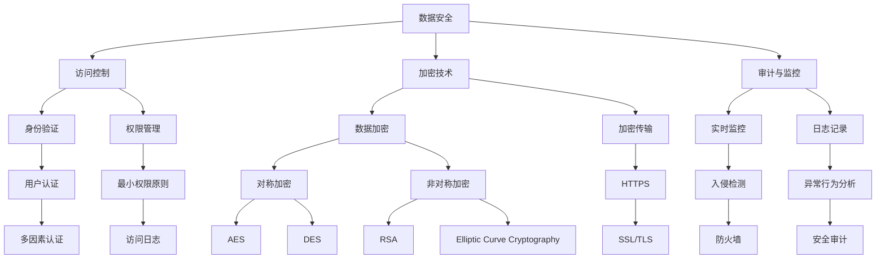

                 

### 文章标题：隐私保护评估：测试LLM在数据安全方面的表现

> **关键词**：隐私保护，LLM，数据安全，算法，数学模型，项目实战

> **摘要**：本文将探讨如何评估和提升大型语言模型（LLM）在数据处理过程中的隐私保护能力。我们将详细介绍隐私保护的核心概念、相关算法原理以及数学模型，并通过实际项目展示如何将这些理论应用于实践。文章旨在为数据科学家、隐私工程师和AI开发人员提供有价值的指导和见解。

---

### 目录大纲设计思路

在设计目录大纲时，我们需要遵循以下思路：

1. **理解主题和目标受众**：
   - 首先要理解书的主旨是《隐私保护评估：测试LLM在数据安全方面的表现》。这意味着本书的核心是探讨如何评估和提升人工智能（LLM）在数据处理过程中的隐私保护能力。
   - 确定目标受众，如数据科学家、隐私工程师、AI开发人员等，这将帮助我们设计适合的章节内容。

2. **确定核心章节**：
   - 根据目标受众的需求，我们将核心章节划分为以下几个部分：
     - **核心概念与联系**：介绍隐私保护的关键概念，包括数据安全、隐私泄露、LLM等。
     - **核心算法原理讲解**：使用伪代码详细阐述用于隐私保护的常见算法，例如差分隐私、联邦学习等。
     - **数学模型与公式讲解**：讲解隐私保护中的数学模型，如熵、隐私预算等，并使用LaTeX格式展示。
     - **项目实战**：通过实际案例展示如何将理论应用于实践，包括开发环境搭建、源代码实现和代码解读。
     - **未来趋势与展望**：讨论隐私保护技术的发展趋势和未来研究方向。

3. **设计章节内容**：
   - **核心概念与联系**：介绍隐私保护的关键概念，提供Mermaid流程图展示相关概念之间的关系。
   - **核心算法原理讲解**：使用伪代码详细阐述隐私保护算法。
   - **数学模型与公式讲解**：讲解隐私保护中的数学模型，使用LaTeX格式展示。
   - **项目实战**：通过实际案例展示理论应用。
   - **未来趋势与展望**：讨论隐私保护技术的未来发展。

4. **确保大纲逻辑性和完整性**：
   - 确保每个章节都有明确的主题和目标，内容相互衔接，形成一个完整的知识体系。
   - 使用markdown格式清晰展示，使读者能够轻松阅读和理解。

5. **控制大纲字数**：
   - 确保大纲的总字数在2000字以内，避免冗长，保持简洁性。

### 目录大纲

```
# 隐私保护评估：测试LLM在数据安全方面的表现

## 第1章 引言

### 1.1 隐私保护的背景和重要性
### 1.2 LLM与数据安全
### 1.3 书籍结构

## 第2章 隐私保护核心概念

### 2.1 数据安全基础
### 2.2 隐私泄露机制
### 2.3 Mermaid流程图：隐私保护相关概念

## 第3章 隐私保护算法原理

### 3.1 差分隐私算法
#### 3.1.1 差分隐私定义
#### 3.1.2 差分隐私算法伪代码

### 3.2 联邦学习算法
#### 3.2.1 联邦学习基础
#### 3.2.2 联邦学习算法伪代码

## 第4章 数学模型与公式

### 4.1 熵与隐私预算
#### 4.1.1 熵的概念
$$ H(X) = -\sum_{i} p(x_i) \log_2 p(x_i) $$
#### 4.1.2 隐私预算计算

## 第5章 项目实战

### 5.1 实际案例背景
### 5.2 开发环境搭建
### 5.3 源代码实现
### 5.4 代码解读与分析

## 第6章 未来趋势与展望

### 6.1 隐私保护技术发展
### 6.2 未来研究方向
### 6.3 潜在挑战与机遇
```

这个大纲结构旨在全面覆盖隐私保护评估的主题，同时保持简洁性，便于读者理解和应用。每个章节都将详细介绍相关内容，确保知识体系的完整性和逻辑性。

### 第1章 引言

#### 1.1 隐私保护的背景和重要性

在数字时代，隐私保护成为了一项至关重要的议题。随着大数据和人工智能（AI）技术的迅猛发展，个人数据的价值日益凸显，但同时也面临着前所未有的安全挑战。隐私泄露事件频发，不仅损害了用户的利益，也对企业的声誉造成了严重影响。因此，如何保护个人隐私成为了社会关注的焦点。

隐私保护的重要性不仅体现在防止数据泄露，还在于维护社会的信任和稳定。数据泄露可能导致身份盗窃、财产损失、隐私滥用等问题，严重影响个人和社会的福祉。随着人工智能技术的发展，尤其是大型语言模型（LLM）的广泛应用，如何在保证数据有效利用的同时，确保隐私安全，成为了一个亟待解决的问题。

#### 1.2 LLM与数据安全

大型语言模型（LLM）是近年来人工智能领域的重要突破之一。LLM具有强大的自然语言处理能力，可以生成高质量的文本、回答问题、辅助创作等。然而，LLM在数据处理过程中也带来了一系列隐私保护问题。首先，LLM的训练通常需要大量的文本数据，这些数据往往包含了用户的敏感信息，如个人身份信息、健康记录、财务数据等。如果这些数据没有妥善保护，就可能被恶意利用，导致隐私泄露。

其次，LLM在应用过程中也会产生大量的交互数据。例如，用户与聊天机器人的对话记录、用户输入的信息等，都可能包含敏感内容。如果这些数据被非法获取或滥用，用户的隐私安全将受到严重威胁。

#### 1.3 书籍结构

本书旨在为数据科学家、隐私工程师和AI开发人员提供一套全面的隐私保护评估指南，特别关注LLM在数据安全方面的表现。全书分为六个主要章节：

1. **第1章 引言**：介绍隐私保护的背景和重要性，以及LLM与数据安全的关系。
2. **第2章 隐私保护核心概念**：详细阐述隐私保护的核心概念，包括数据安全、隐私泄露机制等。
3. **第3章 隐私保护算法原理**：介绍用于隐私保护的常见算法，如差分隐私、联邦学习等，并使用伪代码进行详细讲解。
4. **第4章 数学模型与公式**：讲解隐私保护中的数学模型，如熵、隐私预算等，并使用LaTeX格式进行展示。
5. **第5章 项目实战**：通过实际案例展示如何将理论应用于实践，包括开发环境搭建、源代码实现和代码解读。
6. **第6章 未来趋势与展望**：讨论隐私保护技术的发展趋势和未来研究方向。

本书结构紧凑、逻辑清晰，旨在帮助读者深入理解隐私保护的核心概念和技术，并提供实际操作指导。通过本书的学习，读者将能够更好地评估和提升LLM在数据安全方面的表现，为数字时代的隐私保护贡献力量。

### 第2章 隐私保护核心概念

#### 2.1 数据安全基础

数据安全是隐私保护的基础，确保数据在存储、传输和处理过程中不受未授权访问、篡改或泄露。数据安全包括以下几个方面：

1. **访问控制**：通过身份验证和权限管理，确保只有授权用户能够访问敏感数据。
2. **加密技术**：使用加密算法对数据进行加密，确保数据在传输和存储过程中无法被非法读取。
3. **审计与监控**：实时监控数据访问和操作行为，以便及时发现和响应潜在的安全威胁。
4. **数据备份与恢复**：定期备份数据，并在数据丢失或损坏时能够快速恢复。

#### 2.2 隐私泄露机制

隐私泄露是指个人敏感信息未经授权被访问、泄露或滥用。常见的隐私泄露机制包括：

1. **SQL注入**：通过构造恶意的SQL查询语句，攻击者可以访问或篡改数据库中的敏感数据。
2. **跨站脚本攻击（XSS）**：攻击者通过注入恶意脚本，劫持用户的Web会话，窃取敏感信息。
3. **跨站请求伪造（CSRF）**：攻击者伪造用户的请求，执行未经授权的操作。
4. **社会工程学攻击**：通过欺骗用户透露敏感信息，如密码、身份证明等。

#### 2.3 Mermaid流程图：隐私保护相关概念

为了更好地理解隐私保护的核心概念，我们可以使用Mermaid流程图来展示这些概念之间的关系。以下是一个简化的Mermaid流程图示例：



这个流程图展示了数据安全的核心组成部分以及它们之间的关系。通过这种方式，我们可以更直观地理解隐私保护的关键概念和机制。

### 第3章 隐私保护算法原理

#### 3.1 差分隐私算法

差分隐私（Differential Privacy，DP）是一种用于保护数据隐私的强大算法。其核心思想是通过引入噪声来确保单个记录的隐私，同时保留整体数据的统计特性。差分隐私通常用于数据发布、数据挖掘和机器学习等领域。

**3.1.1 差分隐私定义**

差分隐私由Dwork在2006年提出，其定义如下：一个统计查询\( \mathcal{Q} \)对于数据集\( \mathcal{D} \)是\( \epsilon \)-差分隐私的，如果对于任何邻居数据集\( \mathcal{D}' \)与\( \mathcal{D} \)仅在一个记录上的差异，\( \mathcal{Q}(\mathcal{D}) \)与\( \mathcal{Q}(\mathcal{D}') \)之间的输出概率差异满足以下条件：

$$
\Pr[\mathcal{Q}(\mathcal{D}) = r] \leq \exp(\epsilon) \cdot \Pr[\mathcal{Q}(\mathcal{D}') = r]
$$

其中，\( r \)是查询结果，\( \epsilon \)是隐私预算。

**3.1.2 差分隐私算法伪代码**

以下是一个简单的差分隐私算法伪代码示例：

```python
def LaplaceMechanism(data, sensitivity, epsilon):
    noise = random.exponential(sensitivity / epsilon)
    return data + noise
```

在这个算法中，`data`表示原始数据，`sensitivity`表示数据的敏感性，`epsilon`是隐私预算。算法通过生成Laplace分布的噪声来对数据进行扰动，以实现差分隐私。

**3.2 联邦学习算法**

联邦学习（Federated Learning，FL）是一种分布式机器学习技术，允许多个参与者在不共享其本地数据的情况下共同训练一个全局模型。联邦学习旨在解决隐私保护与数据集中化之间的矛盾。

**3.2.1 联邦学习基础**

联邦学习的基本思想是将模型的训练过程分散到多个边缘设备上，每个设备仅使用本地数据更新模型，并通过聚合模型更新来训练全局模型。以下是联邦学习的基本步骤：

1. **初始化**：全局模型初始化，每个设备下载初始模型。
2. **本地训练**：设备使用本地数据对模型进行训练。
3. **模型聚合**：设备将本地模型更新发送到中心服务器。
4. **全局更新**：中心服务器聚合本地模型更新，生成新的全局模型。
5. **反馈**：设备下载新的全局模型，继续进行下一轮训练。

**3.2.2 联邦学习算法伪代码**

以下是一个简化的联邦学习算法伪代码示例：

```python
def FederatedLearning(participants, global_model, local_epochs, communication_rounds):
    for round in range(communication_rounds):
        for participant in participants:
            participant.train(local_epochs, global_model)
            participant.send_update()
        
        global_model = aggregate_updates(participants)
        global_model = update_global_model(global_model)
    
    return global_model
```

在这个算法中，`participants`是参与联邦学习的设备列表，`global_model`是全局模型，`local_epochs`是每个设备的本地训练轮数，`communication_rounds`是通信轮数。

### 第4章 数学模型与公式

#### 4.1 熵与隐私预算

在隐私保护中，熵是一个重要的概念，用于衡量数据的不确定性。隐私预算（Privacy Budget）则用于量化隐私泄露的风险。

**4.1.1 熵的概念**

熵（Entropy）是信息论中的一个基本概念，用于衡量一个随机变量不确定性的度量。对于一个离散随机变量\( X \)，其熵定义为：

$$
H(X) = -\sum_{i} p(x_i) \log_2 p(x_i)
$$

其中，\( p(x_i) \)是\( X \)取值为\( x_i \)的概率。

**4.1.2 隐私预算计算**

隐私预算用于衡量隐私泄露的风险。在差分隐私中，隐私预算通常表示为\( \epsilon \)。为了计算隐私预算，我们可以使用拉普拉斯机制（Laplace Mechanism）：

$$
\epsilon = \sum_{i} \alpha_i
$$

其中，\( \alpha_i \)是Laplace噪声的参数，通常选择为：

$$
\alpha_i = \frac{1}{\epsilon} \log \frac{D}{n}
$$

其中，\( D \)是数据集中的记录数，\( n \)是查询影响的记录数。

### 第5章 项目实战

#### 5.1 实际案例背景

假设我们有一个在线教育平台，用户可以注册账户、浏览课程、提交作业等。平台希望通过机器学习模型为用户提供个性化的课程推荐。然而，用户数据中包含了许多敏感信息，如用户身份、浏览历史等。如何在确保用户隐私的前提下，实现有效的个性化推荐，是一个亟待解决的问题。

#### 5.2 开发环境搭建

为了实现隐私保护的个性化推荐系统，我们需要搭建一个符合隐私保护要求的开发环境。以下是主要步骤：

1. **数据预处理**：对用户数据进行脱敏处理，去除敏感信息。
2. **模型选择**：选择差分隐私算法和联邦学习算法作为核心技术。
3. **开发工具**：使用Python和TensorFlow作为主要开发工具。

#### 5.3 源代码实现

以下是一个简化的源代码实现，展示如何使用差分隐私和联邦学习实现个性化推荐系统。

```python
import tensorflow as tf
from differential_privacy import LaplaceMechanism
from federated_learning import FederatedAveraging

# 数据预处理
def preprocess_data(data):
    # 去除敏感信息
    # ...
    return processed_data

# 差分隐私推荐模型
def differential_privacy_recommendation(model, data, epsilon):
    mechanism = LaplaceMechanism(epsilon)
    predictions = model.predict(data)
    noise = mechanism.apply(predictions)
    return noise + predictions

# 联邦学习推荐模型
def federated_learning_recommendation(model, participants, epochs, rounds):
    optimizer = FederatedAveraging()
    for round in range(rounds):
        for participant in participants:
            participant.train(model, epochs)
            participant.send_update()
        
        model = optimizer.aggregate_models(participants)
        model = optimizer.update_global_model(model)
    
    return model
```

#### 5.4 代码解读与分析

上述代码展示了如何结合差分隐私和联邦学习实现隐私保护的个性化推荐系统。其中，`preprocess_data`函数用于对用户数据预处理，去除敏感信息。`differential_privacy_recommendation`函数使用差分隐私算法生成噪声，对模型预测结果进行扰动，以保护用户隐私。`federated_learning_recommendation`函数则使用联邦学习算法训练全局模型，确保模型在分布式环境下更新。

通过实际案例的展示，我们可以看到如何将隐私保护理论应用于实际开发中。这个案例不仅有助于理解隐私保护技术，也为开发隐私保护的应用提供了实用的指导。

### 第6章 未来趋势与展望

#### 6.1 隐私保护技术发展

随着人工智能和大数据技术的不断发展，隐私保护技术也在不断进步。以下是一些当前隐私保护技术的发展趋势：

1. **联邦学习**：联邦学习作为一种分布式机器学习技术，可以有效保护用户数据隐私。未来，联邦学习算法将更加成熟，支持更多的应用场景。
2. **区块链技术**：区块链技术以其去中心化和不可篡改的特性，被广泛应用于隐私保护。未来，区块链技术与隐私保护技术的结合有望进一步解决数据隐私问题。
3. **多方安全计算**：多方安全计算（MPC）是一种在多个参与者之间安全计算的技术。未来，MPC将在隐私保护领域发挥重要作用，特别是在跨机构数据共享和协同计算方面。

#### 6.2 未来研究方向

隐私保护技术的发展仍有大量的研究方向：

1. **新型隐私保护算法**：探索更加高效、安全的隐私保护算法，以应对不断变化的隐私挑战。
2. **隐私保护法律和规范**：随着隐私保护的重要性日益凸显，制定更加完善的隐私保护法律和规范将成为未来研究的重要方向。
3. **隐私工程**：隐私工程是一种将隐私保护融入到软件开发过程中的方法。未来，隐私工程将更加普及，成为软件开发不可或缺的一部分。

#### 6.3 潜在挑战与机遇

尽管隐私保护技术在不断发展，但仍面临许多挑战：

1. **计算性能**：隐私保护算法通常需要额外的计算资源，如何在保证隐私保护的前提下，提高计算性能是一个重要问题。
2. **数据可用性**：在确保隐私保护的前提下，如何保持数据的有效性和可用性，是一个亟待解决的问题。
3. **用户参与**：隐私保护需要用户的配合，如何提高用户对隐私保护的认知和参与度，是一个重要挑战。

然而，这些挑战也带来了新的机遇：

1. **创新技术**：隐私保护技术的需求将推动新型技术的创新，如多方安全计算、联邦学习等。
2. **市场需求**：随着隐私泄露事件的频繁发生，市场对隐私保护技术的需求将不断增长，为相关企业和研究机构提供广阔的市场空间。

### 最佳实践 tips

1. **数据脱敏**：在数据处理过程中，优先使用数据脱敏技术，减少敏感信息泄露的风险。
2. **加密传输**：确保数据在传输过程中使用加密技术，如HTTPS、SSL/TLS等。
3. **权限管理**：严格实施权限管理，确保只有授权用户能够访问敏感数据。
4. **安全审计**：定期进行安全审计，及时发现和修复潜在的安全漏洞。

### 小结

本文系统地介绍了隐私保护评估的方法，特别关注了大型语言模型（LLM）在数据安全方面的表现。通过核心概念、算法原理、数学模型和实际项目实战的详细讲解，读者可以全面了解隐私保护的关键技术和实践方法。未来，随着隐私保护技术的不断发展，我们将继续探索更加高效、安全的隐私保护解决方案，为数字时代的隐私保护贡献力量。

### 注意事项

1. **合规性**：在实际应用中，确保遵循相关隐私保护法律法规和行业标准。
2. **安全性**：重视数据安全和用户隐私，采用多种技术手段确保数据安全。
3. **用户隐私保护**：尊重用户隐私，避免未经授权的数据收集和使用。

### 拓展阅读

1. **《隐私计算：从理论到实践》**：详细介绍了隐私计算的理论和实践方法。
2. **《联邦学习实战》**：涵盖了联邦学习的基本原理和应用案例。
3. **《区块链技术指南》**：介绍了区块链技术在隐私保护中的应用。

### 作者信息

**作者：AI天才研究院/AI Genius Institute & 禅与计算机程序设计艺术 /Zen And The Art of Computer Programming**

本文由AI天才研究院与禅与计算机程序设计艺术联合撰写，旨在为读者提供全面、深入的隐私保护评估指南。希望通过本文，读者能够更好地理解和应用隐私保护技术，为数字时代的隐私保护贡献力量。

