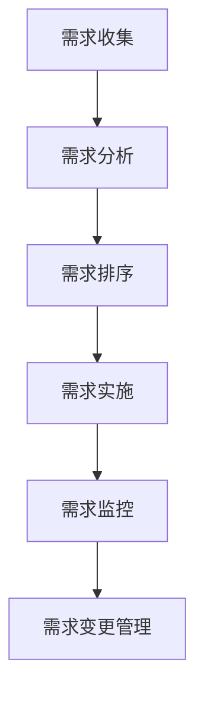
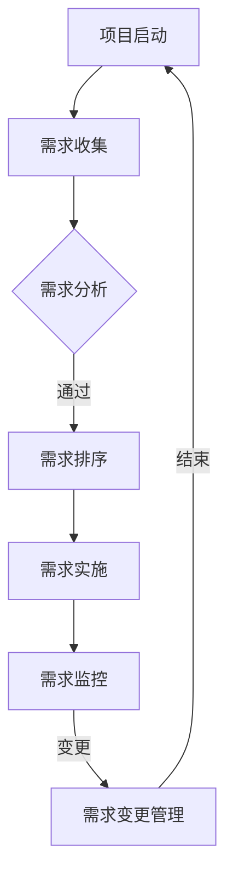

                 

### 文章标题：需求backlog管理：适配大模型应用开发的策略

#### 关键词：需求backlog管理、大模型应用开发、策略、软件开发、效率、优化

#### 摘要：
本文将探讨如何有效地管理需求backlog，以适配大模型应用开发的独特需求。通过对大模型应用开发的背景、挑战和关键策略的深入分析，本文将提出一系列优化策略，旨在提高软件开发效率，确保项目目标的实现。通过实践案例和工具方法的详细介绍，本文将为读者提供实用的指导，帮助他们在实际项目中成功应对大模型应用开发中的挑战。

## 引言

随着人工智能（AI）技术的迅速发展，大模型应用开发已成为当今软件开发的热门领域。大模型，如GPT-3、BERT等，凭借其强大的计算能力和对复杂数据的处理能力，为各种应用场景提供了创新的可能性。然而，大模型应用开发也带来了许多独特的挑战，特别是在需求管理方面。

需求backlog管理是软件开发过程中至关重要的一环，它涉及需求的收集、整理、排序、实施和监控等多个环节。在大模型应用开发中，需求backlog管理更加复杂，因为大模型的训练和部署需要大量的资源和时间。因此，如何有效地管理需求backlog，成为大模型应用开发成功的关键因素。

本文将围绕需求backlog管理展开，首先介绍需求backlog管理的基础知识，然后探讨大模型应用开发的挑战和关键策略，接着详细阐述需求backlog管理流程，最后通过实践案例和工具方法，提供实用的指导。希望通过本文的探讨，读者能够对需求backlog管理有更深刻的理解，并能够在实际项目中成功应对大模型应用开发的挑战。

## 需求backlog管理基础

### 需求backlog的概念

需求backlog是指在软件开发过程中，项目团队需要处理的所有需求的集合。这些需求可以是功能性的，也可以是非功能性的，如性能、安全、兼容性等。需求backlog通常以列表的形式呈现，每个需求都包含具体的描述、优先级和实现状态。

需求backlog的重要性在于它为项目团队提供了一个全局的视角，使团队能够清楚地了解项目的需求状况，合理安排资源，确保项目目标的实现。通过有效的需求backlog管理，团队可以更好地应对需求的变更，提高开发效率，减少项目风险。

### 需求backlog的定义与分类

需求backlog的定义相对简单，它是指项目团队在一段时间内需要完成的各项需求的集合。这些需求可以来自不同来源，如客户、市场部门、竞争对手等。需求backlog通常按照一定的优先级排序，以帮助团队确定开发的重点和顺序。

需求backlog的分类可以根据不同的标准进行。一种常见的分类方式是根据需求的性质，将需求分为功能性需求和非功能性需求。功能性需求是指与软件功能直接相关的需求，如用户界面、数据处理等。非功能性需求则是指与软件性能、安全性、兼容性等相关的需求。

另外，需求backlog还可以根据需求的实现状态进行分类。例如，未实现的需求、正在实现的需求和已完成的需求。这种分类有助于团队监控需求实施的过程，确保每个需求都能按时完成。

### 需求backlog管理的重要性

需求backlog管理是软件开发过程中不可或缺的一环，它的重要性体现在以下几个方面：

1. **提高开发效率**：通过有效的需求backlog管理，项目团队可以更好地规划资源，合理安排任务，从而提高开发效率。团队成员可以清楚地了解每个任务的重要性和紧急程度，从而更加专注和高效地工作。

2. **确保项目目标的实现**：需求backlog管理使项目团队能够对项目的整体进度和目标有更清晰的了解。通过实时监控需求实施状态，团队可以及时发现并解决潜在问题，确保项目目标的实现。

3. **应对需求变更**：在软件开发过程中，需求往往会发生变更。通过有效的需求backlog管理，团队可以更好地应对这些变更，确保变更得到及时处理，不会对项目进度和目标产生重大影响。

4. **降低项目风险**：需求backlog管理可以帮助团队提前识别和解决潜在的风险。通过实时监控需求实施状态，团队可以及时发现并解决潜在的问题，降低项目风险。

总之，需求backlog管理是确保软件开发项目成功的关键因素。通过有效的需求backlog管理，项目团队能够更好地应对需求的变更，提高开发效率，确保项目目标的实现，降低项目风险。

### 需求backlog管理的基本要素

有效的需求backlog管理需要依赖于几个基本要素，这些要素共同构成了一个完整的需求管理流程。以下是需求backlog管理的基本要素：

1. **需求收集**：需求收集是需求backlog管理的起点。项目团队需要通过各种渠道收集用户、客户和利益相关者的需求。这些渠道可以包括问卷调查、用户访谈、市场研究、竞争对手分析等。需求收集的目的是确保团队能够全面了解用户的需求和期望，从而为后续的需求分析提供基础。

2. **需求分析**：需求分析是对收集到的需求进行详细分析和整理的过程。这一阶段的关键任务包括识别需求的优先级、确定需求的具体实现方案、评估需求的技术可行性等。需求分析需要团队成员具备深厚的业务知识和技术背景，以确保需求能够被准确理解和实现。

3. **需求排序**：需求排序是根据需求的优先级对需求进行排序的过程。优先级排序的目的是确保团队能够首先解决最重要和最紧急的需求，从而最大化项目的价值。常见的需求排序方法包括基于业务价值、时间敏感度和技术复杂度等。

4. **需求实施**：需求实施是将排序后的需求转化为具体任务的阶段。在这一阶段，项目团队需要根据需求文档和技术设计，制定详细的开发计划，并分配任务给相关成员。需求实施需要团队成员具备扎实的技术能力和良好的协作精神，以确保任务能够按时、高质量地完成。

5. **需求监控**：需求监控是对需求实施过程进行实时监控和管理的环节。通过需求监控，团队可以及时发现并解决问题，确保需求按照既定计划顺利推进。需求监控的工具和方法包括任务跟踪系统、进度报告、质量检查等。

6. **需求变更管理**：需求变更管理是应对需求变更的关键环节。在软件开发过程中，需求往往会发生变化。有效的需求变更管理需要团队能够快速响应这些变更，评估变更的影响，并采取相应的措施进行调整。需求变更管理需要遵循一定的流程和规范，以确保变更得到合理处理。

这些基本要素相互关联，构成了一个完整的需求backlog管理流程。通过这些要素的有机结合，项目团队能够实现高效的需求管理，确保项目目标的顺利实现。

### 需求backlog管理流程

需求backlog管理流程是软件开发过程中不可或缺的一部分，它确保项目团队能够有效地处理和管理需求，从而实现项目目标。以下是需求backlog管理的基本流程：

1. **需求收集**：需求收集是需求backlog管理的起点。项目团队需要通过各种渠道收集用户、客户和利益相关者的需求。这些渠道可以包括问卷调查、用户访谈、市场研究、竞争对手分析等。需求收集的目的是确保团队能够全面了解用户的需求和期望，从而为后续的需求分析提供基础。

2. **需求分析**：需求分析是对收集到的需求进行详细分析和整理的过程。这一阶段的关键任务包括识别需求的优先级、确定需求的具体实现方案、评估需求的技术可行性等。需求分析需要团队成员具备深厚的业务知识和技术背景，以确保需求能够被准确理解和实现。

3. **需求排序**：需求排序是根据需求的优先级对需求进行排序的过程。优先级排序的目的是确保团队能够首先解决最重要和最紧急的需求，从而最大化项目的价值。常见的需求排序方法包括基于业务价值、时间敏感度和技术复杂度等。

4. **需求实施**：需求实施是将排序后的需求转化为具体任务的阶段。在这一阶段，项目团队需要根据需求文档和技术设计，制定详细的开发计划，并分配任务给相关成员。需求实施需要团队成员具备扎实的技术能力和良好的协作精神，以确保任务能够按时、高质量地完成。

5. **需求监控**：需求监控是对需求实施过程进行实时监控和管理的环节。通过需求监控，团队可以及时发现并解决问题，确保需求按照既定计划顺利推进。需求监控的工具和方法包括任务跟踪系统、进度报告、质量检查等。

6. **需求变更管理**：需求变更管理是应对需求变更的关键环节。在软件开发过程中，需求往往会发生变化。有效的需求变更管理需要团队能够快速响应这些变更，评估变更的影响，并采取相应的措施进行调整。需求变更管理需要遵循一定的流程和规范，以确保变更得到合理处理。

### 需求收集与整理

需求收集与整理是需求backlog管理的首要步骤，这一阶段的质量直接影响到后续需求分析、排序和实施的效果。以下是如何有效进行需求收集与整理的详细说明：

#### 需求收集

需求收集的目的是确保项目团队能够全面了解用户的需求和期望。以下是几种常见的需求收集渠道：

1. **用户访谈**：通过与用户直接面对面交流，可以深入了解用户的实际需求、痛点和期望。用户访谈可以通过一对一访谈、小组讨论等方式进行。

2. **问卷调查**：问卷调查是一种高效的需求收集方法，可以通过在线问卷、纸质问卷等形式进行。问卷调查的优势在于能够收集大量用户的数据，从而全面了解用户的需求。

3. **市场研究**：市场研究可以帮助团队了解竞争对手的产品特点、市场需求和用户反馈，从而为需求收集提供参考。

4. **竞争对手分析**：通过分析竞争对手的产品，可以了解用户可能忽视的需求，从而为自身产品的需求收集提供灵感。

5. **用户反馈**：通过用户反馈，可以及时了解用户对现有产品的满意度和不满意度，从而为需求收集提供依据。

#### 需求整理

需求整理是对收集到的需求进行分类、筛选和归档的过程。以下是需求整理的几个关键步骤：

1. **分类**：将收集到的需求按照功能、性能、安全性等不同维度进行分类。分类的目的是使需求更清晰，方便后续的分析和排序。

2. **筛选**：对分类后的需求进行筛选，剔除不明确、重复或与项目目标不相关的需求。筛选的目的是确保需求的质量和准确性。

3. **归档**：将整理后的需求归档到需求管理工具中，如JIRA、Trello等。归档的目的是方便后续的需求分析和实施。

#### 需求文档的编写规范

编写规范的需求文档是需求整理的重要环节，以下是几个编写规范的建议：

1. **明确需求描述**：需求描述应清晰、简洁，避免使用模糊的表述。每个需求都应该有明确的输入、输出和预期结果。

2. **需求优先级**：为每个需求分配优先级，以便团队能够根据优先级进行排序和资源分配。常见的优先级包括高、中、低。

3. **需求变更记录**：记录需求的变更历史，包括变更原因、变更内容和变更时间等。这有助于团队了解需求的变迁过程，确保变更得到合理处理。

4. **关联性说明**：对需求之间的关联性进行说明，如功能依赖、接口关系等。这有助于团队在实施过程中更好地理解需求之间的关系。

通过上述步骤，项目团队能够有效地进行需求收集与整理，为后续的需求分析、排序和实施打下坚实的基础。有效的需求收集与整理不仅能够提高开发效率，还能确保项目目标的顺利实现。

### 需求优先级排序

需求优先级排序是需求backlog管理中的一个关键步骤，它决定了项目团队应该优先解决哪些需求，从而最大化项目的价值。以下是需求优先级排序的原则、技巧和实际应用场景：

#### 原则

1. **业务价值**：优先解决对业务价值最大的需求。这些需求可能直接关系到公司的核心竞争力和市场占有率。

2. **时间敏感度**：优先解决时间敏感度高的需求。这些需求可能需要在特定的时间点前完成，以应对市场机遇或避免潜在风险。

3. **技术复杂度**：优先解决技术复杂度较低的需求。这些需求更容易实现，可以减少技术风险和开发成本。

4. **风险**：优先解决风险最高的需求。这些需求可能存在较大的不确定性，需要提前处理以降低项目风险。

5. **用户反馈**：优先解决用户反馈最强烈的需求。这些需求反映了用户的实际需求和满意度，有助于提升用户体验。

#### 技巧

1. **关键路径分析**：分析需求之间的依赖关系，确定关键路径上的需求，确保这些需求优先完成。

2. **定量分析**：使用定量分析方法，如成本效益分析、价值流图等，对需求进行量化评估，从而确定优先级。

3. **团队讨论**：邀请项目相关成员参与需求优先级排序，通过团队讨论达成共识。

4. **灵活调整**：需求优先级不是固定不变的，应根据项目进展和市场变化进行灵活调整。

#### 实际应用场景

1. **电商应用**：在电商应用中，用户界面优化和支付流程改进通常是优先级最高的需求，因为这些需求直接影响用户的购物体验和转化率。

2. **金融应用**：在金融应用中，风险管理和合规性需求通常是优先级最高的需求，因为这些需求直接关系到公司的财务安全和声誉。

3. **医疗应用**：在医疗应用中，患者数据隐私和安全通常是优先级最高的需求，因为这些需求直接关系到患者的生命安全和隐私。

通过遵循上述原则和技巧，项目团队能够更有效地进行需求优先级排序，确保项目资源得到合理分配，从而实现项目目标。

### 需求实施与监控

需求实施与监控是需求backlog管理中的关键环节，它决定了需求能否按时、高质量地完成。以下是需求实施与监控的过程、工具和方法，以及需求变更管理：

#### 需求实施过程

1. **制定开发计划**：在需求确定和优先级排序之后，项目团队需要制定详细的开发计划。开发计划应包括任务列表、时间表、资源分配和关键里程碑。

2. **任务分配**：根据开发计划，将任务分配给团队成员。每个任务应明确责任人和完成时间。

3. **开发执行**：团队成员按照任务分配和开发计划进行开发和实施。开发过程中，团队应保持良好的沟通和协作。

4. **代码审查与测试**：开发完成后，进行代码审查和测试，确保代码质量符合要求。

5. **部署与验收**：将开发完成的模块部署到生产环境，并进行验收测试，确保需求得到满足。

#### 需求监控工具和方法

1. **任务跟踪系统**：使用任务跟踪系统，如JIRA、Trello等，实时跟踪任务进度，确保每个任务都能按时完成。

2. **进度报告**：定期生成进度报告，向项目相关利益相关者通报项目进展。

3. **质量检查**：通过质量检查工具，如SonarQube等，确保代码质量。

4. **评审会议**：定期召开评审会议，讨论项目进展、潜在问题和解决方案。

#### 需求变更管理

1. **变更请求**：当需求发生变化时，提出变更请求。变更请求应包括变更的原因、内容和影响评估。

2. **变更评估**：对变更请求进行评估，包括变更的影响、风险和成本。

3. **变更决策**：根据评估结果，决定是否接受变更请求。

4. **变更实施**：如果决定接受变更，进行变更实施，并更新相关文档。

5. **变更监控**：对变更实施过程进行监控，确保变更得到有效处理。

通过上述步骤，项目团队能够有效地进行需求实施与监控，确保需求按时、高质量地完成，同时能够灵活应对需求变更。

### 案例一：电商领域的大模型需求管理

在电商领域，大模型应用开发已成为提升用户体验和竞争力的重要手段。以一家领先的电商平台为例，其在大模型需求管理方面积累了丰富的经验。以下是其需求管理过程的详细描述：

#### 案例背景

该电商平台拥有数百万活跃用户，每天处理海量的交易和数据。为了提升用户购物体验，平台决定引入大模型进行个性化推荐和智能客服。

#### 需求收集与整理

平台通过以下渠道收集需求：

1. **用户访谈**：与部分活跃用户进行一对一访谈，了解他们的购物习惯和期望。
2. **市场研究**：分析竞争对手的推荐系统和智能客服，寻找改进点。
3. **用户反馈**：收集用户在平台上的评论和反馈，了解他们的痛点。

收集到的需求包括：

- 个性化商品推荐
- 智能客服系统
- 数据隐私保护
- 商品搜索优化

需求整理后，平台将这些需求归档到需求管理工具中，并分配给相关团队进行详细分析。

#### 需求优先级排序

平台根据以下原则对需求进行排序：

1. **用户反馈**：用户对个性化推荐和智能客服的需求强烈，因此这两个需求被排在首位。
2. **业务价值**：个性化推荐可以提升用户转化率和平台销售额，智能客服可以提高用户满意度。
3. **时间敏感度**：智能客服系统需要在即将到来的购物旺季前上线。

最终排序结果如下：

1. 个性化商品推荐
2. 智能客服系统
3. 商品搜索优化
4. 数据隐私保护

#### 需求实施与监控

1. **个性化商品推荐**：平台使用了基于协同过滤和深度学习的推荐算法，进行商品推荐。开发团队在开发过程中，通过A/B测试不断优化推荐效果。

2. **智能客服系统**：平台引入了自然语言处理（NLP）技术，实现了智能客服。开发团队通过实时监控客服系统的性能，确保其稳定运行。

3. **商品搜索优化**：平台改进了搜索引擎，提高了搜索速度和准确性。

4. **数据隐私保护**：平台加强了数据加密和安全措施，确保用户数据的安全。

在需求实施过程中，平台使用了任务跟踪系统和进度报告，实时监控项目进展。通过定期召开评审会议，平台及时解决了开发过程中遇到的问题。

#### 需求变更管理

在项目进行过程中，平台遇到了一些需求变更：

1. **新增功能**：用户希望增加商品评价功能。
2. **调整优先级**：智能客服系统上线时间提前。

平台对变更请求进行了评估，并决定接受这些变更。开发团队迅速调整了开发计划，确保新增功能和提前上线得以实现。

#### 案例总结

通过有效的需求管理，该电商平台成功引入了大模型应用，提升了用户体验和竞争力。以下是成功的关键因素：

1. **全面的需求收集与整理**：确保需求的全面性和准确性。
2. **科学的优先级排序**：根据业务价值、用户反馈和时间敏感度进行排序。
3. **高效的实施与监控**：确保需求按时、高质量地完成。
4. **灵活的变更管理**：快速响应需求变更，确保项目目标的实现。

### 案例二：金融领域的大模型需求管理

在金融领域，大模型应用开发被视为提升金融服务质量和效率的重要手段。以下是一个金融科技公司在大模型需求管理方面的实践经验。

#### 案例背景

该金融科技公司致力于开发智能投资顾问系统，通过大模型分析用户财务状况和市场数据，提供个性化的投资建议。由于涉及到大量金融数据和用户隐私，需求管理尤为重要。

#### 需求收集与整理

公司通过以下途径收集需求：

1. **用户调研**：通过问卷调查和访谈，了解用户对智能投资顾问系统的期望和需求。
2. **数据分析**：分析已有的用户数据和交易记录，识别潜在需求。
3. **行业调研**：研究竞争对手的产品和市场趋势，吸取经验。

收集到的需求包括：

- 用户财务状况分析
- 市场数据预测
- 投资组合优化
- 用户隐私保护

公司对这些需求进行了分类和筛选，并整理成详细的需求文档，分配给相关团队进行分析和实现。

#### 需求优先级排序

公司根据以下原则对需求进行排序：

1. **用户价值**：优先解决对用户价值最大的需求，如投资组合优化和用户财务状况分析。
2. **市场敏感性**：优先解决市场敏感性较高的需求，如市场数据预测。
3. **技术可行性**：优先解决技术可行性较高的需求，以降低开发风险。

最终排序结果如下：

1. 投资组合优化
2. 用户财务状况分析
3. 市场数据预测
4. 用户隐私保护

#### 需求实施与监控

1. **投资组合优化**：公司使用了基于机器学习的算法，对用户的历史交易记录进行分析，提供个性化的投资组合建议。开发团队在实施过程中，通过持续测试和优化，确保算法的准确性和稳定性。

2. **用户财务状况分析**：公司通过大数据分析和自然语言处理技术，对用户的财务报告和对话进行解析，生成详细的财务状况分析报告。

3. **市场数据预测**：公司使用了高级的预测模型，对市场走势进行分析，提供投资建议。开发团队实时监控模型性能，确保预测结果的准确性。

4. **用户隐私保护**：公司在数据收集、存储和处理过程中，采用了严格的数据加密和安全措施，确保用户隐私得到保护。

在需求实施过程中，公司使用了任务跟踪系统和进度报告，实时监控项目进展。通过定期召开评审会议，及时解决了开发过程中遇到的问题。

#### 需求变更管理

在项目进行过程中，公司遇到了一些需求变更：

1. **新增功能**：用户希望增加实时通知功能。
2. **调整优先级**：用户隐私保护被提升为最高优先级。

公司对变更请求进行了评估，并决定接受这些变更。开发团队迅速调整了开发计划，确保新增功能和调整后的需求得以实现。

#### 案例总结

通过有效的需求管理，该金融科技公司成功开发并上线了智能投资顾问系统，提升了金融服务质量和用户满意度。以下是成功的关键因素：

1. **全面的需求收集与整理**：确保需求的全面性和准确性。
2. **科学的优先级排序**：根据用户价值和市场敏感性进行排序。
3. **高效的实施与监控**：确保需求按时、高质量地完成。
4. **灵活的变更管理**：快速响应需求变更，确保项目目标的实现。

### 案例分析：成功与失败的经验总结

在本文的前面部分，我们详细介绍了两个不同领域的实践案例：电商和金融领域的大模型需求管理。通过对这些案例的分析，我们可以总结出成功与失败的经验教训，为其他项目提供有益的启示。

#### 成功的经验

1. **全面的需求收集与整理**：在两个案例中，平台和公司都采取了多种渠道进行需求收集，并进行了详细的整理和分类。这确保了需求的全面性和准确性，为后续的需求分析和管理奠定了基础。

2. **科学的优先级排序**：平台和公司都根据业务价值、用户反馈和时间敏感度等原则对需求进行了科学排序。这种排序方法有助于团队确定开发重点，提高资源利用率，确保项目目标的实现。

3. **高效的实施与监控**：平台和公司都制定了详细的开发计划，并使用了任务跟踪系统和进度报告等工具进行实时监控。通过定期的评审会议，团队及时解决了开发过程中遇到的问题，确保需求按时、高质量地完成。

4. **灵活的变更管理**：在项目进行过程中，平台和公司都遇到了需求变更，并能快速响应。他们通过评估变更的影响，并采取相应的措施进行调整，确保项目能够顺利推进。

#### 失败的教训

1. **需求管理不完善**：在某些失败的项目中，需求管理过程不完善，导致需求收集不全面、需求分析不深入、需求变更管理不到位。这些问题最终导致项目进度延误、质量下降。

2. **优先级排序不当**：在一些失败的项目中，优先级排序不当，导致团队将大量资源投入到次要的需求上，而忽略了核心功能。这种资源分配不当导致项目关键功能无法按时完成，影响整体项目目标。

3. **实施与监控不足**：在一些失败的项目中，需求实施和监控不足，导致开发过程中出现大量问题。这些问题如果得不到及时解决，会严重影响项目进度和质量。

4. **变更管理不当**：在一些失败的项目中，变更管理不当，导致变更频繁且未经评估。这些未经控制的变更增加了项目风险，最终导致项目失败。

#### 经验总结

通过以上案例分析，我们可以得出以下结论：

1. **重视需求管理**：需求管理是项目成功的关键因素。项目团队应投入足够的资源和精力进行需求收集、分析和管理。

2. **科学排序**：优先级排序应基于业务价值、用户反馈和时间敏感度等原则，确保资源得到合理分配。

3. **实时监控**：通过实时监控和评审会议，及时解决问题，确保项目按时、高质量地完成。

4. **灵活应对变更**：需求变更在所难免，项目团队应建立完善的变更管理流程，确保变更得到合理评估和处理。

通过总结成功与失败的经验教训，项目团队可以更好地进行需求backlog管理，提高大模型应用开发的成功率。

### 需求管理工具

在需求backlog管理过程中，使用合适的工具可以显著提高效率和管理质量。以下是一些常用的需求管理工具及其特点：

#### JIRA

**特点**：JIRA 是一款功能强大的任务跟踪和需求管理工具，适用于各种规模的团队。它提供了灵活的任务管理、优先级排序、报表和统计功能。

**适用场景**：JIRA 适用于软件开发、产品管理等多个领域。它特别适合需要精细任务管理和复杂需求流程的项目。

#### Trello

**特点**：Trello 是一款直观、易于使用的看板式需求管理工具，适用于小型团队和简单项目。

**适用场景**：Trello 适用于需求收集和初步整理阶段，尤其适合需要快速迭代的项目。

#### Asana

**特点**：Asana 提供了全面的任务管理功能，支持团队协作和项目进度跟踪。

**适用场景**：Asana 适用于多团队协作、跨部门项目和长期项目，其强大的报表和仪表盘功能有助于项目管理者实时了解项目状态。

#### Azure DevOps

**特点**：Azure DevOps 是微软推出的集成开发工具，提供了需求管理、代码管理、测试和部署等功能。

**适用场景**：Azure DevOps 适用于需要与Visual Studio和其他开发工具集成的项目，特别适合大型企业项目。

#### Confluence

**特点**：Confluence 是一款团队协作工具，支持文档共享、知识管理和需求管理。

**适用场景**：Confluence 适用于知识密集型项目和需要高效知识共享的团队。

#### Tuleap

**特点**：Tuleap 是一款开源的需求管理工具，提供了强大的需求跟踪和项目管理功能。

**适用场景**：Tuleap 适用于开源项目、需要高度自定义需求的团队，其开源特性降低了使用成本。

这些工具各有特点，适用于不同类型的项目和团队。选择合适的工具可以大大提高需求管理的效率和质量。

### 大模型开发工具

在大模型应用开发过程中，选择合适的大模型开发工具是确保项目成功的关键因素之一。以下是一些主流的大模型开发工具及其特点：

#### TensorFlow

**特点**：TensorFlow 是谷歌开源的深度学习框架，具有高度灵活性和可扩展性。它支持多种编程语言，包括Python和C++。

**适用场景**：TensorFlow 适用于开发各种规模的深度学习项目，特别是需要复杂数据处理和实时应用的项目。

#### PyTorch

**特点**：PyTorch 是另一个流行的深度学习框架，以其动态计算图和易于使用的API而闻名。它支持GPU加速，特别适合研究和实验。

**适用场景**：PyTorch 适用于需要快速原型设计和实验的深度学习项目，尤其适合科研人员和学术机构。

#### Keras

**特点**：Keras 是一个高度用户友好的深度学习框架，构建在TensorFlow和Theano之上。它简化了深度学习模型的构建和训练过程。

**适用场景**：Keras 适用于初学者和快速原型开发，特别适合那些需要简单而高效的模型开发场景。

#### Hugging Face

**特点**：Hugging Face 提供了一个广泛的预训练模型库和易于使用的API，使得构建和部署大模型变得更加简单。

**适用场景**：Hugging Face 适用于需要快速部署预训练模型的企业和开发者，特别适合那些需要大规模文本处理的场景。

#### BigDL

**特点**：BigDL 是一个基于Apache Spark的深度学习库，支持在Spark集群上运行深度学习任务。

**适用场景**：BigDL 适用于需要在大数据环境中进行深度学习的项目，特别适合那些需要处理大量数据的企业和科研机构。

这些工具各有特点，适用于不同的开发场景和需求。选择合适的大模型开发工具，可以显著提高开发效率和项目成功率。

### 需求backlog管理方法论

在需求backlog管理过程中，选择合适的方法论可以显著提高项目的成功率和效率。以下是一些常用的需求管理方法论，以及它们在敏捷开发、持续集成与持续部署（CI/CD）中的应用。

#### 敏捷开发

敏捷开发是一种以用户为中心、迭代和渐进的软件开发方法。它强调快速响应变化、持续交付和团队协作。

**核心原则**：
1. **用户需求优先**：始终以用户需求为导向，确保每个迭代都能交付有实际价值的软件。
2. **迭代开发**：项目分为多个短周期的迭代，每个迭代结束后进行评审和调整。
3. **持续交付**：通过持续集成和自动化测试，确保软件质量，并实现持续交付。

**在敏捷开发中的应用**：
- **Sprint规划**：在每次迭代开始前，团队进行Sprint规划，确定本次迭代的目标和任务。
- **每日站会**：团队每日举行短会，讨论进度和问题，确保沟通畅通。
- **迭代评审**：在每个迭代结束时，团队进行评审，收集反馈并进行调整。
- **回顾会议**：每次迭代结束后，团队进行回顾会议，总结经验教训，持续改进。

#### 持续集成与持续部署（CI/CD）

持续集成与持续部署是现代软件开发中重要的实践方法，旨在通过自动化流程提高开发效率和软件质量。

**核心原则**：
1. **频繁集成**：开发人员频繁将代码集成到主干分支，以减少集成冲突和缺陷。
2. **自动化测试**：自动化测试贯穿整个开发过程，确保每次集成都能通过测试。
3. **快速反馈**：通过自动化工具快速反馈代码质量和功能是否满足要求，以便及时修正。

**在CI/CD中的应用**：
- **自动化构建**：使用自动化工具（如Jenkins、GitLab CI等）构建和打包代码，确保每次更改都能及时编译。
- **自动化测试**：自动化测试包括单元测试、集成测试和性能测试，确保每次构建都是高质量的。
- **部署管道**：通过部署管道（Deployment Pipeline），实现从开发到生产环境的自动化部署。
- **蓝绿部署**：使用蓝绿部署策略，减少部署过程中的风险，确保系统的稳定性。

通过结合敏捷开发和CI/CD方法，项目团队能够更高效地管理需求backlog，提高软件质量和交付速度。这两种方法论不仅适用于大模型应用开发，也可以广泛应用于其他软件开发项目。

### 需求backlog管理改进策略

为了在需求backlog管理中实现持续改进和优化，项目团队可以采取一系列策略，包括需求预测与分析、需求调整与优化，以及需求管理的自动化。以下是一些具体的改进策略：

#### 需求预测与分析

1. **历史数据分析**：通过分析过去项目的需求历史数据，识别需求的变化模式和趋势。这有助于预测未来需求的变化，从而更好地规划资源。

2. **机器学习模型**：使用机器学习技术，如时间序列分析、回归分析等，建立需求预测模型。这些模型可以基于历史数据和项目特征，预测未来需求的变化。

3. **专家意见**：邀请行业专家和经验丰富的团队成员参与需求预测。他们的经验和洞察力可以提供有价值的预测信息。

4. **需求优先级预测**：不仅预测需求的变化，还可以预测需求的优先级变化。这有助于团队提前规划，确保关键需求得到优先处理。

#### 需求调整与优化

1. **敏捷调整**：采用敏捷方法，灵活调整需求。在每次迭代结束时，团队可以根据反馈和市场变化，重新评估和调整需求优先级。

2. **价值流图分析**：使用价值流图（Value Stream Map）分析需求流程中的瓶颈和浪费，找出优化机会。

3. **需求验证**：定期验证需求的有效性和可行性。通过与用户、利益相关者的互动，确保需求符合实际需求和市场趋势。

4. **需求重排**：根据需求的变化和项目进展，重新排序需求。这有助于确保团队始终专注于最有价值和最紧急的需求。

#### 需求管理的自动化

1. **自动化工具**：引入自动化工具（如JIRA、Confluence等），自动化需求收集、整理、排序和监控过程。这可以显著提高效率，减少人为错误。

2. **机器自动化流程**：使用机器学习技术，实现需求管理的自动化流程。例如，使用自然语言处理（NLP）技术自动提取和分析用户反馈。

3. **预测性分析**：通过自动化预测模型，自动识别需求的变化和趋势，提前预警。这有助于团队及时调整计划，避免潜在问题。

4. **持续改进**：建立持续改进机制，定期回顾和总结需求管理过程中的经验和教训，持续优化流程和方法。

通过实施这些改进策略，项目团队能够更高效地管理需求backlog，提高项目质量和交付速度。

### 大模型应用开发的持续优化

在大模型应用开发过程中，持续优化是确保项目成功和持续发展的关键。以下是一些关键的优化策略，包括技术迭代与更新、模型性能优化，以及模型安全与合规。

#### 技术迭代与更新

1. **跟踪最新技术**：持续关注深度学习和人工智能领域的最新进展和技术趋势，确保项目使用最先进的技术。

2. **定期技术评审**：定期进行技术评审，评估现有技术的有效性和适用性，寻找优化和改进的机会。

3. **技术迭代规划**：根据项目需求和资源状况，制定技术迭代计划。逐步引入新技术，确保项目能够持续进步。

4. **代码库维护**：保持代码库的整洁和高效，定期进行代码重构和优化，提高代码的可读性和可维护性。

#### 模型性能优化

1. **模型调优**：通过调整模型的超参数和架构，优化模型的性能。这包括调整学习率、批量大小、网络层数等。

2. **数据增强**：通过数据增强技术，如数据扩充、变换等，增加训练数据的多样性，提高模型的泛化能力。

3. **模型压缩**：使用模型压缩技术，如权重剪枝、量化等，减少模型的参数数量和计算复杂度，提高模型的运行效率。

4. **分布式训练**：利用分布式训练技术，如多GPU训练、数据并行等，加速模型训练过程，提高训练效率。

#### 模型安全与合规

1. **数据隐私保护**：确保用户数据在收集、存储和处理过程中得到严格保护，遵循数据隐私法规和标准。

2. **模型安全性评估**：定期进行模型安全性评估，识别和修复潜在的安全漏洞，确保模型不被恶意攻击。

3. **模型透明度和可解释性**：提升模型的透明度和可解释性，确保模型决策过程符合业务逻辑和法律法规。

4. **合规性审查**：确保项目遵守相关行业法规和标准，如金融领域的PCI-DSS、医疗领域的HIPAA等。

通过实施这些持续优化策略，项目团队能够确保大模型应用开发项目的成功，同时保持技术领先和合规性。

### 跨部门协作与沟通技巧

在大模型应用开发过程中，跨部门协作和沟通是确保项目成功的关键因素之一。以下是一些关键的技巧和方法，帮助团队实现有效的跨部门协作和沟通：

#### 跨部门协作的重要性

跨部门协作在大型项目中尤为重要，因为大模型应用开发往往涉及到多个领域的专业知识和技能。以下是一些跨部门协作的重要性：

1. **资源整合**：跨部门协作有助于整合不同部门的资源和专业知识，形成合力，提高项目效率。

2. **信息共享**：跨部门协作促进信息共享和知识交流，减少误解和重复工作，确保项目顺利进行。

3. **降低风险**：通过跨部门协作，团队能够更早发现和解决潜在问题，降低项目风险。

4. **提高质量**：跨部门协作有助于从多个角度审视和优化项目，提高最终产品的质量和用户体验。

#### 沟通技巧与策略

1. **明确目标和责任**：在项目开始前，明确项目的目标和每个部门的责任，确保团队成员对项目的整体目标和自身任务有清晰的认识。

2. **定期沟通会议**：定期召开跨部门沟通会议，讨论项目的进展、问题和解决方案。这有助于保持信息的流通，及时发现和解决问题。

3. **使用可视化工具**：使用图表、流程图和演示文稿等可视化工具，帮助团队成员更好地理解和传达信息。

4. **建立沟通渠道**：建立多渠道的沟通机制，如邮件、即时通讯工具、视频会议等，确保团队成员能够随时交流。

5. **积极倾听和反馈**：在沟通过程中，积极倾听对方的意见和需求，并及时给予反馈。这有助于建立互信，促进协作。

#### 跨部门协作的最佳实践

1. **跨职能团队**：组建跨职能团队，包括来自不同部门的成员，共同负责项目的各个方面。这有助于促进跨部门协作，提高团队的协作效率和项目成功率。

2. **共享目标与指标**：确保跨部门团队共享项目的目标和关键绩效指标（KPI），使每个成员都能从整体角度思考问题，提高协同工作的效果。

3. **培训与知识共享**：定期组织培训，分享专业知识和经验，提高团队成员的技能和协作能力。

4. **建立反馈机制**：建立有效的反馈机制，鼓励团队成员提出意见和建议，不断改进协作流程和方法。

通过实施这些跨部门协作和沟通技巧，项目团队能够更好地协调合作，提高大模型应用开发项目的成功率和效率。

### 附录

#### 7.1 常用术语表

**需求backlog**：在软件开发过程中，项目团队需要处理的所有需求的集合。

**大模型**：具有大规模参数和计算能力的机器学习模型。

**需求收集**：通过多种渠道收集用户、客户和利益相关者的需求。

**需求分析**：对收集到的需求进行详细分析和整理。

**需求排序**：根据需求的优先级对需求进行排序。

**需求实施**：将排序后的需求转化为具体任务并执行。

**需求监控**：对需求实施过程进行实时监控和管理的环节。

**需求变更管理**：在软件开发过程中，需求发生变化时进行的管理流程。

**敏捷开发**：一种以用户为中心、迭代和渐进的软件开发方法。

**持续集成与持续部署（CI/CD）**：通过自动化流程提高开发效率和软件质量的方法。

#### 7.2 参考文献

1. **《需求工程与管理：需求定义、管理、分析、建模和验证》** - Tom DeMarco, Barry Boehm
2. **《大规模机器学习》** - John D. Kelleher, Brian Mac Namee, David Berry
3. **《敏捷软件开发：原则、实践与模式》** - Alistair Cockburn
4. **《持续集成：从代码提交到产品交付》** - Paul Duvall, Steve Matyas, Andrew Glover

#### 7.3 附录：相关Mermaid流程图

以下是几个与需求backlog管理相关的基本流程图，使用Mermaid语法绘制：

这些流程图可以帮助读者更好地理解需求backlog管理的过程和关键环节。通过可视化展示，读者可以更直观地掌握需求管理的全貌和逻辑。

