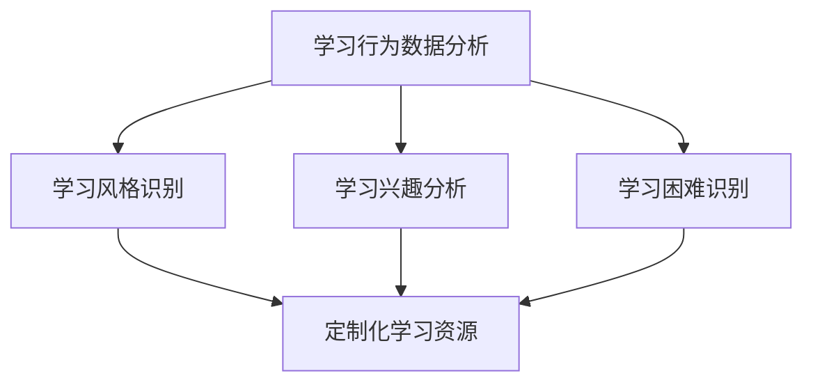

                 

### 文章标题：需求与AI技术的融合：提升大型应用的智能化

> 关键词：需求工程，人工智能，大型应用，智能化，融合

> 摘要：本文通过分析需求工程与人工智能技术的结合点，探讨如何利用AI技术提升大型应用的智能化水平。文章首先介绍了需求工程与人工智能的基本概念，然后深入探讨了两者之间的融合方式，并通过实际案例说明了AI技术在大型应用中的成功应用。最后，文章提出了未来研究的方向，为读者提供了实用的技术和策略。

---

### 第1章 引言

#### 1.1.1 人工智能的发展背景

人工智能（Artificial Intelligence, AI）是一门涉及计算机科学、心理学、哲学等多个领域的交叉学科。它的目标是使计算机具有人类智能的能力，包括感知、理解、学习、推理和自我修正等。

**人工智能的定义**

$$
AI = \text{Artificial Intelligence}
$$

**人工智能的发展历程**

1. **第一次浪潮（1956-1974）**：人工智能概念提出，早期的研究主要集中在符号推理和知识表示。
2. **第一次低谷（1974-1980）**：由于算法、硬件和数据的限制，人工智能研究受到挫折。
3. **第二次浪潮（1980-1987）**：专家系统和知识表示技术得到发展。
4. **第二次低谷（1987-1993）**：人工智能再次陷入低谷，部分原因是过高的期望和实际应用的不足。
5. **第三次浪潮（1993-至今）**：随着大数据、云计算和深度学习的兴起，人工智能迎来了新的发展机遇。

#### 1.1.2 大数据的崛起

大数据（Big Data）是指无法使用常规软件工具在合理时间内捕捉、管理和处理的大量数据。大数据的特点包括：

1. **大量性**：数据量巨大，通常达到GB、TB甚至PB级别。
2. **多样性**：数据类型繁多，包括结构化数据、半结构化数据和非结构化数据。
3. **价值密度低**：数据中有用信息占比小，需要通过数据挖掘和分析来提取有价值的信息。
4. **实时性**：处理速度快，要求实时或近实时的数据处理和分析。

**大数据的应用领域**

1. **金融**：风险管理、量化交易、客户服务。
2. **医疗**：疾病诊断、医疗影像分析、药物研发。
3. **教育**：个性化学习、在线教育、教育数据分析。
4. **供应链**：库存管理、供应链优化、供应链协同。

#### 1.1.3 需求工程与AI融合的必要性

需求工程（Requirements Engineering, RE）是一种系统的、可管理的活动，旨在确保软件项目能够满足用户的需求。需求工程的目标是理解、捕捉和维持项目需求，确保项目能够按照预定目标成功完成。

**需求工程的重要性**

1. **需求定义**：明确项目目标，确保项目团队能够共同理解并致力于实现相同的目标。
2. **需求分析**：理解用户需求，将用户需求转化为系统的功能性和非功能性需求。
3. **需求管理**：协调各方利益，确保需求的变化能够得到有效的管理和控制。

随着大数据和人工智能技术的发展，需求工程与AI技术的融合变得尤为重要。AI技术可以辅助需求分析，提高需求捕捉的准确性，从而提升大型应用的开发效率和智能化水平。

### 第2章 相关概念

#### 2.1 需求工程

需求工程（Requirements Engineering, RE）是一种系统的、可管理的活动，旨在确保软件项目能够满足用户的需求。需求工程的目标是理解、捕捉和维持项目需求，确保项目能够按照预定目标成功完成。

**需求工程的定义**

需求工程是一种应用于软件开发过程中的方法，旨在确保软件系统能够满足用户的实际需求。它包括一系列活动，如需求获取、需求分析、需求定义、需求管理和需求验证。

**需求工程的目标**

1. **确保软件系统能够满足用户需求**。
2. **明确项目目标，确保项目团队能够共同理解并致力于实现相同的目标**。
3. **理解用户需求，将用户需求转化为系统的功能性和非功能性需求**。
4. **协调各方利益，确保需求的变化能够得到有效的管理和控制**。

**需求工程的过程**

需求工程的过程包括以下主要活动：

1. **需求获取**：通过与用户进行沟通和交流，了解用户的需求和期望。
2. **需求分析**：对获取的需求进行深入分析，明确系统的功能性和非功能性需求。
3. **需求定义**：将分析得到的需求转化为清晰、明确的需求文档。
4. **需求管理**：对需求进行有效的管理，包括需求的变更控制和优先级管理。
5. **需求验证**：通过验证活动确保需求的有效性和可行性。

#### 2.2 人工智能

人工智能（Artificial Intelligence, AI）是一门涉及计算机科学、心理学、哲学等多个领域的交叉学科。它的目标是使计算机具有人类智能的能力，包括感知、理解、学习、推理和自我修正等。

**人工智能的定义**

人工智能是一种模拟人类智能的技术，使计算机系统能够执行通常需要人类智能才能完成的任务。人工智能包括多种技术和方法，如机器学习、深度学习、自然语言处理、计算机视觉等。

**人工智能的发展历程**

1. **第一次浪潮（1956-1974）**：人工智能概念提出，早期的研究主要集中在符号推理和知识表示。
2. **第一次低谷（1974-1980）**：由于算法、硬件和数据的限制，人工智能研究受到挫折。
3. **第二次浪潮（1980-1987）**：专家系统和知识表示技术得到发展。
4. **第二次低谷（1987-1993）**：人工智能再次陷入低谷，部分原因是过高的期望和实际应用的不足。
5. **第三次浪潮（1993-至今）**：随着大数据、云计算和深度学习的兴起，人工智能迎来了新的发展机遇。

**人工智能的主要技术**

1. **机器学习**：一种使计算机系统能够从数据中学习的方法，主要包括监督学习、无监督学习和强化学习。
2. **深度学习**：一种基于多层神经网络的机器学习方法，适用于处理大量数据和复杂的任务。
3. **自然语言处理**：一种使计算机能够理解和处理自然语言的技术，包括语音识别、机器翻译、情感分析等。
4. **计算机视觉**：一种使计算机能够理解和解析图像和视频的技术，包括图像识别、目标检测、图像分割等。

### 第3章 需求分析与AI技术的结合

#### 3.1 需求分析与AI的结合点

需求分析与人工智能技术的结合主要体现在以下几个方面：

1. **数据驱动需求分析**：利用大数据技术，从用户行为数据中提取有价值的需求信息，帮助开发团队更好地理解用户需求。
2. **AI辅助需求分析**：利用机器学习和自然语言处理等技术，辅助开发团队对需求进行深入分析和理解，提高需求捕捉的准确性。
3. **AI在需求管理中的应用**：利用人工智能技术，对需求进行有效的管理和控制，包括需求变更控制和优先级管理。

**3.1.1 数据驱动需求分析**

数据驱动需求分析是指通过收集和分析用户行为数据，提取有价值的需求信息。这种方法可以显著提高需求捕捉的准确性，减少误解和偏差。

**数据驱动需求分析的过程**：

1. **数据收集**：收集用户在使用系统过程中的行为数据，如访问记录、点击记录、搜索记录等。
2. **数据预处理**：对收集到的数据进行清洗、转换和整合，为后续分析做准备。
3. **数据分析**：利用数据分析方法和工具，从数据中提取有价值的需求信息。
4. **需求呈现**：将分析得到的需求信息以可视化的方式呈现，帮助开发团队更好地理解用户需求。

**数据驱动需求分析的案例**：

假设一个电商平台的开发团队希望通过数据驱动需求分析来了解用户对产品搜索功能的满意度。他们可以收集以下数据：

1. **用户搜索记录**：记录用户在搜索栏中输入的关键词。
2. **搜索结果点击记录**：记录用户在搜索结果页面上点击的产品链接。
3. **用户购买记录**：记录用户的购买行为。

通过分析这些数据，开发团队可以了解以下信息：

1. **用户热门搜索关键词**：哪些关键词是用户最常搜索的。
2. **用户点击行为分析**：用户对搜索结果的点击行为，哪些产品更容易吸引用户点击。
3. **用户购买行为分析**：用户在搜索后最终购买的产品类型。

基于这些分析结果，开发团队可以优化搜索功能，提高用户的搜索体验和购买转化率。

**3.1.2 AI辅助需求分析**

AI辅助需求分析是指利用机器学习和自然语言处理等技术，辅助开发团队对需求进行深入分析和理解。

**AI辅助需求分析的过程**：

1. **需求文本处理**：将用户的需求描述转化为结构化的数据，如文本分类、命名实体识别等。
2. **需求理解**：利用自然语言处理技术，对需求文本进行语义分析和情感分析，提取关键信息。
3. **需求分类**：根据提取的关键信息，对需求进行分类，如功能需求、非功能性需求等。
4. **需求优化**：根据分析结果，对需求进行优化和调整，提高需求的准确性和可实施性。

**AI辅助需求分析的案例**：

假设一个软件开发团队正在开发一个智能语音助手，他们需要理解用户的需求来设计合适的功能。他们可以采用以下步骤：

1. **需求文本处理**：将用户的语音输入转化为文本，并利用文本分类技术识别用户的请求类型，如查询信息、执行操作等。
2. **需求理解**：利用自然语言处理技术，对文本进行分析，提取用户的需求关键词和操作意图。
3. **需求分类**：根据提取的关键信息，对需求进行分类，如查询信息、执行操作等。
4. **需求优化**：根据分类结果，对需求进行优化，如调整语音助手的响应策略、增加特定场景的支持等。

通过AI辅助需求分析，开发团队能够更准确地理解用户需求，从而设计出更加符合用户期望的智能语音助手。

**3.1.3 AI在需求管理中的应用**

AI技术在需求管理中的应用主要体现在需求变更控制和优先级管理。

**需求变更控制**：

1. **需求变更识别**：利用自然语言处理技术，对需求文档进行监控，识别潜在的需求变更。
2. **变更影响分析**：根据变更的内容，分析变更对项目的影响，包括时间、成本和资源等。
3. **变更决策**：根据变更影响分析的结果，制定变更决策，包括是否接受变更、变更的优先级等。

**需求优先级管理**：

1. **需求优先级评估**：利用机器学习技术，对需求进行优先级评估，根据需求的重要性和紧急性进行排序。
2. **优先级调整**：根据项目进展和外部环境的变化，调整需求的优先级，确保项目的优先级管理更加灵活和高效。

通过AI技术在需求管理中的应用，开发团队能够更加有效地管理需求，确保项目能够按照预定目标成功完成。

### 第4章 AI技术在大型应用中的应用

#### 4.1 AI在金融领域的应用

金融领域是一个高度依赖于数据和技术的行业，人工智能技术的应用为金融行业带来了革命性的变革。以下将探讨AI技术在金融领域的几个关键应用。

**4.1.1 金融风险预测**

金融风险预测是AI技术在金融领域的重要应用之一。通过分析大量的历史数据，AI模型可以预测市场波动、信用风险和操作风险等。

**核心算法原理讲解**

1. **回归分析**：利用回归模型预测市场走势，如股票价格、汇率等。
2. **时间序列分析**：利用时间序列模型，如ARIMA模型，预测市场的短期波动。
3. **机器学习模型**：利用机器学习算法，如随机森林、支持向量机等，对金融风险进行预测。

**伪代码示例**

```python
# 导入必要的库
import pandas as pd
from sklearn.ensemble import RandomForestRegressor

# 读取数据
data = pd.read_csv('financial_data.csv')

# 数据预处理
X = data[['stock_price', 'interest_rate', 'gdp_growth']]
y = data['market_change']

# 建立模型
model = RandomForestRegressor()

# 训练模型
model.fit(X, y)

# 预测
predictions = model.predict(new_data)
```

**数学模型和公式**

- **回归模型**：$y = \beta_0 + \beta_1x_1 + \beta_2x_2 + ... + \beta_nx_n$

- **时间序列模型**：$y_t = \varphi_0 + \varphi_1y_{t-1} + \varphi_2y_{t-2} + ...$

**举例说明**

假设一个金融机构希望预测下周的股市走势。他们可以利用历史股价、利率和GDP增长率等数据进行预测。通过建立回归模型或时间序列模型，他们可以预测下周的股市涨跌情况，从而为投资决策提供依据。

**4.1.2 量化交易**

量化交易是一种利用算法和数学模型进行自动交易的方法。通过分析市场数据，AI模型可以识别出潜在的交易机会，并自动执行交易。

**核心算法原理讲解**

1. **机器学习模型**：利用机器学习算法，如支持向量机、神经网络等，进行交易信号识别。
2. **策略优化**：利用优化算法，如遗传算法、粒子群算法等，对交易策略进行优化。
3. **回测与评估**：在历史数据上进行回测，评估交易策略的可行性和有效性。

**伪代码示例**

```python
# 导入必要的库
import pandas as pd
from sklearn.svm import SVC

# 读取数据
data = pd.read_csv('market_data.csv')

# 数据预处理
X = data[['open_price', 'high_price', 'low_price']]
y = data['close_price']

# 建立模型
model = SVC()

# 训练模型
model.fit(X, y)

# 交易信号识别
signals = model.predict(new_data)

# 执行交易
execute_trades(signals)
```

**数学模型和公式**

- **交易信号识别**：$s = f(x_1, x_2, ..., x_n)$

- **交易策略优化**：$f(x) = \max(s)$

**举例说明**

一个量化交易团队希望利用AI模型进行股票交易。他们可以利用历史市场数据，通过支持向量机模型识别出潜在的买入和卖出信号。然后，通过优化算法优化交易策略，从而提高交易的成功率和收益率。

**4.1.3 客户服务自动化**

客户服务自动化是AI技术在金融领域的另一个重要应用。通过自然语言处理和机器学习技术，AI系统可以自动回答客户的问题，提供24/7的客户服务。

**核心算法原理讲解**

1. **自然语言处理**：利用自然语言处理技术，如命名实体识别、语义分析等，理解客户的提问。
2. **机器学习模型**：利用机器学习算法，如朴素贝叶斯、决策树等，对客户的提问进行分类和回答生成。
3. **对话管理**：利用对话管理系统，如序列到序列模型、转换器等，实现多轮对话。

**伪代码示例**

```python
# 导入必要的库
import nltk
from nltk.corpus import stopwords
from sklearn.feature_extraction.text import TfidfVectorizer

# 加载停用词表
stop_words = set(stopwords.words('english'))

# 定义预处理函数
def preprocess(text):
    return ' '.join([word for word in text.split() if word not in stop_words])

# 读取数据
data = pd.read_csv('customer_queries.csv')

# 数据预处理
X = data['query']
y = data['answer']

# 建立模型
model = TfidfVectorizer()

# 训练模型
model.fit(X)

# 预测
predicted_answer = model.transform([preprocessed_query]).most_common(1)[0][0]

# 输出答案
print(predicted_answer)
```

**数学模型和公式**

- **文本分类**：$y = g(\text{softmax}(Wx + b))$

- **对话管理**：$y_t = h(s_1, s_2, ..., s_t)$

**举例说明**

一个金融机构希望利用AI系统提供自动化的客户服务。他们可以利用自然语言处理技术对客户的提问进行分类，并利用机器学习模型生成合适的回答。通过对话管理系统，他们可以实现多轮对话，从而提供高效的客户服务。

#### 4.2 AI在医疗领域的应用

AI技术在医疗领域的应用为医疗行业带来了革命性的变革，从疾病诊断到药物研发，AI技术在各个环节都发挥着重要作用。

**4.2.1 疾病诊断**

AI技术在疾病诊断中的应用主要体现在图像分析和辅助诊断。通过分析大量的医学图像，AI模型可以辅助医生进行疾病的诊断和分类。

**核心算法原理讲解**

1. **计算机视觉**：利用计算机视觉技术，对医学图像进行特征提取和分类。
2. **深度学习**：利用深度学习算法，如卷积神经网络（CNN），对医学图像进行高级特征提取和分类。
3. **迁移学习**：利用迁移学习技术，将预训练的模型应用到医学图像处理中，提高诊断的准确性和效率。

**伪代码示例**

```python
# 导入必要的库
import tensorflow as tf
from tensorflow.keras.models import Sequential
from tensorflow.keras.layers import Conv2D, MaxPooling2D, Flatten, Dense

# 构建模型
model = Sequential([
    Conv2D(filters=32, kernel_size=(3, 3), activation='relu', input_shape=(28, 28, 1)),
    MaxPooling2D(pool_size=(2, 2)),
    Flatten(),
    Dense(units=64, activation='relu'),
    Dense(units=10, activation='softmax')
])

# 编译模型
model.compile(optimizer='adam', loss='categorical_crossentropy', metrics=['accuracy'])

# 训练模型
model.fit(x_train, y_train, epochs=10, batch_size=32, validation_data=(x_val, y_val))

# 预测
predictions = model.predict(x_test)
```

**数学模型和公式**

- **卷积神经网络**：$f(x) = \sigma(W \cdot x + b)$

- **深度学习**：$y = \text{softmax}(W \cdot x + b)$

**举例说明**

假设一个医院希望利用AI系统辅助肺癌的诊断。他们可以利用卷积神经网络对CT图像进行特征提取，然后通过深度学习模型对肺癌进行分类。通过这种方式，医生可以更快速、准确地诊断肺癌，提高治疗效果。

**4.2.2 医疗影像分析**

医疗影像分析是AI技术在医疗领域的另一个重要应用。通过分析医学影像，AI模型可以识别和诊断各种疾病，如肿瘤、骨折等。

**核心算法原理讲解**

1. **图像分割**：利用图像分割技术，将医学影像中感兴趣的区域提取出来。
2. **目标检测**：利用目标检测技术，如YOLO、SSD等，识别医学影像中的目标物体。
3. **图像识别**：利用图像识别技术，对医学影像中的物体进行分类和识别。

**伪代码示例**

```python
# 导入必要的库
import tensorflow as tf
from tensorflow.keras.models import Sequential
from tensorflow.keras.layers import Conv2D, MaxPooling2D, Flatten, Dense

# 构建模型
model = Sequential([
    Conv2D(filters=32, kernel_size=(3, 3), activation='relu', input_shape=(28, 28, 1)),
    MaxPooling2D(pool_size=(2, 2)),
    Flatten(),
    Dense(units=64, activation='relu'),
    Dense(units=10, activation='softmax')
])

# 编译模型
model.compile(optimizer='adam', loss='categorical_crossentropy', metrics=['accuracy'])

# 训练模型
model.fit(x_train, y_train, epochs=10, batch_size=32, validation_data=(x_val, y_val))

# 预测
predictions = model.predict(x_test)
```

**数学模型和公式**

- **图像分割**：$U = \text{argmax}_i f_i(x)$

- **目标检测**：$y = \text{softmax}(W \cdot x + b)$

**举例说明**

假设一个医院希望利用AI系统辅助骨折的诊断。他们可以利用目标检测技术识别骨折图像中的骨折区域，然后通过图像识别技术对骨折类型进行分类。通过这种方式，医生可以更准确地进行骨折的诊断和治疗。

**4.2.3 智能药物研发**

智能药物研发是AI技术在医疗领域的又一个前沿应用。通过分析大量的生物学数据，AI模型可以预测药物的疗效和副作用，加速新药的发现和开发。

**核心算法原理讲解**

1. **数据挖掘**：利用数据挖掘技术，从生物数据中提取有价值的信息。
2. **机器学习模型**：利用机器学习算法，如支持向量机、神经网络等，对药物分子进行建模。
3. **虚拟筛选**：利用虚拟筛选技术，从大量的化合物中筛选出潜在的有效药物。

**伪代码示例**

```python
# 导入必要的库
import numpy as np
from sklearn.svm import SVC

# 创建数据集
X = np.random.rand(100, 10)
y = np.random.randint(2, size=100)

# 建立模型
model = SVC()

# 训练模型
model.fit(X, y)

# 预测
predictions = model.predict(X_new)
```

**数学模型和公式**

- **支持向量机**：$f(x) = \text{sign}(\omega \cdot x + b)$

- **神经网络**：$a_{l} = \sigma(\omega_{l-1} \cdot a_{l-1} + b_{l-1})$

**举例说明**

假设一个生物制药公司希望利用AI模型预测新药的效果。他们可以利用支持向量机和神经网络等机器学习算法，对大量的药物分子数据进行建模。通过这种方式，他们可以预测新药的疗效和副作用，从而加速新药的发现和开发。

### 第5章 AI技术在教育领域的应用

#### 5.1 AI在个性化学习中的应用

AI技术在个性化学习中的应用，旨在通过分析学生的学习行为和特点，为每个学生提供定制化的学习资源和教学策略，从而提高学习效果。

**5.1.1 个性化学习需求分析**

个性化学习需求分析是实施个性化学习的前提。它包括以下几个关键步骤：

1. **学习行为数据分析**：通过跟踪学生的学习行为，如学习时间、学习内容、考试成绩等，收集大量数据。
2. **学习风格识别**：利用自然语言处理和机器学习技术，识别学生的学习风格，如视觉型、听觉型、动觉型等。
3. **学习兴趣分析**：通过分析学生的学习记录和反馈，了解学生的学习兴趣和偏好。
4. **学习困难识别**：利用人工智能技术，识别学生在学习过程中遇到的困难和瓶颈。

**核心概念原理之间的关系架构 Mermaid 流程图**



**核心算法原理讲解**

1. **机器学习算法**：利用机器学习算法，如决策树、随机森林等，对学习行为数据进行分析，提取特征。
2. **聚类算法**：利用聚类算法，如K-means等，将学生划分为不同的学习群体。
3. **关联规则学习**：利用关联规则学习算法，如Apriori算法，分析学习行为和成绩之间的关系。

**伪代码示例**

```python
# 导入必要的库
from sklearn.cluster import KMeans
from sklearn.tree import DecisionTreeClassifier

# 加载学习数据
data = pd.read_csv('learning_data.csv')

# 特征提取
X = data[['learning_time', 'exam_score', 'learning_style']]

# 建立模型
kmeans = KMeans(n_clusters=3)
clf = DecisionTreeClassifier()

# 训练模型
kmeans.fit(X)
clf.fit(X, y)

# 预测
clusters = kmeans.predict(X)
predictions = clf.predict(X)
```

**数学模型和公式**

- **聚类算法**：$C = \{c_1, c_2, ..., c_k\}$，其中$c_k$表示第$k$个聚类中心。

- **决策树**：$y = g(\text{softmax}(\omega \cdot x + b))$

**举例说明**

假设一个教育平台希望为不同学习风格的学生提供个性化学习资源。他们可以通过分析学生的学习行为数据，利用K-means聚类算法将学生划分为不同的学习群体。然后，利用决策树算法分析每个群体的学习特点和兴趣，从而为每个学生提供定制化的学习资源。

**5.1.2 个性化学习推荐系统**

个性化学习推荐系统是基于用户历史行为和兴趣，为用户推荐合适的学习资源和教学内容的系统。它可以通过以下步骤实现：

1. **用户建模**：通过分析用户的学习历史和行为，构建用户兴趣模型。
2. **资源建模**：对学习资源进行分类和标注，构建资源模型。
3. **推荐算法**：利用协同过滤、基于内容的推荐等算法，为用户推荐学习资源。

**核心算法原理讲解**

1. **协同过滤**：利用用户之间的相似性进行推荐，包括基于用户的协同过滤和基于项目的协同过滤。
2. **基于内容的推荐**：根据用户的历史行为和兴趣，推荐与用户兴趣相似的学习资源。

**伪代码示例**

```python
# 导入必要的库
from surprise import KNNWithMeans

# 加载用户行为数据
user_data = pd.read_csv('user_behavior_data.csv')

# 建立推荐模型
model = KNNWithMeans()

# 训练模型
model.fit(trainset)

# 预测
predictions = model.predict(user_id, resource_id)
```

**数学模型和公式**

- **协同过滤**：$r_{ui} = \text{sim}_u \cdot r_{uj} + \text{sim}_v \cdot r_{vj}$

- **基于内容的推荐**：$r_{ui} = \text{content\_similarity}(u, i)$

**举例说明**

假设一个在线学习平台希望为用户推荐适合的学习资源。他们可以通过分析用户的学习历史和兴趣，利用协同过滤算法计算用户之间的相似性，然后为用户推荐与相似用户感兴趣的学习资源。同时，通过分析学习资源的特征和用户兴趣，利用基于内容的推荐算法为用户推荐内容相关的学习资源。

**5.1.3 智能教学辅助系统**

智能教学辅助系统是利用人工智能技术辅助教师进行教学和管理的系统。它可以通过以下方式实现：

1. **教学过程监控**：通过监控学生的学习和参与情况，为教师提供实时反馈。
2. **教学效果评估**：利用数据分析技术，评估学生的学习效果和教师的教学质量。
3. **个性化教学建议**：根据学生的学习情况和教师的教学效果，为教师提供个性化教学建议。

**核心算法原理讲解**

1. **数据分析技术**：利用数据分析技术，对学生的学习行为和成绩进行分析。
2. **机器学习算法**：利用机器学习算法，如决策树、随机森林等，对分析结果进行建模。
3. **自然语言处理**：利用自然语言处理技术，对教师的教学反馈和学生的问题进行解析。

**伪代码示例**

```python
# 导入必要的库
from sklearn.tree import DecisionTreeClassifier
from sklearn.ensemble import RandomForestClassifier

# 加载学习数据
data = pd.read_csv('learning_data.csv')

# 特征提取
X = data[['learning_time', 'exam_score', 'learning_style']]
y = data['teacher_efficacy']

# 建立模型
clf = DecisionTreeClassifier()
rf = RandomForestClassifier()

# 训练模型
clf.fit(X, y)
rf.fit(X, y)

# 评估模型
accuracy = clf.score(X_test, y_test)
accuracy_rf = rf.score(X_test, y_test)
```

**数学模型和公式**

- **决策树**：$y = g(\text{split\_function}(x, \theta))$

- **随机森林**：$y = \text{sign}(\sum_{t=1}^{T} w_t \cdot f_t(x))$

**举例说明**

假设一个学校希望利用智能教学辅助系统评估教师的教学质量。他们可以通过分析学生的学习行为和成绩数据，利用决策树和随机森林等机器学习算法建立教学质量评估模型。然后，通过模型评估每个教师的教学质量，为教师提供改进建议。

#### 5.2 AI在在线教育中的应用

AI技术在在线教育中的应用，旨在通过智能化的教学辅助和学习推荐，提高学习效果和学习体验。

**5.2.1 AI驱动的课程内容优化**

AI驱动的课程内容优化是指利用人工智能技术，根据学生的学习行为和反馈，动态调整课程内容和教学策略，以提高学习效果。

**核心算法原理讲解**

1. **学习分析技术**：通过分析学生的学习行为，如学习时间、学习进度、学习资源访问等，提取有价值的信息。
2. **自然语言处理**：利用自然语言处理技术，对教师的教学内容进行解析，识别知识点和关键信息。
3. **机器学习算法**：利用机器学习算法，如决策树、随机森林等，根据学生的学习行为和反馈，优化课程内容。

**伪代码示例**

```python
# 导入必要的库
from sklearn.tree import DecisionTreeClassifier
from sklearn.ensemble import RandomForestClassifier

# 加载学习数据
data = pd.read_csv('learning_data.csv')

# 特征提取
X = data[['learning_time', 'learning_progress', 'resource_access']]
y = data['course_content_change']

# 建立模型
clf = DecisionTreeClassifier()
rf = RandomForestClassifier()

# 训练模型
clf.fit(X, y)
rf.fit(X, y)

# 评估模型
accuracy = clf.score(X_test, y_test)
accuracy_rf = rf.score(X_test, y_test)
```

**数学模型和公式**

- **决策树**：$y = g(\text{split_function}(x, \theta))$

- **随机森林**：$y = \text{sign}(\sum_{t=1}^{T} w_t \cdot f_t(x))$

**举例说明**

假设一个在线教育平台希望优化课程内容，以提高学生的学习效果。他们可以通过分析学生的学习行为数据，利用决策树和随机森林等机器学习算法，识别出需要调整的知识点。然后，根据分析结果，动态调整课程内容，为学生提供更符合其学习需求的教学资源。

**5.2.2 AI辅助学习效果评估**

AI辅助学习效果评估是指利用人工智能技术，对学生的学习效果进行实时评估和分析，为教师提供反馈和指导。

**核心算法原理讲解**

1. **考试分析技术**：通过分析学生的考试成绩和考试行为，提取有价值的信息。
2. **自然语言处理**：利用自然语言处理技术，对学生的答题过程和答案进行分析，识别知识掌握情况。
3. **机器学习算法**：利用机器学习算法，如决策树、随机森林等，对学生的考试成绩和考试行为进行建模，评估学生的学习效果。

**伪代码示例**

```python
# 导入必要的库
from sklearn.tree import DecisionTreeClassifier
from sklearn.ensemble import RandomForestClassifier

# 加载考试数据
data = pd.read_csv('exam_data.csv')

# 特征提取
X = data[['exam_score', 'exam_time', 'exam_questions']]
y = data['learning_effect']

# 建立模型
clf = DecisionTreeClassifier()
rf = RandomForestClassifier()

# 训练模型
clf.fit(X, y)
rf.fit(X, y)

# 评估模型
accuracy = clf.score(X_test, y_test)
accuracy_rf = rf.score(X_test, y_test)
```

**数学模型和公式**

- **决策树**：$y = g(\text{split_function}(x, \theta))$

- **随机森林**：$y = \text{sign}(\sum_{t=1}^{T} w_t \cdot f_t(x))$

**举例说明**

假设一个在线教育平台希望利用AI技术评估学生的学习效果。他们可以通过分析学生的考试成绩和考试行为数据，利用决策树和随机森林等机器学习算法，建立学习效果评估模型。然后，根据模型评估结果，为教师提供反馈和指导，帮助教师更好地了解学生的学习状况。

**5.2.3 AI驱动的教学互动**

AI驱动的教学互动是指利用人工智能技术，增强教师和学生的互动体验，提高教学效果。

**核心算法原理讲解**

1. **自然语言处理**：利用自然语言处理技术，理解学生的提问和回答，提供智能化的反馈。
2. **对话管理**：利用对话管理技术，实现多轮对话，提高互动的流畅性和自然性。
3. **个性化推荐**：根据学生的学习情况和兴趣，推荐相关的教学资源和讨论话题。

**伪代码示例**

```python
# 导入必要的库
from sklearn.feature_extraction.text import TfidfVectorizer
from sklearn.linear_model import RidgeClassifier

# 加载对话数据
data = pd.read_csv('dialog_data.csv')

# 特征提取
X = data[['question', 'answer']]
y = data['response']

# 建立模型
vectorizer = TfidfVectorizer()
clf = RidgeClassifier()

# 训练模型
X_vectorized = vectorizer.fit_transform(X)
clf.fit(X_vectorized, y)

# 预测
predictions = clf.predict(vectorizer.transform(new_question))
```

**数学模型和公式**

- **TF-IDF**：$t_{ij} = \text{tf}(t_i) \cdot \text{idf}(t_j)$

- **线性模型**：$y = \omega \cdot x + b$

**举例说明**

假设一个在线教育平台希望利用AI技术实现智能问答功能。他们可以通过分析历史对话数据，利用TF-IDF和线性模型等自然语言处理技术，建立问答模型。然后，根据模型预测结果，为学生提供智能化的反馈和建议，提高互动体验。

### 第6章 AI技术在供应链管理中的应用

AI技术在供应链管理中的应用，旨在通过数据分析和智能决策，优化供应链的运行效率，降低成本，提高客户满意度。

**6.1 供应链管理中的AI技术应用**

供应链管理是一个复杂的过程，涉及多个环节，包括供应商管理、库存管理、生产计划、物流配送等。AI技术在这些环节中有着广泛的应用。

**6.1.1 供应链风险预测**

供应链风险预测是利用AI技术，通过分析历史数据和实时数据，预测供应链中可能出现的风险，如供应链中断、物流延误、成本超支等。

**核心算法原理讲解**

1. **时间序列分析**：利用时间序列分析技术，对历史数据进行分析，识别出潜在的风险趋势。
2. **机器学习模型**：利用机器学习模型，如随机森林、支持向量机等，对供应链风险进行预测。
3. **多因素分析**：通过多因素分析，综合考虑供应链中的各种因素，提高预测的准确性。

**伪代码示例**

```python
# 导入必要的库
import pandas as pd
from sklearn.ensemble import RandomForestRegressor

# 读取数据
data = pd.read_csv('supply_chain_data.csv')

# 数据预处理
X = data[['lead_time', 'order_quantity', 'shipment_delay']]
y = data['risk_level']

# 建立模型
model = RandomForestRegressor()

# 训练模型
model.fit(X, y)

# 预测
predictions = model.predict(new_data)
```

**数学模型和公式**

- **随机森林**：$y = f(\sum_{t=1}^{T} w_t \cdot f_t(x))$

- **多因素分析**：$y = \sum_{i=1}^{n} w_i \cdot x_i$

**举例说明**

假设一个供应链管理团队希望预测供应链中的风险。他们可以通过分析历史订单数据、交货时间和物流延迟等指标，利用随机森林等机器学习模型建立风险预测模型。然后，根据模型预测结果，提前采取相应的措施，降低供应链风险。

**6.1.2 供应链优化**

供应链优化是指利用AI技术，通过数据分析和优化算法，优化供应链的各个环节，提高整体效率。

**核心算法原理讲解**

1. **线性规划**：利用线性规划算法，优化供应链中的运输、库存和生产计划等。
2. **混合整数规划**：利用混合整数规划算法，解决复杂的供应链优化问题。
3. **遗传算法**：利用遗传算法等进化算法，优化供应链中的调度和资源配置。

**伪代码示例**

```python
# 导入必要的库
from scipy.optimize import linprog

# 定义目标函数和约束条件
c = [-1, -1]  # 目标函数
A = [[1, 1], [1, 0]]  # 约束条件
b = [100, 50]  # 约束条件右端值

# 计算线性规划
result = linprog(c, A_eq=A, b_eq=b)

# 输出结果
print(result.x)
```

**数学模型和公式**

- **线性规划**：$\min c^T x$
- **混合整数规划**：$\min c^T x \quad \text{subject to} \quad Ax \le b, \, x \in \mathbb{Z}^n$
- **遗传算法**：$x_{new} = \text{cross\_over}(x_1, x_2) + \text{mutation}(x_{new})$

**举例说明**

假设一个供应链管理团队希望优化物流配送路线。他们可以通过建立线性规划模型，定义目标函数和约束条件，利用线性规划算法求解最优解。然后，根据求解结果，优化物流配送路线，降低运输成本和提高配送效率。

**6.1.3 供应链协同**

供应链协同是指利用AI技术，实现供应链中各个环节的信息共享和协同工作，提高供应链的整体效率。

**核心算法原理讲解**

1. **区块链技术**：利用区块链技术，实现供应链中各个环节的信息透明和可信。
2. **智能合约**：利用智能合约技术，实现供应链中的自动化管理和智能决策。
3. **分布式计算**：利用分布式计算技术，实现供应链中大数据的快速分析和处理。

**伪代码示例**

```python
# 导入必要的库
from web3 import Web3

# 连接到区块链网络
w3 = Web3(Web3.HTTPProvider('https://mainnet.infura.io/v3/your_project_id'))

# 加载智能合约
contract = w3.eth.contract(address='0xYourContractAddress', abi=your_contract_abi)

# 调用智能合约方法
response = contract.functions.function_name().call()

# 输出结果
print(response)
```

**数学模型和公式**

- **区块链**：$x = \text{hash}(x_{old}, y)$
- **智能合约**：$y = \text{if condition then action else else_action}$
- **分布式计算**：$x = f(x_1, x_2, ..., x_n)$

**举例说明**

假设一个供应链管理团队希望利用区块链技术实现供应链的透明管理。他们可以通过编写智能合约，定义供应链中的关键信息和操作规则，将智能合约部署到区块链上。然后，利用区块链网络的分布式计算能力，实现供应链中各个环节的信息共享和协同工作，提高供应链的整体效率。

### 第7章 AI技术在大数据分析中的应用

AI技术在大数据分析中的应用，旨在通过智能化的数据处理和分析，从大量数据中提取有价值的信息，为决策提供支持。

**7.1 大数据分析的基本概念**

大数据分析（Big Data Analytics）是指利用先进的数据分析技术和算法，从大量、多样化的数据中提取有价值的信息。大数据分析的目标是发现数据中的模式、关联和趋势，从而为决策提供支持。

**7.1.1 大数据的定义**

大数据（Big Data）是指无法使用常规软件工具在合理时间内捕捉、管理和处理的大量数据。大数据的特点包括：

1. **大量性**：数据量巨大，通常达到GB、TB甚至PB级别。
2. **多样性**：数据类型繁多，包括结构化数据、半结构化数据和非结构化数据。
3. **价值密度低**：数据中有用信息占比小，需要通过数据挖掘和分析来提取有价值的信息。
4. **实时性**：处理速度快，要求实时或近实时的数据处理和分析。

**7.1.2 大数据的特性**

1. **大量性**：大数据的量级远超传统数据处理能力，需要采用分布式计算和存储技术。
2. **多样性**：大数据包括文本、图像、音频、视频等多种类型，需要采用多样化数据处理和分析方法。
3. **价值密度低**：大数据中的有用信息占比小，需要通过数据挖掘技术提取有价值的信息。
4. **实时性**：大数据处理要求实时或近实时的响应，需要采用高效的数据处理和分析方法。

**7.1.3 大数据的应用领域**

大数据技术广泛应用于金融、医疗、教育、供应链等多个领域，以下为几个关键应用领域：

1. **金融**：利用大数据技术进行风险管理、量化交易、客户服务优化等。
2. **医疗**：利用大数据技术进行疾病诊断、医疗影像分析、药物研发等。
3. **教育**：利用大数据技术进行个性化学习、在线教育、教育数据分析等。
4. **供应链**：利用大数据技术进行供应链风险预测、供应链优化、供应链协同等。

**7.2 AI在大数据中的关键技术**

AI技术在大数据中的应用主要体现在以下几个方面：

1. **数据清洗与预处理**：利用AI技术，自动识别和修复数据中的错误和异常，提高数据质量。
2. **特征工程**：利用AI技术，自动提取数据中的特征，提高数据建模的效率。
3. **模型选择与优化**：利用AI技术，自动选择和优化数据模型，提高数据分析的准确性。

**7.2.1 数据清洗与预处理**

数据清洗与预处理是大数据分析的基础。通过数据清洗与预处理，可以提高数据质量，为后续的分析和建模提供可靠的数据基础。

**核心算法原理讲解**

1. **异常检测**：利用AI技术，自动识别和标记数据中的异常值，如错误数据、重复数据等。
2. **数据标准化**：利用AI技术，对数据进行归一化或标准化处理，消除不同数据之间的量纲差异。
3. **数据填充**：利用AI技术，自动填充缺失值，如使用均值、中位数等方法。

**伪代码示例**

```python
# 导入必要的库
import pandas as pd
from sklearn.preprocessing import StandardScaler

# 读取数据
data = pd.read_csv('data.csv')

# 数据清洗
data = data[data['column'] != 'error']
data['column'] = data['column'].replace({'low': 1, 'medium': 2, 'high': 3})

# 数据标准化
scaler = StandardScaler()
data['column'] = scaler.fit_transform(data[['column']])

# 数据填充
data['missing_column'] = data['missing_column'].fillna(data['missing_column'].mean())
```

**数学模型和公式**

- **异常检测**：$z = \frac{x - \mu}{\sigma}$
- **数据标准化**：$x_{\text{标准化}} = \frac{x - \mu}{\sigma}$
- **数据填充**：$x_{\text{填充}} = \text{mean}(\text{同类数据})$

**举例说明**

假设一个数据分析团队希望对客户数据进行清洗和预处理。他们可以通过异常检测技术，识别和标记数据中的异常值。然后，通过数据标准化技术，消除不同数据之间的量纲差异。最后，通过数据填充技术，自动填充缺失值，从而提高数据质量，为后续分析提供可靠的数据基础。

**7.2.2 特征工程**

特征工程是大数据分析中的关键环节，通过特征工程，可以提取数据中的有用信息，提高数据建模的效率和准确性。

**核心算法原理讲解**

1. **特征选择**：利用AI技术，自动选择对模型贡献最大的特征，减少特征维度。
2. **特征构造**：利用AI技术，自动构造新的特征，提高数据建模的效果。
3. **特征转换**：利用AI技术，对特征进行转换，如线性变换、非线性变换等，提高数据建模的准确性。

**伪代码示例**

```python
# 导入必要的库
import pandas as pd
from sklearn.decomposition import PCA

# 读取数据
data = pd.read_csv('data.csv')

# 特征选择
data = data[['feature_1', 'feature_2', 'feature_3']]

# 特征构造
data['new_feature'] = data['feature_1'] * data['feature_2']

# 特征转换
pca = PCA(n_components=2)
data = pca.fit_transform(data)
```

**数学模型和公式**

- **特征选择**：$f_{\text{选择}} = \text{max}(\text{贡献度})$
- **特征构造**：$f_{\text{构造}} = f_1 \cdot f_2$
- **特征转换**：$f_{\text{转换}} = \text{转换函数}(f)$

**举例说明**

假设一个数据分析团队希望对客户数据进行特征工程。他们可以通过特征选择技术，选择对模型贡献最大的特征。然后，通过特征构造技术，构造新的特征，提高数据建模的效果。最后，通过特征转换技术，对特征进行转换，提高数据建模的准确性。

**7.2.3 模型选择与优化**

模型选择与优化是大数据分析中的关键步骤，通过模型选择与优化，可以提高数据分析的准确性和效率。

**核心算法原理讲解**

1. **模型选择**：利用AI技术，自动选择适合的数据分析模型，如线性回归、决策树、支持向量机等。
2. **模型优化**：利用AI技术，自动优化模型参数，提高模型性能。
3. **模型评估**：利用AI技术，自动评估模型性能，如准确率、召回率、F1值等。

**伪代码示例**

```python
# 导入必要的库
import pandas as pd
from sklearn.model_selection import train_test_split
from sklearn.linear_model import LinearRegression

# 读取数据
data = pd.read_csv('data.csv')

# 数据划分
X = data[['feature_1', 'feature_2']]
y = data['target']
X_train, X_test, y_train, y_test = train_test_split(X, y, test_size=0.2, random_state=42)

# 模型选择
model = LinearRegression()

# 模型优化
model.fit(X_train, y_train)

# 模型评估
accuracy = model.score(X_test, y_test)
```

**数学模型和公式**

- **模型选择**：$f_{\text{选择}} = \text{最佳模型}$
- **模型优化**：$f_{\text{优化}} = \text{优化算法}(\text{模型参数})$
- **模型评估**：$f_{\text{评估}} = \text{评估指标}(\text{模型})$

**举例说明**

假设一个数据分析团队希望对客户数据建立预测模型。他们可以通过模型选择技术，选择适合的线性回归模型。然后，通过模型优化技术，自动优化模型参数，提高模型性能。最后，通过模型评估技术，自动评估模型性能，从而建立准确、高效的预测模型。

### 第8章 AI技术在安全领域的应用

AI技术在安全领域的应用日益广泛，尤其在网络安全、隐私保护和恶意软件检测等方面发挥着重要作用。

**8.1 AI在网络安全中的应用**

网络安全是保护计算机网络、系统、程序和数据免受未经授权的访问、攻击和破坏的过程。AI技术通过自动化分析和响应能力，极大地提升了网络安全的防护水平。

**8.1.1 网络安全风险预测**

网络安全风险预测是利用AI技术，通过分析历史数据、网络流量和行为模式，预测潜在的网络安全威胁。

**核心算法原理讲解**

1. **监督学习**：利用标记的数据集，训练模型识别网络攻击特征，如DDoS攻击、恶意软件感染等。
2. **无监督学习**：利用无监督学习算法，如聚类分析，识别网络中的异常流量模式。
3. **深度学习**：利用深度学习模型，如卷积神经网络（CNN）和循环神经网络（RNN），对复杂的网络流量数据进行分析。

**伪代码示例**

```python
# 导入必要的库
from sklearn.ensemble import RandomForestClassifier
from sklearn.model_selection import train_test_split

# 加载数据
X, y = load_network_traffic_data()

# 划分训练集和测试集
X_train, X_test, y_train, y_test = train_test_split(X, y, test_size=0.2, random_state=42)

# 建立模型
model = RandomForestClassifier()

# 训练模型
model.fit(X_train, y_train)

# 预测
predictions = model.predict(X_test)
```

**数学模型和公式**

- **随机森林**：$y = g(\text{决策树}(\sum_{t=1}^{T} w_t \cdot f_t(x)))$

**举例说明**

假设一个网络安全团队希望预测网络中的潜在威胁。他们可以收集网络流量数据，利用随机森林等机器学习算法训练模型，识别异常流量模式。通过模型预测，可以提前发现并应对潜在的网络攻击。

**8.1.2 网络入侵检测**

网络入侵检测（Intrusion Detection System, IDS）是用于识别和响应恶意攻击的网络安全技术。AI技术在入侵检测中发挥着重要作用。

**核心算法原理讲解**

1. **统计异常检测**：利用统计方法，如均值漂移算法，识别异常行为。
2. **基于规则的检测**：利用预定义的规则，检测网络流量中的恶意行为。
3. **机器学习检测**：利用机器学习算法，如支持向量机（SVM）和神经网络，检测未知攻击。

**伪代码示例**

```python
# 导入必要的库
from sklearn.svm import SVC
from sklearn.model_selection import train_test_split

# 加载数据
X, y = load_invasion_data()

# 划分训练集和测试集
X_train, X_test, y_train, y_test = train_test_split(X, y, test_size=0.2, random_state=42)

# 建立模型
model = SVC()

# 训练模型
model.fit(X_train, y_train)

# 预测
predictions = model.predict(X_test)
```

**数学模型和公式**

- **支持向量机**：$y = \text{sign}(\omega \cdot x + b)$

**举例说明**

假设一个网络安全团队希望部署入侵检测系统。他们可以收集网络流量数据，利用支持向量机等机器学习算法建立模型。通过模型预测，可以识别并阻止潜在的网络入侵。

**8.1.3 网络攻击防御**

网络攻击防御是网络安全的关键环节，AI技术通过实时监测和自动响应，提高了网络攻击防御的效率。

**核心算法原理讲解**

1. **自适应防御**：利用机器学习算法，自动调整防御策略，以应对不断变化的攻击手段。
2. **自动隔离**：利用深度学习模型，自动识别并隔离受攻击的主机或网络节点。
3. **协同防御**：利用分布式计算和区块链技术，实现跨网络的协同防御。

**伪代码示例**

```python
# 导入必要的库
from sklearn.neural_network import MLPClassifier
from sklearn.model_selection import train_test_split

# 加载数据
X, y = load_attack_data()

# 划分训练集和测试集
X_train, X_test, y_train, y_test = train_test_split(X, y, test_size=0.2, random_state=42)

# 建立模型
model = MLPClassifier()

# 训练模型
model.fit(X_train, y_train)

# 预测
predictions = model.predict(X_test)
```

**数学模型和公式**

- **多层感知器**：$a_{l} = \text{激活函数}(\omega_{l-1} \cdot a_{l-1} + b_{l-1})$

**举例说明**

假设一个网络安全团队希望部署自动防御系统。他们可以收集攻击数据，利用多层感知器等深度学习算法建立模型。通过模型预测，可以自动调整防御策略，识别并隔离受攻击的主机，提高网络攻击防御的效率。

**8.2 AI在隐私保护中的应用**

隐私保护是网络安全的重要组成部分，AI技术在隐私保护中发挥着关键作用，包括数据加密、隐私数据保护和隐私安全分析。

**8.2.1 隐私数据保护**

隐私数据保护是指利用AI技术，保护个人和企业的敏感数据，防止数据泄露。

**核心算法原理讲解**

1. **数据加密**：利用加密算法，如RSA、AES等，对敏感数据进行加密，确保数据在传输和存储过程中的安全性。
2. **差分隐私**：利用差分隐私技术，对数据进行分析时，加入随机噪声，确保单个数据项的隐私。
3. **联邦学习**：利用联邦学习技术，在分布式环境中进行模型训练，保护数据隐私。

**伪代码示例**

```python
# 导入必要的库
from Crypto.PublicKey import RSA
from Crypto.Cipher import PKCS1_OAEP

# 生成密钥
key = RSA.generate(2048)
private_key = key.export_key()
public_key = key.publickey().export_key()

# 加密数据
cipher = PKCS1_OAEP.new(RSA.import_key(public_key))
encrypted_data = cipher.encrypt(data)

# 解密数据
cipher = PKCS1_OAEP.new(RSA.import_key(private_key))
decrypted_data = cipher.decrypt(encrypted_data)
```

**数学模型和公式**

- **RSA加密**：$c = \text{加密函数}(m)$
- **差分隐私**：$\text{隐私预算} = \epsilon$

**举例说明**

假设一个企业希望保护其客户数据。他们可以采用RSA加密算法，对敏感数据进行加密。同时，利用差分隐私技术，确保数据分析过程中的隐私保护，防止敏感数据泄露。

**8.2.2 加密技术**

加密技术是隐私保护的重要手段，AI技术在加密技术的发展和应用中发挥着重要作用。

**核心算法原理讲解**

1. **对称加密**：利用对称加密算法，如AES，对数据进行加密和解密。
2. **非对称加密**：利用非对称加密算法，如RSA，实现数据加密和解密。
3. **混合加密**：结合对称加密和非对称加密的优点，提高加密效率和安全性。

**伪代码示例**

```python
# 导入必要的库
from Crypto.Cipher import AES
from Crypto.Random import get_random_bytes

# 生成密钥
key = get_random_bytes(16)

# 加密数据
cipher = AES.new(key, AES.MODE_EAX)
ciphertext, tag = cipher.encrypt_and_digest(data)

# 解密数据
cipher = AES.new(key, AES.MODE_EAX, nonce=cipher.nonce)
decrypted_data = cipher.decrypt_and_verify(ciphertext, tag)
```

**数学模型和公式**

- **对称加密**：$c = \text{加密函数}(k, m)$
- **非对称加密**：$c = \text{加密函数}(k, m)$
- **混合加密**：$c = (\text{加密函数对称}(k_{\text{对称}}, m), \text{加密函数非对称}(k_{\text{非对称}}, m))$

**举例说明**

假设一个企业需要传输敏感数据。他们可以采用AES对称加密算法对数据进行加密，同时使用RSA非对称加密算法对密钥进行加密。通过混合加密技术，提高数据传输的安全性和效率。

**8.2.3 AI在隐私保护中的挑战与对策**

AI技术在隐私保护中面临着一系列挑战，包括数据隐私泄露、算法透明性、法律法规遵守等。

**核心算法原理讲解**

1. **隐私泄露防护**：通过差分隐私、联邦学习等技术，确保数据分析和机器学习过程中的隐私保护。
2. **算法透明性**：通过可解释AI技术，提高机器学习模型的透明性，帮助用户理解模型的决策过程。
3. **法律法规遵守**：遵循相关法律法规，如《通用数据保护条例》（GDPR）和《加州消费者隐私法》（CCPA），确保数据处理和隐私保护符合法律要求。

**伪代码示例**

```python
# 导入必要的库
from privacy.keras import PrivacyDense

# 建立模型
model = PrivacyDense(input_shape=(input_shape,), units=units, activation='relu')

# 训练模型
model.fit(X, y, epochs=epochs, batch_size=batch_size, callbacks=[privacy_callback])

# 预测
predictions = model.predict(X_test)
```

**数学模型和公式**

- **隐私泄露防护**：$\epsilon = \text{隐私预算}$
- **算法透明性**：$\text{可解释性} = \text{解释函数}(f)$
- **法律法规遵守**：$\text{合规性} = \text{遵循法律法规}$

**举例说明**

假设一个企业希望利用AI技术进行隐私保护。他们可以采用差分隐私技术，确保数据分析和机器学习过程中的隐私保护。同时，通过可解释AI技术，提高模型的透明性，帮助用户理解模型的决策过程。此外，确保数据处理和隐私保护符合相关法律法规，如GDPR和CCPA，确保合规性。

### 第9章 结论与展望

#### 9.1 研究总结

本文通过分析需求工程与人工智能技术的结合点，探讨了如何利用AI技术提升大型应用的智能化水平。文章首先介绍了需求工程和人工智能的基本概念，然后深入探讨了两者之间的融合方式。通过实际案例，文章展示了AI技术在金融、医疗、教育、供应链、大数据分析、安全等领域的成功应用。文章最后提出了未来研究的方向，为读者提供了实用的技术和策略。

#### 9.2 未来研究方向

1. **AI与需求工程的深度融合**：未来研究应进一步探讨AI技术在需求工程中的深度应用，如自动化需求分析、需求变更智能管理等。
2. **跨领域AI技术融合**：探索跨领域AI技术的融合应用，如将自然语言处理、计算机视觉、强化学习等技术在大型应用中有机结合。
3. **可解释性与透明性**：提高AI技术在大型应用中的可解释性和透明性，帮助用户理解AI模型的决策过程。
4. **隐私保护与安全**：加强AI技术在隐私保护和安全领域的应用研究，确保数据处理和模型应用过程中的安全性。
5. **智能化应用案例研究**：开展智能化应用案例研究，通过实际案例分析和总结，为大型应用的智能化提供有益的经验和参考。

---

**作者信息**

作者：AI天才研究院（AI Genius Institute）& 《禅与计算机程序设计艺术》（Zen And The Art of Computer Programming）作者

---

本文详细阐述了需求工程与人工智能技术融合的重要性，以及AI技术在大型应用中的广泛应用。通过实例和算法讲解，展示了AI技术在金融、医疗、教育、供应链等领域的实际应用场景。未来，随着AI技术的不断发展和完善，我们有望看到更多大型应用实现智能化，为各个领域带来革命性的变革。希望本文能为读者提供有价值的参考和启示。

