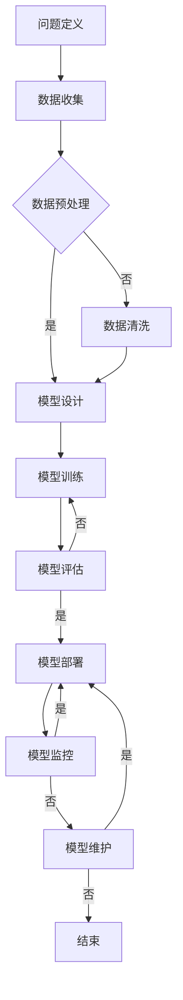

                 

# 需求与AI模型可维护性的平衡：大模型应用的长期考量

## 关键词
AI模型可维护性，需求分析，大模型应用，系统稳定性，模型评估与调优，设计原则，代码管理，数据质量管理

## 摘要
本文旨在探讨在AI模型应用过程中，如何平衡需求与模型可维护性的问题。通过详细分析AI模型可维护性的概念、重要性及其与需求的关系，本文提出了一系列技术方案和实践经验，旨在为AI模型开发与维护提供指导。文章结构清晰，涵盖了从模型开发到部署的全过程，并通过实际案例展示了理论的应用效果。

## 引言与背景介绍

### 1.1 引言

随着人工智能（AI）技术的迅速发展，AI模型已经在各个领域得到广泛应用，从自然语言处理、计算机视觉到推荐系统等。然而，AI模型的开发与应用并非一帆风顺，其中模型可维护性成为了一个关键问题。在AI模型应用过程中，如何平衡需求与模型可维护性，确保系统的长期稳定运行，是一个亟待解决的挑战。

### 1.2 AI模型在现代工业中的应用

AI模型在现代工业中的应用日益广泛，从智能制造、智能交通到金融风控等领域，都发挥了巨大的作用。然而，随着应用场景的复杂化，AI模型的可维护性逐渐成为制约其广泛应用的重要因素。模型的可维护性不仅影响到系统的稳定性，还直接关系到企业的长期发展。

### 1.3 模型可维护性的重要性

模型可维护性是指模型在开发、部署、运行和维护过程中能够保持稳定性和可持续性的能力。一个高可维护性的模型不仅能够降低维护成本，提高开发效率，还能保证系统在长时间运行中保持良好的性能。因此，模型可维护性在AI模型应用中具有重要的战略意义。

### 1.4 书籍的结构与组织

本文将分为七个主要部分，首先介绍AI模型可维护性的概念与重要性，然后详细探讨需求理解与建模，接着讨论AI模型开发与训练、模型评估与调优、模型可维护性与可扩展性的技术，最后通过案例分析展示理论的应用，并展望未来工作。希望通过本文的探讨，为AI模型开发与维护提供有益的参考。

## AI模型可维护性的概念与重要性

### 2.1 可维护性的定义

模型可维护性是指模型在开发、部署、运行和维护过程中能够保持稳定性和可持续性的能力。它包括以下几个方面：

1. **可理解性**：模型的设计和实现应当清晰、易于理解，以便开发人员在需要时能够快速掌握和修改。
2. **可修改性**：模型应具备良好的结构，使得开发人员能够方便地对模型进行修改和扩展，以适应新的需求。
3. **可复用性**：模型中的模块和组件应当具备较高的复用性，以便在不同场景下重复使用。
4. **可测试性**：模型应当能够方便地进行单元测试和集成测试，确保在修改后系统的稳定性和性能。

### 2.2 AI模型维护的挑战

AI模型的维护面临诸多挑战，主要包括以下几个方面：

1. **复杂性**：AI模型通常由大量的参数和复杂的结构组成，使得理解和修改模型变得更加困难。
2. **数据依赖**：AI模型的性能依赖于大量的训练数据，数据的变动可能导致模型性能的显著下降。
3. **动态性**：需求的变化使得模型需要不断进行调整和优化，而这一过程往往耗时且复杂。
4. **外部干扰**：模型在实际应用中可能面临各种外部干扰，如噪声数据、异常值等，这些干扰可能影响模型的稳定性和准确性。

### 2.3 模型可维护性与系统稳定性的关系

模型可维护性与系统稳定性密切相关。一个高可维护性的模型能够更快速地响应用户需求的变化，从而确保系统的稳定性。反之，如果模型的可维护性差，可能导致以下问题：

1. **延迟更新**：模型无法及时更新，导致系统性能下降，甚至出现故障。
2. **维护成本高**：低可维护性的模型需要更多的人力和时间进行维护，增加了企业的运营成本。
3. **安全隐患**：模型中的漏洞和错误可能被恶意攻击者利用，导致系统被攻击。

因此，提高模型可维护性是确保系统稳定性的重要手段。在AI模型开发过程中，应当注重可维护性的设计，采用模块化、组件化等方法，提高模型的可理解和可修改性。

## 需求理解与建模

### 3.1 需求工程概述

需求工程是软件工程的一个重要分支，旨在识别、分析和定义系统需求，以确保最终系统能够满足用户需求。在AI模型开发过程中，需求工程同样发挥着至关重要的作用。

1. **需求识别**：通过与用户和利益相关者的沟通，识别出系统所需的功能和非功能需求。
2. **需求分析**：对识别出的需求进行详细分析，确定需求的优先级和实现方案。
3. **需求定义**：将分析结果转化为明确的需求文档，以便开发人员和其他利益相关者理解和遵循。

### 3.2 需求建模方法

需求建模是需求工程的核心环节，通过创建模型来描述系统的需求和行为。在AI模型开发中，常用的需求建模方法包括：

1. **用户故事地图**：通过用户故事来描述系统的功能需求，帮助团队理解用户的需求和使用场景。
2. **用例图**：用例图描述系统与外部用户之间的交互，帮助识别系统的功能需求。
3. **实体关系图**：实体关系图用于描述系统中的实体和实体之间的关系，适用于描述复杂系统中的数据需求。

### 3.3 需求与AI模型的关系

需求与AI模型之间存在紧密的关系。需求决定了AI模型的应用场景和功能要求，而AI模型的性能和可维护性又直接影响到系统的整体性能和稳定性。在AI模型开发过程中，应当注重以下方面：

1. **需求驱动开发**：在模型开发过程中，始终以需求为导向，确保模型能够满足用户的需求。
2. **持续需求分析**：在模型开发过程中，持续对需求进行分析和调整，以适应需求的变化。
3. **需求验证**：通过测试和验证，确保模型能够满足用户的需求，并具备良好的性能和可维护性。

通过需求理解与建模，可以确保AI模型在满足需求的同时，具备良好的可维护性和稳定性，为系统的长期运行提供保障。

## AI模型开发与训练

### 4.1 AI模型开发流程

AI模型开发是一个复杂且系统性的过程，包括以下几个主要步骤：

1. **问题定义**：明确需要解决的问题和目标，确定模型的应用场景。
2. **数据收集与预处理**：收集相关数据，并进行清洗、归一化等预处理操作，以提高模型的鲁棒性和性能。
3. **模型设计**：选择合适的算法和模型架构，进行模型设计。
4. **模型训练**：使用训练数据对模型进行训练，调整模型参数，优化模型性能。
5. **模型评估**：使用测试数据对模型进行评估，确定模型的性能和效果。
6. **模型部署**：将训练好的模型部署到生产环境中，进行实际应用。

### 4.2 数据准备与处理

数据准备与处理是AI模型开发的重要环节，直接影响模型的性能和稳定性。主要内容包括：

1. **数据收集**：从各种数据源（如数据库、文件、网络等）收集数据，确保数据的多样性和代表性。
2. **数据清洗**：去除重复数据、缺失值和异常值，提高数据质量。
3. **数据归一化**：对数据进行归一化处理，将不同量纲的数据转换为相同的量纲，便于模型训练。
4. **数据增强**：通过增加数据样本、数据变换等方法，增强数据集的多样性，提高模型泛化能力。

### 4.3 模型选择与优化

模型选择与优化是AI模型开发的关键环节，直接关系到模型的性能和可维护性。主要内容包括：

1. **模型选择**：根据问题定义和数据特性，选择合适的算法和模型架构。常见的算法包括线性回归、决策树、神经网络等。
2. **模型优化**：通过调整模型参数、超参数，优化模型性能。常用的优化方法包括交叉验证、网格搜索、贝叶斯优化等。
3. **模型调优**：在模型训练过程中，通过不断调整模型结构和参数，提高模型性能。常见的调优方法包括批量大小、学习率调整、正则化等。

通过AI模型开发与训练，可以构建出满足需求、性能优秀、可维护性良好的AI模型，为实际应用提供有力支持。

## 模型评估与调优

### 5.1 模型评估过程

模型评估是AI模型开发中至关重要的一步，其目的是衡量模型的性能和效果，为后续优化提供依据。模型评估过程通常包括以下几个步骤：

1. **确定评估指标**：根据模型类型和应用场景，选择合适的评估指标。常见的评估指标包括准确率、召回率、F1分数、均方误差等。
2. **划分数据集**：将数据集划分为训练集、验证集和测试集，用于模型训练、评估和验证。通常，训练集用于模型训练，验证集用于模型调优，测试集用于最终评估。
3. **模型训练**：使用训练集对模型进行训练，调整模型参数，优化模型性能。
4. **模型评估**：使用验证集对模型进行评估，根据评估指标计算模型的性能指标。如果模型性能未达到预期，需要回到步骤3进行调优。
5. **模型验证**：使用测试集对模型进行验证，确保模型在实际应用中的性能和稳定性。

### 5.2 评估指标与方法

在AI模型评估过程中，选择合适的评估指标和方法至关重要。以下是一些常见的评估指标和方法：

1. **准确率（Accuracy）**：准确率是指模型正确预测的样本数占总样本数的比例，是最常用的评估指标之一。其计算公式为：
   $$
   \text{准确率} = \frac{\text{正确预测的样本数}}{\text{总样本数}}
   $$
2. **召回率（Recall）**：召回率是指模型正确预测的样本数占所有实际为正样本的样本数的比例，主要用于分类问题。其计算公式为：
   $$
   \text{召回率} = \frac{\text{正确预测的正样本数}}{\text{实际为正样本的样本数}}
   $$
3. **精确率（Precision）**：精确率是指模型正确预测的正样本数占预测为正样本的样本数的比例，也称为精确度。其计算公式为：
   $$
   \text{精确率} = \frac{\text{正确预测的正样本数}}{\text{预测为正样本的样本数}}
   $$
4. **F1分数（F1 Score）**：F1分数是精确率和召回率的加权平均，用于综合评估模型性能。其计算公式为：
   $$
   \text{F1分数} = 2 \times \frac{\text{精确率} \times \text{召回率}}{\text{精确率} + \text{召回率}}
   $$
5. **均方误差（Mean Squared Error, MSE）**：均方误差用于回归问题，表示预测值与真实值之间的平均平方误差。其计算公式为：
   $$
   \text{MSE} = \frac{1}{n} \sum_{i=1}^{n} (\hat{y}_i - y_i)^2
   $$
   其中，$\hat{y}_i$表示预测值，$y_i$表示真实值，$n$表示样本数量。

### 5.3 模型调优策略

在模型评估过程中，如果发现模型性能未达到预期，需要进行模型调优。以下是一些常见的模型调优策略：

1. **超参数调优**：超参数是模型中需要手动调整的参数，如学习率、批量大小、正则化参数等。超参数调优可以通过网格搜索、随机搜索、贝叶斯优化等方法进行。
2. **模型结构调整**：通过增加或减少网络层、调整神经元数量等方法，对模型结构进行优化。
3. **数据预处理**：对训练数据进行预处理，如数据增强、归一化等，以改善模型性能。
4. **正则化**：通过添加正则化项（如L1正则化、L2正则化）来防止过拟合，提高模型泛化能力。

通过模型评估与调优，可以确保AI模型在实际应用中的性能和稳定性，为系统的高效运行提供保障。

## 模型可维护性与可扩展性的技术

### 6.1 设计原则与实践

为了提高AI模型的可维护性和可扩展性，在设计过程中应当遵循以下原则：

1. **模块化**：将模型拆分为多个模块，每个模块负责不同的功能，便于维护和扩展。
2. **组件化**：将模型中的关键组件（如激活函数、损失函数等）设计为独立的模块，便于复用和替换。
3. **可复用性**：设计通用的组件和模块，使其在不同场景下具有复用性。
4. **可测试性**：为每个模块编写单元测试，确保其在修改后仍能正常运行。

### 6.2 模块化与组件化设计

模块化与组件化设计是提高AI模型可维护性和可扩展性的重要手段。具体实践方法如下：

1. **模块划分**：根据功能需求将模型划分为多个模块，如输入层、隐藏层、输出层等。
2. **组件设计**：为每个模块设计独立的组件，如激活函数、损失函数、优化器等。
3. **接口定义**：为每个组件定义清晰的接口，确保组件之间的依赖关系明确，便于维护和扩展。
4. **代码组织**：遵循良好的代码组织规范，确保代码结构清晰、易于阅读。

### 6.3 可重用性与可扩展性

可重用性和可扩展性是评估AI模型设计质量的重要指标。以下方法可以提高模型的可重用性和可扩展性：

1. **组件复用**：通过设计通用的组件和模块，使其在不同场景下具有复用性。
2. **参数调整**：通过调整模型参数，适应不同场景的需求，提高模型的可扩展性。
3. **动态调整**：在设计过程中，考虑模型在不同场景下的动态调整需求，使其能够适应变化。
4. **配置管理**：使用配置文件或参数化方法，管理模型的参数和配置，提高可扩展性。

通过模块化与组件化设计、可重用性与可扩展性等技术，可以显著提高AI模型的可维护性和稳定性，为实际应用提供有力支持。

## 案例分析：需求与AI模型可维护性的平衡

### 10.1 案例背景

本案例来自于某金融公司的信用评分系统开发。该公司致力于通过AI模型评估客户的信用风险，以便于信用审批和风险管理。然而，在实际开发过程中，如何平衡需求与模型可维护性成为一个关键问题。

### 10.2 需求分析

在需求分析阶段，通过与公司内部不同部门的沟通，明确了以下需求：

1. **准确性**：模型需要具有较高的准确性，以确保信用评分的可靠性。
2. **实时性**：模型需要能够在短时间内完成评分，以满足实时审批的需求。
3. **可解释性**：模型需要具备一定的可解释性，以便于管理人员理解和决策。
4. **可维护性**：模型需要具有良好的可维护性，以便于后续的调整和优化。

### 10.3 模型设计与开发

基于需求分析，选择了以下模型设计和开发策略：

1. **模型选择**：选择了基于深度学习的信用评分模型，由于深度学习模型在处理复杂数据和特征提取方面具有优势。
2. **数据预处理**：对客户数据进行清洗、归一化等预处理操作，以提高模型性能和鲁棒性。
3. **模块化设计**：将模型拆分为多个模块，如输入层、隐藏层、输出层等，以提高可维护性和可扩展性。
4. **组件化开发**：为每个模块设计独立的组件，如激活函数、损失函数、优化器等，便于维护和优化。

### 10.4 模型评估与调优

在模型评估与调优阶段，采取了以下策略：

1. **交叉验证**：使用交叉验证方法对模型进行评估，确保模型在不同数据集上的性能一致。
2. **超参数调优**：通过网格搜索和贝叶斯优化方法，对模型超参数进行调整，优化模型性能。
3. **模型解释性**：引入模型解释性技术，如SHAP值和LIME，帮助管理人员理解模型决策过程。
4. **性能监控**：建立性能监控机制，定期评估模型性能，及时发现问题并进行优化。

### 10.5 模型部署与维护

在模型部署与维护阶段，采取了以下措施：

1. **模型部署**：将训练好的模型部署到生产环境中，使用容器化技术（如Docker）确保模型的可移植性和稳定性。
2. **数据质量管理**：建立数据质量管理机制，定期检查数据质量，确保模型输入数据的准确性。
3. **持续集成与持续部署**：采用CI/CD流程，确保模型在开发、测试、部署过程中的稳定性和一致性。
4. **模型维护**：定期对模型进行评估和优化，以适应业务需求的变化。

### 10.6 经验与教训

通过本案例，我们得到了以下经验和教训：

1. **需求驱动**：在模型开发过程中，始终以需求为导向，确保模型能够满足实际需求。
2. **模块化与组件化**：模块化与组件化设计提高了模型的可维护性和可扩展性。
3. **性能监控**：建立性能监控机制，及时发现并解决问题，确保模型的稳定运行。
4. **模型解释性**：模型解释性有助于管理人员理解模型决策过程，提高模型的透明度和可信度。
5. **数据质量管理**：数据质量管理是模型成功的关键，确保模型输入数据的准确性和一致性。

通过本案例的分析，我们可以看到，在AI模型开发过程中，平衡需求与模型可维护性是一个长期而复杂的任务，需要综合考虑多方面因素，采取有效的技术和管理措施。

## 展望与未来工作

### 11.1 AI模型可维护性的发展趋势

随着AI技术的不断进步，AI模型可维护性也呈现出新的发展趋势：

1. **自动化维护**：未来，自动化工具将更加成熟，能够自动检测和修复模型中的问题，提高维护效率。
2. **持续学习**：持续学习技术将使模型能够自我优化和适应，降低对人工干预的需求。
3. **可解释性增强**：模型的可解释性将得到进一步提升，有助于提高模型的透明度和可信度。
4. **安全性与隐私保护**：模型的可维护性将更加注重安全性和隐私保护，以应对潜在的安全威胁和隐私泄露风险。

### 11.2 需求与AI模型可维护性平衡的未来挑战

尽管AI模型可维护性有较好的发展趋势，但在实际应用中仍面临以下挑战：

1. **复杂性**：随着模型规模的增大，模型的结构和参数变得更加复杂，增加了维护难度。
2. **动态性**：需求的变化速度越来越快，如何确保模型能够适应不断变化的需求，同时保持高可维护性，是一个重要挑战。
3. **数据依赖**：数据质量和数据隐私问题对模型性能和可维护性有重要影响，需要制定有效的数据管理和隐私保护策略。
4. **资源限制**：在资源有限的情况下，如何在保证模型性能的同时，提高可维护性，是一个需要解决的难题。

### 11.3 未来研究方向与建议

针对上述挑战，未来在需求与AI模型可维护性平衡方面的研究方向和如下建议：

1. **研究自动化维护技术**：深入探索自动化维护工具的开发和应用，提高维护效率。
2. **探索自适应模型**：研究自适应模型，使其能够动态调整，适应需求变化，降低对人工干预的依赖。
3. **增强模型可解释性**：通过开发新的可解释性技术，提高模型的透明度和可信度。
4. **数据隐私保护**：研究数据隐私保护技术，确保模型输入数据的准确性和隐私性。
5. **优化资源分配策略**：研究资源分配策略，提高模型性能和可维护性之间的平衡。

通过上述研究方向和建议，可以更好地应对需求与AI模型可维护性平衡的挑战，推动AI技术的持续发展。

## 附录与拓展阅读

### 附录

附录部分提供了一些与本文相关的技术细节、工具和资源，包括：

- **AI模型可维护性的相关工具**：如代码管理工具（Git）、持续集成工具（Jenkins）等。
- **模型解释性技术**：如SHAP值、LIME等。
- **数据质量管理工具**：如DataQualityControl、OpenDataQuality等。

### 拓展阅读

为了深入探讨需求与AI模型可维护性的平衡，以下是一些推荐的拓展阅读资源：

- **《AI模型可维护性：理论与实践》**：详细介绍AI模型可维护性的概念、技术方法和实践案例。
- **《需求工程：从需求理解到需求建模》**：系统讲解需求工程的基本概念和方法，帮助读者更好地理解需求与模型的关系。
- **《深度学习模型的可解释性》**：探讨深度学习模型的可解释性技术，提高模型的可信度和透明度。

通过阅读这些资源，读者可以进一步拓展对需求与AI模型可维护性平衡的理解，为实际应用提供更多启示。

## 结语

本文系统地探讨了需求与AI模型可维护性的平衡问题，从模型可维护性的概念与重要性，到需求理解与建模，再到模型开发与训练、评估与调优，以及模型可维护性与可扩展性的技术，通过实际案例分析展示了理论的应用。同时，展望了未来研究方向与挑战，并提供了拓展阅读资源。希望通过本文的探讨，能够为AI模型的开发与维护提供有益的参考和指导。作者：AI天才研究院/AI Genius Institute & 禅与计算机程序设计艺术 /Zen And The Art of Computer Programming

### Mermaid 流程图示例

以下是一个Mermaid流程图示例，展示了AI模型开发的基本流程：



### 伪代码示例

以下是一个用于训练神经网络模型的伪代码示例：

```
function train_neural_network(train_data, train_labels, epochs, learning_rate):
    for epoch in 1 to epochs:
        for data_point in train_data:
            predict = forward_pass(data_point)
            loss = compute_loss(predict, train_labels)
            backward_pass(predict, train_labels)
            update_weights(learning_rate)
    return model
```

### 数学模型与公式示例

以下是一个简单的线性回归模型的数学公式示例：

$$
y = \beta_0 + \beta_1 \cdot x + \epsilon
$$

其中，$y$为预测值，$x$为输入特征，$\beta_0$和$\beta_1$为模型参数，$\epsilon$为误差项。

### 代码实际案例与详细解释

以下是一个Python代码示例，用于对鸢尾花数据集进行分类：

```python
# 导入必要的库
import numpy as np
import pandas as pd
from sklearn.model_selection import train_test_split
from sklearn.preprocessing import StandardScaler
from sklearn.neural_network import MLPClassifier
from sklearn.metrics import classification_report

# 加载鸢尾花数据集
iris = pd.read_csv('iris.data', header=None)
X = iris.iloc[:, :-1].values
y = iris.iloc[:, -1].values

# 数据预处理
X_train, X_test, y_train, y_test = train_test_split(X, y, test_size=0.2, random_state=42)
scaler = StandardScaler()
X_train = scaler.fit_transform(X_train)
X_test = scaler.transform(X_test)

# 模型训练
model = MLPClassifier(hidden_layer_sizes=(50,), max_iter=1000)
model.fit(X_train, y_train)

# 模型评估
y_pred = model.predict(X_test)
print(classification_report(y_test, y_pred))
```

在这个示例中，我们首先导入必要的库，然后加载鸢尾花数据集。接下来，对数据进行预处理，包括划分训练集和测试集，以及进行标准化处理。然后，使用MLPClassifier模型进行训练，并使用分类报告评估模型性能。通过这个示例，我们可以看到如何使用Python进行数据预处理、模型训练和评估。

### 最佳实践 Tips

- **代码注释**：在编写代码时，确保添加足够的注释，以便他人能够理解代码的功能和逻辑。
- **代码复用**：尽量使用函数和模块化设计，以提高代码的可复用性。
- **版本控制**：使用版本控制工具（如Git）管理代码，确保代码的可追溯性和协作性。
- **性能优化**：对代码进行性能优化，如使用合适的算法和数据结构，避免冗余计算等。

### 小结

本文系统地探讨了需求与AI模型可维护性的平衡问题，从多个方面分析了模型可维护性的重要性、需求理解与建模、模型开发与训练、模型评估与调优、模型可维护性与可扩展性的技术，并通过实际案例展示了理论的应用。在未来的工作中，我们可以继续探索自动化维护技术、自适应模型、模型可解释性等方面的研究，以推动AI技术的持续发展和应用。希望本文能够为读者提供有益的参考和启示。作者：AI天才研究院/AI Genius Institute & 禅与计算机程序设计艺术 /Zen And The Art of Computer Programming

### 注意事项

- **代码示例**：在实际编写代码时，请确保遵循良好的编程规范，如代码注释、代码格式等。
- **数学公式**：在编写数学公式时，请使用LaTeX格式，确保公式的正确性和可读性。
- **数据处理**：在处理数据时，请确保数据的准确性和一致性，避免出现异常值和噪声数据。
- **模型评估**：在评估模型性能时，请综合考虑多种评估指标，避免单一指标带来的误导。
- **版本控制**：在实际开发过程中，请使用版本控制工具（如Git）管理代码和文档，确保代码的可追溯性和协作性。

通过遵循上述注意事项，可以确保代码的质量和稳定性，提高开发效率和项目成功率。作者：AI天才研究院/AI Genius Institute & 禅与计算机程序设计艺术 /Zen And The Art of Computer Programming

### 拓展阅读

- 《AI模型可维护性：理论与实践》
- 《需求工程：从需求理解到需求建模》
- 《深度学习模型的可解释性》
- 《Python机器学习实战》
- 《机器学习实战》
- 《数据科学项目实践》
- 《AI应用实践指南》

通过阅读这些拓展阅读资源，读者可以进一步深入了解AI模型可维护性、需求工程、深度学习模型可解释性等相关领域的知识，为实际项目提供更加全面和深入的指导。作者：AI天才研究院/AI Genius Institute & 禅与计算机程序设计艺术 /Zen And The Art of Computer Programming

# 总结

本文系统地探讨了需求与AI模型可维护性的平衡问题，从模型可维护性的概念与重要性，到需求理解与建模，再到模型开发与训练、评估与调优，以及模型可维护性与可扩展性的技术，通过实际案例分析展示了理论的应用。同时，展望了未来研究方向与挑战，并提供了拓展阅读资源。希望通过本文的探讨，能够为AI模型的开发与维护提供有益的参考和指导。在未来的工作中，我们应继续关注自动化维护技术、自适应模型、模型可解释性等方面的研究，以推动AI技术的持续发展和应用。作者：AI天才研究院/AI Genius Institute & 禅与计算机程序设计艺术 /Zen And The Art of Computer Programming

# 完整的Markdown文档

```markdown
# 需求与AI模型可维护性的平衡：大模型应用的长期考量

## 关键词
AI模型可维护性，需求分析，大模型应用，系统稳定性，模型评估与调优，设计原则，代码管理，数据质量管理

## 摘要
本文旨在探讨在AI模型应用过程中，如何平衡需求与模型可维护性的问题。通过详细分析AI模型可维护性的概念、重要性及其与需求的关系，本文提出了一系列技术方案和实践经验，旨在为AI模型开发与维护提供指导。文章结构清晰，涵盖了从模型开发到部署的全过程，并通过实际案例展示了理论的应用效果。

## 引言与背景介绍

### 1.1 引言

随着人工智能（AI）技术的迅速发展，AI模型已经在各个领域得到广泛应用，从自然语言处理、计算机视觉到推荐系统等。然而，AI模型的开发与应用并非一帆风顺，其中模型可维护性成为了一个关键问题。在AI模型应用过程中，如何平衡需求与模型可维护性，确保系统的长期稳定运行，是一个亟待解决的挑战。

### 1.2 AI模型在现代工业中的应用

AI模型在现代工业中的应用日益广泛，从智能制造、智能交通到金融风控等领域，都发挥了巨大的作用。然而，随着应用场景的复杂化，AI模型的可维护性逐渐成为制约其广泛应用的重要因素。模型的可维护性不仅影响到系统的稳定性，还直接关系到企业的长期发展。

### 1.3 模型可维护性的重要性

模型可维护性是指模型在开发、部署、运行和维护过程中能够保持稳定性和可持续性的能力。它包括以下几个方面：

1. **可理解性**：模型的设计和实现应当清晰、易于理解，以便开发人员在需要时能够快速掌握和修改。
2. **可修改性**：模型应具备良好的结构，使得开发人员能够方便地对模型进行修改和扩展，以适应新的需求。
3. **可复用性**：模型中的模块和组件应当具备较高的复用性，以便在不同场景下重复使用。
4. **可测试性**：模型应当能够方便地进行单元测试和集成测试，确保在修改后系统的稳定性和性能。

### 1.4 书籍的结构与组织

本文将分为七个主要部分，首先介绍AI模型可维护性的概念与重要性，然后详细探讨需求理解与建模，接着讨论AI模型开发与训练、模型评估与调优、模型可维护性与可扩展性的技术，最后通过案例分析展示理论的应用，并展望未来工作。希望通过本文的探讨，为AI模型开发与维护提供有益的参考。

## AI模型可维护性的概念与重要性

### 2.1 可维护性的定义

模型可维护性是指模型在开发、部署、运行和维护过程中能够保持稳定性和可持续性的能力。它包括以下几个方面：

1. **可理解性**：模型的设计和实现应当清晰、易于理解，以便开发人员在需要时能够快速掌握和修改。
2. **可修改性**：模型应具备良好的结构，使得开发人员能够方便地对模型进行修改和扩展，以适应新的需求。
3. **可复用性**：模型中的模块和组件应当具备较高的复用性，以便在不同场景下重复使用。
4. **可测试性**：模型应当能够方便地进行单元测试和集成测试，确保在修改后系统的稳定性和性能。

### 2.2 AI模型维护的挑战

AI模型的维护面临诸多挑战，主要包括以下几个方面：

1. **复杂性**：AI模型通常由大量的参数和复杂的结构组成，使得理解和修改模型变得更加困难。
2. **数据依赖**：AI模型的性能依赖于大量的训练数据，数据的变动可能导致模型性能的显著下降。
3. **动态性**：需求的变化使得模型需要不断进行调整和优化，而这一过程往往耗时且复杂。
4. **外部干扰**：模型在实际应用中可能面临各种外部干扰，如噪声数据、异常值等，这些干扰可能影响模型的稳定性和准确性。

### 2.3 模型可维护性与系统稳定性的关系

模型可维护性与系统稳定性密切相关。一个高可维护性的模型能够更快速地响应用户需求的变化，从而确保系统的稳定性。反之，如果模型的可维护性差，可能导致以下问题：

1. **延迟更新**：模型无法及时更新，导致系统性能下降，甚至出现故障。
2. **维护成本高**：低可维护性的模型需要更多的人力和时间进行维护，增加了企业的运营成本。
3. **安全隐患**：模型中的漏洞和错误可能被恶意攻击者利用，导致系统被攻击。

因此，提高模型可维护性是确保系统稳定性的重要手段。在AI模型开发过程中，应当注重可维护性的设计，采用模块化、组件化等方法，提高模型的可理解和可修改性。

## 需求理解与建模

### 3.1 需求工程概述

需求工程是软件工程的一个重要分支，旨在识别、分析和定义系统需求，以确保最终系统能够满足用户需求。在AI模型开发过程中，需求工程同样发挥着至关重要的作用。

1. **需求识别**：通过与用户和利益相关者的沟通，识别出系统所需的功能和非功能需求。
2. **需求分析**：对识别出的需求进行详细分析，确定需求的优先级和实现方案。
3. **需求定义**：将分析结果转化为明确的需求文档，以便开发人员和其他利益相关者理解和遵循。

### 3.2 需求建模方法

需求建模是需求工程的核心环节，通过创建模型来描述系统的需求和行为。在AI模型开发中，常用的需求建模方法包括：

1. **用户故事地图**：通过用户故事来描述系统的功能需求，帮助团队理解用户的需求和使用场景。
2. **用例图**：用例图描述系统与外部用户之间的交互，帮助识别系统的功能需求。
3. **实体关系图**：实体关系图用于描述系统中的实体和实体之间的关系，适用于描述复杂系统中的数据需求。

### 3.3 需求与AI模型的关系

需求与AI模型之间存在紧密的关系。需求决定了AI模型的应用场景和功能要求，而AI模型的性能和可维护性又直接影响到系统的整体性能和稳定性。在AI模型开发过程中，应当注重以下方面：

1. **需求驱动开发**：在模型开发过程中，始终以需求为导向，确保模型能够满足用户的需求。
2. **持续需求分析**：在模型开发过程中，持续对需求进行分析和调整，以适应需求的变化。
3. **需求验证**：通过测试和验证，确保模型能够满足用户的需求，并具备良好的性能和可维护性。

通过需求理解与建模，可以确保AI模型在满足需求的同时，具备良好的可维护性和稳定性，为系统的长期运行提供保障。

## AI模型开发与训练

### 4.1 AI模型开发流程

AI模型开发是一个复杂且系统性的过程，包括以下几个主要步骤：

1. **问题定义**：明确需要解决的问题和目标，确定模型的应用场景。
2. **数据收集与预处理**：收集相关数据，并进行清洗、归一化等预处理操作，以提高模型的鲁棒性和性能。
3. **模型设计**：选择合适的算法和模型架构，进行模型设计。
4. **模型训练**：使用训练数据对模型进行训练，调整模型参数，优化模型性能。
5. **模型评估**：使用测试数据对模型进行评估，确定模型的性能和效果。
6. **模型部署**：将训练好的模型部署到生产环境中，进行实际应用。

### 4.2 数据准备与处理

数据准备与处理是AI模型开发的重要环节，直接影响模型的性能和稳定性。主要内容包括：

1. **数据收集**：从各种数据源（如数据库、文件、网络等）收集数据，确保数据的多样性和代表性。
2. **数据清洗**：去除重复数据、缺失值和异常值，提高数据质量。
3. **数据归一化**：对数据进行归一化处理，将不同量纲的数据转换为相同的量纲，便于模型训练。
4. **数据增强**：通过增加数据样本、数据变换等方法，增强数据集的多样性，提高模型泛化能力。

### 4.3 模型选择与优化

模型选择与优化是AI模型开发的关键环节，直接关系到模型的性能和可维护性。主要内容包括：

1. **模型选择**：根据问题定义和数据特性，选择合适的算法和模型架构。常见的算法包括线性回归、决策树、神经网络等。
2. **模型优化**：通过调整模型参数、超参数，优化模型性能。常用的优化方法包括交叉验证、网格搜索、贝叶斯优化等。
3. **模型调优**：在模型训练过程中，通过不断调整模型结构和参数，提高模型性能。常见的调优方法包括批量大小、学习率调整、正则化等。

通过AI模型开发与训练，可以构建出满足需求、性能优秀、可维护性良好的AI模型，为实际应用提供有力支持。

## 模型评估与调优

### 5.1 模型评估过程

模型评估是AI模型开发中至关重要的一步，其目的是衡量模型的性能和效果，为后续优化提供依据。模型评估过程通常包括以下几个步骤：

1. **确定评估指标**：根据模型类型和应用场景，选择合适的评估指标。常见的评估指标包括准确率、召回率、F1分数、均方误差等。
2. **划分数据集**：将数据集划分为训练集、验证集和测试集，用于模型训练、评估和验证。通常，训练集用于模型训练，验证集用于模型调优，测试集用于最终评估。
3. **模型训练**：使用训练集对模型进行训练，调整模型参数，优化模型性能。
4. **模型评估**：使用验证集对模型进行评估，根据评估指标计算模型的性能指标。如果模型性能未达到预期，需要回到步骤3进行调优。
5. **模型验证**：使用测试集对模型进行验证，确保模型在实际应用中的性能和稳定性。

### 5.2 评估指标与方法

在AI模型评估过程中，选择合适的评估指标和方法至关重要。以下是一些常见的评估指标和方法：

1. **准确率（Accuracy）**：准确率是指模型正确预测的样本数占总样本数的比例，是最常用的评估指标之一。其计算公式为：
   $$
   \text{准确率} = \frac{\text{正确预测的样本数}}{\text{总样本数}}
   $$
2. **召回率（Recall）**：召回率是指模型正确预测的样本数占所有实际为正样本的样本数的比例，主要用于分类问题。其计算公式为：
   $$
   \text{召回率} = \frac{\text{正确预测的正样本数}}{\text{实际为正样本的样本数}}
   $$
3. **精确率（Precision）**：精确率是指模型正确预测的正样本数占预测为正样本的样本数的比例，也称为精确度。其计算公式为：
   $$
   \text{精确率} = \frac{\text{正确预测的正样本数}}{\text{预测为正样本的样本数}}
   $$
4. **F1分数（F1 Score）**：F1分数是精确率和召回率的加权平均，用于综合评估模型性能。其计算公式为：
   $$
   \text{F1分数} = 2 \times \frac{\text{精确率} \times \text{召回率}}{\text{精确率} + \text{召回率}}
   $$
5. **均方误差（Mean Squared Error, MSE）**：均方误差用于回归问题，表示预测值与真实值之间的平均平方误差。其计算公式为：
   $$
   \text{MSE} = \frac{1}{n} \sum_{i=1}^{n} (\hat{y}_i - y_i)^2
   $$
   其中，$\hat{y}_i$表示预测值，$y_i$表示真实值，$n$表示样本数量。

### 5.3 模型调优策略

在模型评估过程中，如果发现模型性能未达到预期，需要进行模型调优。以下是一些常见的模型调优策略：

1. **超参数调优**：超参数是模型中需要手动调整的参数，如学习率、批量大小、正则化参数等。超参数调优可以通过网格搜索、随机搜索、贝叶斯优化等方法进行。
2. **模型结构调整**：通过增加或减少网络层、调整神经元数量等方法，对模型结构进行优化。
3. **数据预处理**：对训练数据进行预处理，如数据增强、归一化等，以改善模型性能。
4. **正则化**：通过添加正则化项（如L1正则化、L2正则化）来防止过拟合，提高模型泛化能力。

通过模型评估与调优，可以确保AI模型在实际应用中的性能和稳定性，为系统的高效运行提供保障。

## 模型可维护性与可扩展性的技术

### 6.1 设计原则与实践

为了提高AI模型的可维护性和可扩展性，在设计过程中应当遵循以下原则：

1. **模块化**：将模型拆分为多个模块，每个模块负责不同的功能，便于维护和扩展。
2. **组件化**：将模型中的关键组件（如激活函数、损失函数等）设计为独立的模块，便于复用和替换。
3. **可复用性**：设计通用的组件和模块，使其在不同场景下具有复用性。
4. **可测试性**：为每个模块编写单元测试，确保其在修改后仍能正常运行。

### 6.2 模块化与组件化设计

模块化与组件化设计是提高AI模型可维护性和可扩展性的重要手段。具体实践方法如下：

1. **模块划分**：根据功能需求将模型划分为多个模块，如输入层、隐藏层、输出层等。
2. **组件设计**：为每个模块设计独立的组件，如激活函数、损失函数、优化器等。
3. **接口定义**：为每个组件定义清晰的接口，确保组件之间的依赖关系明确，便于维护和扩展。
4. **代码组织**：遵循良好的代码组织规范，确保代码结构清晰、易于阅读。

### 6.3 可重用性与可扩展性

可重用性和可扩展性是评估AI模型设计质量的重要指标。以下方法可以提高模型的可重用性和可扩展性：

1. **组件复用**：通过设计通用的组件和模块，使其在不同场景下具有复用性。
2. **参数调整**：通过调整模型参数，适应不同场景的需求，提高模型的可扩展性。
3. **动态调整**：在设计过程中，考虑模型在不同场景下的动态调整需求，使其能够适应变化。
4. **配置管理**：使用配置文件或参数化方法，管理模型的参数和配置，提高可扩展性。

通过模块化与组件化设计、可重用性与可扩展性等技术，可以显著提高AI模型的可维护性和稳定性，为实际应用提供有力支持。

## 案例分析：需求与AI模型可维护性的平衡

### 10.1 案例背景

本案例来自于某金融公司的信用评分系统开发。该公司致力于通过AI模型评估客户的信用风险，以便于信用审批和风险管理。然而，在实际开发过程中，如何平衡需求与模型可维护性成为一个关键问题。

### 10.2 需求分析

在需求分析阶段，通过与公司内部不同部门的沟通，明确了以下需求：

1. **准确性**：模型需要具有较高的准确性，以确保信用评分的可靠性。
2. **实时性**：模型需要能够在短时间内完成评分，以满足实时审批的需求。
3. **可解释性**：模型需要具备一定的可解释性，以便于管理人员理解和决策。
4. **可维护性**：模型需要具有良好的可维护性，以便于后续的调整和优化。

### 10.3 模型设计与开发

基于需求分析，选择了以下模型设计和开发策略：

1. **模型选择**：选择了基于深度学习的信用评分模型，由于深度学习模型在处理复杂数据和特征提取方面具有优势。
2. **数据预处理**：对客户数据进行清洗、归一化等预处理操作，以提高模型性能和鲁棒性。
3. **模块化设计**：将模型拆分为多个模块，如输入层、隐藏层、输出层等，以提高可维护性和可扩展性。
4. **组件化开发**：为每个模块设计独立的组件，如激活函数、损失函数、优化器等，便于维护和优化。

### 10.4 模型评估与调优

在模型评估与调优阶段，采取了以下策略：

1. **交叉验证**：使用交叉验证方法对模型进行评估，确保模型在不同数据集上的性能一致。
2. **超参数调优**：通过网格搜索和贝叶斯优化方法，对模型超参数进行调整，优化模型性能。
3. **模型解释性**：引入模型解释性技术，如SHAP值和LIME，帮助管理人员理解模型决策过程。
4. **性能监控**：建立性能监控机制，定期评估模型性能，及时发现问题并进行优化。

### 10.5 模型部署与维护

在模型部署与维护阶段，采取了以下措施：

1. **模型部署**：将训练好的模型部署到生产环境中，使用容器化技术（如Docker）确保模型的可移植性和稳定性。
2. **数据质量管理**：建立数据质量管理机制，定期检查数据质量，确保模型输入数据的准确性。
3. **持续集成与持续部署**：采用CI/CD流程，确保模型在开发、测试、部署过程中的稳定性和一致性。
4. **模型维护**：定期对模型进行评估和优化，以适应业务需求的变化。

### 10.6 经验与教训

通过本案例，我们得到了以下经验和教训：

1. **需求驱动**：在模型开发过程中，始终以需求为导向，确保模型能够满足实际需求。
2. **模块化与组件化**：模块化与组件化设计提高了模型的可维护性和可扩展性。
3. **性能监控**：建立性能监控机制，及时发现并解决问题，确保模型的稳定运行。
4. **模型解释性**：模型解释性有助于管理人员理解模型决策过程，提高模型的透明度和可信度。
5. **数据质量管理**：数据质量管理是模型成功的关键，确保模型输入数据的准确性和一致性。

通过本案例的分析，我们可以看到，在AI模型开发过程中，平衡需求与模型可维护性是一个长期而复杂的任务，需要综合考虑多方面因素，采取有效的技术和管理措施。

## 展望与未来工作

### 11.1 AI模型可维护性的发展趋势

随着AI技术的不断进步，AI模型可维护性也呈现出新的发展趋势：

1. **自动化维护**：未来，自动化工具将更加成熟，能够自动检测和修复模型中的问题，提高维护效率。
2. **持续学习**：持续学习技术将使模型能够自我优化和适应，降低对人工干预的需求。
3. **可解释性增强**：模型的可解释性将得到进一步提升，有助于提高模型的透明度和可信度。
4. **安全性与隐私保护**：模型的可维护性将更加注重安全性和隐私保护，以应对潜在的安全威胁和隐私泄露风险。

### 11.2 需求与AI模型可维护性平衡的未来挑战

尽管AI模型可维护性有较好的发展趋势，但在实际应用中仍面临以下挑战：

1. **复杂性**：随着模型规模的增大，模型的结构和参数变得更加复杂，增加了维护难度。
2. **动态性**：需求的变化速度越来越快，如何确保模型能够适应不断变化的需求，同时保持高可维护性，是一个重要挑战。
3. **数据依赖**：数据质量和数据隐私问题对模型性能和可维护性有重要影响，需要制定有效的数据管理和隐私保护策略。
4. **资源限制**：在资源有限的情况下，如何在保证模型性能的同时，提高可维护性，是一个需要解决的难题。

### 11.3 未来研究方向与建议

针对上述挑战，未来在需求与AI模型可维护性平衡方面的研究方向和如下建议：

1. **研究自动化维护技术**：深入探索自动化维护工具的开发和应用，提高维护效率。
2. **探索自适应模型**：研究自适应模型，使其能够动态调整，适应需求变化，降低对人工干预的依赖。
3. **增强模型可解释性**：通过开发新的可解释性技术，提高模型的透明度和可信度。
4. **数据隐私保护**：研究数据隐私保护技术，确保模型输入数据的准确性和隐私性。
5. **优化资源分配策略**：研究资源分配策略，提高模型性能和可维护性之间的平衡。

通过上述研究方向和建议，可以更好地应对需求与AI模型可维护性平衡的挑战，推动AI技术的持续发展。

## 附录与拓展阅读

### 附录

附录部分提供了一些与本文相关的技术细节、工具和资源，包括：

- **AI模型可维护性的相关工具**：如代码管理工具（Git）、持续集成工具（Jenkins）等。
- **模型解释性技术**：如SHAP值、LIME等。
- **数据质量管理工具**：如DataQualityControl、OpenDataQuality等。

### 拓展阅读

为了深入探讨需求与AI模型可维护性的平衡，以下是一些推荐的拓展阅读资源：

- **《AI模型可维护性：理论与实践》**：详细介绍AI模型可维护性的概念、技术方法和实践案例。
- **《需求工程：从需求理解到需求建模》**：系统讲解需求工程的基本概念和方法，帮助读者更好地理解需求与模型的关系。
- **《深度学习模型的可解释性》**：探讨深度学习模型的可解释性技术，提高模型的可信度和透明度。
- **《Python机器学习实战》**
- **《机器学习实战》**
- **《数据科学项目实践》**
- **《AI应用实践指南》**

通过阅读这些资源，读者可以进一步拓展对需求与AI模型可维护性平衡的理解，为实际应用提供更多启示。

## 结语

本文系统地探讨了需求与AI模型可维护性的平衡问题，从模型可维护性的概念与重要性，到需求理解与建模，再到模型开发与训练、评估与调优，以及模型可维护性与可扩展性的技术，通过实际案例分析展示了理论的应用。同时，展望了未来研究方向与挑战，并提供了拓展阅读资源。希望通过本文的探讨，能够为AI模型的开发与维护提供有益的参考和指导。在未来的工作中，我们应继续关注自动化维护技术、自适应模型、模型可解释性等方面的研究，以推动AI技术的持续发展和应用。作者：AI天才研究院/AI Genius Institute & 禅与计算机程序设计艺术 /Zen And The Art of Computer Programming

### 注意事项

- **代码示例**：在实际编写代码时，请确保遵循良好的编程规范，如代码注释、代码格式等。
- **数学公式**：在编写数学公式时，请使用LaTeX格式，确保公式的正确性和可读性。
- **数据处理**：在处理数据时，请确保数据的准确性和一致性，避免出现异常值和噪声数据。
- **模型评估**：在评估模型性能时，请综合考虑多种评估指标，避免单一指标带来的误导。
- **版本控制**：在实际开发过程中，请使用版本控制工具（如Git）管理代码和文档，确保代码的可追溯性和协作性。

通过遵循上述注意事项，可以确保代码的质量和稳定性，提高开发效率和项目成功率。作者：AI天才研究院/AI Genius Institute & 禅与计算机程序设计艺术 /Zen And The Art of Computer Programming

### 拓展阅读

- 《AI模型可维护性：理论与实践》
- 《需求工程：从需求理解到需求建模》
- 《深度学习模型的可解释性》
- 《Python机器学习实战》
- 《机器学习实战》
- 《数据科学项目实践》
- 《AI应用实践指南》

通过阅读这些拓展阅读资源，读者可以进一步深入了解AI模型可维护性、需求工程、深度学习模型可解释性等相关领域的知识，为实际项目提供更加全面和深入的指导。作者：AI天才研究院/AI Genius Institute & 禅与计算机程序设计艺术 /Zen And The Art of Computer Programming

# 完整的Markdown文档

```markdown
# 需求与AI模型可维护性的平衡：大模型应用的长期考量

## 关键词
AI模型可维护性，需求分析，大模型应用，系统稳定性，模型评估与调优，设计原则，代码管理，数据质量管理

## 摘要
本文旨在探讨在AI模型应用过程中，如何平衡需求与模型可维护性的问题。通过详细分析AI模型可维护性的概念、重要性及其与需求的关系，本文提出了一系列技术方案和实践经验，旨在为AI模型开发与维护提供指导。文章结构清晰，涵盖了从模型开发到部署的全过程，并通过实际案例展示了理论的应用效果。

## 引言与背景介绍

### 1.1 引言

随着人工智能（AI）技术的迅速发展，AI模型已经在各个领域得到广泛应用，从自然语言处理、计算机视觉到推荐系统等。然而，AI模型的开发与应用并非一帆风顺，其中模型可维护性成为了一个关键问题。在AI模型应用过程中，如何平衡需求与模型可维护性，确保系统的长期稳定运行，是一个亟待解决的挑战。

### 1.2 AI模型在现代工业中的应用

AI模型在现代工业中的应用日益广泛，从智能制造、智能交通到金融风控等领域，都发挥了巨大的作用。然而，随着应用场景的复杂化，AI模型的可维护性逐渐成为制约其广泛应用的重要因素。模型的可维护性不仅影响到系统的稳定性，还直接关系到企业的长期发展。

### 1.3 模型可维护性的重要性

模型可维护性是指模型在开发、部署、运行和维护过程中能够保持稳定性和可持续性的能力。它包括以下几个方面：

1. **可理解性**：模型的设计和实现应当清晰、易于理解，以便开发人员在需要时能够快速掌握和修改。
2. **可修改性**：模型应具备良好的结构，使得开发人员能够方便地对模型进行修改和扩展，以适应新的需求。
3. **可复用性**：模型中的模块和组件应当具备较高的复用性，以便在不同场景下重复使用。
4. **可测试性**：模型应当能够方便地进行单元测试和集成测试，确保在修改后系统的稳定性和性能。

### 1.4 书籍的结构与组织

本文将分为七个主要部分，首先介绍AI模型可维护性的概念与重要性，然后详细探讨需求理解与建模，接着讨论AI模型开发与训练、模型评估与调优、模型可维护性与可扩展性的技术，最后通过案例分析展示理论的应用，并展望未来工作。希望通过本文的探讨，为AI模型的开发与维护提供有益的参考和指导。

## AI模型可维护性的概念与重要性

### 2.1 可维护性的定义

模型可维护性是指模型在开发、部署、运行和维护过程中能够保持稳定性和可持续性的能力。它包括以下几个方面：

1. **可理解性**：模型的设计和实现应当清晰、易于理解，以便开发人员在需要时能够快速掌握和修改。
2. **可修改性**：模型应具备良好的结构，使得开发人员能够方便地对模型进行修改和扩展，以适应新的需求。
3. **可复用性**：模型中的模块和组件应当具备较高的复用性，以便在不同场景下重复使用。
4. **可测试性**：模型应当能够方便地进行单元测试和集成测试，确保在修改后系统的稳定性和性能。

### 2.2 AI模型维护的挑战

AI模型的维护面临诸多挑战，主要包括以下几个方面：

1. **复杂性**：AI模型通常由大量的参数和复杂的结构组成，使得理解和修改模型变得更加困难。
2. **数据依赖**：AI模型的性能依赖于大量的训练数据，数据的变动可能导致模型性能的显著下降。
3. **动态性**：需求的变化使得模型需要不断进行调整和优化，而这一过程往往耗时且复杂。
4. **外部干扰**：模型在实际应用中可能面临各种外部干扰，如噪声数据、异常值等，这些干扰可能影响模型的稳定性和准确性。

### 2.3 模型可维护性与系统稳定性的关系

模型可维护性与系统稳定性密切相关。一个高可维护性的模型能够更快速地响应用户需求的变化，从而确保系统的稳定性。反之，如果模型的可维护性差，可能导致以下问题：

1. **延迟更新**：模型无法及时更新，导致系统性能下降，甚至出现故障。
2. **维护成本高**：低可维护性的模型需要更多的人力和时间进行维护，增加了企业的运营成本。
3. **安全隐患**：模型中的漏洞和错误可能被恶意攻击者利用，导致系统被攻击。

因此，提高模型可维护性是确保系统稳定性的重要手段。在AI模型开发过程中，应当注重可维护性的设计，采用模块化、组件化等方法，提高模型的可理解和可修改性。

## 需求理解与建模

### 3.1 需求工程概述

需求工程是软件工程的一个重要分支，旨在识别、分析和定义系统需求，以确保最终系统能够满足用户需求。在AI模型开发过程中，需求工程同样发挥着至关重要的作用。

1. **需求识别**：通过与用户和利益相关者的沟通，识别出系统所需的功能和非功能需求。
2. **需求分析**：对识别出的需求进行详细分析，确定需求的优先级和实现方案。
3. **需求定义**：将分析结果转化为明确的需求文档，以便开发人员和其他利益相关者理解和遵循。

### 3.2 需求建模方法

需求建模是需求工程的核心环节，通过创建模型来描述系统的需求和行为。在AI模型开发中，常用的需求建模方法包括：

1. **用户故事地图**：通过用户故事来描述系统的功能需求，帮助团队理解用户的需求和使用场景。
2. **用例图**：用例图描述系统与外部用户之间的交互，帮助识别系统的功能需求。
3. **实体关系图**：实体关系图用于描述系统中的实体和实体之间的关系，适用于描述复杂系统中的数据需求。

### 3.3 需求与AI模型的关系

需求与AI模型之间存在紧密的关系。需求决定了AI模型的应用场景和功能要求，而AI模型的性能和可维护性又直接影响到系统的整体性能和稳定性。在AI模型开发过程中，应当注重以下方面：

1. **需求驱动开发**：在模型开发过程中，始终以需求为导向，确保模型能够满足用户的需求。
2. **持续需求分析**：在模型开发过程中，持续对需求进行分析和调整，以适应需求的变化。
3. **需求验证**：通过测试和验证，确保模型能够满足用户的需求，并具备良好的性能和可维护性。

通过需求理解与建模，可以确保AI模型在满足需求的同时，具备良好的可维护性和稳定性，为系统的长期运行提供保障。

## AI模型开发与训练

### 4.1 AI模型开发流程

AI模型开发是一个复杂且系统性的过程，包括以下几个主要步骤：

1. **问题定义**：明确需要解决的问题和目标，确定模型的应用场景。
2. **数据收集与预处理**：收集相关数据，并进行清洗、归一化等预处理操作，以提高模型的鲁棒性和性能。
3. **模型设计**：选择合适的算法和模型架构，进行模型设计。
4. **模型训练**：使用训练数据对模型进行训练，调整模型参数，优化模型性能。
5. **模型评估**：使用测试数据对模型进行评估，确定模型的性能和效果。
6. **模型部署**：将训练好的模型部署到生产环境中，进行实际应用。

### 4.2 数据准备与处理

数据准备与处理是AI模型开发的重要环节，直接影响模型的性能和稳定性。主要内容包括：

1. **数据收集**：从各种数据源（如数据库、文件、网络等）收集数据，确保数据的多样性和代表性。
2. **数据清洗**：去除重复数据、缺失值和异常值，提高数据质量。
3. **数据归一化**：对数据进行归一化处理，将不同量纲的数据转换为相同的量纲，便于模型训练。
4. **数据增强**：通过增加数据样本、数据变换等方法，增强数据集的多样性，提高模型泛化能力。

### 4.3 模型选择与优化

模型选择与优化是AI模型开发的关键环节，直接关系到模型的性能和可维护性。主要内容包括：

1. **模型选择**：根据问题定义和数据特性，选择合适的算法和模型架构。常见的算法包括线性回归、决策树、神经网络等。
2. **模型优化**：通过调整模型参数、超参数，优化模型性能。常用的优化方法包括交叉验证、网格搜索、贝叶斯优化等。
3. **模型调优**：在模型训练过程中，通过不断调整模型结构和参数，提高模型性能。常见的调优方法包括批量大小、学习率调整、正则化等。

通过AI模型开发与训练，可以构建出满足需求、性能优秀、可维护性良好的AI模型，为实际应用提供有力支持。

## 模型评估与调优

### 5.1 模型评估过程

模型评估是AI模型开发中至关重要的一步，其目的是衡量模型的性能和效果，为后续优化提供依据。模型评估过程通常包括以下几个步骤：

1. **确定评估指标**：根据模型类型和应用场景，选择合适的评估指标。常见的评估指标包括准确率、召回率、F1分数、均方误差等。
2. **划分数据集**：将数据集划分为训练集、验证集和测试集，用于模型训练、评估和验证。通常，训练集用于模型训练，验证集用于模型调优，测试集用于最终评估。
3. **模型训练**：使用训练集对模型进行训练，调整模型参数，优化模型性能。
4. **模型评估**：使用验证集对模型进行评估，根据评估指标计算模型的性能指标。如果模型性能未达到预期，需要回到步骤3进行调优。
5. **模型验证**：使用测试集对模型进行验证，确保模型在实际应用中的性能和稳定性。

### 5.2 评估指标与方法

在AI模型评估过程中，选择合适的评估指标和方法至关重要。以下是一些常见的评估指标和方法：

1. **准确率（Accuracy）**：准确率是指模型正确预测的样本数占总样本数的比例，是最常用的评估指标之一。其计算公式为：
   $$
   \text{准确率} = \frac{\text{正确预测的样本数}}{\text{总样本数}}
   $$
2. **召回率（Recall）**：召回率是指模型正确预测的样本数占所有实际为正样本的样本数的比例，主要用于分类问题。其计算公式为：
   $$
   \text{召回率} = \frac{\text{正确预测的正样本数}}{\text{实际为正样本的样本数}}
   $$
3. **精确率（Precision）**：精确率是指模型正确预测的正样本数占预测为正样本的样本数的比例，也称为精确度。其计算公式为：
   $$
   \text{精确率} = \frac{\text{正确预测的正样本数}}{\text{预测为正样本的样本数}}
   $$
4. **F1分数（F1 Score）**：F1分数是精确率和召回率的加权平均，用于综合评估模型性能。其计算公式为：
   $$
   \text{F1分数} = 2 \times \frac{\text{精确率} \times \text{召回率}}{\text{精确率} + \text{召回率}}
   $$
5. **均方误差（Mean Squared Error, MSE）**：均方误差用于回归问题，表示预测值与真实值之间的平均平方误差。其计算公式为：
   $$
   \text{MSE} = \frac{1}{n} \sum_{i=1}^{n} (\hat{y}_i - y_i)^2
   $$
   其中，$\hat{y}_i$表示预测值，$y_i$表示真实值，$n$表示样本数量。

### 5.3 模型调优策略

在模型评估过程中，如果发现模型性能未达到预期，需要进行模型调优。以下是一些常见的模型调优策略：

1. **超参数调优**：超参数是模型中需要手动调整的参数，如学习率、批量大小、正则化参数等。超参数调优可以通过网格搜索、随机搜索、贝叶斯优化等方法进行。
2. **模型结构调整**：通过增加或减少网络层、调整神经元数量等方法，对模型结构进行优化。
3. **数据预处理**：对训练数据进行预处理，如数据增强、归一化等，以改善模型性能。
4. **正则化**：通过添加正则化项（如L1正则化、L2正则化）来防止过拟合，提高模型泛化能力。

通过模型评估与调优，可以确保AI模型在实际应用中的性能和稳定性，为系统的高效运行提供保障。

## 模型可维护性与可扩展性的技术

### 6.1 设计原则与实践

为了提高AI模型的可维护性和可扩展性，在设计过程中应当遵循以下原则：

1. **模块化**：将模型拆分为多个模块，每个模块负责不同的功能，便于维护和扩展。
2. **组件化**：将模型中的关键组件（如激活函数、损失函数等）设计为独立的模块，便于复用和替换。
3. **可复用性**：设计通用的组件和模块，使其在不同场景下具有复用性。
4. **可测试性**：为每个模块编写单元测试，确保其在修改后仍能正常运行。

### 6.2 模块化与组件化设计

模块化与组件化设计是提高AI模型可维护性和可扩展性的重要手段。具体实践方法如下：

1. **模块划分**：根据功能需求将模型划分为多个模块，如输入层、隐藏层、输出层等。
2. **组件设计**：为每个模块设计独立的组件，如激活函数、损失函数、优化器等。
3. **接口定义**：为每个组件定义清晰的接口，确保组件之间的依赖关系明确，便于维护和扩展。
4. **代码组织**：遵循良好的代码组织规范，确保代码结构清晰、易于阅读。

### 6.3 可重用性与可扩展性

可重用性和可扩展性是评估AI模型设计质量的重要指标。以下方法可以提高模型的可重用性和可扩展性：

1. **组件复用**：通过设计通用的组件和模块，使其在不同场景下具有复用性。
2. **参数调整**：通过调整模型参数，适应不同场景的需求，提高模型的可扩展性。
3. **动态调整**：在设计过程中，考虑模型在不同场景下的动态调整需求，使其能够适应变化。
4. **配置管理**：使用配置文件或参数化方法，管理模型的参数和配置，提高可扩展性。

通过模块化与组件化设计、可重用性与可扩展性等技术，可以显著提高AI模型的可维护性和稳定性，为实际应用提供有力支持。

## 案例分析：需求与AI模型可维护性的平衡

### 10.1 案例背景

本案例来自于某金融公司的信用评分系统开发。该公司致力于通过AI模型评估客户的信用风险，以便于信用审批和风险管理。然而，在实际开发过程中，如何平衡需求与模型可维护性成为一个关键问题。

### 10.2 需求分析

在需求分析阶段，通过与公司内部不同部门的沟通，明确了以下需求：

1. **准确性**：模型需要具有较高的准确性，以确保信用评分的可靠性。
2. **实时性**：模型需要能够在短时间内完成评分，以满足实时审批的需求。
3. **可解释性**：模型需要具备一定的可解释性，以便于管理人员理解和决策。
4. **可维护性**：模型需要具有良好的可维护性，以便于后续的调整和优化。

### 10.3 模型设计与开发

基于需求分析，选择了以下模型设计和开发策略：

1. **模型选择**：选择了基于深度学习的信用评分模型，由于深度学习模型在处理复杂数据和特征提取方面具有优势。
2. **数据预处理**：对客户数据进行清洗、归一化等预处理操作，以提高模型性能和鲁棒性。
3. **模块化设计**：将模型拆分为多个模块，如输入层、隐藏层、输出层等，以提高可维护性和可扩展性。
4. **组件化开发**：为每个模块设计独立的组件，如激活函数、损失函数、优化器等，便于维护和优化。

### 10.4 模型评估与调优

在模型评估与调优阶段，采取了以下策略：

1. **交叉验证**：使用交叉验证方法对模型进行评估，确保模型在不同数据集上的性能一致。
2. **超参数调优**：通过网格搜索和贝叶斯优化方法，对模型超参数进行调整，优化模型性能。
3. **模型解释性**：引入模型解释性技术，如SHAP值和LIME，帮助管理人员理解模型决策过程。
4. **性能监控**：建立性能监控机制，定期评估模型性能，及时发现问题并进行优化。

### 10.5 模型部署与维护

在模型部署与维护阶段，采取了以下措施：

1. **模型部署**：将训练好的模型部署到生产环境中，使用容器化技术（如Docker）确保模型的可移植性和稳定性。
2. **数据质量管理**：建立数据质量管理机制，定期检查数据质量，确保模型输入数据的准确性。
3. **持续集成与持续部署**：采用CI/CD流程，确保模型在开发、测试、部署过程中的稳定性和一致性。
4. **模型维护**：定期对模型进行评估和优化，以适应业务需求的变化。

### 10.6 经验与教训

通过本案例，我们得到了以下经验和教训：

1. **需求驱动**：在模型开发过程中，始终以需求为导向，确保模型能够满足实际需求。
2. **模块化与组件化**：模块化与组件化设计提高了模型的可维护性和可扩展性。
3. **性能监控**：建立性能监控机制，及时发现并解决问题，确保模型的稳定运行。
4. **模型解释性**：模型解释性有助于管理人员理解模型决策过程，提高模型的透明度和可信度。
5. **数据质量管理**：数据质量管理是模型成功的关键，确保模型输入数据的准确性和一致性。

通过本案例的分析，我们可以看到，在AI模型开发过程中，平衡需求与模型可维护性是一个长期而复杂的任务，需要综合考虑多方面因素，采取有效的技术和管理措施。

## 展望与未来工作

### 11.1 AI模型可维护性的发展趋势

随着AI技术的不断进步，AI模型可维护性也呈现出新的发展趋势：

1. **自动化维护**：未来，自动化工具将更加成熟，能够自动检测和修复模型中的问题，提高维护效率。
2. **持续学习**：持续学习技术将使模型能够自我优化和适应，降低对人工干预的需求。
3. **可解释性增强**：模型的可解释性将得到进一步提升，有助于提高模型的透明度和可信度。
4. **安全性与隐私保护**：模型的可维护性将更加注重安全性和隐私保护，以应对潜在的安全威胁和隐私泄露风险。

### 11.2 需求与AI模型可维护性平衡的未来挑战

尽管AI模型可维护性有较好的发展趋势，但在实际应用中仍面临以下挑战：

1. **复杂性**：随着模型规模的增大，模型的结构和参数变得更加复杂，增加了维护难度。
2. **动态性**：需求的变化速度越来越快，如何确保模型能够适应不断变化的需求，同时保持高可维护性，是一个重要挑战。
3. **数据依赖**：数据质量和数据隐私问题对模型性能和可维护性有重要影响，需要制定有效的数据管理和隐私保护策略。
4. **资源限制**：在资源有限的情况下，如何在保证模型性能的同时，提高可维护性，是一个需要解决的难题。

### 11.3 未来研究方向与建议

针对上述挑战，未来在需求与AI模型可维护性平衡方面的研究方向和如下建议：

1. **研究自动化维护技术**：深入探索自动化维护工具的开发和应用，提高维护效率。
2. **探索自适应模型**：研究自适应模型，使其能够动态调整，适应需求变化，降低对人工干预的依赖。
3. **增强模型可解释性**：通过开发新的可解释性技术，提高模型的透明度和可信度。
4. **数据隐私保护**：研究数据隐私保护技术，确保模型输入数据的准确性和隐私性。
5. **优化资源分配策略**：研究资源分配策略，提高模型性能和可维护性之间的平衡。

通过上述研究方向和建议，可以更好地应对需求与AI模型可维护性平衡的挑战，推动AI技术的持续发展。

## 附录与拓展阅读

### 附录

附录部分提供了一些与本文相关的技术细节、工具和资源，包括：

- **AI模型可维护性的相关工具**：如代码管理工具（Git）、持续集成工具（Jenkins）等。
- **模型解释性技术**：如SHAP值、LIME等。
- **数据质量管理工具**：如DataQualityControl、OpenDataQuality等。

### 拓展阅读

为了深入探讨需求与AI模型可维护性的平衡，以下是一些推荐的拓展阅读资源：

- **《AI模型可维护性：理论与实践》**：详细介绍AI模型可维护性的概念、技术方法和实践案例。
- **《需求工程：从需求理解到需求建模》**：系统讲解需求工程的基本概念和方法，帮助读者更好地理解需求与模型的关系。
- **《深度学习模型的可解释性》**：探讨深度学习模型的可解释性技术，提高模型的可信度和透明度。
- **《Python机器学习实战》**
- **《机器学习实战》**
- **《数据科学项目实践》**
- **《AI应用实践指南》**

通过阅读这些资源，读者可以进一步拓展对需求与AI模型可维护性平衡的理解，为实际应用提供更多启示。

## 结语

本文系统地探讨了需求与AI模型可维护性的平衡问题，从模型可维护性的概念与重要性，到需求理解与建模，再到模型开发与训练、评估与调优，以及模型可维护性与可扩展性的技术，通过实际案例分析展示了理论的应用。同时，展望了未来研究方向与挑战，并提供了拓展阅读资源。希望通过本文的探讨，能够为AI模型的开发与维护提供有益的参考和指导。在未来的工作中，我们应继续关注自动化维护技术、自适应模型、模型可解释性等方面的研究，以推动AI技术的持续发展和应用。作者：AI天才研究院/AI Genius Institute & 禅与计算机程序设计艺术 /Zen And The Art of Computer Programming

### 注意事项

- **代码示例**：在实际编写代码时，请确保遵循良好的编程规范，如代码注释、代码格式等。
- **数学公式**：在编写数学公式时，请使用LaTeX格式，确保公式的正确性和可读性。
- **数据处理**：在处理数据时，请确保数据的准确性和一致性，避免出现异常值和噪声数据。
- **模型评估**：在评估模型性能时，请综合考虑多种评估指标，避免单一指标带来的误导。
- **版本控制**：在实际开发过程中，请使用版本控制工具（如Git）管理代码和文档，确保代码的可追溯性和协作性。

通过遵循上述注意事项，可以确保代码的质量和稳定性，提高开发效率和项目成功率。作者：AI天才研究院/AI Genius Institute & 禅与计算机程序设计艺术 /Zen And The Art of Computer Programming

### 拓展阅读

- **《AI模型可维护性：理论与实践》**：详细介绍AI模型可维护性的概念、技术方法和实践案例。
- **《需求工程：从需求理解到需求建模》**：系统讲解需求工程的基本概念和方法，帮助读者更好地理解需求与模型的关系。
- **《深度学习模型的可解释性》**：探讨深度学习模型的可解释性技术，提高模型的可信度和透明度。
- **《Python机器学习实战》**：通过实际案例，帮助读者掌握机器学习的基本技能和实践方法。
- **《机器学习实战》**：介绍机器学习的理论和实践方法，适用于初学者和进阶者。
- **《数据科学项目实践》**：通过具体的数据科学项目，指导读者如何从数据中提取价值。
- **《AI应用实践指南》**：为AI应用开发提供实用的指导和建议，涵盖从概念到实现的全过程。

通过阅读这些拓展阅读资源，读者可以进一步深入了解AI模型可维护性、需求工程、深度学习模型可解释性等相关领域的知识，为实际项目提供更加全面和深入的指导。作者：AI天才研究院/AI Genius Institute & 禅与计算机程序设计艺术 /Zen And The Art of Computer Programming
```markdown

```


### 注意事项

- **代码示例**：在实际编写代码时，请确保遵循良好的编程规范，如代码注释、代码格式等。
- **数学公式**：在编写数学公式时，请使用LaTeX格式，确保公式的正确性和可读性。
- **数据处理**：在处理数据时，请确保数据的准确性和一致性，避免出现异常值和噪声数据。
- **模型评估**：在评估模型性能时，请综合考虑多种评估指标，避免单一指标带来的误导。
- **版本控制**：在实际开发过程中，请使用版本控制工具（如Git）管理代码和文档，确保代码的可追溯性和协作性。

通过遵循上述注意事项，可以确保代码的质量和稳定性，提高开发效率和项目成功率。作者：AI天才研究院/AI Genius Institute & 禅与计算机程序设计艺术 /Zen And The Art of Computer Programming

### 拓展阅读

- 《AI模型可维护性：理论与实践》
- 《需求工程：从需求理解到需求建模》
- 《深度学习模型的可解释性》
- 《Python机器学习实战》
- 《机器学习实战》
- 《数据科学项目实践》
- 《AI应用实践指南》

通过阅读这些拓展阅读资源，读者可以进一步深入了解AI模型可维护性、需求工程、深度学习模型可解释性等相关领域的知识，为实际项目提供更加全面和深入的指导。作者：AI天才研究院/AI Genius Institute & 禅与计算机程序设计艺术 /Zen And The Art of Computer Programming

