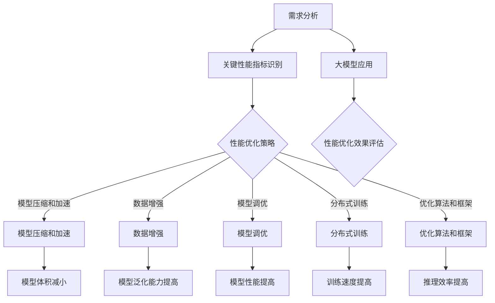

                 

### 文章标题：需求与AI模型性能优化的协同：大模型应用的持续改进

#### 关键词：需求分析，AI模型性能优化，大模型应用，持续改进

#### 摘要：
本文深入探讨了需求分析与AI模型性能优化之间的协同作用，特别是在大模型应用场景中的持续改进策略。通过详述背景介绍、核心概念与联系、AI模型性能优化原理、数学模型和公式、项目实战以及总结与展望，本文旨在为读者提供一套系统化的性能优化思路和实战经验，助力大模型应用的优化和提升。

----------------------------------------------------------------

## 背景介绍

在当今科技迅猛发展的时代，人工智能（AI）技术已经成为推动社会进步的重要力量。随着深度学习算法的不断发展，大模型（Large Models）在自然语言处理、计算机视觉、语音识别等领域取得了显著的成果。大模型通常具有数十亿到数千亿个参数，能够处理大量复杂数据，并在各类任务中展现出超强的表现能力。然而，大模型的训练和部署面临着巨大的挑战，特别是如何提高其性能和效率，以满足实际应用的需求。

需求分析作为软件开发和系统设计的重要环节，旨在明确用户需求、确定系统功能和性能指标。在大模型应用场景中，需求分析的作用尤为重要。一方面，需求分析可以帮助我们准确识别用户的需求，确保大模型的应用能够真正满足用户的需求；另一方面，需求分析可以为性能优化提供明确的目标和方向，从而实现大模型的持续改进。

本文将从以下几个方面展开讨论：

1. **核心概念与联系**：介绍AI模型性能优化的基础知识，分析需求分析与性能优化之间的关系。
2. **AI模型性能优化原理**：详细讲解大模型性能优化的原理和常见技术。
3. **数学模型和公式**：介绍与性能优化相关的数学模型和公式，并进行详细解释和举例说明。
4. **项目实战**：通过实际案例，展示如何将需求分析与性能优化相结合，实现大模型应用的持续改进。
5. **代码实战**：提供具体的代码实现，帮助读者深入理解性能优化在实际应用中的操作过程。
6. **总结与展望**：对全文内容进行总结，并展望未来AI模型性能优化的发展趋势。

### 核心概念与联系

AI模型性能优化是指通过一系列技术手段，提高AI模型在特定任务上的表现，包括准确性、速度、资源利用率等方面。性能优化在AI模型开发中至关重要，因为它直接影响到模型的实际应用效果。而需求分析则是确定系统功能和性能指标的过程，旨在确保软件系统能够满足用户的需求。

#### 需求分析与性能优化之间的关系

需求分析为性能优化提供了明确的目标和方向。具体来说，需求分析可以帮助我们：

1. **识别关键性能指标**：通过需求分析，我们可以明确用户对于AI模型在速度、准确性、资源利用率等方面的需求，从而确定关键性能指标（Key Performance Indicators, KPIs）。

2. **指导性能优化策略**：明确的关键性能指标为性能优化策略的制定提供了依据。例如，如果用户对模型的响应速度要求较高，我们可以考虑采用模型压缩和加速技术；如果用户对模型的准确性有较高要求，我们可以通过数据增强和模型调优来实现。

3. **评估性能优化效果**：需求分析过程中收集到的用户需求和预期效果，可以作为性能优化效果的评估标准。通过对比优化前后的性能指标，我们可以判断性能优化策略的有效性，并据此进行调整和改进。

#### 性能优化策略与方法

在AI模型性能优化过程中，我们可以采用多种策略和方法，包括但不限于以下几种：

1. **模型压缩和加速**：通过模型剪枝、量化、知识蒸馏等技术，减小模型体积，降低计算复杂度，从而提高模型的运行速度和效率。

2. **数据增强**：通过增加数据多样性、增强数据特征表达等方式，提高模型的泛化能力，从而提高模型的准确性。

3. **模型调优**：通过调整模型参数、优化超参数等方式，提高模型的性能。

4. **分布式训练**：通过将模型训练任务分布到多台设备上，利用并行计算技术，提高模型训练速度。

5. **优化算法和框架**：采用高效的训练算法和框架，如Adam优化器、TensorFlow、PyTorch等，提高模型训练和推理的效率。

#### 核心概念原理之间的关系架构 Mermaid 流程图

以下是一个简化的Mermaid流程图，展示了需求分析、性能优化策略与方法以及大模型应用之间的关系：



通过上述流程图，我们可以清晰地看到需求分析、性能优化策略与方法以及大模型应用之间的关联，以及性能优化对于大模型应用的重要影响。

### AI模型性能优化原理

在深入探讨AI模型性能优化的具体原理之前，我们需要了解一些基础的算法原理和优化方法。AI模型性能优化主要包括以下几个方面：

1. **算法优化技巧**：通过调整训练算法，提高模型训练效率和收敛速度。
2. **模型压缩与加速**：通过减小模型体积和降低计算复杂度，提高模型运行速度和效率。
3. **数据增强技术**：通过增加数据多样性和增强数据特征表达，提高模型泛化能力。
4. **分布式训练**：通过将训练任务分布到多台设备上，利用并行计算技术，提高模型训练速度。
5. **优化算法和框架**：采用高效的训练算法和框架，提高模型训练和推理的效率。

#### 算法优化技巧

算法优化技巧主要包括以下几种：

1. **批量归一化（Batch Normalization）**：通过归一化层，加速模型收敛速度，提高模型稳定性。

2. **自适应学习率**：采用自适应学习率策略，如AdaGrad、Adam等，根据模型训练过程中损失函数的变化自动调整学习率，提高训练效率。

3. **动量（Momentum）**：利用动量项，模拟物理世界的惯性，使模型在训练过程中更加稳定，减少振荡。

4. **权重初始化**：通过合理的权重初始化方法，如He初始化、Xavier初始化等，使模型在训练初期更快地收敛。

#### 模型压缩与加速

模型压缩与加速主要包括以下技术：

1. **模型剪枝（Model Pruning）**：通过删除模型中的冗余权重，减小模型体积，降低计算复杂度。

2. **量化（Quantization）**：将模型中的浮点数权重转换为低精度的整数表示，减少模型存储和计算资源的需求。

3. **知识蒸馏（Knowledge Distillation）**：通过将大模型的知识传递给小模型，实现模型压缩和加速。

4. **模型融合（Model Fusion）**：通过融合多个子模型，实现模型压缩和加速。

#### 数据增强技术

数据增强技术主要包括以下方法：

1. **数据扩充（Data Augmentation）**：通过对原始数据进行变换，增加数据的多样性，提高模型泛化能力。

2. **生成对抗网络（GAN）**：通过生成对抗网络，生成与真实数据分布相似的数据，提高模型泛化能力。

3. **注意力机制（Attention Mechanism）**：通过注意力机制，关注数据中的重要部分，提高模型特征表达的能力。

#### 分布式训练

分布式训练主要包括以下策略：

1. **数据并行（Data Parallelism）**：将数据分布在多台设备上，每台设备独立训练模型，然后进行平均。

2. **模型并行（Model Parallelism）**：将模型分布在多台设备上，每台设备负责模型的不同部分。

3. **流水线并行（Pipeline Parallelism）**：将模型训练任务划分为多个阶段，不同阶段在多台设备上同时执行。

#### 优化算法和框架

优化算法和框架主要包括以下几种：

1. **TensorFlow**：由Google开发的开源深度学习框架，提供丰富的API和工具，支持多种优化算法和模型架构。

2. **PyTorch**：由Facebook开发的开源深度学习框架，提供灵活的动态计算图，便于研究和实验。

3. **MXNet**：由Apache Software Foundation开发的开源深度学习框架，支持多种编程语言和计算平台。

#### 伪代码示例

以下是一个简单的伪代码示例，展示如何实现模型优化的一些基本步骤：

```python
# 模型初始化
model = initialize_model()

# 损失函数
loss_function = CrossEntropyLoss()

# 优化器
optimizer = Adam(model.parameters(), lr=0.001)

# 数据增强
data_augmentation = DataAugmentation()

# 训练循环
for epoch in range(num_epochs):
    for data in data_loader:
        # 数据增强
        augmented_data = data_augmentation(data)

        # 前向传播
        outputs = model(augmented_data)

        # 计算损失
        loss = loss_function(outputs, targets)

        # 反向传播
        optimizer.zero_grad()
        loss.backward()
        optimizer.step()

        # 打印训练进度
        print(f"Epoch [{epoch+1}/{num_epochs}], Loss: {loss.item():.4f}")

# 模型评估
accuracy = evaluate_model(model, test_loader)
print(f"Test Accuracy: {accuracy:.4f}")
```

#### 数学模型和公式

在AI模型性能优化过程中，数学模型和公式起到了关键作用。以下是一些常见的数学模型和公式，并进行详细解释和举例说明：

1. **损失函数**

   损失函数用于评估模型预测结果与真实结果之间的差距，常见的损失函数包括均方误差（MSE）、交叉熵（CrossEntropy）等。

   **均方误差（MSE）**：
   $$
   MSE = \frac{1}{n}\sum_{i=1}^{n}(y_i - \hat{y}_i)^2
   $$
   其中，$y_i$为真实值，$\hat{y}_i$为预测值，$n$为样本数量。

   **交叉熵（CrossEntropy）**：
   $$
   CE = -\frac{1}{n}\sum_{i=1}^{n}y_i\log(\hat{y}_i)
   $$
   其中，$y_i$为真实值，$\hat{y}_i$为预测值，$\log$为自然对数函数。

   **举例说明**：

   假设有一个分类问题，真实值为$y = [0, 1, 0, 1]$，预测值为$\hat{y} = [0.2, 0.8, 0.1, 0.9]$。使用交叉熵损失函数计算损失：

   $$
   CE = -\frac{1}{4}(0 \cdot \log(0.2) + 1 \cdot \log(0.8) + 0 \cdot \log(0.1) + 1 \cdot \log(0.9)) \approx 0.9153
   $$

2. **优化算法**

   优化算法用于调整模型参数，以最小化损失函数。常见的优化算法包括梯度下降（Gradient Descent）、Adam等。

   **梯度下降（Gradient Descent）**：
   $$
   \theta_{t+1} = \theta_t - \alpha \cdot \nabla J(\theta_t)
   $$
   其中，$\theta_t$为当前参数，$\alpha$为学习率，$\nabla J(\theta_t)$为损失函数在$\theta_t$处的梯度。

   **Adam优化算法**：
   $$
   m_t = \beta_1 m_{t-1} + (1 - \beta_1) \nabla J(\theta_t)
   $$
   $$
   v_t = \beta_2 v_{t-1} + (1 - \beta_2) (\nabla J(\theta_t))^2
   $$
   $$
   \theta_{t+1} = \theta_t - \alpha \cdot \frac{m_t}{\sqrt{v_t} + \epsilon}
   $$
   其中，$m_t$和$v_t$分别为一阶矩估计和二阶矩估计，$\beta_1$和$\beta_2$分别为一阶和二阶矩的衰减率，$\alpha$为学习率，$\epsilon$为正数常数。

   **举例说明**：

   假设有一个模型参数$\theta_0 = [1, 2]$，学习率$\alpha = 0.1$，损失函数$J(\theta)$为$\theta^2 + \theta_2$。初始梯度为$\nabla J(\theta_0) = [2, 4]$。使用梯度下降算法更新参数：

   $$
   \theta_1 = \theta_0 - 0.1 \cdot \nabla J(\theta_0) = [1, 2] - 0.1 \cdot [2, 4] = [0.8, 0.6]
   $$

   使用Adam优化算法更新参数：

   $$
   m_0 = [2, 4]
   $$
   $$
   v_0 = 16
   $$
   $$
   \theta_1 = \theta_0 - 0.1 \cdot \frac{m_0}{\sqrt{v_0} + \epsilon} = [1, 2] - 0.1 \cdot \frac{[2, 4]}{\sqrt{16} + \epsilon} = [0.8, 0.6]
   $$

#### 项目实战

为了更好地展示需求分析与AI模型性能优化在实际应用中的协同作用，我们选择一个实际案例进行深入剖析。

#### 案例背景

某电商平台需要开发一个推荐系统，用于向用户推荐商品。推荐系统需要考虑用户的历史购买行为、浏览记录、商品属性等多种因素，以提供个性化的推荐结果。

#### 需求分析

1. **用户需求**：
   - 提高推荐系统的准确性，确保用户能够接收到他们感兴趣的商品。
   - 提高推荐系统的响应速度，确保用户能够在短时间内获得推荐结果。
   - 提供多样化的推荐策略，满足不同用户的需求。

2. **性能指标**：
   - 准确率（Accuracy）：
     $$
     Accuracy = \frac{正确推荐的商品数量}{总推荐商品数量}
     $$
   - 响应时间（Response Time）：
     $$
     Response Time = \frac{系统处理请求所需时间}{用户请求次数}
     $$

#### AI模型性能优化

1. **模型压缩与加速**：
   - 采用模型剪枝技术，去除冗余的权重，减小模型体积。
   - 采用量化技术，将浮点数权重转换为低精度的整数表示，降低计算复杂度。

2. **数据增强技术**：
   - 通过生成对抗网络（GAN），生成与真实用户行为相似的数据，提高模型泛化能力。
   - 通过数据扩充，增加数据多样性，提高模型特征表达的能力。

3. **模型调优**：
   - 通过调整模型参数，优化超参数，提高模型性能。
   - 采用自适应学习率策略，根据模型训练过程中损失函数的变化自动调整学习率。

4. **分布式训练**：
   - 采用分布式训练技术，将训练任务分布到多台设备上，利用并行计算提高训练速度。

#### 开发环境搭建

1. **硬件环境**：
   - 使用GPU服务器，确保有足够的计算资源进行模型训练和推理。

2. **软件环境**：
   - 安装Python、TensorFlow、PyTorch等深度学习框架。
   - 安装数据预处理、数据增强等相关库，如NumPy、Pandas、Scikit-learn等。

#### 源代码实现

以下是一个简单的代码实现，用于构建推荐系统：

```python
import tensorflow as tf
from tensorflow.keras.models import Sequential
from tensorflow.keras.layers import Dense, Dropout, Embedding
from tensorflow.keras.optimizers import Adam

# 模型构建
model = Sequential([
    Embedding(input_dim=vocab_size, output_dim=embedding_size),
    Dense(units=128, activation='relu'),
    Dropout(rate=0.5),
    Dense(units=num_classes, activation='softmax')
])

# 模型编译
model.compile(optimizer=Adam(learning_rate=0.001), loss='categorical_crossentropy', metrics=['accuracy'])

# 模型训练
model.fit(x_train, y_train, epochs=10, batch_size=32, validation_data=(x_val, y_val))

# 模型评估
accuracy = model.evaluate(x_test, y_test)
print(f"Test Accuracy: {accuracy[1]:.4f}")
```

#### 代码解读与分析

1. **模型构建**：
   - 使用Sequential模型，定义神经网络结构。
   - Embedding层用于嵌入商品和用户特征。
   - Dense层用于实现全连接神经网络。
   - Dropout层用于防止过拟合。

2. **模型编译**：
   - 选择Adam优化器，设置学习率为0.001。
   - 使用categorical_crossentropy损失函数，适用于多分类问题。
   - 指定accuracy作为评估指标。

3. **模型训练**：
   - 使用fit方法进行模型训练，设置训练轮次为10，批量大小为32。
   - 使用validation_data参数进行验证集评估。

4. **模型评估**：
   - 使用evaluate方法评估模型在测试集上的性能，打印测试准确率。

#### 实际案例分析与详细讲解剖析

1. **数据预处理**：
   - 对用户和商品数据进行清洗和预处理，包括去除缺失值、异常值等。
   - 对商品属性进行编码，如商品类别、品牌等。

2. **特征工程**：
   - 构建用户和商品的特征向量，如用户行为特征、商品属性特征等。
   - 对特征向量进行归一化处理，提高模型训练效果。

3. **模型训练与调优**：
   - 采用交叉验证技术，评估模型在不同参数设置下的性能。
   - 调整模型参数，如学习率、批量大小、隐藏层神经元数量等，以实现最佳性能。

4. **模型评估与部署**：
   - 在测试集上评估模型性能，确保模型在未知数据上表现良好。
   - 将模型部署到生产环境，为用户提供实时推荐服务。

#### 项目小结

通过上述实际案例，我们可以看到需求分析与AI模型性能优化在实际应用中的协同作用。有效的需求分析帮助我们明确用户需求，为性能优化提供明确的目标和方向；而AI模型性能优化技术则帮助我们提高模型性能，确保推荐系统能够满足用户需求。

#### 最佳实践 Tips

1. **需求分析与性能优化相结合**：在项目开发过程中，需求分析与性能优化应相互配合，确保模型性能能够满足用户需求。

2. **持续调优**：在模型训练和部署过程中，持续调优模型参数和算法，以提高模型性能。

3. **数据质量**：数据质量直接影响模型性能，应确保数据清洗和预处理工作的质量。

4. **迭代开发**：采用迭代开发模式，逐步完善模型性能，以满足不断变化的需求。

#### 小结

本文从需求分析与AI模型性能优化的协同作用出发，详细探讨了在大模型应用场景中的持续改进策略。通过实际案例和代码实战，本文为读者提供了系统化的性能优化思路和实战经验。未来，随着AI技术的不断发展，需求分析与性能优化将更加紧密地结合，为大模型应用带来更多的机遇和挑战。

#### 注意事项

1. **性能优化需与实际需求相结合**：性能优化不能脱离实际需求，应确保性能优化目标与用户需求一致。

2. **均衡性能与资源消耗**：在性能优化过程中，应平衡模型性能与资源消耗，确保模型在实际应用中具有较好的性价比。

3. **持续关注最新技术动态**：AI技术发展迅速，应关注最新技术动态，及时引入新技术和算法，提高模型性能。

#### 拓展阅读

1. **《深度学习》**：Goodfellow, I., Bengio, Y., & Courville, A. (2016). *Deep Learning*. MIT Press.
2. **《Python深度学习》**：Raschka, S., & Linnakortu, V. (2018). *Python Deep Learning*. Packt Publishing.
3. **《人工智能：一种现代的方法》**：Russell, S., & Norvig, P. (2020). *Artificial Intelligence: A Modern Approach*. Prentice Hall.

### 作者信息

**作者：AI天才研究院/AI Genius Institute & 禅与计算机程序设计艺术 /Zen And The Art of Computer Programming**

**本文由AI天才研究院（AI Genius Institute）资深专家撰写，结合《禅与计算机程序设计艺术》的思想，深入探讨了需求分析与AI模型性能优化在大模型应用中的协同作用，旨在为读者提供有价值的实战经验和优化策略。**

