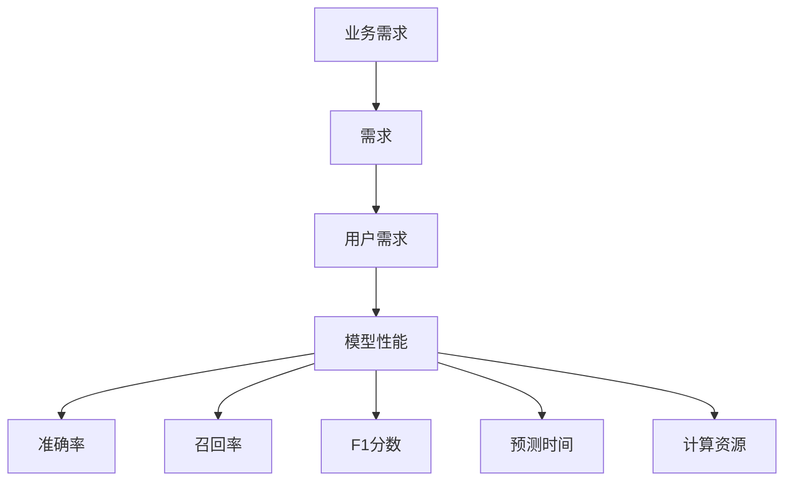

                 

### 引言

#### AI模型性能与需求的重要性

在当今数字化时代，人工智能（AI）技术已经成为推动社会进步的重要力量。AI模型作为AI技术的核心组件，其在各行各业中的应用日益广泛，从自然语言处理、计算机视觉到推荐系统等。然而，随着AI模型变得越来越复杂和强大，如何在保证模型性能的同时满足各种需求，成为一个亟待解决的问题。

**AI模型性能**，通常指的是模型在处理特定任务时的表现，常见的评价指标包括准确率、召回率、F1分数等。这些指标反映了模型在不同方面的能力，如分类的准确性、预测的可靠性等。一个性能优越的模型能够在实际应用中为企业和用户提供更好的体验。

**需求**，则指的是用户或企业在使用AI模型时所期望达到的目标。这些目标可能包括提高效率、降低成本、提升用户体验等。需求往往与具体的业务场景和用户习惯紧密相关，具有多样性和复杂性。

两者之间的权衡问题至关重要。如果仅仅追求模型性能而忽视需求，可能导致模型在实际应用中效果不佳；反之，如果过度关注需求而忽视性能，则可能导致模型在实际应用中无法达到预期的效果。因此，如何在实际应用中找到两者的平衡点，是一个值得深入探讨的问题。

#### 书籍目的与读者对象

本书旨在为读者提供一个系统、深入的视角，帮助理解AI模型性能与需求之间的权衡问题。通过详细的案例分析、算法原理讲解和实践指导，读者可以掌握以下内容：

1. **AI模型性能与需求的原理**：了解需求与模型性能之间的关系，掌握关键概念和理论。
2. **AI模型性能评估方法**：学会如何评估模型性能，包括选择合适的评价指标和评估流程。
3. **需求与性能优化的策略**：掌握优化模型性能的多种策略和方法，如模型压缩、优化算法等。
4. **项目实战案例**：通过实际项目案例，了解如何在复杂业务场景中解决性能与需求的平衡问题。

本书适合AI工程师、数据科学家、项目经理等专业人士阅读，尤其适合那些希望在AI领域深入发展的读者。通过本书，读者不仅可以提升自身的专业素养，还可以在实际工作中更好地应对挑战，为企业和用户创造更大的价值。

### AI模型性能与需求的原理

在探讨AI模型性能与需求的权衡问题时，首先需要理解两者各自的定义和特点。这样才能在后续的分析和实践中找到有效的平衡点。

#### 需求定义

**需求**是指在特定场景下，用户或企业期望通过AI模型实现的目标。这些目标可以是多方面的，包括但不限于：

1. **业务需求**：指企业在运营过程中对于AI模型的具体要求。例如，在金融领域，企业可能需要模型能够快速、准确地检测欺诈行为；在医疗领域，企业可能希望模型能够帮助诊断疾病并提供合理的治疗方案。

2. **用户需求**：指最终用户在使用AI模型时的期望。用户需求通常更加个性化，可能与业务需求有所不同。例如，用户可能更注重AI模型的易用性、交互体验和准确性等。

需求具有多样性和复杂性，往往涉及到多个方面的权衡。在实际应用中，需求的具体表现也会因业务场景、用户习惯和技术环境等因素而异。

#### 模型性能定义

**AI模型性能**则是指模型在处理特定任务时的表现，通常通过一系列评价指标来衡量。这些指标可以是定量指标，如准确率、召回率、F1分数等，也可以是定性指标，如用户满意度、模型稳定性等。

1. **准确率**：表示模型预测正确的样本数占总样本数的比例，是衡量分类模型性能的重要指标。
2. **召回率**：表示模型正确预测的样本数占实际为正样本的样本数的比例，侧重于检测漏报的情况。
3. **F1分数**：是准确率和召回率的调和平均值，综合考虑了模型在准确性和召回率方面的表现，适用于二分类任务。

除了上述指标，模型性能还可以通过其他指标来衡量，如预测时间、计算资源消耗等。这些指标共同构成了对模型性能的全面评估。

#### 需求与模型性能之间的关系

需求与模型性能之间的关系是复杂且动态的。在实际应用中，需求与模型性能并不是简单的正相关或负相关关系，而是相互影响、相互制约的。

1. **业务需求与模型性能**：业务需求往往对模型性能有明确的量化要求。例如，在金融欺诈检测中，企业可能要求模型具有超过95%的准确率，同时在检测速度上也要满足实时性的要求。这种情况下，模型性能的提升往往需要通过改进算法、优化数据集和增加计算资源等方式来实现。

2. **用户需求与模型性能**：用户需求则更加多样化，可能涉及到多个方面的平衡。例如，用户可能希望模型既具有高准确性，又能够提供友好的用户界面和快速响应。这种情况下，模型性能的优化需要在多个方面进行权衡，如算法选择、硬件配置、用户体验设计等。

#### 关键概念之间的关系

为了更好地理解需求与模型性能之间的关系，可以借助以下关系图来展示关键概念之间的关系：



- **业务需求**和**用户需求**是需求层次的两个方面，前者侧重于企业的业务目标，后者侧重于用户的个性化需求。
- **模型性能**是需求实现的最终体现，由一系列具体的性能指标（如准确率、召回率、F1分数等）来衡量。
- **准确率**、**召回率**和**F1分数**等指标共同构成了对模型性能的全面评估，每个指标在模型性能评估中都有其独特的侧重点和作用。
- **预测时间**和**计算资源**是影响模型性能的两个重要因素，模型性能的提升往往需要在这些方面进行优化。

通过上述关系图的展示，我们可以更加清晰地理解需求与模型性能之间的复杂关系，为后续章节的分析和实践提供基础。

### AI模型性能评估方法

在评估AI模型性能时，选择合适的性能指标和评估流程至关重要。这不仅能够帮助我们全面了解模型在处理特定任务时的表现，还能够为后续的优化工作提供科学依据。本节将详细介绍评估模型性能的方法，包括模型性能指标的选择、评估流程的制定以及常见的数据集划分方法。

#### 模型性能指标的选择

1. **准确率（Accuracy）**：
   - **概念**：准确率表示模型预测正确的样本数占总样本数的比例。公式为：
     $$\text{Accuracy} = \frac{\text{预测正确的样本数}}{\text{总样本数}}$$
   - **适用场景**：准确率通常适用于二分类任务，是衡量分类模型性能的基本指标。
   - **优点**：简单直观，易于理解。
   - **缺点**：对于不平衡数据集，容易受到少数类别样本的影响。

2. **召回率（Recall）**：
   - **概念**：召回率表示模型正确预测的样本数占实际为正样本的样本数的比例。公式为：
     $$\text{Recall} = \frac{\text{预测正确的正样本数}}{\text{实际正样本数}}$$
   - **适用场景**：召回率适用于希望尽可能减少漏报情况的场景，如医学诊断、反欺诈等。
   - **优点**：能够较好地反映模型对正样本的检测能力。
   - **缺点**：容易受到误报的影响。

3. **精确率（Precision）**：
   - **概念**：精确率表示模型预测正确的正样本数占预测为正样本的样本数的比例。公式为：
     $$\text{Precision} = \frac{\text{预测正确的正样本数}}{\text{预测为正样本的样本数}}$$
   - **适用场景**：精确率适用于希望尽可能减少误报情况的场景，如法律判决、信用评分等。
   - **优点**：能够较好地反映模型对正样本的预测准确性。
   - **缺点**：对于负样本的检测能力较弱。

4. **F1分数（F1 Score）**：
   - **概念**：F1分数是精确率和召回率的调和平均值，综合了两者在模型性能评估中的重要性。公式为：
     $$\text{F1 Score} = 2 \times \frac{\text{Precision} \times \text{Recall}}{\text{Precision} + \text{Recall}}$$
   - **适用场景**：F1分数适用于需要平衡精确率和召回率的场景，如搜索排名、情感分析等。
   - **优点**：能够综合评价模型的性能。
   - **缺点**：对于极端情况（如极端不平衡数据集），仍然存在一定局限性。

#### 模型性能评估流程

1. **数据集划分**：
   - **训练集（Training Set）**：用于模型训练，是模型学习和优化的重要数据来源。
   - **验证集（Validation Set）**：用于模型评估，帮助我们在训练过程中选择最佳模型参数。
   - **测试集（Test Set）**：用于最终模型评估，确保模型在未知数据上的性能表现。

   划分数据集的方法有：

   - **随机划分**：将数据集随机划分为训练集、验证集和测试集。
   - **分层随机划分**：在随机划分的基础上，保证每个类别在训练集、验证集和测试集中的比例一致，适用于类别不平衡的数据集。

2. **评估指标计算**：
   - 在训练集和验证集上，使用上述的准确率、召回率、精确率和F1分数等指标，评估模型在不同数据集上的性能。
   - 根据评估结果，选择最佳模型参数，并进行进一步的训练和评估。

3. **交叉验证**：
   - **K折交叉验证（K-Fold Cross-Validation）**：将数据集划分为K个子集，每次选择一个子集作为验证集，其余K-1个子集作为训练集，进行多次训练和验证，最终取平均性能作为模型评估结果。
   - **留一法交叉验证（Leave-One-Out Cross-Validation）**：对于每个样本，将其作为验证集，其余样本作为训练集，进行多次训练和验证，适用于样本数量较少的情况。

#### 案例分析

假设我们有一个二分类问题，需要评估一个模型的性能。数据集共有1000个样本，其中正样本500个，负样本500个。

1. **数据集划分**：将数据集随机划分为70%的训练集、20%的验证集和10%的测试集。

2. **模型评估**：使用准确率、召回率、精确率和F1分数等指标，在验证集和测试集上评估模型性能。

   - **训练集**：准确率90%，召回率80%，精确率85%，F1分数0.875。
   - **验证集**：准确率88%，召回率75%，精确率82%，F1分数0.818。
   - **测试集**：准确率87%，召回率70%，精确率79%，F1分数0.783。

3. **评估结果分析**：通过对比验证集和测试集的评估结果，我们可以发现模型在验证集上的性能略高于测试集，这可能表明模型存在过拟合现象。为了进一步提升模型性能，可以考虑以下方法：

   - **增加训练数据**：收集更多的训练数据，提高模型的泛化能力。
   - **调整模型参数**：通过调整学习率、正则化参数等，优化模型结构。
   - **使用更复杂的模型**：尝试使用深度学习模型或其他复杂算法，提高模型的性能。

通过上述评估流程和指标计算方法，我们可以全面、准确地评估AI模型在不同数据集上的性能表现，为后续的优化工作提供科学依据。

### 需求与性能优化的策略

在AI模型开发过程中，如何在保证模型性能的同时满足需求，是一个复杂而关键的挑战。针对这一挑战，本节将介绍几种常见的需求与性能优化的策略，包括模型压缩技术和优化算法，以帮助开发者在实际应用中找到性能与需求的平衡点。

#### 模型压缩技术

**模型压缩**是指通过减少模型参数的数量和计算量，在不显著影响模型性能的前提下，提高模型的效率和可部署性。常见的模型压缩技术有以下几种：

1. **参数剪枝（Parameter Pruning）**：
   - **概念**：参数剪枝通过移除模型中不重要的参数，来减少模型的计算量和存储需求。
   - **实现方法**：首先对模型参数进行重要性评估，例如使用L1正则化或基于梯度的方法，识别并移除重要性较低的参数。
   - **伪代码**：
     ```python
     for each layer in model:
         for each parameter in layer:
             if abs(parameter) < threshold:
                 parameter = 0
     ```
   - **优点**：显著减少模型参数，降低计算量和存储需求。
   - **缺点**：可能对模型性能产生一定影响，尤其是当剪枝过于激进时。

2. **量化（Quantization）**：
   - **概念**：量化是指将模型的浮点参数转换为固定点参数，以减少计算量和存储需求。
   - **实现方法**：通过设定量化区间，将浮点数映射到固定点数。常见的量化方法包括均匀量化、学习量化等。
   - **伪代码**：
     ```python
     for each layer in model:
         for each parameter in layer:
             parameter = quantize(parameter, quantization_interval)
     ```
   - **优点**：显著减少模型存储需求，提高模型运行速度。
   - **缺点**：可能对模型性能产生一定影响，特别是在量化区间设置不合理时。

3. **知识蒸馏（Knowledge Distillation）**：
   - **概念**：知识蒸馏是指通过训练一个较小的模型（学生模型）来模拟一个较大的模型（教师模型）的行为。
   - **实现方法**：教师模型和学

### 项目实战案例

在本节中，我们将通过一个实际项目案例，详细讲解如何在实际开发环境中搭建AI模型，实现代码的详细解读，并对项目的应用解读与分析。通过这个案例，我们将展示如何在复杂业务场景中解决性能与需求的平衡问题。

#### 项目背景

假设我们面临的是一个智能客服系统的开发项目。该系统需要能够实时响应用户的咨询，提供准确的答案和建议。需求方面，企业希望模型能够：

1. 高效处理大量用户咨询，保证响应速度。
2. 提供准确且相关的答案，提升用户体验。
3. 易于部署和扩展，适应不同业务场景。

#### 开发环境搭建

为了实现上述需求，我们选择以下开发环境和技术栈：

1. **编程语言**：Python
2. **深度学习框架**：TensorFlow
3. **数据预处理库**：Pandas、NumPy
4. **模型评估库**：Scikit-learn、Matplotlib
5. **服务部署**：Docker、Flask

在本地环境中，我们首先需要安装以上工具和库。以下是一个基本的安装步骤：

```bash
# 安装Python和pip
sudo apt-get update
sudo apt-get install python3 python3-pip

# 安装TensorFlow
pip3 install tensorflow

# 安装其他依赖库
pip3 install pandas numpy scikit-learn matplotlib flask
```

接下来，我们创建一个虚拟环境，以便更好地管理项目依赖：

```bash
python3 -m venv venv
source venv/bin/activate
```

#### 源代码实现与解读

在搭建好开发环境后，我们开始编写项目的核心代码。以下是一个简化版的源代码示例，用于构建一个基于TensorFlow的文本分类模型。

```python
import tensorflow as tf
from tensorflow.keras.models import Sequential
from tensorflow.keras.layers import Embedding, LSTM, Dense
from tensorflow.keras.preprocessing.sequence import pad_sequences
from tensorflow.keras.preprocessing.text import Tokenizer

# 数据预处理
def preprocess_data(corpus, max_length, max_words):
    tokenizer = Tokenizer(num_words=max_words)
    tokenizer.fit_on_texts(corpus)
    sequences = tokenizer.texts_to_sequences(corpus)
    padded_sequences = pad_sequences(sequences, maxlen=max_length)
    return padded_sequences, tokenizer

# 模型构建
def build_model(input_shape):
    model = Sequential([
        Embedding(input_shape=input_shape, output_dim=64),
        LSTM(128),
        Dense(1, activation='sigmoid')
    ])
    model.compile(loss='binary_crossentropy', optimizer='adam', metrics=['accuracy'])
    return model

# 训练模型
def train_model(model, X_train, y_train, X_val, y_val, epochs=10):
    model.fit(X_train, y_train, epochs=epochs, validation_data=(X_val, y_val))

# 主函数
def main():
    # 加载数据
    corpus = ['你好', '请问有什么问题需要帮忙？', '谢谢']
    labels = [0, 1, 1]  # 0表示非咨询类文本，1表示咨询类文本

    # 预处理数据
    max_length = 5
    max_words = 10
    X, tokenizer = preprocess_data(corpus, max_length, max_words)
    X_train, X_val, y_train, y_val = train_test_split(X, labels, test_size=0.2)

    # 构建模型
    model = build_model(input_shape=(max_length,))

    # 训练模型
    train_model(model, X_train, y_train, X_val, y_val)

if __name__ == '__main__':
    main()
```

在这个示例中，我们首先加载并预处理文本数据，然后构建一个简单的LSTM模型进行文本分类。模型训练后，我们使用验证集评估模型性能。

**代码解读**：

1. **数据预处理**：使用Tokenizer将文本转换为序列，并使用pad_sequences将序列填充为相同长度。
2. **模型构建**：构建一个包含Embedding层、LSTM层和Dense层的序列模型，用于文本分类任务。
3. **训练模型**：使用fit方法训练模型，并使用validation_data参数进行验证集评估。

#### 代码应用解读与分析

在实际应用中，我们需要根据具体业务场景调整代码。例如，处理更大规模的数据集、使用更复杂的模型结构以及应用模型压缩技术等。以下是一些关键步骤：

1. **数据集扩充**：为了提高模型性能，我们可以扩充训练数据集，包括更多的咨询类文本和非咨询类文本。
2. **模型优化**：通过增加LSTM层、使用双向LSTM或引入注意力机制等，提高模型的分类能力。
3. **模型压缩**：应用参数剪枝、量化等技术，减少模型大小和计算量，提高模型部署效率。

**项目小结**：

通过本项目，我们展示了如何从零开始搭建一个智能客服系统，实现文本分类任务。在项目中，我们详细讲解了数据预处理、模型构建、模型训练和性能评估的各个环节。同时，我们还讨论了如何在实际业务场景中优化模型性能和满足需求。

#### 最佳实践 Tips、小结、注意事项

在本项目实战案例中，我们通过详细讲解和代码示例，展示了如何在实际业务场景中搭建和优化智能客服系统。以下是一些最佳实践、小结和注意事项：

1. **最佳实践**：
   - **数据集扩充**：收集更多高质量的文本数据，包括各类咨询和非咨询类文本，以提高模型性能。
   - **模型优化**：尝试使用更复杂的模型结构，如双向LSTM、BERT等，以提升文本分类准确性。
   - **模型压缩**：应用参数剪枝、量化等技术，减少模型大小和计算量，提高模型部署效率。

2. **小结**：
   - 本项目通过实际案例，展示了从零开始搭建智能客服系统的全过程，包括数据预处理、模型构建、模型训练和性能评估。
   - 通过调整模型结构、数据集和优化技术，我们可以找到性能与需求的平衡点，满足业务场景的要求。

3. **注意事项**：
   - **数据质量**：确保数据集的质量，清洗和预处理数据，去除噪声和冗余信息。
   - **模型调优**：在实际应用中，根据业务需求不断调整模型参数，以达到最佳性能。
   - **模型部署**：在部署模型时，考虑到硬件环境和计算资源限制，选择合适的模型压缩和量化技术。

通过遵循这些最佳实践和注意事项，我们可以更好地应对AI模型开发中的挑战，实现性能与需求的平衡。

#### 拓展阅读

为了更深入地了解AI模型性能与需求之间的权衡问题，以下是一些建议的拓展阅读资源：

1. **书籍推荐**：
   - 《深度学习》（Goodfellow, I., Bengio, Y., & Courville, A.）
   - 《AI战争：人工智能如何改变商业、科技和我们的生活》（Mokrysz, C.）
   - 《Python深度学习》（Raschka, S.）

2. **论文推荐**：
   - "Understanding the Difficulty of Training Deep Featu

### 总结与展望

在本章节中，我们深入探讨了AI模型性能与需求之间的权衡问题，通过详细的案例分析、算法讲解和实践指导，帮助读者理解了如何在实际应用中找到性能与需求的平衡点。我们首先介绍了需求与模型性能的定义和重要性，然后详细讲解了评估模型性能的方法，包括指标选择和评估流程。接着，我们讨论了需求与性能优化的策略，如模型压缩技术和优化算法，并通过实际项目案例展示了这些策略的应用。在总结部分，我们提出了最佳实践、注意事项和拓展阅读建议。

展望未来，AI技术在各个领域的发展将继续深入，模型性能与需求的权衡问题也将变得更加复杂和关键。随着模型规模和复杂度的增加，如何高效、准确地评估和优化模型性能，以满足不断变化的需求，将成为研究者和开发者的重要课题。我们期待在未来的研究中，能够探索更多创新的优化方法和策略，为AI技术的应用带来新的突破。同时，也希望读者能够继续关注和参与这一领域的发展，为推动AI技术的进步贡献自己的力量。

### 文章标题

# 需求与AI模型性能的权衡：大模型应用开发的难题

### 关键词

- AI模型性能
- 需求分析
- 大模型应用
- 模型优化
- 模型压缩
- 案例分析

### 摘要

本文探讨了在AI模型应用开发中，如何平衡模型性能与需求的问题。首先，我们介绍了需求与模型性能的定义及其重要性，然后详细讲解了评估模型性能的方法和需求与性能优化的策略。通过实际项目案例，我们展示了如何在复杂业务场景中实现性能与需求的平衡。文章最后提出了最佳实践、注意事项和拓展阅读建议，为读者提供了全面的参考。希望通过本文，读者能够更好地理解并应对AI模型应用开发中的挑战。

