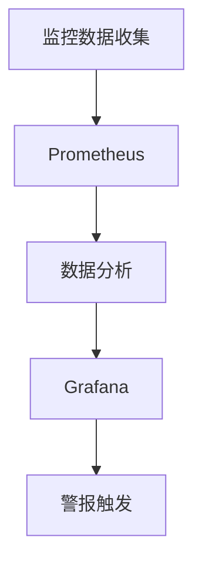
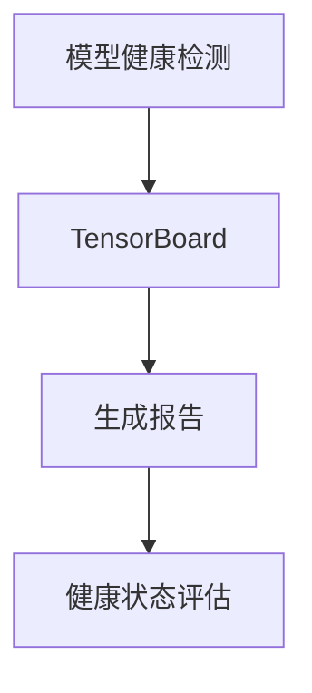
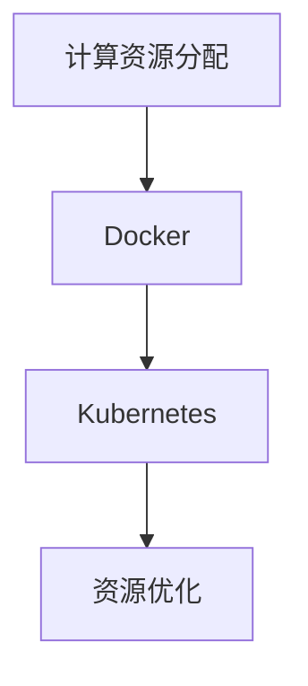
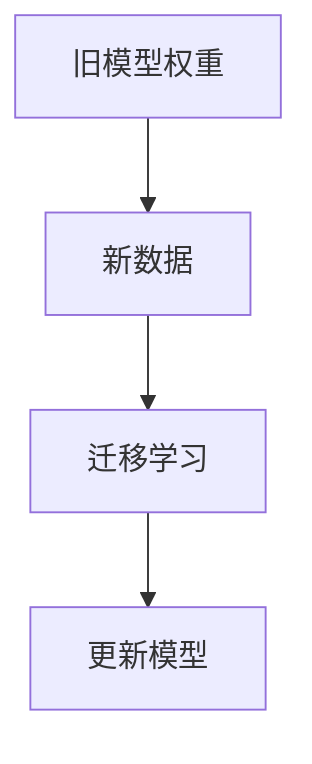
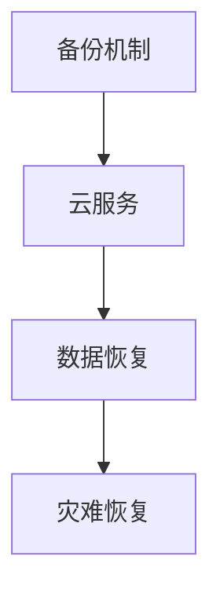

                 

### 文章标题

《需求与AI模型监控指标的匹配：大模型应用的运维考量》

### 关键词

- AI模型
- 监控指标
- 运维考量
- 大模型应用
- 需求匹配

### 摘要

本文旨在探讨在AI模型应用过程中，如何根据实际需求选择并设定合适的监控指标，以实现对大模型的有效运维。通过深入分析AI模型的特性、监控指标的选取原则以及运维过程中的挑战，本文提供了具体的实施策略和最佳实践，帮助读者理解和掌握AI模型监控与运维的核心方法，从而提升AI应用的稳定性和效率。

---

## 前言

随着人工智能技术的飞速发展，AI模型在各个领域得到了广泛应用，从金融、医疗到制造业，AI模型正逐步成为提升业务效率和决策能力的重要工具。然而，AI模型的应用并非一蹴而就，其背后的运维工作同样至关重要。尤其是在面对大型AI模型时，如何确保模型的稳定性、高效性和可靠性，成为了众多企业和开发者亟待解决的问题。

本文将围绕这一核心问题展开讨论。我们首先介绍AI模型的背景知识，包括其工作原理和常见类型。接着，我们将详细探讨监控指标的选择原则，并分析在实际运维过程中可能遇到的问题。最后，本文将提出一系列最佳实践，帮助读者有效地进行AI模型的监控与运维。

通过本文的阅读，读者将能够：
1. 理解AI模型的本质和重要性。
2. 掌握监控指标的选择和设定方法。
3. 掌握在运维过程中应对挑战的策略和技巧。
4. 学会如何根据实际需求优化AI模型的应用。

让我们开始这次探索，深入了解AI模型在需求与监控指标匹配中的运维考量。

### AI模型的工作原理及类型

AI模型，即人工智能模型，是基于算法和数据进行预测或决策的计算机程序。它们通过学习大量数据，提取特征，并利用这些特征来做出预测或决策。AI模型的核心在于其算法，这些算法使得机器能够模拟人类思维，从数据中发现规律并进行预测。

#### 机器学习模型

机器学习模型是AI模型的一种重要类型，主要分为监督学习、无监督学习和强化学习三种。

- **监督学习**：在这种学习中，模型使用标记数据集进行训练，标记数据包含了输入和对应的输出。通过学习输入与输出之间的关系，模型能够对未知数据进行预测。常见的监督学习算法包括线性回归、决策树、支持向量机（SVM）和神经网络等。

  ```python
  # 线性回归的伪代码
  def linear_regression(x, y):
      # 计算斜率和截距
      m = (y.mean() - x.mean()) / x.std()
      b = y.mean() - m * x.mean()
      # 预测
      return m * x + b
  ```

- **无监督学习**：与监督学习不同，无监督学习不使用标记数据，而是通过分析未标记的数据，寻找数据中的模式和结构。常见的无监督学习算法包括K-均值聚类、主成分分析（PCA）和自编码器等。

  ```python
  # K-均值聚类的伪代码
  def k_means(data, k):
      # 初始化k个中心点
      centroids = initialize_centroids(data, k)
      while not converged:
          # 分配数据到最近的中心点
          assign_points_to_centroids(data, centroids)
          # 更新中心点
          centroids = update_centroids(data, centroids)
      return centroids
  ```

- **强化学习**：强化学习是一种通过试错来学习的模型，它通过与环境的互动来逐步优化策略。强化学习的核心是奖励机制，通过奖励来激励模型采取正确的行动。常见的强化学习算法包括Q学习、SARSA和深度强化学习等。

  ```python
  # Q学习的伪代码
  def q_learning(state, action, reward, next_state, alpha, gamma):
      # 更新Q值
      Q[state, action] = Q[state, action] + alpha * (reward + gamma * max(Q[next_state, :]) - Q[state, action])
  ```

#### 深度学习模型

深度学习模型是机器学习的一种重要分支，其核心在于多层神经网络的结构。深度学习模型能够自动提取复杂的数据特征，从而实现高度准确的预测和分类。常见的深度学习模型包括卷积神经网络（CNN）、循环神经网络（RNN）和生成对抗网络（GAN）等。

- **卷积神经网络（CNN）**：CNN是一种专门用于处理图像数据的神经网络，其核心在于卷积层，能够自动提取图像的特征。

  ```python
  # CNN的伪代码
  def conv2d(input, filter):
      # 计算卷积
      return (input * filter).sum(axis=1)
  ```

- **循环神经网络（RNN）**：RNN是一种能够处理序列数据的神经网络，其核心在于记忆单元，能够记住前面的输入。

  ```python
  # RNN的伪代码
  def rnn(input, hidden_state, weights):
      # 计算隐藏状态
      hidden_state = activation_function((input * weights).sum())
      return hidden_state
  ```

- **生成对抗网络（GAN）**：GAN由生成器和判别器组成，生成器生成数据，判别器判断数据的真实性，通过两者之间的博弈，生成器不断优化生成质量。

  ```python
  # GAN的伪代码
  def train_gan(generator, discriminator, data, batch_size):
      for _ in range(epochs):
          # 训练判别器
          real_data = get_random_data(data, batch_size)
          fake_data = generator.generate_data()
          discriminator.train(real_data, fake_data)
          
          # 训练生成器
          generator.train(discriminator)
  ```

通过理解这些AI模型的工作原理和类型，我们可以更好地为实际需求选择合适的模型，并为其设计有效的监控指标，从而实现大模型应用的运维优化。

### 监控指标的选择原则

在选择AI模型的监控指标时，我们需要遵循一些基本原则，以确保监控指标的设定既有效又具有实际意义。以下是一些核心原则：

#### 一致性

监控指标应该与AI模型的目标保持一致。例如，如果模型的目标是进行分类，那么分类准确率、精确率、召回率等指标就是合适的选择。如果目标是进行回归预测，那么均方误差（MSE）、平均绝对误差（MAE）等指标则更为适用。不一致的监控指标会导致监控失效，无法准确反映模型的表现。

#### 实用性

监控指标需要易于理解和计算，同时也要便于在实际环境中实施。例如，使用复杂的数学公式或难以获取的数据来计算监控指标，可能会导致监控过程繁琐且不可行。因此，选择实用性的监控指标是关键。

#### 全面性

监控指标不仅要反映模型的性能，还应该涵盖模型在不同方面的表现。例如，除了准确率、召回率等性能指标外，还可以考虑模型的可解释性、稳定性、资源消耗等指标。全面的监控能够提供更多维度的信息，帮助运维人员更全面地了解模型的表现。

#### 可扩展性

随着AI模型的应用场景不断扩展，监控指标也应该具备可扩展性。这意味着，监控指标不仅要适用于当前的模型和任务，还应该能够在未来扩展到新的模型和应用场景。例如，当模型从简单的二分类任务扩展到多分类或回归任务时，监控指标也应相应调整。

#### 及时性

监控指标的数据采集和分析需要及时进行，以确保监控结果能够迅速反映模型的当前状态。及时性的监控可以及时发现潜在的问题，从而采取及时的措施进行优化。例如，使用实时数据分析平台，可以实时监控模型的性能指标，并在异常情况下迅速报警。

#### 可视化

为了更好地理解和分析监控数据，监控指标应具备良好的可视化能力。通过图表、仪表板等可视化工具，运维人员可以直观地了解模型的表现，从而更好地做出决策。例如，使用折线图可以直观地展示模型在不同时间点的性能变化。

#### 可定制性

不同的应用场景和需求可能需要不同的监控指标。因此，监控指标应具备一定的可定制性，允许运维人员根据具体需求进行调整。例如，在金融领域，可能会关注模型的交易执行速度和风险控制能力，而在医疗领域，则可能更关注模型的诊断准确性和患者数据保护。

综上所述，选择合适的监控指标是一个系统性的工作，需要综合考虑多个因素。通过遵循上述原则，我们可以设计出既有效又实用的监控指标体系，为AI模型的应用提供坚实的技术保障。

### 实际运维过程中面临的主要挑战

在AI模型的实际运维过程中，开发者和管理者通常会面临一系列挑战，这些挑战不仅影响模型的性能，还可能对整个系统的稳定性和安全性产生负面影响。以下是一些主要的挑战及其解决方案：

#### 数据质量问题

数据质量是AI模型稳定性和准确性的基础。如果数据存在噪声、缺失值或不一致性，模型的性能将大打折扣。例如，一个医疗诊断模型如果接收了不准确的病人数据，可能会产生错误的诊断结果。解决方案包括：
1. **数据清洗**：使用数据清洗工具和技术去除噪声和缺失值。
2. **数据标准化**：对不同来源的数据进行标准化处理，确保数据的统一性。
3. **数据验证**：建立数据验证机制，确保数据在进入模型之前是高质量的。

#### 模型过拟合问题

模型过拟合是指模型在训练数据上表现良好，但在未知数据上表现不佳。这种情况下，模型可能无法泛化到新的数据集，导致实际应用中的表现不尽如人意。解决方案包括：
1. **交叉验证**：使用交叉验证技术评估模型的泛化能力。
2. **正则化**：应用正则化方法，如L1和L2正则化，来防止模型过拟合。
3. **增加数据量**：通过收集更多的训练数据，增强模型的泛化能力。

#### 模型更新和维护问题

随着时间和应用环境的变化，AI模型可能需要定期更新和维护。否则，模型可能会逐渐变得不准确，甚至失去其预测能力。解决方案包括：
1. **持续学习**：采用持续学习技术，让模型能够从新的数据中学习，保持其预测能力。
2. **定期评估**：定期对模型进行评估，检查其性能是否下降，并在必要时进行优化。
3. **版本控制**：使用版本控制工具，管理模型的各个版本，确保更新和回滚过程的可控性。

#### 系统资源管理问题

大型AI模型通常需要大量的计算资源和存储资源。如果资源管理不当，可能会导致系统崩溃或性能下降。解决方案包括：
1. **资源优化**：通过优化算法和硬件配置，提高系统的资源利用率。
2. **动态资源分配**：使用动态资源管理技术，根据模型的需求自动调整资源分配。
3. **分布式计算**：采用分布式计算框架，将计算任务分布在多个节点上，提高系统的并行处理能力。

#### 模型安全性问题

AI模型可能会成为恶意攻击的目标，例如注入攻击、模型劫持等。这些问题不仅影响模型的性能，还可能导致严重的安全风险。解决方案包括：
1. **安全测试**：定期对模型进行安全测试，识别潜在的安全漏洞。
2. **访问控制**：实施严格的访问控制机制，确保只有授权用户才能访问模型。
3. **加密技术**：使用加密技术保护模型和数据，防止数据泄露。

通过认识和解决这些挑战，开发者和管理者可以确保AI模型在运维过程中的稳定性和高效性，从而充分发挥其在实际应用中的潜力。

### 大模型应用的运维策略

在AI模型的运维过程中，尤其是大型模型的运维，策略的选择至关重要。以下是一些有效的运维策略，帮助确保AI模型的高效性和稳定性：

#### 自动化监控

自动化监控是确保AI模型稳定性的关键。通过建立自动化监控系统，可以实时监控模型的状态和性能。例如，可以使用监控工具如Prometheus或Grafana，定期收集模型的性能数据，并在出现异常时自动触发警报。这不仅能快速响应潜在问题，还能减轻运维人员的工作负担。



#### 健康状态检测

定期对AI模型进行健康状态检测，是确保模型持续有效运行的必要步骤。健康状态检测包括检查模型的准确率、召回率、资源使用情况等多个方面。例如，可以使用自定义脚本或现有的工具如TensorBoard，定期生成模型的健康报告。



#### 资源优化

资源优化是提高AI模型运行效率的重要手段。通过合理配置计算资源和存储资源，可以减少模型的延迟和资源浪费。例如，使用容器化技术如Docker和Kubernetes，可以实现资源的动态分配和高效管理。



#### 定期更新

定期更新模型是确保其预测能力和适应性不断提升的关键。通过持续学习技术，模型可以不断从新数据中学习，从而保持其准确性和有效性。例如，可以使用迁移学习技术，将已有模型的权重迁移到新数据上，减少训练时间。



#### 灾难恢复

灾难恢复是确保AI模型在异常情况下能够快速恢复的重要策略。建立完善的备份和恢复机制，可以在系统故障或数据丢失时，迅速恢复模型的运行状态。例如，使用云服务提供商提供的备份和恢复服务，确保数据的安全性和可恢复性。



### 实际案例：搜索引擎的运维优化

以下是一个实际案例，展示了如何通过上述策略优化搜索引擎的运维：

#### 案例背景

某大型搜索引擎公司面临着高并发请求和数据规模不断增长的挑战。为了确保搜索服务的高效性和稳定性，该公司决定实施一系列运维优化措施。

#### 自动化监控

公司采用了Prometheus进行自动化监控。通过监控工具，定期收集搜索服务的响应时间、错误率、吞吐量等关键指标，并在出现异常时自动触发警报。


#### 健康状态检测

公司使用TensorBoard定期检测搜索模型的健康状态，包括准确率、召回率等指标。一旦发现健康状态下降，会立即进行优化。


#### 资源优化

通过容器化技术，公司使用Docker和Kubernetes对搜索服务进行资源优化。通过动态调整容器资源，确保在高并发请求下系统能够保持高效运行。


#### 定期更新

公司采用持续学习技术，定期更新搜索模型。通过迁移学习，将已有模型的权重迁移到新数据集上，减少了训练时间，同时保持了模型的准确性。


#### 灾难恢复

公司建立了完善的备份和恢复机制，使用云服务提供商的备份服务定期备份搜索服务的数据。一旦发生系统故障或数据丢失，可以迅速恢复数据，确保搜索服务的连续性。


通过这些运维优化策略，搜索引擎公司不仅提高了搜索服务的效率和稳定性，还降低了运维成本，为用户提供了一个更加可靠的搜索体验。

### 总结与展望

通过对需求与AI模型监控指标匹配的深入探讨，我们了解到在大模型应用的运维过程中，监控指标的选择和设定至关重要。合理的监控指标能够有效反映模型的表现，帮助运维人员及时发现和解决问题，从而确保AI模型的高效性和稳定性。

本文首先介绍了AI模型的工作原理及类型，包括机器学习模型和深度学习模型。接着，我们讨论了监控指标的选择原则，强调了监控指标的一致性、实用性、全面性、可扩展性、及时性、可定制性和可视化。在实际运维过程中，我们面临的数据质量、模型过拟合、模型更新和维护、系统资源管理以及模型安全性等挑战，都需要通过有效的策略进行应对。此外，我们还提出了自动化监控、健康状态检测、资源优化、定期更新和灾难恢复等运维策略，并通过实际案例展示了这些策略的具体应用。

未来，随着AI技术的进一步发展和应用场景的扩展，AI模型的监控和运维将面临更多挑战和机遇。我们应持续关注AI模型的新进展，不断优化监控指标和运维策略，以应对新的需求。同时，应加强跨学科合作，结合计算机科学、数据科学和人工智能的先进理念，推动AI模型的监控和运维技术达到新的高度。通过这些努力，我们能够更好地发挥AI模型在各个领域的潜力，为实际应用提供更加可靠和高效的支持。

### 最佳实践与注意事项

在AI模型的监控和运维过程中，以下是一些最佳实践和注意事项，帮助您更有效地进行工作：

#### 最佳实践

1. **统一监控指标**：确保所有AI模型使用相同的监控指标，以便进行跨模型比较和优化。例如，对于分类任务，统一使用准确率、精确率和召回率作为关键性能指标。

2. **实时监控**：利用实时监控工具，如Prometheus和Grafana，可以及时发现异常情况，并快速响应。实时监控有助于减少系统故障的影响，提高服务可用性。

3. **定期评估**：定期对AI模型进行评估，包括性能评估和安全性评估，确保模型始终保持在最佳状态。

4. **自动化操作**：利用自动化工具，如Docker和Kubernetes，实现资源管理和任务调度，提高运维效率。

5. **数据备份**：定期备份模型和数据，确保在发生故障或数据丢失时，能够快速恢复。

6. **持续学习**：采用持续学习技术，定期更新模型，以适应数据和环境的变化。

#### 注意事项

1. **数据质量**：确保使用高质量的数据进行模型训练和监控，数据质量问题会影响模型的准确性和稳定性。

2. **过拟合防范**：避免模型过拟合，可以通过交叉验证、正则化和增加数据量等方法进行防范。

3. **资源优化**：合理配置系统资源，避免资源浪费和过度消耗。使用容器化技术和分布式计算可以提高资源利用率。

4. **安全性**：加强模型的安全性，防范注入攻击和模型劫持。实施严格的访问控制和加密技术，保护模型和数据的安全。

5. **日志记录**：详细记录运维过程中的操作和监控数据，便于问题追踪和复盘。

通过遵循这些最佳实践和注意事项，您能够更好地进行AI模型的监控和运维，确保模型的高效性和可靠性。

### 拓展阅读

为了深入了解AI模型的监控与运维，以下是一些推荐的扩展阅读资源：

1. **《深度学习》** - 作者：Ian Goodfellow、Yoshua Bengio和Aaron Courville。本书详细介绍了深度学习的基本理论和实践，包括神经网络的设计和训练方法。

2. **《机器学习实战》** - 作者：Peter Harrington。本书通过大量实例，展示了如何使用Python和Scikit-learn等工具进行机器学习和数据科学项目。

3. **《人工智能：一种现代方法》** - 作者：Stuart Russell和Peter Norvig。本书涵盖了人工智能的各个方面，包括机器学习、自然语言处理和计算机视觉等。

4. **《Prometheus官方文档》** - Prometheus是一个开源监控解决方案，其官方文档提供了详细的安装、配置和使用的指南。

5. **《Grafana官方文档》** - Grafana是一个开源的监控和仪表盘工具，其官方文档提供了丰富的图表创建和数据分析功能。

6. **《Kubernetes官方文档》** - Kubernetes是一个开源的容器编排平台，其官方文档详细介绍了如何部署、管理和扩展容器化应用。

通过阅读这些资源，您可以获得更多关于AI模型监控与运维的专业知识，进一步提升您的技术能力。

