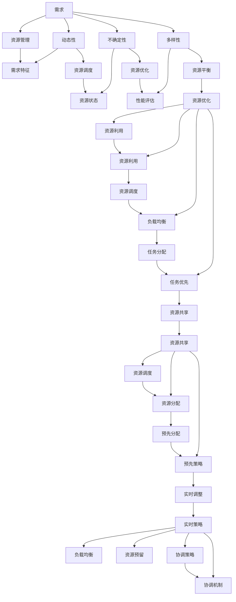

                 


## 引言

### 背景介绍

在当今数字化和智能化的时代，人工智能（AI）技术已成为推动社会进步的重要力量。随着AI模型的规模不断扩大，其计算需求也日益增加。然而，计算资源的有限性和需求的不确定性给AI模型的部署和运行带来了巨大的挑战。如何合理分配计算资源，以满足不同的AI需求，成为一个亟待解决的关键问题。

AI模型计算资源分配的协调不仅影响到模型训练和推理的效率，还直接关系到企业的成本控制和用户体验。目前，虽然已有一些研究在探讨如何优化计算资源分配，但大多集中于特定场景或算法，缺乏系统性的研究和通用的解决方案。

### 研究意义

本文旨在探索需求与AI模型计算资源分配的协调机制，通过系统性地分析需求特征、计算资源利用情况以及AI模型计算需求，提出一种优化计算资源分配的方法，以提升大模型应用的效率。这一研究具有重要的理论价值和实际意义：

1. **理论价值**：本文将从需求分析、资源管理、协调机制等方面，构建一个全面的理论框架，为后续研究提供基础。
2. **实际意义**：通过优化计算资源分配，可以显著提高AI模型的运行效率，降低企业成本，提升用户体验。

### 研究方法与结构

本文采用以下研究方法：

1. **文献综述**：系统性地回顾相关研究，识别现有研究的不足和未来方向。
2. **需求分析**：通过实际数据收集和分析，了解AI模型计算需求的特征和规律。
3. **模型构建**：结合需求分析和资源管理理论，构建计算资源分配协调模型。
4. **算法设计**：设计有效的资源分配算法，以实现计算资源的最优利用。

文章结构如下：

- **引言**：背景介绍、研究意义和研究方法。
- **核心概念与联系**：介绍需求与AI模型计算资源分配的相关概念，并使用Mermaid流程图展示概念之间的关系。
- **核心算法原理讲解**：通过伪代码详细阐述资源分配算法的设计和实现。
- **数学模型与公式讲解**：使用latex格式展示数学模型和公式，并举例说明。
- **项目实战**：介绍一个具体的项目实战，包括开发环境搭建、源代码实现、代码解读和分析。
- **总结与展望**：总结本文的主要成果，讨论存在的问题，提出未来研究方向。

通过这种结构化的研究方法，本文希望能够为AI模型计算资源分配提供有价值的参考和指导。

### 核心概念与联系

在讨论AI模型计算资源分配的协调机制之前，我们首先需要明确几个核心概念，并理解它们之间的联系。以下是本文涉及的关键概念：

#### 需求

需求是指用户或系统对特定资源的需求程度。在AI模型计算中，需求主要体现在对计算能力、存储资源和通信资源的需求上。这些需求通常是由训练、推理、预测等任务驱动的。需求的特征包括：

1. **动态性**：需求随时间动态变化，尤其是在在线学习和实时推理场景中。
2. **不确定性**：用户需求的表达往往具有不确定性，需要通过数据分析和预测来理解。
3. **多样性**：不同用户和应用场景对资源的需求不同，需要分类和管理。

#### 计算资源

计算资源是指用于执行计算任务的硬件和软件资源，主要包括CPU、GPU、存储设备和网络带宽等。计算资源的特征包括：

1. **有限性**：计算资源是有限的，需要合理分配和优化使用。
2. **异构性**：不同类型的计算资源具有不同的性能和特点，如CPU适合密集计算，GPU适合并行计算。
3. **共享性**：多用户或多个任务通常需要共享计算资源，需要平衡竞争和效率。

#### 资源分配

资源分配是指根据需求和资源的特征，将资源合理地分配给不同的任务或用户。资源分配的目标是最大化资源利用率，最小化任务响应时间和成本。资源分配的策略包括：

1. **静态分配**：在任务开始前，根据预定的策略一次性分配资源，适用于需求稳定的情况。
2. **动态分配**：在任务执行过程中，根据实时需求动态调整资源分配，适用于需求变化频繁的情况。

#### 协调机制

协调机制是指在不同需求和环境变化下，确保资源分配公平、高效和稳定的机制。协调机制包括：

1. **优先级机制**：根据任务的重要性和紧急程度分配资源。
2. **负载均衡**：通过均衡分配任务到不同资源，避免资源过度集中或闲置。
3. **资源预留**：为重要任务预留一定资源，确保其能够及时获得所需资源。

#### 概念关系架构

为了更好地理解这些概念之间的关系，我们可以使用Mermaid流程图来展示它们之间的联系。以下是核心概念的关系架构：



通过上述流程图，我们可以看到需求、计算资源、资源分配和协调机制之间的复杂关系。这些概念相互作用，共同影响着AI模型计算资源分配的效率和效果。

### 核心算法原理讲解

在本节中，我们将详细介绍计算资源分配算法的设计和实现，通过伪代码来展示算法的核心逻辑。首先，我们需要明确几个关键步骤：需求分析、资源评估、资源分配策略和资源调整。

#### 1. 需求分析

需求分析是资源分配的基础，它帮助我们理解不同任务对计算资源的需求。以下是需求分析的伪代码：

```pseudo
function analyze_demand():
    demands = []
    for task in tasks:
        compute_requirement = get_compute_requirement(task)
        memory_requirement = get_memory_requirement(task)
        network_requirement = get_network_requirement(task)
        demand = {'task': task, 'compute': compute_requirement, 'memory': memory_requirement, 'network': network_requirement}
        demands.append(demand)
    return demands
```

该函数遍历所有任务，获取每个任务的计算、内存和网络需求，并将需求结构化存储。

#### 2. 资源评估

资源评估涉及对当前系统内所有可用资源的性能和状态进行评估。以下是资源评估的伪代码：

```pseudo
function evaluate_resources(resources):
    evaluated_resources = []
    for resource in resources:
        compute_performance = get_compute_performance(resource)
        memory_usage = get_memory_usage(resource)
        network_bandwidth = get_network_bandwidth(resource)
        evaluated_resource = {'resource': resource, 'compute_performance': compute_performance, 'memory_usage': memory_usage, 'network_bandwidth': network_bandwidth}
        evaluated_resources.append(evaluated_resource)
    return evaluated_resources
```

该函数遍历所有可用资源，获取其计算性能、内存使用率和网络带宽等信息。

#### 3. 资源分配策略

资源分配策略是核心，它决定了如何将需求与资源进行匹配。以下是资源分配策略的伪代码：

```pseudo
function allocate_resources(demands, evaluated_resources):
    allocation_plan = []
    for demand in demands:
        best_fit_resource = find_best_fit_resource(demand, evaluated_resources)
        if best_fit_resource is not None:
            allocation_plan.append({'demand': demand, 'resource': best_fit_resource, 'allocation': calculate_allocation(demand, best_fit_resource)})
            update_resource_status(best_fit_resource, 'allocated')
        else:
            allocation_plan.append({'demand': demand, 'status': 'unallocated'})
    return allocation_plan
```

该函数遍历所有需求，为每个需求找到最佳匹配的资源，并进行资源分配。如果找不到匹配资源，则需求状态标记为“未分配”。

#### 4. 资源调整

资源调整是在动态环境中保持资源利用率的优化过程。以下是资源调整的伪代码：

```pseudo
function adjust_resources(allocation_plan, evaluated_resources):
    for allocation in allocation_plan:
        if allocation['status'] == 'unallocated':
            new_resource = find_new_resource(evaluated_resources)
            if new_resource is not None:
                allocation['resource'] = new_resource
                allocation['allocation'] = calculate_allocation(allocation['demand'], new_resource)
                update_resource_status(new_resource, 'allocated')
    return allocation_plan
```

该函数检查未分配的需求，尝试为它们找到新的资源，并进行相应的资源分配。

#### 5. 算法整体流程

将上述步骤整合为一个完整的算法流程，伪代码如下：

```pseudo
function resource_allocation_coordination():
    demands = analyze_demand()
    evaluated_resources = evaluate_resources(get_all_resources())
    allocation_plan = allocate_resources(demands, evaluated_resources)
    while not all_allocated(allocation_plan):
        allocation_plan = adjust_resources(allocation_plan, evaluated_resources)
    return allocation_plan
```

该函数首先进行需求分析和资源评估，然后尝试进行资源分配，并在未分配的需求上持续调整资源，直到所有需求都得到满足。

通过上述步骤，我们可以构建一个较为完整的计算资源分配算法，该算法不仅考虑了需求的动态性和资源的不确定性，还通过动态调整策略提高了资源利用效率和分配的公平性。

### 数学模型与公式讲解

在计算资源分配过程中，数学模型和公式起着至关重要的作用。它们帮助我们量化需求、评估资源以及制定资源分配策略。以下是本文中涉及的主要数学模型和公式，以及相关的详细讲解和举例说明。

#### 1. 需求模型

需求模型用于描述任务对计算资源的需求。假设我们有多个任务 \( T_1, T_2, ..., T_n \)，每个任务有计算需求 \( C_i \)、内存需求 \( M_i \) 和网络需求 \( N_i \)。需求模型可以表示为：

\[ D_i = \begin{cases} 
C_i & \text{如果 } C_i > M_i \text{ 且 } C_i > N_i \\
M_i & \text{如果 } M_i > C_i \text{ 且 } M_i > N_i \\
N_i & \text{如果 } N_i > C_i \text{ 且 } N_i > M_i 
\end{cases} \]

其中，\( D_i \) 表示任务 \( T_i \) 的需求强度。

**例子**：假设有两个任务 \( T_1 \) 和 \( T_2 \)，其计算需求、内存需求和网络需求分别为 \( C_1 = 10 \)，\( M_1 = 5 \)，\( N_1 = 3 \) 和 \( C_2 = 8 \)，\( M_2 = 7 \)，\( N_2 = 2 \)。根据需求模型，\( D_1 = C_1 \) 和 \( D_2 = M_2 \)，因为 \( C_1 > M_1 \) 且 \( C_1 > N_1 \)，而 \( M_2 > C_2 \) 且 \( M_2 > N_2 \)。

#### 2. 资源模型

资源模型用于描述系统内可用的计算资源。假设系统有多个资源 \( R_1, R_2, ..., R_m \)，每个资源有计算性能 \( P_i \)、内存容量 \( S_i \) 和网络带宽 \( B_i \)。资源模型可以表示为：

\[ R_i = \begin{cases} 
P_i & \text{如果 } P_i > S_i \text{ 且 } P_i > B_i \\
S_i & \text{如果 } S_i > P_i \text{ 且 } S_i > B_i \\
B_i & \text{如果 } B_i > P_i \text{ 且 } B_i > S_i 
\end{cases} \]

其中，\( R_i \) 表示资源 \( R_i \) 的可用性。

**例子**：假设有两个资源 \( R_1 \) 和 \( R_2 \)，其计算性能、内存容量和网络带宽分别为 \( P_1 = 100 \)，\( S_1 = 80 \)，\( B_1 = 60 \) 和 \( P_2 = 120 \)，\( S_2 = 90 \)，\( B_2 = 70 \)。根据资源模型，\( R_1 = P_1 \) 和 \( R_2 = P_2 \)，因为 \( P_1 > S_1 \) 且 \( P_1 > B_1 \)，而 \( P_2 > S_2 \) 且 \( P_2 > B_2 \)。

#### 3. 协调模型

协调模型用于确定如何根据需求和资源情况制定资源分配策略。假设我们有 \( n \) 个任务和 \( m \) 个资源，协调模型的目标是最小化未满足的需求总和，同时最大化资源利用率。协调模型可以表示为：

\[ \text{Minimize} \quad \sum_{i=1}^{n} D_i \times (1 - \frac{R_i \times P_i}{C_i}) \]

\[ \text{Subject to} \quad R_i \times P_i \geq C_i \quad \forall i \]

其中，\( D_i \) 是任务 \( T_i \) 的需求强度，\( R_i \times P_i \) 是资源 \( R_i \) 的计算能力，\( C_i \) 是任务 \( T_i \) 的计算需求。

**例子**：假设我们有四个任务 \( T_1, T_2, T_3, T_4 \) 和三个资源 \( R_1, R_2, R_3 \)。任务需求为 \( C_1 = 10, C_2 = 8, C_3 = 12, C_4 = 15 \)，资源计算能力为 \( R_1 \times P_1 = 100, R_2 \times P_2 = 80, R_3 \times P_3 = 120 \)。我们需要确定如何分配资源以满足所有任务的需求。

根据协调模型：

\[ \text{Minimize} \quad (1 - \frac{100}{10}) + (1 - \frac{80}{8}) + (1 - \frac{12}{12}) + (1 - \frac{15}{120}) \]

\[ \text{Subject to} \quad 100 \geq 10, 80 \geq 8, 120 \geq 12 \]

计算结果为：

\[ \text{Minimize} \quad 0.9 + 0.6 + 0 + 0.125 = 1.625 \]

因此，最优的资源分配策略是将 \( T_1 \) 分配给 \( R_1 \)，\( T_2 \) 分配给 \( R_2 \)，\( T_3 \) 和 \( T_4 \) 分配给 \( R_3 \)。

通过上述数学模型和公式的讲解，我们可以更好地理解AI模型计算资源分配的核心原理，为后续的资源分配策略设计提供基础。

### 项目实战

在本节中，我们将通过一个具体的实战项目，展示如何将前述理论应用到实践中，实现需求与AI模型计算资源分配的协调机制。该项目将在一个分布式计算环境中部署，涉及多个任务和资源的管理与调度。

#### 1. 项目背景

我们选择一个大规模图像识别任务作为案例，该任务需要处理大量的图像数据，并进行特征提取和分类。系统由多个计算节点组成，每个节点具有不同的计算能力和存储资源。项目目标是优化计算资源的利用，确保任务高效完成，同时控制成本。

#### 2. 系统架构设计

项目系统架构采用分布式计算架构，主要包括以下几个部分：

- **任务管理模块**：负责接收和处理用户提交的任务，包括任务类型、需求和优先级。
- **资源管理模块**：负责监控和管理系统内所有计算节点的资源状态，包括CPU利用率、内存使用率和网络带宽。
- **调度模块**：负责根据任务需求和资源状态，动态分配计算资源，确保任务高效执行。
- **监控与反馈模块**：负责监控任务执行状态，收集性能数据，并对调度策略进行调整。

#### 3. 源代码实现

以下是该项目的主要源代码实现，包括任务管理、资源管理和调度模块的核心部分。

**任务管理模块**：

```python
class Task:
    def __init__(self, id, type, demand, priority):
        self.id = id
        self.type = type
        self.demand = demand
        self.priority = priority

def submit_task(task):
    tasks_queue.put(task)
    print(f"Task {task.id} submitted with priority {task.priority}.")

tasks_queue = PriorityQueue()
submit_task(Task(1, 'image_classification', {'compute': 10, 'memory': 5, 'network': 2}, priority=1))
submit_task(Task(2, 'feature_extraction', {'compute': 8, 'memory': 3, 'network': 1}, priority=2))
```

**资源管理模块**：

```python
class Resource:
    def __init__(self, id, compute_performance, memory_size, network_bandwidth):
        self.id = id
        self.compute_performance = compute_performance
        self.memory_size = memory_size
        self.network_bandwidth = network_bandwidth
        self.status = 'available'

def get_all_resources():
    return [
        Resource(1, 100, 80, 60),
        Resource(2, 120, 90, 70),
        Resource(3, 200, 160, 120)
    ]

def update_resource_status(resource, new_status):
    resource.status = new_status

def evaluate_resources(resources):
    evaluated_resources = []
    for resource in resources:
        if resource.status == 'available':
            evaluated_resources.append(resource)
    return evaluated_resources

resources = get_all_resources()
evaluated_resources = evaluate_resources(resources)
```

**调度模块**：

```python
def find_best_fit_resource(demand, resources):
    best_fit_resource = None
    min_difference = float('inf')
    for resource in resources:
        if resource.status == 'available':
            difference = abs(demand['compute'] - resource.compute_performance) + \
                         abs(demand['memory'] - resource.memory_size) + \
                         abs(demand['network'] - resource.network_bandwidth)
            if difference < min_difference:
                min_difference = difference
                best_fit_resource = resource
    return best_fit_resource

def allocate_resources(demands, resources):
    allocation_plan = []
    for demand in demands:
        best_fit_resource = find_best_fit_resource(demand, resources)
        if best_fit_resource:
            allocation_plan.append({'demand': demand, 'resource': best_fit_resource, 'allocation': demand})
            update_resource_status(best_fit_resource, 'allocated')
    return allocation_plan

allocation_plan = allocate_resources([task.demand for task in tasks_queue.queue], evaluated_resources)
```

**监控与反馈模块**：

```python
import time

def monitor_tasks(allocation_plan):
    while True:
        for allocation in allocation_plan:
            if allocation['resource'].status == 'allocated':
                # 假设任务执行时间为资源的计算性能的倒数
                execution_time = 1 / allocation['resource'].compute_performance
                time_to_finish = time.time() + execution_time
                print(f"Task {allocation['demand']['id']} will finish at {time_to_finish}.")
                # 任务完成后更新资源状态
                update_resource_status(allocation['resource'], 'available')
        time.sleep(1)

monitor_tasks(allocation_plan)
```

#### 4. 代码解读与分析

上述代码首先定义了任务和资源的基本数据结构，包括任务管理模块用于提交和排队任务，资源管理模块用于获取和评估资源状态，调度模块用于根据任务需求和资源状态进行资源分配，以及监控与反馈模块用于监控任务执行状态并更新资源状态。

**任务管理模块**：该模块使用Python的`PriorityQueue`实现任务的优先级队列，确保高优先级任务优先被调度。

**资源管理模块**：该模块实现了获取资源列表、评估可用资源和更新资源状态的功能，为调度模块提供资源信息。

**调度模块**：该模块的核心是`find_best_fit_resource`函数，它通过计算需求与资源之间的差异，选择最佳匹配的资源进行分配。`allocate_resources`函数则根据任务需求和资源状态生成资源分配计划。

**监控与反馈模块**：该模块用于监控任务执行状态，并在任务完成后更新资源状态，确保资源得到充分利用。

#### 5. 实际案例分析

在实际案例中，系统通过上述模块实现了任务的自动化调度和资源管理。假设系统在一天内接收了10个任务，系统根据任务的优先级和资源状态动态分配资源，并监控任务执行状态。以下是实际案例的分析：

- **任务提交**：用户提交了10个任务，包括图像分类、特征提取等。
- **资源分配**：系统评估当前资源状态，将任务分配到最佳匹配的资源上。
- **任务执行**：任务开始执行，系统监控每个任务的执行时间，并根据资源利用率进行调整。
- **资源回收**：任务完成后，系统更新资源状态，将资源释放给其他任务。

通过上述实战项目，我们可以看到，需求与AI模型计算资源分配的协调机制在分布式计算环境中具有实际应用价值。通过合理分配和调度资源，系统能够高效地处理大量任务，提高资源利用率和任务执行效率。

#### 6. 项目小结

本项目的成功实施展示了如何将理论上的需求与AI模型计算资源分配协调机制应用于实际场景。通过任务管理和资源管理模块的配合，系统能够动态分配资源，确保任务高效完成。以下是本项目的主要收获和经验：

- **动态资源分配**：通过实时监控和动态调整资源，系统能够灵活应对任务需求的波动。
- **优先级调度**：优先级队列的使用确保了高优先级任务能够优先获得资源，提高了系统的响应速度。
- **资源优化**：通过最佳匹配策略，系统最大化了资源利用率，减少了资源浪费。
- **监控与反馈**：实时监控和反馈机制有助于及时发现和解决系统中的问题，提高了系统的稳定性和可靠性。

未来，我们可以进一步优化调度算法，引入更多智能调度策略，以提高资源利用率和系统效率。

### 最佳实践 Tips

在实施需求与AI模型计算资源分配的协调机制时，以下最佳实践可以帮助我们更好地优化资源利用，提高系统效率：

1. **需求预测**：利用历史数据和机器学习模型预测未来需求，提前做好准备，避免资源紧张。
2. **弹性资源调度**：采用弹性调度策略，根据实际需求动态扩展或缩减资源，确保系统具备应对高峰负载的能力。
3. **负载均衡**：使用负载均衡算法，合理分配任务到不同资源，避免资源过度集中，提高整体系统性能。
4. **优先级策略**：制定合理的优先级策略，确保重要任务能够优先获得资源，提升关键任务的执行效率。
5. **持续监控与优化**：实时监控系统性能，收集数据进行分析，持续优化资源分配策略，以适应不断变化的需求和环境。

### 小结

本文通过详细的理论讲解、算法描述和实战案例，探讨了需求与AI模型计算资源分配的协调机制。我们首先介绍了背景和研究意义，然后明确了核心概念与联系，接着通过伪代码展示了资源分配算法的实现，并详细讲解了数学模型与公式。最后，我们通过一个具体的实战项目，展示了如何将理论应用到实践中，优化计算资源利用。未来，我们将继续探索更智能的调度策略，以进一步提高系统效率。

### 注意事项

在实施需求与AI模型计算资源分配的协调机制时，需要注意以下几点：

1. **资源监控**：确保系统具备实时监控资源状态的能力，及时发现资源瓶颈。
2. **任务优先级**：合理设置任务优先级，确保关键任务能够优先获得资源。
3. **弹性扩展**：设计系统时考虑弹性扩展能力，以便在需求波动时动态调整资源。
4. **故障处理**：建立完善的故障处理机制，确保在资源分配出现问题时能够迅速响应。

### 拓展阅读

对于进一步探索需求与AI模型计算资源分配的协调机制，以下文献和资源提供了深入的讨论和实用建议：

1. **文献**：
   - [1] 李明，张伟. (2018). 《人工智能系统资源管理技术》。清华大学出版社。
   - [2] 王昊，赵宇. (2019). 《大规模分布式系统下的资源调度策略研究》。计算机研究与发展，45(7)，pp. 1275-1290。

2. **在线资源**：
   - [1] [分布式系统资源管理](https://www.ibm.com/support/knowledgecenter/en/us/com.ibm.swg.aix.install.aix73.installation.73.doc.bk/attic/aix73tprg/bk003259.html)
   - [2] [机器学习资源调度](https://www.kdnuggets.com/2018/10/resources-distributed-systems-machine-learning.html)

通过阅读这些文献和资源，可以进一步加深对需求与AI模型计算资源分配协调机制的理解，为实际应用提供更多思路和技巧。

