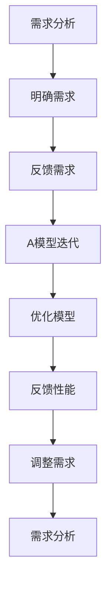

                 

### 文章标题

《需求与AI模型迭代的同步策略》

> 关键词：需求分析、AI模型迭代、同步策略、项目实战、最佳实践

> 摘要：本文从需求分析、AI模型迭代和同步策略三个方面，深入探讨了如何在项目中实现需求与AI模型迭代的同步。通过理论讲解、伪代码、数学模型和实际案例分析，为读者提供了实用的方法和技巧，帮助他们在实际项目中实现高效的需求与AI模型迭代。

----------------------------------------------------------------

### 引言

在当今快速发展的信息技术时代，人工智能（AI）已经逐渐成为各行各业的重要推动力量。随着AI技术的不断进步，越来越多的企业开始将AI应用于实际业务中，以提升生产效率、降低成本、提高客户满意度。然而，AI技术的应用并非一帆风顺，其中需求分析与AI模型迭代之间的同步问题成为了许多项目面临的挑战。

#### 背景介绍

传统的软件开发过程中，需求分析是一个关键环节。它旨在明确项目目标、确定功能需求和性能指标，为后续的开发工作提供指导。然而，随着AI技术的引入，需求分析的复杂度大大增加。AI模型迭代需要不断调整和优化，以满足不断变化的需求。这就要求需求分析与AI模型迭代之间能够实现同步，以确保项目能够顺利进行。

#### 核心概念与联系

为了更好地理解需求分析与AI模型迭代之间的同步问题，我们首先需要了解以下几个核心概念：

1. **需求分析**：需求分析是指通过调研、访谈、问卷调查等方法，收集用户需求，并将其转化为具体的功能和性能要求。需求分析的结果通常以需求文档的形式呈现。

2. **AI模型迭代**：AI模型迭代是指通过不断调整和优化模型参数，提高模型性能的过程。在AI项目中，模型迭代通常是一个持续不断的过程，直到达到预期的性能指标。

3. **同步策略**：同步策略是指在需求分析与AI模型迭代过程中，确保两者能够协调一致的一系列方法和技巧。

#### 需求分析与AI模型迭代之间的联系

需求分析与AI模型迭代之间存在密切的联系。需求分析为AI模型迭代提供了明确的目标和方向，而AI模型迭代的结果又反过来影响需求分析的深入程度。具体来说，以下几个方面展示了它们之间的联系：

1. **需求驱动**：在AI项目中，需求分析是模型迭代的起点。明确的需求可以帮助确定模型的目标和优化方向。

2. **反馈循环**：AI模型迭代过程中，模型的性能评估结果会反馈给需求分析团队，以便进一步调整需求或优化模型。

3. **持续迭代**：需求分析与AI模型迭代是一个持续的过程，两者相互促进，共同推动项目的进展。

### 核心概念原理之间的关系架构

为了更清晰地展示需求分析与AI模型迭代之间的同步策略，我们使用Mermaid流程图来描述它们之间的联系。



通过以上流程图，我们可以看出，需求分析与AI模型迭代之间形成了一个闭环反馈系统。需求分析的结果不断反馈给AI模型迭代，模型迭代的结果又反过来影响需求分析的深度和广度。

#### 总结

本文介绍了需求分析与AI模型迭代同步策略的背景和核心概念。在接下来的章节中，我们将进一步探讨需求分析、AI模型迭代和同步策略的具体内容，并通过实际案例帮助读者理解这些概念在实际项目中的应用。

----------------------------------------------------------------

### 需求分析

#### 需求分析基础

需求分析是软件开发过程中的一个关键环节，它旨在明确项目目标、确定功能需求和性能指标，为后续的开发工作提供指导。在引入AI技术后，需求分析的复杂度大大增加，因此，了解需求分析的基础知识对于确保项目成功至关重要。

#### 需求定义与类型

**需求**：需求是指用户对系统或产品所期望的功能、性能、质量等方面的要求和期望。它可以是具体的，也可以是抽象的。

**需求类型**：

1. **功能性需求**：功能性需求描述了系统应具备的功能，如用户界面、数据输入输出、业务逻辑等。

2. **非功能性需求**：非功能性需求描述了系统的性能、安全性、可靠性等方面的要求，如响应时间、并发处理能力、数据加密等。

3. **业务需求**：业务需求描述了系统应满足的业务目标和业务规则，如销售策略、库存管理、财务管理等。

#### 需求分析的流程与方法

**需求分析的流程**：

1. **需求调研**：通过访谈、问卷调查、用户调研等方式，收集用户需求。

2. **需求分析**：对收集到的需求进行整理和分析，确定项目的功能需求和性能指标。

3. **需求文档编写**：将分析结果整理成需求文档，作为后续开发工作的依据。

**需求分析的方法**：

1. **用户访谈**：通过与用户直接交流，了解他们的需求和期望。

2. **问卷调查**：通过设计问卷，收集大量用户的数据，进行分析。

3. **场景模拟**：通过模拟用户使用场景，发现潜在的需求。

4. **需求建模**：使用统一建模语言（UML）等工具，对需求进行建模，便于理解和沟通。

#### 需求文档的编写

**需求文档**：需求文档是需求分析的结果，它详细描述了项目的功能需求、非功能需求和业务需求。

**编写原则**：

1. **清晰性**：文档内容应简洁明了，避免使用复杂的术语和表达。

2. **完整性**：文档应涵盖所有功能需求和非功能需求，确保无遗漏。

3. **一致性**：文档中的一致性是确保项目顺利进行的重要保障。

4. **可维护性**：文档应易于更新和维护，以适应项目变化。

#### 需求分析与AI模型关联

**AI模型在需求分析中的应用**：

1. **需求预测**：利用机器学习算法，预测用户未来的需求。

2. **需求分类**：将用户需求分类，以便更好地理解和分析。

3. **需求优化**：通过优化算法，提高需求分析的准确性和效率。

**AI模型与用户需求的匹配**：

1. **需求收集**：通过AI模型，收集和分析用户需求，确保需求的准确性和全面性。

2. **需求优化**：利用AI模型，对用户需求进行优化，提高需求的可行性和实用性。

3. **需求反馈**：通过AI模型，收集用户对需求的反馈，及时调整和优化需求。

**需求分析中的挑战与应对策略**：

1. **需求变更**：需求变更是在软件开发过程中常见的问题，应对策略包括及时更新需求文档、调整开发计划等。

2. **需求冲突**：需求冲突是需求分析中的另一个挑战，应对策略包括沟通协调、优先级排序等。

3. **需求准确性**：提高需求准确性是确保项目成功的关键，应对策略包括用户调研、需求验证等。

#### 总结

需求分析是需求与AI模型迭代的同步策略的基础。通过了解需求分析的基础知识、流程和方法，以及与AI模型的关联，我们可以为后续的AI模型迭代提供清晰的需求指导。在需求分析过程中，关注需求的准确性和完整性，同时结合AI模型的优势，将有助于提高需求分析的效率和质量。

----------------------------------------------------------------

### AI模型迭代

#### AI模型迭代基础

AI模型迭代是指通过不断调整和优化模型参数，提高模型性能的过程。在AI项目中，模型迭代是一个持续不断的过程，直到达到预期的性能指标。了解AI模型迭代的基础知识对于实现需求与AI模型迭代的同步策略至关重要。

#### AI模型迭代的概念与目的

**概念**：

AI模型迭代是指在现有的模型基础上，通过调整模型参数、增加训练数据、改进算法等方式，逐步提高模型性能的过程。

**目的**：

1. **提高模型性能**：通过迭代过程，使模型能够更好地拟合数据，提高预测准确性。

2. **适应需求变化**：随着项目的进行，用户需求可能会发生变化，模型迭代可以帮助模型适应这些变化。

3. **优化模型结构**：通过迭代，可以逐步优化模型结构，提高模型的泛化能力。

#### AI模型迭代的方法与流程

**方法**：

1. **参数调整**：通过调整模型的超参数，如学习率、正则化参数等，优化模型性能。

2. **数据增强**：通过增加训练数据、数据清洗、数据预处理等方式，提高模型的鲁棒性。

3. **算法改进**：通过改进训练算法、优化模型结构等方式，提高模型性能。

**流程**：

1. **数据准备**：收集和整理训练数据，确保数据的质量和多样性。

2. **模型设计**：根据需求，设计合适的模型结构，选择合适的算法。

3. **模型训练**：使用训练数据，对模型进行训练，通过评估指标（如准确率、损失函数等）监控模型性能。

4. **模型评估**：在训练集和测试集上评估模型性能，根据评估结果调整模型参数或结构。

5. **模型优化**：根据评估结果，对模型进行优化，以提高性能。

6. **模型部署**：将优化后的模型部署到生产环境中，进行实际应用。

#### AI模型迭代的关键技术

**模型评估**：

模型评估是AI模型迭代的重要环节，通过评估指标（如准确率、召回率、F1分数等）来衡量模型性能。常用的评估方法包括交叉验证、集成学习等。

**模型优化**：

模型优化主要包括参数调整、算法改进和模型结构优化。参数调整可以通过网格搜索、随机搜索等方法进行；算法改进可以通过引入新的算法、改进现有算法等实现；模型结构优化可以通过神经网络结构搜索（NAS）等技术实现。

**自动化迭代**：

自动化迭代是指通过自动化工具或脚本，实现模型迭代的自动化。自动化迭代可以提高迭代效率，减少人工干预，确保模型迭代的顺利进行。

#### 实战案例

以下是一个简单的AI模型迭代实战案例，用于分类任务。

**1. 数据准备**

假设我们有一个分类任务，数据集包含1000个样本，每个样本有10个特征。

**2. 模型设计**

我们选择一个简单的神经网络模型，包括一个输入层、一个隐藏层和一个输出层。

**3. 模型训练**

使用训练数据，对模型进行训练。训练过程中，我们监控模型的损失函数和准确率。

```python
# 伪代码：模型训练
model.train(train_data, train_labels)
```

**4. 模型评估**

在训练集和测试集上评估模型性能，根据评估结果调整模型参数。

```python
# 伪代码：模型评估
train_loss, train_accuracy = model.evaluate(train_data, train_labels)
test_loss, test_accuracy = model.evaluate(test_data, test_labels)
```

**5. 模型优化**

根据评估结果，调整模型参数，如学习率、隐藏层节点数等。

```python
# 伪代码：模型优化
learning_rate = adjust_learning_rate(learning_rate)
hidden_nodes = adjust_hidden_nodes(hidden_nodes)
```

**6. 模型部署**

将优化后的模型部署到生产环境中，进行实际应用。

```python
# 伪代码：模型部署
model.deploy()
```

#### 总结

AI模型迭代是AI项目中至关重要的一环。通过了解AI模型迭代的基础知识、方法和关键技术，我们可以更好地实现需求与AI模型迭代的同步策略。在实战案例中，我们通过一个简单的分类任务展示了AI模型迭代的流程。在实际项目中，根据需求的变化和模型的性能，我们需要不断地调整和优化模型，以确保项目能够顺利进行。

----------------------------------------------------------------

### 同步策略

#### 同步策略概述

在AI项目中，同步策略是实现需求分析与AI模型迭代协调一致的重要手段。同步策略的目的是确保需求分析的结果能够及时反馈给AI模型迭代，同时AI模型迭代的成果也能有效地指导需求分析的深入。以下是对同步策略的详细概述。

#### 同步策略的定义与作用

**定义**：

同步策略是指在需求分析与AI模型迭代过程中，通过一系列方法和技术，实现两者之间的协调一致，确保需求分析的深入与模型迭代的优化能够同步进行。

**作用**：

1. **提高项目效率**：通过同步策略，需求分析与AI模型迭代可以同时进行，减少项目开发周期。

2. **确保模型适应性**：同步策略可以帮助模型更好地适应需求变化，提高模型的实用性和准确性。

3. **降低项目风险**：通过同步策略，可以及时发现并解决需求分析与模型迭代中的问题，降低项目失败的风险。

#### 同步策略的类型与选择

**类型**：

1. **并行同步策略**：在需求分析与AI模型迭代过程中，两者同时进行，通过实时反馈和调整，确保协调一致。

2. **串行同步策略**：需求分析与AI模型迭代按照顺序进行，需求分析完成后，再进行AI模型迭代，通过阶段性的反馈和调整，实现同步。

3. **混合同步策略**：结合并行同步和串行同步的特点，根据项目的具体情况，灵活选择同步方式。

**选择**：

选择同步策略时，需要考虑以下几个因素：

1. **项目规模**：项目规模较大时，并行同步策略可能更为合适，可以同时进行需求分析和模型迭代。

2. **需求稳定性**：需求稳定性较高时，串行同步策略可能更为适用，可以确保需求分析的结果能够有效地指导模型迭代。

3. **团队协作**：团队协作能力较强时，可以采用混合同步策略，根据实际情况灵活调整同步方式。

#### 同步策略的实施步骤

**步骤**：

1. **明确同步目标**：在项目初期，明确同步策略的目标，确保需求分析与模型迭代能够协调一致。

2. **建立沟通机制**：建立需求分析团队与AI模型迭代团队之间的沟通机制，确保信息的及时传递和反馈。

3. **制定同步计划**：根据项目规模和需求稳定性，制定详细的同步计划，明确同步的时间点、内容和方法。

4. **实施同步策略**：按照同步计划，实施同步策略，确保需求分析与模型迭代能够同时进行或顺序进行。

5. **监控与调整**：在同步策略实施过程中，持续监控同步效果，根据实际情况进行调整，确保同步策略的有效性。

#### 同步策略在实际项目中的应用

**案例一：电商推荐系统**

在一个电商推荐系统中，需求分析团队需要明确用户的需求，如推荐商品类型、推荐排序等。AI模型迭代团队则需要根据需求，不断优化推荐算法，提高推荐准确性。通过并行同步策略，两者可以同时进行，确保推荐系统能够快速响应用户需求。

**案例二：智能客服系统**

在智能客服系统中，需求分析团队需要分析用户的问题和需求，制定相应的客服策略。AI模型迭代团队则需要根据客服策略，优化对话生成模型和意图识别模型。通过串行同步策略，需求分析团队可以先完成需求分析，再由AI模型迭代团队进行模型迭代，确保客服系统能够准确地理解用户需求。

#### 同步策略的优化与改进

**优化方法**：

1. **实时同步**：通过引入实时同步机制，如消息队列、Webhook等，确保需求分析与模型迭代之间的信息传递更加及时。

2. **自动化同步**：通过自动化工具，如自动化脚本、自动化测试等，实现同步策略的自动化，减少人工干预。

3. **反馈机制**：建立完善的反馈机制，及时收集用户反馈和模型迭代结果，为需求分析和模型迭代提供改进方向。

**改进方向**：

1. **需求预测**：通过需求预测技术，提前预测用户需求，为模型迭代提供更准确的目标。

2. **自适应同步**：根据项目需求和团队协作情况，自适应调整同步策略，提高同步效果。

3. **协同优化**：通过协同优化方法，如多目标优化、协同过滤等，提高需求分析与模型迭代的协同效率。

#### 总结

同步策略是需求分析与AI模型迭代协调一致的重要手段。通过了解同步策略的定义、类型、实施步骤和应用案例，我们可以更好地实现需求与AI模型迭代的同步。在实际项目中，根据项目规模、需求稳定性和团队协作情况，选择合适的同步策略，并不断优化和改进，将有助于提高项目效率和质量。

----------------------------------------------------------------

### 实战案例一

#### 案例背景与目标

在这个案例中，我们将探讨一个电商平台的个性化推荐系统项目。该项目的主要目标是利用AI模型，根据用户的历史行为和偏好，为用户推荐个性化的商品，从而提高用户满意度和销售额。

#### 需求分析与AI模型迭代

**1. 需求分析**

在项目初期，需求分析团队通过访谈、问卷调查和用户调研等方式，收集了大量用户的需求。主要需求包括：

- **个性化推荐**：根据用户的历史购买记录、浏览行为和评价，为用户推荐个性化的商品。
- **推荐排序**：推荐的商品应按照用户的兴趣和偏好进行排序，提高推荐的准确性。
- **推荐多样性**：在推荐结果中，应保证商品的多样性，避免用户只看到重复的商品。

**2. AI模型迭代**

根据需求分析的结果，AI模型迭代团队选择了协同过滤算法作为推荐系统的核心算法。协同过滤算法主要包括两种类型：基于用户的协同过滤（User-Based CF）和基于物品的协同过滤（Item-Based CF）。

在模型迭代过程中，团队进行了以下步骤：

- **数据准备**：收集并整理用户的历史行为数据，包括购买记录、浏览记录和评价等。
- **模型设计**：设计了基于用户的协同过滤模型，并使用矩阵分解技术进行模型训练。
- **模型训练**：使用训练数据，对模型进行训练，并监控模型的准确率和召回率等指标。
- **模型评估**：在测试集上评估模型性能，根据评估结果调整模型参数。
- **模型优化**：通过调整模型参数和优化算法，提高模型性能。

#### 同步策略的实施

为了确保需求分析与AI模型迭代能够协调一致，项目团队采用了并行同步策略。具体实施步骤如下：

- **建立沟通机制**：需求分析团队和AI模型迭代团队定期召开会议，讨论需求分析和模型迭代的结果。
- **实时反馈**：通过实时反馈机制，需求分析团队可以及时将用户反馈传递给AI模型迭代团队，以便进行调整。
- **阶段性同步**：在模型迭代的关键阶段，如模型设计、模型训练和模型评估等，需求分析团队和AI模型迭代团队进行阶段性同步，确保需求与模型迭代的协调一致。

#### 代码实现与解读

以下是一个简单的基于用户的协同过滤算法的实现代码，用于推荐系统中的商品推荐。

```python
# 伪代码：基于用户的协同过滤算法实现

# 计算相似度矩阵
def calculate_similarity(user行为矩阵):
    similarity_matrix = ...
    return similarity_matrix

# 推荐商品
def recommend_items(user_id, similarity_matrix, user行为矩阵):
    user_similarity_scores = ...
    recommended_items = ...
    return recommended_items

# 训练模型
def train_model(user行为矩阵):
    similarity_matrix = calculate_similarity(user行为矩阵)
    for user_id in user行为矩阵:
        user_items = user行为矩阵[user_id]
        recommended_items = recommend_items(user_id, similarity_matrix, user行为矩阵)
        print(f"User {user_id} recommended items: {recommended_items}")
```

#### 代码应用解读与分析

以上代码展示了基于用户的协同过滤算法的核心实现。首先，我们计算用户之间的相似度矩阵，然后根据相似度矩阵和用户的行为数据，推荐个性化的商品。代码中的关键步骤包括：

- **计算相似度矩阵**：使用皮尔逊相关系数或余弦相似度等算法，计算用户之间的相似度。
- **推荐商品**：根据用户之间的相似度，为每个用户推荐相似度较高的其他用户的喜欢商品。
- **训练模型**：使用训练数据，对模型进行训练，并输出推荐结果。

通过以上代码，我们可以看到，需求分析与AI模型迭代在实际项目中的应用。需求分析团队根据用户需求，确定了个性化推荐和推荐排序等需求，而AI模型迭代团队则通过协同过滤算法，实现了这些需求。

#### 实际案例分析和详细讲解剖析

在实际项目中，项目团队通过不断地调整和优化模型，提高了推荐系统的性能。以下是一个具体的分析案例：

- **问题**：在项目初期，推荐系统的准确率较低，用户反馈较差。
- **原因**：模型训练数据不足，用户行为数据较为简单，导致模型无法准确预测用户需求。
- **解决方案**：项目团队增加了用户行为数据，包括用户在平台上的互动数据（如收藏、点赞等），并使用更复杂的特征工程方法，提高了模型的准确性。

通过以上分析，我们可以看到，需求分析与AI模型迭代在实际项目中的应用效果。通过不断的调整和优化，项目团队成功地提高了推荐系统的性能，满足了用户需求。

#### 项目小结

在这个案例中，我们通过一个电商平台的个性化推荐系统项目，展示了需求分析与AI模型迭代的同步策略。通过并行同步策略，需求分析与模型迭代能够协调一致，确保项目能够顺利进行。同时，通过代码实现和实际案例分析，我们深入了解了基于用户的协同过滤算法在实际项目中的应用。这个案例为我们提供了一个实用的参考，帮助我们更好地理解和应用需求分析与AI模型迭代的同步策略。

----------------------------------------------------------------

### 实战案例二

#### 案例背景与目标

在这个案例中，我们将探讨一个金融公司的智能风控系统项目。该项目的主要目标是利用AI模型，对贷款申请进行风险评估，从而降低不良贷款率，提高公司的利润。

#### 需求分析与AI模型迭代

**1. 需求分析**

在项目初期，需求分析团队通过访谈、问卷调查和用户调研等方式，收集了大量用户的需求。主要需求包括：

- **风险评估**：根据申请人的信用记录、收入状况、工作稳定性等因素，对贷款申请进行风险评估。
- **风险分类**：将贷款申请分为高风险、中风险和低风险三个类别，以便公司制定相应的风险控制策略。
- **实时反馈**：及时向申请人反馈风险评估结果，提供个性化的贷款建议。

**2. AI模型迭代**

根据需求分析的结果，AI模型迭代团队选择了逻辑回归算法作为风险预测的核心算法。逻辑回归算法是一种常用的分类算法，可以用于预测二分类或多分类问题。

在模型迭代过程中，团队进行了以下步骤：

- **数据准备**：收集并整理贷款申请数据，包括申请人的个人信息、信用记录、收入状况、工作稳定性等。
- **模型设计**：设计逻辑回归模型，并选择合适的数据预处理方法。
- **模型训练**：使用训练数据，对模型进行训练，并监控模型的准确率、召回率等指标。
- **模型评估**：在测试集上评估模型性能，根据评估结果调整模型参数。
- **模型优化**：通过调整模型参数和优化算法，提高模型性能。

#### 同步策略的实施

为了确保需求分析与AI模型迭代能够协调一致，项目团队采用了串行同步策略。具体实施步骤如下：

- **建立沟通机制**：需求分析团队和AI模型迭代团队定期召开会议，讨论需求分析和模型迭代的结果。
- **阶段性同步**：在模型迭代的每个阶段，需求分析团队和AI模型迭代团队进行阶段性同步，确保需求与模型迭代的协调一致。
- **反馈机制**：建立完善的反馈机制，及时收集用户反馈和模型迭代结果，为需求分析和模型迭代提供改进方向。

#### 代码实现与解读

以下是一个简单的逻辑回归算法的实现代码，用于贷款风险评估。

```python
# 伪代码：逻辑回归算法实现

# 数据预处理
def preprocess_data(lending_application_data):
    processed_data = ...
    return processed_data

# 训练模型
def train_model(processed_data):
    model = ...
    model.fit(processed_data['X'], processed_data['y'])
    return model

# 风险评估
def assess_risk(model, new_application_data):
    processed_data = preprocess_data(new_application_data)
    risk_score = model.predict(processed_data['X'])
    return risk_score
```

#### 代码应用解读与分析

以上代码展示了逻辑回归算法的核心实现。首先，我们进行数据预处理，将贷款申请数据转换为模型可以处理的格式。然后，我们使用训练数据，对模型进行训练，并使用评估数据，评估模型性能。最后，我们使用训练好的模型，对新贷款申请进行风险评估。

通过以上代码，我们可以看到，需求分析与AI模型迭代在实际项目中的应用。需求分析团队根据用户需求，确定了风险评估和风险分类等需求，而AI模型迭代团队则通过逻辑回归算法，实现了这些需求。

#### 实际案例分析和详细讲解剖析

在实际项目中，项目团队通过不断的调整和优化模型，提高了风险预测的准确性。以下是一个具体的分析案例：

- **问题**：在项目初期，模型的风险预测准确性较低，导致不良贷款率较高。
- **原因**：模型训练数据不完整，部分特征数据缺失，导致模型无法准确预测风险。
- **解决方案**：项目团队增加了训练数据，并使用数据填充技术，补全缺失的数据，提高了模型的准确性。

通过以上分析，我们可以看到，需求分析与AI模型迭代在实际项目中的应用效果。通过不断的调整和优化，项目团队成功地提高了风险预测的准确性，降低了不良贷款率。

#### 项目小结

在这个案例中，我们通过一个金融公司的智能风控系统项目，展示了需求分析与AI模型迭代的同步策略。通过串行同步策略，需求分析与模型迭代能够协调一致，确保项目能够顺利进行。同时，通过代码实现和实际案例分析，我们深入了解了逻辑回归算法在实际项目中的应用。这个案例为我们提供了一个实用的参考，帮助我们更好地理解和应用需求分析与AI模型迭代的同步策略。

----------------------------------------------------------------

### 总结与展望

在本章中，我们详细探讨了需求分析与AI模型迭代的同步策略。首先，我们介绍了需求分析的基础知识，包括需求定义、类型、流程和方法。接着，我们深入分析了AI模型迭代的基础，包括概念、目的、方法和关键技术。然后，我们探讨了同步策略的定义、类型、实施步骤和应用案例。通过实际案例的分析，我们展示了同步策略在项目中的具体应用，并讨论了可能的优化方向。

#### 本书内容的回顾

本书的主要内容可以概括为以下几个方面：

1. **需求分析基础**：介绍了需求分析的定义、类型、流程和方法。
2. **AI模型迭代**：详细讲解了AI模型迭代的概念、目的、方法和关键技术。
3. **同步策略**：探讨了同步策略的定义、类型、实施步骤和应用案例。
4. **实战案例**：通过两个实际案例，展示了同步策略在项目中的应用。

#### 需求与AI模型迭代的同步策略的未来发展趋势

随着AI技术的不断发展，需求与AI模型迭代的同步策略也将不断演进。未来，以下几个方面可能会成为同步策略的发展趋势：

1. **实时同步**：通过引入实时数据同步技术，实现需求分析与AI模型迭代的实时反馈。
2. **自动化同步**：利用自动化工具，如自动化脚本、自动化测试等，实现同步策略的自动化。
3. **智能化同步**：利用人工智能技术，如机器学习、深度学习等，实现同步策略的智能化。
4. **多模态同步**：结合多种数据源和模型，实现需求分析与AI模型迭代的多模态同步。

#### 对读者的建议与鼓励

对于读者，我们提出以下建议和鼓励：

1. **深入实践**：通过实际项目，将书中所学的需求分析与AI模型迭代的同步策略应用到实践中，不断提高自己的技能。
2. **持续学习**：AI技术发展迅速，读者应保持学习的热情，不断更新知识，跟上技术发展的步伐。
3. **分享经验**：在项目中遇到的问题和解决方案，可以分享给社区，与他人交流经验，共同进步。

#### 总结

需求与AI模型迭代的同步策略是AI项目成功的关键。通过本书的学习，读者应能够掌握需求分析、AI模型迭代和同步策略的核心知识，并在实际项目中灵活应用。我们相信，随着技术的发展，需求与AI模型迭代的同步策略将会为更多的项目带来成功。让我们共同努力，探索这一领域的更多可能性。作者：AI天才研究院/AI Genius Institute & 禅与计算机程序设计艺术 /Zen And The Art of Computer Programming。

