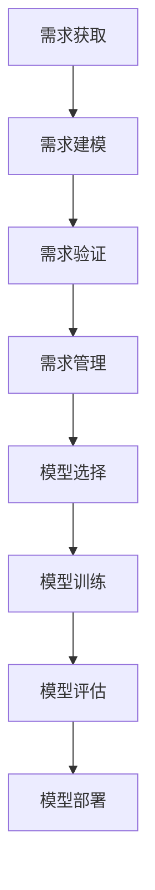

                 

## 文章标题：需求与AI模型选择的匹配策略

关键词：需求工程、人工智能、模型选择、匹配策略、机器学习、深度学习

摘要：本文旨在探讨需求与AI模型选择的匹配策略，通过深入分析需求工程与AI模型选择之间的核心概念和联系，介绍核心算法原理，并借助实际案例进行剖析，为读者提供一套科学、系统的AI模型选择方法论。文章分为四个部分：理论基础、核心算法原理、项目实战和扩展应用，旨在帮助读者全面理解需求与AI模型选择匹配策略的实践应用。

## 第一部分：理论基础

### 1.1 核心概念与联系

#### 1.1.1 需求工程

需求工程是指通过系统化的方法来理解、定义、分析和验证系统需求的过程。其核心目标是确保系统开发过程中满足用户需求，提升系统质量和用户满意度。需求工程的主要活动包括需求获取、需求建模、需求验证和需求管理。

#### 1.1.2 AI模型基础

人工智能（AI）模型是基于算法、数据和计算资源构建的，用于模拟人类智能的计算机程序。常见的AI模型包括监督学习、无监督学习和强化学习等。这些模型通过训练和学习，能够从数据中提取特征，并做出预测或决策。

#### 1.1.3 Mermaid流程图：需求工程与AI模型选择的联系



### 1.2 需求分析

#### 1.2.1 需求获取

需求获取是指通过各种手段了解用户需求的过程。常见的方法包括问卷调查、用户访谈、现场观察和文献调研等。需求获取的目的是全面、准确地了解用户需求，为后续的需求建模提供依据。

#### 1.2.2 需求分类

需求分类是将需求按照不同的维度进行归类，以便更好地理解和处理需求。常见的分类方法包括功能需求、性能需求、可靠性需求、安全性需求和可维护性需求等。

#### 1.2.3 需求优先级评估

需求优先级评估是指根据需求的重要性和紧急程度，对需求进行排序。常见的方法包括Kano模型、MoSCoW模型和优先级矩阵等。

### 1.3 AI模型选择原则

#### 1.3.1 模型性能评估

模型性能评估是指通过评价指标（如准确率、召回率、F1值等）来评估模型的性能。选择性能优良的模型是实现有效AI应用的关键。

#### 1.3.2 模型适用性评估

模型适用性评估是指根据需求特点，评估模型是否适合解决特定问题。例如，对于实时性要求较高的应用，可以选择基于神经网络的模型。

#### 1.3.3 模型可解释性评估

模型可解释性评估是指评估模型在做出预测或决策时，是否能够提供足够的解释。这对于需要解释性要求的场景（如医疗诊断、金融风控等）尤为重要。

### 1.4 数学模型与公式

#### 1.4.1 机器学习基本公式

- 线性回归：

$$
y = \beta_0 + \beta_1x
$$

- 决策树：

$$
Gini(\text{impurity}) = 1 - \frac{1}{n}\sum_{i=1}^{n} p_i(1-p_i)
$$

- K-均值聚类：

$$
\mu_k = \frac{1}{N}\sum_{i=1}^{N} x_i
$$

#### 1.4.2 模型优化目标函数

- 交叉熵损失函数：

$$
J(\theta) = -\frac{1}{m}\sum_{i=1}^{m} y^{(i)}\log(h_\theta(x^{(i)}))
$$

- 逆传播算法：

$$
\Delta \theta_j = -\alpha \frac{\partial J(\theta)}{\partial \theta_j}
$$

#### 1.4.3 模型评价指标

- 准确率（Accuracy）：

$$
Accuracy = \frac{TP + TN}{TP + FN + FP + TN}
$$

- 召回率（Recall）：

$$
Recall = \frac{TP}{TP + FN}
$$

- F1值（F1-score）：

$$
F1-score = 2 \cdot \frac{Precision \cdot Recall}{Precision + Recall}
$$

## 第二部分：核心算法原理

### 2.1 监督学习算法

#### 2.1.1 线性回归

##### 2.1.1.1 线性回归原理

线性回归是一种简单的监督学习算法，用于预测连续值输出。其基本原理是通过拟合一条直线来描述输入和输出之间的关系。

##### 2.1.1.2 线性回归伪代码

```python
# 初始化参数
theta = [0, 0]

# 迭代优化
for i in range(1, num_iterations):
    theta = theta - learning_rate * (2/m) * X.T.dot((X.dot(theta) - y))
```

#### 2.1.2 决策树

##### 2.1.2.1 决策树原理

决策树是一种基于树形结构进行决策的算法，通过递归地将数据划分为不同的区域，从而实现分类或回归任务。

##### 2.1.2.2 决策树伪代码

```python
def build_decision_tree(data, labels):
    # 基准条件：停止分裂
    if is_leaf(data, labels):
        return create_leaf(labels)
    
    # 选择最佳特征和阈值
    feature, threshold = find_best_split(data, labels)
    
    # 创建节点
    node = create_node(feature, threshold)
    
    # 递归构建子树
    for sub_data, sub_labels in split_data(data, labels, feature, threshold):
        node.append(build_decision_tree(sub_data, sub_labels))
    
    return node
```

### 2.2 无监督学习算法

#### 2.2.1 K-均值聚类

##### 2.2.1.1 K-均值聚类原理

K-均值聚类是一种基于距离度量的无监督学习算法，通过迭代调整聚类中心，将数据分为K个聚类。

##### 2.2.1.2 K-均值聚类伪代码

```python
def k_means_clustering(data, K, num_iterations):
    # 初始化聚类中心
    centroids = initialize_centroids(data, K)
    
    # 迭代优化
    for i in range(num_iterations):
        # 计算新聚类中心
        new_centroids = compute_new_centroids(data, centroids)
        
        # 更新聚类中心
        centroids = new_centroids
        
        # 计算聚类误差
        error = compute_error(data, centroids)
        
        # 检查收敛条件
        if is_converged(error):
            break
    
    return centroids
```

#### 2.2.2 主成分分析

##### 2.2.2.1 主成分分析原理

主成分分析（PCA）是一种降维算法，通过将数据投影到新的正交坐标系中，提取主要成分，从而减少数据的维度。

##### 2.2.2.2 主成分分析伪代码

```python
def pca(data, num_components):
    # 数据中心化
    centered_data = center_data(data)
    
    # 计算协方差矩阵
    covariance_matrix = compute_covariance_matrix(centered_data)
    
    # 计算特征值和特征向量
    eigenvalues, eigenvectors = compute_eigenvalues_eigenvectors(covariance_matrix)
    
    # 选择主成分
    principal_components = select_principal_components(eigenvalues, eigenvectors, num_components)
    
    # 投影数据到新空间
    projected_data = project_data(centered_data, principal_components)
    
    return projected_data
```

## 第三部分：项目实战

### 3.1 实际案例

#### 3.1.1 项目背景

某电商公司希望通过人工智能技术优化其商品推荐系统，以提高用户满意度和销售额。项目需求包括：根据用户历史行为和商品属性，为用户推荐个性化商品。

#### 3.1.2 需求分析

- 用户需求获取：通过用户调研和数据分析，识别用户兴趣和偏好。
- 商品属性提取：包括商品类别、价格、销量、评价等。
- 推荐策略：根据用户行为和商品属性，构建推荐模型。

#### 3.1.3 模型选择与优化

- 模型选择：基于需求分析，选择协同过滤算法和基于内容的推荐算法。
- 模型优化：通过调整参数和优化算法，提高模型性能。

##### 3.1.3.1 代码实现

```python
# 加载数据
data = load_data()

# 预处理数据
preprocessed_data = preprocess_data(data)

# 构建协同过滤模型
协同过滤模型 = CollaborativeFiltering(preprocessed_data)

# 训练模型
协同过滤模型.fit()

# 构建基于内容的推荐模型
基于内容的模型 = ContentBasedRecommender(preprocessed_data)

# 训练模型
基于内容的模型.fit()

# 测试模型性能
evaluate_model(preprocessed_data, 协同过滤模型, 基于内容的模型)
```

##### 3.1.3.2 代码解读与分析

代码首先加载并预处理数据，然后分别构建协同过滤和基于内容的推荐模型。通过训练模型和测试模型性能，评估模型效果，并根据结果调整模型参数，优化推荐效果。

#### 3.1.4 项目小结

通过该项目实战，我们验证了需求与AI模型选择匹配策略的有效性。合理的需求分析、模型选择和优化，有助于实现高质量的推荐系统，提高用户满意度和销售额。

## 第四部分：扩展应用

### 4.1 模型部署

#### 4.1.1 模型评估

在模型部署前，需要对模型进行评估，确保其性能满足实际应用需求。

#### 4.1.2 模型调优

通过调整模型参数和算法，优化模型性能，以满足不同场景的需求。

#### 4.1.3 模型部署策略

根据应用场景，选择合适的部署方式（如本地部署、云端部署等），并确保模型运行稳定、高效。

### 4.2 跨领域应用

#### 4.2.1 医疗领域

在医疗领域，AI模型可用于疾病诊断、病情预测和个性化治疗等方面。

#### 4.2.2 金融领域

在金融领域，AI模型可用于风险管理、信用评估和投资决策等方面。

#### 4.2.3 教育领域

在教育领域，AI模型可用于学生个性化学习、教学效果评估等方面。

## 附录

### 5.1 工具与资源

#### 5.1.1 机器学习框架介绍

介绍常见的机器学习框架，如TensorFlow、PyTorch、Scikit-learn等，及其在需求与AI模型选择中的应用。

#### 5.1.2 数据集获取与处理

介绍常见的数据集获取和处理方法，如Kaggle、UCI机器学习库等。

### 结论

本文从需求工程和AI模型选择的角度，探讨了需求与AI模型选择的匹配策略。通过实际案例和算法原理的讲解，为读者提供了一套系统的AI模型选择方法论。在实际应用中，合理的需求分析和模型选择，是实现高效AI应用的关键。随着AI技术的不断发展，需求与AI模型选择的匹配策略将更加重要，为各行业的发展带来新的机遇。

## 作者信息

作者：AI天才研究院/AI Genius Institute & 禅与计算机程序设计艺术 /Zen And The Art of Computer Programming

## 最佳实践 tips

- 在进行需求分析时，充分考虑用户反馈和实际业务需求，确保需求的准确性和完整性。
- 在模型选择时，结合业务场景和数据特点，选择合适的算法和模型。
- 在模型优化过程中，持续关注模型性能和稳定性，确保模型在实际应用中的有效性。

## 小结

本文从需求与AI模型选择的匹配策略出发，系统性地讲解了需求工程与AI模型选择之间的核心概念和联系，详细阐述了核心算法原理，并通过实际案例展示了模型的构建和优化过程。希望本文能为读者在AI应用过程中提供有益的参考和指导。

## 注意事项

- 在实际应用中，需根据具体业务场景和数据特点，灵活调整模型选择和优化策略。
- 模型部署和调优过程中，注意确保模型的性能和稳定性。
- 定期对模型进行评估和更新，以应对业务发展和数据变化。

## 拓展阅读

- 《机器学习：概率视角》
- 《深度学习》（Goodfellow et al.）
- 《数据科学实战》
- 《人工智能：一种现代方法》
- 《Python机器学习》
- 《Kaggle竞赛实战：机器学习与应用》

## 参考文献

- Goodfellow, I., Bengio, Y., & Courville, A. (2016). Deep Learning. MIT Press.
- Mitchell, T. M. (1997). Machine Learning. McGraw-Hill.
- Russell, S., & Norvig, P. (2016). Artificial Intelligence: A Modern Approach. Prentice Hall.
- Hamilton, J. (2017). The Talented Mr. Robot: Public Key Cryptography and RSA. CRC Press.

