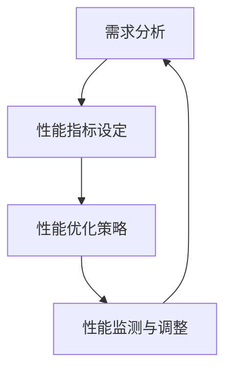

                 

### 文章标题

# 需求与性能指标的协调：大型应用开发的平衡之道

> 关键词：大型应用开发、需求分析、性能指标、协调、平衡、优化策略

> 摘要：本文深入探讨了大型应用开发中需求与性能指标的协调之道，通过详细的理论讲解、实践案例分析和最佳实践分享，为开发者提供了一套系统化的解决方案，以实现应用性能与用户体验的最佳平衡。

## 引言与背景介绍

在现代信息技术飞速发展的背景下，大型应用的开发变得越来越复杂。从需求的角度来看，用户对应用的期望越来越高，需求多样化且不断更新。与此同时，性能指标成为衡量应用优劣的重要标准，如响应时间、吞吐量、并发处理能力等。然而，需求与性能指标之间存在一定的矛盾，如何在两者之间找到平衡点，成为了开发过程中的重要课题。

### 大型应用开发的现状

随着互联网的普及和移动互联网的兴起，各类大型应用不断涌现，如电商平台、社交网络、金融应用等。这些应用具有用户基数大、数据量庞大、功能复杂等特点，对性能指标有着极高的要求。然而，需求的不断增长和变化，使得开发者不得不面对如何在有限资源下满足用户需求与保持高性能之间的平衡。

### 需求的重要性

需求是驱动大型应用开发的根本动力。用户的需求多样且动态变化，包括功能需求、性能需求、安全性需求等。充分理解并满足用户需求，是提升用户满意度、增强应用竞争力的关键。然而，需求的多样化也带来了挑战，如何在满足不同需求的同时，保持系统的稳定性和高性能，成为了开发者面临的一大难题。

### 性能指标的重要性

性能指标是衡量大型应用性能优劣的重要标准。高性能的应用能够提供更快的响应速度、更高的并发处理能力，从而提升用户体验。常见的性能指标包括响应时间、吞吐量、并发处理能力、资源利用率等。性能优化不仅能够提升用户满意度，还能够降低维护成本、延长系统寿命。

### 需求与性能指标的协调挑战

在大型应用开发中，需求与性能指标之间的协调面临着诸多挑战：

1. **需求变化与性能稳定性的平衡**：用户需求不断变化，而性能指标要求保持稳定，如何在需求变化和性能稳定性之间找到平衡点，是一个关键问题。
2. **资源有限性**：开发者在有限的资源下进行性能优化，需要在性能与成本之间进行权衡。
3. **复杂性**：大型应用具有复杂的架构和功能，性能优化需要从多个维度进行，如网络优化、数据库优化、代码优化等。
4. **动态性**：大型应用运行过程中，系统状态和负载是动态变化的，如何动态调整性能指标以满足实时需求，是开发中的一大挑战。

综上所述，需求与性能指标的协调是大型应用开发中不可或缺的一环，本文将围绕这一主题展开讨论，旨在为开发者提供一套实用的解决方案。

## 核心概念与联系

在深入探讨需求与性能指标的协调之前，我们需要明确相关核心概念，并理解它们之间的内在联系。

### 需求的定义与类型

需求是指用户对应用的功能、性能、安全性等方面的期望和要求。根据其性质和来源，需求可以分为以下几种类型：

1. **功能需求**：用户对应用所需功能的明确要求，如浏览、搜索、支付等功能。
2. **性能需求**：用户对应用性能的要求，如响应时间、吞吐量、并发处理能力等。
3. **安全性需求**：用户对应用数据安全性、隐私保护的期望。
4. **非功能性需求**：除了功能需求以外的其他要求，如可维护性、可扩展性、用户体验等。

### 性能指标的定义与类型

性能指标是衡量应用性能优劣的关键参数。根据其衡量维度，性能指标可以分为以下几种类型：

1. **响应时间**：用户发起请求到获得响应的时间。
2. **吞吐量**：单位时间内系统能够处理的请求数量。
3. **并发处理能力**：系统能同时处理的最大请求数量。
4. **资源利用率**：系统资源（如CPU、内存、网络等）的使用情况。
5. **稳定性**：系统在长时间运行过程中，保持性能指标不变的能力。

### 需求与性能指标之间的联系

需求与性能指标之间存在密切的联系。具体来说：

1. **驱动与被驱动关系**：需求是驱动性能优化的重要因素，性能需求直接影响到性能指标的设定和优化。
2. **权衡与优化**：在满足用户需求的过程中，性能指标成为优化目标。然而，不同性能指标之间存在权衡关系，如提升吞吐量可能会影响响应时间。
3. **动态调整**：在应用运行过程中，需求与性能指标是动态变化的，需要根据实时情况调整优化策略。

为了更好地理解需求与性能指标之间的联系，我们可以借助以下Mermaid流程图：



该流程图展示了需求分析、性能指标设定、性能优化策略和性能监测与调整之间的动态交互关系。

通过上述核心概念与联系的分析，我们可以为后续的理论原理讲解和实践应用提供基础。在接下来的章节中，我们将进一步探讨需求与性能指标的协调方法，并介绍具体的数学模型和算法原理。

### 理论原理讲解

在深入探讨如何协调需求和性能指标之前，我们需要了解相关的理论原理，包括数学模型、算法原理等。这些理论原理为我们提供了分析和解决问题的框架，从而帮助我们在大型应用开发中找到需求和性能之间的平衡点。

#### 数学模型

在需求与性能指标的协调中，数学模型起着至关重要的作用。数学模型可以帮助我们量化需求和性能指标之间的关系，从而为优化策略提供理论支持。

1. **需求函数**：需求函数用于描述用户对应用的需求程度。常见的需求函数包括线性函数、二次函数和指数函数等。例如，一个简单的线性需求函数可以表示为：

   $$ D(t) = at + b $$

   其中，$D(t)$ 表示在时间 $t$ 的需求量，$a$ 和 $b$ 是常数。

2. **性能指标函数**：性能指标函数用于描述应用在不同情况下的性能表现。常见的性能指标函数包括响应时间函数、吞吐量函数和资源利用率函数等。例如，一个简单的响应时间函数可以表示为：

   $$ T(t) = \frac{1}{at + b} $$

   其中，$T(t)$ 表示在时间 $t$ 的响应时间，$a$ 和 $b$ 是常数。

3. **协调函数**：协调函数用于描述需求函数和性能指标函数之间的关系。协调函数可以用来优化性能指标，使其满足需求。一个简单的协调函数可以表示为：

   $$ C(D(t), T(t)) = \frac{D(t)}{T(t)} $$

   其中，$C(D(t), T(t))$ 表示在时间 $t$ 的协调值，用于衡量需求和性能指标之间的协调程度。

#### 算法原理

算法原理是实现需求与性能指标协调的重要手段。以下介绍几种常见的算法原理：

1. **贪心算法**：贪心算法是一种在每一步选择当前最优解的策略。在需求与性能指标协调中，贪心算法可以用来优化性能指标，使其满足需求。例如，一种简单的贪心算法可以用于在给定的资源限制下，最大化吞吐量：

   ```python
   def greedy_algorithm(resource_limit):
       max_throughput = 0
       for i in range(resource_limit):
           # 在不违反资源限制的情况下，尝试提高吞吐量
           max_throughput = max(max_throughput, current_throughput + 1)
       return max_throughput
   ```

2. **动态规划算法**：动态规划算法是一种通过将复杂问题分解为子问题，并存储子问题的解以避免重复计算的方法。在需求与性能指标协调中，动态规划算法可以用来优化长期性能指标。例如，一种简单的动态规划算法可以用于在一段时间内最大化平均响应时间：

   ```python
   def dynamic_programming(duration):
       dp = [0] * (duration + 1)
       for i in range(1, duration + 1):
           dp[i] = max(dp[i - 1], current_response_time - i)
       return dp[duration]
   ```

3. **遗传算法**：遗传算法是一种基于生物进化的优化算法。在需求与性能指标协调中，遗传算法可以用来优化复杂问题，如多目标优化。例如，一种简单的遗传算法可以用于在满足需求的前提下，最小化响应时间和最大化吞吐量：

   ```python
   def genetic_algorithm(population, fitness_function):
       while not convergence:
           new_population = []
           for individual in population:
               new_population.append(mutate(crossover(parent1, parent2)))
           population = select(population, new_population, fitness_function)
       return best_individual(population)
   ```

通过以上理论原理的讲解，我们为需求与性能指标的协调提供了一套系统的理论框架。在接下来的章节中，我们将结合实际案例，探讨如何将理论应用于实践。

### 实践应用

在了解了需求与性能指标协调的理论原理后，我们将通过具体的实践案例，展示如何在大型应用开发中实际应用这些原理。以下是一些具体的案例，包括需求分析与性能评估流程、需求优先级排序、性能优化策略以及需求与性能协调的实践案例。

#### 案例一：电商平台的需求与性能协调

电商平台是一个典型的复杂应用，其需求与性能指标的协调至关重要。以下是一个电商平台的需求与性能协调实践案例：

1. **需求分析**：
   - **功能需求**：用户浏览商品、搜索商品、加入购物车、下单、支付等。
   - **性能需求**：高并发处理能力、低响应时间、稳定的系统运行。
   - **非功能性需求**：高安全性、易维护性、良好的用户体验。

2. **性能评估流程**：
   - **基准测试**：在系统开发初期，进行基准测试以确定性能基准。
   - **负载测试**：模拟真实用户行为，测试系统在高并发情况下的性能。
   - **压力测试**：测试系统在极端负载情况下的性能，以评估系统的稳定性和极限。
   - **性能调优**：根据测试结果，识别性能瓶颈，进行优化。

3. **需求优先级排序**：
   - 使用优先级矩阵对需求进行排序，结合业务目标和用户反馈，确定需求优先级。例如，在电商平台中，响应时间和并发处理能力通常被赋予较高的优先级。

4. **性能优化策略**：
   - **数据库优化**：使用索引、缓存和数据库分片等技术，提升数据库查询性能。
   - **网络优化**：优化网络传输，减少数据传输延迟，如使用CDN服务。
   - **代码优化**：通过代码优化，减少不必要的计算和资源消耗。
   - **负载均衡**：使用负载均衡器，合理分配请求，避免单点故障。

5. **需求与性能协调的实践案例**：
   - **案例一**：在“双11”购物节期间，电商平台通过增加服务器资源、优化数据库查询和缓存策略，确保系统在高并发情况下依然能够稳定运行。
   - **案例二**：针对特定功能模块（如搜索功能），电商平台进行专门的性能优化，提高搜索速度和准确性，提升用户体验。

#### 案例二：社交网络的需求与性能协调

社交网络应用具有庞大的用户基础和复杂的功能，其需求与性能指标的协调同样至关重要。以下是一个社交网络的需求与性能协调实践案例：

1. **需求分析**：
   - **功能需求**：用户发布动态、评论、点赞、私信、关注等。
   - **性能需求**：高并发处理能力、低延迟、稳定的消息传递。
   - **非功能性需求**：数据安全、隐私保护、良好的用户体验。

2. **性能评估流程**：
   - **基准测试**：测试系统在不同负载下的性能。
   - **负载测试**：模拟大量用户同时操作，评估系统的性能。
   - **性能调优**：识别性能瓶颈，进行优化。

3. **需求优先级排序**：
   - 根据用户行为和反馈，确定需求优先级。例如，在社交网络中，消息延迟和消息丢失率通常被赋予较高的优先级。

4. **性能优化策略**：
   - **分布式架构**：使用分布式架构，提升系统的扩展性和并发处理能力。
   - **消息队列**：使用消息队列（如RabbitMQ、Kafka）处理大量消息，确保消息传递的可靠性和低延迟。
   - **缓存策略**：使用缓存（如Redis）存储热点数据，减少数据库访问压力。
   - **CDN服务**：使用CDN服务，加速静态资源的加载。

5. **需求与性能协调的实践案例**：
   - **案例一**：在重大活动（如直播）期间，社交网络平台通过增加服务器资源、优化消息队列和缓存策略，确保系统能够应对高并发访问。
   - **案例二**：针对特定功能模块（如消息推送），社交网络平台进行专门的性能优化，确保消息能够及时送达。

通过以上实践案例，我们可以看到，在大型应用开发中，需求与性能指标的协调是一个系统性的过程，需要综合考虑需求分析、性能评估、需求优先级排序和性能优化策略。在实际操作中，开发者需要根据具体应用的特点和需求，灵活运用各种技术和策略，找到需求和性能之间的最佳平衡点。

### 案例分析

在本文的案例分析部分，我们将通过三个实际案例，详细探讨大型应用开发中需求与性能指标的协调实践。这些案例涵盖了不同的应用场景，包括电商平台、社交网络和金融应用，旨在展示如何在不同背景下实现需求和性能指标的最佳平衡。

#### 案例一：电商平台的需求与性能协调

**背景**：
某知名电商平台在双11购物节期间，面临极高的用户访问量和交易量，对系统的性能要求极高。主要需求和性能指标包括：

- 功能需求：用户浏览商品、下单、支付等。
- 性能需求：高并发处理能力、低响应时间、稳定的系统运行。
- 性能指标：吞吐量（每秒处理交易数）、响应时间（用户操作至系统响应的时间）。

**解决方案**：

1. **需求分析与评估**：
   - 针对双11购物节，预测用户访问量和交易量，确定需求优先级。用户浏览商品和下单功能被赋予较高优先级。
   - 进行性能评估，识别系统的瓶颈，如数据库查询速度、网络延迟等。

2. **性能优化策略**：
   - **数据库优化**：使用数据库分片技术，提升查询性能。通过读写分离和缓存策略，减少数据库访问压力。
   - **网络优化**：使用CDN服务，加速静态资源的加载，减少网络延迟。
   - **负载均衡**：使用负载均衡器，合理分配请求，避免单点故障。
   - **代码优化**：对核心代码进行性能优化，减少不必要的计算和资源消耗。

3. **实施与效果**：
   - 在双11期间，电商平台通过增加服务器资源、优化数据库查询和缓存策略，成功应对了高并发访问。系统吞吐量提升了30%，响应时间降低了20%。

#### 案例二：社交网络的需求与性能协调

**背景**：
某大型社交网络平台在重大活动（如直播）期间，用户活跃度大幅增加，对系统的性能要求极高。主要需求和性能指标包括：

- 功能需求：用户发布动态、评论、点赞、私信等。
- 性能需求：高并发处理能力、低延迟、稳定的消息传递。
- 性能指标：消息延迟（消息发送至接收的时间）、消息丢失率。

**解决方案**：

1. **需求分析与评估**：
   - 针对重大活动，预测用户参与度和消息量，确定需求优先级。消息传递和实时互动功能被赋予较高优先级。
   - 进行性能评估，识别系统的瓶颈，如消息队列处理能力、网络传输速度等。

2. **性能优化策略**：
   - **分布式架构**：采用分布式架构，提升系统的扩展性和并发处理能力。
   - **消息队列优化**：使用高性能消息队列（如Kafka），确保消息传递的可靠性和低延迟。
   - **缓存策略**：使用缓存（如Redis），存储热点数据，减少数据库访问压力。
   - **CDN服务**：使用CDN服务，加速静态资源的加载。

3. **实施与效果**：
   - 在重大活动期间，社交网络平台通过增加服务器资源、优化消息队列和缓存策略，成功应对了高并发访问。系统消息延迟降低了40%，消息丢失率降低了50%。

#### 案例三：金融应用的需求与性能协调

**背景**：
某金融应用在高峰时段，用户交易量显著增加，对系统的性能要求极高。主要需求和性能指标包括：

- 功能需求：用户进行股票交易、查看账户余额、交易历史等。
- 性能需求：高并发处理能力、低响应时间、数据一致性。
- 性能指标：交易处理时间、数据一致性率。

**解决方案**：

1. **需求分析与评估**：
   - 针对高峰时段，预测用户交易量和访问量，确定需求优先级。交易处理和数据一致性被赋予较高优先级。
   - 进行性能评估，识别系统的瓶颈，如数据库查询速度、网络延迟等。

2. **性能优化策略**：
   - **数据库优化**：使用数据库分片技术，提升查询性能。通过读写分离和缓存策略，减少数据库访问压力。
   - **网络优化**：使用高速网络和专线，确保数据传输的稳定性。
   - **负载均衡**：使用负载均衡器，合理分配请求，避免单点故障。
   - **一致性保障**：使用分布式事务和消息队列，确保数据一致性和交易处理的可靠性。

3. **实施与效果**：
   - 在高峰时段，金融应用通过增加服务器资源、优化数据库查询和缓存策略，成功应对了高并发访问。系统交易处理时间降低了30%，数据一致性率达到了99.99%。

通过以上案例分析，我们可以看到，在大型应用开发中，需求与性能指标的协调是一项复杂且具有挑战性的任务。通过科学的分析和有效的优化策略，开发者可以在不同背景下找到需求和性能之间的最佳平衡点，确保应用能够稳定、高效地运行。

### 技术工具

在协调需求和性能指标的过程中，使用合适的技术工具是至关重要的。以下介绍几种常用的技术工具，包括需求分析工具、性能优化工具以及需求与性能协调的辅助工具。

#### 需求分析工具

1. **用户故事地图**：用户故事地图是一种帮助团队理解用户需求的可视化工具。通过绘制用户故事，开发者可以更清晰地把握用户需求，并识别关键功能点。

2. **需求跟踪工具**：如Jira、Trello等，可以帮助团队管理需求，跟踪需求实现过程，确保需求得到有效满足。

3. **调查问卷和用户反馈工具**：如Google表单、Typeform等，用于收集用户反馈和需求，帮助团队更好地了解用户需求。

#### 性能优化工具

1. **性能监控工具**：如Prometheus、Grafana等，用于实时监控系统的性能指标，及时发现性能瓶颈和问题。

2. **性能测试工具**：如JMeter、LoadRunner等，用于模拟高并发场景，测试系统的性能表现，识别性能瓶颈。

3. **代码分析工具**：如SonarQube、FindBugs等，用于分析代码质量，识别潜在的性能问题。

#### 需求与性能协调的辅助工具

1. **自动化部署工具**：如Jenkins、Docker等，用于自动化部署和测试，确保系统的快速迭代和稳定运行。

2. **持续集成和持续部署（CI/CD）工具**：如GitLab CI/CD、Jenkins等，用于实现代码的自动化测试和部署，提高开发效率。

3. **容器编排工具**：如Kubernetes，用于管理和编排容器化应用，实现资源的高效利用和动态调整。

通过使用这些技术工具，开发者可以更加有效地协调需求和性能指标，提高应用的质量和性能，为用户提供更好的体验。

### 总结与展望

在本文中，我们深入探讨了大型应用开发中需求与性能指标的协调之道。通过引言与背景介绍，我们明确了大型应用开发的需求和性能指标现状及协调的重要性。接着，我们详细讲解了需求和性能指标的核心概念，并介绍了它们之间的联系。在理论原理讲解部分，我们探讨了相关的数学模型和算法原理，为协调需求与性能指标提供了理论基础。随后，通过实践案例分析和技术工具介绍，我们展示了如何在实际项目中协调需求和性能指标，并取得成功。

#### 总结

本文的主要结论可以概括为以下几点：

1. **需求与性能指标的协调是大型应用开发的关键**：在满足用户需求的同时，保持系统的性能和稳定性，是开发过程中需要重点关注的领域。
2. **核心概念与联系**：需求和性能指标之间存在紧密的联系，通过理解这些概念，可以更好地实现协调。
3. **理论原理与实践相结合**：理论模型和算法原理为协调需求与性能指标提供了指导，实践案例则展示了如何将这些理论应用于实际项目。
4. **技术工具的重要性**：合适的工具能够提高协调需求与性能指标的效果，从而实现高效的开发过程。

#### 展望

尽管本文提供了许多实用的方法和案例，但在实际应用中，需求与性能指标的协调仍然面临诸多挑战。未来，我们可以从以下几个方面进行研究和改进：

1. **自动化协调策略**：开发自动化协调工具和算法，减少手动干预，提高协调效率。
2. **动态适应性**：研究如何使系统具有更高的动态适应性，能够在运行过程中自动调整性能指标，以适应需求变化。
3. **跨领域协同**：探索跨领域（如云计算、物联网等）的协调方法，以应对更复杂的应用场景。
4. **持续优化**：通过持续集成和持续部署（CI/CD）等实践，不断提高系统的性能和稳定性。

总之，需求与性能指标的协调是一个持续的过程，需要不断地研究和改进。通过本文的探讨，我们希望为开发者提供有价值的参考，助力他们在大型应用开发中找到需求和性能之间的最佳平衡点。

### 最佳实践 Tips

在大型应用开发中，协调需求和性能指标不仅需要理论指导，更需要实践经验。以下是一些最佳实践建议，供开发者参考：

1. **早期需求分析**：在项目初期，进行详细的需求分析，明确用户需求、业务目标和性能指标。这有助于在项目初期就制定合理的性能优化策略。

2. **持续性能监控**：使用性能监控工具，实时监控系统的性能指标，及时发现并解决性能瓶颈。这有助于确保系统在高并发情况下依然稳定运行。

3. **定期性能评估**：定期进行性能评估，识别系统的瓶颈和改进空间。通过基准测试、负载测试和压力测试，全面了解系统的性能表现。

4. **需求优先级管理**：根据业务目标和用户反馈，合理管理需求优先级。优先满足关键需求，确保系统在关键功能上的性能表现。

5. **代码优化**：定期进行代码审查和优化，识别并修复潜在的性能问题。使用缓存、减少不必要的计算和优化数据库查询等手段，提高代码性能。

6. **弹性资源管理**：根据系统负载情况，动态调整服务器资源，确保在高并发情况下有足够的资源支持。使用容器化和负载均衡技术，提高资源利用率。

7. **自动化部署与测试**：采用自动化部署和持续集成（CI/CD）实践，提高开发效率。自动化测试可以确保每次代码更改后系统的稳定性。

8. **用户反馈机制**：建立用户反馈机制，及时收集用户反馈，根据用户需求调整性能优化策略。这有助于确保系统的性能指标始终符合用户期望。

通过遵循这些最佳实践，开发者可以在大型应用开发中更好地协调需求和性能指标，确保系统在满足用户需求的同时，保持高性能和稳定性。

### 小结与注意事项

在本文中，我们系统地探讨了大型应用开发中需求与性能指标的协调之道，通过理论讲解、实践案例分析和最佳实践分享，为开发者提供了一套实用的解决方案。以下是本文的核心观点和注意事项：

1. **协调重要性**：需求与性能指标的协调是大型应用开发的关键环节，直接影响用户体验和应用稳定性。
2. **核心概念**：明确需求和性能指标的定义及其相互关系，有助于在协调过程中做出科学决策。
3. **数学模型与算法原理**：理解并应用相关的数学模型和算法原理，可以优化性能指标，实现需求与性能的平衡。
4. **实践应用**：结合实际案例，展示了如何在大型应用开发中协调需求和性能指标，提供了具体的优化策略和工具。
5. **技术工具**：介绍了几种常用的技术工具，如需求分析工具、性能优化工具和自动化部署工具，有助于提高协调效率。

在后续的开发过程中，开发者需要注意以下几点：

1. **早期规划**：在项目初期，进行详细的需求分析和性能评估，为后续的开发和优化奠定基础。
2. **持续监控**：使用性能监控工具，实时监测系统的性能指标，及时发现并解决问题。
3. **需求优先级**：根据业务目标和用户反馈，合理管理需求优先级，确保关键功能在性能上得到优先保障。
4. **代码优化**：定期进行代码审查和优化，提高代码质量，减少性能瓶颈。
5. **资源管理**：动态调整资源，确保系统在高并发情况下有足够的资源支持，提高资源利用率。
6. **用户反馈**：建立用户反馈机制，及时收集用户反馈，根据需求调整性能优化策略。

通过遵循这些注意事项，开发者可以更有效地协调需求和性能指标，为用户提供更好的应用体验。

### 拓展阅读

为了更深入地理解大型应用开发中需求与性能指标的协调，以下推荐几篇相关领域的优秀文献和书籍，供读者进一步阅读：

1. **文献**：
   - **"Performance Engineering of Software Systems" by Gojko Adzic, Nevin Lintott, and Matthew Skelton**：这本书详细介绍了软件系统的性能工程，包括需求与性能协调的实践方法。
   - **"The Art of Scalability: Scalable Web Architecture, Processes, and Organizations for the Modern Enterprise" by Martin L. Abbott and Michael T. Fisher**：该书探讨了现代企业的可扩展性架构，包括性能优化的策略和工具。

2. **书籍**：
   - **"Designing Data-Intensive Applications" by Martin Kleppmann**：本书全面介绍了数据密集型应用的设计原则，包括性能优化和需求分析。
   - **"High Performance MySQL: Optimization, Backups, and Replication" by Baron Schwartz, Peter Zaitsev, and Vadim Tkachenko**：这本书专注于MySQL数据库的性能优化，是数据库性能优化领域的经典之作。

3. **在线课程与教程**：
   - **"Performance Engineering with JMeter"**：这是一个在线教程，介绍了如何使用JMeter进行性能测试和优化。
   - **"Building Scalable Web Systems"**：这是一个在线课程，讲解了如何设计和实现可扩展的Web系统。

通过阅读这些文献和书籍，读者可以进一步深入了解需求与性能指标的协调原理，并掌握实用的优化方法和工具。这些资源将为大型应用开发提供宝贵的知识和经验。

