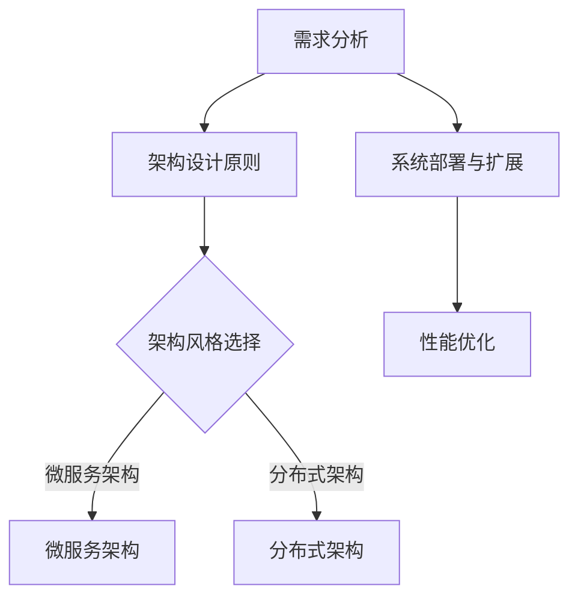
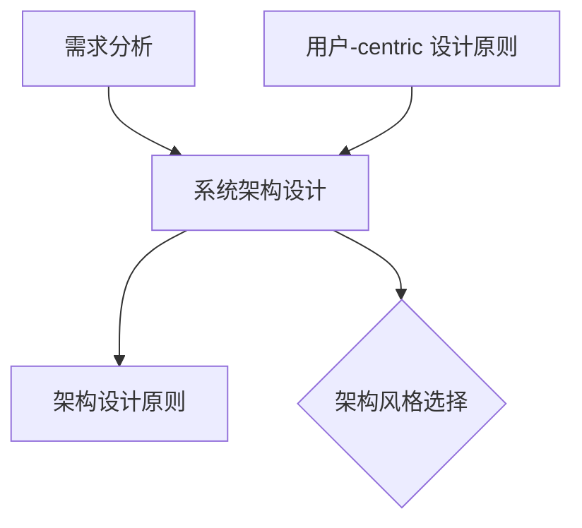
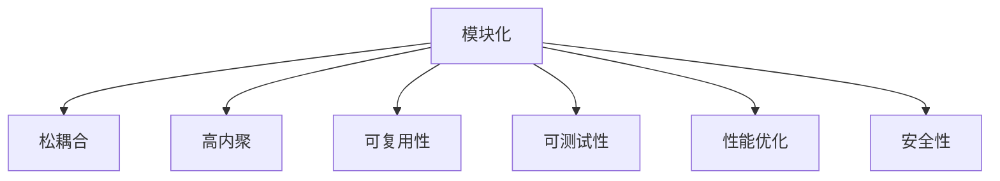
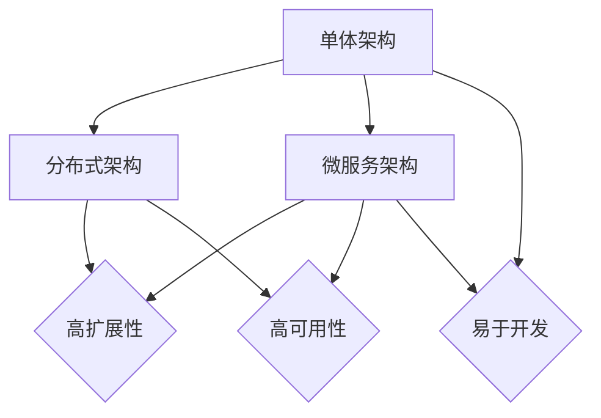
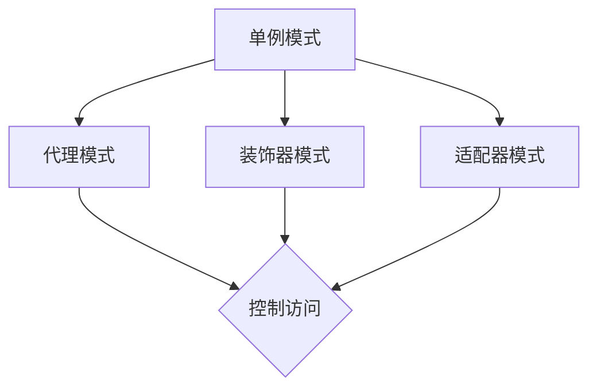
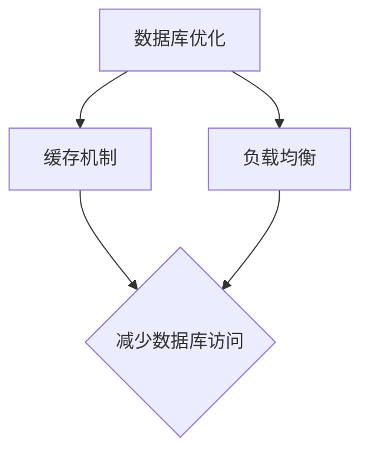

                 

## 文章标题：需求与技术架构的协同演进：确保系统可扩展性

### 关键词：需求分析、技术架构、系统可扩展性、架构设计模式、微服务架构、负载均衡、性能优化

### 摘要：
在现代软件开发中，系统可扩展性已成为衡量系统设计成功与否的关键因素。本文将深入探讨需求与技术架构之间的协同演进，强调如何通过设计模式和最佳实践确保系统的高扩展性和稳定性。文章将从需求分析、架构设计原则、架构风格和设计模式、性能优化技术等方面进行详细讨论，并通过实际案例进行分析，旨在为软件开发者提供系统的指导。

---

## 引言

在数字化时代，系统的快速响应能力、容错性和扩展性成为了软件架构设计的重要考量因素。传统的单体架构已经难以满足日益增长的用户需求和复杂的应用场景，而分布式架构、微服务架构等新兴架构风格则因其高可扩展性而受到广泛关注。本文将围绕需求与技术架构的协同演进展开讨论，强调在系统设计过程中如何确保系统的可扩展性。

### 背景

随着互联网的普及和大数据技术的发展，软件系统需要处理的数据量呈现爆炸式增长。传统的单体架构在应对大规模并发请求时往往显得力不从心，系统性能瓶颈、扩展困难等问题逐渐暴露出来。为了解决这些问题，开发者开始探索分布式架构、微服务架构等新兴架构风格，这些架构风格通过将系统拆分成更小的、可独立部署和扩展的模块，实现了系统的高可扩展性。

### 核心概念与联系

为了更好地理解需求与技术架构的协同演进，我们首先需要了解几个核心概念：

1. **需求分析**：需求分析是软件工程中的关键环节，它涉及对用户需求的理解和转化。需求分析的结果是系统的功能需求和非功能需求。
2. **系统架构**：系统架构是系统的整体结构和各个部分之间的交互关系。它包括硬件架构、软件架构和应用程序架构等多个层面。
3. **可扩展性**：可扩展性是指系统在需求增长时能够灵活地增加资源、扩展功能的能力。可扩展性包括横向扩展（水平扩展）和纵向扩展（垂直扩展）两种类型。

这些概念之间存在紧密的联系。需求分析的结果直接影响到系统架构的设计，而系统架构的设计原则和风格则决定了系统的可扩展性。例如，微服务架构通过将系统拆分成多个独立的服务模块，实现了更高的可扩展性。需求与技术架构之间的协同演进是一个动态的过程，需要不断地调整和优化。

### Mermaid 流程图

下面是一个简化的 Mermaid 流程图，展示了需求与技术架构之间的协同演进过程：

### 下一步

在接下来的章节中，我们将深入探讨需求分析、架构设计原则、架构风格和设计模式、性能优化技术等方面的内容，并通过实际案例进行分析，以帮助读者更好地理解和应用这些概念。

## 需求分析

### 定义与重要性

需求分析是软件工程中的关键环节，它旨在理解用户需求并将其转化为具体的系统功能需求和非功能需求。需求分析的过程包括收集需求、分析需求、定义需求等多个步骤。其重要性在于，它为后续的系统设计、开发、测试和部署提供了明确的方向和依据。

1. **功能需求**：功能需求描述了系统应该提供的具体功能和服务。例如，一个在线购物系统需要具备商品展示、购物车管理、订单处理等功能。
2. **非功能需求**：非功能需求则描述了系统的性能、安全性、可靠性等方面的要求。例如，系统的响应时间需要控制在500毫秒以内，数据安全性需要满足特定的安全标准。

### 需求工程过程

需求工程是一个循环迭代的过程，包括以下几个主要步骤：

1. **需求收集**：通过与用户、利益相关者进行访谈、问卷调查、观察等方式，收集系统的需求信息。
2. **需求分析**：对收集到的需求进行整理、分类和分析，识别出系统的核心功能和关键性能要求。
3. **需求定义**：将分析后的需求用清晰、具体、可测量的方式定义下来，形成需求规格说明书。
4. **需求验证**：通过评审、测试等方式，验证需求规格说明书的准确性和完整性。
5. **需求管理**：在整个软件生命周期中，对需求进行持续跟踪和管理，确保需求的实现和变更得到有效控制。

### 用户-centric 设计原则

用户-centric 设计原则强调在需求分析过程中始终将用户放在核心位置，关注用户的需求、体验和行为。以下是几个关键原则：

1. **用户研究**：通过用户研究，深入了解用户的行为模式、需求和痛点，为系统设计提供真实的用户视角。
2. **用户体验设计**：在系统设计过程中，关注用户的使用流程、交互界面和反馈机制，确保系统易于使用、操作流畅。
3. **迭代与反馈**：采用迭代开发的方式，不断收集用户反馈，对系统进行持续优化和改进。

### 核心概念与联系

需求分析与系统架构设计之间存在着密切的联系。需求分析的结果直接影响到系统架构的设计，而系统架构的设计原则和风格则决定了系统的可扩展性。例如，在需求分析阶段，如果发现系统需要处理大量并发请求，那么在系统架构设计时，可以选择分布式架构或微服务架构，以提高系统的响应速度和并发能力。

### Mermaid 流�程图

下面是一个简化的 Mermaid 流程图，展示了需求分析与系统架构设计之间的关系：

### 小结

需求分析是确保系统设计符合用户需求的基础。通过深入理解用户需求、遵循用户-centric 设计原则，可以有效地指导系统架构的设计，为系统的高可扩展性和稳定性奠定基础。在下一章中，我们将进一步探讨系统架构的基本原理和设计原则。

## 系统架构的基本原理和设计原则

### 定义与重要性

系统架构是软件系统的整体结构及其各个部分之间的交互关系。它不仅包括硬件架构、软件架构和应用程序架构，还包括设计原则、设计模式、架构风格等。系统架构的重要性在于它决定了系统的可扩展性、性能、安全性、可靠性等关键特性。一个良好的系统架构能够支持系统的长期发展，满足不断变化的需求。

### 系统架构的基本组成部分

系统架构通常由以下几个主要部分组成：

1. **组件（Components）**：组件是系统能够执行特定功能的独立部分。在软件系统中，组件可以是模块、库、服务或子系统。
2. **接口（Interfaces）**：接口定义了组件之间的通信方式和数据交换格式。良好的接口设计可以确保组件之间的松耦合，提高系统的可维护性和可扩展性。
3. **通信机制（Communication Mechanisms）**：通信机制包括同步和异步通信、远程过程调用（RPC）、消息队列、事件驱动机制等。通信机制的选择会影响系统的性能和可扩展性。
4. **数据存储（Data Storage）**：数据存储包括数据库、缓存、文件系统等。数据存储的设计对系统的性能和数据一致性有重要影响。
5. **架构风格（Architecture Styles）**：架构风格是指系统整体结构和组件之间的关系模式，例如单体架构、分布式架构、微服务架构等。

### 常见的架构设计原则

以下是一些常见的架构设计原则，这些原则有助于构建高可扩展性和高可靠性的系统：

1. **模块化（Modularity）**：将系统划分为独立的模块，每个模块负责特定的功能。模块化有助于提高系统的可维护性、可扩展性和复用性。
2. **松耦合（Loose Coupling）**：通过减少组件之间的直接依赖，实现组件之间的松耦合。松耦合有助于提高系统的可扩展性和灵活性。
3. **高内聚（High Cohesion）**：确保组件内部的功能紧密相关，降低组件之间的交互复杂度。高内聚有助于提高系统的可维护性和可扩展性。
4. **可复用性（Reusability）**：设计可复用的组件和模块，提高开发效率和代码质量。
5. **可测试性（Testability）**：设计便于单元测试和集成测试的架构，确保系统能够在测试环境中有效地验证。
6. **性能优化（Performance Optimization）**：在设计过程中考虑系统的性能需求，通过优化算法、减少资源消耗等方式提高系统性能。
7. **安全性（Security）**：确保系统的数据安全和用户隐私，通过加密、访问控制等技术保护系统免受攻击。

### 核心概念与联系

系统架构的基本原理和设计原则之间存在着紧密的联系。模块化和松耦合原则有助于实现系统的可扩展性和灵活性；高内聚原则有助于提高系统的可维护性和可扩展性；可复用性原则有助于提高开发效率；可测试性原则有助于确保系统的稳定性和可靠性。这些原则共同作用，为构建高可扩展性和高可靠性的系统提供了指导。

### Mermaid 流程图

下面是一个简化的 Mermaid 流程图，展示了系统架构的基本原理和设计原则之间的关系：

### 小结

系统架构的基本原理和设计原则是构建高可扩展性和高可靠性的系统的基础。通过遵循这些原则，可以有效地指导系统架构的设计，确保系统在应对复杂需求时能够保持良好的性能和稳定性。在下一章中，我们将深入探讨常见的系统架构风格，包括单体架构、分布式架构和微服务架构，分析它们的特点和应用场景。

## 常见的系统架构风格

在现代软件开发中，系统架构的选择对于系统的可扩展性、性能和可维护性具有决定性影响。常见的系统架构风格包括单体架构、分布式架构和微服务架构。每种架构风格都有其独特的特点和适用场景，以下是对这些架构风格的详细介绍。

### 单体架构

**定义**：单体架构（Monolithic Architecture）是指系统的所有功能模块都在同一个应用程序中，构成一个单一的、不可分割的应用程序。所有的业务逻辑、数据库连接、前端界面都在同一个代码库中。

**特点**：

- **易于开发**：单体架构的开发过程相对简单，开发人员可以轻松地访问系统的所有部分，便于协作。
- **模块依赖**：由于所有模块在同一个应用程序中，模块之间的依赖关系较为紧密，修改一个模块可能会影响到其他模块。

**适用场景**：

- **项目初期**：在项目初期，系统的功能相对简单，使用单体架构可以快速迭代和发布。
- **小型项目**：对于功能较少、规模较小的小型项目，单体架构可以减少开发和维护的复杂性。

### 分布式架构

**定义**：分布式架构（Distributed Architecture）是指系统由多个独立的应用程序组成，这些应用程序通过网络通信，协同工作以实现系统的整体功能。

**特点**：

- **高扩展性**：分布式架构通过水平扩展（增加服务器数量）和垂直扩展（增加服务器硬件资源）来提升系统性能和容量。
- **高可用性**：分布式架构通过冗余设计（如多节点备份、负载均衡等）提高了系统的容错性和高可用性。
- **复杂性**：分布式架构的管理和协调相对复杂，需要解决数据一致性、网络通信等问题。

**适用场景**：

- **大规模系统**：对于需要处理大规模数据和并发请求的系统，如电商平台、社交媒体等，分布式架构能够更好地支持系统的扩展性和性能。
- **高可靠性要求**：对于对系统可用性要求极高的系统，如金融系统、电信系统等，分布式架构能够提供更好的容错和高可用性。

### 微服务架构

**定义**：微服务架构（Microservices Architecture）是指系统被拆分为一组小的、独立的、松耦合的服务，每个服务负责系统的特定功能。这些服务可以独立开发、部署和扩展。

**特点**：

- **独立性**：每个微服务都是独立的，可以独立开发、测试和部署，降低了模块之间的依赖。
- **高可扩展性**：通过水平扩展单个微服务实例来提升系统性能和容量。
- **灵活性**：微服务架构允许不同服务使用不同的编程语言、数据库和技术栈，提高了系统的灵活性和适应性。

**适用场景**：

- **复杂系统**：对于业务逻辑复杂、需要灵活调整的系统，如电子商务、金融服务等，微服务架构能够更好地支持业务变化和技术演进。
- **技术多样性**：对于使用多种技术栈或需要支持不同平台（如移动端、Web端、IoT设备等）的系统，微服务架构能够提供更好的支持。

### 核心概念与联系

- **单体架构**：单体架构适用于项目初期和小型项目，但其扩展性和可维护性较差。
- **分布式架构**：分布式架构适用于大规模和高可靠性要求的系统，但其管理和协调复杂性较高。
- **微服务架构**：微服务架构适用于复杂系统和技术多样性要求较高的系统，其独立性和灵活性使其成为现代软件开发的主流选择。

### Mermaid 流程图

下面是一个简化的 Mermaid 流程图，展示了三种架构风格之间的核心概念和联系：

### 小结

选择合适的系统架构风格对于系统的可扩展性和稳定性至关重要。单体架构适用于项目初期和小型项目，分布式架构适用于大规模和高可靠性要求系统，而微服务架构则适用于复杂系统和技术多样性要求较高的系统。通过理解这些架构风格的特点和应用场景，开发者可以更好地选择适合自己项目的系统架构。

## 设计模式

设计模式是解决软件设计过程中常见问题的经验总结，它们提供了一组可重用的解决方案，帮助开发者构建可扩展、可维护的软件系统。在本节中，我们将讨论几种常见的软件设计模式，这些模式在确保系统可扩展性方面发挥着重要作用。

### 单例模式（Singleton）

**定义**：单例模式确保一个类只有一个实例，并提供一个全局访问点来访问这个实例。

**实现原理**：通常通过静态成员变量和静态工厂方法来实现单例模式。在类加载时，创建单例实例；在类加载完成后，通过静态工厂方法返回该实例。

**适用场景**：

- **数据库连接**：确保数据库连接池只有一个实例，避免资源浪费。
- **日志记录**：确保日志记录器只有一个实例，集中管理日志信息。

### 代理模式（Proxy）

**定义**：代理模式为其他对象提供一种代理，以控制对这个对象的访问。

**实现原理**：代理对象通常与目标对象实现相同的接口，代理对象在处理请求时可以添加额外的功能，如日志记录、权限检查等。

**适用场景**：

- **远程方法调用**：通过代理模式实现远程方法调用，隐藏网络通信细节。
- **安全控制**：通过代理模式实现权限控制，防止未经授权的访问。

### 装饰器模式（Decorator）

**定义**：装饰器模式动态地给一个对象添加一些额外的职责，同时保持组合接口的一致性。

**实现原理**：装饰器对象与被装饰对象实现相同的接口，装饰器对象包含一个指向被装饰对象的引用，通过在请求处理过程中调用被装饰对象的方法，并添加额外的功能。

**适用场景**：

- **权限控制**：通过装饰器模式实现权限控制，对方法调用进行权限检查。
- **日志记录**：通过装饰器模式实现日志记录，无需修改原始方法代码。

### 适配器模式（Adapter）

**定义**：适配器模式将一个类的接口转换成客户期望的另一个接口，使得原本接口不兼容的类可以一起工作。

**实现原理**：适配器类实现目标接口，内部包含一个适配对象，适配对象实现原始接口，适配器通过委托适配对象的方法来处理请求。

**适用场景**：

- **接口转换**：将旧接口转换为新接口，以便在新的系统中使用。
- **第三方库集成**：将第三方库的接口与现有系统接口适配，实现无缝集成。

### 核心概念与联系

设计模式通过封装、解耦、复用等原则，提供了一组可重用的解决方案，帮助开发者构建可扩展、可维护的软件系统。单例模式确保全局唯一实例，代理模式控制访问，装饰器模式动态扩展功能，适配器模式实现接口转换。这些模式之间相互补充，共同提升了系统的可扩展性和灵活性。

### Mermaid 流程图

下面是一个简化的 Mermaid 流程图，展示了几种设计模式的核心概念和联系：

### 小结

设计模式是软件设计中至关重要的组成部分，通过合理应用设计模式，可以提升系统的可扩展性、可维护性和灵活性。单例模式确保全局唯一实例，代理模式控制访问，装饰器模式动态扩展功能，适配器模式实现接口转换。在系统设计过程中，选择合适的设计模式，能够有效解决常见的设计问题，提高系统的整体质量。

## 技术优化策略

为了确保系统的高可扩展性，技术优化策略是不可或缺的。这些策略包括数据库优化、缓存机制、负载均衡等，它们能够显著提升系统的性能和响应速度。以下是对这些技术优化策略的详细探讨。

### 数据库优化

**1. 查询优化**：

- **索引**：在数据库表的关键字段上创建索引，可以加快查询速度。然而，索引也会增加插入和更新操作的代价，因此需要权衡。
- **SQL优化**：编写高效的SQL查询，避免使用SELECT *，避免使用子查询，减少使用临时表等。

**2. 分库分表**：

- **水平分库**：将数据按照业务模块拆分到不同的数据库中，以减少单个数据库的负载。
- **垂直分表**：将数据表按照字段拆分成多个小表，以减少表的大小和查询压力。

**3. 数据库集群**：

- **主从复制**：通过主从复制实现数据的备份和故障转移，提高数据可靠性和系统可用性。
- **分库分表中间件**：使用分库分表中间件，如MyCat、ShardingSphere等，实现透明分库分表。

### 缓存机制

**1. 基本概念**：

- **缓存**：将频繁访问的数据存储在内存中，以减少对后端数据库的访问压力。
- **缓存一致性**：确保缓存中的数据与数据库中的数据保持同步。

**2. 缓存类型**：

- **客户端缓存**：在客户端（如Web浏览器、应用程序）中存储数据，以减少对后端服务的访问。
- **分布式缓存**：如Redis、Memcached等，提供高并发、高性能的缓存服务。
- **数据库缓存**：如MySQL的Query Cache等，用于缓存数据库查询结果。

**3. 缓存策略**：

- **LRU（Least Recently Used）**：淘汰最久未使用的数据。
- **LRUC（Least Recently Used Cache）**：结合LRU和固定大小的缓存池，提高缓存命中率。

### 负载均衡

**1. 基本概念**：

- **负载均衡**：将流量分配到多个服务器上，以避免单点故障和提高系统性能。
- **负载均衡算法**：如轮询、最小连接数、IP哈希等。

**2. 负载均衡器**：

- **硬件负载均衡器**：如F5 BIG-IP等，提供高可靠性和高吞吐量的负载均衡服务。
- **软件负载均衡器**：如Nginx、HAProxy等，通过在应用层实现负载均衡。

**3. 实现方案**：

- **反向代理**：负载均衡器作为反向代理，将外部请求转发到后端服务器。
- **服务网格**：如Istio、Linkerd等，提供细粒度的服务间负载均衡和流量管理。

### 核心概念与联系

数据库优化、缓存机制和负载均衡是实现系统高可扩展性的重要技术手段。数据库优化通过查询优化、分库分表和数据库集群等方式提升数据库性能；缓存机制通过减少对后端数据库的访问压力，提高系统的响应速度；负载均衡通过将流量分配到多个服务器上，提高系统的可靠性和性能。这些技术手段相互配合，共同确保系统的高可扩展性。

### Mermaid 流程图

下面是一个简化的 Mermaid 流程图，展示了技术优化策略之间的核心概念和联系：

### 小结

技术优化策略是确保系统高可扩展性的关键。通过合理的数据库优化、缓存机制和负载均衡，可以显著提升系统的性能和响应速度，为系统的长期稳定运行提供保障。在系统设计过程中，综合考虑这些技术优化策略，能够有效应对日益增长的用户需求，确保系统的高可用性和高可靠性。

## 实际案例分析

为了更好地理解需求与技术架构的协同演进，我们可以通过实际案例来剖析系统设计的过程，以及如何确保系统的可扩展性。以下是一个关于电商平台系统设计的案例。

### 案例背景

某大型电商平台，用户量庞大，每日交易量高，需要处理海量的商品信息、订单和用户数据。为了满足不断增长的用户需求，该电商平台决定重构其技术架构，采用分布式架构和微服务架构，以提高系统的可扩展性和性能。

### 需求分析

在需求分析阶段，电商平台明确了以下几个关键需求：

1. **高并发处理能力**：系统能够应对海量用户的同时访问和交易请求。
2. **数据一致性**：确保用户数据和交易数据的一致性，防止数据丢失和错误。
3. **高可用性**：系统需要具有高可用性，确保在硬件故障、网络异常等情况下，能够快速恢复。
4. **可扩展性**：系统能够灵活扩展，支持未来的业务增长和功能扩展。

### 系统设计

在系统设计阶段，电商平台采用了以下架构设计和优化策略：

**1. 分布式架构**：

- **服务拆分**：将原有单体架构拆分为多个独立的服务，如商品服务、订单服务、用户服务等。
- **服务注册与发现**：使用服务注册与发现机制，如Eureka或Consul，确保服务之间的动态发现和负载均衡。
- **分布式数据库**：使用分布式数据库，如MySQL集群和ShardingSphere中间件，实现数据的水平扩展和分库分表。

**2. 微服务架构**：

- **服务自治**：每个微服务独立开发、部署和扩展，降低了服务之间的耦合。
- **容器化与编排**：使用Docker和Kubernetes实现服务的容器化和自动化部署，提高系统的灵活性和可扩展性。
- **消息驱动**：使用消息队列（如RabbitMQ、Kafka），实现服务间的异步通信，提高系统的可扩展性和容错性。

**3. 性能优化**：

- **数据库优化**：通过查询优化、索引和分库分表提高数据库性能。
- **缓存机制**：使用Redis缓存热点数据，减少数据库访问压力。
- **负载均衡**：使用Nginx和Kubernetes进行负载均衡，确保流量的高效分配。

### 实现细节

**1. 商品服务**：

- **功能**：提供商品信息的查询、更新和删除功能。
- **数据库**：使用MySQL数据库存储商品信息。
- **缓存**：使用Redis缓存商品信息，提高查询性能。
- **部署**：部署在Kubernetes集群中，支持水平扩展。

**2. 订单服务**：

- **功能**：处理订单的创建、更新、取消和支付功能。
- **数据库**：使用分布式数据库，将订单数据拆分为多个表，存储在不同数据库实例中。
- **消息队列**：使用Kafka处理订单的异步处理，如支付通知、库存更新等。
- **部署**：部署在Kubernetes集群中，支持弹性伸缩。

**3. 用户服务**：

- **功能**：提供用户信息的管理和认证功能。
- **数据库**：使用MySQL数据库存储用户信息。
- **安全**：使用JWT（JSON Web Token）进行用户认证和授权。
- **部署**：部署在Kubernetes集群中，支持自动扩缩容。

### 小结

通过这个实际案例，我们可以看到需求与技术架构的协同演进是如何在大型电商平台的系统中得以应用的。在需求分析阶段，明确系统的高并发处理、数据一致性、高可用性和可扩展性需求。在系统设计阶段，采用分布式架构和微服务架构，结合数据库优化、缓存机制和负载均衡等优化策略，确保系统的高性能和可扩展性。通过具体的实现细节，如商品服务、订单服务和用户服务的部署和优化，实现了系统的可扩展性和灵活性。

## 最佳实践与未来展望

在系统架构设计中，确保系统的可扩展性是关键目标之一。以下是一些最佳实践和未来展望，以帮助开发者更好地实现这一目标。

### 最佳实践

1. **需求驱动的架构设计**：始终以需求为导向，确保系统架构能够满足当前和未来的需求。需求分析的结果应作为架构设计的依据，避免过度设计。

2. **采用微服务架构**：微服务架构通过将系统拆分为多个独立的服务，降低了模块之间的耦合，提高了系统的可扩展性和灵活性。选择合适的服务边界和通信机制，如RESTful API或消息队列，可以进一步优化系统性能。

3. **分布式架构**：分布式架构能够通过水平扩展和冗余设计提高系统的容错性和性能。合理使用分布式数据库、缓存和负载均衡器，可以有效地提升系统的可扩展性。

4. **性能优化**：在系统设计过程中，考虑性能优化策略，如查询优化、缓存机制和负载均衡。通过代码优化、数据库优化和硬件升级，可以显著提高系统的响应速度和吞吐量。

5. **自动化部署和监控**：使用容器化技术（如Docker）和自动化部署工具（如Kubernetes），可以快速部署和扩展服务。同时，使用监控工具（如Prometheus、Grafana）实时监控系统的性能和健康状态，及时发现问题并进行优化。

### 未来展望

1. **服务网格技术**：服务网格（如Istio、Linkerd）提供了一种新型的服务间通信和流量管理方式，通过微服务间的抽象层，可以实现更高效、更安全的通信。未来，服务网格有望成为微服务架构的核心组件之一。

2. **人工智能与自动化**：人工智能（AI）和自动化技术将在系统架构设计中发挥越来越重要的作用。通过AI技术，可以更智能地优化系统性能、预测负载变化，并自动调整资源分配。自动化工具将帮助开发者更高效地进行系统部署、扩容和管理。

3. **云原生技术**：随着云计算技术的发展，云原生技术（如Kubernetes、容器化）将成为主流。云原生架构能够更好地支持系统的弹性扩展和分布式部署，为开发者提供更灵活的架构设计选项。

4. **可持续性和环保**：在确保系统可扩展性的同时，开发者也应关注系统的可持续性和环保性。通过优化资源使用、减少能源消耗和碳排放，可以实现绿色架构，为环境保护贡献力量。

### 小结

确保系统可扩展性是现代软件开发中的重要目标。通过遵循最佳实践和关注未来技术发展趋势，开发者可以设计出高效、灵活且具有良好可扩展性的系统。持续关注技术动态、不断优化和改进架构设计，将有助于实现系统的长期成功。

## 结论

本文从需求分析、系统架构设计原则、架构风格和设计模式、技术优化策略等多个角度，详细探讨了需求与技术架构的协同演进，以及如何确保系统的高可扩展性。通过实际案例分析，我们展示了如何将理论应用到实践中，构建高效、灵活且可靠的系统。随着技术的不断进步和业务需求的日益复杂，确保系统可扩展性将始终是软件开发中的重要课题。开发者应持续关注技术动态，不断优化和改进系统架构，以满足不断变化的需求。

### 作者信息

作者：AI天才研究院/AI Genius Institute & 禅与计算机程序设计艺术 /Zen And The Art of Computer Programming

---

本文由AI天才研究院（AI Genius Institute）与《禅与计算机程序设计艺术》（Zen And The Art of Computer Programming）联合撰写，旨在为软件开发者提供系统、全面的指导，帮助他们在复杂系统中实现高效、可扩展的架构设计。我们致力于推动计算机科学和技术的发展，为构建更智能、更可靠的软件系统贡献力量。

