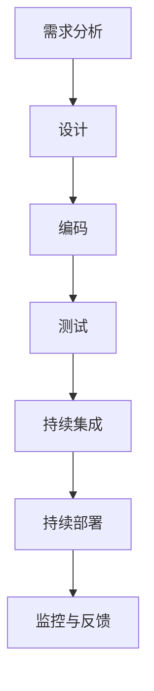

                 


### 引言

在当今数字化时代，大型应用的开发和运营已经成为企业竞争的核心。随着应用规模和复杂性的不断增加，如何确保应用的稳定性成为一个关键问题。本文将围绕“需求与持续部署的协调：确保大型应用的稳定性”这一主题，深入探讨如何通过有效协调需求分析和持续部署过程，确保大型应用的稳定性和可靠性。

本文的目标读者是那些关注软件工程、软件开发、系统架构等领域的技术专业人士。本文旨在提供一种系统性、逻辑性的思路，帮助读者理解需求与持续部署之间的关系，掌握确保大型应用稳定性的关键方法和技巧。

### 第1章 核心概念与联系

在深入探讨需求与持续部署的协调之前，首先需要明确这两个概念及其相互关系。

#### 1.1 需求与持续部署基础

**需求：** 需求是指用户或系统对软件产品或服务的要求。在软件开发过程中，需求可以分为功能需求和非功能需求。

- **功能需求：** 指软件系统应提供哪些功能，如用户登录、数据查询、文件上传等。
- **非功能需求：** 指软件系统应满足的约束条件，如性能、可靠性、安全性等。

**持续部署：** 持续部署是一种通过自动化流程实现软件的快速迭代和发布的实践方法。其核心目标是通过自动化减少手动操作，加快开发周期，提高软件交付质量。

#### 1.2 需求与持续部署的架构

为了更好地理解需求与持续部署之间的关系，我们可以使用Mermaid流程图来展示需求分析与持续部署的过程及其架构。



在上述架构中，需求分析是整个过程的起点，通过收集和分析用户需求，明确软件系统的功能和性能要求。设计、编码和测试则是软件开发的核心环节，其中测试包括单元测试、集成测试和性能测试等。持续集成和持续部署则通过自动化工具和流程实现软件的持续迭代和发布。监控与反馈环节则确保在软件运行过程中及时发现和解决问题。

### 第2章 需求分析

需求分析是软件开发过程中的关键环节，其目标是准确理解用户需求，并将其转化为可执行的软件需求规格说明。

#### 2.1 需求分析流程

**2.1.1 用户需求收集**

用户需求的收集是需求分析的第一步，其目的是从用户的角度出发，获取对软件系统的期望和需求。以下是一个简单的用户需求收集流程：

1. **需求调研：** 通过与用户进行面对面交流、问卷调查、用户访谈等方式，了解用户的需求和痛点。
2. **需求分类：** 将收集到的需求分为功能需求和非功能需求，并对其进行初步筛选和整理。
3. **需求文档编写：** 将整理后的需求编写成需求文档，包括需求描述、优先级、约束条件等。

以下是一个伪代码示例，用于说明用户需求收集的过程：

```python
def collect_user_needs():
    # 创建需求列表
    needs = []
    # 调研用户需求
    for user in users:
        user_needs = user.get_needs()
        needs.extend(user_needs)
    # 分类需求
    functional_needs, non_functional_needs = classify_needs(needs)
    # 编写需求文档
    document = create_document(functional_needs, non_functional_needs)
    return document
```

**2.1.2 需求分类与整理**

在需求收集完成后，需要对需求进行分类和整理，以便于后续的开发和测试工作。以下是一个简单的需求分类和整理流程：

1. **功能需求分类：** 根据需求的特性，将其分为不同的功能模块，如用户管理、数据查询、文件上传等。
2. **非功能需求分类：** 根据需求的约束条件，将其分为不同的类别，如性能、可靠性、安全性等。
3. **需求排序：** 根据需求的优先级和重要程度，对需求进行排序，以便于后续的开发和测试工作。

以下是一个伪代码示例，用于说明需求分类和整理的过程：

```python
def classify_and_organize_needs(needs):
    functional_needs = []
    non_functional_needs = []
    for need in needs:
        if is_functional(need):
            functional_needs.append(need)
        else:
            non_functional_needs.append(need)
    return functional_needs, non_functional_needs

def organize_needs(functional_needs, non_functional_needs):
    sorted_functional_needs = sort_by_priority(functional_needs)
    sorted_non_functional_needs = sort_by_priority(non_functional_needs)
    return sorted_functional_needs, sorted_non_functional_needs
```

### 第3章 持续集成

持续集成（Continuous Integration，简称CI）是一种软件开发实践，旨在通过自动化流程，将开发人员的代码定期集成到主干分支，并立即运行测试，以确保代码的完整性和一致性。

#### 3.1 持续集成原理

持续集成的核心原理可以概括为以下几点：

1. **定期集成：** 开发人员的代码定期（如每天或每周）集成到主干分支。
2. **自动化测试：** 集成过程中，系统会自动运行一系列预定义的测试，包括单元测试、集成测试和性能测试等。
3. **即时反馈：** 测试结果会即时反馈给开发人员，以便他们快速发现问题并进行修复。

#### 3.2 持续集成实践

持续集成的实施可以分为以下几个步骤：

1. **环境搭建：** 搭建持续集成环境，包括代码仓库、构建服务器和测试工具等。
2. **代码仓库配置：** 将代码仓库与持续集成工具集成，如Jenkins、GitLab CI等。
3. **构建脚本编写：** 编写构建脚本，定义代码集成的过程，包括代码下载、构建、测试等。
4. **测试脚本编写：** 编写测试脚本，定义测试的过程，包括单元测试、集成测试和性能测试等。
5. **结果分析：** 分析测试结果，及时发现问题并进行修复。

以下是一个使用Jenkins实现持续集成的示例：

```bash
# 安装Jenkins
sudo apt-get update && sudo apt-get install jenkins

# 配置Jenkins
wget -q -O - https://www.jenkins.io/release/latest/download | sudo tar xz -C /var/lib/jenkins --strip-components=1
sudo systemctl start jenkins

# 配置Jenkins项目
# 1. 创建Jenkins项目
# 2. 配置源代码管理，选择Git
# 3. 配置构建触发器，选择“构建触发器”，并选择“定时构建”
# 4. 编写构建脚本，包括以下步骤：
#    - 检出代码
#    - 执行单元测试
#    - 构建并打包
#    - 部署到测试环境
```

### 第4章 持续部署

持续部署（Continuous Deployment，简称CD）是一种自动化软件交付流程，旨在通过自动化工具和流程，将代码更改从开发环境中快速、安全地部署到生产环境中。

#### 4.1 持续部署策略

持续部署的核心策略是通过自动化减少人工干预，加快交付速度，提高交付质量。以下是一些常见的持续部署策略：

1. **蓝绿部署：** 同时运行两个相同的环境（如生产环境和蓝环境），将新代码部署到蓝环境，然后通过监控和测试验证新代码的稳定性，最后切换到蓝环境。
2. **灰度部署：** 将新代码部署到一部分用户，通过监控和反馈，逐步扩大部署范围，确保新代码的稳定性。
3. **滚动部署：** 在生产环境中逐步部署新代码，每次部署一小部分实例，确保系统的高可用性。

以下是一个伪代码示例，用于实现蓝绿部署：

```python
def blue_green_deployment():
    # 启动新版本（绿色）
    start_new_version()
    # 监控新版本性能
    monitor_new_version()
    # 如果性能达标，切换为主版本
    if performance_is_good():
        switch_to_main_version()
```

#### 4.2 持续部署技术

持续部署的实现依赖于一系列自动化工具和流程。以下是一些常用的持续部署技术：

1. **容器化：** 使用Docker等容器化技术，将应用程序及其依赖环境打包成一个独立的容器，确保在不同环境中的一致性。
2. **自动化脚本：** 编写自动化脚本，实现部署流程的自动化，包括代码下载、构建、部署等。
3. **部署平台：** 使用部署平台，如Kubernetes等，实现大规模的自动化部署和管理。

以下是一个使用Docker和Kubernetes实现持续部署的示例：

```yaml
# Dockerfile
FROM python:3.8
WORKDIR /app
COPY . .
RUN pip install -r requirements.txt
CMD ["python", "app.py"]

# Kubernetes部署文件
apiVersion: apps/v1
kind: Deployment
metadata:
  name: my-app
spec:
  replicas: 3
  selector:
    matchLabels:
      app: my-app
  template:
    metadata:
      labels:
        app: my-app
    spec:
      containers:
      - name: my-app
        image: my-app:latest
        ports:
        - containerPort: 80
```

### 第5章 稳定性与故障处理

在大型应用的开发和运营过程中，确保应用的稳定性至关重要。以下是一些关键策略和工具，用于维护大型应用的稳定性并处理故障。

#### 5.1 稳定性策略

1. **性能优化：** 对应用程序进行性能优化，包括数据库查询优化、缓存策略、负载均衡等。
2. **容错设计：** 设计具有容错能力的系统，确保在单个组件或服务出现故障时，系统仍能正常运行。
3. **监控与预警：** 实施全面的监控和预警系统，及时发现和解决问题。

#### 5.2 故障处理策略

1. **故障定位：** 快速定位故障点，使用日志分析、性能监控等工具，找出故障原因。
2. **故障处理：** 根据故障类型和影响范围，制定相应的故障处理方案，包括临时修复、升级补丁、更换硬件等。
3. **故障恢复：** 在故障处理后，确保系统恢复正常运行，并进行故障总结和经验分享。

#### 5.3 故障处理工具

1. **日志分析工具：** 如ELK（Elasticsearch、Logstash、Kibana）堆栈，用于收集、存储和可视化日志数据。
2. **性能监控工具：** 如Prometheus、Grafana等，用于实时监控系统的性能指标和资源使用情况。
3. **故障处理平台：** 如PagerDuty、Opsgenie等，用于通知和协调故障处理团队。

### 第6章 实际案例研究

以下是一个大型电商应用的持续集成和持续部署实际案例研究：

#### 案例背景

一家大型电商平台正在经历快速的增长期，需要确保其系统的稳定性和可靠性。为了实现这一目标，该平台决定采用持续集成和持续部署实践。

#### 案例步骤

1. **需求分析：** 通过与业务团队和开发团队的合作，明确平台的业务需求和技术要求。
2. **环境搭建：** 搭建持续集成和持续部署环境，包括代码仓库、构建服务器、测试服务器、部署服务器等。
3. **持续集成：** 使用Jenkins实现持续集成，将开发人员的代码定期集成到主干分支，并运行一系列测试。
4. **持续部署：** 使用Docker和Kubernetes实现持续部署，将经过测试的代码部署到生产环境。
5. **监控与预警：** 实施全面的监控和预警系统，确保及时发现和解决问题。

#### 案例效果

通过持续集成和持续部署实践，该电商平台实现了以下效果：

1. **交付速度：** 系统的交付速度显著提高，从原来的几周缩短到几天。
2. **稳定性：** 系统的稳定性显著提高，故障率明显降低。
3. **开发效率：** 开发团队的效率得到提升，可以将更多精力投入到新功能的开发上。

### 第7章 总结与展望

本文围绕“需求与持续部署的协调：确保大型应用的稳定性”这一主题，深入探讨了需求分析与持续部署之间的关系，以及如何通过有效协调这两个过程，确保大型应用的稳定性和可靠性。

本文总结了以下关键点：

1. **需求分析与持续部署的关系：** 需求分析是持续部署的前提，持续部署是需求分析的结果。
2. **核心概念与联系：** 明确需求、持续集成、持续部署等核心概念，并使用Mermaid流程图展示其架构。
3. **需求分析流程：** 详细讲解了需求分析的方法和步骤。
4. **持续集成与持续部署：** 介绍了持续集成和持续部署的原理、策略和技术。
5. **稳定性与故障处理：** 讨论了大型应用稳定性的重要性，以及故障处理的策略和工具。

展望未来，随着技术的不断进步和业务需求的日益复杂，需求与持续部署的协调将变得更加重要。未来可能的发展趋势包括：

1. **智能化：** 引入人工智能技术，实现更智能的需求分析和自动化部署。
2. **自动化：** 进一步提高自动化水平，减少人工干预，提高交付效率。
3. **云计算：** 充分利用云计算的优势，实现大规模、高可用性的持续集成和持续部署。

最后，感谢读者对本文的关注，希望本文能对您在大型应用开发与运营过程中提供一些有益的启示。作者：AI天才研究院/AI Genius Institute & 禅与计算机程序设计艺术 /Zen And The Art of Computer Programming

