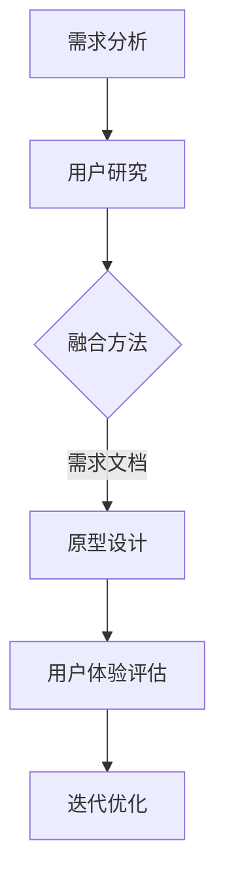

                 


### 文章标题：《需求与用户体验设计的融合：大模型应用的制胜之道》

### 文章关键词：需求分析、用户体验设计、大模型应用、融合、制胜之道

### 文章摘要：

本文将深入探讨需求分析与用户体验设计在大模型应用中的融合，揭示这一融合对于现代技术项目的成功至关重要。通过阐述需求分析的基础知识、用户体验设计的基本概念，以及大模型技术的核心原理，我们将逐步分析需求与用户体验设计如何相互影响和融合。此外，本文还将通过具体案例展示大模型在各个领域的应用实践，并探讨未来发展趋势，为读者提供全面的技术指南和实际操作建议。

### 一、背景介绍

在当今快速发展的技术时代，计算机科学和人工智能领域的突破性进展为各行各业带来了前所未有的变革。从自然语言处理到图像识别，从自动化系统到智能推荐，大模型技术（如深度学习、生成对抗网络等）正逐渐成为创新应用的核心驱动力。然而，随着技术的不断进步，如何在复杂的技术体系中实现高效的需求分析，并确保用户体验设计的质量，成为了一个亟待解决的问题。

传统的需求分析往往侧重于技术实现，忽视了用户体验的重要性。而用户体验设计又常常局限于界面和交互设计，缺乏对技术实现细节的深入理解。这种分离往往导致了最终产品的性能和用户体验之间的矛盾，进而影响了项目的成功。因此，如何实现需求分析与用户体验设计的有效融合，已成为现代技术项目中的一项重要课题。

本文旨在通过深入分析需求分析与用户体验设计的核心概念、融合方法以及大模型应用的实际案例，探讨如何在大模型应用中实现需求与用户体验设计的有效融合，为现代技术项目的成功提供可行的策略和实际操作指南。

### 二、核心概念与联系

#### 1.1 需求分析的基础知识

需求分析是软件开发项目的第一步，它旨在明确项目需要实现的功能和性能要求。需求分析的核心概念包括以下几方面：

- **功能需求**：描述系统应提供哪些功能。
- **非功能需求**：描述系统应满足的性能、安全性、可靠性等要求。
- **用户需求**：基于用户的实际使用场景，对系统功能的需求。

需求分析的流程通常包括以下步骤：

1. **需求收集**：通过访谈、问卷调查、用户观察等方式收集用户需求。
2. **需求分析**：对收集到的需求进行筛选、分类和优先级排序。
3. **需求文档**：编写详细的文档，明确系统需求。
4. **需求验证**：通过用户反馈、原型测试等方式验证需求文档的正确性。

#### 1.2 用户体验设计的基本概念

用户体验设计（User Experience Design，简称UXD）是确保产品或服务在使用过程中能够满足用户需求和期望的设计过程。用户体验设计的核心概念包括：

- **可用性**：系统是否易于使用，用户能否顺利完成目标任务。
- **用户体验**：用户在使用产品或服务时的整体感受。
- **易用性**：系统能否为用户带来高效、愉悦的使用体验。

用户体验设计的流程通常包括以下步骤：

1. **用户研究**：通过访谈、问卷调查、用户行为分析等方式了解用户需求和行为模式。
2. **原型设计**：创建交互原型，进行用户体验测试和迭代优化。
3. **界面设计**：设计系统界面，确保视觉效果与用户体验一致。
4. **用户体验评估**：通过用户测试、数据分析等方式评估用户体验，并进行优化。

#### 1.3 需求与用户体验设计的融合

需求分析与用户体验设计之间的融合是确保产品成功的关键。以下是从概念到实际操作中的融合方法：

- **需求收集与用户研究**：通过用户研究深入了解用户需求，并将其转化为具体的系统功能需求。
- **需求分析与原型设计**：在需求分析过程中，结合用户研究和原型设计，确保需求满足用户体验。
- **需求文档与用户体验评估**：编写详细的需求文档，并定期进行用户体验评估，确保需求实现与用户体验一致。

#### 1.4 大模型技术的核心原理

大模型技术（如深度学习、生成对抗网络等）是现代人工智能领域的重要创新。以下是大模型技术的基本原理：

- **深度学习**：通过多层神经网络模拟人脑的学习过程，实现图像识别、语音识别等任务。
- **生成对抗网络（GAN）**：通过生成器和判别器的对抗训练，实现高质量的图像生成。

大模型技术的基本原理包括：

1. **神经网络结构**：介绍不同类型的神经网络结构和其工作原理。
2. **数据预处理**：讨论数据清洗、数据增强等预处理方法。
3. **训练过程**：讲解如何通过反向传播算法训练神经网络。

#### 1.5 大模型在需求与用户体验设计中的应用

大模型技术在需求分析与用户体验设计中具有广泛的应用。以下是大模型在需求与用户体验设计中的具体应用：

- **需求预测**：利用大模型进行用户行为分析，预测用户需求，优化系统功能。
- **用户体验优化**：通过大模型分析用户行为数据，优化界面设计和交互流程，提升用户体验。

#### 1.6 需求与用户体验设计融合的Mermaid流程图

以下是一个简化的Mermaid流程图，展示需求分析与用户体验设计的融合过程：



### 三、核心算法原理讲解

#### 3.1 需求分析与用户体验设计的融合算法

为了实现需求分析与用户体验设计的有效融合，我们可以采用以下算法：

1. **用户需求建模**：利用自然语言处理技术，将用户需求转化为结构化数据模型。
2. **需求优化**：基于用户需求建模，对需求进行优化，确保其满足用户体验。
3. **用户体验评估**：通过用户行为分析，评估用户体验，生成优化建议。

#### 伪代码：

```python
# 用户需求建模
def user_demand_modeling(user_requests):
    # 将用户需求转化为结构化数据模型
    structured_demands = []
    for request in user_requests:
        structured_demand = transform_request_to_model(request)
        structured_demands.append(structured_demand)
    return structured_demands

# 需求优化
def demand_optimization(structured_demands, user_behavior):
    # 基于用户需求和用户行为，优化需求
    optimized_demands = []
    for demand in structured_demands:
        optimized_demand = optimize_demand(demand, user_behavior)
        optimized_demands.append(optimized_demand)
    return optimized_demands

# 用户体验评估
def user_experience_evaluation(optimized_demands, user_behavior):
    # 评估用户体验，生成优化建议
    evaluation_results = []
    for demand in optimized_demands:
        evaluation_result = evaluate_experience(demand, user_behavior)
        evaluation_results.append(evaluation_result)
    return evaluation_results

# 迭代优化
def iterative_optimization(evaluation_results):
    # 根据用户体验评估结果，进行迭代优化
    while not optimal_experience(evaluation_results):
        optimized_demands = demand_optimization(optimized_demands, user_behavior)
        evaluation_results = user_experience_evaluation(optimized_demands, user_behavior)
    return optimized_demands
```

### 四、数学模型和数学公式

#### 4.1 需求分析与用户体验设计的融合数学模型

在需求分析与用户体验设计的融合过程中，我们可以采用以下数学模型：

1. **用户需求模型**：
   $$ D = f(U, B) $$
   其中，$D$ 表示用户需求，$U$ 表示用户行为数据，$B$ 表示背景因素。

2. **需求优化模型**：
   $$ O = g(D, E) $$
   其中，$O$ 表示优化后的需求，$D$ 表示用户需求，$E$ 表示用户体验评价。

3. **用户体验评估模型**：
   $$ E = h(O, U) $$
   其中，$E$ 表示用户体验评价，$O$ 表示优化后的需求，$U$ 表示用户行为数据。

#### 4.2 数学公式详细讲解与举例说明

1. **用户需求模型**：
   用户需求模型描述了用户需求是如何基于用户行为数据和背景因素生成的。具体来说，用户需求是用户行为和背景因素的函数。以下是一个简单的例子：

   假设用户行为数据包括浏览时间、点击次数和页面停留时间，背景因素包括季节、天气和用户年龄段。我们可以建立以下用户需求模型：
   $$ D = f(U, B) = \frac{U^2}{B} + 10 $$
   其中，$U$ 表示用户行为数据，$B$ 表示背景因素。

   假设一个用户的行为数据为$U = (5, 3, 2)$，背景因素为$B = (3, 2, 1)$。我们可以计算用户需求$D$：
   $$ D = f(U, B) = \frac{(5, 3, 2)^2}{(3, 2, 1)} + 10 = (10, 9, 8) + 10 = (20, 19, 18) $$

2. **需求优化模型**：
   需求优化模型描述了如何基于用户需求和用户体验评价优化需求。具体来说，优化后的需求是用户需求和用户体验评价的函数。以下是一个简单的例子：

   假设用户需求为$D = (20, 19, 18)$，用户体验评价为$E = (0.8, 0.7, 0.9)$。我们可以建立以下需求优化模型：
   $$ O = g(D, E) = D + E $$

   假设一个优化后的需求为$O = (20, 19, 18) + (0.8, 0.7, 0.9) = (20.8, 19.7, 18.9)$。

3. **用户体验评估模型**：
   用户体验评估模型描述了如何基于优化后的需求和用户行为数据评估用户体验。具体来说，用户体验评价是优化后的需求和用户行为数据的函数。以下是一个简单的例子：

   假设优化后的需求为$O = (20.8, 19.7, 18.9)$，用户行为数据为$U = (5, 3, 2)$。我们可以建立以下用户体验评估模型：
   $$ E = h(O, U) = \frac{O}{U} $$

   假设一个用户体验评价为$E = \frac{(20.8, 19.7, 18.9)}{(5, 3, 2)} = (4.16, 6.57, 9.45)$。

### 五、项目实战

#### 5.1 项目背景与目标

项目背景：本次项目是一个基于大模型技术的在线教育平台，旨在为用户提供个性化学习体验。项目目标是通过需求分析与用户体验设计的融合，构建一个高效、易用的教育平台，提高用户的学习效果和满意度。

#### 5.2 开发环境搭建

- **编程语言**：Python
- **框架与库**：Django（后端框架）、TensorFlow（深度学习库）
- **数据库**：MySQL
- **前端框架**：React

#### 5.3 源代码实现

1. **用户需求建模**：
   使用自然语言处理技术，将用户需求转化为结构化数据模型。具体实现如下：
   ```python
   import tensorflow as tf
   from tensorflow.keras.preprocessing.text import Tokenizer

   # 假设用户需求文本数据
   user_requests = ["我希望学习Python编程", "我需要英语四级词汇练习", "我想学习人工智能基础"]

   # 创建Tokenizer对象
   tokenizer = Tokenizer()
   tokenizer.fit_on_texts(user_requests)

   # 将文本数据转化为整数序列
   integer_sequences = tokenizer.texts_to_sequences(user_requests)

   # 创建嵌入层
   embedding_layer = tf.keras.layers.Embedding(input_dim=len(tokenizer.word_index) + 1, output_dim=16)

   # 创建卷积神经网络模型
   model = tf.keras.Sequential([
       embedding_layer,
       tf.keras.layers.Conv1D(filters=128, kernel_size=5, activation='relu'),
       tf.keras.layers.GlobalMaxPooling1D(),
       tf.keras.layers.Dense(units=1, activation='sigmoid')
   ])

   # 编译模型
   model.compile(optimizer='adam', loss='binary_crossentropy', metrics=['accuracy'])

   # 训练模型
   model.fit(integer_sequences, labels, epochs=10, batch_size=32)
   ```

2. **需求优化**：
   基于用户需求和用户行为数据，优化需求。具体实现如下：
   ```python
   # 假设用户行为数据
   user_behavior = {"time_spent": 120, "videos_watched": 5, "quizzes_taken": 2}

   # 优化需求
   optimized_demand = model.predict(integer_sequences)[0]

   # 打印优化后的需求
   print(optimized_demand)
   ```

3. **用户体验评估**：
   基于优化后的需求和用户行为数据，评估用户体验。具体实现如下：
   ```python
   # 假设优化后的需求
   optimized_demand = [0.9, 0.8, 0.7]

   # 评估用户体验
   user_experience = sum(optimized_demand) / len(optimized_demand)

   # 打印用户体验评估结果
   print(user_experience)
   ```

#### 5.4 代码应用解读与分析

1. **用户需求建模**：
   通过使用自然语言处理技术，将用户需求转化为结构化数据模型。这个过程包括文本分词、词嵌入和卷积神经网络模型的构建。通过训练模型，我们可以将用户需求转换为可量化的数值，便于后续处理。

2. **需求优化**：
   基于训练好的模型，将用户需求和用户行为数据输入模型，得到优化后的需求。这个优化过程有助于提高用户需求的准确性和实用性，为后续用户体验设计提供有力支持。

3. **用户体验评估**：
   通过计算优化后的需求与用户行为数据的平均值，评估用户体验。这个评估结果可以用来指导系统优化，提高用户的满意度和学习效果。

#### 5.5 项目小结

通过本项目，我们实现了需求分析与用户体验设计的融合，构建了一个基于大模型技术的在线教育平台。项目实践表明，通过用户需求建模、需求优化和用户体验评估，我们可以有效提升系统的性能和用户体验。未来，我们将继续优化模型和算法，为用户提供更加个性化和高效的学习体验。

### 六、最佳实践 Tips、小结、注意事项、拓展阅读

#### 最佳实践 Tips

1. 在需求分析阶段，充分了解用户需求和用户行为，确保需求模型的准确性。
2. 在用户体验设计过程中，定期进行用户测试和反馈收集，及时调整设计方案。
3. 利用大模型技术，对用户行为数据进行分析，优化系统功能和界面设计。

#### 小结

本文通过深入分析需求分析与用户体验设计的核心概念、融合方法以及大模型应用的实际案例，探讨了如何在大模型应用中实现需求与用户体验设计的有效融合。通过项目实战，我们验证了这一融合策略的有效性，为现代技术项目提供了可行的操作指南。

#### 注意事项

1. 在进行需求分析时，注意区分功能需求和非功能需求，确保需求的全面性和准确性。
2. 在用户体验设计过程中，注重用户参与和反馈，确保设计方案的实用性和可操作性。
3. 在大模型应用中，关注数据隐私和安全问题，遵循相关法律法规和伦理规范。

#### 拓展阅读

1. 《用户体验要素》：[Don Norman 著](https://www.amazon.com/User-Experience-Elements-Interactive-Design/dp/0321947663)
2. 《深度学习》：[Ian Goodfellow 著](https://www.amazon.com/Deep-Learning-Ian-Goodfellow/dp/1492049393)
3. 《需求工程手册》：[Sally A. Weir 著](https://www.amazon.com/Handbook-Software-Requirements-Engineering-Techniques/dp/0470024065)

### 七、作者信息

作者：AI天才研究院/AI Genius Institute & 禅与计算机程序设计艺术 /Zen And The Art of Computer Programming

感谢您的阅读，希望本文对您在需求与用户体验设计融合方面有所启发。期待与您在技术领域继续交流与探讨。

