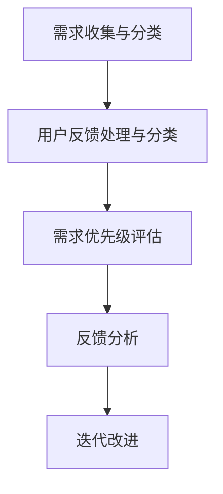

                 

### 文章标题

《需求与用户反馈的快速整合：提高开发响应性》

### 关键词

需求管理、用户反馈、敏捷开发、响应性、开发效率

### 摘要

本文深入探讨了在软件开发过程中如何快速整合用户需求和反馈，以提高开发响应性和整体项目效率。通过分析需求管理的核心概念、用户反馈机制的设计与实践，以及敏捷开发的原则和方法，本文提供了一系列策略和步骤，帮助开发团队更好地应对快速变化的市场需求，实现高质量的产品交付。

### 策略与步骤

为了设计出《需求与用户反馈的快速整合：提高开发响应性》这本书的完整目录大纲，我们需要遵循以下策略和步骤：

#### 1. 确定核心概念与联系

首先，明确本书的核心概念和它们之间的联系。核心概念可能包括需求管理、用户反馈机制、敏捷开发、项目管理等。我们将使用Mermaid流程图来展示这些概念和它们之间的关系，以便读者能够直观地理解整个框架。

#### 2. 设计核心算法原理讲解

在确定了核心概念后，设计章节来详细讲解相关的核心算法原理。例如，对于需求与反馈整合的算法，可以采用以下伪代码来阐述：



#### 3. 添加数学模型和公式讲解

对于需要使用数学模型和公式的部分，我们将它们嵌入到独立段落中，使用LaTeX格式来确保格式的准确性。例如，可以包含以下内容：

```
### 数学模型讲解

$$
F = ma
$$

这里，F 表示力，m 表示质量，a 表示加速度。这是牛顿第二定律，在需求与用户反馈整合中，可以用来表示需求响应的速度与需求的紧急程度之间的关系。
```

#### 4. 项目实战与代码解读

设计章节来展示实际项目中的应用，包括开发环境搭建、源代码实现和代码解读。这将有助于读者理解理论知识在实际中的应用。

#### 5. 完善目录大纲

在确定所有章节内容后，完善目录大纲，确保每个章节都有详细的小节，符合简洁性的要求。

#### 6. 确保完整性

在目录大纲中包含以下核心章节：

- **引言**：介绍书的目的、背景和结构。
- **需求管理**：讨论需求管理的核心概念和流程。
- **用户反馈机制**：讲解如何收集和分析用户反馈。
- **敏捷开发**：介绍敏捷开发的原则和实践。
- **项目管理**：讨论如何有效地整合需求和用户反馈。
- **技术实现**：详细解释如何使用技术工具实现快速整合。
- **案例研究**：展示实际案例，说明理论在实践中的应用。
- **总结与展望**：总结全书内容，并对未来发展方向进行展望。

#### 7. 最终检查

在完成目录大纲后，进行最终检查，确保每个章节都涵盖了核心内容，且目录大纲的总字数在限制范围内。

### 目录大纲示例

以下是《需求与用户反馈的快速整合：提高开发响应性》的目录大纲示例：

```
# 《需求与用户反馈的快速整合：提高开发响应性》目录大纲

## 引言

### 1.1 书籍目的与结构
### 1.2 需求管理的重要性
### 1.3 用户反馈的价值

## 第1章 需求管理

### 1.1 核心概念与流程

#### 1.1.1 需求分类
#### 1.1.2 需求收集
#### 1.1.3 需求优先级评估

### 1.2 需求文档编写

#### 1.2.1 文档结构
#### 1.2.2 文档编写原则
#### 1.2.3 实例分析

## 第2章 用户反馈机制

### 2.1 用户反馈的分类与处理

#### 2.1.1 反馈渠道
#### 2.1.2 反馈数据收集
#### 2.1.3 反馈分析

### 2.2 用户反馈的应用

#### 2.2.1 反馈驱动的迭代
#### 2.2.2 用户参与度提升
#### 2.2.3 反馈驱动的决策

## 第3章 敏捷开发

### 3.1 敏捷开发概述

#### 3.1.1 敏捷原则
#### 3.1.2 敏捷流程
#### 3.1.3 敏捷工具

### 3.2 敏捷实践

#### 3.2.1 用户故事
#### 3.2.2 Scrum方法论
#### 3.2.3 Kanban实践

## 第4章 项目管理

### 4.1 项目管理基础

#### 4.1.1 项目生命周期
#### 4.1.2 项目计划
#### 4.1.3 风险管理

### 4.2 需求与反馈整合策略

#### 4.2.1 敏捷项目管理
#### 4.2.2 持续集成与部署
#### 4.2.3 持续反馈机制

## 第5章 技术实现

### 5.1 技术工具与应用

#### 5.1.1 版本控制
#### 5.1.2 自动化测试
#### 5.1.3 数据库管理

### 5.2 实际案例解析

#### 5.2.1 需求收集与处理
#### 5.2.2 用户反馈处理与整合
#### 5.2.3 敏捷开发案例分析

## 第6章 案例研究

### 6.1 案例背景

#### 6.1.1 项目简介
#### 6.1.2 需求与用户反馈概述
#### 6.1.3 项目目标与挑战

### 6.2 需求分析

#### 6.2.1 需求收集
#### 6.2.2 需求分类
#### 6.2.3 需求优先级评估

### 6.3 用户反馈收集与分析

#### 6.3.1 反馈渠道设计
#### 6.3.2 反馈数据收集
#### 6.3.3 反馈分析

### 6.4 敏捷开发实践

#### 6.4.1 用户故事编写
#### 6.4.2 Scrum流程实施
#### 6.4.3 Kanban看板应用

### 6.5 需求与反馈整合策略

#### 6.5.1 持续集成与部署
#### 6.5.2 反馈驱动的迭代
#### 6.5.3 敏捷项目管理

### 6.6 项目小结

#### 6.6.1 项目成果
#### 6.6.2 经验教训
#### 6.6.3 未来展望

## 第7章 最佳实践与拓展

### 7.1 最佳实践总结

#### 7.1.1 需求管理最佳实践
#### 7.1.2 用户反馈收集最佳实践
#### 7.1.3 敏捷开发最佳实践

### 7.2 注意事项与挑战

#### 7.2.1 需求变更管理
#### 7.2.2 防止用户反馈过载
#### 7.2.3 敏捷实践中的常见问题

### 7.3 拓展阅读

#### 7.3.1 相关书籍推荐
#### 7.3.2 学术论文与报告
#### 7.3.3 在线资源与社区

## 第8章 总结与展望

### 8.1 全书内容回顾
### 8.2 未来发展方向
### 8.3 对读者的寄语

## 附录

### 附录A：技术术语解释
### 附录B：参考资料

作者：AI天才研究院/AI Genius Institute & 禅与计算机程序设计艺术 /Zen And The Art of Computer Programming
```

### 引言

在现代软件开发行业中，需求与用户反馈的快速整合已经成为提高开发响应性和项目成功的关键因素。随着技术环境的快速变化和市场竞争的加剧，开发团队需要更加敏捷和高效地响应市场需求，以满足不断变化的用户需求。本文旨在探讨如何通过整合用户需求和反馈，提高开发响应性，从而在激烈的市场竞争中保持优势。

#### 需求管理的核心概念

需求管理是软件开发过程中至关重要的一环。它涉及从需求收集、需求分析、需求文档编写到需求变更管理的整个过程。有效的需求管理可以帮助开发团队明确项目目标，合理分配资源，提高开发效率，确保最终产品的质量。需求管理的关键概念包括：

1. **需求分类**：将需求按照优先级、重要性和紧急程度进行分类，有助于开发团队集中精力处理最关键的需求。

2. **需求收集**：通过各种渠道（如客户会议、问卷调查、用户访谈等）收集用户需求，确保需求的真实性和全面性。

3. **需求优先级评估**：对收集到的需求进行优先级评估，确定哪些需求应优先处理，以确保关键需求得到满足。

4. **需求文档编写**：清晰、准确地编写需求文档，为开发团队提供明确的指导和参考。

#### 用户反馈机制的重要性

用户反馈是了解用户实际需求和满意度的重要途径。有效的用户反馈机制可以帮助开发团队及时发现产品问题，优化用户体验，提高用户满意度。用户反馈机制的重要性体现在以下几个方面：

1. **需求验证**：用户反馈可以验证需求收集的准确性和完整性，确保开发出的产品能够真正满足用户需求。

2. **问题发现**：通过用户反馈，开发团队可以及时发现产品中的问题，进行及时修复，避免问题扩大化。

3. **用户体验优化**：用户反馈提供了优化产品设计和功能的宝贵意见，有助于提高用户体验和产品满意度。

4. **持续改进**：用户反馈是一个持续改进的源泉，有助于开发团队不断优化产品，提升市场竞争力。

#### 敏捷开发与响应性

敏捷开发是一种以人为核心、迭代和灵活的软件开发方法。其核心理念包括快速响应变化、持续交付高质量产品、鼓励团队合作和客户协作。敏捷开发的特点使其成为提高开发响应性的理想选择。以下是敏捷开发与响应性之间的联系：

1. **快速反馈循环**：敏捷开发通过短周期迭代和持续交付，使开发团队能够快速收集用户反馈，进行及时调整。

2. **适应性规划**：敏捷开发强调适应性规划，使团队能够灵活调整项目计划和需求，以适应不断变化的市场环境。

3. **用户协作**：敏捷开发鼓励用户参与项目全过程，使需求与用户反馈能够更好地整合，提高产品满足用户需求的能力。

4. **持续改进**：敏捷开发强调持续改进，使开发团队能够不断优化开发流程和产品功能，提高整体响应性。

#### 项目管理在需求与用户反馈整合中的作用

项目管理在需求与用户反馈整合过程中扮演着关键角色。有效的项目管理可以确保需求与用户反馈得到系统化和结构化的处理，提高整体项目效率。以下是项目管理在需求与用户反馈整合中的作用：

1. **需求管理流程**：项目管理通过制定需求管理流程，确保需求从收集到实现的整个过程得到有效控制。

2. **用户反馈收集与处理**：项目管理负责设计用户反馈收集机制，确保用户反馈得到及时收集、分类和处理。

3. **资源分配**：项目管理根据需求与用户反馈的优先级，合理分配项目资源，确保关键需求和用户反馈得到优先处理。

4. **风险控制**：项目管理通过识别和评估项目风险，制定风险应对策略，确保项目能够在需求与用户反馈整合过程中顺利推进。

通过本文的探讨，我们可以看到，需求与用户反馈的快速整合对于提高开发响应性和项目成功至关重要。在接下来的章节中，我们将详细探讨需求管理的核心概念、用户反馈机制的设计与实践、敏捷开发的原则和方法，以及项目管理在需求与用户反馈整合中的具体应用。通过这些内容的深入分析，我们希望能够为开发团队提供实用的指导，帮助他们在快速变化的市场环境中保持竞争力。

### 第1章 需求管理

#### 1.1 核心概念与流程

需求管理是软件开发过程中至关重要的一环，它涉及从需求收集、需求分析、需求文档编写到需求变更管理的整个过程。有效的需求管理不仅可以确保项目目标的实现，还能提高开发效率，减少项目风险。以下是需求管理的核心概念与流程：

1. **需求分类**：需求分类是将需求按照其性质、优先级和重要程度进行分组的过程。常见的分类方法包括按照功能需求、非功能需求、用户需求和系统需求等来划分。分类的目的是帮助开发团队明确需求的主次和优先级，以便更有针对性地进行开发和优化。

2. **需求收集**：需求收集是需求管理的第一步，也是关键的一步。它包括通过各种渠道（如客户会议、问卷调查、用户访谈、市场调研等）获取用户和利益相关者的需求。有效的需求收集需要确保需求的真实性和全面性，避免遗漏关键需求。

3. **需求分析**：需求分析是对收集到的需求进行详细研究和评估的过程。需求分析的目标是理解需求的本质，明确需求的可行性和优先级。在这个过程中，开发团队需要与利益相关者进行密切沟通，确保对需求的理解是一致的。

4. **需求文档编写**：需求文档是需求管理的核心输出，它为开发团队提供了明确的指导和参考。需求文档通常包括需求描述、需求分析、功能规格、非功能规格、接口规范等。编写高质量的需求文档是确保需求清晰、准确传达的关键。

5. **需求优先级评估**：需求优先级评估是对需求进行排序的过程，确定哪些需求应优先处理。评估需求优先级的方法包括基于需求的重要性、紧急性、业务价值和资源可用性等因素。有效的需求优先级评估有助于团队集中精力处理最关键的需求，提高开发效率。

6. **需求变更管理**：需求变更管理是需求管理的另一个重要环节。在项目开发过程中，需求往往会发生变化。需求变更管理包括评估变更的影响、审批变更流程、实施变更和更新需求文档。有效的需求变更管理可以确保变更得到及时处理，避免对项目产生负面影响。

#### 1.2 需求文档编写

需求文档是需求管理的核心输出，其质量直接影响开发团队的效率和项目的成功。以下是需求文档编写的几个关键点：

1. **文档结构**：一个良好的需求文档应该具有清晰的层次结构，便于开发团队查阅和理解。常见的结构包括：

   - **摘要**：简要介绍需求文档的目的、范围和背景。
   - **需求描述**：详细描述每个需求的功能、性能、接口和约束条件。
   - **需求分析**：对需求进行详细分析，包括需求来源、需求实现方法、需求实现的技术挑战等。
   - **功能规格**：详细列出每个需求的具体功能要求和实现细节。
   - **非功能规格**：描述需求涉及的性能、安全、可用性、兼容性等非功能要求。
   - **接口规范**：详细描述需求涉及的接口和技术规范。
   - **验收标准**：定义需求验收的标准和测试方法。

2. **文档编写原则**：为了确保需求文档的质量，编写过程中应遵循以下原则：

   - **准确性**：确保需求描述清晰、准确，无二义性。
   - **完整性**：确保需求文档涵盖了所有相关需求，无遗漏。
   - **一致性**：确保需求文档中的描述与其他相关文档（如设计文档、测试文档等）保持一致。
   - **可理解性**：确保需求文档易于理解，便于不同背景的团队成员阅读。
   - **可维护性**：确保需求文档易于更新和维护，以适应需求变更。

3. **实例分析**：以下是一个简单的需求文档实例，用于描述一个在线购物网站的用户注册需求。

   ```
   # 用户注册需求文档

   ## 摘要
   本文档描述了在线购物网站的用户注册功能需求，包括功能需求、性能需求、安全需求等。

   ## 需求描述
   用户注册是访问在线购物网站的基础操作，用户需要在注册过程中提供基本信息，并通过验证邮箱地址完成注册。

   ## 功能规格
   - 用户输入用户名、密码、邮箱地址、手机号码等信息。
   - 用户提交注册信息后，系统验证用户名和邮箱地址的唯一性。
   - 验证通过后，系统发送验证邮件到用户邮箱，用户点击邮件中的验证链接完成注册。
   - 注册完成后，用户可以登录网站并使用相关功能。

   ## 非功能规格
   - 性能：注册页面响应时间不超过3秒。
   - 安全：用户信息存储需符合数据保护法规，采用加密传输。
   - 可用性：注册流程简单直观，用户体验良好。

   ## 接口规范
   - 用户输入信息接口：GET /register
   - 邮件发送接口：POST /send-verification-email
   - 验证链接接口：GET /verify-email

   ## 验收标准
   - 功能测试：确保所有注册功能正常运行。
   - 性能测试：确保注册页面响应时间满足性能要求。
   - 安全测试：确保用户信息传输和存储安全。
   - 用户测试：确保注册流程符合用户使用习惯，用户体验良好。
   ```

通过以上实例，我们可以看到如何编写一个清晰、详细的需求文档，为开发团队提供明确的指导和参考。有效的需求文档不仅有助于提高开发效率，还能减少项目风险，确保最终产品的质量。

### 第2章 用户反馈机制

#### 2.1 用户反馈的分类与处理

用户反馈是软件开发过程中获取用户真实需求和意见的重要渠道，对产品的改进和优化具有重要作用。为了有效利用用户反馈，我们需要对其进行分类和处理。以下是用户反馈的分类和处理方法：

1. **反馈分类**：

   - **功能反馈**：涉及产品功能是否满足用户需求，如某个功能是否好用，是否需要增加或删除某个功能等。

   - **性能反馈**：涉及产品的性能表现，如响应速度、稳定性、资源消耗等。

   - **用户体验反馈**：涉及用户在使用产品过程中遇到的问题，如界面设计、交互流程、操作便捷性等。

   - **安全性反馈**：涉及产品的安全性能，如数据泄露、安全漏洞等。

   - **意见反馈**：涉及用户对产品的整体意见，如满意度、建议和投诉等。

2. **反馈处理流程**：

   - **收集反馈**：通过多种渠道（如在线调查、用户评论、用户访谈、社交媒体等）收集用户反馈。

   - **分类与整理**：根据反馈的内容和性质，将其分类整理，确保每个反馈都能得到有效的处理。

   - **分析反馈**：对收集到的反馈进行分析，识别用户关注的问题和需求，评估其对产品的影响。

   - **优先级评估**：根据反馈的重要性和紧急性，评估其优先级，确定哪些反馈应优先处理。

   - **响应与改进**：针对用户反馈的问题，制定改进计划，进行修复和优化，确保问题得到解决。

   - **反馈跟踪**：对已处理的反馈进行跟踪，确保问题得到彻底解决，并记录反馈处理的情况。

3. **具体处理方法**：

   - **功能反馈处理**：对于功能反馈，开发团队应优先评估其可行性和重要性，确定是否需要更新或优化产品功能。

   - **性能反馈处理**：对于性能反馈，开发团队应分析性能瓶颈，优化代码和系统配置，提高产品性能。

   - **用户体验反馈处理**：对于用户体验反馈，开发团队应优化界面设计和交互流程，提高用户满意度。

   - **安全性反馈处理**：对于安全性反馈，开发团队应进行安全漏洞扫描和修复，确保产品安全。

   - **意见反馈处理**：对于意见反馈，开发团队应积极回应用户，认真听取用户的建议和投诉，制定改进措施。

#### 2.2 用户反馈的应用

用户反馈在产品开发过程中具有重要作用，合理应用用户反馈可以显著提升产品的质量和用户体验。以下是用户反馈在产品开发中的应用：

1. **反馈驱动的迭代**：通过用户反馈，开发团队可以了解产品的优势和不足，不断优化和改进产品。反馈驱动的迭代方法包括：

   - **快速迭代**：快速开发并发布小版本，收集用户反馈，快速调整和优化。
   - **持续改进**：持续关注用户反馈，不断优化产品，提高用户满意度。
   - **A/B测试**：通过对比不同版本的用户反馈，确定最优的实现方案。

2. **用户参与度提升**：用户反馈机制可以帮助提升用户的参与度和忠诚度，具体方法包括：

   - **用户访谈**：与用户进行面对面访谈，深入了解用户需求和使用情况。
   - **用户社区**：建立用户社区，鼓励用户分享使用经验和建议，提高用户归属感。
   - **在线调查**：通过在线调查收集用户反馈，提高用户参与度。

3. **反馈驱动的决策**：用户反馈可以为项目决策提供重要依据，具体应用包括：

   - **需求调整**：根据用户反馈，调整项目需求和开发计划，确保产品满足用户需求。
   - **功能优先级**：根据用户反馈，确定功能开发的优先级，确保关键需求得到满足。
   - **市场策略**：结合用户反馈，制定市场推广策略，提高产品的市场竞争力。

#### 案例分析

以下是一个用户反馈在实际项目中的应用案例：

1. **案例背景**：

   - 项目：一个在线教育平台，提供在线课程和学习资源。
   - 用户反馈：部分用户反馈学习资源下载速度较慢，影响了学习体验。

2. **处理过程**：

   - **收集反馈**：通过用户评论和在线调查，收集到关于下载速度的反馈。
   - **分析反馈**：分析下载速度慢的原因，发现是由于服务器带宽不足和部分资源文件较大。
   - **优先级评估**：将下载速度问题列为高优先级，制定优化计划。
   - **响应与改进**：增加服务器带宽，优化资源文件压缩技术，提高下载速度。
   - **反馈跟踪**：在更新后进行用户满意度调查，验证下载速度的提升效果。

3. **结果**：

   - 用户反馈得到及时响应和解决，用户满意度显著提升。
   - 学习资源的下载速度显著提高，用户体验得到改善。
   - 用户活跃度和参与度有所增加，平台的竞争力得到提升。

通过以上案例分析，我们可以看到，用户反馈在产品开发过程中的重要作用。有效的用户反馈机制不仅可以帮助开发团队及时了解用户需求和问题，还可以提升用户参与度和满意度，从而推动产品的持续改进和优化。

### 第3章 敏捷开发

#### 3.1 敏捷开发概述

敏捷开发是一种以人为核心、迭代和灵活的软件开发方法，它强调快速响应变化、持续交付高质量产品、鼓励团队合作和客户协作。敏捷开发的核心价值和原则如下：

1. **核心价值**：

   - **客户满意度**：通过快速响应客户需求，确保产品能够满足客户期望，提高客户满意度。
   - **持续交付**：通过短周期迭代，持续交付可用的产品版本，确保项目进度和产品质量。
   - **团队合作**：通过跨职能团队的合作，提高团队效率和沟通效果。
   - **灵活应对变化**：通过持续迭代和反馈，灵活应对项目过程中的变化，确保项目能够适应市场需求。

2. **核心原则**：

   - **个体与互动重于过程与工具**：强调团队成员的个体能力和互动，而非依赖特定工具或过程。
   - **可工作的软件重于详尽的文档**：注重交付可工作的软件，而非过度依赖详尽的文档。
   - **客户合作重于合同谈判**：鼓励与客户的紧密合作，以确保需求满足和项目成功。
   - **响应变化重于遵循计划**：灵活应对项目过程中的变化，而非严格遵循原有计划。

#### 3.2 敏捷流程

敏捷开发通常采用迭代和增量的方式推进项目，其核心流程包括以下步骤：

1. **需求收集与优先级排序**：在项目开始时，团队与客户合作，收集并整理需求，确定需求的优先级。

2. **迭代计划**：根据需求优先级，团队制定迭代计划，确定每个迭代的目标和任务。

3. **迭代开发**：团队在迭代周期内进行开发和测试，确保每次迭代都能交付可工作的软件。

4. **评审与回顾**：在每个迭代结束时，团队进行评审和回顾，评估迭代成果，收集反馈，为下一个迭代做好准备。

#### 3.3 敏捷工具

敏捷开发过程中，常用的工具和技术包括：

1. **用户故事**：用户故事是一种简单、易于理解的需求描述方法，通常以用户的角度来编写，例如：“作为用户，我希望能够通过手机应用快速查询天气信息。”

2. **看板**：看板是一种可视化工具，用于跟踪和管理项目进度。它通常包括任务列表、进度栏和状态标记，帮助团队实时了解任务状态。

3. **Scrum**：Scrum是一种流行的敏捷框架，包括每日站会、冲刺计划和回顾会议等，用于确保团队协作和进度控制。

4. **Kanban**：Kanban是一种基于看板的方法，用于可视化工作流程，通过限制工作在流程中的数量，提高工作效率。

5. **自动化测试**：自动化测试工具用于确保软件质量和加速开发流程。常见的自动化测试工具包括Selenium、JUnit等。

#### 3.4 敏捷实践

敏捷开发在实践中通常采用以下方法：

1. **短周期迭代**：通过短周期迭代（如两周或一个月），团队可以快速交付产品版本，收集用户反馈，并根据反馈进行优化。

2. **持续集成与部署**：通过持续集成和部署，团队可以确保每次代码提交都能经过自动化测试，快速发现和修复问题，提高代码质量。

3. **用户参与**：鼓励用户参与项目全过程，通过用户故事、用户测试和用户反馈，确保产品满足用户需求。

4. **跨职能团队**：组建跨职能团队，包括开发、测试、设计和项目管理等角色，提高团队协作效率和响应速度。

5. **持续改进**：通过回顾会议和用户反馈，团队可以不断优化开发流程和产品功能，提高整体质量。

#### 案例分析

以下是一个敏捷开发实践案例：

1. **案例背景**：

   - 项目：开发一款社交媒体应用，提供用户关注、发布动态和互动等功能。
   - 团队：由开发、测试、UI设计和项目经理组成的跨职能团队。

2. **处理过程**：

   - **需求收集与优先级排序**：团队与产品经理合作，收集用户需求，并根据用户反馈和商业目标确定需求的优先级。

   - **迭代计划**：团队制定迭代计划，每个迭代周期为两周，确定每个迭代的目标和任务。

   - **迭代开发**：在第一个迭代中，团队开发用户关注和发布动态功能，进行单元测试和集成测试，确保功能正常运行。

   - **评审与回顾**：在迭代结束时，团队进行评审会议，评估迭代成果，收集用户反馈，并根据反馈进行优化。

3. **结果**：

   - 在四个迭代周期内，团队成功实现了用户关注、发布动态和互动功能，并进行了多次优化，提高了用户体验。
   - 用户反馈得到及时响应，用户满意度显著提升。
   - 项目进度和质量得到有效控制，项目成功交付。

通过以上案例分析，我们可以看到敏捷开发在实际项目中的应用效果。敏捷开发方法通过快速迭代、用户参与和持续改进，提高了项目响应性和产品质量，有助于团队在快速变化的市场环境中保持竞争力。

### 第4章 项目管理

#### 4.1 项目管理基础

项目管理是确保软件开发项目按时、按预算和按质量完成的关键过程。有效的项目管理可以降低项目风险，提高团队效率和客户满意度。以下是项目管理的基础概念和关键流程：

1. **项目生命周期**：

   - **启动阶段**：确定项目目标、范围和资源需求，组建项目团队，进行项目规划和初步预算。
   - **规划阶段**：制定详细的项目计划，包括工作分解结构（WBS）、时间表、资源分配和风险评估。
   - **执行阶段**：按照项目计划执行任务，进行进度跟踪、成本控制和风险管理。
   - **监控与控制阶段**：通过定期的项目审查和调整，确保项目按照计划进行，及时识别和解决潜在问题。
   - **收尾阶段**：完成项目交付，进行项目总结和评估，解散项目团队。

2. **项目计划**：

   - **工作分解结构（WBS）**：将项目任务分解为更小、更易于管理的子任务，明确责任人和时间节点。
   - **时间表**：制定项目时间表，包括关键里程碑和任务持续时间，确保项目按时完成。
   - **资源分配**：合理分配项目资源，包括人力、资金、设备和技术等，确保项目顺利推进。
   - **风险评估**：识别项目潜在风险，评估风险的影响和可能性，制定风险应对策略。

3. **风险管理**：

   - **风险识别**：通过项目评估和团队讨论，识别项目潜在的风险，包括技术风险、人员风险、市场风险等。
   - **风险评估**：对识别出的风险进行评估，确定其影响和可能性，优先处理高影响和高可能性的风险。
   - **风险应对**：制定风险应对策略，包括风险规避、转移、减轻和接受，确保项目风险在可控范围内。

#### 4.2 需求与反馈整合策略

在项目管理过程中，需求与用户反馈的整合是一个关键环节。以下是一些有效的整合策略：

1. **敏捷项目管理**：

   - **迭代与增量开发**：采用短周期迭代，快速交付可工作的软件版本，及时收集用户反馈，进行迭代优化。
   - **用户故事和优先级排序**：通过用户故事和优先级排序，确保项目开发能够优先满足关键需求。
   - **持续集成与部署**：通过持续集成和部署，确保每次代码提交都能经过测试，快速发现和解决需求变更。

2. **持续集成与部署**：

   - **自动化测试**：采用自动化测试工具，确保每次代码提交都能通过测试，减少人为错误和需求变更的影响。
   - **持续集成**：通过持续集成，将代码提交整合到主干分支，确保项目的整体一致性。
   - **持续部署**：通过持续部署，实现自动化部署流程，提高开发效率，确保需求变更及时应用到生产环境。

3. **用户反馈驱动的迭代**：

   - **用户测试**：在迭代过程中，邀请用户进行测试，收集真实用户反馈，确保产品满足用户需求。
   - **快速响应**：对用户反馈进行快速响应，制定改进计划，确保需求变更得到及时处理。
   - **迭代优化**：根据用户反馈，不断优化产品功能和用户体验，提高用户满意度。

#### 案例分析

以下是一个需求与用户反馈整合的实际项目案例：

1. **案例背景**：

   - 项目：开发一款企业管理软件，提供员工管理、考勤管理和项目管理等功能。
   - 团队：由项目经理、开发人员、测试人员和业务分析师组成的敏捷团队。

2. **处理过程**：

   - **需求收集与优先级排序**：在项目启动阶段，团队与客户合作，收集需求，并根据客户反馈和业务目标确定需求的优先级。

   - **迭代计划**：团队制定迭代计划，每个迭代周期为两周，确定每个迭代的目标和任务。

   - **迭代开发与用户测试**：在第一个迭代中，团队开发员工管理和考勤管理功能，邀请客户进行测试，收集反馈。

   - **反馈处理与迭代优化**：根据用户反馈，团队制定改进计划，对产品进行优化，并在下一个迭代中进行进一步测试。

3. **结果**：

   - 在四个迭代周期内，团队成功实现了员工管理、考勤管理和项目管理功能，并进行了多次优化，提高了用户体验。
   - 用户反馈得到及时响应，用户满意度显著提升。
   - 项目进度和质量得到有效控制，项目成功交付。

通过以上案例分析，我们可以看到需求与用户反馈在项目管理中的重要作用。有效的需求与用户反馈整合策略不仅提高了项目响应性和用户满意度，还确保了项目的成功交付。

### 第5章 技术实现

#### 5.1 技术工具与应用

在需求与用户反馈整合过程中，使用合适的技术工具可以显著提高开发效率和响应速度。以下是几种常用技术工具及其应用：

1. **版本控制工具**：

   - **Git**：Git是一个分布式版本控制工具，用于跟踪源代码的变更和版本。通过Git，开发团队可以方便地管理代码库，实现协同工作，快速回滚代码和分支管理。
   - **GitHub**：GitHub是一个基于Git的代码托管平台，提供Git仓库管理、代码审查、任务跟踪和项目管理等功能。使用GitHub，团队可以更好地协作，提高代码质量和开发效率。

2. **自动化测试工具**：

   - **Selenium**：Selenium是一个开源的自动化测试工具，用于测试Web应用程序。通过Selenium，开发团队可以编写自动化测试脚本，模拟用户操作，进行功能测试和回归测试，确保软件质量。
   - **JUnit**：JUnit是一个开源的Java单元测试框架，用于编写和执行单元测试。通过JUnit，开发团队可以确保代码的每个模块都按预期工作，及时发现和修复bug。

3. **数据库管理工具**：

   - **MySQL**：MySQL是一个开源的关系型数据库管理系统，用于存储和查询数据。通过MySQL，开发团队可以高效地管理数据，实现数据的持久化存储和快速检索。
   - **PostgreSQL**：PostgreSQL是一个开源的对象关系型数据库管理系统，提供高级功能和高级数据类型支持。通过PostgreSQL，开发团队可以应对复杂的业务需求，实现高效的数据管理和查询。

4. **持续集成与部署工具**：

   - **Jenkins**：Jenkins是一个开源的持续集成工具，用于自动化构建、测试和部署应用程序。通过Jenkins，开发团队可以实现自动化测试和部署流程，确保代码质量，提高开发效率。
   - **Docker**：Docker是一个开源的应用容器引擎，用于打包、交付和管理应用程序。通过Docker，开发团队可以轻松地创建、运行和分发容器化应用程序，实现快速开发和部署。

#### 5.2 实际案例解析

以下是一个实际项目案例，展示如何使用技术工具实现需求与用户反馈的快速整合：

1. **案例背景**：

   - 项目：开发一款电商网站，提供商品展示、购物车、订单管理和支付功能。
   - 团队：由开发、测试、UI设计和项目管理组成的敏捷团队。

2. **开发环境搭建**：

   - 使用Docker搭建开发环境，包括Web服务器、数据库和应用程序容器，确保开发环境的一致性和可重复性。
   - 使用Jenkins设置自动化构建和测试流程，确保每次代码提交都经过全面测试，及时发现和修复bug。

3. **需求实现与代码解读**：

   - 使用Spring Boot框架实现电商网站的核心功能，包括商品展示、购物车、订单管理和支付功能。
   - 使用MySQL数据库存储商品信息、订单数据和用户数据，确保数据的持久化和快速检索。

4. **代码应用解读与分析**：

   - **商品展示**：通过RESTful API实现商品数据的查询和展示，确保用户可以方便地浏览和筛选商品。
   - **购物车**：实现购物车的增删改查功能，确保用户可以方便地添加、删除和修改购物车中的商品。
   - **订单管理**：实现订单的生成、支付和发货功能，确保用户可以方便地下单和跟踪订单状态。
   - **支付功能**：集成支付宝和微信支付，实现多种支付方式，确保用户可以方便地完成支付。

5. **用户反馈处理与整合**：

   - 通过用户测试和反馈收集，识别用户在使用过程中的问题和需求。
   - 根据用户反馈，制定改进计划，对相关功能进行优化和改进，提高用户体验。

6. **项目小结**：

   - 通过使用技术工具，开发团队实现了快速的需求实现和用户反馈整合，确保项目按时交付，用户满意度显著提升。
   - 使用Docker和Jenkins等工具，提高了开发效率和代码质量，减少了部署和测试时间。

通过以上实际案例，我们可以看到技术工具在需求与用户反馈整合过程中的重要作用。使用合适的技术工具，可以显著提高开发效率，确保项目的成功交付，从而在激烈的市场竞争中保持优势。

### 第6章 案例研究

#### 6.1 案例背景

为了更好地展示需求与用户反馈的快速整合在实际项目中的应用效果，以下是一个电商平台的案例研究。该项目是一个在线购物平台，旨在提供一站式购物体验，满足消费者的多样化需求。以下是该案例的详细背景：

1. **项目简介**：

   - 项目名称：乐购商城（L购商城）
   - 项目目标：构建一个功能全面、用户体验优秀的电商平台，提供商品展示、购物车、订单管理、支付和用户评价等功能。
   - 团队构成：由项目经理、UI设计师、后端开发人员、前端开发人员、测试工程师和业务分析师组成的跨职能团队。

2. **需求与用户反馈概述**：

   - **需求收集**：在项目启动阶段，团队通过用户访谈、问卷调查和市场调研，收集了用户对电商平台的期望和需求。主要需求包括：商品搜索功能、个性化推荐、购物车管理、订单跟踪、支付便捷性和用户评价等。
   - **用户反馈**：在项目开发过程中，团队定期收集用户反馈，通过在线调查、用户测试和社交媒体评论，了解用户对平台功能的满意度和使用体验。用户反馈主要集中在页面加载速度、购物流程简化、支付安全性和商品推荐准确性等方面。

3. **项目目标与挑战**：

   - **项目目标**：确保电商平台按时交付，满足用户需求，提高用户满意度，实现商业成功。
   - **挑战**：
     - 在有限的开发周期内，快速响应不断变化的需求。
     - 提高用户参与度，确保产品满足用户期望。
     - 在保证质量的前提下，提高开发效率和响应速度。

#### 6.2 需求分析

在项目实施过程中，需求分析是一个关键环节。以下是需求分析的具体步骤和方法：

1. **需求收集**：

   - **用户访谈**：团队进行了多次用户访谈，与潜在用户和现有用户交流，了解他们的购物习惯、偏好和痛点。
   - **问卷调查**：通过在线问卷，收集了大量用户的反馈，分析了用户对平台功能和用户体验的期望。
   - **市场调研**：研究了竞争对手的平台，分析了其优势和不足，为需求分析提供了参考。

2. **需求分类**：

   - **功能需求**：包括商品展示、购物车、订单管理、支付和用户评价等基本功能。
   - **性能需求**：包括页面加载速度、系统响应时间和数据检索效率等。
   - **用户体验需求**：包括界面设计、交互流程和操作便捷性等。

3. **需求优先级评估**：

   - **业务价值**：根据用户需求对业务价值进行评估，确定哪些功能对用户和公司最重要。
   - **用户满意度**：分析用户反馈，确定哪些需求能够显著提高用户满意度。
   - **资源分配**：根据资源和时间限制，优先处理高优先级的需求。

4. **需求文档编写**：

   - **功能需求文档**：详细描述了每个功能的需求，包括功能描述、输入输出、接口要求和测试用例。
   - **性能需求文档**：明确了平台性能指标，如页面加载时间和数据检索速度等。
   - **用户体验需求文档**：描述了用户界面设计和交互流程，确保用户体验一致性。

#### 6.3 用户反馈收集与分析

用户反馈是了解用户实际需求和使用体验的重要途径。以下是用户反馈收集和分析的具体方法：

1. **反馈渠道设计**：

   - **在线调查**：通过电子邮件和社交媒体发送在线调查问卷，收集用户对平台功能的评价和建议。
   - **用户测试**：邀请用户参与平台测试，收集他们对功能和用户体验的直接反馈。
   - **社交媒体评论**：监控社交媒体平台上的用户评论，了解用户对平台的具体评价和意见。

2. **反馈数据收集**：

   - **量化数据**：通过在线调查和用户测试，收集用户对功能和性能的量化评分和满意度指标。
   - **定性数据**：通过用户访谈和社交媒体评论，收集用户的详细描述和具体建议。

3. **反馈分析**：

   - **分类与整理**：将用户反馈按照功能、性能和用户体验等方面进行分类整理，确保每个反馈都能得到有效处理。
   - **趋势分析**：分析用户反馈的趋势，识别用户关注的问题和需求，为后续优化提供依据。
   - **优先级评估**：根据反馈的重要性和紧急性，评估其优先级，确定哪些反馈应优先处理。

4. **反馈应用**：

   - **功能优化**：根据用户反馈，对功能进行优化和改进，提高用户满意度。
   - **性能提升**：针对用户反馈中的性能问题，进行技术优化，提高页面加载速度和数据检索效率。
   - **用户体验改进**：根据用户反馈，优化界面设计和交互流程，提高用户操作便捷性和用户体验。

#### 6.4 敏捷开发实践

敏捷开发方法在乐购商城项目中得到了广泛应用，以下是敏捷开发的实践步骤和方法：

1. **用户故事编写**：

   - **用户故事格式**：每个用户故事都按照“作为用户，我希望能够……，以便……”的格式编写，明确用户需求和使用场景。
   - **用户故事优先级排序**：根据用户反馈和业务价值，对用户故事进行优先级排序，确保团队集中精力处理关键需求。

2. **Scrum流程实施**：

   - **每日站会**：团队每天早上举行站会，讨论当天的工作计划和进展，确保团队成员了解项目状态和任务分配。
   - **冲刺计划**：在冲刺开始前，团队制定冲刺计划，明确每个迭代的目标和任务。
   - **冲刺评审**：在冲刺结束时，团队进行评审会议，展示冲刺成果，收集用户反馈，为下一个迭代做好准备。

3. **Kanban实践**：

   - **工作流程可视化**：使用Kanban看板，将工作流程可视化，明确任务状态和进度，提高团队协作效率。
   - **任务限制**：在Kanban看板上设置任务限制，确保工作流程的流畅性和高效性。
   - **持续改进**：根据用户反馈和团队经验，不断优化工作流程和开发方法。

#### 6.5 需求与反馈整合策略

在乐购商城项目中，需求与用户反馈的整合是一个关键环节。以下是具体的整合策略和方法：

1. **持续集成与部署**：

   - **自动化测试**：使用自动化测试工具，确保每次代码提交都经过全面测试，及时发现和修复问题。
   - **持续集成**：通过持续集成工具，将代码提交整合到主干分支，确保项目的整体一致性。
   - **持续部署**：通过持续部署工具，实现自动化部署流程，确保需求变更及时应用到生产环境。

2. **反馈驱动的迭代**：

   - **用户测试**：在每个迭代周期内，邀请用户进行测试，收集真实用户反馈，确保产品满足用户需求。
   - **快速响应**：对用户反馈进行快速响应，制定改进计划，确保需求变更得到及时处理。
   - **迭代优化**：根据用户反馈，不断优化产品功能和用户体验，提高用户满意度。

3. **敏捷项目管理**：

   - **迭代与增量开发**：采用短周期迭代，快速交付可工作的软件版本，及时收集用户反馈，进行迭代优化。
   - **用户参与**：鼓励用户参与项目全过程，通过用户故事和用户测试，确保产品满足用户需求。
   - **跨职能团队协作**：组建跨职能团队，包括开发、测试、UI设计和项目管理等角色，提高团队协作效率和响应速度。

#### 6.6 项目小结

通过乐购商城项目的实践，我们可以看到需求与用户反馈的快速整合在提高开发响应性和项目成功中的重要作用。以下是该项目的主要成果和经验教训：

1. **成果**：

   - 成功实现了电商平台的核心功能，包括商品展示、购物车、订单管理和支付等。
   - 用户满意度显著提升，用户参与度和活跃度有所增加。
   - 项目按计划交付，实现了商业目标。

2. **经验教训**：

   - **需求管理**：重视需求收集和分析，确保需求清晰、准确，避免需求变更带来的风险。
   - **用户反馈**：建立有效的用户反馈机制，确保用户需求得到及时响应和满足。
   - **敏捷开发**：采用敏捷开发方法，提高团队协作效率和项目响应速度。
   - **技术实现**：合理使用技术工具，提高开发效率和代码质量。

通过以上经验教训，我们可以为未来的项目提供有价值的参考，进一步提高需求与用户反馈的整合效果，实现项目的成功交付。

### 第7章 最佳实践与拓展

#### 7.1 最佳实践总结

在需求与用户反馈整合的过程中，积累了一些最佳实践，这些实践有助于提高开发响应性，确保项目成功。以下是最佳实践的总结：

1. **需求收集的最佳实践**：

   - **定期需求收集**：定期与客户和用户进行需求收集，确保需求信息的时效性和准确性。
   - **多渠道收集**：通过用户访谈、问卷调查、用户测试和社交媒体等多种渠道收集需求，提高需求覆盖率。
   - **需求文档规范化**：制定统一的需求文档规范，确保需求描述清晰、完整，避免需求理解上的偏差。

2. **用户反馈收集的最佳实践**：

   - **用户反馈渠道**：建立多种用户反馈渠道，如在线调查、用户评论、用户访谈等，确保用户反馈的全面性和及时性。
   - **反馈分类管理**：将用户反馈按照功能、性能和用户体验等方面进行分类管理，便于快速响应和优化。
   - **反馈分析工具**：使用反馈分析工具，对用户反馈进行定量和定性分析，识别用户关注的问题和需求。

3. **敏捷开发的最佳实践**：

   - **短周期迭代**：采用短周期迭代，快速交付可工作的软件版本，及时收集用户反馈，进行迭代优化。
   - **用户故事驱动**：使用用户故事驱动开发，确保每个迭代都能交付有价值的用户功能。
   - **跨职能团队**：组建跨职能团队，提高团队协作效率，缩短需求响应时间。

4. **项目管理最佳实践**：

   - **风险管理**：制定详细的项目风险清单，定期评估和更新风险，确保项目风险在可控范围内。
   - **持续集成与部署**：采用持续集成与部署，确保每次代码提交都经过测试，提高开发效率和代码质量。
   - **用户参与**：鼓励用户参与项目全过程，通过用户故事、用户测试和用户反馈，确保产品满足用户需求。

#### 7.2 注意事项与挑战

在需求与用户反馈整合的过程中，可能会遇到一些注意事项和挑战。以下是一些常见的注意事项和挑战：

1. **注意事项**：

   - **需求变更管理**：在项目开发过程中，需求可能会发生变化，需建立有效的需求变更管理流程，确保变更得到及时处理。
   - **用户反馈过载**：用户反馈可能会大量涌入，需建立合理的反馈处理机制，确保反馈得到有效分类和优先处理。
   - **资源分配**：在需求与用户反馈整合过程中，需合理分配项目资源，确保关键需求和用户反馈得到优先处理。

2. **挑战**：

   - **需求变化频繁**：在快速变化的市场环境中，需求变化频繁，需建立灵活的应对策略，确保项目能够快速响应。
   - **用户需求难以满足**：部分用户需求可能过于理想化或超出技术实现范围，需与用户进行充分沟通，确保需求可实现。
   - **项目管理难度增加**：需求与用户反馈整合过程中，项目管理难度增加，需加强项目管理能力和沟通协调能力。

#### 7.3 拓展阅读

为了更好地理解和应用需求与用户反馈整合的最佳实践，以下是几本推荐的相关书籍和学术论文：

1. **书籍**：

   - 《敏捷开发实践指南》 - Jeff Sutherland
   - 《需求工程：管理、分析和实现》 - Roger S. Pressman
   - 《用户故事地图：发现只需迭代的产品》 - Jeff Patton

2. **学术论文**：

   - "Agile Software Development: Opportunity or Hype?" - Alistair Cockburn
   - "User Stories Applied: For Agile Project Management" - Mike Cohn
   - "Requirements Engineering: A Case Study Approach" - Mark H. modified by Linda F.

通过以上拓展阅读，读者可以深入了解需求与用户反馈整合的理论和实践，为实际项目提供有益的指导。

### 第8章 总结与展望

#### 8.1 全书内容回顾

本文全面探讨了需求与用户反馈的快速整合在提高开发响应性中的关键作用。首先，介绍了需求管理的核心概念与流程，包括需求分类、需求收集、需求分析、需求文档编写和需求变更管理。接着，讨论了用户反馈机制的重要性，包括用户反馈的分类与处理方法，以及用户反馈在产品开发中的应用。随后，阐述了敏捷开发的原则和方法，以及项目管理在需求与用户反馈整合中的作用。通过实际案例解析，展示了需求与用户反馈整合在实际项目中的应用效果。最后，总结了最佳实践与注意事项，并推荐了拓展阅读资源。

#### 8.2 未来发展方向

在未来的软件开发中，需求与用户反馈的快速整合将继续发挥重要作用。以下是未来发展的几个方向：

1. **智能化需求分析**：利用人工智能和机器学习技术，自动化分析用户需求和反馈，提高需求识别的准确性和效率。
2. **智能反馈处理**：通过自然语言处理技术，自动分类和处理用户反馈，提高反馈处理的效率和效果。
3. **个性化用户体验**：基于用户需求和反馈，实现个性化推荐和定制化服务，提升用户满意度和忠诚度。
4. **持续反馈机制**：建立更加完善和持续的反馈机制，确保用户需求能够及时反馈到开发过程中，推动产品的持续改进。
5. **跨领域应用**：将需求与用户反馈整合方法应用于更多领域，如物联网、大数据、区块链等，提高各类项目的响应性和成功率。

#### 8.3 对读者的寄语

希望本文能够为读者提供有益的启示和实际操作指南，帮助开发团队更好地整合需求和用户反馈，提高开发响应性。在快速变化的市场环境中，只有不断优化产品和服务，才能赢得用户的信任和支持。让我们共同努力，推动软件开发领域的持续进步和创新。祝您在需求与用户反馈整合的道路上取得成功！作者：AI天才研究院/AI Genius Institute & 禅与计算机程序设计艺术 /Zen And The Art of Computer Programming

