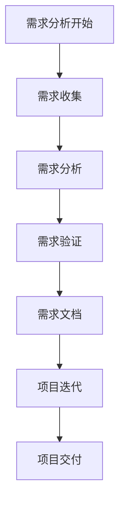

                 

### 文章关键词

需求分析，人工智能，软件开发，算法原理，数学模型，项目实战

### 文章摘要

本文旨在探讨需求分析技巧在快速捕捉AI应用核心价值中的作用。我们将从需求分析的重要性、核心概念与联系、算法原理讲解、数学模型和公式、项目实战等方面展开论述，帮助读者深入理解并掌握需求分析技巧在AI应用中的实际应用。通过本文的学习，读者将能够更好地进行需求分析，提高AI应用的开发效率和效果。

## 导言

### 需求分析在软件工程中的地位

软件开发是一个复杂的过程，包括需求分析、设计、编码、测试和维护等多个阶段。在这些阶段中，需求分析被认为是至关重要的一个环节。需求分析的定义是指识别用户需求并确保软件系统能够满足这些需求的过程。在软件开发中，需求分析的地位主要体现在以下几个方面：

1. **确定项目范围**：需求分析可以帮助项目团队明确项目的目标和范围，确保开发工作能够按照预期进行。如果需求分析不充分，可能会导致项目范围蔓延，增加开发难度和成本。

2. **指导设计和开发**：需求分析为设计和开发提供了明确的指导，使得开发人员能够按照用户需求进行系统设计和功能实现。

3. **减少返工和修改**：通过需求分析，可以提前发现潜在的问题和需求冲突，从而减少后续的返工和修改，提高开发效率。

4. **保障项目成功**：需求分析是项目成功的关键因素之一。只有准确理解和满足用户需求，才能确保软件系统能够为用户提供价值。

### 书籍概述

本书《需求分析技巧：快速捕捉AI应用的核心价值》旨在为读者提供一套全面的需求分析技巧，特别是针对AI应用的需求分析。本书的核心内容将包括以下几个方面：

1. **核心概念与联系**：介绍需求分析的基本概念，并使用Mermaid流程图展示核心概念之间的关系架构。

2. **算法原理讲解**：通过伪代码详细阐述需求分析中的核心算法原理，帮助读者理解算法的执行过程。

3. **数学模型和公式**：讲解需求分析中常用的数学模型和公式，并通过具体例子进行说明。

4. **项目实战**：通过实际案例分析和详细讲解，帮助读者将所学知识应用到实际项目中。

5. **最佳实践 tips**：提供一些实用的需求分析技巧和注意事项，以提高需求分析的效果。

通过本书的学习，读者将能够：

- 准确理解和捕捉AI应用的核心价值。
- 提高需求分析的能力，减少项目风险。
- 更好地与用户沟通，确保软件系统能够满足用户需求。
- 掌握一套实用的需求分析技巧，提升个人和团队的工作效率。

---

**Mermaid流程图示例：**

---

在接下来的章节中，我们将详细探讨需求分析的过程、AI与需求分析的结合、以及实战案例等内容。通过一步一步的分析推理，读者将能够深入理解需求分析的核心价值，并在实际工作中应用这些技巧。让我们一起进入需求分析的世界，探索其中的奥秘。

