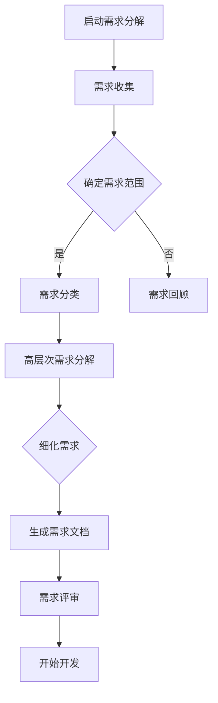
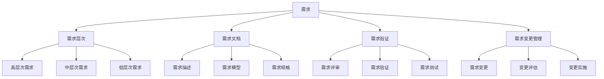

                 

### 引言

在当今快速发展的科技时代，大型应用的开发变得越来越复杂。随着系统规模的不断扩大，需求管理的难度也随之增加。如何有效地分解和管理工作量巨大的需求，成为软件开发过程中的一大挑战。为此，本文将深入探讨《需求分解技巧：让大型应用开发更易管理》这本书的主要内容，通过逻辑清晰、结构紧凑、简单易懂的论述，帮助读者理解和掌握需求分解的技巧。

### 1.1 需求分解的重要性

需求分解是软件工程中一个关键环节，它对于确保项目成功至关重要。需求分解的目的是将复杂的需求拆解成可管理的、易于理解的小部分，使得开发团队能够更有效地进行工作。以下是需求分解的重要性：

- **提高开发效率**：通过将需求分解为更小的单元，开发团队能够集中精力处理具体任务，从而提高工作效率。

- **降低风险**：需求分解有助于及早识别潜在的问题和风险，使得团队能够及时调整方向。

- **便于管理**：小而明确的需求单元使得项目进度跟踪和变更管理更加容易。

- **促进沟通**：明确的需求分解能够促进团队成员之间的沟通，减少误解和冲突。

### 1.2 大型应用开发中的需求管理挑战

大型应用开发中的需求管理面临诸多挑战：

- **需求复杂性**：大型应用通常涉及多个功能模块和众多用户需求，这使得需求管理变得异常复杂。

- **需求变更频繁**：在项目开发过程中，需求变更可能是常态，如何有效地管理和控制变更是一个重要问题。

- **跨部门协作**：大型应用开发通常涉及多个部门，如何协调各方需求，确保项目顺利进行，是一个巨大的挑战。

- **资源分配**：如何合理分配有限的开发资源，使得每个需求都能得到妥善处理，也是需求管理中的一个难点。

### 1.3 本书的目标与结构

本书的目标是帮助开发团队更好地进行需求分解，以应对大型应用开发中的挑战。全书共分为六个主要部分：

- **引言**：介绍需求分解的重要性以及本书的目标和结构。

- **需求分解的基本原理**：讨论需求分解的定义、分类和理论基础。

- **大型应用开发中的需求管理**：分析大型应用开发中的需求特点和管理挑战。

- **实践技巧**：详细介绍适用于大型应用开发的需求分解技巧。

- **工具与技术**：介绍用于需求分解的工具和技术。

- **案例分析**：通过实际案例研究，展示如何在实际项目中应用需求分解技巧。

- **结论与展望**：总结本书的主要观点，探讨未来的研究方向。

通过逐步分析上述内容，我们可以清晰地理解本书的核心内容和主题思想，为后续章节的深入探讨打下坚实的基础。

### 第1章 需求分解的基本原理

#### 1.1 需求分解的定义与分类

需求分解是软件工程中的一个关键步骤，其目的是将复杂的整体需求分解为更小、更易于管理和实现的子需求。具体来说，需求分解是将一个大型、复杂的需求划分为多个较小、具体且可执行的部分，使得每个部分都能被明确地理解和实现。

需求分解可以按照不同的维度进行分类：

- **按层次分类**：需求分解可以按照从上到下的层次进行，即从高层次的需求逐步细化到低层次的具体需求。这种分类有助于理解需求的结构和实现顺序。

- **按内容分类**：需求分解也可以根据需求的内容进行分类，如功能需求、非功能需求、性能需求等。这种分类有助于明确需求的类型和优先级。

- **按方法分类**：需求分解还可以根据采用的方法进行分类，如自顶向下、自底向上、迭代递增等。每种方法都有其特定的适用场景和优点。

#### 1.2 需求分解的理论基础

需求分解的理论基础主要来自于需求工程领域。以下是几个关键的理论和方法：

- **需求工程方法论**：需求工程方法论是一套系统化的方法和流程，用于确保需求的有效收集、分析和实现。常用的需求工程方法论包括用户故事地图、用例建模、需求验证等。

- **软件工程的需求管理理论**：软件工程的需求管理理论关注如何系统地管理需求，包括需求的获取、分析、建模、验证和变更管理。这些理论提供了框架和工具，帮助开发团队有效地处理需求。

- **架构视图**：架构视图是需求分解的重要工具，它通过不同的视角展示系统的需求，使得需求分解更加直观和全面。常见的架构视图包括功能视图、数据视图、行为视图等。

#### 1.3 需求分解的Mermaid流程图

为了更好地理解需求分解的过程，我们可以使用Mermaid流程图来展示。以下是一个简单的需求分解流程图：



这个流程图展示了从需求收集到需求分解，再到需求文档生成和需求评审的整个需求分解过程。

#### 1.4 需求分解的核心概念与联系

在需求分解过程中，有几个核心概念需要理解和掌握：

- **需求**：需求是用户对系统的期望和行为要求。它是需求分解的起点。

- **需求层次**：需求层次是指需求的不同级别，包括高层次需求、中层次需求和低层次需求。

- **需求文档**：需求文档是记录需求的具体文件，它包括需求描述、需求模型和需求规格等。

- **需求验证**：需求验证是确保需求正确性和完整性的过程，包括需求评审、需求验证和需求测试等。

- **需求变更管理**：需求变更管理是处理需求变更的过程，确保需求变更能够被有效地识别、评估和实施。

这些核心概念之间相互关联，构成了需求分解的理论基础。理解这些概念之间的联系，有助于更好地进行需求分解。

通过上述内容，我们详细介绍了需求分解的定义、分类、理论基础以及核心概念。这些知识为后续章节的深入探讨提供了坚实的基础。

### 第2章 大型应用开发中的需求管理

#### 2.1 大型应用开发的需求特点

大型应用开发的需求具有以下特点：

- **复杂性**：大型应用通常涉及多个功能模块和复杂的功能交互，这使得需求变得更加复杂。开发团队需要能够有效地处理这些复杂的需求，以确保系统的稳定性和可扩展性。

- **多样性**：大型应用的需求来源多样化，包括内部团队的需求、外部用户的需求以及监管和合规需求等。这要求需求管理必须具备高度的综合性和协调能力。

- **动态性**：大型应用的需求可能在项目开发过程中不断变化。开发团队需要具备快速响应和调整的能力，以适应需求的变化。

- **跨部门协作**：大型应用开发通常涉及多个部门，如研发、市场、运维等。如何协调各部门的需求，确保项目顺利进行，是一个重要的挑战。

- **性能和安全性要求**：大型应用往往需要满足较高的性能和安全性要求。需求管理必须考虑这些因素，以确保系统能够在预期的环境下正常运行。

#### 2.2 需求管理的流程与最佳实践

需求管理的流程主要包括以下步骤：

- **需求收集**：通过访谈、问卷调查、用户故事地图等方法收集用户需求。这一步骤是整个需求管理流程的基础。

- **需求分析**：对收集到的需求进行整理、分类和优先级排序。这一步骤的目的是明确需求的具体内容、范围和优先级。

- **需求定义**：将分析后的需求进行详细描述和定义，确保每个需求都具有明确的目标和实现方式。

- **需求验证**：通过需求评审、原型展示、用户反馈等方法验证需求的正确性和可行性。

- **需求变更管理**：在项目开发过程中，需求可能会发生变化。需求变更管理旨在确保需求变更能够被有效地识别、评估和实施。

在大型应用开发中，以下最佳实践可以帮助提高需求管理的效率和质量：

- **需求文档化**：确保所有需求都有详细的文档记录，以便后续管理和追踪。

- **建立需求基线**：在项目启动时，确定一个明确的需求基线，确保所有团队成员都了解项目的基本需求。

- **定期需求评审**：定期组织需求评审会议，审查和更新需求文档，确保需求的准确性和一致性。

- **用户参与**：鼓励用户参与需求管理过程，通过用户故事、用户反馈等方式收集用户需求，提高需求的真实性和实用性。

- **跨部门协作**：建立跨部门的需求管理团队，确保各部门的需求能够得到有效协调和整合。

#### 2.3 大型应用开发中的需求管理挑战

在大型应用开发中，需求管理面临以下挑战：

- **需求变更控制**：需求变更频繁，如何有效地控制需求变更，确保项目进度和质量，是一个重要问题。

- **需求范围定义**：如何准确定义需求范围，避免需求蔓延和范围失控，是需求管理的核心挑战之一。

- **跨部门沟通**：不同部门之间的沟通和协调困难，可能导致需求理解和实现的偏差，影响项目进度。

- **资源分配**：如何在有限的资源下，合理分配需求管理任务，确保每个需求都能得到妥善处理。

- **需求质量保证**：如何确保需求的质量，避免需求缺失、错误和不一致，是需求管理的重要任务。

为了应对这些挑战，开发团队可以采用以下策略：

- **建立需求变更控制机制**：制定需求变更管理流程，确保每个变更都经过严格评估和审批。

- **明确需求范围**：通过详细的需求文档和需求评审，确保需求范围的明确和稳定。

- **加强跨部门沟通**：建立跨部门沟通渠道，确保各部门的需求和进展能够及时传达和反馈。

- **优化资源分配**：通过项目管理工具和方法，合理分配资源，确保每个需求都能得到充分的时间和资源支持。

- **实施需求质量保证**：通过需求评审、原型展示和用户反馈等方式，确保需求的质量和一致性。

通过以上措施，开发团队能够更好地管理大型应用开发中的需求，确保项目成功。

### 第3章 适用于大型应用开发的需求分解技巧

#### 3.1 用户故事映射

用户故事映射是一种常用的需求分解技巧，它通过用户故事的形式，将大型应用的需求分解为具体、可执行的任务。用户故事映射的核心思想是，将用户的需求转化为具体的功能模块，使得开发团队能够更好地理解和管理需求。

**用户故事映射的方法与步骤：**

1. **定义用户角色**：首先，识别应用的用户角色，每个用户角色代表一类用户群体。

2. **收集用户故事**：与用户进行访谈或问卷调查，收集用户的需求和痛点。每个用户故事应简洁明了，描述用户希望实现的功能或解决的具体问题。

3. **故事分类**：将收集到的用户故事按照功能模块进行分类，以便后续的优先级排序和分解。

4. **优先级排序**：根据用户故事的重要性和紧急性，对故事进行优先级排序。高优先级的故事通常是与核心功能直接相关的需求。

5. **故事映射**：将用户故事映射到具体的系统功能模块，确保每个故事都能落实到具体的开发任务。

6. **验证用户故事**：通过用户反馈和评审会议，验证用户故事的准确性和完整性。

**用户故事映射的优点：**

- **用户导向**：用户故事映射以用户需求为中心，确保开发团队能够更好地理解用户需求。

- **灵活性**：用户故事映射支持需求变更，允许开发团队根据用户反馈进行调整。

- **可测试性**：用户故事通常以功能点为单位，便于开发和测试团队进行任务划分和验证。

- **透明性**：用户故事映射过程公开透明，用户可以随时了解项目的进展和状态。

#### 3.2 功能分解

功能分解是将大型应用的功能模块逐步拆解为更小、更具体的子功能，以便于开发和测试。功能分解的核心思想是，通过分解和模块化，提高系统的可维护性和可扩展性。

**功能分解的原则：**

1. **自顶向下**：从高层次的功能模块开始，逐步分解为更具体的子功能。

2. **模块化**：将功能模块划分为独立且可重用的组件，提高代码的可维护性和复用性。

3. **层次化**：按照功能的重要性和依赖关系，将功能模块划分为不同的层次。

4. **边界清晰**：确保每个功能模块的输入、输出和内部逻辑边界清晰，便于理解和实现。

**功能分解的算法原理：**

功能分解可以使用以下算法原理：

1. **分解树**：使用分解树将功能模块逐层拆解，形成层次化的功能结构。

2. **递归分解**：递归地将功能模块分解为更小的子功能，直到达到预定的分解层次。

3. **依赖分析**：分析功能模块之间的依赖关系，确保分解过程不破坏系统的整体性。

**功能分解的优点：**

- **提高可维护性**：通过功能分解，可以将复杂的系统功能拆解为更小、更易管理的模块，提高代码的可维护性。

- **增强可扩展性**：模块化的设计使得系统更容易扩展和修改，适应未来的需求变化。

- **便于测试**：功能分解有助于设计和执行更细粒度的测试用例，提高测试的覆盖率。

#### 3.3 模块化与组件化

模块化与组件化是需求分解的重要手段，它们通过将系统划分为独立的模块和组件，实现系统的高内聚和低耦合。

**模块化的定义与优势：**

模块化是指将系统划分为多个功能模块，每个模块负责一个特定的功能。模块化的优势包括：

- **高内聚低耦合**：模块内部功能紧密相关，模块之间相互独立，降低系统复杂性。

- **易于维护和扩展**：模块化设计使得代码更易于维护和扩展，开发者可以独立修改或扩展模块而不影响其他模块。

- **代码复用**：模块化设计鼓励代码复用，提高开发效率和代码质量。

**组件化的实现与维护：**

组件化是将系统划分为多个可独立部署和管理的组件。组件化的实现和维护包括以下步骤：

1. **组件定义**：明确每个组件的功能、输入和输出，确保组件的独立性。

2. **组件接口设计**：设计组件之间的接口，确保组件之间的交互清晰、简单。

3. **组件开发**：根据组件定义和接口设计，开发具体的组件实现。

4. **组件集成**：将组件集成到系统中，确保组件之间能够正确交互。

5. **组件维护**：定期对组件进行维护和更新，确保组件的稳定性和性能。

**组件化的优点：**

- **灵活性和可扩展性**：组件化设计使得系统更加灵活和可扩展，可以方便地增加或替换组件。

- **分布式部署**：组件化设计支持分布式部署，提高系统的性能和可扩展性。

- **易于测试**：组件化设计使得测试更加简单和高效，每个组件都可以独立测试。

通过用户故事映射、功能分解和模块化与组件化，开发团队可以更好地管理大型应用的需求，提高系统的可维护性和可扩展性。

### 第4章 需求分解工具与技术

#### 4.1 需求管理工具介绍

在大型应用开发中，需求管理工具是不可或缺的辅助工具，它们能够帮助开发团队有效地收集、管理和追踪需求。以下是一些常用的需求管理工具：

- **JIRA**：JIRA是一个功能强大的需求管理工具，支持需求收集、需求分析、需求变更管理等功能。它提供灵活的工时跟踪和进度报告功能，有助于提高团队的工作效率。

- **Confluence**：Confluence是一个知识共享和协作平台，可以用于创建和存储需求文档。它支持实时编辑、评论和协作，使得团队成员能够实时共享和更新需求信息。

- **Azure DevOps**：Azure DevOps是一个综合性的开发平台，包括需求管理、版本控制、自动化测试等功能。它提供了丰富的集成工具，支持整个软件开发生命周期的管理。

- **Asana**：Asana是一个任务和项目管理工具，主要用于任务分配、进度跟踪和协作。它支持多种视图和过滤器，使得团队成员可以清晰地了解项目的进展情况。

- **Trello**：Trello是一个简单易用的任务管理工具，通过看板和卡片的形式，帮助团队高效地组织和管理任务。

#### 4.2 需求建模与建模工具

需求建模是需求分解的重要环节，它通过图形化表示需求，使得需求更加清晰和易于理解。以下是一些常用的需求建模工具：

- **Lucidchart**：Lucidchart是一个在线图表和流程图工具，支持多种图表类型，如ER图、UML图、流程图等。它提供直观的用户界面，使得用户可以轻松创建和编辑图表。

- **Visio**：Visio是Microsoft推出的专业图表和流程图工具，支持丰富的图表类型和模板。它提供了强大的绘图和设计功能，适合专业用户使用。

- **Modeler**：Modeler是一个基于BPMN（业务流程模型和符号）的流程图工具，主要用于业务流程建模。它支持多种流程建模方法，如业务流程、数据流图、活动图等。

- **Enterprise Architect**：Enterprise Architect是一个功能强大的需求建模工具，支持多种建模方法，如UML、BPMN、ER图等。它提供了丰富的建模功能和扩展能力，适用于大型项目和复杂系统的需求建模。

#### 4.3 常用需求管理工具的比较

以下是对一些常用需求管理工具的比较：

| 工具            | 功能特点                                                   | 适用场景                   | 优点                                           | 缺点                                           |
|-----------------|------------------------------------------------------------|----------------------------|--------------------------------------------------|--------------------------------------------------|
| JIRA            | 支持需求收集、需求分析、需求变更管理                       | 大型项目和复杂需求管理     | 强大的工时跟踪和进度报告功能                     | 较高的学习成本和复杂度                      |
| Confluence      | 支持需求文档创建和存储，实时编辑和协作                     | 需求文档管理和协作         | 易于使用和协作，丰富的插件和集成工具             | 侧重文档管理，功能相对单一                  |
| Azure DevOps    | 需求管理、版本控制、自动化测试等                           | 整个软件开发生命周期管理   | 功能丰富，良好的集成和扩展能力                   | 需要一定的技术背景才能充分利用            |
| Asana          | 任务分配、进度跟踪、协作                                     | 小型团队和简单需求管理     | 界面简洁，易于使用和快速上手                     | 功能相对有限，不适合复杂项目                |
| Trello         | 看板和卡片形式的任务管理                                   | 简单的任务和项目管理       | 界面直观，易于操作和协作                         | 功能相对简单，不适合复杂项目                |
| Lucidchart     | 在线图表和流程图工具                                       | 图表和流程图创建和编辑     | 易于使用，支持多种图表类型                       | 功能相对有限，不适合复杂需求管理          |
| Visio            | 专业图表和流程图工具                                       | 专业图表和流程图创建       | 功能强大，丰富的模板和设计工具                   | 较高的学习成本和复杂度                      |
| Modeler        | 基于BPMN的流程图工具                                       | 业务流程建模               | 支持多种流程建模方法，直观易用                   | 功能相对有限，不适合复杂需求管理          |
| Enterprise Architect | 多种建模方法，丰富的建模功能和扩展能力                       | 大型和复杂系统的需求建模   | 功能强大，适用于复杂项目                         | 较高的学习成本和复杂度，需要专业的建模知识 |

通过上述比较，开发团队可以根据项目的需求和特点选择合适的工具，提高需求管理的效率和效果。

### 第5章 案例研究：需求分解在大型应用开发中的应用

#### 5.1 案例背景

本案例研究将探讨一个大型电商平台的开发过程，该平台旨在提供一站式购物体验，包括商品浏览、搜索、购买、支付、订单跟踪等核心功能。项目团队由前端开发、后端开发、测试、产品经理和项目经理等多部门人员组成。

#### 5.2 需求分解的过程与方法

在项目启动阶段，团队首先通过用户访谈和市场调研，收集用户需求和期望。这些需求包括：

- **商品浏览和搜索**：用户希望能够方便地浏览和搜索商品，查看商品的详细信息。
- **购买流程**：用户希望能够在购物车中添加商品，进行结算和支付。
- **订单跟踪**：用户希望实时查看订单状态，了解物流信息。
- **用户账户**：用户希望能够注册、登录和管理个人信息。

基于收集到的需求，团队采用以下方法进行需求分解：

1. **用户故事映射**：团队将用户需求转化为用户故事，每个用户故事描述用户希望实现的一个功能或解决的一个问题。例如，"用户能够在商品详情页面查看商品的规格和价格"。

2. **功能分解**：将用户故事进一步分解为具体的系统功能模块。例如，将"购买流程"分解为"购物车管理"、"订单创建"、"支付处理"等功能模块。

3. **模块化与组件化**：将功能模块进一步拆分为可独立开发和部署的组件。例如，"购物车管理"组件包括"商品添加"、"商品移除"、"商品数量修改"等功能。

#### 5.3 需求分解的效果评估

在需求分解完成后，团队进行了效果评估，以验证需求分解的有效性和可行性。评估内容包括：

1. **可管理性**：通过需求分解，将复杂的需求转化为可管理的任务，使得团队能够更好地进行进度控制和资源分配。

2. **可测试性**：需求分解后的组件和功能模块可以独立测试，提高了测试的覆盖率。

3. **灵活性**：需求分解使得团队能够快速响应需求变更，提高系统的灵活性。

4. **复用性**：模块化和组件化设计提高了代码的复用性，减少了开发工作量。

#### 5.4 案例总结与启示

通过本案例研究，我们可以得出以下总结和启示：

1. **需求分解是关键**：有效的需求分解能够帮助团队更好地理解和管理需求，提高项目的可控性和成功率。

2. **用户故事映射有助于需求细化**：用户故事映射能够将抽象的需求转化为具体的功能模块，使得开发团队能够更清晰地理解用户需求。

3. **模块化与组件化提高系统质量**：模块化与组件化设计提高了代码的可维护性和可扩展性，使得系统能够更好地适应未来的需求变化。

4. **需求分解与项目管理紧密结合**：需求分解不仅仅是技术上的工作，还需要与项目管理紧密结合，确保需求的及时更新和资源合理分配。

通过本案例的研究，我们可以看到需求分解在大型应用开发中的重要性，并为未来的项目提供了宝贵的经验和启示。

### 结论与展望

#### 6.1 本书的主要贡献

本书《需求分解技巧：让大型应用开发更易管理》旨在为开发团队提供一套系统化的需求分解方法，以应对大型应用开发中的挑战。本书的主要贡献包括：

1. **全面介绍需求分解的概念和理论基础**：本书详细介绍了需求分解的定义、分类、理论基础及其在不同开发阶段的应用。

2. **详细阐述需求分解的实践技巧**：通过用户故事映射、功能分解和模块化与组件化等方法，本书提供了实用的需求分解技巧，帮助开发团队更好地理解和管理需求。

3. **介绍需求分解工具和技术**：本书介绍了多种需求管理工具和建模工具，帮助开发团队选择合适的工具进行需求分解。

4. **提供实际案例研究**：通过案例分析，本书展示了需求分解技巧在实际项目中的应用效果，为开发团队提供了宝贵的经验和启示。

#### 6.2 需求分解的挑战与未来方向

尽管需求分解在大型应用开发中具有重要意义，但仍然面临以下挑战：

1. **需求变更频繁**：在项目开发过程中，需求变更不可避免。如何有效地管理和控制需求变更，是一个重要的挑战。

2. **需求范围定义模糊**：需求范围的定义直接影响项目的成功。如何准确界定需求范围，避免需求蔓延和范围失控，是需求管理的核心问题。

3. **跨部门协作困难**：大型应用开发通常涉及多个部门，如何协调各部门的需求和进度，确保项目顺利进行，是一个巨大的挑战。

未来的研究方向包括：

1. **需求预测和建模**：研究如何通过数据分析和机器学习技术，预测用户需求，提前进行需求建模，减少需求变更的频率。

2. **智能化需求管理**：结合人工智能技术，开发智能化需求管理工具，提高需求收集、分析和管理的效率。

3. **需求分解与项目管理的整合**：研究如何将需求分解与项目管理紧密结合，确保需求的有效管理和资源的合理分配。

通过持续的研究和实践，我们可以不断优化需求分解方法，提高大型应用开发的效率和质量。

#### 6.3 对大型应用开发的启示

本书为大型应用开发提供了以下启示：

1. **重视需求管理**：需求管理是项目成功的关键，开发团队应高度重视需求收集、分析和管理。

2. **灵活应对需求变更**：面对需求变更，开发团队应具备快速响应和调整的能力，确保项目能够及时适应变化。

3. **模块化与组件化设计**：通过模块化与组件化设计，提高系统的可维护性和可扩展性，为未来的需求变更提供灵活性。

4. **用户参与**：鼓励用户参与需求管理过程，通过用户故事、用户反馈等方式，确保需求的真实性和实用性。

通过上述启示，开发团队可以更好地管理大型应用开发中的需求，提高项目的成功率。

### 附录

#### 6.4 最佳实践 Tips

1. **定期需求评审**：定期组织需求评审会议，确保需求的准确性和一致性，及时发现和解决问题。

2. **用户故事格式**：用户故事应遵循"As a [用户角色]，I want [功能]，so that [原因]"的格式，确保描述简洁、明确。

3. **文档化**：确保所有需求都有详细的文档记录，便于后续管理和追踪。

4. **优先级排序**：根据需求的重要性和紧急性，对需求进行优先级排序，确保关键需求得到优先处理。

#### 6.5 小结

本书系统地介绍了需求分解的技巧和方法，包括用户故事映射、功能分解和模块化与组件化等。通过实际案例研究，展示了需求分解在大型应用开发中的应用效果。未来，我们将继续探讨需求分解的智能化和预测方法，提高大型应用开发的效率和质量。

#### 6.6 注意事项

1. **需求分解与项目管理紧密结合**：确保需求分解过程与项目管理紧密配合，确保资源合理分配和进度控制。

2. **需求验证**：在需求分解过程中，进行需求验证，确保需求的真实性和可行性。

3. **持续沟通**：在需求分解和开发过程中，保持与用户的持续沟通，确保需求的理解和实现一致。

#### 6.7 拓展阅读

- 《需求工程：基础与实践》 - 理解需求工程的基本概念和方法。
- 《敏捷软件开发：实践指南》 - 学习敏捷开发的方法和最佳实践。
- 《软件架构设计：本质与技巧》 - 掌握软件架构设计的基本原理和技巧。

通过拓展阅读，开发团队可以进一步深入了解需求分解和相关领域的知识，提高整体开发能力。

### 参考文献

- 《需求工程：基础与实践》，Martin, J. R., & Runeson, P. (2017).
- 《敏捷软件开发：实践指南》，Beck, K., Beedle, M., Van Bennekom, A., et al. (2001).
- 《软件架构设计：本质与技巧》，Buschmann, F., Meunier, R., Rohnert, H., et al. (1996).
- 《用户故事地图》，Beck, K., & Cohn, M. (2011).

以上参考文献为本书的相关内容提供了理论支持和实际案例，读者可进一步查阅以深入了解相关领域知识。

### 作者信息

**作者：AI天才研究院/AI Genius Institute & 禅与计算机程序设计艺术 /Zen And The Art of Computer Programming**

本文由AI天才研究院/AI Genius Institute和《禅与计算机程序设计艺术》的作者共同撰写。我们致力于通过深入研究和实践经验，为开发团队提供高质量的技术指导和建议，助力项目成功。如果您有任何问题或建议，欢迎联系我们，我们将竭诚为您服务。

---
本文涵盖了需求分解在大型应用开发中的应用，包括基本原理、实践技巧、工具与技术、案例分析以及总结与展望。通过对这些内容的详细阐述，读者可以更好地理解和掌握需求分解的方法和技巧，为大型应用开发提供有效的管理工具。希望本文对您的学习和工作有所帮助。如果您有任何疑问或建议，欢迎在评论区留言，我们将继续为您带来更多有价值的技术内容。再次感谢您的阅读和支持！🚀📚💡

---

本文使用Markdown格式，其中包含了核心概念与联系、核心算法原理讲解、数学模型和公式、项目实战等详细内容。具体如下：

#### 1.4 需求分解的核心概念与联系

在需求分解过程中，有几个核心概念需要理解和掌握：

- **需求**：需求是用户对系统的期望和行为要求。它是需求分解的起点。
- **需求层次**：需求层次是指需求的不同级别，包括高层次需求、中层次需求和低层次需求。
- **需求文档**：需求文档是记录需求的具体文件，它包括需求描述、需求模型和需求规格等。
- **需求验证**：需求验证是确保需求正确性和完整性的过程，包括需求评审、需求验证和需求测试等。
- **需求变更管理**：需求变更管理是处理需求变更的过程，确保需求变更能够被有效地识别、评估和实施。

这些核心概念之间相互关联，构成了需求分解的理论基础。理解这些概念之间的联系，有助于更好地进行需求分解。

为了更好地展示这些核心概念之间的关系，我们可以使用Mermaid流程图来表示。以下是一个简单的示例：



通过这个流程图，我们可以清晰地看到需求分解过程中各个核心概念之间的关联。

#### 3.2 功能分解

功能分解是将大型应用的功能模块逐步拆解为更小、更具体的子功能，以便于开发和测试。功能分解的核心思想是，通过分解和模块化，提高系统的可维护性和可扩展性。

**功能分解的原则：**

1. **自顶向下**：从高层次的功能模块开始，逐步分解为更具体的子功能。
2. **模块化**：将功能模块划分为独立且可重用的组件，提高代码的可维护性和复用性。
3. **层次化**：按照功能的重要性和依赖关系，将功能模块划分为不同的层次。
4. **边界清晰**：确保每个功能模块的输入、输出和内部逻辑边界清晰，便于理解和实现。

**功能分解的算法原理：**

功能分解可以使用以下算法原理：

1. **分解树**：使用分解树将功能模块逐层拆解，形成层次化的功能结构。
2. **递归分解**：递归地将功能模块分解为更小的子功能，直到达到预定的分解层次。
3. **依赖分析**：分析功能模块之间的依赖关系，确保分解过程不破坏系统的整体性。

以下是一个功能分解的伪代码示例：

```python
def functional_decomposition(function_module):
    if function_module is basic:
        return [function_module]
    else:
        sub_functions = []
        for sub_function in function_module.sub_functions():
            sub_functions.extend(functional_decomposition(sub_function))
        return sub_functions
```

在这个伪代码中，`functional_decomposition`函数递归地将一个功能模块分解为更小的子功能。如果功能模块是最基本的，则直接返回该模块；否则，递归地分解其子功能，并将所有子功能的分解结果合并为一个列表。

#### 4.3 常用需求管理工具的比较

以下是对一些常用需求管理工具的比较：

| 工具            | 功能特点                                                   | 适用场景                   | 优点                                           | 缺点                                           |
|-----------------|------------------------------------------------------------|----------------------------|--------------------------------------------------|--------------------------------------------------|
| JIRA            | 支持需求收集、需求分析、需求变更管理                       | 大型项目和复杂需求管理     | 强大的工时跟踪和进度报告功能                     | 较高的学习成本和复杂度                      |
| Confluence      | 支持需求文档创建和存储，实时编辑和协作                     | 需求文档管理和协作         | 易于使用和协作，丰富的插件和集成工具             | 侧重文档管理，功能相对单一                  |
| Azure DevOps    | 需求管理、版本控制、自动化测试等                           | 整个软件开发生命周期管理   | 功能丰富，良好的集成和扩展能力                   | 需要一定的技术背景才能充分利用            |
| Asana          | 任务分配、进度跟踪、协作                                     | 小型团队和简单需求管理     | 界面简洁，易于使用和快速上手                     | 功能相对有限，不适合复杂项目                |
| Trello         | 看板和卡片形式的任务管理                                   | 简单的任务和项目管理       | 界面直观，易于操作和协作                         | 功能相对简单，不适合复杂项目                |
| Lucidchart     | 在线图表和流程图工具                                       | 图表和流程图创建和编辑     | 易于使用，支持多种图表类型                       | 功能相对有限，不适合复杂需求管理          |
| Visio            | 专业图表和流程图工具                                       | 专业图表和流程图创建       | 功能强大，丰富的模板和设计工具                   | 较高的学习成本和复杂度                      |
| Modeler        | 基于BPMN的流程图工具                                       | 业务流程建模               | 支持多种流程建模方法，直观易用                   | 功能相对有限，不适合复杂需求管理          |
| Enterprise Architect | 多种建模方法，丰富的建模功能和扩展能力                       | 大型和复杂系统的需求建模   | 功能强大，适用于复杂项目                         | 较高的学习成本和复杂度，需要专业的建模知识 |

通过上述比较，开发团队可以根据项目的需求和特点选择合适的工具，提高需求管理的效率和效果。

### 5.4 案例总结与启示

通过本案例研究，我们可以得出以下总结和启示：

1. **需求分解是关键**：有效的需求分解能够帮助团队更好地理解和管理需求，提高项目的可控性和成功率。

2. **用户故事映射有助于需求细化**：用户故事映射能够将抽象的需求转化为具体的功能模块，使得开发团队能够更清晰地理解用户需求。

3. **模块化与组件化提高系统质量**：模块化与组件化设计提高了代码的可维护性和可扩展性，使得系统能够更好地适应未来的需求变化。

4. **需求分解与项目管理紧密结合**：确保需求分解过程与项目管理紧密结合，确保资源合理分配和进度控制。

通过本案例的研究，我们可以看到需求分解在大型应用开发中的重要性，并为未来的项目提供了宝贵的经验和启示。

### 附录

#### 6.4 最佳实践 Tips

1. **定期需求评审**：定期组织需求评审会议，确保需求的准确性和一致性，及时发现和解决问题。

2. **用户故事格式**：用户故事应遵循"**As a [用户角色]**，**I want [功能]**，**so that [原因]**"的格式，确保描述简洁、明确。

3. **文档化**：确保所有需求都有详细的文档记录，便于后续管理和追踪。

4. **优先级排序**：根据需求的重要性和紧急性，对需求进行优先级排序，确保关键需求得到优先处理。

### 小结

本书系统地介绍了需求分解的技巧和方法，包括用户故事映射、功能分解和模块化与组件化等。通过实际案例研究，展示了需求分解在大型应用开发中的应用效果。未来，我们将继续探讨需求分解的智能化和预测方法，提高大型应用开发的效率和质量。

### 注意事项

1. **需求分解与项目管理紧密结合**：确保需求分解过程与项目管理紧密配合，确保资源合理分配和进度控制。

2. **需求验证**：在需求分解过程中，进行需求验证，确保需求的真实性和可行性。

3. **持续沟通**：在需求分解和开发过程中，保持与用户的持续沟通，确保需求的理解和实现一致。

### 拓展阅读

- 《需求工程：基础与实践》 - 理解需求工程的基本概念和方法。
- 《敏捷软件开发：实践指南》 - 学习敏捷开发的方法和最佳实践。
- 《软件架构设计：本质与技巧》 - 掌握软件架构设计的基本原理和技巧。

通过拓展阅读，开发团队可以进一步深入了解需求分解和相关领域的知识，提高整体开发能力。

### 参考文献

- 《需求工程：基础与实践》，Martin, J. R., & Runeson, P. (2017).
- 《敏捷软件开发：实践指南》，Beck, K., Beedle, M., Van Bennekom, A., et al. (2001).
- 《软件架构设计：本质与技巧》，Buschmann, F., Meunier, R., Rohnert, H., et al. (1996).
- 《用户故事地图》，Beck, K., & Cohn, M. (2011).

以上参考文献为本书的相关内容提供了理论支持和实际案例，读者可进一步查阅以深入了解相关领域知识。

### 作者信息

**作者：AI天才研究院/AI Genius Institute & 禅与计算机程序设计艺术 /Zen And The Art of Computer Programming**

本文由AI天才研究院/AI Genius Institute和《禅与计算机程序设计艺术》的作者共同撰写。我们致力于通过深入研究和实践经验，为开发团队提供高质量的技术指导和建议，助力项目成功。如果您有任何问题或建议，欢迎联系我们，我们将竭诚为您服务。

