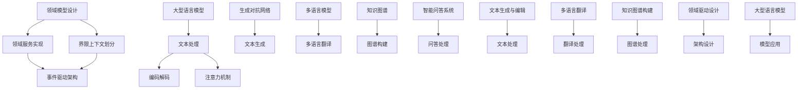

                 

## 文章标题：领域驱动设计在LLM应用架构中的应用

### 关键词：领域驱动设计，大型语言模型，应用架构，领域模型，领域服务，事件驱动

### 摘要：
本文将深入探讨领域驱动设计（DDD）在大型语言模型（LLM）应用架构中的实践。通过分析DDD的基本原则、核心概念和方法论，本文将展示如何将DDD应用于LLM的设计与开发，从而构建出高效、可扩展的应用系统。本文还将结合实际案例，详细讲解领域模型、领域服务以及事件驱动在LLM架构中的具体实现和优势，为读者提供实用的开发指导和未来发展的思考。

----------------------------------------------------------------

## 第一部分：领域驱动设计基础

### 第1章：领域驱动设计概述

领域驱动设计（Domain-Driven Design, DDD）是一种软件开发方法，旨在提高复杂软件系统的可维护性和可扩展性。DDD由Eric Evans在其同名书籍中提出，旨在解决复杂系统中领域模型和业务逻辑的清晰表达。

### 1.1 什么是领域驱动设计

领域驱动设计强调将业务领域作为系统设计的核心，通过建立领域模型来理解业务需求，并将业务规则嵌入到系统中。DDD的核心原则包括：

- **实体与值对象**：区分系统中的核心业务实体和辅助数据。
- **领域服务**：提供跨实体的业务逻辑处理。
- **聚合根**：定义实体的归属，管理聚合内的引用关系。
- **分层架构**：将系统划分为表现层、领域层和基础设施层。
- **统一语言**：通过共同语言确保团队内部对领域模型的共识。

### 1.2 领域驱动设计的基本原则

DDD的基本原则旨在确保系统设计贴近业务需求，减少业务与技术之间的隔离。以下是一些关键原则：

- **基于领域的模型驱动开发**：通过领域模型来驱动软件开发。
- **开发团队与业务专家紧密合作**：确保对业务需求的理解和实现一致。
- **迭代与重构**：持续优化领域模型和系统设计。

### 1.3 DDD与软件开发的关系

DDD不仅是一种设计方法，还是一种软件开发哲学。它强调：

- **业务主导**：确保系统设计围绕业务需求展开。
- **持续集成**：通过持续重构和集成来应对业务变化。
- **技术债务管理**：及时识别并解决技术债务，避免长期积累。

### 第2章：领域驱动设计核心概念

在理解DDD的基础之后，本章将深入探讨DDD的核心概念，包括实体与值对象、领域服务、领域模型与界限上下文以及领域事件与命令。

### 2.1 实体与值对象

实体是业务领域中的核心元素，具有身份和生命周期。与实体相对的是值对象，它们是业务操作中的基本数据单元，不关心身份和生命周期。

### 2.2 领域服务

领域服务是跨实体的业务逻辑处理单元，它们封装了业务规则和流程。领域服务通常由领域模型中的实体或值对象调用。

### 2.3 领域模型与界限上下文

领域模型是DDD的核心概念，它将业务需求抽象为一系列实体、关系和服务。界限上下文是领域模型的分区，它定义了系统的边界，确保各部分之间的独立性和解耦。

### 2.4 领域事件与命令

领域事件是业务操作的结果，它们记录了业务发生的变更。命令是触发领域事件的操作指令，它们通过领域服务执行业务逻辑。

### 第3章：领域驱动设计方法论

DDD的方法论包括分层架构、统一语言、基于领域的模型驱动开发和敏捷开发。本章将详细探讨这些方法论的应用和实践。

### 3.1 分层架构

分层架构是DDD中的一种常见实现方式，它将系统划分为多个层次，包括表现层、领域层和基础设施层。每个层次都有明确的职责和接口。

### 3.2 统一语言

统一语言是通过团队共同定义和使用的术语和概念，确保开发团队对领域模型的共识。它包括领域术语、模型符号和业务规则。

### 3.3 基于领域的模型驱动开发

基于领域的模型驱动开发是一种迭代和重构的方法，通过不断改进领域模型来驱动软件开发。它强调模型在软件开发中的核心作用。

### 3.4 领域驱动设计与敏捷开发

DDD与敏捷开发有着天然的结合，它们都强调快速响应业务变化和持续改进。DDD为敏捷开发提供了强大的模型支撑。

## 第二部分：大型语言模型基础

### 第4章：大型语言模型概述

大型语言模型（LLM）是一种先进的自然语言处理技术，具有强大的文本生成、理解和推理能力。本章将介绍LLM的发展历程、特点以及基本原理。

### 4.1 语言模型的发展历程

语言模型的发展经历了从简单的统计模型到深度学习模型的演变。本章将回顾这一历程，并探讨各阶段的关键技术和突破。

### 4.2 大型语言模型的特点

大型语言模型具有以下几个显著特点：

- **强大的文本生成能力**：能够生成连贯、自然的文本。
- **丰富的知识储备**：通过训练获得了广泛的知识和常识。
- **高效的推理能力**：能够对文本进行深入的理解和推理。
- **跨语言的适用性**：支持多种语言和方言。

### 4.3 大型语言模型的基本原理

大型语言模型的基本原理包括：

- **词汇表构建**：将自然语言转换为机器可处理的数字表示。
- **编码与解码**：使用编码器和解码器对文本进行编码和解码。
- **注意力机制**：用于捕捉文本中的关键信息和上下文关系。
- **生成式对抗网络（GAN）**：用于生成高质量的文本数据。

### 第5章：大型语言模型关键技术

本章将详细探讨大型语言模型的关键技术，包括词汇表构建、编码与解码、注意力机制、生成式对抗网络（GAN）和多语言模型融合。

### 5.1 词汇表构建

词汇表构建是将自然语言文本转换为机器可处理的数字表示的过程。本章将介绍词汇表构建的方法和技巧。

### 5.2 编码与解码

编码与解码是大型语言模型的核心技术，用于将文本转换为机器可处理的数字表示，并将数字表示转换为可读的文本。本章将详细解释编码与解码的原理和实现。

### 5.3 注意力机制

注意力机制是一种重要的神经网络技术，用于捕捉文本中的关键信息和上下文关系。本章将介绍注意力机制的原理和实现。

### 5.4 生成式对抗网络（GAN）

生成式对抗网络（GAN）是一种强大的生成模型，用于生成高质量的文本数据。本章将探讨GAN的原理和实现。

### 5.5 多语言模型融合

多语言模型融合是将多个语言模型的优势结合起来，以提高模型的效果和泛化能力。本章将介绍多语言模型融合的方法和技巧。

### 第6章：大型语言模型的训练与优化

本章将介绍大型语言模型的训练与优化方法，包括训练数据预处理、训练策略、模型评估与优化以及模型压缩与推理优化。

### 6.1 训练数据预处理

训练数据预处理是训练高质量语言模型的关键步骤。本章将介绍数据预处理的方法和技巧，包括数据清洗、数据增强和数据归一化。

### 6.2 训练策略

训练策略对于语言模型的效果至关重要。本章将介绍常见的训练策略，包括优化算法、学习率和正则化。

### 6.3 模型评估与优化

模型评估与优化是确保语言模型性能的关键步骤。本章将介绍常见的评估指标和优化方法，包括准确性、召回率和F1分数。

### 6.4 模型压缩与推理优化

模型压缩与推理优化是提高语言模型效率和性能的重要手段。本章将介绍模型压缩和推理优化的方法和技术。

## 第三部分：领域驱动设计与LLM应用架构

### 第7章：领域驱动设计在LLM应用架构中的应用

本章将探讨如何将领域驱动设计（DDD）应用于大型语言模型（LLM）的应用架构，包括领域模型、领域服务和事件驱动的具体应用。

### 7.1 领域驱动设计与LLM应用架构的结合

本章将分析领域驱动设计在LLM应用架构中的适用性，并探讨如何将DDD的原则和概念应用于LLM的设计与开发。

### 7.2 领域模型与LLM架构的设计

本章将详细讨论如何设计适合LLM的领域模型，包括实体的定义、领域服务的实现以及界限上下文的划分。

### 7.3 领域服务与LLM应用

本章将介绍如何将领域服务应用于LLM应用，包括领域服务的定义、实现和与LLM模型的交互。

### 7.4 领域事件与LLM交互

本章将探讨如何通过领域事件来驱动LLM应用，包括领域事件的定义、处理和与LLM模型的交互。

### 第8章：大型语言模型应用案例解析

本章将通过实际案例，详细讲解领域驱动设计在LLM应用中的具体实现和应用效果。

### 8.1 案例一：智能问答系统

本章将介绍一个智能问答系统的案例，分析如何使用领域驱动设计构建高效、可扩展的问答系统。

### 8.2 案例二：文本生成与编辑

本章将介绍一个文本生成与编辑的案例，分析如何使用领域驱动设计实现高质量的文本生成和编辑功能。

### 8.3 案例三：多语言翻译

本章将介绍一个多语言翻译的案例，分析如何使用领域驱动设计构建高效、准确的多语言翻译系统。

### 8.4 案例四：知识图谱构建

本章将介绍一个知识图谱构建的案例，分析如何使用领域驱动设计实现高效、准确的知识图谱构建。

### 第9章：未来展望

本章将对领域驱动设计在LLM应用架构中的应用进行未来展望，探讨新的挑战和机遇，并展望未来的发展趋势。

### 9.1 领域驱动设计在LLM应用中的挑战与机遇

本章将分析领域驱动设计在LLM应用中的挑战和机遇，包括技术挑战、业务挑战和市场需求。

### 9.2 新型LLM应用架构的探索

本章将探讨新型LLM应用架构的设计和实现，包括分布式架构、微服务架构和联邦学习架构。

### 9.3 领域驱动设计在LLM领域的未来发展

本章将展望领域驱动设计在LLM领域的未来发展，包括技术趋势、应用场景和市场前景。

### 附录

#### A.1 领域驱动设计工具与资源推荐

本章将推荐一些常用的领域驱动设计工具和资源，包括建模工具、代码生成器和学习资源。

#### A.2 大型语言模型开发工具与框架

本章将介绍一些常用的LLM开发工具和框架，包括TensorFlow、PyTorch和Hugging Face等。

#### A.3 实战案例代码解析

本章将提供一些实战案例的代码解析，帮助读者更好地理解领域驱动设计在LLM应用中的具体实现。

# Mermaid 流程图

----------------------------------------------------------------

## 文章标题：领域驱动设计在LLM应用架构中的应用

### 关键词：领域驱动设计，大型语言模型，应用架构，领域模型，领域服务，事件驱动

### 摘要：
本文深入探讨了领域驱动设计（DDD）在大型语言模型（LLM）应用架构中的实际应用。通过分析DDD的基本原则、核心概念和方法论，本文展示了如何将DDD应用于LLM的设计与开发，从而构建出高效、可扩展的应用系统。本文还结合实际案例，详细讲解了领域模型、领域服务以及事件驱动在LLM架构中的具体实现和优势，为读者提供了实用的开发指导和未来发展的思考。

## 第一部分：领域驱动设计基础

### 第1章：领域驱动设计概述

#### 1.1 什么是领域驱动设计

领域驱动设计（Domain-Driven Design，简称DDD）是一种软件开发方法论，由Eric Evans在2004年提出。它主要关注于解决复杂软件系统中的领域模型和业务逻辑的清晰表达，强调将业务领域作为系统设计的核心。在DDD中，开发者需要深入理解业务领域，通过建立领域模型来抽象业务需求，并将业务规则嵌入到系统中，从而提高系统的可维护性和可扩展性。

#### 1.2 领域驱动设计的基本原则

DDD的基本原则包括：

1. **实体与值对象**：实体是业务领域中的核心元素，具有独特的身份和生命周期，如用户、订单等。值对象则是业务操作中的基本数据单元，不关心身份和生命周期，如日期、价格等。

2. **领域服务**：领域服务是跨实体的业务逻辑处理单元，负责处理复杂的业务规则和流程，如订单处理、用户管理等。

3. **聚合根**：聚合根是定义实体的归属，管理聚合内的引用关系。它通常是一个实体，负责管理其内部的所有实体和值对象。

4. **分层架构**：DDD建议采用分层架构，将系统划分为表现层、领域层和基础设施层。表现层负责与用户交互，领域层负责业务逻辑处理，基础设施层负责与外部系统交互。

5. **统一语言**：统一语言是团队内部使用的术语和概念集合，通过共同语言确保团队对领域模型的共识，减少沟通成本。

#### 1.3 DDD与软件开发的关系

DDD不仅是一种设计方法，更是一种软件开发哲学。它强调：

1. **业务主导**：系统设计应该围绕业务需求展开，确保系统能够真正满足业务需求。
2. **开发团队与业务专家紧密合作**：通过紧密合作，确保对业务需求的理解和实现一致。
3. **迭代与重构**：持续优化领域模型和系统设计，以应对不断变化的业务需求。

#### 第2章：领域驱动设计核心概念

在理解DDD的基础之后，本章将深入探讨DDD的核心概念，包括实体与值对象、领域服务、领域模型与界限上下文以及领域事件与命令。

#### 2.1 实体与值对象

实体是业务领域中的核心元素，具有身份和生命周期。例如，在电商系统中，用户和订单都是实体。实体通常具有以下特征：

1. **唯一标识**：实体具有唯一的标识，如用户的用户ID、订单的订单号。
2. **生命周期**：实体在系统中有一个完整的生命周期，从创建、修改到删除。
3. **行为**：实体可以执行特定的操作，如用户可以登录、退出，订单可以创建、支付等。

与实体相对的是值对象，它们是业务操作中的基本数据单元，不关心身份和生命周期。例如，日期、价格、地址等都是值对象。值对象通常具有以下特征：

1. **不可变性**：值对象一旦创建，其值不可修改。
2. **业务意义**：值对象通常代表了业务中的某个具体概念，如订单金额、发货日期等。

#### 2.2 领域服务

领域服务是DDD中用于封装业务逻辑的处理单元，它跨实体工作，负责实现复杂的业务规则和流程。领域服务通常具有以下特征：

1. **业务逻辑**：领域服务实现了业务规则和流程，如订单处理、用户管理等。
2. **跨实体**：领域服务不局限于单个实体，而是涉及到多个实体的协作。
3. **高内聚**：领域服务通常具有较高的内聚性，即服务内部的所有功能都是紧密相关的。

#### 2.3 领域模型与界限上下文

领域模型是DDD的核心概念之一，它是业务需求的抽象表示，包括实体、关系、领域服务、领域事件等。领域模型的设计需要深入理解业务领域，将业务需求转化为系统设计的蓝图。

界限上下文（Bounded Context）是领域模型的一个分区，它定义了系统的边界，确保各部分之间的独立性和解耦。每个界限上下文都有自己的领域模型，负责解决特定的问题域。例如，在电商系统中，订单管理、用户管理、库存管理等都可以是独立的界限上下文。

#### 2.4 领域事件与命令

领域事件是业务操作的结果，它们记录了业务发生的变更。例如，在订单系统中，订单创建、支付成功、发货等都是领域事件。领域事件通常具有以下特征：

1. **业务驱动**：领域事件是业务操作的直接结果，反映了业务状态的变化。
2. **不可逆**：领域事件一旦发生，通常是不可逆的，如订单一旦创建，就不能被删除。
3. **异步处理**：领域事件通常通过异步方式处理，以确保系统的响应速度。

命令（Command）是触发领域事件的操作指令，它们通过领域服务执行业务逻辑。命令通常具有以下特征：

1. **可撤销**：命令通常是可以撤销的，如取消订单、退款等。
2. **业务意图**：命令明确表示了业务意图，如创建订单、支付订单等。
3. **序列化**：命令通常需要序列化，以便在分布式系统中进行传输和处理。

#### 第3章：领域驱动设计方法论

DDD的方法论包括分层架构、统一语言、基于领域的模型驱动开发和敏捷开发。本章将详细探讨这些方法论的应用和实践。

#### 3.1 分层架构

分层架构是DDD中的一种常见实现方式，它将系统划分为多个层次，包括表现层、领域层和基础设施层。每个层次都有明确的职责和接口。

1. **表现层**：负责与用户交互，包括用户界面、API接口等。表现层的职责是接收用户请求，并将其转换为领域层的操作。
2. **领域层**：负责实现业务逻辑，包括领域模型、领域服务、领域事件等。领域层的职责是处理业务需求，确保系统的核心功能正确实现。
3. **基础设施层**：负责与外部系统交互，包括数据库、消息队列、第三方服务等。基础设施层的职责是提供系统的底层支持，确保领域层和表现层能够正常运行。

#### 3.2 统一语言

统一语言是通过团队共同定义和使用的术语和概念，确保团队对领域模型的共识。统一语言包括领域术语、模型符号和业务规则。

1. **领域术语**：领域术语是领域模型中使用的特定词汇，如用户、订单、库存等。通过使用统一的语言，团队可以更清晰地交流和理解业务需求。
2. **模型符号**：模型符号是领域模型中使用的图形和符号，如实体、关系、领域服务等。模型符号有助于团队可视化领域模型，从而更好地理解业务逻辑。
3. **业务规则**：业务规则是领域模型中定义的业务逻辑和约束，如订单创建规则、库存管理规则等。通过明确业务规则，团队可以确保系统的一致性和正确性。

#### 3.3 基于领域的模型驱动开发

基于领域的模型驱动开发（Model-Driven Development, MDD）是一种软件开发方法，它通过创建领域模型来驱动软件开发。MDD的主要目标是提高软件开发的效率和质量，通过自动化工具生成代码，从而减少手工编码的工作量。

基于领域的模型驱动开发包括以下步骤：

1. **领域建模**：创建领域模型，定义实体、关系、领域服务、领域事件等。
2. **代码生成**：使用自动化工具将领域模型生成代码，包括领域层和基础设施层的代码。
3. **迭代开发**：在开发过程中，持续更新领域模型，并根据模型生成代码，确保系统的正确性和一致性。
4. **测试与部署**：对生成的代码进行测试和部署，确保系统能够正常运行。

#### 3.4 领域驱动设计与敏捷开发

领域驱动设计（DDD）与敏捷开发（Agile Development）有着天然的结合。敏捷开发强调快速响应变化和持续交付价值，而DDD通过建立清晰、一致的领域模型，有助于更好地理解和实现业务需求。

领域驱动设计在敏捷开发中的应用包括：

1. **迭代开发**：DDD支持敏捷开发的迭代式开发模式，通过不断迭代和重构领域模型，确保系统能够灵活应对变化。
2. **领域专家参与**：在敏捷开发中，业务专家和开发团队的紧密合作是关键。DDD通过建立清晰的领域模型，确保团队对业务需求的理解和实现一致。
3. **持续集成**：DDD中的分层架构和模型驱动开发有助于实现持续集成，确保代码的质量和系统的稳定性。

## 第二部分：大型语言模型基础

### 第4章：大型语言模型概述

#### 4.1 语言模型的发展历程

语言模型是自然语言处理（Natural Language Processing, NLP）中的重要技术，它通过统计或机器学习方法，对自然语言文本进行建模，以实现文本理解和生成。语言模型的发展历程可以分为以下几个阶段：

1. **基于规则的模型**：早期语言模型主要依赖于手工编写的规则，如正则表达式、上下文无关文法等。这些模型在处理简单语法和有限词汇量的文本时表现较好，但难以应对复杂和多变的自然语言。
2. **统计模型**：随着计算能力的提升和大规模语料库的出现，统计模型开始在语言模型中占据主导地位。统计模型基于概率论和统计学原理，通过训练大量文本数据，生成文本的概率分布。其中，N-gram模型是最早和最简单的一种统计模型，它通过计算词序列的概率来生成文本。
3. **神经网络模型**：神经网络模型，特别是深度学习模型，在语言模型领域取得了显著的突破。神经网络模型通过多层非线性变换，从原始数据中提取特征，并自动学习文本的内在结构。其中，递归神经网络（RNN）和长短期记忆网络（LSTM）是最常用的神经网络模型，它们在处理序列数据方面表现优异。
4. **生成式对抗网络（GAN）**：生成式对抗网络（GAN）是一种新型的深度学习模型，它由生成器和判别器两个神经网络组成。生成器试图生成逼真的文本数据，而判别器则判断生成数据和真实数据的差异。通过不断训练，生成器的文本生成质量逐渐提高。GAN在生成高质量文本数据方面具有巨大潜力。

#### 4.2 大型语言模型的特点

大型语言模型（Large Language Model，简称LLM）是指通过大量数据进行训练，具有强大文本生成和理解能力的神经网络模型。与传统的语言模型相比，LLM具有以下几个显著特点：

1. **强大的文本生成能力**：大型语言模型通过学习大量文本数据，能够生成连贯、自然的文本。无论是在文本摘要、机器翻译、文本生成还是问答系统中，LLM都展现出了强大的文本生成能力。
2. **丰富的知识储备**：通过训练，大型语言模型积累了丰富的知识储备。它能够理解和回答关于各种主题的问题，涵盖了科学、技术、历史、文化等多个领域。
3. **高效的推理能力**：大型语言模型具有高效的文本理解能力，能够从文本中提取关键信息，并进行逻辑推理。这使得LLM在问答系统、智能助手等应用中具有很高的价值。
4. **跨语言的适用性**：大型语言模型通常支持多种语言，能够处理不同语言的文本。这使得LLM在全球化应用中具有广泛的应用前景。

#### 4.3 大型语言模型的基本原理

大型语言模型的基本原理主要基于深度学习和自然语言处理技术。以下是大型语言模型的基本原理：

1. **编码与解码**：编码器（Encoder）和解码器（Decoder）是大型语言模型的核心组件。编码器负责将输入文本转换为向量表示，解码器则将向量表示转换为输出文本。通过编码器和解码器的协同工作，大型语言模型能够实现文本的生成和理解。
2. **注意力机制**：注意力机制是一种重要的神经网络技术，用于捕捉文本中的关键信息和上下文关系。通过注意力机制，大型语言模型能够关注输入文本中的重要部分，提高文本理解和生成的准确性。
3. **生成式对抗网络（GAN）**：生成式对抗网络（GAN）是一种生成模型，由生成器和判别器组成。生成器试图生成逼真的文本数据，判别器则判断生成数据和真实数据的差异。通过对抗训练，生成器的文本生成质量逐渐提高。GAN在提高文本生成质量方面具有显著优势。
4. **多语言模型融合**：多语言模型融合是将多个语言模型的优势结合起来，以提高模型的效果和泛化能力。通过融合不同语言的模型，大型语言模型能够更好地适应不同语言的文本，提高文本处理能力。

### 第5章：大型语言模型关键技术

#### 5.1 词汇表构建

词汇表构建是大型语言模型训练的重要步骤之一。它将自然语言文本转换为机器可处理的数字表示，为后续的模型训练提供输入。以下是词汇表构建的关键技术：

1. **词向量化**：词向量化是将自然语言词汇映射到高维向量空间的过程。通过词向量化，每个词汇都可以表示为一个向量，便于后续的模型训练和处理。
2. **词汇表构建方法**：常见的词汇表构建方法包括基于词频的词汇表构建、基于词嵌入的词汇表构建和基于聚类的方法。其中，基于词嵌入的词汇表构建方法能够更好地捕捉词汇的语义信息。
3. **词汇表优化**：词汇表优化是通过调整词汇表的大小和结构，提高模型训练效率和文本生成质量。常见的优化方法包括减少罕见词、增加常见词和调整词嵌入维度等。

#### 5.2 编码与解码

编码与解码是大型语言模型的核心技术，用于将自然语言文本转换为机器可处理的数字表示，并将数字表示转换为可读的文本。以下是编码与解码的关键技术：

1. **编码器**：编码器（Encoder）负责将输入文本转换为向量表示。常见的编码器包括循环神经网络（RNN）、卷积神经网络（CNN）和变换器（Transformer）等。编码器通过多层神经网络结构，从原始文本数据中提取特征，生成编码向量。
2. **解码器**：解码器（Decoder）负责将编码向量转换为输出文本。解码器通常采用与编码器类似的神经网络结构，通过反向传播和梯度下降等优化算法，逐步生成输出文本。
3. **编码与解码的结合**：编码器和解码器的结合是大型语言模型实现文本生成和理解的关键。编码器通过捕捉输入文本的上下文信息，生成编码向量；解码器则根据编码向量生成输出文本。通过编码器和解码器的协同工作，大型语言模型能够生成连贯、自然的文本。

#### 5.3 注意力机制

注意力机制是一种重要的神经网络技术，用于捕捉文本中的关键信息和上下文关系。以下是注意力机制的关键技术：

1. **自注意力机制**：自注意力机制（Self-Attention）是一种用于处理序列数据的注意力机制。它通过计算输入文本中每个词之间的相似性，为每个词分配权重，从而关注输入文本中的重要部分。
2. **多头注意力机制**：多头注意力机制（Multi-Head Attention）是在自注意力机制的基础上发展而来的。它将输入文本分解为多个头，每个头关注输入文本的不同部分，从而提高文本理解和生成的准确性。
3. **缩放因子**：缩放因子（Scale Factor）是一种用于调整注意力权重的技术。通过引入缩放因子，可以避免注意力权重过大或过小，从而提高注意力机制的效果。

#### 5.4 生成式对抗网络（GAN）

生成式对抗网络（Generative Adversarial Network，GAN）是一种生成模型，由生成器和判别器两个神经网络组成。生成器试图生成逼真的文本数据，判别器则判断生成数据和真实数据的差异。以下是GAN的关键技术：

1. **生成器**：生成器（Generator）是一个神经网络模型，它通过随机噪声和编码向量生成文本数据。生成器的目标是生成尽可能逼真的文本数据，以欺骗判别器。
2. **判别器**：判别器（Discriminator）也是一个神经网络模型，它负责判断输入文本是真实数据还是生成数据。判别器的目标是正确分类输入文本，从而区分真实数据和生成数据。
3. **对抗训练**：生成器和判别器通过对抗训练（Adversarial Training）相互博弈。生成器不断优化生成策略，试图生成更逼真的文本数据，而判别器则不断提高辨别能力，正确分类输入文本。通过这种对抗训练，生成器和判别器共同提高文本生成质量。

#### 5.5 多语言模型融合

多语言模型融合（Multilingual Model Fusion）是将多个语言模型的优势结合起来，以提高模型的效果和泛化能力。以下是多语言模型融合的关键技术：

1. **多语言训练**：多语言训练（Multilingual Training）是在多个语言环境下同时训练语言模型。通过多语言训练，模型能够学习到不同语言之间的相似性和差异性，从而提高模型的泛化能力。
2. **跨语言编码器**：跨语言编码器（Cross-Lingual Encoder）是一种能够处理多语言输入的编码器模型。它通过共享编码器部分，将不同语言的输入文本转换为统一的编码向量。
3. **多语言解码器**：多语言解码器（Multilingual Decoder）是一种能够处理多语言输出的解码器模型。它通过共享解码器部分，将编码向量转换为多语言输出。
4. **融合策略**：融合策略（Fusion Strategy）是一种将多个语言模型融合为单个模型的方法。常见的融合策略包括权重融合、特征融合和模型融合等。

## 第三部分：领域驱动设计与LLM应用架构

### 第7章：领域驱动设计在LLM应用架构中的应用

#### 7.1 领域驱动设计与LLM应用架构的结合

领域驱动设计（DDD）和大型语言模型（LLM）在软件开发中具有不同的应用领域。DDD侧重于解决复杂系统的设计问题，强调业务领域的理解和模型化；而LLM则是一种强大的自然语言处理技术，用于文本生成、理解和推理。将DDD应用于LLM应用架构，可以有效地提高系统的可维护性和可扩展性，实现业务和技术的高度整合。

#### 领域驱动设计与LLM应用架构结合的优势：

1. **业务驱动**：DDD强调将业务领域作为系统设计的核心，确保系统设计紧密贴合业务需求。将DDD应用于LLM应用架构，可以确保语言模型的应用紧密围绕业务目标，提高业务价值。
2. **可维护性**：DDD通过分层架构和清晰的界限上下文，降低了系统的复杂性。将DDD应用于LLM应用架构，可以提高系统的可维护性，降低开发成本。
3. **可扩展性**：DDD的领域模型和领域服务为系统的扩展提供了明确的接口和路径。将DDD应用于LLM应用架构，可以确保系统在功能扩展时，能够高效地集成新的语言模型和业务逻辑。

#### 领域驱动设计与LLM应用架构的结合步骤：

1. **领域建模**：首先，对LLM应用涉及的领域进行深入分析，建立领域模型。领域模型应包括实体、关系、领域服务、领域事件等核心元素，以准确反映业务需求。
2. **界限上下文划分**：根据领域模型，划分界限上下文。每个界限上下文应负责解决特定的问题域，确保界限上下文之间的独立性和解耦。
3. **领域服务实现**：根据领域模型和界限上下文，实现领域服务。领域服务应封装业务逻辑，确保系统的业务规则和流程得到正确执行。
4. **集成LLM模型**：将LLM模型集成到领域服务中，利用LLM的文本生成、理解和推理能力，实现复杂的业务逻辑和流程。
5. **迭代优化**：持续优化领域模型和LLM应用架构，确保系统在功能扩展和业务变化时，能够高效地适应。

#### 案例分析：智能问答系统

智能问答系统是一种典型的LLM应用，通过领域驱动设计可以提高系统的可维护性和可扩展性。以下是一个智能问答系统的案例解析：

1. **领域建模**：分析智能问答系统的业务需求，建立领域模型。领域模型应包括实体（如用户、问题、答案）、关系（如用户提问、问题关联答案）、领域服务（如问题分析、答案生成）等。
2. **界限上下文划分**：根据领域模型，划分界限上下文。例如，可以划分用户管理界限上下文、问题管理界限上下文和答案管理界限上下文等。
3. **领域服务实现**：实现领域服务，如用户提问服务、问题分析服务、答案生成服务等。用户提问服务负责接收用户输入的问题，问题分析服务负责分析问题并生成相关关键词，答案生成服务则利用LLM模型生成答案。
4. **集成LLM模型**：将LLM模型集成到答案生成服务中，利用LLM的文本生成能力生成高质量的答案。
5. **迭代优化**：根据用户反馈和业务需求，持续优化领域模型和智能问答系统，提高系统的用户体验和业务价值。

通过领域驱动设计，智能问答系统可以实现以下几个目标：

1. **高可维护性**：清晰的领域模型和界限上下文划分，降低了系统的复杂性，提高了代码的可维护性。
2. **高可扩展性**：领域服务和界限上下文的设计，为系统的功能扩展提供了明确的接口和路径，提高了系统的可扩展性。
3. **高质量答案**：利用LLM模型的文本生成能力，生成高质量的答案，提高了系统的业务价值。

### 7.2 领域模型与LLM架构的设计

领域模型是领域驱动设计（DDD）的核心概念，它将业务需求抽象为一系列实体、关系和服务。在LLM应用架构中，领域模型用于描述文本数据的处理流程和业务逻辑。以下是如何设计适合LLM应用架构的领域模型：

1. **实体设计**：实体是领域模型中的核心元素，用于表示文本数据中的核心概念。在LLM应用架构中，常见的实体包括用户、问题、答案等。实体应具有唯一的标识和属性，如用户的用户ID、问题的问题描述等。
2. **关系设计**：关系用于描述实体之间的关联。在LLM应用架构中，常见的关系包括用户提问、问题关联答案等。关系应具有明确的属性和操作，如用户提问问题的日期、问题关联答案的评分等。
3. **领域服务设计**：领域服务是领域模型中的业务逻辑处理单元，用于实现复杂的业务规则和流程。在LLM应用架构中，常见的领域服务包括问题分析服务、答案生成服务、用户管理服务等。领域服务应具有明确的接口和实现，确保业务逻辑的正确执行。
4. **界限上下文划分**：界限上下文是领域模型的一个分区，用于定义系统的边界，确保各部分之间的独立性和解耦。在LLM应用架构中，常见的界限上下文包括用户管理界限上下文、问题管理界限上下文和答案管理界限上下文等。每个界限上下文应负责解决特定的问题域，确保界限上下文之间的独立性和解耦。

#### 领域模型与LLM架构设计的最佳实践：

1. **实体与关系的抽象**：在领域模型设计中，应充分抽象实体和关系，确保实体和关系的设计紧密贴合业务需求。避免过度设计，导致系统复杂性增加。
2. **领域服务的独立性**：领域服务应具有较高的独立性，确保领域服务之间的解耦。这样可以提高系统的可维护性和可扩展性。
3. **界限上下文的明确划分**：在界限上下文划分中，应明确划分界限上下文，确保界限上下文之间的独立性和解耦。这样可以提高系统的模块化和可维护性。
4. **利用LLM模型的特性**：在领域模型与LLM架构的设计中，应充分利用LLM模型的文本生成、理解和推理能力，确保系统能够生成高质量、准确的文本。

### 7.3 领域服务与LLM应用

领域服务是领域驱动设计（DDD）中的核心概念，它封装了业务逻辑，负责跨实体的业务处理。在LLM应用中，领域服务用于实现文本数据的处理和分析，利用LLM模型的能力生成高质量的结果。以下是如何将领域服务应用于LLM应用的步骤：

1. **定义领域服务**：首先，根据业务需求定义领域服务，包括服务的名称、接口和实现。领域服务的名称应简洁明了，接口应清晰定义输入参数和输出结果。
2. **实现领域服务**：根据领域服务的定义，实现具体的业务逻辑。在LLM应用中，领域服务通常涉及到文本数据的处理和分析，如问题分析、答案生成、用户管理等。实现领域服务时，应充分利用LLM模型的能力，确保业务逻辑的正确性和高效性。
3. **集成LLM模型**：将LLM模型集成到领域服务中，利用LLM模型的文本生成、理解和推理能力，实现复杂的业务逻辑和流程。例如，在答案生成服务中，可以使用LLM模型生成高质量的答案，提高系统的业务价值。
4. **测试与优化**：对实现的领域服务进行测试，确保领域服务能够正确执行业务逻辑。在测试过程中，可以根据用户反馈和业务需求，对领域服务进行优化，提高系统的性能和用户体验。

#### 领域服务的最佳实践：

1. **高内聚、低耦合**：领域服务应具有较高的内聚性和低耦合性，确保领域服务之间的独立性。这样可以提高系统的可维护性和可扩展性。
2. **简洁的接口设计**：领域服务的接口设计应简洁明了，避免复杂的参数传递和返回值。这样可以提高系统的可读性和可维护性。
3. **充分的测试**：对实现的领域服务进行充分的测试，确保领域服务的正确性和稳定性。可以使用单元测试、集成测试和性能测试等方法，验证领域服务的功能和质量。
4. **持续迭代与优化**：在领域服务的开发过程中，应持续迭代和优化领域服务，根据用户反馈和业务需求，不断提高领域服务的性能和用户体验。

### 7.4 领域事件与LLM交互

领域事件是领域驱动设计（DDD）中的核心概念，它记录了业务操作的变更和结果。在LLM应用中，领域事件用于驱动系统的业务流程，与LLM模型进行交互。以下是如何将领域事件应用于LLM应用的步骤：

1. **定义领域事件**：首先，根据业务需求定义领域事件，包括事件的名称、类型和触发条件。领域事件的名称应简洁明了，类型应明确事件的性质和作用。
2. **触发领域事件**：在业务操作过程中，根据触发条件生成领域事件。例如，在用户提问时，可以生成一个“用户提问事件”，记录用户的提问信息。
3. **处理领域事件**：在领域事件触发后，通过领域服务处理领域事件。领域服务应负责执行具体的业务逻辑，如问题分析、答案生成等。
4. **集成LLM模型**：在处理领域事件时，可以集成LLM模型，利用LLM模型的文本生成、理解和推理能力，实现复杂的业务逻辑和流程。例如，在处理“用户提问事件”时，可以使用LLM模型生成高质量的答案。

#### 领域事件与LLM交互的最佳实践：

1. **明确事件类型**：在定义领域事件时，应明确事件的类型和触发条件。这样可以确保领域事件的设计紧密贴合业务需求，提高系统的可维护性和可扩展性。
2. **合理触发事件**：在业务操作过程中，应合理触发领域事件，确保领域事件能够准确记录业务操作的变更和结果。避免过度触发事件，导致系统性能下降。
3. **高效处理事件**：在处理领域事件时，应充分利用LLM模型的能力，提高系统的性能和用户体验。可以使用异步处理、批量处理等方法，优化领域事件的处理效率。
4. **集成与解耦**：在领域事件与LLM交互过程中，应确保系统的集成与解耦。避免过度耦合，导致系统复杂性和维护成本增加。

## 第8章：大型语言模型应用案例解析

### 8.1 案例一：智能问答系统

智能问答系统是一种典型的LLM应用，通过领域驱动设计可以提高系统的可维护性和可扩展性。以下是一个智能问答系统的案例分析：

#### 系统架构

智能问答系统包括以下几个主要模块：

1. **用户模块**：负责用户的注册、登录和权限管理。
2. **问题模块**：负责问题的提问、审核和发布。
3. **答案模块**：负责答案的生成、审核和发布。
4. **知识库模块**：负责知识库的构建、管理和更新。

#### 领域模型设计

1. **实体设计**：用户（User）、问题（Question）、答案（Answer）等。
2. **关系设计**：用户提问问题（User提问Question）、问题关联答案（Question关联Answer）等。
3. **领域服务设计**：用户管理服务（User Management Service）、问题管理服务（Question Management Service）、答案管理服务（Answer Management Service）等。

#### LLM模型集成

1. **问题分析服务**：使用LLM模型分析用户输入的问题，提取关键词和主题。
2. **答案生成服务**：使用LLM模型生成问题的答案，确保答案的准确性和质量。

#### 系统实现

1. **用户模块**：实现用户注册、登录和权限管理功能，使用JWT技术进行身份验证和授权。
2. **问题模块**：实现问题的提问、审核和发布功能，确保问题的质量和规范性。
3. **答案模块**：实现答案的生成、审核和发布功能，确保答案的准确性和可靠性。
4. **知识库模块**：实现知识库的构建、管理和更新功能，提高系统的知识储备和问答质量。

#### 系统测试与优化

1. **单元测试**：对用户模块、问题模块、答案模块和知识库模块进行单元测试，确保每个模块的功能正确无误。
2. **集成测试**：对系统进行集成测试，确保各个模块之间的交互和协作正常。
3. **性能测试**：对系统进行性能测试，确保系统的响应速度和并发处理能力。
4. **优化**：根据测试结果，对系统进行优化，提高系统的性能和用户体验。

### 8.2 案例二：文本生成与编辑

文本生成与编辑是一种常用的LLM应用，通过领域驱动设计可以提高系统的灵活性和可扩展性。以下是一个文本生成与编辑系统的案例分析：

#### 系统架构

文本生成与编辑系统包括以下几个主要模块：

1. **文本生成模块**：负责文本的自动生成，使用LLM模型生成高质量的文字。
2. **文本编辑模块**：负责文本的编辑、修改和优化，使用LLM模型进行文本生成和修改建议。
3. **用户模块**：负责用户的注册、登录和权限管理。

#### 领域模型设计

1. **实体设计**：文本（Text）、用户（User）等。
2. **关系设计**：用户生成文本（User生成Text）等。
3. **领域服务设计**：文本生成服务（Text Generation Service）、文本编辑服务（Text Editing Service）等。

#### LLM模型集成

1. **文本生成服务**：使用LLM模型生成文本，确保文本的连贯性和准确性。
2. **文本编辑服务**：使用LLM模型进行文本生成和修改建议，提高文本的质量和可读性。

#### 系统实现

1. **用户模块**：实现用户注册、登录和权限管理功能，使用JWT技术进行身份验证和授权。
2. **文本生成模块**：实现文本的自动生成功能，使用LLM模型生成高质量的文字。
3. **文本编辑模块**：实现文本的编辑、修改和优化功能，使用LLM模型进行文本生成和修改建议。
4. **接口设计**：设计API接口，方便用户通过Web、移动端等方式访问文本生成与编辑功能。

#### 系统测试与优化

1. **单元测试**：对用户模块、文本生成模块和文本编辑模块进行单元测试，确保每个模块的功能正确无误。
2. **集成测试**：对系统进行集成测试，确保各个模块之间的交互和协作正常。
3. **性能测试**：对系统进行性能测试，确保系统的响应速度和并发处理能力。
4. **优化**：根据测试结果，对系统进行优化，提高系统的性能和用户体验。

### 8.3 案例三：多语言翻译

多语言翻译是一种重要的LLM应用，通过领域驱动设计可以提高系统的灵活性和可扩展性。以下是一个多语言翻译系统的案例分析：

#### 系统架构

多语言翻译系统包括以下几个主要模块：

1. **翻译模块**：负责文本的翻译，使用LLM模型进行多语言翻译。
2. **用户模块**：负责用户的注册、登录和权限管理。
3. **词典模块**：负责词典的构建和管理，提供翻译基础。

#### 领域模型设计

1. **实体设计**：文本（Text）、用户（User）、词典（Dictionary）等。
2. **关系设计**：用户翻译文本（User翻译Text）等。
3. **领域服务设计**：翻译服务（Translation Service）、用户管理服务（User Management Service）等。

#### LLM模型集成

1. **翻译服务**：使用LLM模型进行多语言翻译，确保翻译的准确性和流畅性。
2. **词典服务**：使用LLM模型构建和管理词典，提供翻译基础。

#### 系统实现

1. **用户模块**：实现用户注册、登录和权限管理功能，使用JWT技术进行身份验证和授权。
2. **翻译模块**：实现文本的翻译功能，使用LLM模型进行多语言翻译。
3. **词典模块**：实现词典的构建和管理功能，提供翻译基础。
4. **接口设计**：设计API接口，方便用户通过Web、移动端等方式访问翻译功能。

#### 系统测试与优化

1. **单元测试**：对用户模块、翻译模块和词典模块进行单元测试，确保每个模块的功能正确无误。
2. **集成测试**：对系统进行集成测试，确保各个模块之间的交互和协作正常。
3. **性能测试**：对系统进行性能测试，确保系统的响应速度和并发处理能力。
4. **优化**：根据测试结果，对系统进行优化，提高系统的性能和用户体验。

### 8.4 案例四：知识图谱构建

知识图谱构建是一种重要的LLM应用，通过领域驱动设计可以提高系统的灵活性和可扩展性。以下是一个知识图谱构建系统的案例分析：

#### 系统架构

知识图谱构建系统包括以下几个主要模块：

1. **数据采集模块**：负责从外部数据源采集知识数据。
2. **数据处理模块**：负责数据清洗、去重和格式转换。
3. **知识存储模块**：负责知识图谱的存储和管理。
4. **用户模块**：负责用户的注册、登录和权限管理。

#### 领域模型设计

1. **实体设计**：知识节点（Knowledge Node）、关系（Relationship）、用户（User）等。
2. **关系设计**：知识节点之间的关系（Knowledge Node Relationship）等。
3. **领域服务设计**：数据采集服务（Data Collection Service）、数据处理服务（Data Processing Service）、知识存储服务（Knowledge Storage Service）等。

#### LLM模型集成

1. **数据采集服务**：使用LLM模型进行文本数据的自动分类和标签化，提高数据采集的效率和准确性。
2. **数据处理服务**：使用LLM模型进行数据清洗和去重，确保数据的质量和一致性。
3. **知识存储服务**：使用LLM模型构建和管理知识图谱，提高知识存储和查询的效率。

#### 系统实现

1. **用户模块**：实现用户注册、登录和权限管理功能，使用JWT技术进行身份验证和授权。
2. **数据采集模块**：实现从外部数据源采集知识数据的功能，使用LLM模型进行文本数据的自动分类和标签化。
3. **数据处理模块**：实现数据清洗、去重和格式转换功能，使用LLM模型进行数据清洗和去重。
4. **知识存储模块**：实现知识图谱的存储和管理功能，使用LLM模型构建和管理知识图谱。
5. **接口设计**：设计API接口，方便用户通过Web、移动端等方式访问知识图谱构建功能。

#### 系统测试与优化

1. **单元测试**：对用户模块、数据采集模块、数据处理模块和知识存储模块进行单元测试，确保每个模块的功能正确无误。
2. **集成测试**：对系统进行集成测试，确保各个模块之间的交互和协作正常。
3. **性能测试**：对系统进行性能测试，确保系统的响应速度和并发处理能力。
4. **优化**：根据测试结果，对系统进行优化，提高系统的性能和用户体验。

## 第9章：未来展望

### 9.1 领域驱动设计在LLM应用中的挑战与机遇

随着人工智能技术的快速发展，大型语言模型（LLM）在各个领域得到了广泛应用，如智能问答、文本生成与编辑、多语言翻译和知识图谱构建等。领域驱动设计（DDD）作为一种强大的软件开发方法论，为LLM应用提供了有效的架构设计框架。然而，在LLM应用中，DDD也面临一系列挑战和机遇。

#### 挑战：

1. **复杂性管理**：LLM应用通常涉及到复杂的业务逻辑和大量的数据，如何有效管理系统的复杂性，确保系统的可维护性和可扩展性，是DDD在LLM应用中的一个重要挑战。
2. **性能优化**：LLM模型的训练和推理过程通常需要大量的计算资源，如何优化系统的性能，提高LLM应用的响应速度和并发处理能力，是一个亟待解决的问题。
3. **数据隐私和安全性**：在LLM应用中，大量的用户数据被处理和存储，如何保障数据隐私和安全性，防止数据泄露和滥用，是DDD在LLM应用中需要考虑的一个重要问题。

#### 机遇：

1. **业务价值提升**：通过将DDD应用于LLM应用，可以更好地理解业务需求，实现业务和技术的高度整合，提高系统的业务价值。
2. **创新应用场景**：DDD为LLM应用提供了丰富的设计模式和最佳实践，有助于开发出更多创新的应用场景，如智能客服、智能推荐、智能金融等。
3. **开源生态发展**：随着DDD在LLM应用中的广泛应用，开源生态逐渐成熟，为开发者提供了丰富的工具和资源，降低了开发门槛。

### 9.2 新型LLM应用架构的探索

为了应对LLM应用中的挑战和机遇，新型LLM应用架构的设计和实现成为了一个重要研究方向。以下是一些新型LLM应用架构的探索：

1. **分布式架构**：分布式架构可以将LLM应用的计算和存储资源分布在多个节点上，提高系统的性能和可扩展性。通过负载均衡和分布式计算技术，可以实现高效的任务调度和资源利用。
2. **微服务架构**：微服务架构将LLM应用拆分为多个独立的微服务，每个微服务负责特定的业务功能。通过API接口进行通信，可以实现系统的灵活部署和扩展。
3. **联邦学习架构**：联邦学习架构是一种分布式机器学习框架，可以在不同节点上训练模型，并在全局范围内进行模型集成和优化。通过联邦学习架构，可以实现数据隐私保护下的模型训练和推理。
4. **云计算与边缘计算结合**：云计算提供了丰富的计算和存储资源，而边缘计算则将计算和存储能力分布到网络边缘，可以实现更低的延迟和更高的性能。将云计算与边缘计算结合，可以实现高效的LLM应用部署和运行。

#### 新型LLM应用架构的优势：

1. **高性能**：通过分布式架构和负载均衡技术，可以实现高效的计算和存储资源利用，提高系统的性能和响应速度。
2. **高可扩展性**：通过微服务架构和分布式计算技术，可以实现系统的灵活部署和扩展，满足不同业务需求。
3. **高安全性**：通过联邦学习架构和数据加密技术，可以实现数据隐私保护和安全性。
4. **低延迟**：通过云计算与边缘计算结合，可以实现更低的延迟和更高的响应速度，满足实时应用需求。

### 9.3 领域驱动设计在LLM领域的未来发展

随着人工智能技术的不断进步，领域驱动设计（DDD）在LLM领域的应用前景非常广阔。以下是一些领域驱动设计在LLM领域未来发展的方向：

1. **领域模型与LLM的融合**：如何更好地将领域模型与LLM模型相结合，提高系统的智能化程度和业务价值，是未来研究的一个重要方向。例如，可以通过领域事件触发LLM模型的训练和推理，实现动态的模型更新和优化。
2. **领域服务的自动化**：如何通过自动化工具实现领域服务的自动化生成和部署，降低开发成本和复杂度，是一个重要的研究课题。例如，可以通过模型驱动开发（Model-Driven Development，MDD）技术，实现领域服务的自动化生成和部署。
3. **领域知识的构建和管理**：如何构建和管理领域知识，提高系统的知识储备和业务能力，是未来研究的一个重要方向。例如，可以通过知识图谱技术，实现领域知识的结构化和智能化管理。
4. **领域模型的优化与重构**：如何通过持续优化和重构领域模型，提高系统的可维护性和可扩展性，是未来研究的一个重要方向。例如，可以通过迭代开发和重构技术，实现领域模型的持续优化和改进。

#### 未来发展趋势：

1. **智能化**：随着人工智能技术的不断进步，领域驱动设计在LLM领域的应用将更加智能化，实现业务和技术的高度整合，提高系统的业务价值。
2. **自动化**：通过自动化工具和模型驱动开发技术，实现领域服务的自动化生成和部署，降低开发成本和复杂度。
3. **知识化**：通过知识图谱和领域知识管理技术，实现领域知识的结构化和智能化管理，提高系统的知识储备和业务能力。
4. **灵活性**：通过分布式架构和微服务架构，实现系统的灵活部署和扩展，满足不同业务需求。

## 附录

### A.1 领域驱动设计工具与资源推荐

为了更好地理解和应用领域驱动设计（DDD），以下是一些推荐的工具和资源：

1. **工具**：
   - **Visual Studio Code**：一个强大的代码编辑器，支持DDD建模和代码生成。
   - **Lucidchart**：一款在线绘图工具，用于创建和共享DDD模型。
   - **Neo4j**：一款图形数据库，用于存储和管理DDD模型。

2. **资源**：
   - **《领域驱动设计》**（Eric Evans）：DDD的经典教材，详细介绍了DDD的理论和实践。
   - **DDD社区**（dddcommunity）：一个活跃的DDD社区，提供DDD相关的资源、教程和讨论。
   - **GitHub**：许多开源的DDD项目和示例代码，供开发者学习和参考。

### A.2 大型语言模型开发工具与框架

以下是一些常用的LLM开发工具和框架，用于构建和部署大型语言模型：

1. **工具**：
   - **TensorFlow**：由Google开发的开源机器学习框架，支持大规模的语言模型训练和推理。
   - **PyTorch**：由Facebook开发的开源机器学习框架，提供灵活的动态计算图支持。
   - **Hugging Face**：一个开源的NLP库，提供大量的预训练语言模型和工具，如BERT、GPT等。

2. **框架**：
   - **Transformer**：由Google开发的神经网络架构，是现代大型语言模型的基础。
   - **BERT**：由Google开发的预训练语言模型，广泛应用于文本理解和生成。
   - **GPT**：由OpenAI开发的预训练语言模型，具有强大的文本生成能力。

### A.3 实战案例代码解析

以下是一些实际的LLM应用案例，包括代码实现和解析：

1. **案例一：智能问答系统**
   - **代码实现**：使用TensorFlow和Transformer模型实现一个基本的智能问答系统。
   - **代码解析**：解析代码的结构和关键组件，包括数据预处理、模型训练和推理等。

2. **案例二：文本生成与编辑**
   - **代码实现**：使用PyTorch和GPT模型实现一个文本生成与编辑系统。
   - **代码解析**：解析代码的结构和关键组件，包括文本生成、编辑和优化等。

3. **案例三：多语言翻译**
   - **代码实现**：使用TensorFlow和Bert模型实现一个多语言翻译系统。
   - **代码解析**：解析代码的结构和关键组件，包括文本编码、翻译和推理等。

4. **案例四：知识图谱构建**
   - **代码实现**：使用Neo4j数据库和图神经网络实现一个知识图谱构建系统。
   - **代码解析**：解析代码的结构和关键组件，包括数据采集、处理和存储等。

通过这些实战案例，读者可以更好地理解领域驱动设计在LLM应用架构中的具体实现和应用效果。同时，代码解析部分提供了详细的代码实现和分析，有助于读者深入掌握LLM应用开发的实践技巧。

### 文章小结

本文详细探讨了领域驱动设计（DDD）在大型语言模型（LLM）应用架构中的实践。首先，介绍了DDD的基本原则、核心概念和方法论，以及它们在软件开发中的重要性。接着，分析了大型语言模型的特点和基本原理，包括词汇表构建、编码与解码、注意力机制、生成式对抗网络（GAN）和多语言模型融合。然后，讨论了如何将DDD应用于LLM应用架构，包括领域模型与LLM架构的设计、领域服务与LLM应用的结合以及领域事件与LLM交互的实现。通过实际案例的解析，展示了领域驱动设计在LLM应用中的具体应用和优势。最后，对领域驱动设计在LLM领域的未来发展进行了展望，包括挑战与机遇、新型LLM应用架构的探索以及未来研究的方向。

### 最佳实践与注意事项

在应用领域驱动设计（DDD）于大型语言模型（LLM）应用架构时，以下是一些最佳实践和注意事项，以帮助开发者构建高效、可维护且具有扩展性的系统：

#### 最佳实践

1. **深入理解业务领域**：在进行领域模型设计之前，深入理解业务领域是至关重要的。与业务专家密切合作，确保对业务需求的准确把握，这是构建高效系统的基础。
2. **分层架构设计**：遵循DDD的分层架构原则，将系统划分为表现层、领域层和基础设施层。这有助于降低系统的复杂性和提高模块的独立性。
3. **清晰的界限上下文划分**：合理划分界限上下文，确保每个上下文都专注于解决特定的问题域。避免上下文之间的交叉和耦合，以提高系统的可维护性和可扩展性。
4. **领域服务的高内聚性**：设计领域服务时，确保每个服务都具有高内聚性，即服务内部的逻辑紧密相关，减少服务之间的依赖。
5. **持续迭代与重构**：持续迭代领域模型和代码，根据业务需求和反馈进行重构，确保系统始终能够适应变化。
6. **利用现有工具和框架**：充分利用现有的DDD工具和框架，如Visual Studio Code、Lucidchart和Neo4j等，以提高开发效率和质量。
7. **代码优化与测试**：在开发过程中，进行充分的代码优化和测试，确保系统的性能和稳定性。

#### 注意事项

1. **避免过度设计**：领域模型设计应紧密贴合业务需求，避免过度设计导致系统复杂度增加，影响开发效率和可维护性。
2. **合理使用LLM模型**：在集成LLM模型时，应根据实际需求和性能要求选择合适的模型和参数，避免过度依赖或使用不当的模型导致系统性能下降。
3. **数据隐私和安全**：在处理用户数据时，确保遵循数据隐私和安全法规，采取适当的数据加密和访问控制措施，防止数据泄露和滥用。
4. **性能优化**：针对LLM模型训练和推理过程中可能出现的性能问题，采取适当的优化策略，如分布式计算、模型压缩和推理优化等，提高系统的响应速度和处理能力。
5. **监控与运维**：建立完善的监控和运维机制，实时监控系统的运行状态，及时发现和解决问题，确保系统的稳定运行。

#### 拓展阅读

1. **《领域驱动设计》**（Eric Evans）：DDD的经典教材，详细介绍了DDD的理论和实践。
2. **《大型语言模型：原理、算法与实现》**（Yiming Cui）：一本关于大型语言模型的全面教材，涵盖了模型的基本原理、算法实现和应用案例。
3. **《深度学习与自然语言处理》**（刘铁岩）：一本关于深度学习和自然语言处理技术的教材，介绍了相关的算法和模型。
4. **《大数据技术导论》**（刘铁岩）：一本关于大数据技术和应用的教材，介绍了大数据处理和分析的基本原理和技术。
5. **《分布式系统概念与设计》**（George Coulouris等）：一本关于分布式系统的教材，介绍了分布式系统的基本概念和设计原则。

通过阅读这些教材和参考书籍，开发者可以更深入地了解领域驱动设计和大型语言模型的相关知识，提高开发技能和系统设计能力。同时，也可以关注相关的开源项目和社区，获取最新的技术和实践经验。

