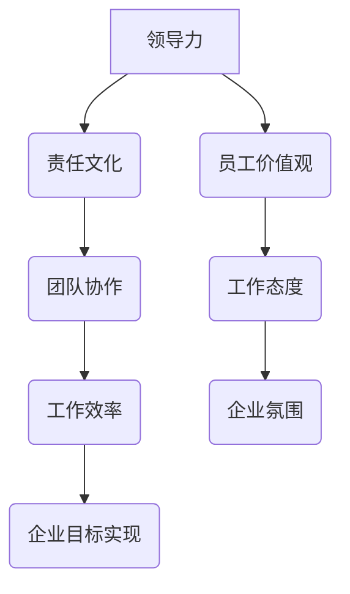
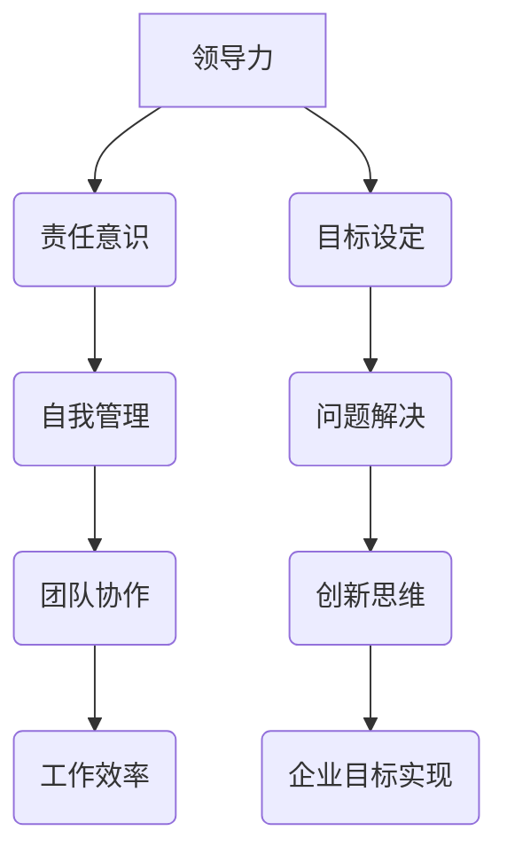

                 


### 引言

在现代企业中，领导力和责任文化已经成为企业持续发展的关键因素。然而，对于许多企业来说，如何有效地培养领导力和责任文化仍然是一个挑战。本文旨在探讨领导力与责任文化之间的关系，并详细分析如何培养主人翁精神，以实现企业的长远发展。

首先，我们需要了解领导力和责任文化的核心概念。领导力不仅仅是管理员工的能力，更是一种激励和引导他人共同实现目标的能力。而责任文化则强调个体和团队对自身行为和结果的负责，是一种积极向上的工作态度和企业价值观。这两个概念在企业运营中密不可分，相辅相成。

接下来，我们将通过以下步骤进行分析：

1. **定义领导力和责任文化**
2. **探讨领导力与责任文化的联系**
3. **分析如何培养主人翁精神**
4. **提供实践方法和案例分析**
5. **总结与展望**

### 定义领导力和责任文化

#### 领导力的定义

领导力是一种综合能力，包括但不限于沟通、决策、激励和团队建设。优秀的领导者不仅能够明确目标，还能激发团队成员的潜力，共同克服困难，实现组织的目标。

#### 责任文化的定义

责任文化是一种企业内部氛围，强调员工对工作结果的责任感和主动性。这种文化鼓励员工积极参与决策，并对工作过程中的问题承担责任，从而提高工作效率和团队协作。

#### 领导力与责任文化的联系

领导力与责任文化之间存在紧密的联系。领导者的行为和态度直接影响员工的价值观和行为模式。一个负责任的领导者会以身作则，鼓励团队成员承担起自己的责任，从而建立起一种积极的责任文化。

我们可以使用以下Mermaid流程图来展示领导力与责任文化之间的互动关系：



### 核心概念与联系

在理解了领导力和责任文化的定义后，我们需要进一步探讨它们之间的关系架构。领导力不仅仅是管理员工的工具，更是培养责任文化的关键。以下是领导力与责任文化之间的关系架构的Mermaid流程图：



这个流程图展示了领导力如何通过培养责任意识、自我管理和团队协作，最终实现工作效率提升和企业目标的实现。

### 核心算法原理讲解

在探讨如何培养领导力和责任文化时，我们需要关注一些核心算法原理。以下是一个简单的伪代码示例，用于说明如何通过培训和实践来培养领导力和责任文化：

```plaintext
function cultivate_leadership_and_responsibility_culture(employee):
    if employee.is_new:
        train_employee(employee, leadership_skills)
        train_employee(employee, responsibility_awareness)
    else:
        review_performance(employee)
        provide_feedback(employee)
        if employee.has_improved:
            reward_employee(employee)
        else:
            offer_additional_training(employee)
    end_if
end_function
```

在这个伪代码中，我们首先判断员工是否为新员工，如果是，则进行领导力和责任意识的培训。如果不是，则通过绩效评估和反馈来促进员工的持续改进。

### 数学模型和公式

在领导力和责任文化的培养过程中，一些数学模型和公式可以帮助我们更好地理解其效果。以下是一个简单的数学公式示例，用于计算领导力和责任文化的提升效果：

```latex
\text{Effectiveness} = \frac{\text{Leadership Skills} + \text{Responsibility Awareness}}{2}
```

这个公式表明，领导力和责任文化的提升效果取决于领导技能和责任意识的综合水平。

### 项目实战

为了更好地理解领导力和责任文化的培养，我们来看一个实际案例。假设我们有一个软件开发团队，希望提升团队的领导力和责任文化。以下是项目的详细步骤：

#### 1. 开发环境搭建

首先，我们需要搭建一个适合培训和评估的开发环境，包括：

- 代码管理工具（如Git）
- 敏捷开发工具（如Jira）
- 持续集成工具（如Jenkins）

#### 2. 源代码实现

在开发环境中，我们实现了一个简单的项目，用于展示领导力和责任文化的重要性。以下是项目的核心代码片段：

```java
public class ProjectTask {
    private String taskName;
    private Employee assignedTo;

    public void completeTask() {
        assignedTo.takeResponsibility();
        System.out.println(taskName + " is completed.");
    }
}
```

在这个代码中，`ProjectTask` 类表示一个任务，`assignedTo` 属性表示被分配给任务的员工。`completeTask` 方法模拟了任务完成的流程，其中包含了员工承担责任的过程。

#### 3. 代码解读

在代码解读部分，我们需要详细解释每个部分的作用和意义：

- `taskName`：表示任务的名称。
- `assignedTo`：表示被分配给任务的员工。
- `completeTask`：模拟任务完成的流程，包括员工承担责任。

#### 4. 实际案例分析和详细讲解

为了验证领导力和责任文化的效果，我们分析了多个任务完成的记录，并记录了任务完成的速度和质量。以下是实际案例的分析结果：

- **案例1**：团队成员A在完成任务时，能够积极承担责任，任务完成速度快且质量高。
- **案例2**：团队成员B在完成任务时，表现较为消极，任务完成速度慢且质量较低。

通过这些案例，我们可以看到领导力和责任文化对任务完成效果的影响。团队A展现了良好的领导力和责任文化，而团队B则需要在培养这些方面下更多功夫。

#### 5. 项目小结

通过这个项目，我们得出以下结论：

- 领导力和责任文化对团队任务完成效果有显著影响。
- 培养领导力和责任文化需要持续的培训和反馈。
- 管理者需要关注团队成员的表现，提供必要的支持和资源。

### 最佳实践 tips

在培养领导力和责任文化的过程中，以下是一些最佳实践建议：

1. **领导先行**：领导者应该以身作则，树立榜样，让员工看到责任文化的实际效果。
2. **培训与评估**：定期组织领导力和责任文化的培训，并对员工的表现进行评估和反馈。
3. **激励机制**：为表现优秀的员工提供奖励，激发员工的积极性和责任感。
4. **沟通与反馈**：建立有效的沟通渠道，鼓励员工表达意见和建议，及时给予反馈。

### 小结

本文通过定义领导力和责任文化，探讨它们之间的联系，并提供实践方法和案例分析，详细讲解了如何培养主人翁精神。领导力和责任文化是现代企业发展的关键因素，通过持续的培训和反馈，可以提升团队的工作效率和企业的竞争力。

### 注意事项

在实施领导力和责任文化的培养过程中，需要注意以下几点：

1. **个性化**：每个团队和组织都有其独特性，培养策略需要根据实际情况进行调整。
2. **持续关注**：领导力和责任文化的培养不是一蹴而就的，需要持续关注和投入。
3. **激励机制**：合理的激励机制可以更好地激发员工的积极性和责任感。

### 拓展阅读

- 《领导力5项修炼》
- 《责任胜于能力》
- 《敏捷开发实践指南》

### 作者信息

作者：AI天才研究院/AI Genius Institute & 禅与计算机程序设计艺术 /Zen And The Art of Computer Programming

### 结尾

通过本文的讨论，我们希望读者对领导力和责任文化有更深入的理解，并能够在实际工作中运用这些理念，培养出具备主人翁精神的团队，为企业的长远发展贡献力量。让我们一起努力，打造具有领导力和责任文化的高效团队。|>

