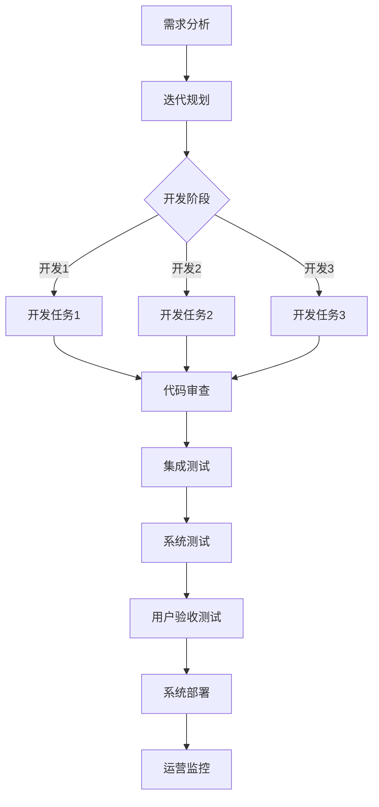

                 

### 文章标题

# 领导力与责任：培养负责任的团队文化

> 关键词：领导力、责任、团队文化、领导理论、负责任、团队管理、企业文化建设

> 摘要：本文探讨了领导力与责任在培养负责任的团队文化中的重要性。通过介绍领导力的核心概念、责任与领导力的关联，以及构建负责任团队文化的策略，本文旨在为企业和团队提供有效的领导力培养和实践指南，以促进团队的高效运作和可持续发展。

-------------------------------------------------------------------

### 引言

在当今快速变化和竞争激烈的企业环境中，领导力和团队文化已成为组织成功的关键因素。领导力不仅关乎如何有效地管理和指导团队，更关乎如何塑造一个积极、负责任的团队文化，从而推动企业的发展和成长。

#### 书籍背景与目的

本篇文章旨在探讨领导力与责任的关系，并详细阐述如何通过培养负责任的团队文化来提升企业的整体绩效。本文分为四个主要部分：

1. **领导力的核心概念**：介绍领导力的定义、发展历程以及不同领导力理论的核心观点。
2. **负责任的团队文化构建**：探讨负责任团队文化的核心要素和构建策略。
3. **领导力与责任的实践应用**：分析领导力与责任在团队管理和项目管理中的应用。
4. **案例分析**：通过成功和失败案例，深入探讨领导力与责任在团队文化培养中的实际效果。

#### 领导力与责任的关系

领导力与责任是相辅相成的概念。领导力不仅要求领导者具备管理团队的能力，更要求他们承担起推动团队发展、维护团队稳定和提升团队绩效的责任。责任领导力强调领导者不仅要对团队的目标和成果负责，还要对团队成员的行为和成长负责。

#### 负责任的团队文化的重要性

负责任的团队文化是推动企业持续发展的重要动力。它不仅能够提高团队的整体绩效，还能够增强团队成员的归属感和忠诚度。在负责任的团队文化中，团队成员能够更加积极主动地参与工作，更加开放地沟通问题，更加高效地解决问题，从而推动企业的创新和进步。

-------------------------------------------------------------------

### 领导力的核心概念

领导力是推动团队和组织发展的关键因素。要理解领导力，首先需要了解其定义、发展历程以及不同领导力理论的核心观点。

#### 领导力的定义

领导力是指领导者通过影响和激励他人，实现共同目标的能力。它不仅仅是一种管理技能，更是一种领导艺术。领导力涵盖了沟通、决策、激励、指导等多个方面，它需要领导者具备敏锐的洞察力、强大的影响力以及持续的创新能力。

#### 领导力的发展历程

领导力的发展历程可以分为几个阶段：

1. **传统领导力**：传统领导力强调领导者的权威和指挥作用，领导者是决策的中心，下属则是执行者。这种领导方式在组织规模较小、环境相对稳定时较为有效，但在复杂多变的环境中，其局限性逐渐显现。

2. **变革型领导力**：变革型领导力强调领导者通过激励和启发团队成员，推动团队和组织实现变革。领导者是变革的推动者，他们通过与团队成员的沟通和互动，激发团队成员的潜力和创造力。

3. **服务型领导力**：服务型领导力强调领导者为团队成员提供支持和资源，以帮助他们实现个人和团队的目标。领导者是服务的提供者，他们关注团队成员的需求和成长，致力于创建一个积极、支持性的工作环境。

4. **情境领导力**：情境领导力认为，领导者的行为应该根据团队成员的不同特点和团队所处的不同情境进行调整。领导者需要具备灵活的领导风格，以适应不同的环境和需求。

#### 经典领导力理论介绍

经典领导力理论包括：

1. **特质理论**：特质理论认为，领导者具有某些独特的个人特质，如智慧、自信、决策力等，这些特质使他们成为领导者。然而，特质理论忽视了环境因素对领导力的影响，因此逐渐被其他理论所取代。

2. **行为理论**：行为理论关注领导者如何通过行为来影响和激励团队成员。行为理论认为，领导者的行为可以分为多种类型，如任务导向型和关系导向型等，不同的领导行为适用于不同的情境。

3. **情境理论**：情境理论认为，领导者的行为应该根据团队和组织所处的情境进行调整。领导者需要具备灵活的领导风格，以适应不同的环境和需求。

4. **变革型领导力理论**：变革型领导力理论强调领导者通过激励和启发团队成员，推动团队和组织实现变革。变革型领导者具有愿景、创新和领导能力，他们能够激发团队成员的潜力和创造力。

5. **服务型领导力理论**：服务型领导力理论强调领导者为团队成员提供支持和资源，以帮助他们实现个人和团队的目标。领导者是服务的提供者，他们关注团队成员的需求和成长。

#### 现代领导力理论的融合与发展

随着领导力理论和实践的不断演进，现代领导力理论开始融合多种观点，形成了更加全面和系统的领导力理论体系。现代领导力理论强调领导者不仅需要具备传统领导力所需的技能和特质，还需要具备适应变化、创新思维和全球视野。

1. **领导力的五个层次**：领导力可以划分为五个层次，即个人领导力、团队领导力、组织领导力、行业领导力和全球领导力。每个层次的领导力都有其独特的特点和挑战。

2. **领导力三角模型**：领导力三角模型认为，领导力由知识、技能和品格三个核心要素构成。领导者需要不断提升自己的知识水平、技能技巧和品格修养。

3. **领导力的四个维度**：领导力可以划分为四个维度，即个人领导力、团队领导力、组织领导力和全球领导力。每个维度的领导力都有其独特的目标和实践方法。

#### 领导力与责任的关联

领导力与责任是密不可分的。领导力的本质在于承担责任，推动团队和组织的发展。责任领导力强调领导者不仅要对自己的行为负责，还要对团队成员的行为负责，对组织的目标和使命负责。责任领导力要求领导者具备强烈的责任感、正直的品格和坚定的信念。

1. **领导者责任的重要性**：领导者责任是领导力的核心，它关系到团队和组织的发展方向和效率。负责任的领导者能够激发团队成员的积极性和创造力，推动组织实现长期目标。

2. **领导者责任的内涵**：领导者责任包括以下几个方面：

   - **个人责任**：领导者需要对自己的行为和决策负责，确保自己的行为符合组织的价值观和道德标准。
   - **团队责任**：领导者需要对团队成员的表现和成长负责，提供必要的支持和资源，帮助团队成员实现个人和团队目标。
   - **组织责任**：领导者需要对组织的目标和使命负责，确保组织在实现目标的过程中，保持稳定和持续的发展。

3. **责任领导力的价值与意义**：责任领导力是推动组织成功的关键因素。负责任的领导者能够建立信任、促进团队合作，提高组织的整体绩效。责任领导力有助于塑造积极的企业文化，推动组织的创新和发展。

-------------------------------------------------------------------

### 负责任的团队文化构建

负责任的团队文化是组织成功的关键因素。要构建负责任的团队文化，需要从核心要素、策略和领导者的角色等方面进行深入探讨。

#### 核心要素

负责任的团队文化包括以下几个核心要素：

1. **信任与透明度**：信任是团队文化的基石。负责任的团队文化强调团队成员之间的信任和尊重，以及组织内部的透明度。团队成员应该能够自由地分享信息、表达观点，并在互相支持和信任的基础上共同工作。

2. **问责制与支持性**：问责制是确保团队成员对工作负责的重要机制。负责任的团队文化要求团队成员对自己的行为和结果负责，同时也提供必要的支持和资源，以帮助他们克服困难和取得成功。

3. **发展与成长**：负责任的团队文化鼓励团队成员不断学习和成长，提供培训和发展机会，帮助团队成员提升技能和知识水平，实现个人和职业发展目标。

4. **共同目标与协作**：共同目标是团队文化的灵魂。负责任的团队文化强调团队成员共同的目标和价值观，通过协作和共同努力，实现组织的目标和使命。

#### 策略

要构建负责任的团队文化，需要采取一系列策略：

1. **领导者的角色与行动**：领导者是团队文化的塑造者和推动者。领导者需要通过自己的言行树立榜样，鼓励团队成员承担责任，建立积极的团队氛围。

2. **制度与文化变革**：建立合理的制度和文化是构建负责任的团队文化的基础。组织需要制定明确的规章制度，确保团队成员能够遵守和履行自己的责任。

3. **员工参与与激励**：员工参与是构建负责任的团队文化的重要手段。组织应该鼓励员工参与决策和问题解决，激发员工的积极性和创造力。同时，通过适当的激励措施，如奖励、晋升等，鼓励员工承担责任，实现个人和团队目标。

4. **持续改进与评估**：负责任的团队文化需要不断改进和优化。组织需要建立有效的评估机制，对团队成员的行为和绩效进行评估，及时发现和解决存在的问题，推动团队文化的持续发展。

#### 领导者的角色与行动

领导者在构建负责任的团队文化中扮演着至关重要的角色。以下是领导者应该采取的一些关键行动：

1. **树立榜样**：领导者需要通过自己的言行树立榜样，展现责任感和诚信，以激励团队成员跟随和效仿。

2. **沟通与反馈**：领导者需要与团队成员保持良好的沟通，及时反馈团队成员的工作表现，提供必要的支持和建议。

3. **授权与支持**：领导者应该给予团队成员足够的自主权，鼓励他们承担更多的责任，并提供必要的资源和支持。

4. **培养责任感**：领导者需要通过培训和教育，培养团队成员的责任感，让他们明白自己在团队和组织中的角色和责任。

5. **激励与奖励**：领导者应该通过适当的激励措施，如奖励、晋升等，鼓励团队成员承担责任，实现个人和团队目标。

#### 制度与文化变革

制度和文化变革是构建负责任的团队文化的重要手段。以下是组织可以采取的一些策略：

1. **建立明确的规章制度**：组织需要制定明确的规章制度，确保团队成员了解自己在团队和组织中的角色和责任，以及应该遵守的行为准则。

2. **加强监督与考核**：组织需要建立有效的监督和考核机制，对团队成员的行为和绩效进行评估，确保他们能够履行自己的责任。

3. **优化沟通渠道**：组织需要优化沟通渠道，确保团队成员能够及时、准确地获取信息，增强团队的协作和沟通效果。

4. **推动文化变革**：组织需要通过培训、宣传活动等方式，推动文化变革，树立责任意识和团队合作精神，营造积极、负责任的团队氛围。

#### 员工参与与激励

员工参与与激励是构建负责任的团队文化的重要手段。以下是组织可以采取的一些策略：

1. **鼓励员工参与决策**：组织应该鼓励员工参与决策和问题解决，让他们感受到自己的价值和重要性。

2. **提供发展机会**：组织应该提供培训和发展机会，帮助员工提升技能和知识水平，实现个人和职业发展目标。

3. **建立公平的奖励机制**：组织应该建立公平、透明的奖励机制，对员工的绩效和贡献给予认可和奖励。

4. **激励员工承担责任**：组织应该通过适当的激励措施，如奖励、晋升等，鼓励员工承担责任，实现个人和团队目标。

#### 持续改进与评估

持续改进与评估是构建负责任的团队文化的重要环节。以下是组织可以采取的一些策略：

1. **定期评估团队绩效**：组织需要定期评估团队的绩效和贡献，及时发现和解决存在的问题，确保团队在正确的轨道上运行。

2. **收集员工反馈**：组织需要收集员工的反馈和建议，了解他们的需求和工作状况，为改进团队文化提供依据。

3. **培训与教育**：组织应该定期进行培训和教育，提高员工的责任意识和团队合作能力，推动团队文化的持续发展。

4. **优化制度与流程**：组织需要根据评估结果和员工反馈，不断优化制度和流程，消除不利于团队文化发展的因素，确保团队文化的健康和持续发展。

### 责任领导力的实践案例

以下是几个责任领导力的实践案例：

1. **案例一：某互联网公司CEO的领导风格**：该公司的CEO在领导过程中，始终坚持责任领导力原则，对团队成员的工作和成长负责，通过透明的沟通和合理的激励措施，激发团队成员的积极性和创造力，取得了显著的业绩。

2. **案例二：某跨国公司团队经理的管理策略**：该团队经理通过建立清晰的规章制度和绩效考核体系，确保团队成员了解自己的角色和责任，同时提供必要的支持和资源，帮助团队成员克服困难，取得了优异的团队绩效。

3. **案例三：某初创公司联合创始人的创业经历**：该联合创始人在创业过程中，始终坚持责任领导力原则，对团队成员的需求和成长负责，通过开放透明的沟通和公平的激励措施，成功打造了一支高效、负责任的创业团队，使公司快速成长。

### 总结

负责任的团队文化是组织成功的关键因素。通过构建负责任的团队文化，组织可以激发团队成员的积极性和创造力，提高团队的整体绩效，实现组织的目标和使命。领导者在这个过程中扮演着至关重要的角色，他们需要通过自己的言行树立榜样，推动团队成员承担责任，建立积极的团队氛围。同时，组织需要建立合理的制度和文化，提供必要的支持和资源，确保团队成员能够履行自己的责任。通过持续改进和评估，组织可以不断完善负责任的团队文化，推动团队的长期发展和成功。

-------------------------------------------------------------------

### 领导力与责任的实践应用

在现实工作和项目中，领导力与责任的有效运用对于团队的高效运作和项目的成功至关重要。以下将探讨领导力与责任在团队管理和项目管理中的应用。

#### 团队管理中的应用

1. **团队组建与领导**

   在团队组建阶段，领导者需要明确团队的目标、任务和成员的角色，确保每个成员都清楚自己的职责和期望。以下是一个团队组建的步骤：

   ```mermaid
   graph TD
   A[确定团队目标] --> B[分配任务与角色]
   B --> C[组建团队]
   C --> D[明确沟通机制]
   D --> E[培训与发展]
   ```

   伪代码示例：
   ```python
   function build_team(goal, tasks, roles):
       assign_tasks_to_members(tasks, roles)
       establish_communication_mechanisms()
       provide_training_and_development()
       return team
   ```

2. **冲突管理与解决**

   团队成员之间的冲突是不可避免的，有效的冲突管理能够促进团队的和谐与进步。以下是一个冲突解决的流程：

   ```mermaid
   graph TD
   A[识别冲突] --> B[分析冲突原因]
   B --> C[协商解决方案]
   C --> D[执行解决方案]
   D --> E[评估结果]
   ```

   伪代码示例：
   ```python
   function manage_conflicts(conflict):
       analyze_conflict_reasons(conflict)
       negotiate_solution(conflict)
       implement_solution(conflict)
       evaluate_solution(conflict)
   ```

3. **团队绩效评估与激励**

   团队绩效评估是衡量团队工作成效的重要手段。以下是一个绩效评估的流程：

   ```mermaid
   graph TD
   A[设定绩效指标] --> B[收集数据]
   B --> C[分析绩效]
   C --> D[反馈与改进]
   D --> E[激励与奖励]
   ```

   伪代码示例：
   ```python
   function evaluate_team_performance(goal, performance_metrics):
       collect_data(performance_metrics)
       analyze_performance(data)
       provide_feedback(data)
       implement_improvements(data)
       reward_team_if_necessary()
   ```

4. **团队学习与创新能力提升**

   团队学习和创新能力是团队持续发展的重要动力。以下是一个团队学习与创新能力提升的策略：

   ```mermaid
   graph TD
   A[制定学习计划] --> B[实施学习活动]
   B --> C[分享学习成果]
   C --> D[评估学习效果]
   D --> E[持续改进]
   ```

   伪代码示例：
   ```python
   function enhance_team_innovation(learning_plan):
       execute_learning_activities(learning_plan)
       share_learning_outcomes()
       evaluate_learning_effects()
       continue_improving()
   ```

#### 项目管理中的应用

1. **项目管理中的领导角色**

   项目经理在项目管理中扮演着关键的领导角色。以下是一个项目经理的角色描述：

   ```mermaid
   graph TD
   A[项目规划] --> B[资源分配]
   B --> C[风险管理]
   C --> D[进度监控]
   D --> E[团队沟通]
   E --> F[问题解决]
   ```

   伪代码示例：
   ```python
   class ProjectManager:
       def plan_project(self, project):
           allocate_resources(project)
           manage_risk(project)
           monitor_progress(project)
           communicate_with_team()
           resolve_issues(project)
   ```

2. **项目责任划分与承担**

   在项目管理中，明确项目责任是确保项目顺利进行的重要前提。以下是一个责任划分的示例：

   ```mermaid
   graph TD
   A[项目目标] --> B[任务分解]
   B --> C[责任分配]
   C --> D[责任确认]
   D --> E[责任监督]
   ```

   伪代码示例：
   ```python
   def assign_project_responsibilities(project, team_members):
       decompose_tasks(project)
       allocate_responsibilities_to_members(project, team_members)
       confirm_responsibilities()
       monitor_responsibilities()
   ```

3. **项目风险管理**

   项目风险管理是项目管理中不可或缺的一部分。以下是一个风险管理流程：

   ```mermaid
   graph TD
   A[识别风险] --> B[评估风险]
   B --> C[规划应对策略]
   C --> D[执行应对策略]
   D --> E[监控风险]
   ```

   伪代码示例：
   ```python
   def manage_project_risks(project):
       identify_risks(project)
       evaluate_risks(project)
       plan_response_strategies(project)
       execute_response_strategies(project)
       monitor_risks(project)
   ```

4. **项目沟通与协作**

   项目沟通与协作是确保项目顺利进行的关键。以下是一个沟通与协作流程：

   ```mermaid
   graph TD
   A[制定沟通计划] --> B[沟通渠道建立]
   B --> C[信息传递]
   C --> D[反馈收集]
   D --> E[问题解决]
   ```

   伪代码示例：
   ```python
   def manage_project_communication(project):
       establish_communication_channels(project)
       transmit_information(project)
       collect_feedback(project)
       resolve_issues(project)
   ```

### 实际案例分析和详细讲解剖析

以下是一个实际项目案例的分析和详细讲解：

**案例：某电商平台的系统升级项目**

**背景介绍**：
某电商平台需要对其核心系统进行升级，以提高系统的稳定性和扩展性，以满足日益增长的客户需求。项目团队由开发、测试、运维等多个部门组成，涉及多个技术领域。

**核心概念与联系**：

- **敏捷开发**：项目采用敏捷开发方法，通过迭代和增量开发，确保系统能够快速适应市场变化。
- **DevOps**：项目采用DevOps文化，实现开发和运维的紧密协作，提高系统的部署和运营效率。

**流程图**：



**伪代码示例**：

```python
def system_upgrade_project():
    analyze_requirements()
    plan_iterations()
    for iteration in iterations:
        develop_tasks(iteration)
        code_review()
        integrate_tests()
        system_tests()
        user_acceptance_tests()
        deploy_system()
        monitor_operations()
```

**数学模型和公式**：

- **开发效率**：$\text{开发效率} = \frac{\text{完成功能点}}{\text{开发时间}}$
- **系统稳定性**：$\text{系统稳定性} = \frac{\text{成功运行时间}}{\text{总运行时间}}$

**详细讲解和举例说明**：

1. **需求分析**：项目团队与业务部门密切合作，收集和分析系统升级的需求，确保开发工作符合业务需求。

2. **迭代规划**：项目采用迭代开发方法，每个迭代周期包括需求分析、开发、测试和部署等环节。

3. **开发阶段**：项目团队根据迭代计划，分阶段完成开发任务，每个任务完成后进行代码审查，确保代码质量。

4. **集成测试**：开发完成后，进行集成测试，确保各个模块能够正常工作。

5. **系统测试**：集成测试通过后，进行系统测试，包括功能测试、性能测试等，确保系统稳定可靠。

6. **用户验收测试**：用户验收测试由业务部门进行，确保系统符合业务需求，并达到预期效果。

7. **系统部署**：系统测试通过后，进行系统部署，包括上线、监控和运营等环节。

8. **运营监控**：系统上线后，进行24小时运营监控，确保系统稳定运行，并及时处理可能出现的问题。

**项目小结**：

通过本次系统升级项目，项目团队成功实现了系统的高效稳定运行，提高了客户满意度，同时也积累了宝贵的经验，为未来项目提供了有益的参考。

### 最佳实践 Tips

1. **明确项目目标**：确保项目团队对项目目标有清晰的认识，有助于提高团队协作和执行力。

2. **建立有效的沟通机制**：确保团队成员之间的沟通畅通，避免信息孤岛和误解。

3. **合理分配任务和责任**：根据团队成员的能力和兴趣，合理分配任务和责任，提高团队效率。

4. **持续学习和改进**：鼓励团队成员不断学习和提升技能，通过反馈和改进，提高项目质量。

5. **关注项目风险管理**：提前识别和评估项目风险，制定应对策略，确保项目顺利进行。

### 小结

通过本文的探讨，我们可以看到领导力与责任在团队管理和项目管理中的重要性。有效的领导力和负责任的团队文化能够提高团队的整体绩效，推动项目的成功。在实际应用中，领导者需要通过不断的实践和改进，提升自己的领导力和团队管理水平，以实现组织的目标和使命。

### 注意事项

1. **尊重团队成员**：领导者应该尊重团队成员的意见和贡献，鼓励他们参与决策和问题解决。

2. **公平对待**：在团队管理和项目管理中，要公平对待每一位团队成员，避免偏见和歧视。

3. **持续关注**：领导者需要持续关注团队成员的工作状况和需求，提供必要的支持和帮助。

4. **沟通与反馈**：保持良好的沟通与反馈机制，及时了解团队成员的工作进展和问题，共同寻找解决方案。

### 拓展阅读

1. **《敏捷开发实践指南》**：了解敏捷开发方法，提高项目管理和团队协作效率。
2. **《团队协作的艺术》**：学习团队协作技巧，提升团队整体绩效。
3. **《项目管理知识体系指南》**：掌握项目管理的基本原理和方法，提高项目管理能力。

-------------------------------------------------------------------

### 结论

本文围绕领导力与责任，深入探讨了负责任的团队文化的构建和领导力在团队管理和项目管理中的应用。通过分析领导力的核心概念、责任领导力的内涵以及负责任团队文化的核心要素，我们认识到领导力和责任是相辅相成的，负责任的团队文化是组织成功的关键。

首先，领导力是推动团队和组织发展的核心力量，它不仅涉及领导者个人能力和素质的提升，还需要领导者具备强大的责任感和使命感。责任领导力强调领导者不仅要对自己负责，还要对团队成员、组织目标和使命负责，以实现组织的高效运作和可持续发展。

其次，负责任的团队文化是推动组织成功的重要动力。通过构建信任与透明度、问责制与支持性、发展与成长、共同目标与协作等核心要素，组织能够形成积极、高效的团队氛围，激发团队成员的积极性和创造力。

在实际应用中，领导者需要通过明确的团队组建、有效的冲突管理、公平的绩效评估、持续的学习与创新等方式，培养和巩固负责任的团队文化。同时，项目管理和团队管理中的领导力运用，如团队沟通与协作、责任划分与风险管理等，都是确保项目成功和团队高效运作的关键。

未来，随着组织环境的变化和挑战的增多，领导力和负责任的团队文化将面临新的机遇和挑战。领导者需要不断学习和适应，提升自己的领导力和责任意识，推动团队和组织向更高的目标迈进。

总之，领导力与责任是构建负责任的团队文化的重要基石，它们不仅关系到组织的短期绩效，更影响组织的长期发展和竞争力。通过有效的领导力培养和实践，组织可以打造一支高效、负责任的团队，实现可持续发展和成功。

### 附录

#### A.1 领导力与责任相关资源

1. **《领导力：理论与实践》**：一本经典的领导力教材，详细介绍了领导力的定义、理论和实践方法。
2. **《责任领导：实践与案例》**：探讨责任领导力的理论和实践，提供丰富的案例和分析。
3. **《团队管理实战》**：涵盖团队管理的各个方面，包括团队组建、沟通、绩效评估等。

#### A.2 推荐阅读与进一步学习

1. **《敏捷开发实践指南》**：了解敏捷开发方法，提高项目管理和团队协作效率。
2. **《创新与企业家精神》**：探讨创新思维和企业家精神，激发团队的创造力和创新能力。
3. **《项目管理知识体系指南》**：掌握项目管理的基本原理和方法，提高项目管理能力。

#### A.3 参考文献

1. **约翰·P·科特（John P. Kotter）**，《领导力：实践与原则》（Leading Change）
2. **彼得·德鲁克（Peter Drucker）**，《管理的实践》（The Practice of Management）
3. **詹姆斯·M·基利（James M. Kilcullen）**，《变革型领导力》（Transforming Leadership）
4. **安妮·麦格劳（Anne McGraw）**，《责任领导：实践与案例》（Accountable Leadership: Practices and Cases）
5. **汤姆·彼得斯（Tom Peters）**，《团队协作的艺术》（The Art of Collaboration）

