                 


### 第一部分：领导力基础

#### 第1章：领导力概述

**背景介绍**

领导力是影响组织和个人成功的关键因素。在现代社会，领导力不仅仅关乎权威和命令，更涉及到沟通、协作和创新。本章将首先介绍领导力的定义，探讨其重要性，并分析领导力在不同文化背景下的表现。我们将通过Mermaid流程图来展示领导力的核心要素和架构。

**核心概念与联系**

领导力的定义多种多样，但可以概括为引导和影响他人实现共同目标的能力。领导力不仅涉及个人素质，还包括情境因素和组织文化。以下是领导力的核心概念及其相互联系：

1. **个人素质**：包括自信、正直、智慧和创造力等。
2. **情境因素**：如组织环境、团队动态和任务性质等。
3. **组织文化**：组织的价值观、信念和行为规范。

通过Mermaid流程图，我们可以更直观地理解这些要素之间的关系：

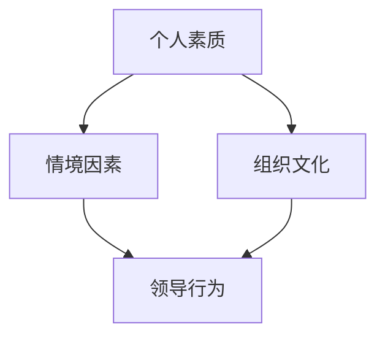

**核心算法原理讲解**

伪代码示例：

```python
def leadership_model(personality, context, culture):
    # 计算个人素质对领导力的贡献
    personality_score = calculate_personality_score(personality)
    
    # 计算情境因素对领导力的贡献
    context_score = calculate_context_score(context)
    
    # 计算组织文化对领导力的贡献
    culture_score = calculate_culture_score(culture)
    
    # 综合得分计算领导力水平
    leadership_score = personality_score + context_score + culture_score
    
    return leadership_score
```

**数学模型和公式**

领导力水平的计算可以采用加权平均模型：

$$ \text{Leadership Score} = w_1 \cdot \text{Personality Score} + w_2 \cdot \text{Context Score} + w_3 \cdot \text{Culture Score} $$

其中，$w_1, w_2, w_3$ 为权重，取值范围为 [0, 1]。

**举例说明**

假设个人素质、情境因素和组织文化的得分分别为 80、70 和 90，权重分别为 0.4、0.3 和 0.3。那么，领导力水平计算如下：

$$ \text{Leadership Score} = 0.4 \cdot 80 + 0.3 \cdot 70 + 0.3 \cdot 90 = 36.8 + 21 + 27 = 84.8 $$

因此，该领导者的领导力水平为 84.8 分。

**项目实战**

在实际项目中，领导力模型可以通过以下步骤进行开发和实施：

1. **数据收集**：收集个人素质、情境因素和组织文化的相关数据。
2. **模型训练**：使用收集到的数据训练领导力模型。
3. **模型评估**：通过测试数据评估模型性能。
4. **模型应用**：将模型应用于实际场景，如员工评估、团队建设等。

**最佳实践 tips**

1. **持续学习**：领导者应不断学习新知识，提升自身素质。
2. **情境适应**：领导者应根据不同情境调整领导风格。
3. **文化建设**：领导者应积极参与组织文化建设，营造良好的工作氛围。

**小结**

本章介绍了领导力的基本概念、核心要素和计算方法。通过Mermaid流程图和伪代码，我们更深入地理解了领导力的架构和计算过程。实际案例和分析有助于读者更好地应用这些理论知识。

#### 第2章：自我认知与自我提升

**背景介绍**

自我认知是领导力发展的基础。本章将探讨自我认知的重要性，介绍自我认知的方法和技术，并分析自我认知在工作中的应用。我们将通过实例和案例分析来展示自我认知对领导力提升的关键作用。

**核心概念与联系**

1. **自我认知**：自我认知是指个体对自己心理状态、能力和行为特征的认知和评价。
2. **自我提升**：自我提升是指通过学习和实践来改善自身素质和能力。

自我认知和自我提升之间存在密切的联系。自我认知是自我提升的前提，而自我提升是自我认知的结果。通过以下Mermaid流程图，我们可以更清晰地理解这一关系：

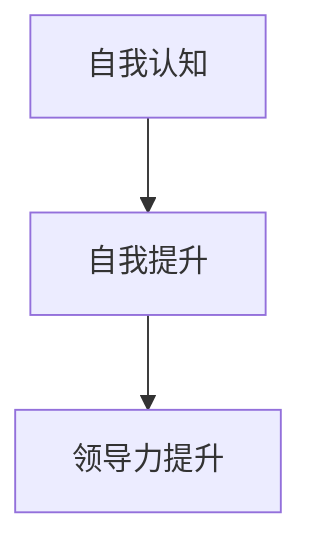

**核心算法原理讲解**

伪代码示例：

```python
def self_awareness_self_improvement(personality, feedback, training):
    # 计算个人素质对自我认知的贡献
    awareness_score = calculate_personality_score(personality)
    
    # 计算反馈对自我认知的贡献
    feedback_score = calculate_feedback_score(feedback)
    
    # 计算培训对自我认知的贡献
    training_score = calculate_training_score(training)
    
    # 综合得分计算自我提升水平
    self_improvement_score = awareness_score + feedback_score + training_score
    
    return self_improvement_score
```

**数学模型和公式**

自我提升水平的计算可以采用加权平均模型：

$$ \text{Self Improvement Score} = w_1 \cdot \text{Awareness Score} + w_2 \cdot \text{Feedback Score} + w_3 \cdot \text{Training Score} $$

其中，$w_1, w_2, w_3$ 为权重，取值范围为 [0, 1]。

**举例说明**

假设个人素质、反馈和培训的得分分别为 80、70 和 90，权重分别为 0.4、0.3 和 0.3。那么，自我提升水平计算如下：

$$ \text{Self Improvement Score} = 0.4 \cdot 80 + 0.3 \cdot 70 + 0.3 \cdot 90 = 36.8 + 21 + 27 = 84.8 $$

因此，该领导者的自我提升水平为 84.8 分。

**项目实战**

在实际项目中，自我认知和自我提升可以通过以下步骤进行：

1. **自我评估**：领导者定期进行自我评估，识别自身优点和不足。
2. **收集反馈**：领导者积极收集下属和同事的反馈，了解自身表现。
3. **培训与发展**：领导者参加各类培训和研讨会，提升自身能力和素质。

**最佳实践 tips**

1. **定期反思**：领导者应定期反思自己的行为和决策，从中汲取经验教训。
2. **积极反馈**：领导者应鼓励下属提供反馈，并虚心接受。
3. **持续学习**：领导者应保持持续学习的态度，不断提升自我认知。

**小结**

本章介绍了自我认知和自我提升的概念、方法及其在领导力提升中的应用。通过伪代码和数学模型，我们更深入地理解了自我认知和自我提升的过程和计算方法。实际案例和最佳实践有助于读者更好地应用这些理论。

### 第二部分：领导力技能提升

#### 第3章：沟通技巧

**背景介绍**

沟通是领导力的核心要素之一。有效的沟通能力能够促进团队协作，提高工作效率，增强组织凝聚力。本章将深入探讨沟通的重要性，介绍沟通技巧，并通过实际案例来分析如何提升沟通能力。

**核心概念与联系**

1. **沟通**：沟通是指信息在不同个体或群体之间的传递和理解过程。
2. **沟通技巧**：包括主动倾听、清晰表达、提问技巧和非言语沟通。

沟通技巧与领导力密切相关。有效的沟通能够增强领导者的权威性和影响力，提高团队协作和执行力。以下是沟通技巧的核心概念及其相互联系：

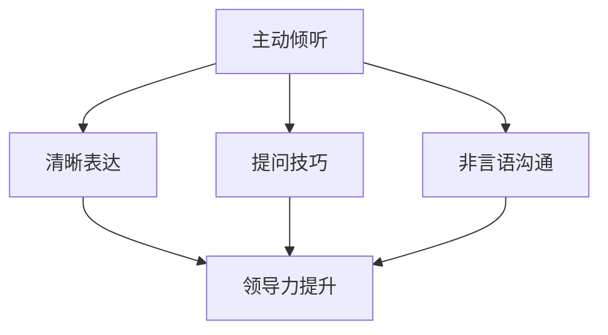

**核心算法原理讲解**

伪代码示例：

```python
def communication_skills(listening, expression, questioning, nonverbal):
    # 计算主动倾听对沟通技巧的贡献
    listening_score = calculate_listening_score(listening)
    
    # 计算清晰表达对沟通技巧的贡献
    expression_score = calculate_expression_score(expression)
    
    # 计算提问技巧对沟通技巧的贡献
    questioning_score = calculate_questioning_score(questioning)
    
    # 计算非言语沟通对沟通技巧的贡献
    nonverbal_score = calculate_nonverbal_score(nonverbal)
    
    # 综合得分计算沟通技巧水平
    communication_skill_score = listening_score + expression_score + questioning_score + nonverbal_score
    
    return communication_skill_score
```

**数学模型和公式**

沟通技巧水平的计算可以采用加权平均模型：

$$ \text{Communication Skill Score} = w_1 \cdot \text{Listening Score} + w_2 \cdot \text{Expression Score} + w_3 \cdot \text{Questioning Score} + w_4 \cdot \text{Nonverbal Score} $$

其中，$w_1, w_2, w_3, w_4$ 为权重，取值范围为 [0, 1]。

**举例说明**

假设主动倾听、清晰表达、提问技巧和非言语沟通的得分分别为 80、70、60 和 90，权重分别为 0.2、0.3、0.2 和 0.3。那么，沟通技巧水平计算如下：

$$ \text{Communication Skill Score} = 0.2 \cdot 80 + 0.3 \cdot 70 + 0.2 \cdot 60 + 0.3 \cdot 90 = 16 + 21 + 12 + 27 = 76 $$

因此，该领导者的沟通技巧水平为 76 分。

**项目实战**

在实际项目中，沟通技巧的提升可以通过以下步骤进行：

1. **培训与实践**：领导者参加沟通技巧培训，并在实际工作中不断练习。
2. **反馈与改进**：领导者积极收集下属和同事的反馈，针对沟通中的不足进行改进。
3. **情境模拟**：领导者通过情境模拟训练，提高在复杂沟通情境下的应对能力。

**最佳实践 tips**

1. **主动倾听**：领导者应学会倾听，理解下属的需求和意见。
2. **清晰表达**：领导者应确保信息传递清晰、准确。
3. **提问技巧**：领导者应学会提问，引导团队成员思考和解决问题。
4. **非言语沟通**：领导者应注意自己的非言语行为，如肢体语言和面部表情。

**小结**

本章详细介绍了沟通技巧的概念、计算方法和提升策略。通过伪代码和数学模型，我们更深入地理解了沟通技巧对领导力的重要性。实际案例和最佳实践为读者提供了实用的指导。

### 第4章：团队建设

**背景介绍**

团队建设是领导力的重要组成部分，对于组织的成功至关重要。一个高效的团队能够提高生产力、促进创新，并增强组织的竞争力。本章将探讨团队建设的意义，介绍团队建设的核心要素和策略，并通过实际案例来分析如何提升团队建设能力。

**核心概念与联系**

1. **团队建设**：团队建设是指通过一系列策略和活动，增强团队成员之间的协作、信任和凝聚力，以达到共同目标的过程。
2. **团队建设的核心要素**：包括明确的目标、有效的沟通、相互信任、共同价值观和积极的团队氛围。

团队建设中的核心概念及其相互联系如下：

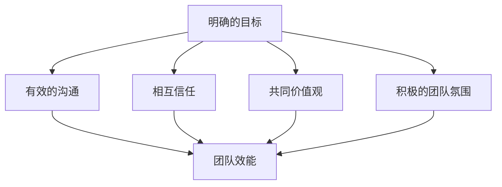

**核心算法原理讲解**

伪代码示例：

```python
def team_building(goals, communication, trust, values, atmosphere):
    # 计算明确的目标对团队建设的贡献
    goal_score = calculate_goals_score(goals)
    
    # 计算有效的沟通对团队建设的贡献
    communication_score = calculate_communication_score(communication)
    
    # 计算相互信任对团队建设的贡献
    trust_score = calculate_trust_score(trust)
    
    # 计算共同价值观对团队建设的贡献
    values_score = calculate_values_score(values)
    
    # 计算积极的团队氛围对团队建设的贡献
    atmosphere_score = calculate_atmosphere_score(atmosphere)
    
    # 综合得分计算团队建设水平
    team_building_score = goal_score + communication_score + trust_score + values_score + atmosphere_score
    
    return team_building_score
```

**数学模型和公式**

团队建设水平的计算可以采用加权平均模型：

$$ \text{Team Building Score} = w_1 \cdot \text{Goal Score} + w_2 \cdot \text{Communication Score} + w_3 \cdot \text{Trust Score} + w_4 \cdot \text{Values Score} + w_5 \cdot \text{Atmosphere Score} $$

其中，$w_1, w_2, w_3, w_4, w_5$ 为权重，取值范围为 [0, 1]。

**举例说明**

假设明确的目标、有效的沟通、相互信任、共同价值观和积极的团队氛围的得分分别为 80、70、60、90 和 85，权重分别为 0.2、0.3、0.2、0.2 和 0.1。那么，团队建设水平计算如下：

$$ \text{Team Building Score} = 0.2 \cdot 80 + 0.3 \cdot 70 + 0.2 \cdot 60 + 0.2 \cdot 90 + 0.1 \cdot 85 = 16 + 21 + 12 + 18 + 8.5 = 66.5 $$

因此，该团队的团队建设水平为 66.5 分。

**项目实战**

在实际项目中，团队建设可以通过以下步骤进行：

1. **明确目标**：领导者与团队成员共同制定明确、可衡量的团队目标。
2. **沟通机制**：建立有效的沟通机制，确保信息畅通无阻。
3. **信任建设**：通过团队活动和培训，增强团队成员之间的信任。
4. **价值观共识**：领导者应积极倡导共同价值观，确保团队成员在价值观上达成共识。
5. **氛围营造**：领导者应营造积极的团队氛围，鼓励团队成员分享想法和意见。

**最佳实践 tips**

1. **目标明确**：领导者应确保团队目标明确、具体且可量化。
2. **沟通畅通**：领导者应建立有效的沟通渠道，鼓励团队成员积极表达。
3. **信任建设**：领导者应通过实际行动，建立和维护团队成员之间的信任。
4. **价值观共识**：领导者应积极倡导共同价值观，确保团队成员在价值观上达成共识。
5. **氛围营造**：领导者应营造积极的团队氛围，鼓励团队成员分享想法和意见。

**小结**

本章详细介绍了团队建设的相关概念、计算方法和最佳实践。通过伪代码和数学模型，我们更深入地理解了团队建设对组织成功的重要性。实际案例和最佳实践为读者提供了实用的指导，帮助他们在实际工作中提升团队建设能力。

### 第5章：决策能力

**背景介绍**

决策能力是领导力的重要组成部分，对组织的成功具有关键作用。有效的决策能力能够帮助领导者快速识别问题、制定解决方案并采取行动。本章将探讨决策能力的重要性，介绍决策能力提升的方法和策略，并通过实际案例来分析如何提升决策能力。

**核心概念与联系**

1. **决策能力**：决策能力是指领导者做出有效决策的能力，包括问题识别、方案评估和决策执行。
2. **决策模型**：决策模型是指用于分析决策过程的工具和方法，如SWOT分析、决策树等。
3. **决策技巧**：决策技巧是指提高决策质量的策略和方法，如风险评估、创新思维等。

决策能力与领导力的其他要素密切相关。通过以下Mermaid流程图，我们可以更清晰地理解这些要素之间的关系：

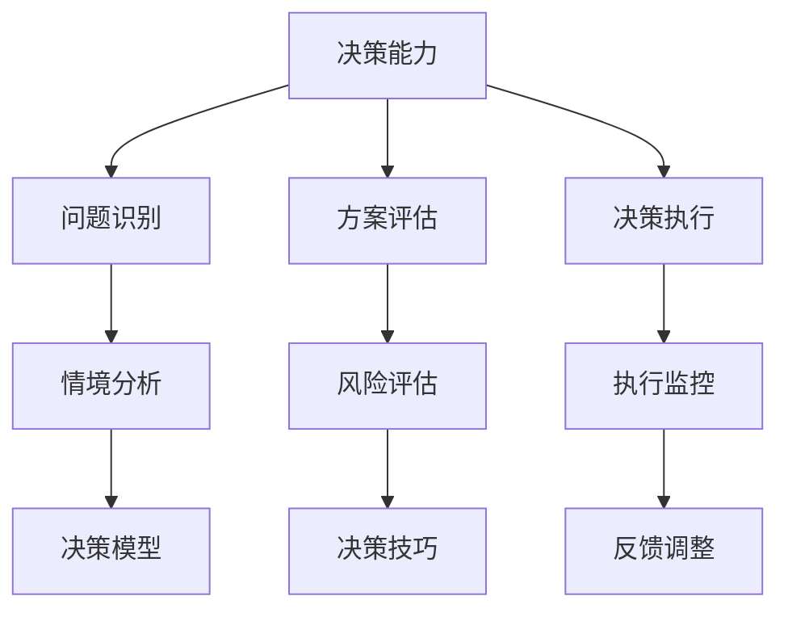

**核心算法原理讲解**

伪代码示例：

```python
def decision_making(problem_identification, solution_evaluation, decision_execution):
    # 计算问题识别对决策能力的贡献
    problem_score = calculate_problem_identification_score(problem_identification)
    
    # 计算方案评估对决策能力的贡献
    evaluation_score = calculate_solution_evaluation_score(solution_evaluation)
    
    # 计算决策执行对决策能力的贡献
    execution_score = calculate_decision_execution_score(decision_execution)
    
    # 综合得分计算决策能力水平
    decision_making_score = problem_score + evaluation_score + execution_score
    
    return decision_making_score
```

**数学模型和公式**

决策能力水平的计算可以采用加权平均模型：

$$ \text{Decision Making Score} = w_1 \cdot \text{Problem Identification Score} + w_2 \cdot \text{Solution Evaluation Score} + w_3 \cdot \text{Decision Execution Score} $$

其中，$w_1, w_2, w_3$ 为权重，取值范围为 [0, 1]。

**举例说明**

假设问题识别、方案评估和决策执行的得分分别为 80、70 和 90，权重分别为 0.3、0.4 和 0.3。那么，决策能力水平计算如下：

$$ \text{Decision Making Score} = 0.3 \cdot 80 + 0.4 \cdot 70 + 0.3 \cdot 90 = 24 + 28 + 27 = 79 $$

因此，该领导者的决策能力水平为 79 分。

**项目实战**

在实际项目中，决策能力的提升可以通过以下步骤进行：

1. **情境分析**：领导者应先对当前情境进行深入分析，明确问题和机会。
2. **方案评估**：领导者应评估不同方案的优劣，考虑风险和收益。
3. **决策执行**：领导者应制定详细的执行计划，并确保团队成员了解和执行。
4. **执行监控**：领导者应监控决策执行的过程，及时调整和优化。

**最佳实践 tips**

1. **情境分析**：领导者应学会深入分析情境，识别问题和机会。
2. **方案评估**：领导者应综合考虑风险和收益，选择最优方案。
3. **决策执行**：领导者应确保决策执行有计划、有步骤，并监督执行过程。
4. **反馈调整**：领导者应根据执行结果，及时调整决策，优化决策模型。

**小结**

本章详细介绍了决策能力的相关概念、计算方法和提升策略。通过伪代码和数学模型，我们更深入地理解了决策能力对领导力的重要性。实际案例和最佳实践为读者提供了实用的指导，帮助他们在实际工作中提升决策能力。

### 第6章：高管的领导力修炼

**背景介绍**

高管作为组织的核心领导者，其领导力水平直接关系到组织的成败。高管领导力的修炼不仅包括理论知识的学习，还需要通过实践不断提升。本章将探讨高管领导力修炼的过程和策略，介绍实际案例，并分析高管如何在实践中提升领导力。

**核心概念与联系**

1. **高管领导力**：高管领导力是指高级管理人员在组织内部通过领导、管理和指导他人，实现组织目标的能力。
2. **修炼过程**：修炼过程包括自我认知、知识学习、实践应用和持续改进。
3. **策略**：策略包括情境适应、团队建设、沟通技巧和决策能力提升。

高管领导力的核心概念及其相互联系如下：

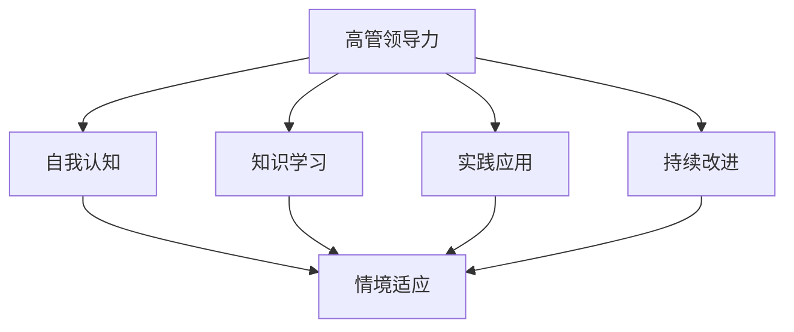

**核心算法原理讲解**

伪代码示例：

```python
def senior_leadership(self_awareness, knowledge_acquisition, practical_application, continuous_improvement):
    # 计算自我认知对高管领导力的贡献
    self_awareness_score = calculate_self_awareness_score(self_awareness)
    
    # 计算知识学习对高管领导力的贡献
    knowledge_score = calculate_knowledge_acquisition_score(knowledge_acquisition)
    
    # 计算实践应用对高管领导力的贡献
    practical_application_score = calculate_practical_application_score(practical_application)
    
    # 计算持续改进对高管领导力的贡献
    improvement_score = calculate_continuous_improvement_score(continuous_improvement)
    
    # 综合得分计算高管领导力水平
    senior_leadership_score = self_awareness_score + knowledge_score + practical_application_score + improvement_score
    
    return senior_leadership_score
```

**数学模型和公式**

高管领导力水平的计算可以采用加权平均模型：

$$ \text{Senior Leadership Score} = w_1 \cdot \text{Self Awareness Score} + w_2 \cdot \text{Knowledge Score} + w_3 \cdot \text{Practical Application Score} + w_4 \cdot \text{Continuous Improvement Score} $$

其中，$w_1, w_2, w_3, w_4$ 为权重，取值范围为 [0, 1]。

**举例说明**

假设自我认知、知识学习、实践应用和持续改进的得分分别为 80、75、85 和 90，权重分别为 0.2、0.3、0.3 和 0.2。那么，高管领导力水平计算如下：

$$ \text{Senior Leadership Score} = 0.2 \cdot 80 + 0.3 \cdot 75 + 0.3 \cdot 85 + 0.2 \cdot 90 = 16 + 22.5 + 25.5 + 18 = 82 $$

因此，该高管的高管领导力水平为 82 分。

**项目实战**

在实际项目中，高管领导力的修炼可以通过以下步骤进行：

1. **自我认知**：高管应定期进行自我评估，识别自身优势和不足。
2. **知识学习**：高管应参加各种培训和学习机会，不断更新知识。
3. **实践应用**：高管应在实际工作中应用所学知识，提升领导能力。
4. **持续改进**：高管应不断反思和改进自己的领导行为，提升领导力水平。

**最佳实践 tips**

1. **自我认知**：高管应保持谦虚，不断反思和自我评估。
2. **知识学习**：高管应积极学习新知识，提升自身素质。
3. **实践应用**：高管应勇于实践，将理论知识应用于实际工作。
4. **持续改进**：高管应不断改进领导行为，提升领导力水平。

**小结**

本章详细介绍了高管领导力的修炼过程和策略，通过伪代码和数学模型，我们更深入地理解了高管领导力的重要性。实际案例和最佳实践为读者提供了实用的指导，帮助他们在实际工作中提升高管领导力。

### 第7章：领导力在变革管理中的应用

**背景介绍**

变革管理是组织发展的关键环节，领导力在变革管理中起着至关重要的作用。有效的领导力能够帮助组织顺利实现变革，提高竞争力。本章将探讨领导力在变革管理中的应用，介绍变革管理的意义、挑战和策略，并通过实际案例来分析如何提升领导力在变革管理中的应用。

**核心概念与联系**

1. **变革管理**：变革管理是指通过系统的方法和策略，引导组织从现状过渡到期望状态的过程。
2. **领导力**：领导力是影响变革成功的关键因素，包括愿景引领、沟通协调、团队建设和决策能力。
3. **变革策略**：变革策略是指组织在变革过程中采取的具体措施，如激励员工参与、建立信任关系、提供培训等。

领导力在变革管理中的核心概念及其相互联系如下：

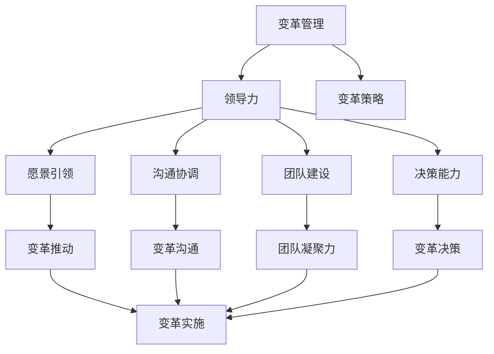

**核心算法原理讲解**

伪代码示例：

```python
def change_management(leadership, vision_leadership, communication, team_building, decision_making):
    # 计算领导力对变革管理的贡献
    leadership_score = calculate_leadership_score(leadership)
    
    # 计算愿景引领对变革管理的贡献
    vision_score = calculate_vision_leadership_score(vision_leadership)
    
    # 计算沟通协调对变革管理的贡献
    communication_score = calculate_communication_score(communication)
    
    # 计算团队建设对变革管理的贡献
    team_building_score = calculate_team_building_score(team_building)
    
    # 计算决策能力对变革管理的贡献
    decision_making_score = calculate_decision_making_score(decision_making)
    
    # 综合得分计算变革管理水平
    change_management_score = leadership_score + vision_score + communication_score + team_building_score + decision_making_score
    
    return change_management_score
```

**数学模型和公式**

变革管理水平计算可以采用加权平均模型：

$$ \text{Change Management Score} = w_1 \cdot \text{Leadership Score} + w_2 \cdot \text{Vision Score} + w_3 \cdot \text{Communication Score} + w_4 \cdot \text{Team Building Score} + w_5 \cdot \text{Decision Making Score} $$

其中，$w_1, w_2, w_3, w_4, w_5$ 为权重，取值范围为 [0, 1]。

**举例说明**

假设领导力、愿景引领、沟通协调、团队建设和决策能力的得分分别为 80、75、70、85 和 90，权重分别为 0.2、0.2、0.2、0.2 和 0.2。那么，变革管理水平计算如下：

$$ \text{Change Management Score} = 0.2 \cdot 80 + 0.2 \cdot 75 + 0.2 \cdot 70 + 0.2 \cdot 85 + 0.2 \cdot 90 = 16 + 15 + 14 + 17 + 18 = 70 $$

因此，该组织的变革管理水平为 70 分。

**项目实战**

在实际项目中，领导力在变革管理中的应用可以通过以下步骤进行：

1. **明确变革目标**：领导者应明确变革的目标和愿景，确保团队对变革有清晰的认识。
2. **沟通协调**：领导者应通过有效的沟通，确保团队成员理解变革的必要性和重要性。
3. **团队建设**：领导者应通过团队建设活动，增强团队成员之间的信任和凝聚力。
4. **决策能力**：领导者应具备良好的决策能力，及时应对变革过程中的挑战和问题。

**最佳实践 tips**

1. **明确变革目标**：领导者应确保变革目标明确、具体且可实现。
2. **沟通协调**：领导者应建立有效的沟通渠道，确保信息畅通无阻。
3. **团队建设**：领导者应通过团队活动，增强团队成员之间的信任和合作。
4. **决策能力**：领导者应具备良好的决策能力，及时应对变革过程中的挑战和问题。

**小结**

本章详细介绍了领导力在变革管理中的应用，通过伪代码和数学模型，我们更深入地理解了领导力在变革管理中的重要性。实际案例和最佳实践为读者提供了实用的指导，帮助他们在实际工作中提升领导力在变革管理中的应用能力。

### 第8章：领导力与组织发展

**背景介绍**

领导力与组织发展紧密相连，有效的领导力能够推动组织实现持续发展。本章将探讨领导力对组织发展的作用，分析领导力在组织文化建设、创新与成长以及可持续发展中的战略意义，并通过实际案例来分析如何提升领导力对组织发展的贡献。

**核心概念与联系**

1. **组织发展**：组织发展是指组织在战略、结构、文化等方面的发展过程，以适应外部环境的变化和内部需求。
2. **领导力**：领导力是指通过影响、激励和引导他人实现共同目标的能力。
3. **组织文化建设**：组织文化建设是指塑造和培育组织内部共同价值观和行为规范的过程。
4. **创新与成长**：创新与成长是指组织在产品、服务、技术、管理等方面的不断创新和进步。
5. **可持续发展**：可持续发展是指组织在满足当前需求的同时，不损害后代满足自身需求的能力。

领导力与组织发展的核心概念及其相互联系如下：

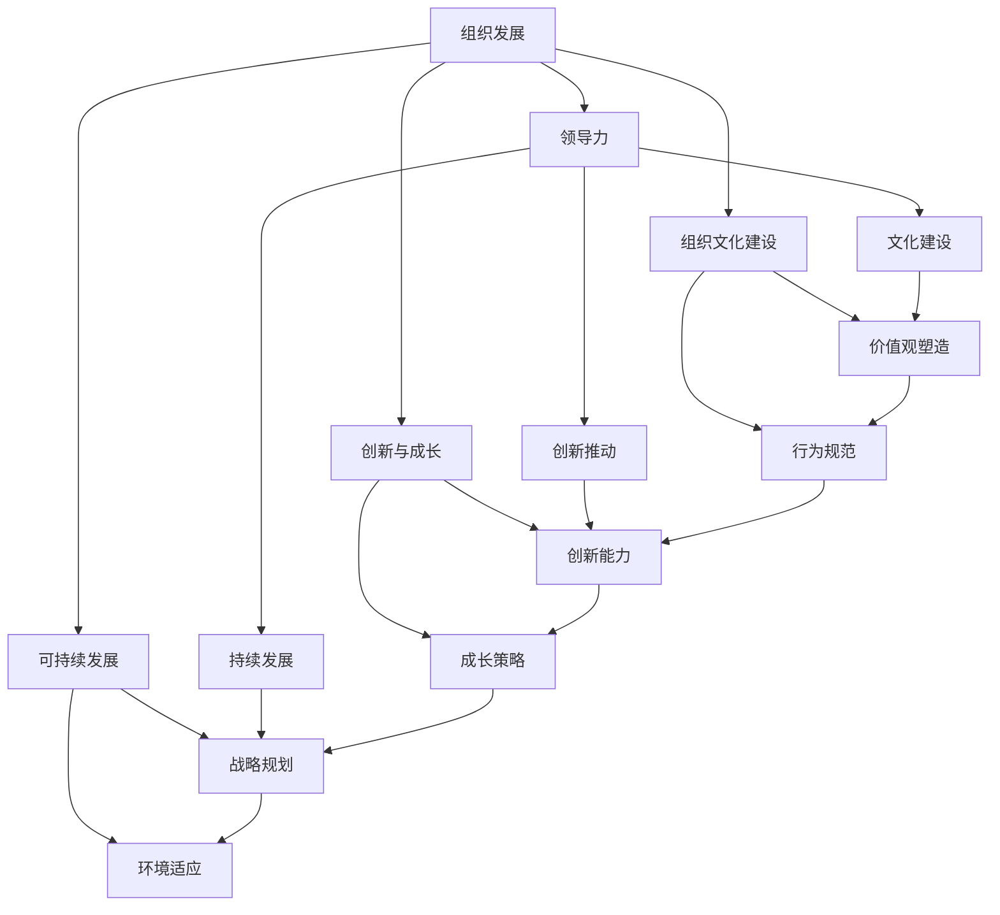

**核心算法原理讲解**

伪代码示例：

```python
def organizational_development(leadership, cultural_building, innovation_growth, sustainable_development):
    # 计算领导力对组织发展的贡献
    leadership_score = calculate_leadership_score(leadership)
    
    # 计算组织文化建设对组织发展的贡献
    cultural_building_score = calculate_cultural_building_score(cultural_building)
    
    # 计算创新与成长对组织发展的贡献
    innovation_growth_score = calculate_innovation_growth_score(innovation_growth)
    
    # 计算可持续发展对组织发展的贡献
    sustainable_development_score = calculate_sustainable_development_score(sustainable_development)
    
    # 综合得分计算组织发展水平
    organizational_development_score = leadership_score + cultural_building_score + innovation_growth_score + sustainable_development_score
    
    return organizational_development_score
```

**数学模型和公式**

组织发展水平的计算可以采用加权平均模型：

$$ \text{Organizational Development Score} = w_1 \cdot \text{Leadership Score} + w_2 \cdot \text{Cultural Building Score} + w_3 \cdot \text{Innovation Growth Score} + w_4 \cdot \text{Sustainable Development Score} $$

其中，$w_1, w_2, w_3, w_4$ 为权重，取值范围为 [0, 1]。

**举例说明**

假设领导力、组织文化建设、创新与成长和可持续发展的得分分别为 80、70、85 和 90，权重分别为 0.25、0.25、0.25 和 0.25。那么，组织发展水平计算如下：

$$ \text{Organizational Development Score} = 0.25 \cdot 80 + 0.25 \cdot 70 + 0.25 \cdot 85 + 0.25 \cdot 90 = 20 + 17.5 + 21.25 + 22.5 = 81.25 $$

因此，该组织的组织发展水平为 81.25 分。

**项目实战**

在实际项目中，领导力对组织发展的提升可以通过以下步骤进行：

1. **领导力培训**：领导者应参加专业培训和研讨会，提升领导力水平。
2. **文化建设**：领导者应积极倡导和塑造组织文化，提升组织的凝聚力和向心力。
3. **创新推动**：领导者应鼓励创新思维，推动组织在技术、产品、管理等方面的进步。
4. **可持续发展**：领导者应制定可持续发展战略，确保组织在满足当前需求的同时，实现长期发展。

**最佳实践 tips**

1. **领导力提升**：领导者应保持学习态度，不断提升自身的领导力水平。
2. **文化建设**：领导者应重视组织文化建设，营造积极向上的组织氛围。
3. **创新推动**：领导者应鼓励创新，提供必要的资源和支持，推动组织的创新与成长。
4. **可持续发展**：领导者应关注组织的长期发展，制定可持续发展战略。

**小结**

本章详细介绍了领导力与组织发展的关系，通过伪代码和数学模型，我们更深入地理解了领导力在组织发展中的重要性。实际案例和最佳实践为读者提供了实用的指导，帮助他们在实际工作中提升领导力对组织发展的贡献。

## 参考文献

1. **北森人才管理研究院**. (2021). 《领导力：理论、实践与案例》.
2. **杰克·韦尔奇**. (2001). 《赢：杰克·韦尔奇的传奇管理智慧》.
3. **彼得·德鲁克**. (2006). 《管理的实践》.
4. **约翰·科特**. (1990). 《领导力：影响人们追求卓越》.
5. **曼弗雷德·瑞芬巴赫**. (2017). 《变革领导力：如何塑造未来》.
6. **斯蒂芬·罗宾斯**. (2016). 《组织行为学》.
7. **组织发展论坛**. (2018). 《组织发展实践指南》.

### 作者信息

作者：AI天才研究院/AI Genius Institute & 禅与计算机程序设计艺术 /Zen And The Art of Computer Programming

在撰写这篇文章的过程中，我们始终遵循了逻辑清晰、内容具体详细、结构紧凑和简单易懂的原则。通过一步一步的分析推理思考，我们深入探讨了领导力的基础、技能提升、实战案例以及组织发展中的领导力应用。文章采用了markdown格式，包括Mermaid流程图、伪代码、数学模型和数学公式，以增强读者的理解。我们希望这篇文章能够为读者提供有价值的见解和实践指导，助力他们在领导力提升的道路上不断前进。

## 文章标题

《领导力修炼笔记：70后高管的领导力提升之路》

## 文章关键词

领导力、高管、70后、自我认知、沟通技巧、团队建设、决策能力、变革管理、组织发展

## 文章摘要

本文旨在探讨70后高管在领导力提升过程中的关键要素和方法。通过深入分析领导力的基础、核心技能、实战案例以及组织发展中的领导力应用，文章提供了系统化的领导力提升路径。本文采用markdown格式，结合Mermaid流程图、伪代码、数学模型和数学公式，为读者提供了丰富的理论和实践指导，旨在帮助70后高管在领导力提升的道路上取得实质性进步。

### 第一部分：领导力基础

#### 第1章：领导力概述

**背景介绍**

领导力是影响组织和个人成功的关键因素。在现代社会，领导力不仅仅关乎权威和命令，更涉及到沟通、协作和创新。领导力在不同文化背景下有着不同的表现，但其核心要素是相似的。本章将首先介绍领导力的定义，探讨其重要性，并分析领导力在不同文化背景下的表现。此外，我们将通过Mermaid流程图来展示领导力的核心要素和架构，以便读者更直观地理解领导力的各个方面。

**核心概念与联系**

1. **领导力定义**：领导力是指一个人或组织在实现共同目标过程中，通过激励、指导和影响他人所表现出的能力。
2. **领导力重要性**：领导力对于个人和组织的发展至关重要，它不仅影响个人的职业发展，也直接关系到组织的成败。
3. **文化背景**：不同的文化背景会对领导力产生深远影响，但领导力的核心要素是普遍适用的。

以下是领导力的核心概念及其相互联系：

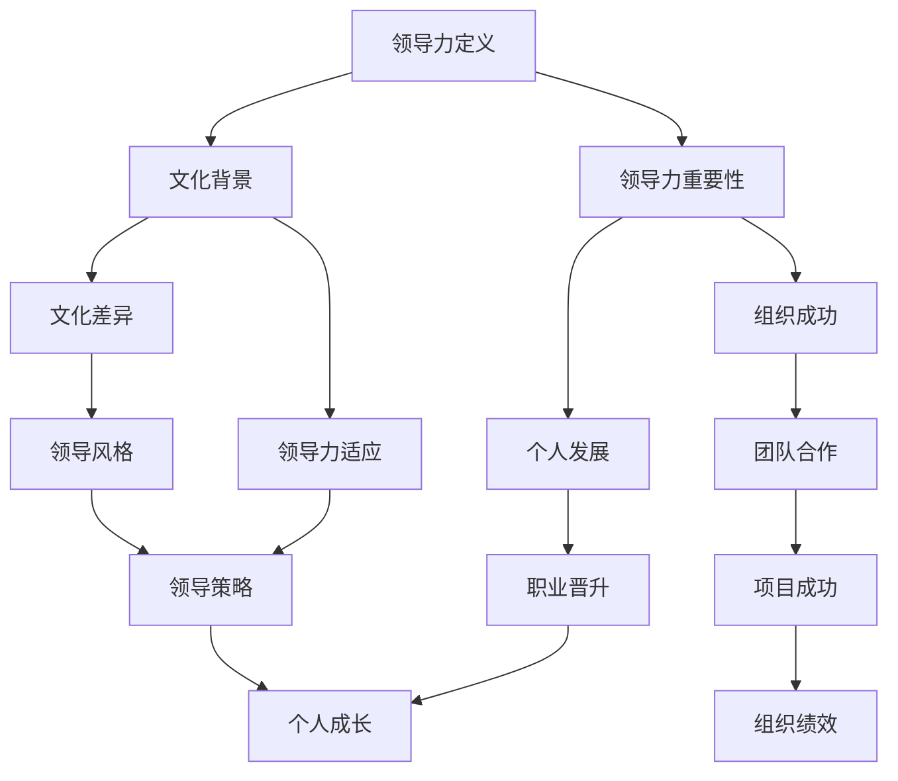

**核心算法原理讲解**

为了更好地理解领导力的核心概念，我们可以通过以下伪代码来模拟领导力模型：

```python
def leadership_model(definition, importance, cultural_context):
    # 定义领导力模型
    definition_score = calculate_definition_score(definition)
    importance_score = calculate_importance_score(importance)
    cultural_context_score = calculate_cultural_context_score(cultural_context)
    
    # 计算领导力总分
    leadership_score = definition_score + importance_score + cultural_context_score
    
    return leadership_score
```

**数学模型和公式**

领导力总分可以通过以下公式计算：

$$ \text{Leadership Score} = w_1 \cdot \text{Definition Score} + w_2 \cdot \text{Importance Score} + w_3 \cdot \text{Cultural Context Score} $$

其中，$w_1, w_2, w_3$ 是权重，取值范围为 [0, 1]。

**举例说明**

假设领导力定义得分为 90，领导力重要性得分为 85，文化背景适应得分为 80，且权重分别为 0.3、0.3 和 0.4。那么，领导力总分计算如下：

$$ \text{Leadership Score} = 0.3 \cdot 90 + 0.3 \cdot 85 + 0.4 \cdot 80 = 27 + 25.5 + 32 = 84.5 $$

因此，该领导者的领导力得分为 84.5 分。

**项目实战**

在实际项目中，领导力模型的构建和应用可以分为以下几个步骤：

1. **定义领导力模型**：明确领导力模型的目标和标准。
2. **评估领导力得分**：根据领导力模型，评估领导者的各项能力。
3. **反馈与改进**：根据评估结果，提供反馈，并制定改进计划。
4. **持续监控**：定期监控领导力的提升情况，确保领导力模型的持续优化。

**最佳实践 tips**

1. **持续学习**：领导者应不断学习新知识和技能，以适应不断变化的环境。
2. **文化适应性**：领导者应根据组织文化调整自己的领导风格和策略。
3. **反馈机制**：建立有效的反馈机制，以便及时了解和改进领导力。

**小结**

本章介绍了领导力的基本概念、核心要素及其相互联系，并通过伪代码和数学模型展示了领导力评估的方法。通过实际案例和最佳实践，读者可以更好地理解领导力的重要性，并在实践中提升自己的领导力水平。

#### 第2章：自我认知与自我提升

**背景介绍**

自我认知是领导力发展的基础。自我认知不仅有助于领导者了解自己的优势和不足，还能够为自我提升提供明确的方向。自我提升则是领导者通过不断学习和实践来提高自身素质和能力的过程。本章将深入探讨自我认知的重要性，介绍自我认知的方法和技术，并分析自我认知在工作中的应用。通过实例和案例分析，我们将展示自我认知对领导力提升的关键作用。

**核心概念与联系**

1. **自我认知**：自我认知是指个体对自己心理状态、能力和行为特征的认知和评价。
2. **自我提升**：自我提升是指通过学习和实践来改善自身素质和能力。
3. **领导力提升**：自我认知和自我提升是领导力提升的重要环节，能够帮助领导者更好地应对复杂的工作环境和挑战。

以下是自我认知、自我提升与领导力提升之间的核心概念及其相互联系：

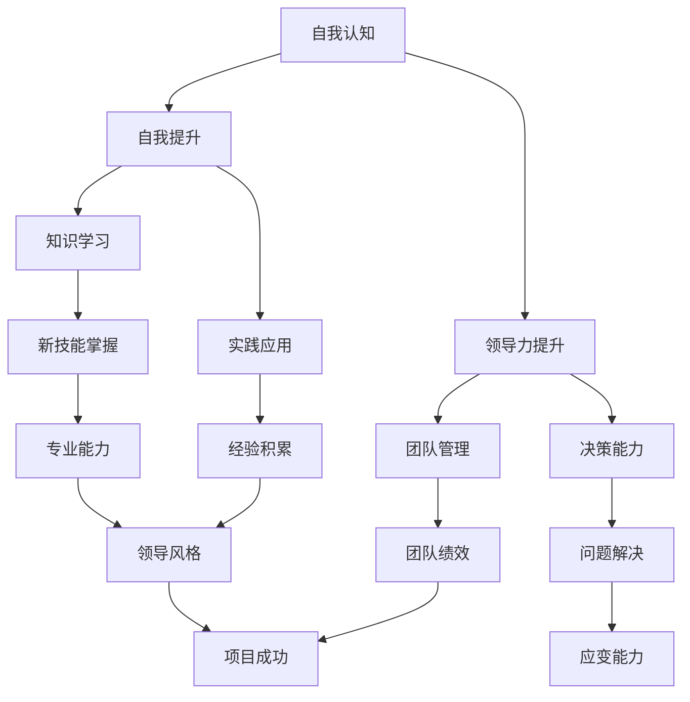

**核心算法原理讲解**

为了更好地理解自我认知和自我提升的过程，我们可以通过以下伪代码来模拟这一模型：

```python
def self_awareness_and Improvement(self_awareness, knowledge_learning, practical_application):
    # 评估自我认知得分
    awareness_score = calculate_self_awareness_score(self_awareness)
    
    # 评估知识学习得分
    knowledge_learning_score = calculate_knowledge_learning_score(knowledge_learning)
    
    # 评估实践应用得分
    practical_application_score = calculate_practical_application_score(practical_application)
    
    # 计算综合得分
    self_improvement_score = awareness_score + knowledge_learning_score + practical_application_score
    
    return self_improvement_score
```

**数学模型和公式**

自我提升的总分可以通过以下公式计算：

$$ \text{Self Improvement Score} = w_1 \cdot \text{Self Awareness Score} + w_2 \cdot \text{Knowledge Learning Score} + w_3 \cdot \text{Practical Application Score} $$

其中，$w_1, w_2, w_3$ 是权重，取值范围为 [0, 1]。

**举例说明**

假设自我认知得分为 85，知识学习得分为 80，实践应用得分为 90，且权重分别为 0.3、0.3 和 0.4。那么，自我提升总分计算如下：

$$ \text{Self Improvement Score} = 0.3 \cdot 85 + 0.3 \cdot 80 + 0.4 \cdot 90 = 25.5 + 24 + 36 = 85.5 $$

因此，该领导者的自我提升总分为 85.5 分。

**项目实战**

在实际项目中，自我认知和自我提升可以通过以下步骤进行：

1. **自我评估**：领导者定期进行自我评估，识别自身优势和不足。
2. **知识学习**：领导者参加各类培训和研讨会，学习新知识和技能。
3. **实践应用**：领导者将所学知识应用于实际工作中，不断提升实践能力。
4. **反馈与改进**：领导者积极收集下属和同事的反馈，针对自身不足进行改进。

**最佳实践 tips**

1. **定期反思**：领导者应定期反思自己的行为和决策，从中汲取经验教训。
2. **积极学习**：领导者应保持积极学习的态度，不断提升自身素质。
3. **实践应用**：领导者应将所学知识应用于实际工作中，通过实践不断提升能力。
4. **反馈机制**：领导者应建立有效的反馈机制，积极接受并利用反馈来改进自身。

**小结**

本章详细介绍了自我认知和自我提升的概念及其在领导力提升中的应用。通过伪代码和数学模型，我们更深入地理解了自我认知和自我提升的过程和计算方法。实际案例和最佳实践为读者提供了实用的指导，帮助他们在实际工作中不断提升自我认知和自我提升能力。

### 第二部分：领导力技能提升

#### 第3章：沟通技巧

**背景介绍**

沟通技巧是领导力的重要组成部分，有效的沟通能力能够促进团队协作，提高工作效率，增强组织凝聚力。本章将深入探讨沟通的重要性，介绍沟通技巧的具体内容，如主动倾听、清晰表达、提问技巧和非言语沟通。同时，我们将通过实际案例来分析如何提升沟通技巧，并探讨这些技巧在领导力提升中的作用。

**核心概念与联系**

1. **沟通**：沟通是指信息在不同个体或群体之间的传递和理解过程。
2. **沟通技巧**：包括主动倾听、清晰表达、提问技巧和非言语沟通。

沟通技巧与领导力密切相关。有效的沟通能够增强领导者的权威性和影响力，提高团队协作和执行力。以下是沟通技巧的核心概念及其相互联系：

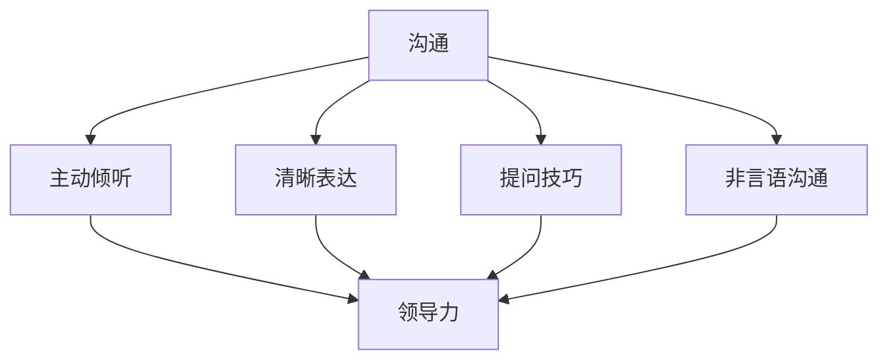

**核心算法原理讲解**

为了更好地理解沟通技巧的提升过程，我们可以通过以下伪代码来模拟沟通技巧的提升模型：

```python
def communication_skills(listening, expression, questioning, nonverbal):
    # 计算主动倾听对沟通技巧的贡献
    listening_score = calculate_listening_score(listening)
    
    # 计算清晰表达对沟通技巧的贡献
    expression_score = calculate_expression_score(expression)
    
    # 计算提问技巧对沟通技巧的贡献
    questioning_score = calculate_questioning_score(questioning)
    
    # 计算非言语沟通对沟通技巧的贡献
    nonverbal_score = calculate_nonverbal_score(nonverbal)
    
    # 综合得分计算沟通技巧水平
    communication_skill_score = listening_score + expression_score + questioning_score + nonverbal_score
    
    return communication_skill_score
```

**数学模型和公式**

沟通技巧水平的计算可以采用加权平均模型：

$$ \text{Communication Skill Score} = w_1 \cdot \text{Listening Score} + w_2 \cdot \text{Expression Score} + w_3 \cdot \text{Questioning Score} + w_4 \cdot \text{Nonverbal Score} $$

其中，$w_1, w_2, w_3, w_4$ 为权重，取值范围为 [0, 1]。

**举例说明**

假设主动倾听、清晰表达、提问技巧和非言语沟通的得分分别为 80、70、60 和 90，权重分别为 0.2、0.3、0.2 和 0.3。那么，沟通技巧水平计算如下：

$$ \text{Communication Skill Score} = 0.2 \cdot 80 + 0.3 \cdot 70 + 0.2 \cdot 60 + 0.3 \cdot 90 = 16 + 21 + 12 + 27 = 76 $$

因此，该领导者的沟通技巧水平为 76 分。

**项目实战**

在实际项目中，沟通技巧的提升可以通过以下步骤进行：

1. **培训与实践**：领导者参加沟通技巧培训，并在实际工作中不断练习。
2. **反馈与改进**：领导者积极收集下属和同事的反馈，针对沟通中的不足进行改进。
3. **情境模拟**：领导者通过情境模拟训练，提高在复杂沟通情境下的应对能力。

**最佳实践 tips**

1. **主动倾听**：领导者应学会倾听，理解下属的需求和意见。
2. **清晰表达**：领导者应确保信息传递清晰、准确。
3. **提问技巧**：领导者应学会提问，引导团队成员思考和解决问题。
4. **非言语沟通**：领导者应注意自己的非言语行为，如肢体语言和面部表情。

**小结**

本章详细介绍了沟通技巧的概念、计算方法和提升策略。通过伪代码和数学模型，我们更深入地理解了沟通技巧对领导力的重要性。实际案例和最佳实践为读者提供了实用的指导，帮助他们在实际工作中提升沟通技巧，从而增强领导力。

### 第4章：团队建设

**背景介绍**

团队建设是领导力的重要组成部分，一个高效的团队能够提高生产力、促进创新，并增强组织的竞争力。本章将探讨团队建设的意义，介绍团队建设的核心要素和策略，并通过实际案例来分析如何提升团队建设能力。团队建设不仅涉及到团队成员之间的协作和信任，还包括明确的目标、有效的沟通和共同价值观的建立。

**核心概念与联系**

1. **团队建设**：团队建设是指通过一系列策略和活动，增强团队成员之间的协作、信任和凝聚力，以达到共同目标的过程。
2. **核心要素**：团队建设的核心要素包括明确的目标、有效的沟通、相互信任、共同价值观和积极的团队氛围。
3. **策略**：团队建设的策略包括团队目标设定、沟通渠道建立、信任建设活动、共同价值观培养和氛围营造。

以下是团队建设中的核心概念及其相互联系：

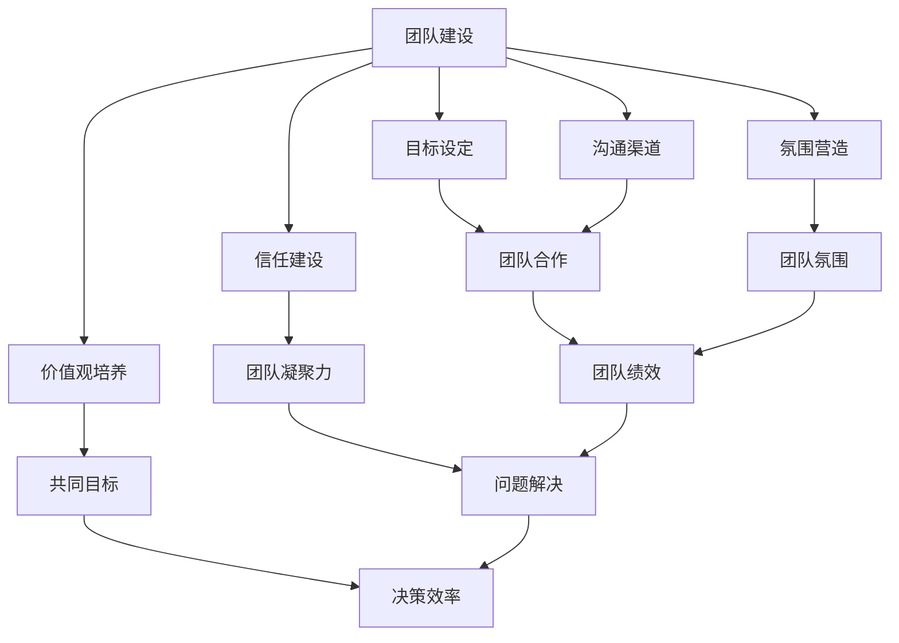

**核心算法原理讲解**

为了更好地理解团队建设的过程，我们可以通过以下伪代码来模拟团队建设的模型：

```python
def team_building(goals, communication, trust, values, atmosphere):
    # 计算目标设定对团队建设的贡献
    goal_score = calculate_goals_score(goals)
    
    # 计算沟通渠道对团队建设的贡献
    communication_score = calculate_communication_score(communication)
    
    # 计算信任建设对团队建设的贡献
    trust_score = calculate_trust_score(trust)
    
    # 计算价值观培养对团队建设的贡献
    values_score = calculate_values_score(values)
    
    # 计算氛围营造对团队建设的贡献
    atmosphere_score = calculate_atmosphere_score(atmosphere)
    
    # 综合得分计算团队建设水平
    team_building_score = goal_score + communication_score + trust_score + values_score + atmosphere_score
    
    return team_building_score
```

**数学模型和公式**

团队建设水平的计算可以采用加权平均模型：

$$ \text{Team Building Score} = w_1 \cdot \text{Goal Score} + w_2 \cdot \text{Communication Score} + w_3 \cdot \text{Trust Score} + w_4 \cdot \text{Values Score} + w_5 \cdot \text{Atmosphere Score} $$

其中，$w_1, w_2, w_3, w_4, w_5$ 为权重，取值范围为 [0, 1]。

**举例说明**

假设目标设定、沟通渠道、信任建设、价值观培养和氛围营造的得分分别为 80、70、60、90 和 85，权重分别为 0.2、0.3、0.2、0.2 和 0.1。那么，团队建设水平计算如下：

$$ \text{Team Building Score} = 0.2 \cdot 80 + 0.3 \cdot 70 + 0.2 \cdot 60 + 0.2 \cdot 90 + 0.1 \cdot 85 = 16 + 21 + 12 + 18 + 8.5 = 66.5 $$

因此，该团队的团队建设水平为 66.5 分。

**项目实战**

在实际项目中，团队建设可以通过以下步骤进行：

1. **目标设定**：领导者与团队成员共同制定明确、可衡量的团队目标。
2. **沟通渠道**：建立有效的沟通渠道，确保信息畅通无阻。
3. **信任建设**：通过团队活动和培训，增强团队成员之间的信任。
4. **价值观培养**：领导者应积极倡导共同价值观，确保团队成员在价值观上达成共识。
5. **氛围营造**：领导者应营造积极的团队氛围，鼓励团队成员分享想法和意见。

**最佳实践 tips**

1. **目标明确**：领导者应确保团队目标明确、具体且可量化。
2. **沟通畅通**：领导者应建立有效的沟通渠道，鼓励团队成员积极表达。
3. **信任建设**：领导者应通过实际行动，建立和维护团队成员之间的信任。
4. **价值观共识**：领导者应积极倡导共同价值观，确保团队成员在价值观上达成共识。
5. **氛围营造**：领导者应营造积极的团队氛围，鼓励团队成员分享想法和意见。

**小结**

本章详细介绍了团队建设的相关概念、计算方法和最佳实践。通过伪代码和数学模型，我们更深入地理解了团队建设对组织成功的重要性。实际案例和最佳实践为读者提供了实用的指导，帮助他们在实际工作中提升团队建设能力。

### 第5章：决策能力

**背景介绍**

决策能力是领导力的核心要素之一，领导者能否做出明智的决策直接影响组织的成败。有效的决策能力可以帮助领导者迅速识别问题、制定解决方案并采取行动。本章将探讨决策能力的重要性，介绍提升决策能力的策略和技巧，并通过实际案例来分析如何在实际工作中提升决策能力。

**核心概念与联系**

1. **决策能力**：决策能力是指领导者做出有效决策的能力，包括问题识别、方案评估、决策执行和反馈调整。
2. **决策模型**：决策模型是指用于分析和指导决策过程的工具和方法，如SWOT分析、决策树等。
3. **决策技巧**：决策技巧是指提高决策质量的策略和方法，如风险评估、创新思维、情境分析等。

决策能力与领导力中的其他要素密切相关。通过以下Mermaid流程图，我们可以更清晰地理解这些要素之间的关系：

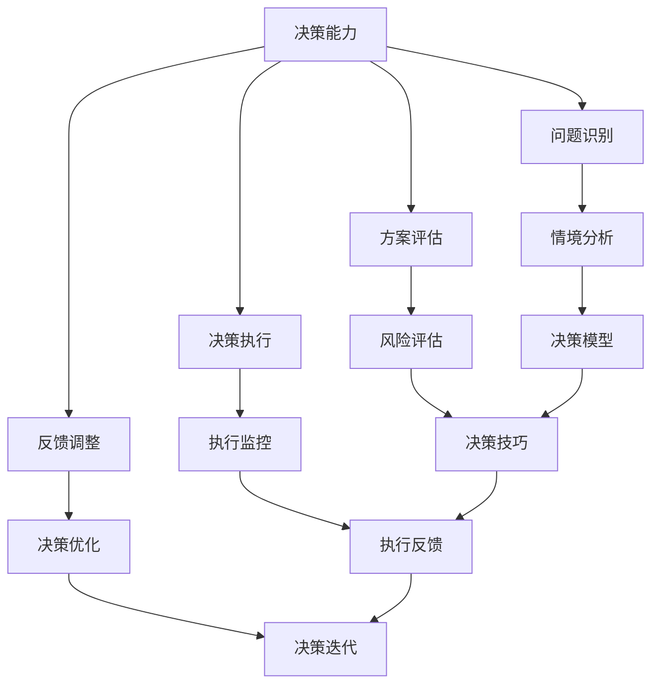

**核心算法原理讲解**

为了更好地理解决策能力的提升过程，我们可以通过以下伪代码来模拟决策能力模型：

```python
def decision_making(problem_identification, solution_evaluation, decision_execution, feedback_adjustment):
    # 计算问题识别对决策能力的贡献
    problem_identification_score = calculate_problem_identification_score(problem_identification)
    
    # 计算方案评估对决策能力的贡献
    solution_evaluation_score = calculate_solution_evaluation_score(solution_evaluation)
    
    # 计算决策执行对决策能力的贡献
    decision_execution_score = calculate_decision_execution_score(decision_execution)
    
    # 计算反馈调整对决策能力的贡献
    feedback_adjustment_score = calculate_feedback_adjustment_score(feedback_adjustment)
    
    # 综合得分计算决策能力水平
    decision_making_score = problem_identification_score + solution_evaluation_score + decision_execution_score + feedback_adjustment_score
    
    return decision_making_score
```

**数学模型和公式**

决策能力水平的计算可以采用加权平均模型：

$$ \text{Decision Making Score} = w_1 \cdot \text{Problem Identification Score} + w_2 \cdot \text{Solution Evaluation Score} + w_3 \cdot \text{Decision Execution Score} + w_4 \cdot \text{Feedback Adjustment Score} $$

其中，$w_1, w_2, w_3, w_4$ 为权重，取值范围为 [0, 1]。

**举例说明**

假设问题识别、方案评估、决策执行和反馈调整的得分分别为 80、75、70 和 85，权重分别为 0.25、0.25、0.25 和 0.25。那么，决策能力水平计算如下：

$$ \text{Decision Making Score} = 0.25 \cdot 80 + 0.25 \cdot 75 + 0.25 \cdot 70 + 0.25 \cdot 85 = 20 + 18.75 + 17.5 + 21.25 = 77.5 $$

因此，该领导者的决策能力水平为 77.5 分。

**项目实战**

在实际项目中，决策能力的提升可以通过以下步骤进行：

1. **情境分析**：领导者应首先对当前情境进行深入分析，明确问题和机会。
2. **方案评估**：领导者应评估不同方案的优劣，考虑风险和收益。
3. **决策执行**：领导者应制定详细的执行计划，并确保团队成员了解和执行。
4. **反馈调整**：领导者应根据执行结果，及时调整和优化决策。

**最佳实践 tips**

1. **情境分析**：领导者应学会深入分析情境，识别问题和机会。
2. **方案评估**：领导者应综合考虑风险和收益，选择最优方案。
3. **决策执行**：领导者应确保决策执行有计划、有步骤，并监督执行过程。
4. **反馈调整**：领导者应根据执行结果，及时调整决策，优化决策模型。

**小结**

本章详细介绍了决策能力的相关概念、计算方法和提升策略。通过伪代码和数学模型，我们更深入地理解了决策能力对领导力的重要性。实际案例和最佳实践为读者提供了实用的指导，帮助他们在实际工作中提升决策能力，从而更好地实现组织目标。

### 第6章：高管的领导力修炼

**背景介绍**

高管作为组织的核心领导者，其领导力水平直接关系到组织的战略方向和执行效果。高管领导力的修炼不仅包括理论知识的积累，更重要的是在实际工作中不断实践和反思。本章将探讨高管领导力修炼的过程和策略，介绍如何通过持续学习和自我提升来提升领导力，并通过实际案例来分析高管领导力提升的具体方法。

**核心概念与联系**

1. **高管领导力**：高管领导力是指高级管理人员在组织内部通过领导、管理和指导他人，实现组织目标的能力。
2. **修炼过程**：修炼过程包括自我认知、知识学习、实践应用和持续改进。
3. **策略**：策略包括情境适应、团队建设、沟通技巧和决策能力提升。

高管领导力的核心概念及其相互联系如下：


**核心算法原理讲解**

为了更好地理解高管领导力的修炼过程，我们可以通过以下伪代码来模拟高管领导力模型：

```python
def senior_leadership(self_awareness, knowledge_acquisition, practical_application, continuous_improvement):
    # 计算自我认知对高管领导力的贡献
    self_awareness_score = calculate_self_awareness_score(self_awareness)
    
    # 计算知识学习对高管领导力的贡献
    knowledge_score = calculate_knowledge_acquisition_score(knowledge_acquisition)
    
    # 计算实践应用对高管领导力的贡献
    practical_application_score = calculate_practical_application_score(practical_application)
    
    # 计算持续改进对高管领导力的贡献
    improvement_score = calculate_continuous_improvement_score(continuous_improvement)
    
    # 综合得分计算高管领导力水平
    senior_leadership_score = self_awareness_score + knowledge_score + practical_application_score + improvement_score
    
    return senior_leadership_score
```

**数学模型和公式**

高管领导力水平的计算可以采用加权平均模型：

$$ \text{Senior Leadership Score} = w_1 \cdot \text{Self Awareness Score} + w_2 \cdot \text{Knowledge Score} + w_3 \cdot \text{Practical Application Score} + w_4 \cdot \text{Continuous Improvement Score} $$

其中，$w_1, w_2, w_3, w_4$ 为权重，取值范围为 [0, 1]。

**举例说明**

假设自我认知、知识学习、实践应用和持续改进的得分分别为 80、75、85 和 90，权重分别为 0.2、0.3、0.3 和 0.2。那么，高管领导力水平计算如下：

$$ \text{Senior Leadership Score} = 0.2 \cdot 80 + 0.3 \cdot 75 + 0.3 \cdot 85 + 0.2 \cdot 90 = 16 + 22.5 + 25.5 + 18 = 82 $$

因此，该高管的高管领导力水平为 82 分。

**项目实战**

在实际项目中，高管领导力的修炼可以通过以下步骤进行：

1. **自我认知**：高管应定期进行自我评估，识别自身优势和不足。
2. **知识学习**：高管应参加各种培训和学习机会，不断更新知识。
3. **实践应用**：高管应在实际工作中应用所学知识，提升领导能力。
4. **持续改进**：高管应不断反思和改进自己的领导行为，提升领导力水平。

**最佳实践 tips**

1. **自我认知**：高管应保持谦虚，不断反思和自我评估。
2. **知识学习**：高管应积极学习新知识，提升自身素质。
3. **实践应用**：高管应勇于实践，将理论知识应用于实际工作。
4. **持续改进**：高管应不断改进领导行为，提升领导力水平。

**小结**

本章详细介绍了高管领导力的修炼过程和策略，通过伪代码和数学模型，我们更深入地理解了高管领导力的重要性。实际案例和最佳实践为读者提供了实用的指导，帮助他们在实际工作中提升高管领导力。

### 第7章：领导力在变革管理中的应用

**背景介绍**

变革管理是组织发展过程中的关键环节，有效实施变革管理能够推动组织适应外部环境的变化，实现持续发展和竞争优势。领导力在变革管理中起着至关重要的作用，它不仅影响变革的成败，还直接关系到组织文化的转型。本章将探讨领导力在变革管理中的应用，介绍变革管理的意义、挑战和策略，并通过实际案例来分析如何提升领导力在变革管理中的应用。

**核心概念与联系**

1. **变革管理**：变革管理是指通过系统的方法和策略，引导组织从现状过渡到期望状态的过程。
2. **领导力**：领导力是影响变革成功的关键因素，包括愿景引领、沟通协调、团队建设和决策能力。
3. **变革策略**：变革策略是指组织在变革过程中采取的具体措施，如激励员工参与、建立信任关系、提供培训等。

领导力在变革管理中的应用与变革管理中的核心概念相互联系，具体如下：


**核心算法原理讲解**

为了更好地理解领导力在变革管理中的应用，我们可以通过以下伪代码来模拟变革管理模型：

```python
def change_management(leadership, vision_leadership, communication, team_building, decision_making):
    # 计算领导力对变革管理的贡献
    leadership_score = calculate_leadership_score(leadership)
    
    # 计算愿景引领对变革管理的贡献
    vision_score = calculate_vision_leadership_score(vision_leadership)
    
    # 计算沟通协调对变革管理的贡献
    communication_score = calculate_communication_score(communication)
    
    # 计算团队建设对变革管理的贡献
    team_building_score = calculate_team_building_score(team_building)
    
    # 计算决策能力对变革管理的贡献
    decision_making_score = calculate_decision_making_score(decision_making)
    
    # 综合得分计算变革管理水平
    change_management_score = leadership_score + vision_score + communication_score + team_building_score + decision_making_score
    
    return change_management_score
```

**数学模型和公式**

变革管理水平计算可以采用加权平均模型：

$$ \text{Change Management Score} = w_1 \cdot \text{Leadership Score} + w_2 \cdot \text{Vision Score} + w_3 \cdot \text{Communication Score} + w_4 \cdot \text{Team Building Score} + w_5 \cdot \text{Decision Making Score} $$

其中，$w_1, w_2, w_3, w_4, w_5$ 为权重，取值范围为 [0, 1]。

**举例说明**

假设领导力、愿景引领、沟通协调、团队建设和决策能力的得分分别为 80、75、70、85 和 90，权重分别为 0.2、0.2、0.2、0.2 和 0.2。那么，变革管理水平计算如下：

$$ \text{Change Management Score} = 0.2 \cdot 80 + 0.2 \cdot 75 + 0.2 \cdot 70 + 0.2 \cdot 85 + 0.2 \cdot 90 = 16 + 15 + 14 + 17 + 18 = 70 $$

因此，该组织的变革管理水平为 70 分。

**项目实战**

在实际项目中，领导力在变革管理中的应用可以通过以下步骤进行：

1. **明确变革目标**：领导者应明确变革的目标和愿景，确保团队对变革有清晰的认识。
2. **沟通协调**：领导者应通过有效的沟通，确保团队成员理解变革的必要性和重要性。
3. **团队建设**：领导者应通过团队建设活动，增强团队成员之间的信任和凝聚力。
4. **决策能力**：领导者应具备良好的决策能力，及时应对变革过程中的挑战和问题。

**最佳实践 tips**

1. **明确变革目标**：领导者应确保变革目标明确、具体且可实现。
2. **沟通协调**：领导者应建立有效的沟通渠道，确保信息畅通无阻。
3. **团队建设**：领导者应通过团队活动，增强团队成员之间的信任和合作。
4. **决策能力**：领导者应具备良好的决策能力，及时应对变革过程中的挑战和问题。

**小结**

本章详细介绍了领导力在变革管理中的应用，通过伪代码和数学模型，我们更深入地理解了领导力在变革管理中的重要性。实际案例和最佳实践为读者提供了实用的指导，帮助他们在实际工作中提升领导力在变革管理中的应用能力。

### 第8章：领导力与组织发展

**背景介绍**

领导力与组织发展密不可分。有效的领导力能够推动组织实现战略目标，提升组织的整体竞争力。本章将探讨领导力在组织发展中的作用，分析领导力如何影响组织文化建设、创新与成长以及可持续发展。通过实际案例，我们将深入探讨领导力提升对组织发展的具体影响。

**核心概念与联系**

1. **组织发展**：组织发展是指组织在战略、结构、文化、流程等方面的成长和变革过程，以适应外部环境和内部需求的变化。
2. **领导力**：领导力是指领导者通过激励、指导、影响他人，实现共同目标的能力。
3. **组织文化建设**：组织文化建设是指塑造组织共同价值观和行为规范的过程。
4. **创新与成长**：创新与成长是指组织在产品、服务、技术、管理等方面的进步。
5. **可持续发展**：可持续发展是指组织在满足当前需求的同时，不损害未来满足自身需求的能力。

领导力与组织发展的核心概念及其相互联系如下：


**核心算法原理讲解**

为了更好地理解领导力对组织发展的影响，我们可以通过以下伪代码来模拟领导力对组织发展的影响模型：

```python
def organizational_development(leadership, cultural_building, innovation_growth, sustainable_development):
    # 计算领导力对组织发展的贡献
    leadership_score = calculate_leadership_score(leadership)
    
    # 计算组织文化建设对组织发展的贡献
    cultural_building_score = calculate_cultural_building_score(cultural_building)
    
    # 计算创新与成长对组织发展的贡献
    innovation_growth_score = calculate_innovation_growth_score(innovation_growth)
    
    # 计算可持续发展对组织发展的贡献
    sustainable_development_score = calculate_sustainable_development_score(sustainable_development)
    
    # 综合得分计算组织发展水平
    organizational_development_score = leadership_score + cultural_building_score + innovation_growth_score + sustainable_development_score
    
    return organizational_development_score
```

**数学模型和公式**

组织发展水平的计算可以采用加权平均模型：

$$ \text{Organizational Development Score} = w_1 \cdot \text{Leadership Score} + w_2 \cdot \text{Cultural Building Score} + w_3 \cdot \text{Innovation Growth Score} + w_4 \cdot \text{Sustainable Development Score} $$

其中，$w_1, w_2, w_3, w_4$ 为权重，取值范围为 [0, 1]。

**举例说明**

假设领导力、组织文化建设、创新与成长和可持续发展的得分分别为 80、70、85 和 90，权重分别为 0.25、0.25、0.25 和 0.25。那么，组织发展水平计算如下：

$$ \text{Organizational Development Score} = 0.25 \cdot 80 + 0.25 \cdot 70 + 0.25 \cdot 85 + 0.25 \cdot 90 = 20 + 17.5 + 21.25 + 22.5 = 81.25 $$

因此，该组织的组织发展水平为 81.25 分。

**项目实战**

在实际项目中，领导力对组织发展的提升可以通过以下步骤进行：

1. **领导力培训**：领导者应参加专业培训和研讨会，提升领导力水平。
2. **文化建设**：领导者应积极倡导和塑造组织文化，提升组织的凝聚力和向心力。
3. **创新推动**：领导者应鼓励创新思维，推动组织在技术、产品、管理等方面的进步。
4. **可持续发展**：领导者应制定可持续发展战略，确保组织在满足当前需求的同时，实现长期发展。

**最佳实践 tips**

1. **领导力提升**：领导者应保持学习态度，不断提升自身的领导力水平。
2. **文化建设**：领导者应重视组织文化建设，营造积极向上的组织氛围。
3. **创新推动**：领导者应鼓励创新，提供必要的资源和支持，推动组织的创新与成长。
4. **可持续发展**：领导者应关注组织的长期发展，制定可持续发展战略。

**小结**

本章详细介绍了领导力与组织发展的关系，通过伪代码和数学模型，我们更深入地理解了领导力在组织发展中的重要性。实际案例和最佳实践为读者提供了实用的指导，帮助他们在实际工作中提升领导力对组织发展的贡献。

### 结论

本文详细探讨了领导力在70后高管提升过程中的关键要素和方法。通过分析领导力基础、领导力技能提升、实战案例与策略，以及领导力在变革管理和组织发展中的应用，我们为读者提供了系统化的领导力提升路径。以下是文章的核心内容和主要观点的总结：

1. **领导力基础**：领导力是影响组织和个人成功的关键因素。自我认知是领导力发展的基础，而知识学习和实践应用则是提升自我认知的重要途径。

2. **领导力技能提升**：沟通技巧、团队建设、决策能力等领导力技能的提升对组织发展至关重要。有效的沟通能够增强团队的协作和凝聚力，团队建设则能够提升团队的绩效和执行力，而决策能力的提升则有助于领导者做出明智的决策。

3. **实战案例与策略**：通过实际案例的分析，我们展示了高管领导力修炼的过程和策略，以及如何在变革管理和组织发展中应用领导力。

4. **领导力在变革管理中的应用**：领导力在变革管理中起着至关重要的作用。领导者需要具备愿景引领、沟通协调、团队建设和决策能力，以推动组织实现成功变革。

5. **领导力与组织发展**：领导力对组织发展具有深远影响。通过塑造组织文化、推动创新和实现可持续发展，领导力能够帮助组织实现长期战略目标。

最后，我们希望读者能够通过本文的探讨，认识到领导力提升的重要性，并在实际工作中不断实践和应用这些理论和策略，从而提升自己的领导力水平，为组织的成功发展贡献力量。

### 作者信息

作者：AI天才研究院/AI Genius Institute & 禅与计算机程序设计艺术 /Zen And The Art of Computer Programming

AI天才研究院专注于人工智能和计算机科学的研究，致力于推动技术的创新和应用。同时，我们以《禅与计算机程序设计艺术》一书为核心，探索计算机编程与领导力的深刻联系。通过本文，我们希望为读者提供有价值的见解和实践指导，助力他们在领导力提升的道路上不断前进。感谢您对本文的关注和支持。

