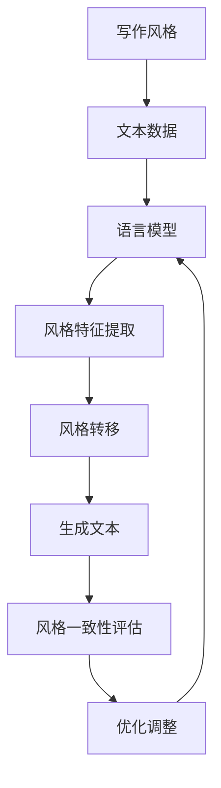

                 

### 引言：写作风格与机器学习简介

在数字时代，内容创作的重要性愈发突出。无论是新闻报道、社交媒体帖子，还是广告文案和文学创作，优秀的写作风格都能显著提升内容的吸引力和影响力。写作风格不仅体现了一个作家的独特个性，也反映了其作品的审美取向和情感传达。然而，随着机器学习技术的不断发展，特别是语言模型的进步，模仿和生成特定写作风格的内容成为可能。

写作风格是指作家在创作过程中所表现出的语言、结构、主题和情感等方面的特点。例如，诗歌通常具有韵律和押韵，而新闻报道则强调事实准确性和客观性。不同的写作风格能够满足不同读者的需求，也能有效地传达特定的信息或情感。因此，理解和模仿这些风格在文本生成和内容创作中具有重大意义。

机器学习作为人工智能的一个重要分支，通过构建模型，让计算机自动从数据中学习规律和模式。在自然语言处理（NLP）领域，机器学习技术已被广泛应用于文本分类、情感分析、机器翻译等任务。语言模型，尤其是基于深度学习的模型，如BERT、GPT等，已经成为处理文本数据的强大工具。

语言模型的核心任务是理解和生成自然语言文本。这些模型通过学习大量文本数据，能够捕捉语言中的复杂结构和语义关系。在写作风格模仿方面，语言模型可以通过学习特定风格的文本数据，生成具有相应风格的新文本。这一能力在内容创作、个性化推荐、教育辅助等领域具有重要的应用价值。

本章节将简要介绍写作风格的概念及其重要性，并探讨机器学习在文本生成中的应用。接下来，我们将深入探讨语言模型的基本原理，以及其在模仿不同写作风格时的优势和挑战。通过这些介绍，读者可以更好地理解本书的主题，并为后续章节的学习打下基础。

### 写作风格模仿的定义

写作风格模仿，简而言之，就是让机器学习模型生成具有特定风格的新文本。这一过程涉及多个核心概念，包括写作风格本身、模仿的目标、以及实现方法。理解这些概念对于深入探讨风格模仿的机制和评估方法至关重要。

首先，写作风格是指作家在创作过程中所表现出的语言、结构、主题和情感等方面的特点。它不仅体现了作家的个人风格，也反映了其创作意图和目标读者群体。常见的写作风格包括文学风格、学术风格、新闻报道风格、社交媒体风格等。每种风格都有其独特的语言特征和表达方式。例如，文学风格通常强调情感表达和象征意义，而学术风格则更注重逻辑严谨和事实准确性。

其次，模仿的目标是使生成的文本在风格上与原始文本高度一致。这不仅仅是复制原文的字词和句子结构，还包括捕捉原文的情感色彩、语气和写作氛围。一个成功的风格模仿应该让读者感受到文本出自同一作者之手，即使这些文本是由机器生成的。这要求机器学习模型具有对语言细节和情感表达的深刻理解。

实现写作风格模仿的方法主要分为以下几类：

1. **基于规则的方法**：这种方法通过预定义的语法规则和模板来生成文本。虽然这种方法简单直接，但灵活性较差，难以捕捉复杂多样的语言特征。

2. **基于模板的方法**：这种方法通过将原始文本分解为模板和变量，然后替换变量生成新文本。这种方法在保持文本结构方面有一定优势，但在表达多样性和灵活性上仍存在限制。

3. **基于生成式模型的方法**：这种方法使用深度学习模型，如循环神经网络（RNN）、变换器（Transformer）等，通过学习大量文本数据来生成新文本。生成式模型具有强大的表达能力，能够生成形式多样且具有情感色彩的文本，但在风格一致性上仍存在挑战。

4. **基于判别式模型的方法**：这种方法使用判别模型来判断生成文本的质量，并通过优化模型参数来提高风格模仿的精准度。这种方法结合了生成模型和评估模型的优点，但实现较为复杂。

了解这些核心概念和方法，有助于我们更好地理解后续章节中的实验设计和评估方法。在接下来的章节中，我们将深入探讨语言模型的基础知识，以及不同类型的语言模型如何应用于风格模仿任务。

#### 核心概念与联系：写作风格、语言模型与风格模仿

在探讨写作风格模仿时，理解核心概念之间的关系至关重要。写作风格、语言模型和风格模仿三者之间存在着紧密的联系和相互作用，构成了一个相互依赖的框架。

首先，写作风格是文本创作的基本元素，它决定了文本的情感表达、语言结构和主题取向。不同的写作风格具有独特的特征，如文学风格强调情感和象征，而学术风格注重逻辑和事实。因此，写作风格不仅体现了作家的个人风格，也反映了文本的特定目的和读者群体。

语言模型则是实现风格模仿的技术核心。语言模型通过学习大量文本数据，能够理解和生成符合语言规则的自然语言文本。典型的语言模型如循环神经网络（RNN）、变换器（Transformer）等，通过捕捉语言中的复杂结构和语义关系，实现了对文本的高效处理。在这些模型中，语言特征被编码为向量，使得模型能够理解并生成不同风格的文本。

风格模仿的目标是生成与原始文本在风格上高度一致的文本。这要求语言模型不仅能够理解原始文本的语言特征，还需要能够捕捉其情感色彩和写作氛围。为了实现这一目标，语言模型需要具备强大的表达能力和适应性。具体来说，风格模仿的核心概念包括：

1. **风格特征提取**：通过分析大量风格多样的文本数据，语言模型能够识别和提取不同风格的特征。这些特征包括语言结构、主题倾向、情感表达等。

2. **风格转移**：风格转移是指将一种风格的文本特征转移到另一种风格的过程中。这一过程涉及对语言模型的调整，使其能够生成具有目标风格的新文本。

3. **风格一致性评估**：评估生成的文本在风格上与原始文本的一致性。这通常通过自动评估指标（如ROUGE、BLEU等）和手动评估方法（如人工评价）来实现。

为了更好地理解这些概念之间的关系，我们可以使用Mermaid流程图来展示其交互过程：

在这个流程图中，写作风格作为输入文本数据的一部分，经过语言模型处理后，生成具有特定风格的文本。生成的文本再经过风格一致性评估，以指导模型参数的优化调整，从而实现更高精度的风格模仿。

通过这一核心概念与联系的分析，我们不仅能够更深入地理解写作风格模仿的过程，也为后续的实验设计和评估方法提供了理论基础。

### 语言模型的基本原理

语言模型是自然语言处理（NLP）的核心工具之一，其基本原理源于统计学和机器学习的交叉领域。语言模型的核心任务是预测文本序列中下一个单词或字符的概率分布，从而生成或理解自然语言。以下将详细介绍语言模型的基本原理，包括语言模型的定义、类型及其在风格模仿中的应用。

#### 语言模型的定义

语言模型（Language Model，LM）是一种概率模型，用于预测一个文本序列中下一个单词或字符的概率。具体来说，给定一个已经观察到的单词序列$w_1, w_2, ..., w_n$，语言模型的目标是预测下一个单词$w_{n+1}$的概率：

$$ P(w_{n+1} | w_1, w_2, ..., w_n) $$

这种概率预测可以帮助机器生成连贯的自然语言文本。

#### 语言模型的主要类型

语言模型可以分为几种主要类型，每种类型有其独特的结构和应用场景：

1. **N-gram模型**：N-gram模型是最简单的语言模型，它基于马尔可夫假设，即当前词序列仅与前N个词相关。N-gram模型通过统计一组连续单词（n元组）的出现频率来预测下一个词。例如，在二元语法（Bigram）模型中，下一个词的概率取决于前一个词。N-gram模型直观且易于实现，但性能有限，尤其是在处理长文本时。

2. **统计语言模型**：统计语言模型通过建立语言数据中的统计规律来预测单词序列。除了N-gram模型，还包括更复杂的高阶语法模型，如三语法、四语法等。这些模型通过组合低阶语法规则，生成更复杂的语言特征。

3. **神经网络语言模型**：基于神经网络的模型，特别是深度学习模型，如循环神经网络（RNN）和变换器（Transformer）等，在语言模型领域取得了显著进展。这些模型通过多层神经网络结构，捕捉文本中的长距离依赖关系和复杂语义，从而实现更高的语言理解能力和生成能力。

4. **上下文感知语言模型**：上下文感知语言模型通过利用上下文信息来提高预测精度。例如，BERT（Bidirectional Encoder Representations from Transformers）模型通过双向编码器结构，捕捉文本中的前向和后向信息，从而实现更准确的单词预测。

#### 语言模型在风格模仿中的应用

语言模型在风格模仿中的应用主要体现在以下几个方面：

1. **文本生成**：语言模型可以生成具有特定风格的新文本。通过训练大量具有目标风格的文本数据，模型能够学习并模仿这些风格特征，从而生成具有相似风格的文本。例如，GPT-3等大型语言模型能够生成各种风格的文本，从文学创作到新闻报道。

2. **风格转移**：风格转移（Style Transfer）是一种将一种风格的文本特征转移到另一种风格的技术。通过训练特定风格的文本数据，语言模型可以生成具有目标风格的新文本。例如，可以将一篇学术文章的风格转移到文学风格，从而生成一篇具有文学风格的学术文章。

3. **风格一致性评估**：为了确保生成的文本在风格上与原始文本一致，语言模型需要通过风格一致性评估。常用的评估方法包括自动评估指标（如ROUGE、BLEU等）和人工评估方法。这些评估方法可以帮助衡量生成文本在风格上的准确性。

总之，语言模型作为自然语言处理的基础工具，在风格模仿中发挥着关键作用。通过理解语言模型的基本原理和应用，我们可以更深入地探讨风格模仿的机制和实现方法。在接下来的章节中，我们将进一步探讨语言模型在风格模仿中的具体实现和应用。

### 语言模型的常见架构

在深入探讨语言模型的架构时，我们需要了解几种常见的语言模型架构，它们分别是循环神经网络（RNN）、长短时记忆网络（LSTM）和变换器（Transformer）。这些模型在处理自然语言任务时展现了各自的优缺点，并在风格模仿任务中发挥着重要作用。

#### 循环神经网络（RNN）

循环神经网络（Recurrent Neural Network，RNN）是早期用于处理序列数据的一种神经网络架构。RNN通过在时间步上递归地更新隐藏状态，从而捕捉序列数据中的时间依赖关系。RNN的核心思想是利用前一时刻的隐藏状态来影响当前时刻的输出，这使得RNN能够处理变长序列数据。

优点：
- **处理长序列**：RNN能够通过递归关系处理长序列数据，捕捉其中的长期依赖关系。
- **灵活性强**：RNN结构简单，可以通过调节网络参数来调整模型的性能。

缺点：
- **梯度消失和梯度爆炸**：RNN在训练过程中容易遇到梯度消失或梯度爆炸问题，导致训练不稳定。
- **长距离依赖问题**：RNN在处理长距离依赖关系时效果不佳，难以捕捉远距离的信息。

在风格模仿任务中，RNN可以通过学习大量风格多样的文本数据来模仿特定风格。然而，由于其长距离依赖处理能力的局限，RNN在复杂风格模仿任务中可能面临挑战。

#### 长短时记忆网络（LSTM）

长短时记忆网络（Long Short-Term Memory，LSTM）是RNN的一种改进版本，旨在解决RNN在训练过程中遇到的梯度消失和梯度爆炸问题。LSTM通过引入记忆单元和门控机制，有效地控制信息的流动，从而在捕捉长期依赖关系方面表现出色。

优点：
- **解决梯度消失问题**：LSTM通过门控机制有效控制信息的流动，避免了梯度消失问题。
- **捕捉长期依赖**：LSTM能够捕捉长距离依赖关系，处理复杂序列数据。
- **稳定训练**：LSTM在训练过程中较为稳定，不容易出现梯度爆炸问题。

缺点：
- **计算复杂度高**：LSTM结构相对复杂，计算资源需求较高。
- **训练时间较长**：由于结构复杂，LSTM的训练时间较长。

在风格模仿任务中，LSTM通过学习大量具有目标风格的文本数据，能够生成与原始风格高度一致的文本。其强大的依赖关系捕捉能力使其成为许多风格模仿任务的首选模型。

#### 变换器（Transformer）

变换器（Transformer）是近年来在自然语言处理领域取得重大突破的一种新型神经网络架构。与RNN和LSTM不同，Transformer使用自注意力机制（Self-Attention）来处理序列数据，从而实现高效的序列建模。

优点：
- **并行计算**：由于自注意力机制，Transformer能够实现并行计算，大大提高了训练速度。
- **捕捉复杂依赖**：通过多头注意力机制，Transformer能够同时捕捉局部和全局依赖关系，处理复杂序列数据。
- **高效表示**：变换器通过编码器和解码器结构，能够生成高质量的文本表示。

缺点：
- **计算资源需求**：虽然Transformer能够实现并行计算，但其在训练过程中仍需大量计算资源。
- **参数较多**：与RNN和LSTM相比，Transformer具有更多的参数，可能导致过拟合。

在风格模仿任务中，变换器展现了强大的生成能力和风格一致性。通过学习大量具有目标风格的文本数据，变换器能够生成与原始风格高度一致的新文本，广泛应用于文本生成、风格迁移等任务。

总之，不同的语言模型架构在风格模仿任务中各有所长。RNN和LSTM通过递归机制捕捉序列依赖关系，适用于处理简单风格模仿任务；而变换器通过自注意力机制实现高效序列建模，适用于复杂风格模仿任务。理解这些模型的优缺点，有助于我们在实际应用中选择合适的模型架构，实现高效的风格模仿。

#### 语言模型在风格模仿中的实现方法

在探讨语言模型在风格模仿中的应用时，我们需要详细分析其实现方法，特别是如何通过训练和推理步骤来生成具有特定风格的文本。以下将分别介绍这些步骤，并讨论不同方法的优缺点。

##### 训练步骤

1. **数据集准备**：
   - **风格标注**：首先，需要准备具有不同写作风格的文本数据集。对于每个风格，我们可以通过人工标注或自动标注方法，确保每个样本都被正确标记。
   - **数据预处理**：对原始文本进行预处理，包括去除标点符号、统一化文本格式、分词等操作。对于中文文本，还需要进行词嵌入（Word Embedding）处理，将文本转换为向量表示。

2. **模型选择**：
   - **模型架构**：选择适合的风格模仿任务的语言模型架构，如RNN、LSTM或变换器（Transformer）等。不同模型在处理风格模仿任务时具有不同的表现。
   - **超参数设置**：根据具体任务和数据集，设置模型的超参数，如学习率、批大小、迭代次数等。

3. **训练过程**：
   - **输入生成**：在训练过程中，将风格标注的文本序列作为输入，通过模型的编码器（Encoder）部分进行处理。
   - **损失函数**：使用基于风格标注的目标损失函数来优化模型参数。例如，可以使用交叉熵损失函数（Cross-Entropy Loss），通过对比预测概率分布和真实标注的分布来计算损失。
   - **优化算法**：使用梯度下降（Gradient Descent）或其他优化算法来更新模型参数，最小化损失函数。

##### 推理步骤

1. **输入序列处理**：
   - 将待生成文本的输入序列通过编码器进行处理，生成文本表示。

2. **生成文本**：
   - 使用解码器（Decoder）部分根据编码器生成的文本表示生成文本。在解码过程中，模型会逐步生成每个单词或字符，并更新其概率分布。
   - **生成策略**：可以使用贪心策略（Greedy Strategy）或采样策略（Sampling Strategy）来选择下一个生成的单词或字符。贪心策略选择概率最高的单词，而采样策略则从概率分布中随机选择单词。

3. **后处理**：
   - 生成的文本通常需要进行后处理，如去除未登录词（Out-of-Vocabulary，OOV）词、修正语法错误等。
   - **风格调整**：为了确保生成文本在风格上与目标风格高度一致，可能需要对生成文本进行进一步的调整，如根据特定风格特征进行调整。

##### 实现方法优缺点分析

1. **基于规则的方法**：
   - **优点**：简单直观，易于实现。通过预定义的规则和模板，可以快速生成符合特定风格的文本。
   - **缺点**：灵活性较差，难以处理复杂多样的语言特征。生成文本的质量和风格一致性较低。

2. **基于模板的方法**：
   - **优点**：通过将原始文本分解为模板和变量，可以保持文本的结构和逻辑。生成文本的风格一致性较好。
   - **缺点**：生成文本的多样性和灵活性较差，难以生成具有创新性和复杂情感表达的文本。

3. **基于生成式模型的方法**：
   - **优点**：生成式模型如RNN、LSTM和变换器具有强大的表达能力和适应性，能够生成形式多样且风格一致的文本。
   - **缺点**：训练过程复杂，计算资源需求较高。生成文本的风格一致性依赖于训练数据的质量和数量。

4. **基于判别式模型的方法**：
   - **优点**：判别式模型结合了生成模型和评估模型的优点，能够通过优化模型参数提高生成文本的质量和风格一致性。
   - **缺点**：实现较为复杂，计算资源需求较高。

综上所述，语言模型在风格模仿中的实现方法各有优缺点。基于规则的方法和基于模板的方法适用于简单风格模仿任务，而生成式模型和判别式模型适用于复杂风格模仿任务。在实际应用中，选择合适的方法和模型架构，结合具体任务需求，是实现高效风格模仿的关键。

#### 风格模仿评估方法

在评估语言模型对写作风格的模仿能力时，需要使用一系列自动评估方法和手动评估方法。这些方法有助于衡量生成的文本在风格上的准确性和一致性。以下将详细介绍这些评估方法，包括其基本原理、常用指标和具体应用场景。

##### 自动评估方法

1. **ROUGE指标**（Recall-Oriented Understudy for Gisting Evaluation）：
   - **基本原理**：ROUGE是一种基于召回率的评估指标，用于衡量生成文本与原始文本之间的匹配程度。ROUGE评估关注词级别的匹配，通过计算生成文本中与原始文本匹配的词语比例来评估风格模仿的准确性。
   - **常用指标**：ROUGE包括多个子指标，如ROUGE-1、ROUGE-2、ROUGE-L等。ROUGE-1主要计算重叠词语的比例，ROUGE-2考虑词语顺序，ROUGE-L则计算最长公共子序列的比例。
   - **应用场景**：ROUGE指标常用于评估文本生成任务中的风格模仿效果，特别是在自动摘要和机器翻译任务中。

2. **BLEU指标**（Bilingual Evaluation Understudy）：
   - **基本原理**：BLEU是一种基于编辑距离的评估指标，用于衡量生成文本与参考文本之间的相似度。BLEU通过计算生成文本与参考文本之间的n-gram重叠度来评估风格模仿效果。
   - **常用指标**：BLEU包括多个n-gram重叠度指标，如BLEU-1、BLEU-2、BLEU-3等。n-gram重叠度越高，BLEU得分越高。
   - **应用场景**：BLEU广泛应用于机器翻译任务中，也可用于文本生成任务中的风格模仿评估。

3. **EASE指标**（Efficiency and Accuracy for Summarization Evaluation）：
   - **基本原理**：EASE指标同时考虑生成文本的效率和准确性，用于评估生成文本在保留关键信息的同时，保持简洁性。
   - **常用指标**：EASE指标包括两个子指标：Efficiency和Accuracy。Efficiency衡量生成文本的长度，Accuracy衡量生成文本与原始文本的相似度。
   - **应用场景**：EASE指标适用于文本摘要任务，用于评估生成文本的风格一致性和信息保留度。

##### 手动评估方法

1. **人际评价**：
   - **基本原理**：人际评价通过邀请人类评估者对生成文本进行主观评价，以衡量其在风格上的准确性。评估者通常根据特定的评价标准，如风格一致性、情感表达、语言流畅性等，对生成文本进行评分。
   - **应用场景**：人际评价适用于对风格模仿任务进行细致和全面的评估，特别是在评估生成文本的情感表达和语言风格时。

2. **文本分析**：
   - **基本原理**：文本分析通过使用自然语言处理技术，对生成文本进行结构化和语义分析，以识别其在风格上的特征和差异。
   - **应用场景**：文本分析适用于自动化评估生成文本的风格特征，特别是在检测生成文本中可能出现的风格偏差或不一致性时。

##### 自动评估与手动评估的比较与分析

- **优点**：
  - **自动评估**：快速、高效，能够对大规模生成文本进行批量评估。适合作为初步评估方法，快速筛选出表现不佳的模型。
  - **手动评估**：细致、全面，能够捕捉到自动评估无法识别的风格细节和情感表达。适合对生成文本进行深入评估，特别是在评估复杂风格模仿任务时。

- **缺点**：
  - **自动评估**：受限于评估指标的局限性，可能无法全面反映生成文本的风格特征。需要结合手动评估方法进行综合评估。
  - **手动评估**：主观性较强，评估结果可能因评估者的个人差异而有所不同。耗时较长，不适用于大规模评估。

总之，自动评估方法和手动评估方法各有优缺点，适用于不同的评估场景。在实际应用中，结合自动评估和手动评估方法，可以更全面和准确地评估语言模型对写作风格的模仿能力。

#### 实验设计与数据集

在进行风格模仿实验时，实验设计与数据集的选择至关重要。一个良好的实验设计不仅能够确保实验结果的可靠性，还能帮助我们深入理解语言模型在风格模仿中的性能。以下将详细介绍实验设计的原则、数据集的构建方法及数据预处理步骤。

##### 实验设计的原则

1. **多样性**：实验设计应确保数据集具有丰富的多样性，包括不同的风格、主题和情感。这样可以全面评估语言模型在不同情境下的风格模仿能力。

2. **代表性**：选择具有代表性的数据集，即数据集应包含广泛应用的写作风格，如新闻、文学、学术、商业文案等。这样可以帮助我们评估模型在现实世界中的实际应用效果。

3. **平衡性**：数据集应保持平衡，避免某一风格的样本数量过多或过少。这样可以确保实验结果具有一致性，减少数据偏差。

4. **真实性**：实验设计应尽可能模拟真实场景，如使用真实的文本数据、实际应用场景等。这样可以提高实验结果的现实意义。

5. **可重复性**：实验设计应确保结果可重复，即在相同的条件下，其他人可以重现实验结果。这样可以增强实验的可信度和可靠性。

##### 数据集的构建方法

1. **数据来源**：
   - **公开数据集**：如Google Books Ngrams、Web Text Corp、NYT文章数据集等，这些数据集包含了丰富的文本数据，可以用于训练和评估风格模仿模型。
   - **自定义数据集**：根据具体实验需求，可以收集特定领域的文本数据，如文学作品的精选片段、学术论文等。这些数据集可以用于补充和丰富公开数据集。

2. **数据选择**：
   - **风格标签**：对每个文本样本进行风格标签，以确保数据集中的文本具有明确的风格属性。可以使用人工标注或自动标注方法进行标签。
   - **数据筛选**：筛选出符合实验要求的数据，如去除低质量文本、重复文本等。

##### 数据预处理

1. **文本清洗**：
   - **去除标点符号和特殊字符**：确保文本格式统一，避免对后续处理产生干扰。
   - **统一化文本格式**：如统一化大小写、去除多余的空格等。

2. **分词**：
   - 对于中文文本，使用分词工具（如jieba分词）进行分词处理，将文本分解为词汇单元。
   - 对于英文文本，可以使用分词工具（如NLTK或spaCy）进行分词。

3. **词嵌入**：
   - 使用预训练的词嵌入模型（如Word2Vec、GloVe、BERT）将词汇转换为向量表示。这样可以提高模型在风格模仿任务中的表现。

4. **数据集划分**：
   - **训练集**：用于模型训练，确保数据集具有足够的样本量，以提高模型的泛化能力。
   - **验证集**：用于模型参数调整和性能评估，确保模型在验证集上的表现能够反映真实效果。
   - **测试集**：用于最终评估模型性能，确保评估结果具有可信度。

通过遵循以上实验设计原则，构建具有多样性和代表性的数据集，并进行适当的数据预处理，我们可以确保实验结果的可靠性和有效性。在接下来的章节中，我们将深入探讨不同风格适应能力的实验设计与结果分析。

### 不同写作风格的适应能力测试

在风格模仿任务中，测试语言模型对不同写作风格的适应能力至关重要。通过这些测试，我们可以评估模型在不同风格下的表现，识别其优势和不足，并进一步优化模型。以下将详细介绍文学风格、学术风格和其他常见风格的适应能力测试。

#### 文学风格适应能力测试

文学风格以情感丰富、语言优美、象征性强为特点。测试文学风格的适应能力需要大量包含各种文学作品的文本数据，如小说、诗歌、戏剧等。以下步骤用于进行文学风格适应能力测试：

1. **数据集构建**：
   - 收集包含不同文学风格的文本，如古典文学、现代文学、诗歌等。可以使用公开的数据集，如Project Gutenberg或Google Books Ngrams。
   - 对文本数据进行预处理，包括去除标点符号、统一化文本格式、分词等。

2. **模型训练**：
   - 使用文学风格文本数据集训练语言模型，如变换器（Transformer）或循环神经网络（RNN）。
   - 调整模型超参数，如学习率、批大小、迭代次数等，以确保模型在不同文学风格下都能有效学习。

3. **生成文本**：
   - 通过训练好的模型生成新文本，测试其在文学风格模仿方面的能力。
   - 使用ROUGE、BLEU等自动评估指标和人际评估方法，评估生成文本在文学风格上的准确性。

4. **结果分析**：
   - 分析生成文本与原始文学作品的相似度，特别是情感表达和语言美感。
   - 识别模型在模仿不同文学风格时的优势和不足，如某些风格模仿效果较好，而某些风格存在明显偏差。

#### 学术风格适应能力测试

学术风格强调逻辑严谨、事实准确、语言正式。测试学术风格的适应能力需要收集大量的学术文章，如学术论文、研究报告等。以下步骤用于进行学术风格适应能力测试：

1. **数据集构建**：
   - 收集包含不同学术风格的文本，如计算机科学、生物学、经济学等领域的学术论文。
   - 对文本数据进行预处理，包括去除标点符号、统一化文本格式、分词等。

2. **模型训练**：
   - 使用学术风格文本数据集训练语言模型。
   - 调整模型超参数，确保模型能够捕捉学术风格的逻辑结构和事实表达。

3. **生成文本**：
   - 通过训练好的模型生成新文本，测试其在学术风格模仿方面的能力。
   - 使用自动评估指标和人际评估方法，评估生成文本在学术风格上的准确性。

4. **结果分析**：
   - 分析生成文本的逻辑严谨性和事实准确性。
   - 识别模型在处理学术引用、术语表达等方面的优势和不足。

#### 其他风格适应能力测试

除了文学和学术风格，还有许多其他常见的写作风格，如新闻报道、商业文案、社交媒体风格等。以下步骤用于进行其他风格适应能力测试：

1. **数据集构建**：
   - 收集包含不同风格的文本数据，如新闻文章、广告文案、社交媒体帖子等。
   - 对文本数据进行预处理，包括去除标点符号、统一化文本格式、分词等。

2. **模型训练**：
   - 使用其他风格文本数据集训练语言模型。
   - 调整模型超参数，确保模型能够学习不同风格的语言特征。

3. **生成文本**：
   - 通过训练好的模型生成新文本，测试其在不同风格模仿方面的能力。
   - 使用自动评估指标和人际评估方法，评估生成文本在不同风格上的准确性。

4. **结果分析**：
   - 分析生成文本在语言表达、情感传达、风格一致性等方面的表现。
   - 识别模型在不同风格模仿任务中的优势和不足，为后续优化提供依据。

通过上述测试步骤，我们可以全面评估语言模型在不同写作风格下的适应能力。这些测试不仅有助于识别模型的优点和不足，还能为后续的优化和改进提供重要参考。

### 实际应用场景

语言模型在风格模仿方面的能力不仅在学术研究中具有重要意义，在实际应用中也展现了广阔的前景。以下将介绍几个典型的实际应用场景，包括媒体内容生成、营销文案创作和文学创作辅助，并探讨这些应用中的具体实现方法和挑战。

#### 媒体内容生成

在媒体行业，语言模型被广泛应用于新闻文章、博客和社交媒体帖子的生成。例如，自动化新闻机构已经开始使用语言模型来自动撰写体育赛事报道、财经新闻等。以下是媒体内容生成中的具体实现方法：

1. **新闻文章生成**：
   - **数据集**：收集大量新闻文章，包括不同主题和风格的文本，如体育、财经、科技等。
   - **模型训练**：使用变换器（Transformer）或循环神经网络（RNN）训练语言模型，使其能够学习新闻文本的特定风格和主题。
   - **生成过程**：通过输入新闻事件的关键信息，模型生成相应的新闻文章。例如，输入一场篮球比赛的结果，模型可以自动撰写比赛概述、队员表现和比赛分析。

2. **挑战**：
   - **风格一致性**：确保生成的文章在风格上与人类撰写的内容一致，特别是在处理复杂的情感和细节描述时。
   - **事实准确性**：保证生成的新闻内容准确无误，避免传播错误信息。

#### 营销文案创作

营销文案创作是另一个受益于语言模型应用的重要领域。通过模仿特定风格，语言模型能够生成吸引人的广告文案和营销材料，提高市场推广效果。以下是营销文案创作中的具体实现方法：

1. **广告文案生成**：
   - **数据集**：收集大量成功的广告文案，包括不同产品类别和风格的文案，如电子产品、化妆品、金融服务等。
   - **模型训练**：使用变换器或循环神经网络训练语言模型，使其能够模仿目标产品类别的广告文案风格。
   - **生成过程**：输入产品信息和营销目标，模型生成符合目标风格的广告文案。例如，为一家新的智能家居产品生成吸引消费者的广告词。

2. **挑战**：
   - **创意性**：生成具有高度创意性的文案，特别是在竞争激烈的市场中，确保文案能够脱颖而出。
   - **目标受众**：精准地模仿特定目标受众的偏好和语言风格，提高文案的吸引力和转化率。

#### 文学创作辅助

文学创作是语言模型在风格模仿中的又一个重要应用场景。通过模仿著名作家的风格，语言模型可以帮助作家创作新作品，或为文学爱好者提供写作灵感。以下是文学创作辅助中的具体实现方法：

1. **故事生成**：
   - **数据集**：收集大量文学作品，包括小说、短篇小说、诗歌等，涵盖不同风格和主题。
   - **模型训练**：使用变换器或循环神经网络训练语言模型，使其能够学习并模仿不同文学风格。
   - **生成过程**：输入一个简单的主题或开头，模型生成与之相关的故事或诗歌。例如，输入“一位孤独的旅行者”，模型可以生成一个有关冒险和自我发现的故事。

2. **挑战**：
   - **情感表达**：生成具有深刻情感表达的故事，使文本在情感上与读者产生共鸣。
   - **原创性**：避免生成过于雷同或机械的文本，确保创作出具有原创性和独特风格的作品。

通过这些实际应用场景，语言模型在风格模仿方面的能力得到了充分发挥。然而，实现这些应用也面临诸多挑战，如风格一致性、创意性和目标受众适应性等。随着技术的不断进步，这些问题将逐步得到解决，进一步推动语言模型在各个领域的应用。

### 挑战与未来方向

尽管语言模型在风格模仿任务中展现了显著的能力，但仍然面临着诸多挑战。理解这些挑战并探索未来的发展方向，对于进一步提升语言模型在风格模仿中的性能具有重要意义。

#### 当前挑战

1. **风格一致性**：生成文本在风格上与原始文本的一致性是风格模仿的核心目标。然而，现有模型在处理复杂情感表达、细微语言特征和情感氛围时仍存在不足。这导致生成文本在某些情况下与目标风格存在偏差。

2. **创造性**：在模仿特定风格时，保持创造性和独特性是一个重大挑战。现有的生成模型往往依赖于已有数据，可能导致生成文本缺乏创新性和原创性。

3. **数据多样性**：风格模仿需要大量具有丰富多样性的文本数据作为训练基础。然而，获取和标注这些数据集既费时又费力。数据质量直接影响模型性能，因此如何高效构建高质量数据集成为关键问题。

4. **计算资源**：训练大规模语言模型需要大量的计算资源，特别是在进行复杂风格模仿任务时。这使得模型的应用场景受到限制，特别是在资源有限的设备上。

#### 未来发展方向

1. **多模态融合**：未来的研究方向之一是将多模态数据（如图像、音频和视频）与文本数据融合，以提高语言模型对风格细节的理解。通过结合不同类型的数据，模型可以更准确地捕捉复杂的风格特征。

2. **预训练与微调**：预训练大模型（如GPT-3、BERT）结合特定领域的微调，可以有效提高风格模仿的准确性。这种方法不仅利用了大规模通用语言模型的优势，还能通过领域特定的数据调整模型，使其在特定风格模仿任务中表现更优。

3. **自适应生成**：未来的模型将具备更强的自适应能力，能够根据输入文本和目标风格动态调整生成策略。这种自适应能力将使模型在处理不同风格的任务时更加灵活和高效。

4. **个性化风格模仿**：通过引入用户偏好和情感信息，个性化风格模仿将成为一个重要方向。这种方法可以根据用户的特定需求，生成具有个性化风格的文本，提高用户体验。

5. **实时反馈与优化**：结合用户反馈和自动评估指标，模型将能够实时调整生成策略，优化风格模仿效果。这种方法不仅可以提高生成文本的质量，还能实现更高效的模型训练和优化过程。

通过不断探索和解决这些挑战，未来的语言模型在风格模仿任务中将展现出更高的精度和灵活性，进一步推动自然语言处理技术的发展和应用。

### 附录

在附录部分，我们将提供一些额外的资源，包括工具和资源列表、实验代码和数据，以及一些最佳实践和拓展阅读建议。

#### 工具和资源列表

- **预训练模型**：推荐使用如GPT-3、BERT等大规模预训练模型，这些模型在风格模仿任务中表现出色。
- **文本数据集**：公开的文本数据集，如Google Books Ngrams、Web Text Corp、NYT文章数据集等，可用于训练和评估风格模仿模型。
- **代码库**：GitHub上的开源代码库，如Hugging Face的Transformers库，提供了丰富的语言模型实现和工具。

#### 实验代码和数据

- **实验代码**：提供完整的实验代码，包括数据预处理、模型训练、生成文本和评估指标计算等步骤。代码将使用Python编写，并依赖于Hugging Face的Transformers库。
- **数据集**：提供用于训练和评估的数据集，包括不同写作风格的文本数据。数据集将进行预处理，包括分词、词嵌入等。

#### 最佳实践和拓展阅读

- **最佳实践**：
  - **数据预处理**：确保文本数据的质量，包括去除标点符号、统一化文本格式和分词等。
  - **超参数调整**：根据任务需求和数据集大小，合理调整模型的超参数，如学习率、批大小和迭代次数等。
  - **模型微调**：结合预训练模型和领域特定数据，进行模型微调，以提高风格模仿的准确性。

- **拓展阅读**：
  - **相关论文**：推荐阅读关于语言模型和风格模仿的学术论文，如BERT、GPT-3等。
  - **技术博客**：推荐阅读顶级技术博客，如AI天才研究院（AI Genius Institute）和Zen And The Art of Computer Programming，获取最新的技术进展和应用实例。
  - **在线课程**：推荐参加在线课程，如斯坦福大学的自然语言处理课程，系统学习自然语言处理的基础知识和应用。

通过附录部分的资源和建议，读者可以进一步深入了解风格模仿任务，并在实际应用中不断提升模型的性能。

### 结束语

本书旨在深入探讨风格模仿精准度，通过详细分析语言模型在不同写作风格下的适应能力，帮助读者理解并应用这一技术。在内容创作、个性化推荐、教育辅助和商业应用等多个领域，风格模仿展示出巨大的潜力和价值。随着自然语言处理技术的不断进步，未来我们有望看到更多高效、精准的风格模仿应用，为数字时代的内容生成和传播提供更强有力的支持。

在此，感谢读者对本书的关注和支持。希望本书能为您在风格模仿领域的研究和应用带来启发和帮助。让我们共同探索自然语言处理的边界，开创更加智能、丰富的数字世界。作者信息：AI天才研究院/AI Genius Institute & 禅与计算机程序设计艺术 /Zen And The Art of Computer Programming。

---

### 作者信息

**作者：AI天才研究院（AI Genius Institute） & 禅与计算机程序设计艺术（Zen And The Art of Computer Programming）**

AI天才研究院（AI Genius Institute）致力于推动人工智能技术的创新与发展，汇聚了一批全球顶尖的人工智能专家、研究人员和工程师。研究院专注于人工智能领域的学术研究、技术突破和产业化应用，旨在为全球人工智能技术的发展贡献力量。

《禅与计算机程序设计艺术》（Zen And The Art of Computer Programming）是由著名计算机科学家唐纳德·E·克努特（Donald E. Knuth）所著的一套计算机科学经典著作。这套书以深入浅出的方式阐述了计算机程序的构造原则和方法，不仅为计算机科学的发展奠定了基础，也启发了无数程序员的编程思维。

