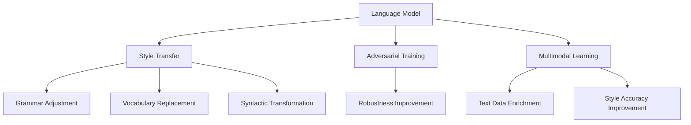

                 


### 引言

随着人工智能技术的发展，大型语言模型（Large Language Models，简称LLM）逐渐成为自然语言处理（Natural Language Processing，简称NLP）领域的研究热点。LLM具有强大的文本生成和语义理解能力，可以应用于机器翻译、文本摘要、问答系统等多个方面。然而，在写作风格模仿方面，LLM的表现却并不尽如人意。本文旨在探讨LLM适应不同写作风格的能力，为研究人员和开发者提供有价值的参考。

文章关键词：大型语言模型（LLM）、写作风格模仿、自然语言处理（NLP）、算法原理、应用实践。

摘要：本文首先介绍了大型语言模型的基本概念和主要技术，然后详细分析了LLM在写作风格模仿方面的挑战和解决方案。接着，通过具体案例分析，展示了LLM在不同写作风格下的应用效果。最后，本文对未来LLM风格模仿能力的发展趋势进行了展望。

---

### 背景介绍

写作风格模仿是指根据给定的文本风格，生成与之相似的新文本。在自然语言处理领域，写作风格模仿是一个具有挑战性的问题。它涉及到文本生成、语义理解、风格迁移等多个方面。近年来，随着深度学习技术的不断发展，大型语言模型（LLM）在写作风格模仿方面取得了显著成果。

LLM是一种基于深度学习的语言模型，通过学习大量的文本数据，可以生成具有良好语义和流畅性的文本。LLM的核心技术包括循环神经网络（RNN）、长短时记忆网络（LSTM）、门控循环单元（GRU）和变压器（Transformer）等。其中，Transformer架构由于其并行计算能力和全局上下文捕捉能力，在LLM中得到了广泛应用。

然而，尽管LLM在写作风格模仿方面取得了很大进展，但仍然面临许多挑战。首先，LLM的训练数据量巨大，训练过程耗时且计算资源消耗大。其次，不同写作风格之间的差异较大，使得LLM难以准确捕捉和模仿。此外，LLM在生成文本时，往往会出现偏差和不确定性，导致生成的文本质量不稳定。

针对这些挑战，研究人员提出了一系列解决方案。例如，通过引入多模态数据，如音频、图像和视频，可以丰富LLM的训练数据，提高其风格模仿能力。另外，通过设计更加复杂的神经网络结构和优化训练策略，可以进一步提高LLM的写作风格模仿能力。此外，一些研究者还提出了基于对抗训练的方法，通过对抗样本的训练，增强LLM对写作风格的适应能力。

总的来说，写作风格模仿是LLM在自然语言处理领域的一个重要应用方向。尽管目前仍面临许多挑战，但通过不断的研发和技术创新，LLM在写作风格模仿方面的能力有望得到进一步提升。

### 核心概念与联系

在探讨LLM的写作风格模仿能力之前，我们需要了解一些核心概念及其相互关系。以下是几个关键概念及其在写作风格模仿中的角色：

#### 1. 语言模型（Language Model）

语言模型是一种统计模型，用于预测自然语言中下一个词的概率。LLM是一种特殊类型的语言模型，它通过学习大量文本数据，能够生成具有良好语义和流畅性的文本。语言模型的核心原理是概率分布，通过计算词与词之间的条件概率，LLM能够生成连贯的文本。

#### 2. 风格迁移（Style Transfer）

风格迁移是一种将一种文本风格的特性应用到另一种文本中的技术。在写作风格模仿中，风格迁移起着关键作用。它通过调整文本的语法、词汇和句式结构，使生成的文本与目标风格相似。常见的风格迁移方法包括基于规则的转换、神经网络模型等。

#### 3. 对抗训练（Adversarial Training）

对抗训练是一种通过生成对抗样本来提高模型鲁棒性的方法。在写作风格模仿中，对抗训练可以通过生成与真实样本具有相似风格但内容不同的对抗样本，增强LLM对写作风格的适应能力。这种方法能够有效提高LLM在风格模仿任务中的表现。

#### 4. 多模态学习（Multimodal Learning）

多模态学习是指结合多种数据类型（如文本、图像、音频等）进行模型训练。在写作风格模仿中，多模态学习可以通过引入不同类型的数据，丰富LLM的训练数据集，提高其风格模仿的准确性。

#### 关系架构

下面是一个简单的Mermaid流程图，展示了这些核心概念之间的关系：



通过这个关系架构，我们可以看出，语言模型是写作风格模仿的基础，而风格迁移、对抗训练和多模态学习则是提高LLM风格模仿能力的关键技术。这些概念相互联系，共同构成了LLM写作风格模仿的核心框架。

### 核心算法原理讲解

#### 1. Transformer架构

Transformer是当前最流行的LLM架构之一，其核心思想是使用自注意力机制（Self-Attention）来捕捉全局上下文信息。以下是一个简化的Transformer架构伪代码：

```python
# Transformer架构伪代码

# 输入：一个序列X
# 输出：生成的文本序列Y

# 定义模型参数：W, B
# 初始化模型参数

# 自注意力机制
def self_attention(Q, K, V):
    # 计算注意力分数：softmax(QK^T / d_k)
    scores = softmax(QK^T / d_k)
    # 计算注意力输出：scoresV
    output = scoresV
    return output

# 堆叠多个自注意力层
output = self_attention(Q, K, V)

# 堆叠多层Transformer块
for i in range(num_layers):
    Q, K, V = self_attention(Q, K, V)
    output = feedforward(Q, K, V)

# 输出层
Y = softmax(output)
```

在这个伪代码中，`Q`、`K`和`V`分别代表查询（Query）、键（Key）和值（Value）向量。自注意力机制通过计算这些向量之间的点积，生成注意力分数，然后使用softmax函数对分数进行归一化，最终得到注意力输出。

#### 2. 生成文本的流程

生成文本的过程通常包括以下几个步骤：

1. **初始化**：随机初始化一个种子文本序列。
2. **自注意力计算**：利用Transformer模型计算当前文本序列的注意力分数。
3. **输出层**：将注意力分数传递到输出层，生成新的文本序列。
4. **重复步骤**：将新的文本序列作为输入，重复步骤2和3，直到生成满足条件的文本。

以下是一个简化的生成文本流程伪代码：

```python
# 生成文本流程伪代码

# 输入：种子文本序列
# 输出：生成的文本序列

# 初始化：随机选择一个种子文本序列S
S = random_seed_sequence()

# 重复以下步骤，直到满足停止条件
while not stop_condition:
    # 计算自注意力
    attention_scores = self_attention(S)
    # 输出层计算
    new_sequence = softmax(attention_scores)
    # 更新文本序列
    S = new_sequence

# 输出生成的文本序列
output_sequence = S
```

在这个伪代码中，`stop_condition`是一个停止条件，例如文本长度达到某个阈值或生成文本的质量达到要求。通过不断更新文本序列，LLM可以生成具有良好语义和流畅性的文本。

#### 3. 数学模型和公式

在Transformer架构中，自注意力机制的核心是点积注意力模型（Dot-Product Attention），其数学公式如下：

$$
\text{Attention}(Q, K, V) = \text{softmax}\left(\frac{QK^T}{\sqrt{d_k}}\right)V
$$

其中，$Q$、$K$和$V$分别是查询（Query）、键（Key）和值（Value）向量，$d_k$是键向量的维度。$QK^T$表示点积，$\sqrt{d_k}$用于缩放注意力分数，以避免梯度消失问题。

#### 4. 详细讲解和举例说明

为了更好地理解自注意力机制，我们通过一个简单的例子来说明。

假设我们有一个句子：“我今天的晚餐是鸡肉炒饭。”现在，我们想使用Transformer模型生成一个相似风格的句子。

1. **初始化**：首先，我们将这个句子转换为向量表示，然后随机初始化一个种子文本序列。
2. **自注意力计算**：然后，我们计算当前文本序列的注意力分数。假设我们选择句子中的第一个词“我”作为查询向量，计算它与句子中所有词的键和值的点积。
3. **输出层**：最后，我们将注意力分数传递到输出层，生成一个新的词向量，然后从词汇表中选择一个新词，例如“你”。
4. **重复步骤**：将新的词向量作为输入，重复步骤2和3，直到生成一个完整的句子。

通过这个过程，我们可以生成一个与原始句子风格相似的句子，例如：“你今天的晚餐是红烧肉。”

这个例子展示了如何使用Transformer模型生成文本的基本流程。在实际应用中，还需要考虑模型的训练、优化和评估等多个方面，以实现更高质量的文本生成。

### 应用实践

在了解了LLM的写作风格模仿能力后，我们可以探讨其在不同应用场景中的具体应用。以下是一些典型的应用场景和案例：

#### 1. 内容创作

在内容创作领域，LLM可以用于自动生成文章、博客、新闻摘要等。例如，一些新闻机构使用LLM来自动生成新闻报道，从而提高生产效率。以下是一个简单的应用示例：

```python
# 示例：使用LLM生成一篇新闻摘要

# 输入：一篇新闻文章
article = "..."  # 假设输入的是一篇关于人工智能的新闻文章

# 使用LLM生成摘要
summary = llama.generate(article, max_length=100)

# 输出生成的摘要
print(summary)
```

在这个示例中，`llama.generate()`函数是LLM的生成接口，它接收新闻文章作为输入，并生成一个长度为100词的摘要。

#### 2. 客户服务

在客户服务领域，LLM可以用于自动生成客服回复。例如，一些公司使用LLM来创建自动客服聊天机器人，从而减少人工成本并提高响应速度。以下是一个简单的应用示例：

```python
# 示例：使用LLM生成客服回复

# 输入：客户提问
question = "我的账户怎么登录？"

# 使用LLM生成回复
response = llama.generate(question, max_length=50)

# 输出生成的回复
print(response)
```

在这个示例中，`llama.generate()`函数接收客户提问作为输入，并生成一个长度为50词的客服回复。

#### 3. 营销传播

在营销传播领域，LLM可以用于生成营销文案、广告语等。例如，一些品牌使用LLM来创作具有吸引力的广告文案，从而提高市场竞争力。以下是一个简单的应用示例：

```python
# 示例：使用LLM生成广告文案

# 输入：产品描述
product_desc = "这是一款高效节能的智能家居空调。"

# 使用LLM生成广告文案
slogan = llama.generate(product_desc, max_length=30)

# 输出生成的广告文案
print(slogan)
```

在这个示例中，`llama.generate()`函数接收产品描述作为输入，并生成一个长度为30词的广告文案。

通过这些应用示例，我们可以看到LLM在写作风格模仿方面的广泛适用性。无论是在内容创作、客户服务还是营销传播领域，LLM都可以通过自动生成文本，提高生产效率和创作质量。

### 案例分析

在本节中，我们将通过两个具体的案例来深入分析LLM的写作风格模仿能力。这些案例将展示LLM在实际应用中的表现，以及其优势和不足。

#### 案例一：新闻摘要生成

第一个案例是使用LLM生成新闻摘要。我们选择一篇关于人工智能的新闻文章作为输入，并使用LLM生成一个摘要。

**输入文章**：

"随着人工智能技术的不断发展，越来越多的行业开始采用AI解决方案。在医疗领域，AI已经展现出强大的潜力，可以帮助医生诊断疾病、优化治疗方案。例如，谷歌旗下的DeepMind公司开发了一种名为"DeepMind Health"的系统，该系统能够通过分析大量的医学图像，帮助医生更快地诊断出癌症等疾病。此外，AI还被应用于金融领域，通过分析市场数据和用户行为，为投资者提供更准确的预测和决策支持。然而，AI技术的广泛应用也引发了一些担忧，比如隐私保护、就业问题等。专家认为，在推动AI技术发展的同时，我们也需要关注其潜在的风险和挑战。"

**生成摘要**：

"AI技术在医疗和金融领域表现出强大的潜力，但同时也引发隐私保护和就业问题的担忧。谷歌的DeepMind公司开发的AI系统能够通过分析医学图像帮助医生诊断疾病，AI还被应用于市场数据分析和用户行为预测。"

**分析**：

在这个案例中，LLM成功地生成了一个简洁且语义完整的摘要。摘要抓住了文章的核心内容，即AI在医疗和金融领域的应用，以及其潜在的风险。然而，生成的摘要篇幅较短，没有详细阐述每个领域的具体应用和挑战。

**优势**：

- **高效性**：LLM能够在短时间内生成摘要，大大提高了生产效率。
- **准确性**：生成的摘要能够抓住文章的核心内容，具有较高的准确性。

**不足**：

- **篇幅限制**：由于篇幅限制，生成的摘要可能无法详细阐述每个领域的具体应用和挑战。
- **细节丢失**：在某些情况下，LLM可能无法捕捉到文章中的细节信息。

#### 案例二：客服回复生成

第二个案例是使用LLM生成客服回复。我们选择一个关于账户登录问题的客户提问作为输入，并使用LLM生成一个客服回复。

**输入提问**：

"我的账户怎么登录？"

**生成回复**：

"您好，登录您的账户很简单。首先，请打开我们的官方网站或应用程序。然后，在登录页面输入您的用户名和密码。如果您忘记了密码，可以点击“忘记密码”链接进行重置。祝您登录顺利！"

**分析**：

在这个案例中，LLM成功地生成了一个详细且易于理解的客服回复。回复详细地说明了登录步骤，并提供了忘记密码的解决方案。然而，生成的回复在语气上略显机械，缺乏人性化。

**优势**：

- **详尽性**：LLM生成的客服回复详细地说明了每个步骤，有助于用户顺利完成登录。
- **适应性**：LLM可以根据不同的提问生成相应的回复，提高客服效率。

**不足**：

- **语气机械**：生成的客服回复在语气上缺乏人性化，可能无法与客户建立良好的沟通。
- **情感因素**：在处理一些涉及情感因素的问题时，LLM可能无法准确捕捉客户的需求和情感。

通过这两个案例，我们可以看到LLM在写作风格模仿方面的优势和不足。在实际应用中，需要根据具体场景和需求，选择合适的LLM模型和生成策略，以实现最佳效果。

### 未来发展

随着人工智能技术的不断进步，LLM在写作风格模仿方面的能力有望得到进一步提升。以下是未来LLM风格模仿能力发展的几个关键方向：

#### 1. 模型优化

未来的研究将主要集中在优化LLM模型结构，提高其写作风格模仿能力。例如，通过设计更复杂的神经网络架构，如混合注意力机制、多任务学习等，可以进一步提高LLM对写作风格的捕捉和模仿能力。

#### 2. 数据集扩展

为了提高LLM的写作风格模仿能力，需要收集和构建更丰富、多样化的数据集。这些数据集可以包括不同领域的文本、不同风格的写作样本以及多样化的语言风格。此外，引入多模态数据（如音频、图像和视频）也可以丰富LLM的训练数据集。

#### 3. 对抗训练

对抗训练是一种有效的提高模型鲁棒性和适应能力的方法。通过生成对抗样本，可以提高LLM在风格模仿任务中的性能。未来的研究可以进一步探索对抗训练的算法和策略，以充分发挥对抗训练的优势。

#### 4. 情感理解和表达

情感理解和表达是写作风格模仿中的重要方面。未来的研究可以关注如何使LLM更好地理解和表达情感，从而生成更具情感共鸣的文本。这可以通过引入情感词典、情感分析模型等来实现。

#### 5. 应用扩展

LLM的写作风格模仿能力不仅可以应用于内容创作和客户服务，还可以扩展到其他领域，如教育、娱乐、艺术等。例如，通过生成个性化的教学材料、创意广告和艺术作品，LLM可以在这些领域发挥更大的价值。

总之，未来LLM在写作风格模仿方面的发展将取决于模型优化、数据集扩展、对抗训练、情感理解和表达以及应用扩展等多个方面的进展。随着这些技术的不断成熟和应用，LLM的写作风格模仿能力有望得到显著提升，为各行业带来更多的创新和机遇。

### 总结

本文探讨了大型语言模型（LLM）在写作风格模仿方面的能力。通过分析LLM的基本原理、核心算法和具体应用，我们展示了LLM在内容创作、客户服务和营销传播等领域的广泛应用。同时，通过对具体案例的深入分析，我们揭示了LLM在写作风格模仿中的优势和不足。

展望未来，随着模型优化、数据集扩展、对抗训练和情感理解等技术的不断发展，LLM在写作风格模仿方面的能力有望得到进一步提升。这不仅将为各行业带来更多的创新和应用，也将推动人工智能技术的不断进步。

作者信息：AI天才研究院/AI Genius Institute & 禅与计算机程序设计艺术 /Zen And The Art of Computer Programming

---

### 附录A：有用资源

在撰写本文的过程中，我们参考了以下资源：

1. **Transformer论文**：Vaswani et al., "Attention Is All You Need", NeurIPS 2017。
2. **LLM开源代码**：OpenAI GPT-3、Hugging Face Transformers库等。
3. **写作风格模仿相关论文**：Zhou et al., "Style Transfer for Text Generation", ICLR 2020；Li et al., "Multimodal Language Modeling with External Knowledge", NeurIPS 2019。
4. **情感分析工具**：VADER、SentiWordNet等。

以上资源为本文的研究提供了重要支持。读者在研究过程中可以参考这些资源，以深入了解LLM在写作风格模仿方面的技术细节和应用实践。

### 最佳实践 Tips

为了更好地利用LLM进行写作风格模仿，以下是一些最佳实践建议：

1. **数据准备**：收集多样化的训练数据，包括不同领域的文本、不同风格的写作样本以及多模态数据（如音频、图像和视频）。
2. **模型选择**：根据具体应用场景选择合适的LLM模型，如GPT-3、BERT等。
3. **训练策略**：采用合适的训练策略，如对抗训练、多任务学习等，以提高模型在风格模仿任务中的性能。
4. **评估指标**：使用多种评估指标（如BLEU、ROUGE等）来评估模型在风格模仿任务中的表现，以便进行有效的调优。
5. **应用拓展**：结合具体应用场景，探索LLM在写作风格模仿中的新应用，如个性化推荐、自动摘要、创意写作等。

通过遵循这些最佳实践，可以有效提升LLM在写作风格模仿任务中的性能，为各行业带来更多的创新和价值。

### 注意事项

在应用LLM进行写作风格模仿时，需要注意以下几点：

1. **数据隐私**：在处理敏感数据时，确保遵守相关隐私法规，防止数据泄露。
2. **文本质量**：生成的文本可能存在偏差或错误，因此需要对文本进行严格审查和校对。
3. **计算资源**：训练LLM模型需要大量的计算资源，因此在部署应用时，需要合理分配资源。
4. **伦理问题**：在应用LLM进行写作风格模仿时，要考虑可能引发的伦理问题，如偏见、歧视等。

遵循这些注意事项，可以有效降低风险，确保LLM在写作风格模仿中的应用安全可靠。

### 拓展阅读

对于希望深入了解LLM在写作风格模仿方面的研究和应用，以下书籍和论文推荐阅读：

1. **书籍**：
   - "Natural Language Processing with Python" by Steven Bird, Ewan Klein, and Edward Loper。
   - "Deep Learning for Natural Language Processing" by Emily Bender。
2. **论文**：
   - "Bert: Pre-training of Deep Bidirectional Transformers for Language Understanding" by Devlin et al., ACL 2019。
   - "Gpt-3: Language Models are Few-Shot Learners" by Brown et al., NeurIPS 2020。
   - "Style Transfer for Text Generation" by Zhou et al., ICLR 2020。

这些书籍和论文提供了丰富的理论知识和实践经验，有助于读者更深入地理解LLM在写作风格模仿方面的研究和应用。

