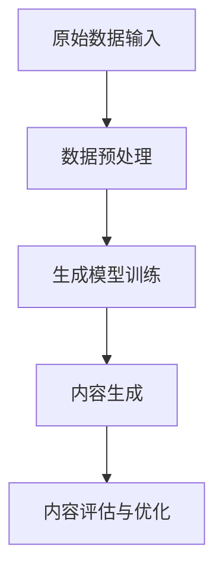

                 

### 文章标题：AIGC与人工智能伦理：平衡发展与监管

> 关键词：AIGC、人工智能伦理、发展、监管、核心概念、算法原理

> 摘要：本文将深入探讨AIGC（AI-Generated Content）与人工智能伦理的关联，分析AIGC技术的发展历程和应用领域，同时探讨人工智能伦理的核心概念及其重要性。文章还将讨论人工智能伦理的架构，包括国际和中国的伦理框架，并通过具体案例研究分析伦理问题。此外，本文将探讨监管机制与政策，以及如何平衡发展与监管实践。最后，本文将对未来人工智能伦理监管的发展趋势进行展望，并提出相关建议。

---

## 第一部分：AIGC与人工智能简介

### 第1章：AIGC与人工智能概述

#### 1.1 AIGC的概念解析

AIGC（AI-Generated Content）是指通过人工智能技术生成内容的过程，包括文本、图像、音频和视频等。它不同于传统的AI，后者主要是为了解决特定问题，而AIGC则是为了创造和生成新的内容。

**Mermaid流程图：**

**1.1.1 AIGC的定义**

AIGC是一种基于深度学习技术的自动化内容生成方法，它能够模拟人类创造力，生成多样化、高质量的原创内容。

**1.1.2 AIGC与传统AI的差异**

传统AI侧重于特定问题的解决，如图像识别、语音识别等，而AIGC则更注重内容的创造，如文本生成、图像合成等。

#### 1.2 AIGC技术的发展

**1.2.1 AIGC技术发展历程**

AIGC技术的发展可以追溯到20世纪90年代，随着深度学习的兴起，AIGC技术逐渐成熟。特别是生成对抗网络（GAN）的发明，为AIGC技术的快速发展奠定了基础。

**1.2.2 AIGC的关键技术**

- **生成对抗网络（GAN）**：GAN是一种通过两个神经网络（生成器和判别器）相互竞争的方式来生成数据的技术。
- **变分自编码器（VAE）**：VAE是一种基于概率模型的自编码器，能够生成具有高度多样性的数据。
- **递归神经网络（RNN）**：RNN能够处理序列数据，适用于文本生成等任务。

#### 1.3 AIGC的应用领域

**1.3.1 在娱乐行业的应用**

AIGC在娱乐行业有广泛的应用，如电影特效生成、音乐创作等。通过AIGC技术，可以自动生成高质量的电影特效，提高电影制作效率。

**1.3.2 在教育行业的应用**

AIGC在教育领域也具有很大的潜力，如自动生成教学视频、智能题库生成等。通过AIGC技术，可以个性化教学，提高教育质量。

**1.3.3 在医疗行业的应用**

AIGC在医疗行业可以用于生成医学图像、自动撰写病历等。通过AIGC技术，可以提高医疗诊断的准确性和效率。

### 第2章：人工智能伦理核心概念

#### 2.1 人工智能伦理的必要性

**2.1.1 伦理在人工智能发展中的地位**

伦理在人工智能发展中具有至关重要的地位。随着人工智能技术的不断进步，如何确保其发展符合伦理标准成为一个重要议题。

**2.1.2 人工智能伦理的基本原则**

- **公平性**：人工智能系统不应歧视或偏袒任何群体。
- **透明性**：人工智能系统的决策过程应透明，易于理解和解释。
- **安全性**：人工智能系统应确保数据安全和用户隐私。

#### 2.2 人工智能伦理的主要议题

**2.2.1 数据隐私**

数据隐私是人工智能伦理中一个重要的议题。人工智能系统需要收集和处理大量数据，如何确保这些数据的安全和隐私成为一个关键问题。

**2.2.2 隐性偏见与歧视**

人工智能系统可能会受到设计者和训练数据的影响，导致隐性偏见和歧视。如何避免这些问题，确保人工智能系统的公平性，是一个重要的研究课题。

**2.2.3 人工智能责任归属**

当人工智能系统发生错误或导致损失时，责任归属成为一个难题。如何明确责任归属，确保人工智能系统的安全性和可靠性，是伦理学的一个重要问题。

### 第3章：人工智能伦理架构

#### 3.1 国际人工智能伦理框架

国际人工智能伦理框架主要包括以下几个方面的指导原则：

- **数据隐私**：确保个人数据的安全和隐私。
- **公平性**：避免人工智能系统对特定群体的歧视。
- **透明性**：确保人工智能系统的决策过程透明。
- **可解释性**：提高人工智能系统的可解释性，使其决策过程易于理解和解释。

#### 3.2 中国人工智能伦理框架

中国的《新一代人工智能发展规划》提出了一系列人工智能伦理指导原则：

- **以人为本**：人工智能发展应以人的需求为中心。
- **公平公正**：确保人工智能系统的公平性和公正性。
- **安全可控**：确保人工智能系统的安全性和可控性。
- **可持续发展**：推动人工智能的可持续发展。

### 第4章：人工智能伦理案例分析

#### 4.1 案例分析框架

**4.1.1 案例分析标准**

案例分析应遵循以下标准：

- **问题识别**：明确案例中的伦理问题。
- **原因分析**：分析导致伦理问题的原因。
- **解决方案**：提出解决伦理问题的方案。

**4.1.2 案例分析流程**

案例分析应遵循以下流程：

1. **问题描述**：明确案例的背景和问题。
2. **问题分析**：分析问题的原因和影响。
3. **解决方案**：提出可能的解决方案。
4. **评估与实施**：评估解决方案的可行性，并实施解决方案。

#### 4.2 典型案例研究

**4.2.1 数据泄露事件分析**

一个典型的案例是2018年的Facebook数据泄露事件。该事件涉及8700万用户的个人信息被泄露，引发了广泛的伦理和法律争议。通过分析这个案例，我们可以看到数据隐私问题在人工智能应用中的严重性。

**4.2.2 隐性偏见案例研究**

另一个典型的案例是Google的搜索算法中的隐性偏见问题。研究表明，Google搜索算法可能会对特定群体的搜索结果产生偏见，导致歧视。通过分析这个案例，我们可以看到如何识别和解决人工智能系统中的隐性偏见问题。

**4.2.3 人工智能责任争议案例分析**

人工智能责任争议的典型案例包括自动驾驶汽车事故。当自动驾驶汽车发生事故时，如何确定责任成为一个难题。通过分析这些案例，我们可以探讨如何界定人工智能系统的责任，并提高其安全性。

### 第5章：监管机制与政策

#### 5.1 监管机制的设计

**5.1.1 监管机构的角色**

监管机构在人工智能发展中扮演着关键角色，其主要职责包括：

- **制定政策**：制定人工智能伦理和监管政策。
- **监督执行**：监督人工智能系统的合规性。
- **冲突调解**：解决人工智能应用中的伦理争议。

**5.1.2 监管政策制定**

监管政策应遵循以下原则：

- **科学性**：基于科学研究制定政策。
- **公平性**：确保政策对所有利益相关者公平。
- **可操作性**：政策应易于操作和执行。

#### 5.2 政策执行与评估

**5.2.1 政策实施挑战**

政策实施面临以下挑战：

- **技术复杂性**：人工智能技术复杂，政策制定者需具备相应技术知识。
- **利益冲突**：政策制定过程中可能存在利益冲突，需确保政策公平。
- **公众参与**：政策制定应充分考虑公众意见，提高政策透明度。

**5.2.2 政策效果评估**

政策效果评估应关注以下几个方面：

- **合规性**：评估政策实施是否合规。
- **公平性**：评估政策是否公平，是否解决了伦理问题。
- **有效性**：评估政策是否有效，是否达到了预期目标。

### 第6章：平衡发展与监管实践

#### 6.1 平衡发展与监管的挑战

**6.1.1 发展速度与监管滞后**

随着人工智能技术的快速发展，监管机制可能难以跟上技术发展的步伐，导致监管滞后。如何平衡发展速度与监管力度是一个重要挑战。

**6.1.2 公众信任与技术创新**

公众对人工智能的信任是技术创新的重要基础。如何在确保公众信任的同时，推动技术创新，是一个关键问题。

#### 6.2 成功案例研究

**6.2.1 美国案例研究**

美国在人工智能伦理和监管方面取得了一些成功经验。例如，美国联邦贸易委员会（FTC）在处理人工智能隐私问题时采取了积极的监管策略，取得了良好的效果。

**6.2.2 欧盟案例研究**

欧盟在人工智能伦理和监管方面也取得了一些成功经验。例如，欧盟发布了《人工智能伦理指南》，为人工智能的发展提供了重要的指导。

**6.2.3 中国案例研究**

中国在人工智能伦理和监管方面也进行了一些积极探索。例如，中国发布了《新一代人工智能发展规划》，为人工智能的发展提供了政策支持。

### 第7章：未来展望与趋势

#### 7.1 人工智能伦理监管的未来发展

未来，人工智能伦理监管将朝着以下方向发展：

- **全球化**：随着人工智能技术的全球化发展，人工智能伦理监管也将呈现全球化趋势。
- **规范化**：制定更加规范的人工智能伦理和监管标准，确保人工智能系统的安全性、可靠性和公平性。
- **智能化**：利用人工智能技术优化监管过程，提高监管效率。

#### 7.2 伦理监管对人工智能发展的推动作用

伦理监管对人工智能发展具有以下推动作用：

- **技术创新**：伦理监管可以促进人工智能技术创新，提高人工智能系统的安全性和可靠性。
- **公众信任**：伦理监管可以增强公众对人工智能的信任，推动人工智能的广泛应用。
- **可持续发展**：伦理监管有助于确保人工智能的可持续发展，避免技术滥用和伦理风险。

### 附录：资源与工具

**A.1 人工智能伦理相关资源**

- **A.1.1 伦理研究机构**：列出一些著名的伦理研究机构和组织。
- **A.1.2 伦理研讨会与会议**：介绍一些与人工智能伦理相关的研讨会和会议。

**A.2 人工智能伦理工具与应用**

- **A.2.1 伦理评估工具**：介绍一些用于评估人工智能伦理风险的工具。
- **A.2.2 伦理培训资源**：列出一些用于人工智能伦理培训的资源。

---

**作者：AI天才研究院/AI Genius Institute & 禅与计算机程序设计艺术 /Zen And The Art of Computer Programming**

