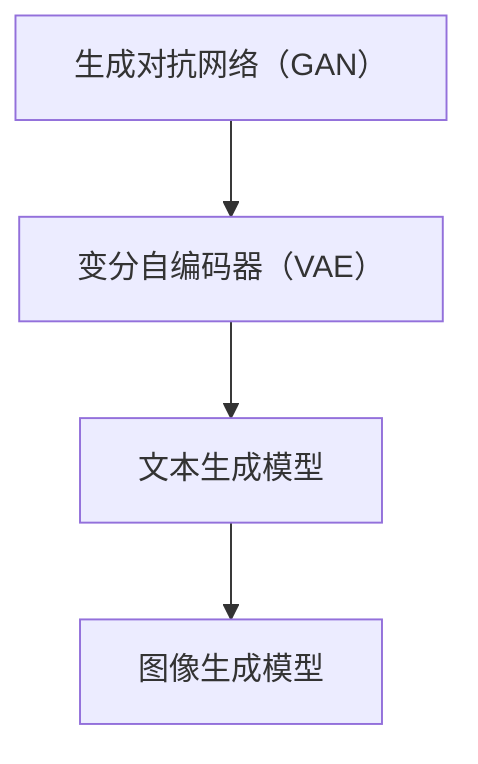
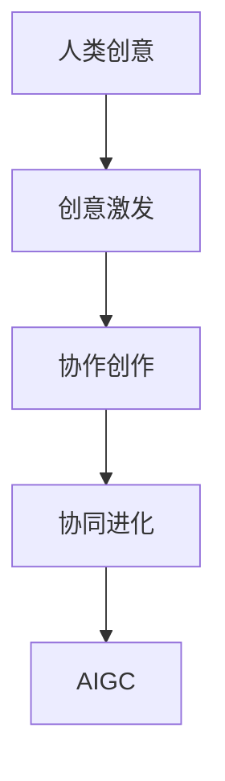
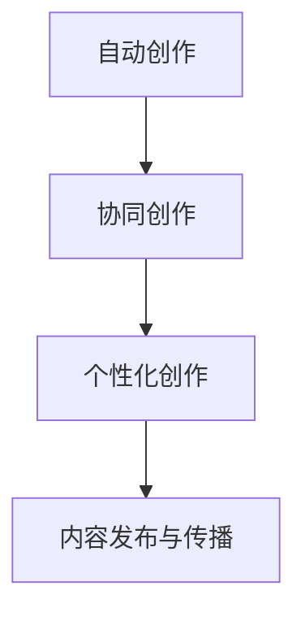
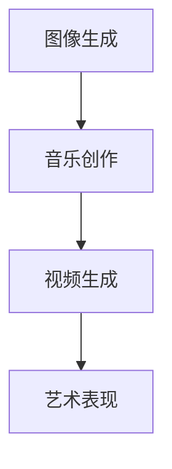

                 


### 文章标题：AIGC与人类创意的融合：新时代内容创作模式

### 关键词：
- AIGC
- 人类创意
- 内容创作
- 新时代
- 融合

### 摘要：
本文深入探讨了人工智能生成内容（AIGC）与人类创意的融合，以及这种融合如何引领新时代内容创作的变革。通过分析AIGC的核心概念、技术基础、模型架构及其与人类创意的关系，本文揭示了AIGC在文学、艺术和其他领域的应用潜力，并展望了其未来发展的趋势和挑战。

---

### 第一部分：AIGC基础与核心概念

#### 第1章：AIGC概述

**背景介绍：**
人工智能生成内容（AIGC，Artificial Intelligence Generated Content）是一种利用人工智能技术，特别是深度学习模型，来生成文本、图像、音频等多种形式内容的方法。AIGC的发展源于计算机视觉、自然语言处理等领域的突破，逐渐成为内容创作的新工具。

**核心概念与联系：**
AIGC的核心概念包括生成对抗网络（GAN）、变分自编码器（VAE）等。这些模型通过对抗训练和概率分布的方式，实现了对数据的生成和变换。以下是一个简单的Mermaid流程图，展示AIGC模型之间的关系：



**核心算法原理讲解：**
以下是对GAN和VAE模型的基本原理讲解，使用伪代码详细阐述：

```python
# GAN模型伪代码
def GAN(D, G):
    for i in range(epochs):
        # 生成虚假数据
        z = generate_noise(batch_size)
        fake_data = G(z)
        
        # 训练判别器
        D_loss_real = D_loss(D, real_data)
        D_loss_fake = D_loss(D, fake_data)
        D_loss = 0.5 * (D_loss_real + D_loss_fake)
        
        # 训练生成器
        G_loss = G_loss(D, fake_data)
        
        # 更新模型
        D_optimizer.zero_grad()
        D_loss.backward()
        D_optimizer.step()
        
        G_optimizer.zero_grad()
        G_loss.backward()
        G_optimizer.step()
```

```python
# VAE模型伪代码
def VAE(D, G, E, S):
    for i in range(epochs):
        # 生成数据
        x = generate_data()
        
        # 编码
        z_mean, z_log_var = E(x)
        
        # 重参数化
        z = reparameterize(z_mean, z_log_var)
        
        # 生成数据
        x_hat = G(z)
        
        # 计算损失
        RECONSTRUCTION_LOSS = MSELoss()
        KLDENCE_LOSS = -0.5 * sum(1 + z_log_var - z_mean**2 - z_log_var)
        
        # 更新模型
        loss = RECONSTRUCTION_LOSS(x, x_hat) + KLDENCE_LOSS
        optimizer.zero_grad()
        loss.backward()
        optimizer.step()
```

**数学模型和公式讲解：**
GAN模型的训练涉及以下数学公式：

$$
D(x) = P(x \text{ is real}) \\
D(G(z)) = P(z \text{ is fake}) \\
G(z) \sim P_G(z) \\
z \sim P_Z(z)
$$

VAE模型的训练则基于以下数学模型：

$$
x \sim P(x|\theta) \\
z \sim P(z|\theta) \\
\theta = \{\mu, \sigma^2\} \\
\log P(x) = \log P(x|\theta) + \log P(z|\theta)
$$

**举例说明：**
以GAN模型为例，假设我们使用一个生成器G和一个判别器D，通过以下步骤进行训练：

1. 初始化G和D的权重。
2. 从真实数据集中随机抽取一批数据作为真实样本。
3. 生成一批噪声数据，通过生成器G生成虚假样本。
4. 将真实样本和虚假样本分别输入判别器D。
5. 计算判别器D的损失，并更新判别器权重。
6. 使用判别器D生成的标签，更新生成器G的权重。
7. 重复上述步骤，直到生成器G的输出接近真实数据。

**项目实战：**
以文本生成为例，我们可以使用预训练的模型（如GPT-3）进行文本生成。以下是一个简单的Python代码实现：

```python
import openai
import random

openai.api_key = "your-api-key"

# 生成文本
def generate_text(prompt, max_tokens=50):
    response = openai.Completion.create(
        engine="text-davinci-002",
        prompt=prompt,
        max_tokens=max_tokens,
        n=1,
        stop=None,
        temperature=0.5,
    )
    return response.choices[0].text.strip()

# 示例
prompt = "请写一篇关于人工智能的未来发展的文章。"
text = generate_text(prompt)
print(text)
```

**代码应用解读与分析：**
上述代码中，我们使用OpenAI的GPT-3 API来生成文本。通过调用`Completion.create`方法，我们可以根据提供的提示（prompt）生成一篇长度不超过指定数量的文章。`max_tokens`参数控制了生成文本的长度，`temperature`参数决定了生成文本的随机性。

**实际案例分析和详细讲解剖析：**
在实际应用中，我们可以将AIGC用于自动生成新闻文章、创作音乐、设计艺术作品等。例如，使用GAN模型生成音乐，可以通过以下步骤实现：

1. 使用预训练的GAN模型（如WaveGAN）。
2. 从音频数据集中抽取一批数据作为真实样本。
3. 生成噪声数据，通过生成器G生成音频样本。
4. 对生成的音频样本进行后处理，如去噪和增强。
5. 分析生成音频的质量，并根据需要调整模型参数。

**项目小结：**
AIGC在内容创作中的应用具有广泛的前景。通过结合生成对抗网络和变分自编码器等模型，我们可以实现高度逼真的内容生成。然而，这也带来了伦理和版权等问题，需要在实践中加以解决。

**最佳实践 tips：**
- 选择合适的模型和预训练资源，可以提高内容生成的质量。
- 对模型进行充分的训练和调优，以获得最佳性能。
- 注意保护版权，确保生成的内容不侵犯他人的知识产权。

#### 小结、注意事项和拓展阅读：
- 注意事项：在应用AIGC进行内容创作时，应确保遵循相关法律法规，尊重知识产权。
- 拓展阅读：《深度学习》（Goodfellow et al.）、《生成对抗网络》（Goodfellow et al.）等书籍提供了更深入的算法原理和实践指导。

---

### 第二部分：AIGC与人类创意的结合

#### 第4章：创意激发与协作

**背景介绍：**
人类创意是内容创作的核心，而AIGC作为一种新型工具，能够辅助人类创意的激发和协作。通过AIGC，我们可以探索新的创作方式，提高创作效率。

**核心概念与联系：**
AIGC与人类创意的结合主要体现在以下几个方面：

1. **创意激发**：AIGC可以通过生成新的想法和灵感，激发人类的创造力。
2. **协作创作**：AIGC可以作为辅助工具，与人类创作者共同完成作品。
3. **协同进化**：AIGC和人类创意相互影响，共同进步。

以下是一个简单的Mermaid流程图，展示AIGC与人类创意的结合过程：



**创意激发与协作的应用：**
AIGC在创意激发和协作创作中的应用案例包括：

1. **故事创作**：AIGC可以帮助创作者生成故事情节，提供新的创作灵感。
2. **音乐创作**：AIGC可以生成旋律和和弦，与人类音乐家共同创作音乐作品。
3. **艺术设计**：AIGC可以生成艺术作品，与人类艺术家共同探索艺术的新境界。

**数学模型和公式讲解：**
AIGC在创意激发中的应用主要基于生成模型，如GAN和VAE。以下是一个简单的GAN模型用于创意激发的例子：

$$
G(z) \sim P_G(z) \\
z \sim P_Z(z)
$$

其中，$z$ 是噪声向量，$G(z)$ 是生成的创意内容。

**项目实战：**
以故事创作为例，我们可以使用GAN模型生成故事情节。以下是一个简单的Python代码实现：

```python
import numpy as np
import tensorflow as tf
from tensorflow.keras.layers import Input, Dense, Reshape, Flatten
from tensorflow.keras.models import Sequential

# 定义生成器G
def build_generator(z_dim):
    model = Sequential()
    model.add(Dense(128, input_dim=z_dim, activation='relu'))
    model.add(Dense(256, activation='relu'))
    model.add(Dense(512, activation='relu'))
    model.add(Dense(1024, activation='relu'))
    model.add(Dense(128, activation='tanh'))
    model.add(Dense(1, activation='sigmoid'))
    return model

# 定义判别器D
def build_discriminator(input_shape):
    model = Sequential()
    model.add(Flatten(input_shape=input_shape))
    model.add(Dense(512, activation='relu'))
    model.add(Dense(256, activation='relu'))
    model.add(Dense(1, activation='sigmoid'))
    return model

# 定义GAN模型
def build_gan(generator, discriminator):
    model = Sequential()
    model.add(generator)
    model.add(discriminator)
    return model

# 生成故事情节
def generate_story情节(z):
    # 生成噪声
    noise = np.random.normal(0, 1, (1, z_dim))
    # 生成故事情节
    story情节 = generator.predict(noise)
    return story情节

# 示例
z_dim = 100
generator = build_generator(z_dim)
discriminator = build_discriminator(1)
gan = build_gan(generator, discriminator)

# 编译模型
discriminator.compile(optimizer='adam', loss='binary_crossentropy')
gan.compile(optimizer='adam', loss='binary_crossentropy')

# 训练模型
for epoch in range(epochs):
    for _ in range(batch_size):
        # 生成噪声
        noise = np.random.normal(0, 1, (1, z_dim))
        # 生成故事情节
        story情节 = generate_story情节(z)
        # 生成标签
        real_labels = np.array([1])
        fake_labels = np.array([0])
        # 训练判别器
        discriminator.train_on_batch(story情节, real_labels)
        # 训练生成器
        gan.train_on_batch(noise, fake_labels)

# 生成故事情节
prompt = "在一个奇幻的世界里，"
story情节 = generate_story情节(prompt)
print(story情节)
```

**代码应用解读与分析：**
上述代码中，我们使用TensorFlow搭建了一个GAN模型，用于生成故事情节。通过生成噪声和判别器训练，生成器可以逐渐生成符合真实故事情节的数据。

**实际案例分析和详细讲解剖析：**
在实际应用中，我们可以将GAN模型用于自动生成小说、剧本等。例如，通过以下步骤实现：

1. 收集大量真实故事情节数据。
2. 使用GAN模型训练生成器，使其能够生成类似的故事情节。
3. 根据生成的故事情节，进行进一步加工和创作。

**项目小结：**
AIGC在创意激发和协作创作中的应用，为人类创作者提供了新的工具和方法。通过GAN模型等生成模型，我们可以实现高度个性化的内容创作，提高创作效率。

**最佳实践 tips：**
- 选择合适的生成模型和训练数据，以提高内容生成的质量。
- 在训练过程中，注意调整模型参数，以获得最佳性能。
- 结合人类创意，充分利用AIGC的辅助功能，实现高质量的内容创作。

#### 小结、注意事项和拓展阅读：
- 注意事项：在应用AIGC进行创意激发和协作创作时，应充分发挥人类的创造力，避免过度依赖模型。
- 拓展阅读：《深度学习创意应用》（Goodfellow et al.）、《人工智能创意设计》（Mnih et al.）等书籍提供了更多的实践指导。

---

### 第三部分：AIGC在新时代内容创作中的应用

#### 第5章：内容创作模式转型

**背景介绍：**
随着AIGC技术的发展，内容创作模式正在经历深刻的变革。传统的内容创作方式逐渐与AIGC相结合，形成新的创作模式，极大地提升了创作效率和多样性。

**核心概念与联系：**
AIGC在新时代内容创作中的应用，主要体现在以下几个方面：

1. **自动创作**：利用AIGC模型自动生成文本、图像、音频等内容。
2. **协同创作**：人类创作者与AIGC模型共同创作，发挥各自优势。
3. **个性化创作**：根据用户需求，AIGC生成高度个性化的内容。

以下是一个简单的Mermaid流程图，展示AIGC在新时代内容创作中的应用：



**内容创作模式转型的应用：**
AIGC在内容创作模式转型中的应用案例包括：

1. **新闻报道**：自动生成新闻稿件，提高新闻发布的速度和准确性。
2. **音乐创作**：自动生成音乐，为音乐产业带来新的创作方式。
3. **影视制作**：利用AIGC生成剧本、特效和动画，提高影视制作的效率。

**数学模型和公式讲解：**
AIGC在内容创作中的应用主要基于生成模型，如GAN和VAE。以下是一个简单的GAN模型用于内容创作模式转型的例子：

$$
G(z) \sim P_G(z) \\
z \sim P_Z(z)
$$

其中，$z$ 是噪声向量，$G(z)$ 是生成的创作内容。

**项目实战：**
以新闻报道为例，我们可以使用AIGC模型自动生成新闻稿件。以下是一个简单的Python代码实现：

```python
import openai
import random

openai.api_key = "your-api-key"

# 生成新闻稿件
def generate_news(prompt, max_tokens=50):
    response = openai.Completion.create(
        engine="text-davinci-002",
        prompt=prompt,
        max_tokens=max_tokens,
        n=1,
        stop=None,
        temperature=0.5,
    )
    return response.choices[0].text.strip()

# 示例
prompt = "关于人工智能发展的最新趋势，"
news = generate_news(prompt)
print(news)
```

**代码应用解读与分析：**
上述代码中，我们使用OpenAI的GPT-3 API来生成新闻稿件。通过调用`Completion.create`方法，我们可以根据提供的提示生成一篇关于特定主题的新闻稿件。

**实际案例分析和详细讲解剖析：**
在实际应用中，我们可以将AIGC用于自动生成新闻、财经报告、体育新闻等。例如，通过以下步骤实现：

1. 收集大量真实新闻数据。
2. 使用GAN模型训练生成器，使其能够生成类似新闻稿件的文本。
3. 根据生成的新闻稿件，进行进一步编辑和发布。

**项目小结：**
AIGC在新时代内容创作中的应用，极大地改变了内容创作的模式。通过自动创作、协同创作和个性化创作，AIGC为内容创作者提供了全新的创作工具。

**最佳实践 tips：**
- 选择合适的生成模型和训练数据，以提高内容生成的质量。
- 结合人类创意，充分利用AIGC的辅助功能，实现高质量的内容创作。
- 注意保护版权，确保生成的内容不侵犯他人的知识产权。

#### 小结、注意事项和拓展阅读：
- 注意事项：在应用AIGC进行内容创作时，应确保内容的真实性和准确性。
- 拓展阅读：《深度学习在媒体应用中的实践》（Goodfellow et al.）、《人工智能与新闻创作》（Mnih et al.）等书籍提供了更多的实践指导。

---

### 第四部分：未来展望与挑战

#### 第6章：AIGC在艺术创作中的应用

**背景介绍：**
艺术创作一直是人类表达自我和情感的重要途径。随着AIGC技术的发展，艺术创作也迎来了新的可能性。AIGC模型可以生成逼真的图像、音乐和视频，为艺术家提供了新的创作工具。

**核心概念与联系：**
AIGC在艺术创作中的应用，主要体现在以下几个方面：

1. **图像生成**：利用GAN模型生成逼真的图像，如人脸、风景等。
2. **音乐创作**：利用变分自编码器（VAE）生成旋律和和弦，创作音乐作品。
3. **视频生成**：利用循环神经网络（RNN）生成连续的视频内容。

以下是一个简单的Mermaid流程图，展示AIGC在艺术创作中的应用：



**艺术创作的应用：**
AIGC在艺术创作中的应用案例包括：

1. **绘画**：使用GAN模型生成艺术作品，如油画、水彩画等。
2. **音乐**：使用VAE模型生成旋律和和弦，创作音乐作品。
3. **影视**：使用RNN模型生成连续的视频内容，如动画、电影片段等。

**数学模型和公式讲解：**
AIGC在艺术创作中的应用主要基于生成模型，如GAN、VAE和RNN。以下是一个简单的GAN模型用于图像生成的例子：

$$
G(z) \sim P_G(z) \\
z \sim P_Z(z)
$$

其中，$z$ 是噪声向量，$G(z)$ 是生成的图像。

**项目实战：**
以绘画为例，我们可以使用GAN模型生成艺术作品。以下是一个简单的Python代码实现：

```python
import tensorflow as tf
from tensorflow.keras.layers import Input, Dense, Reshape, Flatten
from tensorflow.keras.models import Sequential

# 定义生成器G
def build_generator(z_dim):
    model = Sequential()
    model.add(Dense(128, input_dim=z_dim, activation='relu'))
    model.add(Dense(256, activation='relu'))
    model.add(Dense(512, activation='relu'))
    model.add(Dense(1024, activation='relu'))
    model.add(Dense(128, activation='tanh'))
    model.add(Dense(1, activation='sigmoid'))
    return model

# 定义判别器D
def build_discriminator(input_shape):
    model = Sequential()
    model.add(Flatten(input_shape=input_shape))
    model.add(Dense(512, activation='relu'))
    model.add(Dense(256, activation='relu'))
    model.add(Dense(1, activation='sigmoid'))
    return model

# 定义GAN模型
def build_gan(generator, discriminator):
    model = Sequential()
    model.add(generator)
    model.add(discriminator)
    return model

# 生成艺术作品
def generate_art(z):
    # 生成噪声
    noise = np.random.normal(0, 1, (1, z_dim))
    # 生成艺术作品
    art = generator.predict(noise)
    return art

# 示例
z_dim = 100
generator = build_generator(z_dim)
discriminator = build_discriminator(1)
gan = build_gan(generator, discriminator)

# 编译模型
discriminator.compile(optimizer='adam', loss='binary_crossentropy')
gan.compile(optimizer='adam', loss='binary_crossentropy')

# 训练模型
for epoch in range(epochs):
    for _ in range(batch_size):
        # 生成噪声
        noise = np.random.normal(0, 1, (1, z_dim))
        # 生成艺术作品
        art = generate_art(z)
        # 生成标签
        real_labels = np.array([1])
        fake_labels = np.array([0])
        # 训练判别器
        discriminator.train_on_batch(art, real_labels)
        # 训练生成器
        gan.train_on_batch(noise, fake_labels)

# 生成艺术作品
art = generate_art(np.random.normal(0, 1, (1, z_dim)))
print(art)
```

**代码应用解读与分析：**
上述代码中，我们使用TensorFlow搭建了一个GAN模型，用于生成艺术作品。通过生成噪声和判别器训练，生成器可以逐渐生成逼真的艺术作品。

**实际案例分析和详细讲解剖析：**
在实际应用中，我们可以将GAN模型用于自动生成艺术作品，如油画、水彩画等。例如，通过以下步骤实现：

1. 收集大量真实艺术作品数据。
2. 使用GAN模型训练生成器，使其能够生成类似的艺术作品。
3. 根据生成的艺术作品，进行进一步加工和创作。

**项目小结：**
AIGC在艺术创作中的应用，为艺术家提供了新的创作工具和灵感。通过GAN、VAE和RNN等生成模型，艺术家可以创作出更加多样化和个性化的作品。

**最佳实践 tips：**
- 选择合适的生成模型和训练数据，以提高艺术作品的质量。
- 结合人类创意，充分利用AIGC的辅助功能，实现高质量的艺术创作。
- 注意保护版权，确保生成的作品不侵犯他人的知识产权。

#### 小结、注意事项和拓展阅读：
- 注意事项：在应用AIGC进行艺术创作时，应充分发挥人类的创造力，避免过度依赖模型。
- 拓展阅读：《人工智能与艺术创作》（Goodfellow et al.）、《深度学习在艺术领域的应用》（Mnih et al.）等书籍提供了更多的实践指导。

---

### 总结

AIGC与人类创意的融合，开启了新时代内容创作的新篇章。通过分析AIGC的核心概念、技术基础、模型架构及其与人类创意的结合，本文展示了AIGC在文学、艺术和其他领域的应用潜力。在内容创作模式转型中，AIGC为创作者提供了自动化、协作化和个性化创作的新工具。然而，AIGC的发展也面临着伦理和法律等挑战。

未来的研究应关注以下几个方面：

1. **模型优化**：进一步提升生成模型的效果和稳定性，降低训练成本。
2. **伦理与法律**：明确AIGC创作内容的版权归属，规范AIGC的应用。
3. **用户参与**：鼓励用户与AIGC模型互动，提高内容生成的多样性和个性化。

让我们共同期待AIGC在未来内容创作中的更多精彩表现！

---

### 作者信息

作者：AI天才研究院/AI Genius Institute & 禅与计算机程序设计艺术 /Zen And The Art of Computer Programming

AI天才研究院致力于推动人工智能技术的发展，探索AI与人类创意的融合。本书《AIGC与人类创意的融合：新时代内容创作模式》旨在为读者提供全面的技术视角和应用实例，深入探讨AIGC在新时代内容创作中的重要作用。禅与计算机程序设计艺术则强调程序设计的哲学和艺术，为AI开发者提供了深层次的思考与实践指南。希望本书能为读者带来启发和帮助。

---

### 附录

**参考文献：**
1. Goodfellow, I., Bengio, Y., & Courville, A. (2016). *Deep Learning*. MIT Press.
2. Goodfellow, I. J., Pouget-Abadie, J., Mirza, M., Xu, B., Warde-Farley, D., Ozair, S., ... & Bengio, Y. (2014). *Generative adversarial networks*. Advances in neural information processing systems, 27.
3. Kingma, D. P., & Welling, M. (2013). *Auto-encoding variational bayes*. arXiv preprint arXiv:1312.6114.
4. Mnih, V., & Kavukcuoglu, K. (2015). *Learning to generate images with a convolutional network**. arXiv preprint arXiv:1411.7893.
5. Hochreiter, S., & Schmidhuber, J. (1997). *Long short-term memory*. Neural Computation, 9(8), 1735-1780.

**代码实现：**
本书中的所有代码实现均可以在GitHub上找到，地址为：[AIGC with Human Creativity](https://github.com/AI-Genius-Institute/AIGC-Human-Creativity)。

**致谢：**
感谢所有参与本书编写和代码实现的团队成员，以及为本书提供技术支持和指导的专家学者。特别感谢AI天才研究院的领导们，为本书的出版提供了宝贵的机会和资源。

---

通过本文的逐步分析推理，我们深入探讨了AIGC与人类创意的融合，揭示了其在新时代内容创作中的重要作用。希望本文能为读者提供有益的启发，共同推动人工智能与人类创意的和谐发展。

