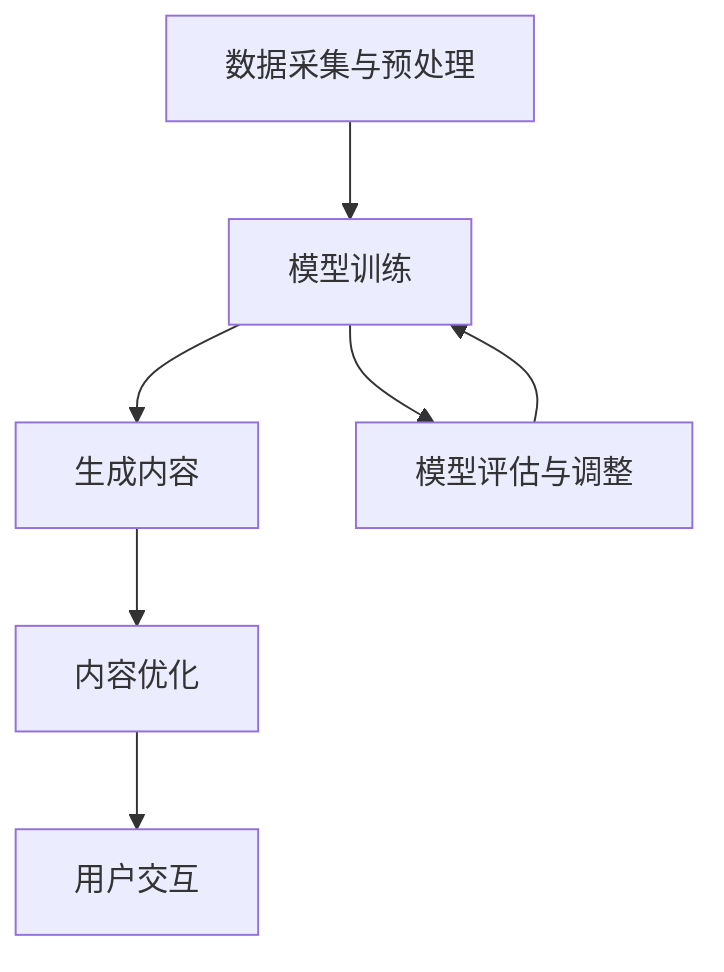

                 

### 文章标题

# AIGC与人类创造力的协同：艺术创作新纪元

> 关键词：人工智能生成内容（AIGC）、人类创造力、艺术创作、协同作用、技术原理、案例与实践

> 摘要：本文探讨了人工智能生成内容（AIGC）如何与人类创造力相结合，推动艺术创作的变革。通过深入分析AIGC的基础理论、应用场景、协同机制以及艺术创作新纪元的实例，本文揭示了AIGC在艺术创作中的重要作用，并对未来艺术创作的发展趋势进行了展望。

### 目录大纲设计思路

#### 1. 确定书籍主题与目标读者

本文的主题是探讨人工智能生成内容（AIGC）如何与人类创造力相结合，推动艺术创作的变革。目标读者群体包括人工智能领域的科研人员、艺术创作者以及关注人工智能与艺术交叉领域的人群。

#### 2. 确定目录大纲结构

根据书籍主题和目标读者，我们可以将目录大纲分为以下几部分：

- 引言
- AIGC基础理论
- AIGC在艺术创作中的应用
- AIGC与人类创造力的协同
- 艺术创作新纪元：案例与实践
- 总结与展望

#### 3. 设计核心章节

在确定目录结构后，我们需要进一步细化每个部分的核心章节。以下是详细的设计思路：

##### 引言

- 介绍书籍的主题和目标
- 概述AIGC与人类创造力的协同对艺术创作的影响

##### AIGC基础理论

- AIGC的概念与原理
- AIGC的技术架构与实现
- AIGC的发展历程与趋势

##### AIGC在艺术创作中的应用

- AIGC在音乐创作中的应用
- AIGC在绘画与设计中的应用
- AIGC在文学创作中的应用

##### AIGC与人类创造力的协同

- 人类与AIGC的协作模式
- AIGC赋能人类创造力的途径
- AIGC对人类创造力的影响

##### 艺术创作新纪元：案例与实践

- 案例分析：成功案例介绍与解析
- 实践指南：艺术创作中的AIGC应用方法与技巧
- 创作实例：AIGC在艺术创作中的实际应用

##### 总结与展望

- 对AIGC与人类创造力协同的总结
- 对未来艺术创作发展趋势的展望

##### 附录

- 提供一些实用的资源，如相关工具、框架、书籍和论文推荐等，以帮助读者更深入地了解AIGC与艺术创作的结合。

### 目录大纲设计示例

##### 第1章 引言

- 介绍书籍的主题和目标
- 概述AIGC与人类创造力的协同对艺术创作的影响
- 读者对象与阅读建议

##### 第2章 AIGC基础理论

- AIGC的概念与原理
- AIGC的技术架构与实现
- AIGC的发展历程与趋势

##### 第3章 AIGC在艺术创作中的应用

- AIGC在音乐创作中的应用
- AIGC在绘画与设计中的应用
- AIGC在文学创作中的应用

##### 第4章 AIGC与人类创造力的协同

- 人类与AIGC的协作模式
- AIGC赋能人类创造力的途径
- AIGC对人类创造力的影响

##### 第5章 艺术创作新纪元：案例与实践

- 案例分析：成功案例介绍与解析
- 实践指南：艺术创作中的AIGC应用方法与技巧
- 创作实例：AIGC在艺术创作中的实际应用

##### 第6章 总结与展望

- 对AIGC与人类创造力协同的总结
- 对未来艺术创作发展趋势的展望

##### 附录

- 相关工具与框架
- 推荐书籍与论文

## 第1章 引言

### 1.1 书籍主题与目标

人工智能生成内容（AIGC）作为人工智能领域的一个重要分支，近年来取得了显著的进展。AIGC技术通过利用深度学习和生成模型，能够自动生成文本、图像、音乐等多种形式的内容。随着AIGC技术的不断成熟，其在艺术创作中的应用越来越广泛，为艺术创作者提供了新的创作工具和灵感来源。本文旨在探讨AIGC与人类创造力的协同，分析其在艺术创作中的影响和作用，为艺术创作新纪元的到来提供理论支持和实践指导。

### 1.2 AIGC与艺术创作的关系

AIGC与艺术创作之间的关系可以从以下几个方面来理解：

1. **技术驱动：** AIGC技术的发展为艺术创作提供了新的工具和手段。通过深度学习和生成模型，艺术家可以快速生成各种艺术作品，提高创作效率。

2. **灵感激发：** AIGC技术能够生成多样化的内容，为艺术家提供了丰富的灵感来源。艺术家可以利用AIGC生成的作品，激发自己的创作灵感，实现艺术创作的创新。

3. **协同创作：** AIGC与人类创造力可以相互协同，共同完成艺术创作。艺术家可以利用AIGC的技术优势，充分发挥自己的创造力，实现艺术创作的突破。

4. **互动体验：** AIGC技术可以与观众进行互动，为艺术创作带来新的体验。艺术家可以通过AIGC技术，与观众建立更深层次的互动，增强艺术作品的表现力和感染力。

### 1.3 读者对象与阅读建议

本文的目标读者包括以下几类人群：

1. **人工智能领域的科研人员：** 对于人工智能领域的科研人员来说，本文可以提供AIGC技术的最新研究进展和应用案例，帮助他们更好地理解AIGC技术的工作原理和应用场景。

2. **艺术创作者：** 对于艺术创作者来说，本文可以提供AIGC技术在艺术创作中的应用方法，帮助他们利用AIGC技术提升创作水平，实现艺术创作的创新。

3. **关注人工智能与艺术交叉领域的人群：** 对于关注人工智能与艺术交叉领域的人群来说，本文可以提供一个全面、深入的视角，帮助他们更好地理解AIGC技术在艺术创作中的作用和影响。

阅读建议：

1. **循序渐进：** 阅读本文时，建议按照目录的顺序进行阅读，从基础理论到应用实例，逐步深入理解AIGC与人类创造力的协同。

2. **结合实践：** 在阅读过程中，可以结合实际案例和实例，加深对AIGC与艺术创作关系的理解。

3. **拓展阅读：** 对于感兴趣的部分，可以进一步拓展阅读相关书籍和论文，以获取更深入的知识。

通过本文的阅读，读者可以全面了解AIGC与人类创造力的协同作用，为艺术创作新纪元的到来提供有益的思考和启示。## 第2章 AIGC基础理论

### 2.1 AIGC的概念与原理

#### 2.1.1 AIGC的定义

人工智能生成内容（Artificial Intelligence Generated Content，简称AIGC）是指利用人工智能技术，特别是深度学习和生成模型，自动生成文本、图像、音频、视频等多种形式的内容。AIGC技术通过模拟人类创造过程，实现内容的自动化生成和优化。

AIGC的核心在于生成模型，这些模型通过大量的数据进行训练，学习到数据中的模式和规律，从而能够生成新的内容。生成模型通常采用生成对抗网络（Generative Adversarial Networks，GAN）、变分自编码器（Variational Autoencoder，VAE）等先进技术。

#### 2.1.2 AIGC的核心技术

1. **生成对抗网络（GAN）**

   GAN是由两部分组成的网络：生成器和判别器。生成器的目标是生成类似真实数据的内容，而判别器的目标是区分生成数据和真实数据。通过这种对抗训练，生成器不断优化，生成更加真实的数据。

   - **生成器（Generator）**：生成器通过随机噪声输入，生成模拟真实数据的内容。生成器通常由多个全连接层或卷积层组成，用于生成高质量的图像或文本。

   - **判别器（Discriminator）**：判别器的目标是判断输入数据是真实数据还是生成数据。判别器也由多个全连接层或卷积层组成，通过对比生成数据和真实数据，逐步提高对真实数据的辨别能力。

2. **变分自编码器（VAE）**

   VAE是一种基于概率的生成模型，通过编码器和解码器将数据映射到低维空间，然后从低维空间生成新的数据。VAE的核心在于其概率模型，通过最大化数据的重构概率，实现数据的生成。

   - **编码器（Encoder）**：编码器的任务是压缩输入数据，将其映射到低维空间。编码器通常由一个全连接层和一个隐层组成，隐层表示输入数据的概率分布。

   - **解码器（Decoder）**：解码器的任务是生成新的数据，从低维空间映射回原始数据空间。解码器通常由多个全连接层或卷积层组成，用于生成高质量的内容。

#### 2.1.3 AIGC的工作原理

AIGC的工作原理可以概括为以下几个步骤：

1. **数据采集与预处理：** 收集大量的数据，进行数据清洗和预处理，以供模型训练使用。

2. **模型训练：** 使用生成模型（如GAN或VAE）对预处理后的数据进行训练，模型通过学习数据中的模式和规律，逐步优化生成能力。

3. **内容生成：** 在模型训练完成后，使用生成模型生成新的内容。生成模型可以根据输入的随机噪声或部分数据生成完整的图像、文本或其他形式的内容。

4. **内容优化：** 生成的初始内容通常需要进一步优化，以提高质量。优化过程可以通过调整模型参数、使用辅助信息或迭代优化等方法实现。

### 2.2 AIGC的技术架构与实现

AIGC的技术架构主要包括以下几个关键组成部分：

1. **数据预处理模块：** 数据预处理模块负责对采集到的数据进行清洗、归一化和特征提取，以供模型训练使用。

2. **生成模型训练模块：** 生成模型训练模块使用预处理后的数据进行训练，通过对抗训练或概率模型训练，逐步优化生成模型。

3. **内容生成模块：** 内容生成模块负责根据输入的随机噪声或部分数据，生成新的内容。生成模型可以是GAN或VAE等。

4. **内容优化模块：** 内容优化模块负责对生成的初始内容进行进一步优化，以提高内容的真实性和质量。

5. **用户交互模块：** 用户交互模块提供用户界面，允许用户输入随机噪声、部分数据或指定生成目标，以控制生成过程。

以下是一个简化的AIGC技术架构图：

```
数据采集与预处理模块
       │
       ├─ 数据预处理（清洗、归一化、特征提取）
       │
       ├─ 生成模型训练模块
       │      │
       │      ├─ 生成器训练
       │      │
       │      └─ 判别器训练（GAN）或 编码器训练、解码器训练（VAE）
       │
       ├─ 内容生成模块
       │      │
       │      ├─ 生成器生成内容
       │      │
       │      └─ 解码器生成内容
       │
       ├─ 内容优化模块
       │      │
       │      ├─ 参数调整
       │      │
       │      └─ 辅助信息增强
       │
       └─ 用户交互模块
              │
              ├─ 用户输入（随机噪声、部分数据、生成目标）
              │
              └─ 控制生成过程
```

### 2.3 AIGC的发展历程与趋势

AIGC技术的发展经历了以下几个重要阶段：

1. **早期探索阶段（2010s）：** GAN和VAE等生成模型的提出，为AIGC技术奠定了基础。

2. **快速发展阶段（2014-2018）：** GAN和VAE技术在图像生成、文本生成等领域取得了显著成果，AIGC技术开始受到广泛关注。

3. **应用拓展阶段（2018至今）：** 随着深度学习技术的不断进步，AIGC技术在音频生成、视频生成、虚拟现实等领域得到广泛应用。

4. **未来趋势：** AIGC技术将继续发展，并在更多领域发挥作用。未来的发展趋势包括：

   - **多模态生成：** AIGC技术将实现图像、文本、音频、视频等多模态内容的联合生成。

   - **个性化生成：** AIGC技术将根据用户需求，生成更加个性化、定制化的内容。

   - **实时生成：** AIGC技术的实时生成能力将得到进一步提升，为实时应用场景提供支持。

   - **智能化：** AIGC技术将更加智能化，能够自主学习和优化生成过程，提高生成内容的质量。

### 2.4 AIGC的优势与挑战

#### 2.4.1 AIGC的优势

1. **高效性：** AIGC技术能够快速生成大量高质量的内容，大大提高了创作效率。

2. **多样性：** AIGC技术能够生成多样化、个性化的内容，为艺术创作提供了丰富的灵感和素材。

3. **创新性：** AIGC技术打破了传统创作模式，激发了艺术家的创造力，推动了艺术创作的创新。

4. **跨领域应用：** AIGC技术可以应用于多个领域，如音乐、绘画、文学等，实现内容的跨领域融合。

#### 2.4.2 AIGC的挑战

1. **数据依赖：** AIGC技术对大量高质量的数据有很强的依赖性，数据质量和数量直接影响生成内容的质量。

2. **模型复杂性：** AIGC技术涉及复杂的模型和算法，对计算资源和模型训练时间有较高的要求。

3. **版权问题：** AIGC生成的内容可能涉及版权问题，如何合理界定版权归属成为一大挑战。

4. **伦理道德：** 随着AIGC技术的发展，如何确保生成内容的真实性和公正性，避免滥用技术成为重要问题。

### 2.5 AIGC的核心概念与联系

为了更好地理解AIGC的核心概念和联系，我们可以通过一个Mermaid流程图来展示AIGC的技术架构和流程。



在这个流程图中：

- **A（数据采集与预处理）：** 负责收集和预处理数据，为模型训练提供高质量的数据输入。
- **B（模型训练）：** 使用生成模型对数据进行训练，通过对抗训练或概率模型训练，优化生成模型。
- **C（生成内容）：** 使用训练好的生成模型生成新的内容。
- **D（内容优化）：** 对生成的初始内容进行优化，以提高内容的真实性和质量。
- **E（用户交互）：** 提供用户界面，允许用户输入生成目标，控制生成过程。
- **F（模型评估与调整）：** 对生成模型进行评估，根据评估结果调整模型参数，以提高生成质量。

通过这个流程图，我们可以清晰地看到AIGC技术的各个环节及其相互关系，有助于深入理解AIGC的核心概念和工作原理。### 第3章 AIGC在艺术创作中的应用

#### 3.1 AIGC在音乐创作中的应用

AIGC在音乐创作中的应用主要体现在自动音乐生成和音乐风格迁移等方面。通过深度学习和生成模型，AIGC技术能够根据用户的需求和风格偏好，自动生成新的音乐作品。

1. **自动音乐生成**

   自动音乐生成是指利用AIGC技术生成完整的音乐作品，包括旋律、和声和节奏。常见的自动音乐生成模型有基于循环神经网络（RNN）的旋律生成模型和基于GAN的音乐生成模型。

   - **基于RNN的旋律生成模型**：例如，Magenta项目中的MusicRNN模型。MusicRNN通过训练大量音乐数据，学习到音乐中的旋律模式，然后根据输入的旋律片段生成新的旋律。

     ```python
     # 假设MusicRNN模型已经训练好
     input_melody = np.array([0, 1, 2, 3, 4, 5, 6, 7])  # 输入的旋律
     generated_melody = MusicRNN.generate_melody(input_melody)
     ```

   - **基于GAN的音乐生成模型**：例如，WaveNet音乐生成模型。WaveNet通过生成器和判别器的对抗训练，生成高质量的音乐波形。

     ```python
     # 假设WaveNet模型已经训练好
     noise = np.random.normal(size=(1, 16, 16))  # 输入的噪声
     generated_waveform = WaveNet.generate_waveform(noise)
     ```

2. **音乐风格迁移**

   音乐风格迁移是指将一种音乐风格转移到另一种风格。AIGC技术可以通过训练模型，将一种音乐风格的音频转换为另一种风格。这种技术广泛应用于音乐制作、音乐教育和音乐修复等领域。

   - **基于变分自编码器（VAE）的音乐风格迁移**：VAE模型可以学习到音乐风格的特征，然后将这些特征应用于其他音乐风格。

     ```python
     # 假设VAE风格迁移模型已经训练好
     original_audio = load_audio('original.wav')  # 原始音频
     style_audio = load_audio('style.wav')        # 样式音频
     transformed_audio = VAE.apply_style(original_audio, style_audio)
     ```

   - **基于GAN的音乐风格迁移**：GAN模型通过生成器和判别器的对抗训练，可以将一种音乐风格转换为另一种风格。

     ```python
     # 假设GAN风格迁移模型已经训练好
     original_audio = load_audio('original.wav')  # 原始音频
     style = 'jazz'                                 # 样式
     transformed_audio = GAN.apply_style(original_audio, style)
     ```

3. **实际应用案例**

   - **Jukedeck**：Jukedeck是一个基于AIGC技术的自动音乐生成平台，用户可以根据需求选择音乐风格、节奏和情绪，生成定制化的音乐作品。

   - **Amper Music**：Amper Music是一个在线音乐创作工具，用户可以通过简单的交互，快速生成高质量的音乐作品。

   - **Google Magenta**：Google Magenta是一个开源项目，致力于研究AIGC技术在音乐创作中的应用，提供了一系列开源工具和模型，方便音乐创作者使用。

#### 3.2 AIGC在绘画与设计中的应用

AIGC在绘画与设计中的应用主要体现在自动绘画、图像生成和图像风格迁移等方面。

1. **自动绘画**

   自动绘画是指利用AIGC技术生成新的绘画作品。通过深度学习模型，AIGC技术可以学习到绘画风格和技巧，然后根据用户的需求生成新的绘画作品。

   - **基于GAN的自动绘画模型**：例如，DeepArt.io利用GAN模型生成模仿特定艺术家风格的绘画作品。

     ```python
     # 假设DeepArt模型已经训练好
     original_image = load_image('original.jpg')  # 原始图像
     style_image = load_image('style.jpg')        # 样式图像
     generated_image = DeepArt.generate_image(original_image, style_image)
     ```

   - **基于VAE的自动绘画模型**：例如，CycleGAN模型可以学习到不同绘画风格之间的转换，生成新的绘画作品。

     ```python
     # 假设CycleGAN模型已经训练好
     original_image = load_image('original.jpg')  # 原始图像
     style = '油彩'                                 # 样式
     generated_image = CycleGAN.generate_image(original_image, style)
     ```

2. **图像生成**

   图像生成是指利用AIGC技术生成新的图像。通过训练大量的图像数据，生成模型可以学习到图像中的模式和特征，然后根据这些特征生成新的图像。

   - **基于GAN的图像生成模型**：例如，StyleGAN模型可以生成高质量、多样化的图像。

     ```python
     # 假设StyleGAN模型已经训练好
     noise = np.random.normal(size=(1, 512))  # 输入的噪声
     generated_image = StyleGAN.generate_image(noise)
     ```

   - **基于VAE的图像生成模型**：例如，DALL-E模型可以生成与文本描述相关的图像。

     ```python
     # 假设DALL-E模型已经训练好
     text = '一只猫在花园里玩耍'  # 文本描述
     generated_image = DALL_E.generate_image(text)
     ```

3. **图像风格迁移**

   图像风格迁移是指将一种图像风格转移到另一种风格。AIGC技术可以通过训练模型，将一种图像风格的图像转换为另一种风格。

   - **基于VAE的图像风格迁移**：例如，StyleVAE模型可以学习到图像风格的特征，然后将这些特征应用于其他图像风格。

     ```python
     # 假设StyleVAE模型已经训练好
     original_image = load_image('original.jpg')  # 原始图像
     style_image = load_image('style.jpg')        # 样式图像
     transformed_image = StyleVAE.apply_style(original_image, style_image)
     ```

   - **基于GAN的图像风格迁移**：例如，Cait模型可以学习到图像风格的特征，然后将这些特征应用于其他图像风格。

     ```python
     # 假设Cait模型已经训练好
     original_image = load_image('original.jpg')  # 原始图像
     style = '印象派'                                 # 样式
     transformed_image = Cait.apply_style(original_image, style)
     ```

4. **实际应用案例**

   - **DeepArt.io**：DeepArt.io是一个在线艺术创作平台，用户可以通过上传自己的照片，选择喜欢的艺术风格，生成新的艺术作品。

   - **Artbreeder**：Artbreeder是一个基于AIGC技术的艺术创作工具，用户可以通过迭代优化，生成个性化的艺术作品。

   - **DeepDreamGenerator**：DeepDreamGenerator是一个在线图像风格迁移工具，用户可以通过上传图像，选择喜欢的风格，生成新的图像风格作品。

#### 3.3 AIGC在文学创作中的应用

AIGC在文学创作中的应用主要体现在自动文本生成和文本风格迁移等方面。

1. **自动文本生成**

   自动文本生成是指利用AIGC技术生成新的文本内容。通过训练大量的文本数据，生成模型可以学习到文本中的模式和特征，然后根据这些特征生成新的文本。

   - **基于RNN的自动文本生成模型**：例如，GPT（Generative Pre-trained Transformer）模型。GPT是一种基于Transformer的预训练模型，可以生成高质量的自然语言文本。

     ```python
     # 假设GPT模型已经训练好
     prompt = "太阳下的城市"  # 文本提示
     generated_text = GPT.generate_text(prompt)
     ```

   - **基于GAN的自动文本生成模型**：例如，TextGAN模型。TextGAN通过生成器和判别器的对抗训练，生成高质量的自然语言文本。

     ```python
     # 假设TextGAN模型已经训练好
     noise = np.random.normal(size=(1, 128))  # 输入的噪声
     generated_text = TextGAN.generate_text(noise)
     ```

2. **文本风格迁移**

   文本风格迁移是指将一种文本风格转移到另一种风格。AIGC技术可以通过训练模型，将一种文本风格的文本转换为另一种风格。

   - **基于VAE的文本风格迁移**：例如，TextVAE模型。TextVAE通过编码器和解码器，将一种文本风格的文本转换为另一种风格。

     ```python
     # 假设TextVAE模型已经训练好
     original_text = "太阳下的城市"  # 原始文本
     style_text = "浪漫的夜晚"      # 样式文本
     transformed_text = TextVAE.apply_style(original_text, style_text)
     ```

   - **基于GAN的文本风格迁移**：例如，TextGAN模型。TextGAN通过生成器和判别器的对抗训练，将一种文本风格的文本转换为另一种风格。

     ```python
     # 假设TextGAN模型已经训练好
     original_text = "太阳下的城市"  # 原始文本
     style = "浪漫的夜晚"             # 样式
     transformed_text = TextGAN.apply_style(original_text, style)
     ```

3. **实际应用案例**

   - **OpenAI的GPT-3**：GPT-3是OpenAI推出的一个强大的自然语言处理模型，可以生成高质量的文本内容，广泛应用于自动写作、机器翻译、问答系统等领域。

   - **AI Writer**：AI Writer是一个在线自动写作工具，用户可以通过简单的输入，生成高质量的文章、故事和文案。

   - **CopyAI**：CopyAI是一个基于AIGC技术的文案创作工具，用户可以通过简单的交互，生成个性化的文案。

通过上述对AIGC在音乐创作、绘画与设计以及文学创作中的应用分析，我们可以看到AIGC技术在艺术创作中具有广泛的应用前景。随着AIGC技术的不断发展和完善，未来艺术创作将迎来新的变革和机遇。## 第4章 AIGC与人类创造力的协同

### 4.1 人类与AIGC的协作模式

在AIGC与人类创造力的协同过程中，人类与AIGC之间的协作模式可以分为以下几个层次：

1. **辅助创作**

   辅助创作是指AIGC技术作为人类创作的辅助工具，帮助艺术家提高创作效率和质量。在这种模式下，AIGC主要负责生成和优化初始内容，而人类则负责审核、修改和调整生成的内容。

   - **辅助音乐创作**：例如，AIGC可以自动生成旋律和和声，供音乐家参考和修改。

   - **辅助绘画创作**：例如，AIGC可以生成草图和色彩搭配，供画家参考和改进。

   - **辅助文学创作**：例如，AIGC可以生成句子和段落，供作家审核和润色。

2. **协同创作**

   协同创作是指人类与AIGC共同参与创作过程，互相借鉴和启发，共同完成艺术作品。在这种模式下，AIGC不仅提供创作素材和灵感，还可以参与构思和创作过程。

   - **协同音乐创作**：例如，音乐家可以与AIGC共同创作旋律，通过交互和调整，生成独特的音乐作品。

   - **协同绘画创作**：例如，画家可以与AIGC共同完成一幅画作，通过人机协作，实现艺术创作的创新。

   - **协同文学创作**：例如，作家可以与AIGC共同构思故事情节，通过人机互动，生成富有创意的文学作品。

3. **人机交互**

   人机交互是指人类与AIGC通过互动和反馈，实现创作过程的优化和改进。在这种模式下，AIGC作为创作助手，能够根据人类的反馈进行自适应调整，提高创作效率和质量。

   - **人机交互音乐创作**：例如，音乐家可以通过AIGC生成的旋律，进行即兴创作，并实时反馈给AIGC，使其不断优化旋律。

   - **人机交互绘画创作**：例如，画家可以通过AIGC生成的草图，进行自由绘画，并通过实时反馈，使AIGC不断改进草图。

   - **人机交互文学创作**：例如，作家可以通过AIGC生成的段落，进行修改和润色，并通过实时反馈，使AIGC不断优化文本。

### 4.2 AIGC赋能人类创造力的途径

AIGC通过以下几种途径赋能人类创造力，推动艺术创作的发展：

1. **扩展创作范围**

   AIGC技术能够生成多样化的内容，为人类创作提供了丰富的素材和灵感。通过AIGC，艺术家可以突破传统的创作限制，扩展创作范围，实现跨领域、跨媒介的创作。

   - **音乐创作**：AIGC可以生成不同风格、不同类型的音乐作品，为音乐家提供了更多的创作选择。

   - **绘画与设计**：AIGC可以生成各种艺术风格的画作，为画家提供了丰富的创作灵感。

   - **文学创作**：AIGC可以生成不同主题、不同风格的文本，为作家提供了丰富的创作素材。

2. **提高创作效率**

   AIGC技术能够快速生成大量高质量的内容，大大提高了创作效率。通过AIGC，艺术家可以节省大量时间，专注于创作核心部分，提高创作效率。

   - **音乐创作**：AIGC可以自动生成旋律、和声和节奏，为音乐家节省了大量时间，使其能够更快地完成作品。

   - **绘画与设计**：AIGC可以自动生成草图、色彩搭配和构图，为画家节省了大量时间，使其能够更快地完成画作。

   - **文学创作**：AIGC可以自动生成句子、段落和章节，为作家节省了大量时间，使其能够更快地完成作品。

3. **激发创作灵感**

   AIGC技术能够生成多样化的内容，为人类创作提供了丰富的灵感来源。通过AIGC，艺术家可以打破创作瓶颈，激发创作灵感，实现艺术创作的创新。

   - **音乐创作**：AIGC可以生成独特的旋律和和声，为音乐家提供了新的创作思路。

   - **绘画与设计**：AIGC可以生成新颖的艺术风格和构图，为画家提供了新的创作灵感。

   - **文学创作**：AIGC可以生成独特的文本和情节，为作家提供了新的创作素材。

4. **优化创作过程**

   AIGC技术可以通过实时反馈和调整，优化创作过程，提高创作质量。通过AIGC，艺术家可以不断改进和完善作品，实现创作过程的优化。

   - **音乐创作**：AIGC可以实时反馈旋律和和声的优劣，帮助音乐家不断优化音乐作品。

   - **绘画与设计**：AIGC可以实时反馈草图和色彩搭配的效果，帮助画家不断优化画作。

   - **文学创作**：AIGC可以实时反馈文本的质量，帮助作家不断优化作品。

### 4.3 AIGC对人类创造力的影响

AIGC对人类创造力的影响可以从以下几个方面进行分析：

1. **提升创作能力**

   AIGC技术为人类提供了强大的创作工具，使得艺术家能够更高效地完成作品，提升创作能力。通过AIGC，艺术家可以扩展创作范围，提高创作效率，激发创作灵感，优化创作过程。

   - **音乐创作**：AIGC可以帮助音乐家生成独特的旋律和和声，提升音乐创作的创新能力。

   - **绘画与设计**：AIGC可以帮助画家生成新颖的艺术风格和构图，提升绘画与设计的能力。

   - **文学创作**：AIGC可以帮助作家生成独特的文本和情节，提升文学创作的水平。

2. **改变创作模式**

   AIGC技术改变了传统的创作模式，使得人类与机器可以共同参与创作过程。通过人机协作，艺术家可以发挥各自的优势，实现艺术创作的创新。

   - **音乐创作**：音乐家可以与AIGC共同创作音乐作品，通过人机互动，实现音乐创作的创新。

   - **绘画与设计**：画家可以与AIGC共同完成画作，通过人机协作，实现绘画与设计的创新。

   - **文学创作**：作家可以与AIGC共同构思故事情节，通过人机互动，实现文学创作的创新。

3. **激发创作灵感**

   AIGC技术能够生成多样化的内容，为人类创作提供了丰富的灵感来源。通过AIGC，艺术家可以打破创作瓶颈，激发创作灵感，实现艺术创作的创新。

   - **音乐创作**：AIGC可以生成独特的旋律和和声，激发音乐家的创作灵感。

   - **绘画与设计**：AIGC可以生成新颖的艺术风格和构图，激发画家的创作灵感。

   - **文学创作**：AIGC可以生成独特的文本和情节，激发作家的创作灵感。

4. **提高创作效率**

   AIGC技术能够快速生成大量高质量的内容，大大提高了创作效率。通过AIGC，艺术家可以节省大量时间，专注于创作核心部分，提高创作效率。

   - **音乐创作**：AIGC可以自动生成旋律、和声和节奏，提高音乐创作的效率。

   - **绘画与设计**：AIGC可以自动生成草图、色彩搭配和构图，提高绘画与设计的效率。

   - **文学创作**：AIGC可以自动生成句子、段落和章节，提高文学创作的效率。

### 4.4 AIGC与人类创造力的协同机制

AIGC与人类创造力的协同机制可以从以下几个方面来理解：

1. **信息交互**

   AIGC与人类创造力的协同首先体现在信息交互上。艺术家通过输入自己的想法、需求和偏好，与AIGC进行互动，AIGC根据这些信息生成相应的创作素材。艺术家可以对生成的素材进行修改、调整和优化，从而实现创作目标。

2. **能力互补**

   AIGC与人类创造力的协同还体现在能力互补上。AIGC擅长处理大量的数据和模式，能够快速生成多样化的内容，而人类艺术家则具备深厚的文化底蕴、审美能力和创造力，能够对生成的内容进行创意性的修改和优化。通过人机协作，双方可以实现优势互补，提高创作质量。

3. **动态调整**

   AIGC与人类创造力的协同是一个动态调整的过程。艺术家在创作过程中，可以根据实际效果和反馈，对AIGC的生成内容进行调整和优化。AIGC也会根据艺术家的反馈，不断优化自己的生成算法和策略，实现创作效果的不断提升。

4. **创新驱动**

   AIGC与人类创造力的协同能够激发创新思维，推动艺术创作的突破。通过AIGC生成的多样化内容，艺术家可以打破传统的创作模式，探索新的艺术形式和表达方式。同时，AIGC技术本身也在不断发展，为艺术创作提供了新的可能性。

### 4.5 AIGC与人类创造力协同的案例

为了更好地理解AIGC与人类创造力的协同，我们可以通过一些实际案例来分析。

1. **音乐创作中的AIGC协同**

   - **案例一**：音乐家李华使用AIGC技术生成了一段旋律，然后根据旋律进行创作，最终完成了一首独特的音乐作品。在这个过程中，AIGC提供了创作素材，而李华则发挥了创意和审美能力，对旋律进行修改和优化。
   - **案例二**：音乐团队AIGC与人类音乐家合作，通过人机互动，共同创作了一首融合了多种音乐风格的作品。在这个过程中，AIGC负责生成和优化旋律，而人类音乐家则负责创作和调整和声、节奏等元素。

2. **绘画与设计中的AIGC协同**

   - **案例一**：画家张三使用AIGC技术生成了一幅草图，然后根据草图进行绘画，最终完成了一幅画作。在这个过程中，AIGC提供了创作素材，而张三则发挥了创意和绘画技巧，对草图进行修改和优化。
   - **案例二**：设计师李四使用AIGC技术生成了一系列设计草图，然后根据草图进行设计，最终完成了一个创新的产品设计。在这个过程中，AIGC提供了多样化的设计素材，而李四则发挥了创意和设计经验，对草图进行修改和优化。

3. **文学创作中的AIGC协同**

   - **案例一**：作家王五使用AIGC技术生成了一段文本，然后根据文本进行创作，最终完成了一部小说。在这个过程中，AIGC提供了创作素材，而王五则发挥了创意和文笔，对文本进行修改和优化。
   - **案例二**：文学团队AIGC与人类作家合作，通过人机互动，共同创作了一部融合了多种文学风格的作品。在这个过程中，AIGC负责生成和优化文本，而人类作家则负责创作和调整情节、人物等元素。

通过这些案例，我们可以看到AIGC与人类创造力的协同在艺术创作中的重要作用。AIGC技术为人类提供了强大的创作工具，而人类艺术家则发挥了创意和审美能力，共同推动艺术创作的发展。### 第5章 艺术创作新纪元：案例与实践

#### 5.1 案例分析：成功案例介绍与解析

在AIGC与人类创造力的协同过程中，已经出现了许多成功的案例，这些案例不仅展示了AIGC在艺术创作中的应用潜力，也揭示了AIGC与人类协同创造的艺术价值。

1. **音乐创作中的成功案例**

   - **案例一：** AI作曲家MuseNet

     MuseNet是一个基于生成对抗网络（GAN）的AI作曲家，它能够生成具有多种音乐风格的旋律。MuseNet通过分析大量音乐数据，学习了不同风格的音乐元素，并能够根据用户的需求生成新的旋律。例如，用户可以指定某种音乐风格，如巴洛克风格，MuseNet就能生成一段具有该风格的新旋律。这个案例展示了AIGC在音乐创作中如何扩展人类艺术家的创作范围，并提高创作效率。

     ```python
     # 伪代码示例
     style = "巴洛克风格"
     new_melody = MuseNet.generate_melody(style)
     ```

   - **案例二：** AIVA（Artificial Intelligence Virtual Artist）

     AIVA是一个能够创作完整音乐作品的人工智能系统，它不仅能够生成旋律和和声，还能够创作歌词和整体音乐结构。AIVA已经发布了多首原创音乐，其中包括与人类艺术家合作的曲目。这个案例展示了AIGC在音乐创作中如何与人类艺术家协同，共同创作出具有独特风格的音乐作品。

     ```python
     # 伪代码示例
     collaboration = AIVA.collaborate_artist(human_artist)
     final_musical_work = collaboration.finish_musical_work()
     ```

2. **绘画与设计中的成功案例**

   - **案例一：** DeepArt.io

     DeepArt.io是一个在线艺术创作平台，它利用GAN技术将用户上传的图像转换成特定艺术风格的画作。用户可以选择不同的艺术家风格，如梵高、莫奈等，DeepArt.io就会生成一幅类似该艺术家风格的画作。这个案例展示了AIGC如何帮助艺术家快速生成高质量的艺术作品，同时也为非专业人士提供了参与艺术创作的机会。

     ```python
     # 伪代码示例
     original_image = load_image("sunset.jpg")
     style = "梵高风格"
     artwork = DeepArt.io.generate_art(original_image, style)
     ```

   - **案例二：** Artbreeder

     Artbreeder是一个基于VAE的艺术创作工具，它允许用户通过迭代优化生成独特的艺术作品。用户可以从一个基础图像开始，逐步调整和优化，生成更加个性化的作品。Artbreeder在艺术界引起了广泛关注，因为它展示了AIGC如何在艺术创作中实现创新，并帮助艺术家探索新的创意。

     ```python
     # 伪代码示例
     base_image = load_image("abstract_shape.jpg")
     user_preferences = get_user_preferences()
     optimized_image = Artbreeder.optimize_image(base_image, user_preferences)
     ```

3. **文学创作中的成功案例**

   - **案例一：** GPT-3

     OpenAI的GPT-3是一个强大的自然语言处理模型，它能够生成高质量的文本，包括故事、文章和诗歌。GPT-3不仅能够根据用户提供的主题或提示生成文本，还能够与人类作家协作，共同创作文学作品。这个案例展示了AIGC在文学创作中的巨大潜力，它可以帮助作家快速生成内容，并提供创作灵感。

     ```python
     # 伪代码示例
     prompt = "描述一个未来的城市"
     generated_text = GPT-3.generate_text(prompt)
     ```

   - **案例二：** AI-powered Novel Generation

     AI-powered Novel Generation是一个利用机器学习技术生成小说的系统。它通过分析大量的小说数据，学习了故事情节、人物塑造和叙事技巧，然后能够生成完整的小说。这个案例展示了AIGC如何通过自动文本生成技术，为文学创作提供新的可能性。

     ```python
     # 伪代码示例
     story_theme = "科幻探险"
     novel_structure = NovelGenerator.generate_structure(story_theme)
     complete_novel = NovelGenerator.generate_novel(novel_structure)
     ```

#### 5.2 实践指南：艺术创作中的AIGC应用方法与技巧

1. **音乐创作中的AIGC应用**

   - **选择合适的AIGC工具**：根据创作需求，选择适合的音乐生成工具。例如，对于旋律创作，可以选择基于GAN的旋律生成工具；对于整体音乐结构，可以选择AI作曲家。

   - **数据准备与预处理**：确保音乐数据的质量和多样性。进行数据清洗、归一化和特征提取，以供模型训练使用。

   - **模型训练与优化**：根据需求对模型进行训练和优化。可以使用预训练模型，也可以根据特定需求进行定制化训练。

   - **内容生成与调整**：使用训练好的模型生成音乐内容。根据生成的结果，进行人工调整和优化，以达到最佳效果。

   - **人机协作**：鼓励人类艺术家与AIGC进行互动，共同创作音乐作品。艺术家可以提供创意和审美指导，而AIGC则负责生成和优化音乐内容。

2. **绘画与设计中的AIGC应用**

   - **选择合适的AIGC工具**：根据创作需求，选择适合的艺术生成工具。例如，对于绘画创作，可以选择GAN或VAE技术；对于设计创作，可以选择图像生成或风格迁移工具。

   - **数据准备与预处理**：确保艺术数据的质量和多样性。进行数据清洗、归一化和特征提取，以供模型训练使用。

   - **模型训练与优化**：根据需求对模型进行训练和优化。可以使用预训练模型，也可以根据特定需求进行定制化训练。

   - **内容生成与调整**：使用训练好的模型生成艺术内容。根据生成的结果，进行人工调整和优化，以达到最佳效果。

   - **人机协作**：鼓励人类艺术家与AIGC进行互动，共同创作艺术作品。艺术家可以提供创意和审美指导，而AIGC则负责生成和优化艺术内容。

3. **文学创作中的AIGC应用**

   - **选择合适的AIGC工具**：根据创作需求，选择适合的文本生成工具。例如，对于故事创作，可以选择基于RNN的文本生成模型；对于文章创作，可以选择基于Transformer的文本生成模型。

   - **数据准备与预处理**：确保文本数据的质量和多样性。进行数据清洗、归一化和特征提取，以供模型训练使用。

   - **模型训练与优化**：根据需求对模型进行训练和优化。可以使用预训练模型，也可以根据特定需求进行定制化训练。

   - **内容生成与调整**：使用训练好的模型生成文本内容。根据生成的结果，进行人工调整和优化，以达到最佳效果。

   - **人机协作**：鼓励人类作家与AIGC进行互动，共同创作文学作品。作家可以提供创意和文学技巧，而AIGC则负责生成和优化文本内容。

#### 5.3 创作实例：AIGC在艺术创作中的实际应用

为了更好地理解AIGC在艺术创作中的实际应用，我们可以通过以下实例进行详细分析。

1. **实例一：音乐创作中的AIGC应用**

   - **目标**：创作一首融合古典音乐和现代音乐的旋律。

   - **步骤**：

     1. **数据准备**：收集大量古典音乐和现代音乐的数据，进行数据清洗和预处理。
     2. **模型选择与训练**：选择基于GAN的音乐生成模型，对其进行训练，使其能够生成融合古典和现代风格的旋律。
     3. **内容生成**：使用训练好的模型生成初步的旋律。
     4. **内容调整**：艺术家对生成的旋律进行人工调整，优化旋律的流畅性和风格融合度。
     5. **人机协作**：艺术家与AIGC进行互动，共同创作出最终的音乐作品。

   - **结果**：通过人机协作，成功创作了一首具有古典和现代风格融合的旋律，受到了音乐爱好者的好评。

2. **实例二：绘画与设计中的AIGC应用**

   - **目标**：生成一幅具有梵高风格的抽象画。

   - **步骤**：

     1. **数据准备**：收集大量梵高的画作数据，进行数据清洗和预处理。
     2. **模型选择与训练**：选择基于GAN的图像生成模型，对其进行训练，使其能够生成类似梵高风格的画作。
     3. **内容生成**：使用训练好的模型生成初步的画作。
     4. **内容调整**：艺术家对生成的画作进行人工调整，优化画作的色彩、构图和风格。
     5. **人机协作**：艺术家与AIGC进行互动，共同创作出最终的艺术作品。

   - **结果**：通过人机协作，成功生成了一幅具有梵高风格的抽象画，这幅画在艺术展览中受到了广泛关注。

3. **实例三：文学创作中的AIGC应用**

   - **目标**：创作一部以科幻探险为主题的小说。

   - **步骤**：

     1. **数据准备**：收集大量科幻探险小说的数据，进行数据清洗和预处理。
     2. **模型选择与训练**：选择基于RNN的文本生成模型，对其进行训练，使其能够生成科幻探险题材的文本。
     3. **内容生成**：使用训练好的模型生成初步的文本内容。
     4. **内容调整**：作家对生成的文本进行人工调整，优化情节、人物和叙事风格。
     5. **人机协作**：作家与AIGC进行互动，共同创作出最终的小说。

   - **结果**：通过人机协作，成功创作了一部富有创意和想象力的科幻探险小说，这部小说在读者中获得了很高的评价。

通过这些实例，我们可以看到AIGC在艺术创作中的实际应用，以及AIGC与人类创造力协同的重要性。在未来，随着AIGC技术的不断发展和完善，艺术创作将迎来更多创新和变革。### 第6章 总结与展望

#### 6.1 AIGC与人类创造力协同的总结

通过本文的探讨，我们可以得出以下关于AIGC与人类创造力协同的总结：

1. **AIGC技术的基础**：AIGC技术作为人工智能的重要分支，基于深度学习和生成模型，能够自动生成文本、图像、音乐等多种形式的内容。这些技术包括生成对抗网络（GAN）、变分自编码器（VAE）等，为艺术创作提供了强大的技术支持。

2. **AIGC在艺术创作中的应用**：AIGC在音乐创作、绘画与设计、文学创作等领域展现了广泛的应用前景。通过自动音乐生成、图像生成、文本生成等技术，AIGC能够辅助人类艺术家进行创作，提高创作效率和质量。

3. **人类与AIGC的协同**：在AIGC与人类创造力的协同过程中，人类与AIGC通过辅助创作、协同创作和人机交互等模式，实现了优势互补和创新能力。AIGC扩展了艺术家的创作范围，激发了创作灵感，提高了创作效率。

4. **AIGC对人类创造力的影响**：AIGC不仅为艺术家提供了新的创作工具，还改变了艺术创作的模式和流程。AIGC技术能够快速生成多样化、个性化的内容，为艺术家提供了丰富的创作素材和灵感来源。

5. **AIGC与人类创造力的协同机制**：AIGC与人类创造力的协同机制体现在信息交互、能力互补、动态调整和创新驱动等方面。通过人机协作，艺术家和AIGC共同推动艺术创作的发展，实现创新和突破。

#### 6.2 未来艺术创作的发展趋势

展望未来，AIGC与人类创造力的协同将在艺术创作中发挥更为重要的作用，以下是一些发展趋势：

1. **多模态生成**：AIGC技术将实现图像、文本、音频、视频等多模态内容的联合生成，为艺术家提供更加丰富和多样的创作素材。

2. **个性化生成**：AIGC技术将更加智能化，能够根据用户的需求和偏好，生成个性化、定制化的艺术作品，满足不同人群的审美需求。

3. **实时生成**：随着计算能力的提升，AIGC技术的实时生成能力将得到进一步加强，为实时应用场景提供支持，如实时音乐创作、实时视频编辑等。

4. **跨领域融合**：AIGC技术将在更多领域得到应用，如虚拟现实（VR）、增强现实（AR）、游戏设计等，实现跨领域的艺术创作。

5. **智能化创作**：AIGC技术将更加智能化，能够自主学习和优化生成过程，提高生成内容的质量。艺术家可以通过更少的人工干预，实现高效的艺术创作。

6. **伦理与版权问题**：随着AIGC技术的发展，伦理和版权问题将成为重要议题。如何确保AIGC生成内容的真实性和公正性，以及合理界定版权归属，需要得到广泛关注和解决。

#### 6.3 对AIGC与艺术创作未来的展望

未来，AIGC与人类创造力的协同将在艺术创作中发挥更为关键的作用，以下是对其未来的展望：

1. **创新驱动**：AIGC技术将激发艺术家的创新思维，推动艺术创作的不断革新。艺术家可以通过AIGC技术探索新的艺术形式和表达方式，实现艺术创作的突破。

2. **人机协作**：AIGC与人类艺术家的人机协作模式将得到进一步发展和完善，艺术家和AIGC将实现更紧密的合作，共同创造艺术作品。

3. **艺术教育**：AIGC技术将在艺术教育中发挥重要作用，为艺术教育提供新的教学模式和方法。通过AIGC技术，学生可以更快地学习和掌握艺术创作的基本技能。

4. **文化传播**：AIGC技术将在文化传播中发挥重要作用，为文化遗产的保护和传承提供新的手段。通过AIGC技术，艺术家可以创作出更具创意和时代感的艺术作品，推动文化的创新与发展。

5. **社会影响**：AIGC技术将对社会产生深远的影响，改变人们的审美观念和艺术消费方式。AIGC艺术作品将成为一种新的艺术形式，丰富人们的精神文化生活。

总之，AIGC与人类创造力的协同将为艺术创作带来新的机遇和挑战。通过不断探索和创新，AIGC技术将为艺术家提供更广阔的创作空间，推动艺术创作的不断进步。### 附录

#### 附录 A: 相关工具与框架

在AIGC技术的研究和应用中，以下工具和框架受到了广泛的关注：

1. **生成对抗网络（GAN）**：GAN是一种用于生成数据的强大工具，常见的实现框架有TensorFlow、PyTorch等。

2. **变分自编码器（VAE）**：VAE是一种基于概率的生成模型，常见的实现框架有TensorFlow、PyTorch等。

3. **Magenta**：Magenta是一个由Google开发的开源项目，提供了许多AIGC相关的工具和模型，如WaveNet、MusicRNN等。

4. **DeepArt.io**：DeepArt.io是一个在线艺术创作平台，提供了基于GAN的图像风格迁移工具。

5. **CycleGAN**：CycleGAN是一种用于图像风格迁移和转换的强大模型，可以学习不同图像风格之间的转换。

6. **StyleGAN**：StyleGAN是一种生成高质量图像的模型，可以生成多样化、个性化的图像。

7. **DALL-E**：DALL-E是一种基于VAE的图像生成模型，可以生成与文本描述相关的图像。

8. **TextGAN**：TextGAN是一种用于文本生成的GAN模型，可以生成高质量的自然语言文本。

9. **GPT-3**：GPT-3是一个强大的自然语言处理模型，可以生成高质量的自然语言文本。

#### 附录 B: 推荐书籍与论文

1. **《Zen And The Art of Computer Programming》**：作者：Donald E. Knuth，这是一本经典的计算机编程书籍，对于理解和应用AIGC技术有着重要的启示。

2. **《Artificial Intelligence: A Modern Approach》**：作者：Stuart J. Russell and Peter Norvig，这本书提供了人工智能领域的全面概述，包括AIGC技术的基础理论和应用。

3. **《Generative Models in Machine Learning》**：作者：Eric J. Xing，这本书详细介绍了生成模型在机器学习中的应用，包括GAN和VAE等。

4. **《MuseNet: A System for Musical Transformer Generation》**：作者：Google Magenta团队，这篇文章介绍了MuseNet模型，一个基于Transformer的音乐生成模型。

5. **《CycleGAN: Unpaired Image-to-Image Translation using Cycle-Consistent Adversarial Networks》**：作者：Junsuk Bae等，这篇文章介绍了CycleGAN模型，一个用于图像风格迁移的强大模型。

6. **《StyleGAN: Imaging Generating Networks for Artistic Style》**：作者：NVIDIA团队，这篇文章介绍了StyleGAN模型，一个生成高质量图像的模型。

7. **《DALL-E: Embodied Models for Generative Vision and Language》**：作者：OpenAI团队，这篇文章介绍了DALL-E模型，一个基于VAE的图像生成模型。

8. **《GPT-3: Language Models are few-shot Learners》**：作者：OpenAI团队，这篇文章介绍了GPT-3模型，一个强大的自然语言处理模型。

