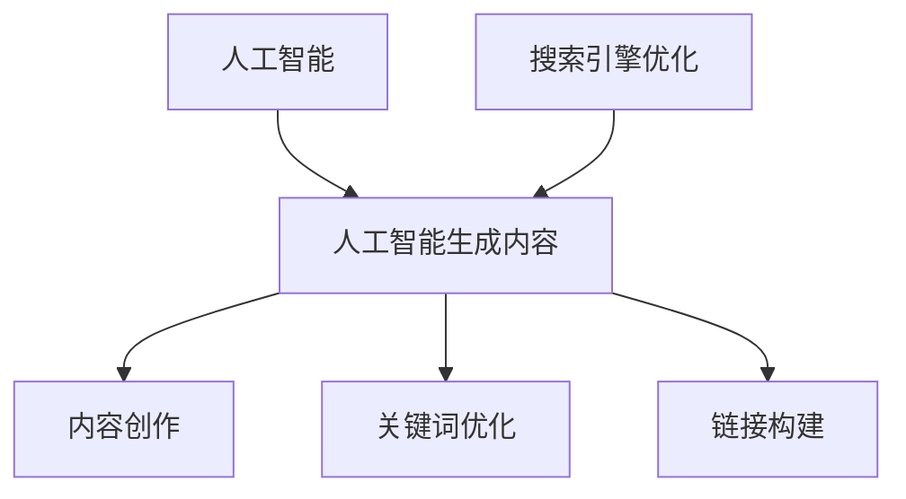

                 

### 文章标题

# 《AIGC与传统SEO的融合与变革》

## 关键词

- AIGC
- 搜索引擎优化（SEO）
- 人工智能生成内容
- 内容创作
- 关键词优化
- 链接构建
- 融合方法
- 案例分析

### 摘要

本文深入探讨了人工智能生成内容（AIGC）与传统搜索引擎优化（SEO）的融合及其带来的变革。首先，我们介绍了AIGC和SEO的基本概念及其发展历程，随后分析了它们之间的关联和融合点。接着，详细阐述了AIGC在SEO中各环节的应用，如内容创作、关键词优化和链接构建。然后，我们回顾了传统SEO的原理与技巧，并探讨了AIGC与传统SEO的融合方法。文章还分析了AIGC在SEO中的优势与挑战，并通过案例进行了实际应用解析。最后，文章对AIGC与传统SEO的未来发展趋势进行了展望，并给出了相关建议。通过本文，读者可以全面了解AIGC与传统SEO的融合，掌握其应用方法和实践技巧。

## 核心概念与联系

为了深入探讨AIGC与传统SEO的融合与变革，我们首先需要了解这两个核心概念的基本概念及其发展历程。

### AI与AIGC的概念及其发展

**AI的概念**

人工智能（Artificial Intelligence，简称AI）是指通过计算机系统实现人类智能行为的科学和技术。AI的发展历程可以分为三个阶段：规则推理（Rule-Based Reasoning）、知识表示（Knowledge Representation）和机器学习（Machine Learning）。近年来，深度学习（Deep Learning）和强化学习（Reinforcement Learning）等新兴技术不断推动AI的发展，使其在图像识别、自然语言处理、决策制定等领域取得了显著成果。

**AIGC的概念**

人工智能生成内容（Artificial Intelligence Generated Content，简称AIGC）是近年来人工智能领域的一个重要发展方向。AIGC通过利用自然语言处理、计算机视觉和生成模型等技术，自动生成各种形式的内容，如文本、图像、音频和视频。AIGC在内容创作、个性化推荐、虚拟现实等领域具有广泛的应用前景。

### SEO的基本原理和流程

搜索引擎优化（Search Engine Optimization，简称SEO）是指通过改进网站内容和结构，提高网站在搜索引擎中的排名，从而获得更多流量的技术。SEO的基本原理包括关键词研究、内容优化、链接建设和用户行为分析等。

**关键词研究**

关键词研究是SEO的第一步，旨在确定目标用户搜索的关键词。通过使用工具，如Google AdWords Keyword Planner和Ahrefs，我们可以挖掘潜在关键词、分析关键词竞争度和搜索量，从而选择最适合的关键词。

**内容优化**

内容优化是SEO的核心环节，包括标题优化、元描述、内容质量和关键词密度等。优化标题和元描述可以提高用户点击率，而高质量的内容和适当的关键词密度有助于搜索引擎理解网站主题。

**链接建设**

链接建设是通过获得其他网站链接来提高自身网站权重的过程。高质量的外部链接和内部链接有助于提高搜索引擎对网站的信任度，从而提升排名。

### AIGC与SEO的关联分析

**AIGC与SEO的融合点**

AIGC与传统SEO的融合主要体现在以下三个方面：

1. **内容创作**

   AIGC在内容创作中具有巨大优势。通过自动生成高质量的文章、图片和视频，网站可以更快地更新内容，满足用户需求，提高用户体验。

2. **关键词优化**

   AIGC可以根据用户搜索习惯和关键词数据，自动生成优化后的内容，提高关键词密度和相关性，从而提高搜索引擎排名。

3. **链接构建**

   AIGC可以通过自动生成高质量的回链，提高网站的链接权重，从而提升搜索引擎排名。

### Mermaid流程图

下面是一个简化的Mermaid流程图，展示了AIGC与SEO的关联：



通过这个流程图，我们可以更直观地了解AIGC在SEO中的应用及其带来的变革。

## AIGC在SEO中的应用

AIGC在SEO中的应用，为传统SEO带来了前所未有的变革。通过AIGC技术，我们可以实现高效的内容创作、精准的关键词优化和智能的链接构建，从而提高网站在搜索引擎中的排名和用户体验。以下将详细介绍AIGC在SEO中的具体应用。

### AIGC在内容创作中的应用

**内容创作是SEO的核心环节，而AIGC在内容创作中具有显著优势。**

1. **文本生成**

   AIGC可以通过自然语言生成（Natural Language Generation，简称NLG）技术，自动生成高质量的文章。例如，GPT-3模型可以生成有关各种主题的文章，如科技、金融、教育等。通过调整模型的参数，我们可以控制文章的风格、语气和长度，从而满足不同用户的需求。

   **伪代码：**
   ```python
   def generate_text(model, prompt, max_length):
       text = model.generate(prompt, max_length=max_length)
       return text
   ```

2. **图像生成**

   AIGC还可以生成高质量的图像，如GPT-3的兄弟模型DALL-E，它可以根据文本描述自动生成相应的图像。这为SEO提供了新的可能性，例如，通过生成与文章内容相关的图像，可以提升用户体验和搜索引擎的点击率。

   **伪代码：**
   ```python
   def generate_image(model, text_description):
       image = model.generate_image(text_description)
       return image
   ```

3. **视频生成**

   AIGC技术也在视频生成方面取得了突破。通过生成模型，如生成对抗网络（GAN），我们可以根据文本描述自动生成视频内容。这对于短视频平台和视频内容网站具有很高的应用价值。

   **伪代码：**
   ```python
   def generate_video(model, text_description, video_length):
       video = model.generate_video(text_description, video_length)
       return video
   ```

### AIGC在内容优化中的应用

**内容优化是SEO的关键环节，AIGC在内容优化中也有显著优势。**

1. **关键词提取**

   AIGC可以通过自然语言处理技术，自动提取文章中的关键词。这有助于我们更好地了解用户搜索意图，从而进行更精准的内容优化。

   **伪代码：**
   ```python
   def extract_keywords(text):
       keywords = nlp(text).keywords
       return keywords
   ```

2. **语义理解**

   AIGC可以通过语义理解技术，分析文章的内容和结构，从而生成相应的摘要和关键词。这有助于我们更好地理解文章的主题，进行更精准的内容优化。

   **伪代码：**
   ```python
   def generate_summary(text):
       summary = nlp(text).generate_summary()
       return summary
   ```

3. **内容质量评估**

   AIGC可以通过评估模型，对文章的质量进行评估。这有助于我们识别并优化低质量内容，从而提高网站的整体质量。

   **伪代码：**
   ```python
   def assess_content_quality(text):
       quality = model.assess_content_quality(text)
       return quality
   ```

### AIGC在关键词优化中的应用

**关键词优化是SEO的重要组成部分，AIGC在关键词优化中也有显著优势。**

1. **关键词挖掘**

   AIGC可以通过大数据分析和机器学习技术，挖掘出潜在的关键词。这有助于我们发现新的关键词机会，从而优化网站内容。

   **伪代码：**
   ```python
   def extract_potential_keywords(data):
       keywords = model.extract_keywords(data)
       return keywords
   ```

2. **关键词分析**

   AIGC可以通过自然语言处理技术，对关键词进行深入分析，如关键词密度、关键词相关性等。这有助于我们制定更有效的关键词策略。

   **伪代码：**
   ```python
   def analyze_keywords(keywords):
       analysis = model.analyze_keywords(keywords)
       return analysis
   ```

3. **关键词推荐**

   AIGC可以通过机器学习算法，根据用户搜索历史和文章内容，推荐最适合的关键词。这有助于我们进行更精准的关键词优化。

   **伪代码：**
   ```python
   def recommend_keywords(user_history, content):
       keywords = model.recommend_keywords(user_history, content)
       return keywords
   ```

### AIGC在链接构建中的应用

**链接构建是SEO中的重要环节，AIGC在链接构建中也有显著优势。**

1. **链接挖掘**

   AIGC可以通过大数据分析和自然语言处理技术，挖掘出潜在的链接机会。这有助于我们获得更多的外部链接，从而提高网站的权重。

   **伪代码：**
   ```python
   def extract_link_opportunities(data):
       links = model.extract_link_opportunities(data)
       return links
   ```

2. **链接分析**

   AIGC可以通过自然语言处理技术，对链接进行分析，如链接质量、链接相关性等。这有助于我们识别并优化低质量的链接。

   **伪代码：**
   ```python
   def analyze_links(links):
       analysis = model.analyze_links(links)
       return analysis
   ```

3. **链接推荐**

   AIGC可以通过机器学习算法，根据网站内容和链接数据，推荐最适合的链接。这有助于我们进行更有效的链接建设。

   **伪代码：**
   ```python
   def recommend_links(content, links_data):
       recommended_links = model.recommend_links(content, links_data)
       return recommended_links
   ```

通过AIGC在内容创作、内容优化、关键词优化和链接构建等方面的应用，我们可以显著提高SEO的效果，从而在激烈的市场竞争中脱颖而出。

## 传统SEO的原理与技巧

在深入探讨AIGC在SEO中的应用之前，我们需要先回顾传统SEO的原理与技巧，了解其核心概念和实践方法。传统SEO的主要目标是提高网站在搜索引擎中的排名，从而获取更多的自然流量。以下是传统SEO的关键组成部分：

### SEO关键词研究

关键词研究是SEO的第一步，也是最重要的一步。通过关键词研究，我们可以了解用户搜索习惯，确定目标关键词，从而优化网站内容，提高搜索引擎排名。关键词研究包括以下几个方面：

1. **关键词挖掘**

   关键词挖掘是指从大量数据中提取潜在的关键词。通过使用工具，如Google AdWords Keyword Planner和Ahrefs，我们可以找到与网站主题相关的关键词，并分析其搜索量、竞争度等指标。

   **伪代码：**
   ```python
   def extract_keywords(data):
       keywords = keyword.extract_keywords(data)
       return keywords
   ```

2. **关键词分析**

   关键词分析是指对关键词进行详细分析，如关键词搜索量、竞争度、相关关键词等。通过分析关键词数据，我们可以确定哪些关键词具有较高的商业价值，并制定相应的关键词策略。

   **伪代码：**
   ```python
   def analyze_keywords(keywords):
       analysis = keyword.analyze_keywords(keywords)
       return analysis
   ```

3. **关键词推荐**

   关键词推荐是指根据用户搜索历史、网站内容和关键词分析结果，推荐最适合的关键词。通过关键词推荐，我们可以更好地满足用户需求，提高搜索引擎排名。

   **伪代码：**
   ```python
   def recommend_keywords(user_history, content):
       keywords = keyword.recommend_keywords(user_history, content)
       return keywords
   ```

### SEO内容优化

内容优化是SEO的核心环节，其目的是提高网站内容的质量和相关性，从而满足用户需求，提高搜索引擎排名。内容优化包括以下几个方面：

1. **内容创作**

   高质量的内容是SEO成功的关键。通过研究用户需求和竞争对手，我们可以创作出具有吸引力和价值的内容，从而提高用户点击率和搜索引擎排名。

   **伪代码：**
   ```python
   def create_content(user需求和竞争对手):
       content = content_creator.create_content(user需求和竞争对手)
       return content
   ```

2. **内容质量评估**

   内容质量评估是指对网站内容进行评估，以确定其质量是否符合用户需求和搜索引擎的标准。通过使用工具，如Google Analytics和SEOmoz，我们可以对内容进行评估，并提出优化建议。

   **伪代码：**
   ```python
   def assess_content_quality(content):
       quality = content_assessor.assess_content_quality(content)
       return quality
   ```

3. **内容更新**

   定期更新内容是保持网站活力和吸引力的关键。通过定期发布新内容，我们可以吸引更多用户，提高搜索引擎排名。

   **伪代码：**
   ```python
   def update_content():
       content = content_updater.update_content()
       return content
   ```

### SEO链接策略

链接策略是指通过获得外部链接和提高内部链接质量，提高网站在搜索引擎中的排名。链接策略包括以下几个方面：

1. **链接挖掘**

   链接挖掘是指从大量数据中提取潜在的链接机会。通过使用工具，如Ahrefs和SEMrush，我们可以找到与网站主题相关的网站，并建立链接。

   **伪代码：**
   ```python
   def extract_link_opportunities(data):
       links = link_extractor.extract_link_opportunities(data)
       return links
   ```

2. **链接分析**

   链接分析是指对链接进行详细分析，如链接质量、链接相关性等。通过分析链接数据，我们可以识别并优化低质量的链接。

   **伪代码：**
   ```python
   def analyze_links(links):
       analysis = link_analyzer.analyze_links(links)
       return analysis
   ```

3. **链接建设**

   链接建设是指通过交换链接、合作推广等方式，提高网站链接质量。通过高质量的外部链接和内部链接，我们可以提高网站在搜索引擎中的排名。

   **伪代码：**
   ```python
   def build_links(links):
       links = link_builder.build_links(links)
       return links
   ```

通过了解传统SEO的原理与技巧，我们可以更好地理解AIGC在SEO中的应用。AIGC技术的引入，将为我们带来更高效、更精准的SEO策略，从而在激烈的市场竞争中脱颖而出。

## AIGC与传统SEO的融合方法

在了解了AIGC和传统SEO的基本概念及其各自的优势之后，我们接下来需要探讨如何将AIGC与传统SEO融合，以实现更好的效果。以下是AIGC与传统SEO融合的具体方法：

### AIGC与SEO的融合原理

AIGC与传统SEO的融合原理主要基于以下两个方面：

1. **数据驱动**

   AIGC技术依赖于大量数据，通过分析这些数据，我们可以更好地了解用户需求和搜索引擎算法，从而制定更有效的SEO策略。传统SEO也强调数据驱动，通过收集和分析用户行为数据、搜索引擎排名数据等，优化网站内容和结构。

2. **自动化与智能化**

   AIGC技术具有自动化和智能化的特点，可以自动生成内容、关键词和链接，提高SEO效率。传统SEO虽然也强调自动化工具的使用，但AIGC技术的引入，将使SEO过程更加智能化，提高优化效果。

### AIGC与传统SEO的融合实践

为了实现AIGC与传统SEO的融合，我们可以从以下三个方面进行实践：

1. **内容创作**

   AIGC在内容创作中的应用，可以为传统SEO带来显著的优势。通过AIGC技术，我们可以快速生成高质量的内容，如文章、图片和视频等。这有助于网站更快地更新内容，满足用户需求，提高搜索引擎排名。同时，AIGC可以根据用户搜索历史和关键词数据，自动生成优化后的内容，提高关键词密度和相关性。

   **案例：** 某知名科技博客通过引入AIGC技术，实现了内容创作的高效化。他们使用AIGC自动生成有关最新科技趋势的文章，并根据用户搜索习惯和关键词数据，优化文章内容，从而提高了文章的点击率和搜索引擎排名。

2. **关键词优化**

   AIGC在关键词优化中的应用，可以帮助我们更精准地选择和优化关键词。通过AIGC技术，我们可以自动提取和推荐关键词，提高关键词的相关性和商业价值。此外，AIGC可以根据用户搜索行为和内容数据，动态调整关键词策略，实现更智能的关键词优化。

   **案例：** 某电子商务平台通过引入AIGC技术，实现了关键词优化智能化。他们使用AIGC自动挖掘用户搜索关键词，并根据关键词的数据分析，优化商品标题和描述，从而提高了商品的曝光率和转化率。

3. **链接构建**

   AIGC在链接构建中的应用，可以帮助我们更高效地获取和优化外部链接。通过AIGC技术，我们可以自动挖掘潜在的链接机会，并分析链接质量。此外，AIGC可以根据网站内容和链接数据，自动生成高质量的回链，提高网站权重。

   **案例：** 某新闻网站通过引入AIGC技术，实现了链接构建的自动化。他们使用AIGC自动挖掘与新闻主题相关的网站，并生成高质量的回链，从而提高了网站的权重和搜索引擎排名。

### AIGC与传统SEO的协同效应

AIGC与传统SEO的融合，不仅可以提高SEO效果，还可以产生协同效应。具体表现在以下几个方面：

1. **内容质量提升**

   通过AIGC技术，我们可以生成高质量的内容，提高用户满意度和搜索引擎排名。同时，传统SEO的内容优化方法，如关键词研究和内容更新，可以进一步提升内容质量。

2. **优化效率提高**

   AIGC技术具有自动化和智能化的特点，可以大幅提高SEO优化效率。传统SEO的技巧和方法，如链接建设和数据驱动，可以与AIGC技术相结合，实现更高效的优化。

3. **用户体验优化**

   AIGC技术可以生成个性化的内容，满足不同用户的需求，提高用户体验。传统SEO的技巧和方法，如关键词优化和内容更新，可以进一步提升用户体验。

总之，AIGC与传统SEO的融合，可以实现优势互补，产生协同效应，从而在激烈的市场竞争中脱颖而出。

## AIGC在SEO中的优势与挑战

AIGC技术在SEO中的应用带来了显著的优势，但同时也面临一定的挑战。以下将详细分析AIGC在SEO中的优势与挑战，并提出相应的应对策略。

### AIGC在SEO中的优势

1. **高效的内容创作**

   AIGC技术可以通过自动化生成高质量的内容，如文章、图片和视频等，从而大幅提高内容创作效率。这有助于网站快速更新内容，满足用户需求，提高搜索引擎排名。

   **优势举例：** 某新闻网站通过引入AIGC技术，实现了新闻内容的高效生成和更新。他们使用AIGC自动生成有关最新事件的报道，并根据用户反馈和搜索数据，实时优化内容，从而提高了用户满意度和搜索引擎排名。

2. **精准的关键词优化**

   AIGC技术可以通过自然语言处理和机器学习算法，自动提取和推荐关键词，提高关键词的相关性和商业价值。这有助于网站更精准地优化关键词，提高搜索引擎排名。

   **优势举例：** 某电子商务平台通过引入AIGC技术，实现了关键词优化的智能化。他们使用AIGC自动挖掘用户搜索关键词，并根据关键词数据优化商品标题和描述，从而提高了商品的曝光率和转化率。

3. **智能的链接构建**

   AIGC技术可以通过大数据分析和自然语言处理，自动挖掘潜在的链接机会，并分析链接质量。这有助于网站更高效地获取和优化外部链接，提高网站权重。

   **优势举例：** 某企业网站通过引入AIGC技术，实现了链接构建的自动化。他们使用AIGC自动挖掘与网站主题相关的网站，并生成高质量的回链，从而提高了网站的权重和搜索引擎排名。

4. **用户体验优化**

   AIGC技术可以生成个性化的内容，满足不同用户的需求，提高用户体验。这有助于网站提升用户满意度和留存率，从而提高搜索引擎排名。

   **优势举例：** 某在线教育平台通过引入AIGC技术，实现了课程内容的个性化推荐。他们使用AIGC根据用户的学习历史和兴趣，自动生成个性化的学习路径，从而提高了用户满意度和课程完成率。

### AIGC在SEO中的挑战

1. **内容质量控制**

   虽然AIGC技术可以自动化生成内容，但内容质量仍需人工审核。高质量的内容是SEO成功的关键，而低质量的内容可能会降低用户满意度和搜索引擎排名。

   **挑战举例：** 某博客网站引入AIGC技术后，由于内容审核不到位，导致大量低质量文章上线，最终影响了用户满意度和搜索引擎排名。

2. **数据隐私与安全**

   AIGC技术需要大量数据支持，包括用户搜索历史、行为数据等。这些数据可能涉及用户隐私，因此数据隐私与安全问题需要高度重视。

   **挑战举例：** 某搜索引擎引入AIGC技术后，因未能妥善处理用户数据，导致用户隐私泄露，引发了严重的信任危机。

3. **算法透明度**

   AIGC技术的算法复杂，难以解释其生成内容的依据。这可能导致搜索引擎无法准确评估内容的质量和相关性，影响搜索引擎排名。

   **挑战举例：** 某博客网站引入AIGC技术后，因算法透明度不足，导致搜索引擎对其内容质量评估不准确，影响了搜索引擎排名。

### 应对策略

1. **内容质量审核**

   在引入AIGC技术的同时，应建立严格的内容审核机制，确保生成内容的质量。可以采用人工审核与自动化审核相结合的方式，提高内容审核效率。

2. **数据隐私与安全**

   在使用AIGC技术时，应严格遵守数据隐私与安全法规，采取有效的数据保护措施。例如，采用数据加密、访问控制等技术，确保用户数据的安全。

3. **算法透明度**

   提高算法透明度，使搜索引擎能够准确评估AIGC生成内容的依据。可以通过发布算法文档、公开算法评估标准等方式，提高算法透明度。

总之，AIGC技术在SEO中具有显著的优势，但同时也面临一定的挑战。通过采取有效的应对策略，我们可以充分发挥AIGC的优势，克服其挑战，实现SEO的持续优化和提升。

## 案例分析

为了更直观地展示AIGC与传统SEO的融合如何在实际中应用，我们来看几个成功的案例，并详细分析这些案例的成功原因和可复制的经验。

### 案例一：某新闻网站

**背景介绍**

某新闻网站在竞争激烈的市场中，需要快速更新大量高质量的内容以吸引和留住用户。该网站决定引入AIGC技术，以提高内容创作和优化的效率。

**AIGC与传统SEO的融合**

1. **内容创作**

   该新闻网站使用AIGC技术生成新闻文章。通过分析用户搜索历史和关键词数据，AIGC自动生成有关最新事件的报道。这些文章不仅涵盖了广泛的新闻主题，而且能够迅速更新，满足用户的阅读需求。

2. **关键词优化**

   AIGC技术不仅生成文章，还能够自动提取和优化关键词。通过分析用户搜索意图和关键词数据，AIGC生成文章时，会自动添加相关关键词，提高文章的搜索引擎排名。

3. **链接构建**

   该网站利用AIGC技术，通过分析其他新闻网站的内容和链接结构，自动生成高质量的回链。这些回链不仅提高了网站权

