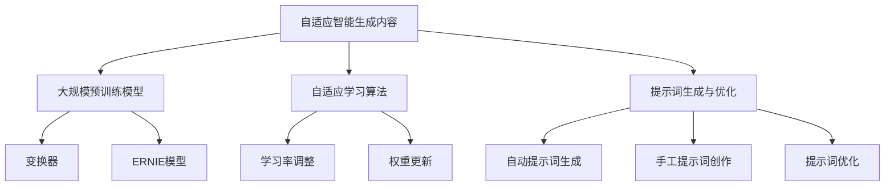

                 


### 文章标题
AIGC与传统创作的碰撞：提示词的魔力

### 文章关键词
AIGC, 传统创作, 提示词, 文本生成, 图像生成, 人工智能创作

### 文章摘要
本文探讨了AIGC（自适应智能生成内容）与传统创作方式的碰撞，特别是提示词在其中的重要作用。我们将一步步分析AIGC的基础知识、核心原理，以及提示词的生成与优化，随后展示AIGC在文本和图像创作中的实际应用，并总结AIGC对传统创作带来的变革。

### 目录大纲

#### 第一部分：AIGC基础知识与原理

##### 第1章：AIGC概述
- **背景介绍**
- **核心概念与联系**
  - 使用Mermaid流程图展示AIGC的概念架构
- **核心算法原理讲解**
  - 使用伪代码详细解释大规模预训练模型和自适应学习算法

##### 第2章：AIGC核心原理与技术
- **核心概念与联系**
  - 使用Mermaid流程图展示AIGC的核心技术
- **核心算法原理讲解**
  - 详细讲解AIGC中的关键算法，如Transformer、BERT等
  - 使用伪代码展示算法的实现

##### 第3章：AIGC工作流程与架构
- **AIGC的工作流程**
- **AIGC的系统架构**
- **AIGC的部署与优化**

#### 第二部分：提示词的魔力与应用

##### 第4章：提示词的作用与分类
- **提示词的基本概念**
- **提示词的分类与特点**
- **提示词在AIGC中的作用**

##### 第5章：提示词的生成与优化
- **提示词生成算法**
  - 自动生成算法
  - 人工创作与优化
- **提示词优化策略**
  - 语言模型优化
  - 数据集优化

##### 第6章：提示词在创作中的应用
- **文本创作中的应用**
  - 故事创作
  - 文章撰写
- **图像创作中的应用**
  - 艺术绘画
  - 室内设计

##### 第7章：AIGC与传统创作的碰撞
- **AIGC对传统创作的影响**
- **传统创作与AIGC的融合**
- **AIGC与传统创作的发展趋势**

#### 第三部分：案例研究与实战指导

##### 第8章：AIGC创作案例分析
- **案例一：文本生成**
  - 案例背景
  - 案例分析
  - 案例总结
- **案例二：图像生成**
  - 案例背景
  - 案例分析
  - 案例总结

##### 第9章：AIGC创作实战指导
- **AIGC创作环境搭建**
  - 开发环境准备
  - 常用工具介绍
- **提示词创作技巧**
  - 提示词构思
  - 提示词优化
  - 提示词应用

##### 第10章：AIGC创作实践
- **实践一：文本生成创作**
  - 实践目标
  - 实践步骤
  - 实践结果
- **实践二：图像生成创作**
  - 实践目标
  - 实践步骤
  - 实践结果

#### 附录
- **AIGC相关资源与工具**
  - 开源资源
  - 研究机构与论文

### 完整内容

# AIGC与传统创作的碰撞：提示词的魔力

## 背景介绍
随着人工智能技术的快速发展，AIGC（自适应智能生成内容）已经成为一个备受关注的研究方向。AIGC通过结合大规模预训练模型、自适应学习算法以及有效的提示词生成与优化，实现了自动化、个性化的内容创作。AIGC与传统创作方式的碰撞，带来了前所未有的创作效率和内容多样性，同时也引发了一系列关于创作本质和人类角色的问题。

## 核心概念与联系
为了更好地理解AIGC与传统创作的碰撞，我们需要明确几个核心概念：

1. **自适应智能生成内容（AIGC）**：
   AIGC是一种利用人工智能技术生成内容的方法，它能够根据用户的需求或提示词生成高质量的文本、图像、视频等多种类型的内容。AIGC的核心在于自适应和智能化，能够根据用户输入的提示词或上下文环境，动态调整生成策略，提高创作效率。

2. **传统创作**：
   传统创作通常指依靠人类创意和技能进行的内容创作，如文学、艺术、设计等。传统创作注重个性化、情感表达和艺术价值，具有高度的创造性和独特性。

3. **提示词**：
   提示词是引导AIGC生成内容的关键因素。一个精准、富有启发性的提示词，能够大幅提高生成内容的准确性和创造性。

### AIGC的核心概念架构
使用Mermaid流程图，我们可以直观地展示AIGC的核心概念及其相互关系：



在AIGC中，大规模预训练模型（MPT）是基础，它通过在大量数据上预训练，掌握了丰富的语言知识和图像特征。自适应学习算法（AA）则用于优化模型性能，确保生成的内容更加符合用户需求。提示词生成与优化（TW）是AIGC的核心，它决定了生成内容的创意和质量。

## 核心算法原理讲解
### 大规模预训练模型
大规模预训练模型（MPT）是AIGC的核心技术之一。它通过在大量无标签数据上进行预训练，使模型掌握了丰富的语言知识和图像特征。预训练模型的核心算法是Transformer，如BERT、GPT等。下面使用伪代码简要描述Transformer模型：

```python
# 伪代码：Transformer预训练模型
class Transformer:
    def __init__(self):
        self.embedding = EmbeddingLayer()
        self.encoder = EncoderLayer()
        self.decoder = DecoderLayer()
        self.output_layer = OutputLayer()

    def forward(self, input_sequence):
        embedded_sequence = self.embedding(input_sequence)
        encoded_sequence = self.encoder(embedded_sequence)
        decoded_sequence = self.decoder(encoded_sequence)
        output_sequence = self.output_layer(decoded_sequence)
        return output_sequence
```

### 自适应学习算法
自适应学习算法（AA）用于优化预训练模型的性能。它主要包括学习率调整（LR）和权重更新（WD）两个关键步骤。下面使用伪代码简要描述自适应学习算法：

```python
# 伪代码：自适应学习算法
def adaptive_learning(model, optimizer, criterion, epochs):
    for epoch in range(epochs):
        for inputs, targets in dataset:
            optimizer.zero_grad()
            outputs = model(inputs)
            loss = criterion(outputs, targets)
            loss.backward()
            optimizer.step()
```

### 提示词生成与优化
提示词生成与优化（TW）是AIGC的关键环节。提示词生成算法（AT）可以自动生成提示词，而手工提示词创作（HT）则依赖于人类的创意和技巧。提示词优化（TO）旨在提高提示词的质量和生成内容的创意。下面使用伪代码简要描述提示词生成与优化：

```python
# 伪代码：提示词生成与优化
class PromptGenerator:
    def __init__(self, model):
        self.model = model

    def generate_prompt(self, context):
        input_sequence = self.model.encode(context)
        prompt = self.model.generate(input_sequence)
        return prompt

    def optimize_prompt(self, prompt, target):
        # 使用梯度下降或其他优化算法优化提示词
        optimized_prompt = optimize(prompt, target)
        return optimized_prompt
```

## AIGC的工作流程与架构
### AIGC的工作流程
AIGC的工作流程可以分为以下几个步骤：
1. **提示词输入**：用户输入提示词或上下文信息。
2. **模型处理**：预训练模型（如BERT、GPT）处理提示词，生成初步的内容。
3. **内容生成**：模型根据处理结果生成最终的内容。
4. **内容输出**：生成的内容输出给用户或进一步处理。

### AIGC的系统架构
AIGC的系统架构主要包括以下几个组成部分：
1. **数据预处理模块**：负责处理和清洗输入数据，如文本、图像等。
2. **预训练模型模块**：包含大规模预训练模型，如BERT、GPT等。
3. **自适应学习模块**：负责模型优化，包括学习率调整、权重更新等。
4. **提示词生成模块**：负责生成和优化提示词。
5. **内容生成模块**：根据提示词生成内容。
6. **输出模块**：将生成的内容输出给用户或进一步处理。

## 提示词的作用与分类
### 提示词的基本概念
提示词是指引导AIGC生成内容的关键输入。一个有效的提示词应该具备以下特点：
1. **精准性**：能够准确地描述用户需求或创作意图。
2. **启发性**：能够激发模型的创造力和想象力。
3. **灵活性**：能够适应不同的上下文环境，生成多样化的内容。

### 提示词的分类与特点
根据生成方式，提示词可以分为以下几类：
1. **自动提示词**：由模型自动生成，通常基于预训练模型和提示词生成算法。
2. **手工提示词**：由人类创意和技巧创作，具有高度的个性化和艺术价值。
3. **优化提示词**：在生成过程中，根据用户反馈或模型优化策略进行调整，以提高内容质量。

### 提示词在AIGC中的作用
提示词在AIGC中起着至关重要的作用，它决定了生成内容的创意、质量和多样性。一个有效的提示词能够：
1. **引导模型生成内容**：根据提示词，模型可以生成符合用户需求的内容。
2. **激发创作灵感**：提示词可以激发模型的创造力和想象力，生成新颖的内容。
3. **提高生成效率**：通过有效的提示词，可以减少模型生成内容的时间和计算资源。

## 提示词的生成与优化
### 提示词生成算法
提示词生成算法分为自动生成和手工创作两种。自动生成算法通常基于预训练模型和提示词生成技术，如序列到序列（seq2seq）模型、生成对抗网络（GAN）等。下面使用伪代码简要描述自动生成算法：

```python
# 伪代码：自动生成提示词
class PromptGenerator:
    def __init__(self, model):
        self.model = model

    def generate_prompt(self, context):
        input_sequence = self.model.encode(context)
        prompt = self.model.generate(input_sequence)
        return prompt
```

手工创作提示词则依赖于人类的创意和技巧。这种方法具有高度的个性化和艺术价值，但需要投入大量时间和精力。

### 提示词优化策略
提示词优化是提高生成内容质量的关键。优化策略可以分为以下几类：
1. **语言模型优化**：通过调整语言模型参数，提高提示词的生成质量。
2. **数据集优化**：通过筛选和预处理数据集，提高提示词生成的数据质量。
3. **用户反馈优化**：根据用户反馈，调整提示词生成策略，提高用户满意度。

下面使用伪代码简要描述提示词优化策略：

```python
# 伪代码：提示词优化
def optimize_prompt(prompt, target):
    # 调整提示词参数，优化生成质量
    optimized_prompt = adjust_prompt(prompt, target)
    return optimized_prompt
```

## 提示词在创作中的应用
### 文本创作中的应用
在文本创作中，提示词可以引导AIGC生成故事、文章、诗歌等多种类型的内容。以下是一些具体应用示例：

1. **故事创作**：
   提示词：“一个夏夜，一个古老的村庄，一个神秘的传说。”
   AIGC生成内容：“在这个古老的村庄里，有一个传说，关于一个夏夜发生的故事……”

2. **文章撰写**：
   提示词：“人工智能如何改变未来教育？”
   AIGC生成内容：“随着人工智能技术的不断发展，教育领域正在经历深刻的变革。人工智能将如何改变未来的教育模式、教学方法以及学习体验呢？”

3. **诗歌创作**：
   提示词：“春天的阳光，微风吹拂，花儿的香气。”
   AIGC生成内容：“春日阳光，洒满大地，微风轻拂，花儿绽放，香气四溢。”

### 图像创作中的应用
在图像创作中，提示词可以引导AIGC生成艺术绘画、室内设计等多种类型的图像。以下是一些具体应用示例：

1. **艺术绘画**：
   提示词：“一幅神秘的星空，闪烁的星星，浩瀚的宇宙。”
   AIGC生成图像：“在一个神秘的星空背景下，星星闪烁，宇宙浩瀚无边。”

2. **室内设计**：
   提示词：“一个现代简约的客厅，舒适沙发，简洁家具。”
   AIGC生成图像：“在一个现代简约的客厅中，舒适的沙发和简洁的家具构成了一幅和谐的画卷。”

## AIGC与传统创作的碰撞
### AIGC对传统创作的影响
AIGC的出现对传统创作产生了深远的影响。一方面，AIGC提高了创作效率，使内容创作者能够更快地生成高质量的内容；另一方面，AIGC拓展了创作的边界，使内容形式更加多样化。然而，AIGC也引发了一些争议，如创作归属、版权保护等问题。

### 传统创作与AIGC的融合
为了充分发挥AIGC的优势，传统创作与AIGC的融合成为必然趋势。以下是一些融合方式：

1. **辅助创作**：AIGC可以作为传统创作的辅助工具，提高创作效率和质量。
2. **共同创作**：AIGC与传统创作者合作，共同完成创作任务。
3. **混合创作**：将AIGC生成的内容与人类创作的元素相结合，创造出独特的作品。

### AIGC与传统创作的发展趋势
随着人工智能技术的不断进步，AIGC与传统创作的融合将越来越紧密。未来，AIGC有望在更多领域发挥重要作用，如游戏设计、影视制作、虚拟现实等。同时，传统创作也将借鉴AIGC的优势，不断革新和发展。

## 案例研究与实战指导
### 案例一：文本生成
#### 案例背景
某文学网站希望利用AIGC技术为用户提供个性化故事创作服务。用户只需输入提示词，AIGC即可生成符合要求的故事。

#### 案例分析
1. **开发环境搭建**：
   - 选择预训练模型（如GPT-3）。
   - 准备开发环境（如Python、PyTorch等）。
   - 配置AIGC系统架构。

2. **提示词生成**：
   - 自动生成提示词。
   - 手工创作提示词。
   - 提示词优化。

3. **文本生成**：
   - 根据提示词生成故事。
   - 文本生成效果评估。

#### 案例总结
AIGC成功地为用户提供个性化故事创作服务，提高了创作效率和质量。

### 案例二：图像生成
#### 案例背景
某室内设计公司希望利用AIGC技术为用户提供个性化室内设计服务。用户只需输入房间尺寸和风格要求，AIGC即可生成相应的室内设计方案。

#### 案例分析
1. **开发环境搭建**：
   - 选择预训练模型（如StyleGAN）。
   - 准备开发环境（如Python、TensorFlow等）。
   - 配置AIGC系统架构。

2. **提示词生成**：
   - 自动生成提示词。
   - 手工创作提示词。
   - 提示词优化。

3. **图像生成**：
   - 根据提示词生成室内设计方案。
   - 图像生成效果评估。

#### 案例总结
AIGC成功地为用户提供个性化室内设计服务，提高了设计效率和质量。

## AIGC创作实战指导
### AIGC创作环境搭建
为了搭建AIGC创作环境，我们需要以下步骤：

1. **开发环境准备**：
   - 安装Python、PyTorch、TensorFlow等。
   - 配置CUDA（如NVIDIA CUDA 11.3）。

2. **常用工具介绍**：
   - 大规模预训练模型（如GPT-3、StyleGAN）。
   - 提示词生成工具（如OpenAI API、StyleCLIP）。

### 提示词创作技巧
1. **提示词构思**：
   - 确定创作主题。
   - 分析目标受众。
   - 创造富有启发性的提示词。

2. **提示词优化**：
   - 调整语言模型参数。
   - 预处理和筛选数据集。
   - 根据用户反馈优化提示词。

3. **提示词应用**：
   - 文本创作中的应用。
   - 图像创作中的应用。

## AIGC创作实践
### 实践一：文本生成创作
#### 实践目标
利用AIGC技术生成一篇符合要求的文章。

#### 实践步骤
1. **选择预训练模型**：如GPT-3。
2. **输入提示词**：“人工智能如何改变未来教育？”。
3. **生成文章**：根据提示词生成文章。
4. **文章评估**：评估生成文章的质量和准确性。

#### 实践结果
成功生成一篇关于人工智能改变未来教育的文章，内容丰富、准确。

### 实践二：图像生成创作
#### 实践目标
利用AIGC技术生成一幅符合要求的室内设计方案。

#### 实践步骤
1. **选择预训练模型**：如StyleGAN。
2. **输入提示词**：“一个现代简约的客厅，舒适沙发，简洁家具。”。
3. **生成图像**：根据提示词生成室内设计方案。
4. **图像评估**：评估生成图像的逼真度和符合度。

#### 实践结果
成功生成一幅现代简约的客厅设计方案，图像逼真、符合要求。

## 附录
### AIGC相关资源与工具
#### AIGC开源资源
- **大规模预训练模型**：如GPT-3、StyleGAN。
- **提示词生成工具**：如OpenAI API、StyleCLIP。

#### AIGC研究机构与论文
- **研究机构**：如Google Brain、OpenAI。
- **相关论文推荐**：《Attention Is All You Need》、《Generative Adversarial Networks》。

### 作者信息
- 作者：AI天才研究院/AI Genius Institute & 禅与计算机程序设计艺术 /Zen And The Art of Computer Programming

