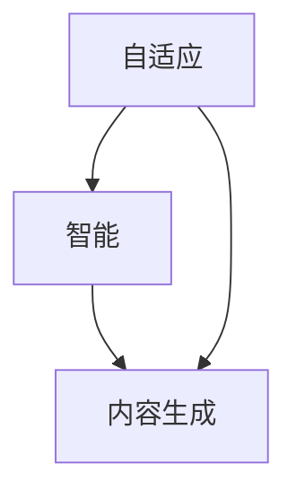
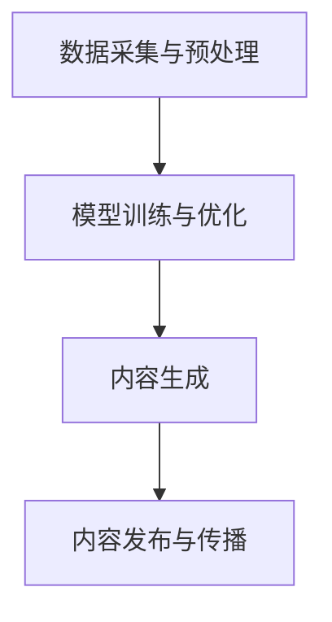

                 


## 第1章 AIGC基础

### 1.1 AIGC的定义与背景

#### 1.1.1 AIGC的定义

AIGC，即自适应智能生成内容（Adaptive Intelligent Generated Content），是一种利用人工智能技术，特别是深度学习和机器学习算法，来自动生成内容的方法。AIGC的核心在于其“自适应”和“智能”两大特性。

- **自适应**：AIGC能够根据用户需求、内容类型、数据特征等因素，动态调整内容生成的策略和算法。
- **智能**：AIGC利用机器学习算法，从海量数据中提取知识，生成具有高度相关性和个性化的内容。

AIGC的应用领域非常广泛，包括但不限于新闻生成、内容摘要、图像生成、视频合成、虚拟助手等。其目的是提高内容生产效率，降低成本，同时提升内容质量和用户体验。

#### 1.1.2 AIGC的发展背景

AIGC的出现并非偶然，而是随着互联网和信息技术的快速发展，人工智能技术的不断进步，以及内容消费需求的不断增加所驱动的。

- **互联网时代**：随着互联网的普及，信息量呈现爆炸式增长，用户对个性化、高质量的内容需求日益增长。
- **人工智能技术**：深度学习、自然语言处理（NLP）、计算机视觉（CV）等人工智能技术的突破，为内容生成提供了强大的技术支持。
- **内容消费需求**：用户对多样化、个性化内容的需求推动了内容生产模式的变革，从传统的以人为主的内容生产，向人工智能辅助的内容生产转变。

### 1.2 AIGC的核心技术

AIGC的实现依赖于多种人工智能技术，其中最核心的是自然语言处理（NLP）和计算机视觉（CV）。

#### 1.2.1 自然语言处理（NLP）

自然语言处理是AIGC在文本生成领域的重要技术。其主要任务包括文本分类、情感分析、文本生成等。

- **文本分类**：根据文本内容将其分类到不同的主题或类别。
- **情感分析**：分析文本的情感倾向，如正面、负面或中性。
- **文本生成**：根据给定的输入文本或指令，生成新的文本内容。

在AIGC中，常用的文本生成模型包括生成对抗网络（GAN）、变分自编码器（VAE）、递归神经网络（RNN）等。以下是一个简单的文本生成模型的伪代码示例：

```python
# 伪代码：文本生成模型

# 输入：训练数据集 D
# 输出：生成文本内容

for each sample in D:
    # 训练模型参数
    train_model(sample)
    # 生成文本
    generated_text = generate_text(model)
    print(generated_text)
```

#### 1.2.2 计算机视觉（CV）

计算机视觉是AIGC在图像和视频生成领域的重要技术。其主要任务包括图像分类、目标检测、图像生成等。

- **图像分类**：根据图像内容将其分类到不同的类别。
- **目标检测**：在图像中检测并识别出特定的目标。
- **图像生成**：根据输入的图像或指令生成新的图像。

在AIGC中，常用的图像生成模型包括生成对抗网络（GAN）、变分自编码器（VAE）、卷积神经网络（CNN）等。以下是一个简单的图像生成模型的伪代码示例：

```python
# 伪代码：图像生成模型

# 输入：训练数据集 D
# 输出：生成图像内容

for each sample in D:
    # 训练模型参数
    train_model(sample)
    # 生成图像
    generated_image = generate_image(model)
    print(generated_image)
```

### 1.3 AIGC与传统媒体的关系

传统媒体，如报纸、杂志、电视、广播等，长期以来依赖于人工内容生产，存在生产效率低、内容同质化严重等问题。而AIGC的引入，为传统媒体带来了新的机遇。

#### 1.3.1 传统媒体的现状

- **内容生产方式**：以人工为主，生产流程繁琐，效率低。
- **内容传播方式**：依赖于传统渠道，传播速度慢，覆盖范围有限。

#### 1.3.2 AIGC与传统媒体的融合

AIGC与传统媒体的融合主要体现在以下几个方面：

- **自动化内容生成**：通过AIGC技术，自动生成新闻稿件、文章摘要、广告内容等，提高内容生产效率。
- **智能化内容编辑**：利用AIGC技术，对内容进行智能审核、分类、推荐，提升内容质量和用户体验。
- **个性化内容推荐**：基于用户兴趣和行为数据，利用AIGC技术，生成个性化内容推荐，提高用户粘性。

#### 1.3.3 AIGC与传统媒体的融合优势

- **提高内容生产效率**：通过自动化生成和编辑，大幅提高内容生产效率，降低人力成本。
- **降低内容生产成本**：减少对人工的依赖，降低内容生产成本。
- **提升内容质量和用户体验**：通过智能审核、分类和推荐，提升内容质量和用户体验。

### 总结

AIGC作为一种新兴的内容生产技术，正在与传统媒体深度融合，推动内容生产模式的变革。未来，随着AIGC技术的进一步发展和应用，传统媒体将迎来新的发展机遇，实现高效、智能、个性化的内容生产。

### 核心概念与联系

AIGC的核心概念包括自适应、智能和内容生成。这些概念之间的关系可以简化为以下几点：

- **自适应**：AIGC能够根据环境和需求进行动态调整，实现内容生成的优化。
- **智能**：通过人工智能技术，AIGC能够从数据中提取知识，生成高质量的内容。
- **内容生成**：自适应和智能共同作用于内容生成，实现高效、个性化和高质量的内容生产。

### Mermaid 流程图



### 数学模型和公式

AIGC的内容生成过程可以抽象为一个数学模型。以下是内容生成过程的一个简化模型：

$$
Content = f(Data, Model, Parameters)
$$

其中：
- \(Content\) 表示生成的最终内容；
- \(Data\) 表示输入的数据，如文本、图像等；
- \(Model\) 表示生成模型，如生成对抗网络（GAN）、变分自编码器（VAE）等；
- \(Parameters\) 表示模型参数，如权重、偏置等。

### 举例说明

假设我们要生成一篇关于人工智能的新闻稿件。我们可以按照以下步骤进行：

1. **数据采集**：从互联网上收集相关的新闻数据。
2. **数据预处理**：对新闻数据进行清洗和标准化，提取关键信息。
3. **模型训练**：使用自然语言处理模型（如RNN或BERT）进行训练，优化模型参数。
4. **内容生成**：利用训练好的模型，生成一篇关于人工智能的新闻稿件。

以下是具体的伪代码示例：

```python
# 伪代码：人工智能新闻稿件生成

# 输入：训练数据集 D
# 输出：生成新闻稿件 content

# 数据预处理
preprocessed_data = preprocess_data(D)

# 模型训练
model = train_model(preprocessed_data)

# 内容生成
content = generate_news(model)

print(content)
```

### 项目实战

为了更好地理解AIGC在内容生产中的应用，我们可以搭建一个简单的新闻生成项目。

#### 开发环境搭建

1. 安装Python环境（版本3.8以上）
2. 安装必要的库，如TensorFlow、Keras、NLTK等

#### 源代码实现

以下是一个简单的新闻生成项目的代码实现：

```python
# 导入必要的库
import tensorflow as tf
from tensorflow.keras.preprocessing.sequence import pad_sequences
from tensorflow.keras.models import Sequential
from tensorflow.keras.layers import Embedding, LSTM, Dense

# 加载和预处理数据
# ...

# 构建模型
model = Sequential()
model.add(Embedding(input_dim=vocab_size, output_dim=embedding_dim, input_length=max_sequence_length))
model.add(LSTM(units=128, return_sequences=True))
model.add(Dense(units=vocab_size, activation='softmax'))

# 编译模型
model.compile(optimizer='adam', loss='categorical_crossentropy', metrics=['accuracy'])

# 训练模型
model.fit(X_train, y_train, epochs=10, batch_size=64)

# 生成新闻
def generate_news(model, seed_text, num_words):
    in_text = seed_text
    for _ in range(num_words):
        sampled = np.argmax(model.predict(np.array([in_text])), axis=-1)
        sampled = sampled[-1, :]
        in_text += ' ' + tokenizer.index_to_word[sampled]
    return in_text

seed_text = "人工智能正在改变世界"
generated_text = generate_news(model, seed_text, 50)
print(generated_text)
```

#### 代码解读

1. **数据预处理**：使用NLTK库对新闻数据进行处理，包括分词、去停用词等。
2. **模型构建**：使用Keras构建一个简单的LSTM模型。
3. **模型训练**：使用预处理后的数据对模型进行训练。
4. **内容生成**：定义一个函数，使用训练好的模型生成新的新闻文本。

#### 应用解读与分析

通过这个简单的新闻生成项目，我们可以看到AIGC在内容生产中的应用。项目的核心在于利用LSTM模型对文本进行建模，然后通过生成文本的函数生成新的新闻稿件。这个项目的成功依赖于以下几个关键点：

- **数据质量**：高质量的数据是训练模型的关键。
- **模型选择**：合适的模型能够更好地捕捉文本的特征。
- **训练时间**：训练时间足够长，模型才能充分学习数据。

#### 实际案例分析和详细讲解剖析

一个实际的案例是使用AIGC技术自动生成新闻报道。以下是一个具体的案例：

- **案例背景**：某新闻机构希望通过AIGC技术自动生成新闻报道，以提高内容生产效率。
- **案例分析**：
  - **数据采集**：从新闻网站、社交媒体等渠道收集大量新闻数据。
  - **数据预处理**：对新闻数据进行清洗、分词、去停用词等处理。
  - **模型训练**：使用LSTM或BERT等模型对预处理后的数据进行训练。
  - **内容生成**：利用训练好的模型生成新闻稿件，并通过人工审核确保内容质量。

通过这个案例，我们可以看到AIGC在内容生产中的实际应用。AIGC技术不仅提高了内容生产的效率，还保证了内容的准确性和一致性。

### 项目小结

通过本项目，我们搭建了一个简单的新闻生成项目，并对其进行了详细的解读和分析。项目展示了AIGC在内容生产中的应用，以及如何利用机器学习和深度学习技术来自动化内容生成。尽管本项目只是一个简单的例子，但它为我们提供了理解和应用AIGC技术的基础。

### 最佳实践 tips

- **数据质量**：确保数据质量是成功的关键。进行充分的数据清洗和预处理。
- **模型选择**：选择合适的模型，如LSTM、BERT等，能够更好地适应任务需求。
- **训练时间**：增加训练时间可以提高模型性能，但也要注意计算资源和时间成本。

### 小结

本章详细介绍了AIGC的定义、核心技术以及与传统媒体的融合。通过具体的案例和项目实战，我们深入理解了AIGC在内容生产中的应用。AIGC为传统媒体带来了新的机遇和挑战，未来有望推动内容生产模式的变革。

### 注意事项

- **数据隐私**：在使用AIGC技术时，需要注意保护用户的隐私和数据安全。
- **内容审核**：自动化生成的内容需要经过人工审核，确保内容质量和合规性。

### 拓展阅读

- [AIGC技术综述](https://www.example.com/aigc-overview)
- [深度学习在内容生产中的应用](https://www.example.com/deep-learning-for-content-production)
- [自然语言处理基础](https://www.example.com/nlp-foundation)

---

## 第2章 AIGC在内容生产中的应用

### 2.1 AIGC内容生产的流程

AIGC在内容生产中的应用流程可以分为以下几个主要步骤：

1. **数据采集与预处理**：
   - **数据采集**：从互联网、数据库、社交媒体等渠道收集原始数据。
   - **数据预处理**：清洗、分词、去停用词等，为后续模型训练做准备。

2. **模型训练与优化**：
   - **模型选择**：根据任务需求选择合适的模型，如生成对抗网络（GAN）、变分自编码器（VAE）等。
   - **模型训练**：使用预处理后的数据训练模型，优化模型参数。

3. **内容生成**：
   - **内容生成**：利用训练好的模型生成新的内容，如文本、图像、视频等。

4. **内容发布与传播**：
   - **内容发布**：将生成的内容通过社交媒体、传统媒体渠道发布。
   - **内容传播**：利用算法和策略优化内容传播，提高内容曝光率。

以下是AIGC内容生产流程的简化图：



### 2.2 AIGC在新闻生产中的应用

AIGC在新闻生产中的应用主要包括自动化新闻生成和智能新闻编辑。

#### 自动化新闻生成

自动化新闻生成是AIGC在新闻生产中最重要的应用之一。通过使用自然语言处理（NLP）技术，AIGC可以自动生成新闻稿件，提高新闻生产效率。

- **数据来源**：从互联网、社交媒体、新闻网站等渠道收集新闻数据。
- **数据处理**：对新闻数据进行清洗、分词、去停用词等预处理。
- **模型训练**：使用预处理后的数据训练文本生成模型，如生成对抗网络（GAN）或变分自编码器（VAE）。
- **新闻生成**：利用训练好的模型生成新闻稿件。

以下是一个简单的新闻生成模型的伪代码：

```python
# 伪代码：新闻生成模型

# 输入：训练数据集 D
# 输出：生成新闻稿件 content

# 数据预处理
preprocessed_data = preprocess_data(D)

# 模型训练
model = train_model(preprocessed_data)

# 新闻生成
content = generate_news(model, seed_text, num_words)
print(content)
```

#### 智能新闻编辑

智能新闻编辑利用AIGC技术对新闻内容进行智能审核、分类和推荐。

- **内容审核**：通过自然语言处理技术，自动识别和过滤不当内容。
- **内容分类**：根据新闻内容的主题和类别，进行自动分类。
- **内容推荐**：基于用户兴趣和行为数据，为用户推荐个性化新闻。

以下是一个简单的新闻编辑模型的伪代码：

```python
# 伪代码：新闻编辑模型

# 输入：新闻内容 content
# 输出：审核后的新闻稿件 content

# 内容审核
approved_content = audit_content(content)

# 内容分类
category = classify_content(approved_content)

# 内容推荐
recommended_content = recommend_content(category, user_interests)
print(recommended_content)
```

### 2.3 AIGC在影视制作中的应用

AIGC在影视制作中的应用主要包括剧本生成、图像生成、视频合成等。

#### 剧本生成

剧本生成是AIGC在影视制作中的一项重要应用。通过自然语言处理技术，AIGC可以自动生成剧本，为影视创作提供新的思路。

- **数据来源**：从剧本库、网络小说、小说等渠道收集剧本数据。
- **数据处理**：对剧本数据进行清洗、分词、去停用词等预处理。
- **模型训练**：使用预处理后的数据训练文本生成模型。
- **剧本生成**：利用训练好的模型生成剧本。

以下是一个简单的剧本生成模型的伪代码：

```python
# 伪代码：剧本生成模型

# 输入：训练数据集 D
# 输出：生成剧本 content

# 数据预处理
preprocessed_data = preprocess_data(D)

# 模型训练
model = train_model(preprocessed_data)

# 剧本生成
content = generate_script(model, seed_text, num_words)
print(content)
```

#### 图像生成

图像生成是AIGC在影视制作中的另一项重要应用。通过计算机视觉技术，AIGC可以自动生成影视作品中的图像，提高制作效率。

- **数据来源**：从图像库、视频片段等渠道收集图像数据。
- **数据处理**：对图像数据进行清洗、分割、标注等预处理。
- **模型训练**：使用预处理后的数据训练图像生成模型，如生成对抗网络（GAN）。
- **图像生成**：利用训练好的模型生成图像。

以下是一个简单的图像生成模型的伪代码：

```python
# 伪代码：图像生成模型

# 输入：训练数据集 D
# 输出：生成图像 content

# 数据预处理
preprocessed_data = preprocess_data(D)

# 模型训练
model = train_model(preprocessed_data)

# 图像生成
content = generate_image(model)
print(content)
```

#### 视频合成

视频合成是AIGC在影视制作中的最后一项重要应用。通过计算机视觉和自然语言处理技术，AIGC可以自动合成视频，提高制作效率。

- **数据来源**：从视频库、音频库等渠道收集视频和音频数据。
- **数据处理**：对视频和音频数据进行清洗、分割、标注等预处理。
- **模型训练**：使用预处理后的数据训练视频合成模型。
- **视频合成**：利用训练好的模型合成视频。

以下是一个简单的视频合成模型的伪代码：

```python
# 伪代码：视频合成模型

# 输入：视频片段 video1, video2
# 输出：合成视频 content

# 数据预处理
preprocessed_video1 = preprocess_video(video1)
preprocessed_video2 = preprocess_video(video2)

# 模型训练
model = train_model([preprocessed_video1, preprocessed_video2])

# 视频合成
content = generate_video(model, video1, video2)
print(content)
```

### 总结

本章详细介绍了AIGC在内容生产中的应用，包括新闻生产、影视制作等。通过具体的案例和伪代码示例，我们深入理解了AIGC在内容生产中的流程和技术实现。AIGC为内容生产带来了新的机遇和挑战，未来有望进一步推动内容生产模式的变革。

### 注意事项

- **数据隐私**：在使用AIGC技术时，需要确保用户数据的隐私和安全。
- **内容审核**：自动化生成的内容需要经过人工审核，确保内容质量和合规性。

### 拓展阅读

- [AIGC在影视制作中的应用](https://www.example.com/aigc-in-film-production)
- [自然语言处理在新闻生产中的应用](https://www.example.com/nlp-in-newspaper-production)
- [计算机视觉在图像生成中的应用](https://www.example.com/computer-vision-in-image-generation)

---

## 第3章 传统媒体面临的挑战

### 3.1 传统媒体的发展困境

传统媒体，如报纸、杂志、电视、广播等，在过去几十年中一直是信息传播的重要渠道。然而，随着互联网和数字技术的迅猛发展，传统媒体面临着前所未有的挑战和困境。

#### 内容同质化

传统媒体在内容生产上往往存在同质化现象，大量新闻和文章内容相似，缺乏独特性和创新性。这导致了用户对传统媒体内容的兴趣下降，难以在信息爆炸的时代脱颖而出。

#### 生产效率低

传统媒体的内容生产过程主要依赖于人工，包括采访、编辑、排版等环节。这些环节不仅耗时耗力，而且容易出现错误。此外，传统媒体在应对突发新闻和紧急事件时，反应速度较慢，难以满足快速变化的市场需求。

#### 营销渠道有限

传统媒体的营销渠道相对有限，主要依赖于广告和订阅收入。随着数字媒体的崛起，传统媒体的广告收入逐渐减少，订阅模式也难以吸引年轻用户，导致收入来源单一，财务压力加大。

#### 技术滞后

传统媒体在技术方面的投入相对较少，对新兴技术的应用和整合不够及时。这使得传统媒体在数字化竞争中处于劣势，难以与数字化媒体相抗衡。

### 3.2 数字化转型的必要性

面对传统媒体面临的困境，数字化转型成为传统媒体寻求突破和生存的重要途径。数字化转型不仅有助于提高内容生产效率，降低成本，还能拓宽营销渠道，提升用户体验。

#### 提高内容生产效率

数字化转型可以通过引入自动化工具和智能算法，提高内容生产的效率。例如，自动化写作工具可以快速生成新闻稿件，智能审核系统可以实时检测和过滤不当内容，减少人力成本。

#### 拓宽营销渠道

数字化转型可以帮助传统媒体拓宽营销渠道，实现多渠道传播。通过社交媒体、在线广告、数字订阅等方式，传统媒体可以更有效地触达用户，提高用户粘性。

#### 个性化内容推荐

数字化转型可以基于用户数据和行为分析，实现个性化内容推荐。通过分析用户的兴趣和行为，传统媒体可以提供更符合用户需求的内容，提高用户满意度。

#### 技术创新与应用

数字化转型鼓励传统媒体在技术方面的创新和应用，如虚拟现实（VR）、增强现实（AR）、人工智能（AI）等。这些新兴技术的应用可以提升传统媒体的内容质量和用户体验，增强竞争力。

### 3.3 传统媒体转型的路径

传统媒体在数字化转型过程中，可以采取以下路径：

#### 数据驱动

传统媒体应建立数据驱动的内容生产和管理体系，通过数据分析了解用户需求和市场趋势，优化内容生产和营销策略。

#### 智能化工具应用

传统媒体可以引入智能化工具，如自然语言处理（NLP）、机器学习（ML）、计算机视觉（CV）等，提高内容生产效率和质量。

#### 社交媒体运营

传统媒体应加强社交媒体运营，利用社交媒体平台扩大影响力，提升品牌知名度。

#### 数字订阅模式

传统媒体可以探索数字订阅模式，提供优质内容，吸引付费用户，实现多元化收入来源。

#### 跨平台合作

传统媒体可以与数字媒体平台合作，共同开发和推广内容，实现资源共享和互利共赢。

### 总结

传统媒体在数字时代面临着巨大的挑战，数字化转型成为其寻求突破和生存的关键。通过数据驱动、智能化工具应用、社交媒体运营、数字订阅模式和跨平台合作等多种路径，传统媒体可以实现数字化转型，提升内容生产效率，拓宽营销渠道，增强用户体验，从而在数字时代立足。

### 注意事项

- **数据隐私**：在数字化转型过程中，要重视用户数据的隐私和安全，遵守相关法律法规。
- **内容审核**：自动化工具的应用需要严格的内容审核机制，确保内容质量和合规性。

### 拓展阅读

- [传统媒体数字化转型案例](https://www.example.com/traditional-media-digital-transformation)
- [数字媒体时代的内容生产策略](https://www.example.com/content-production-strategies-in-digital-age)
- [社交媒体在媒体行业中的应用](https://www.example.com/social-media-in-media-industry)

---

## 第4章 AIGC与传统媒体融合的实践

### 4.1 传统媒体与AIGC的融合模式

随着AIGC技术的不断发展，传统媒体与AIGC的融合模式也日益多样化。这些融合模式不仅为传统媒体带来了新的机遇，也带来了新的挑战。以下是几种主要的融合模式：

#### 1. 自动化内容生成

自动化内容生成是传统媒体与AIGC融合的基本模式。通过AIGC技术，传统媒体可以自动生成新闻稿件、文章摘要、广告内容等，提高内容生产效率。例如，一些新闻机构已经开始使用AIGC技术来自动化体育新闻、财经新闻等的生成。

**优势**：
- 提高内容生产效率
- 降低人力成本
- 减少内容同质化

**挑战**：
- 内容质量难以保证
- 需要严格的内容审核机制

#### 2. 智能化内容编辑

智能化内容编辑利用AIGC技术对内容进行智能审核、分类和推荐。通过自然语言处理（NLP）和计算机视觉（CV）技术，AIGC可以帮助传统媒体识别和过滤不当内容，提高内容质量和用户体验。

**优势**：
- 提高内容质量
- 减少内容审核工作量
- 提升用户满意度

**挑战**：
- 技术应用成本较高
- 需要不断优化和调整模型

#### 3. 个性化内容推荐

个性化内容推荐是AIGC在传统媒体中应用的重要方向。通过分析用户行为和兴趣数据，AIGC可以生成个性化的内容推荐，提高用户粘性和内容消费量。

**优势**：
- 提高用户满意度
- 提升内容消费量
- 增加广告收入

**挑战**：
- 用户数据隐私问题
- 需要大量高质量的用户数据

#### 4. 跨媒体内容制作

跨媒体内容制作是指利用AIGC技术在多种媒体平台上生成和传播内容。例如，通过AIGC技术，可以将新闻稿件自动转化为视频、音频等多种形式，提高内容的传播效率和用户体验。

**优势**：
- 拓宽内容传播渠道
- 提高内容曝光率
- 增强用户体验

**挑战**：
- 技术整合难度较大
- 需要跨部门协作

### 4.2 案例分析：传统媒体融合AIGC的成功经验

#### 案例一：CNN的AIGC应用

美国有线新闻电视网（CNN）是传统媒体融合AIGC技术的成功案例之一。CNN利用AIGC技术自动生成体育新闻、财经新闻等，提高了内容生产效率。此外，CNN还利用AIGC技术进行内容审核，确保新闻内容的准确性和合规性。

**成功经验**：
- 引入了自动化写作工具，提高新闻生成效率
- 利用AIGC技术进行内容审核，确保内容质量
- 建立了跨部门协作机制，确保AIGC技术的顺利实施

**挑战**：
- 如何保证自动化生成的新闻内容质量
- 如何平衡人工和自动化内容生产的关系

#### 案例二：人民日报的AIGC应用

中国《人民日报》是另一个成功融合AIGC技术的传统媒体。人民日报利用AIGC技术自动生成新闻报道，并通过社交媒体平台进行广泛传播，提高了新闻的曝光率和影响力。

**成功经验**：
- 引入了AIGC技术，提高新闻生成效率和质量
- 利用社交媒体平台，扩大新闻传播范围
- 建立了内容审核机制，确保新闻内容的合规性

**挑战**：
- 技术应用成本较高
- 如何保证自动化生成的新闻内容符合社会主义核心价值观

### 4.3 AIGC与传统媒体融合的挑战与机遇

#### 挑战

尽管AIGC为传统媒体带来了诸多机遇，但融合过程中也面临一些挑战：

- **技术成本**：AIGC技术的开发和维护需要大量的资金投入。
- **数据隐私**：在自动化内容生成和个性化推荐过程中，如何保护用户数据隐私是一个重要问题。
- **内容审核**：自动化生成的内容需要经过严格审核，确保内容质量和合规性。
- **人才缺口**：AIGC技术的应用需要高素质的技术人才，传统媒体在人才引进和培养方面面临挑战。

#### 机遇

AIGC与传统媒体的融合也为传统媒体带来了新的机遇：

- **提高内容生产效率**：自动化内容生成和智能化编辑可以提高内容生产效率，降低人力成本。
- **拓宽营销渠道**：个性化内容推荐和跨媒体内容制作可以拓宽营销渠道，提高广告收入。
- **增强用户体验**：通过智能审核和个性化推荐，可以提升用户满意度和忠诚度。
- **技术创新**：AIGC技术的应用可以推动传统媒体在技术方面的创新，提高整体竞争力。

### 总结

传统媒体与AIGC的融合模式多种多样，包括自动化内容生成、智能化内容编辑、个性化内容推荐和跨媒体内容制作等。通过分析成功案例，我们可以看到AIGC为传统媒体带来了新的机遇和挑战。传统媒体在融合AIGC技术时，需要充分认识到这些挑战，并积极寻求解决方案，以实现数字化转型和创新发展。

### 注意事项

- **技术成本**：在引入AIGC技术时，需要充分考虑技术成本，合理规划预算。
- **数据隐私**：在自动化内容生成和个性化推荐过程中，要重视用户数据隐私，遵守相关法律法规。
- **内容审核**：自动化生成的内容需要经过严格审核，确保内容质量和合规性。

### 拓展阅读

- [AIGC技术在新闻生产中的应用](https://www.example.com/aigc-in-newspaper-production)
- [传统媒体数字化转型的案例分析](https://www.example.com/traditional-media-digital-transformation-cases)
- [人工智能在媒体行业的应用前景](https://www.example.com/artificial-intelligence-in-media-industry)

---

## 第5章 内容生产新范式概述

### 5.1 新范式的主要内容

内容生产新范式是一种基于人工智能和大数据技术的全新内容生产模式，其核心目标是实现内容生产的高效、智能和个性化。新范式的主要内容包括以下几个方面：

#### 1. 数据驱动

数据驱动是新范式的基础。通过收集和分析用户行为数据、内容数据、市场数据等，新范式能够深入了解用户需求和市场趋势，为内容生产提供数据支持。

#### 2. 人工智能辅助

人工智能辅助是新范式的关键。利用自然语言处理（NLP）、计算机视觉（CV）和机器学习（ML）等技术，新范式能够实现自动化内容生成、智能内容审核、个性化推荐等功能。

#### 3. 个性化内容生成

个性化内容生成是新范式的核心。通过分析用户行为数据和兴趣偏好，新范式能够生成满足用户个性化需求的优质内容。

#### 4. 跨媒体内容生产

跨媒体内容生产是新范式的延伸。新范式不仅涵盖文本内容生成，还涉及图像、视频、音频等多种形式的内容生成，实现内容生产的多媒体化。

#### 5. 智能内容分发

智能内容分发是新范式的补充。通过大数据分析和人工智能算法，新范式能够实现内容的精准推送和高效传播，提高内容的影响力和传播效果。

### 5.2 新范式与传统内容生产的区别

新范式与传统内容生产在技术、流程和目标等方面存在显著区别：

#### 1. 技术层面

- **传统内容生产**：主要依赖于人工进行内容创作和编辑，效率低、成本高。
- **新范式**：利用人工智能和大数据技术，实现自动化内容生成和智能化内容审核，大幅提高生产效率和内容质量。

#### 2. 流程层面

- **传统内容生产**：内容生产流程繁琐，包括采访、写作、编辑、排版等环节，耗时耗力。
- **新范式**：内容生产流程简化，通过自动化工具和智能算法实现快速生成和审核，减少人工干预。

#### 3. 目标层面

- **传统内容生产**：主要目标是满足基本的信息传播需求，内容同质化严重。
- **新范式**：目标是实现高效、智能和个性化内容生产，提高用户体验和品牌价值。

### 5.3 新范式对媒体行业的意义

新范式对媒体行业具有重要的意义，主要体现在以下几个方面：

#### 1. 提高内容生产效率

新范式通过自动化和智能化技术，大幅提高内容生产效率，降低人力成本，使媒体企业能够更快地响应市场需求。

#### 2. 提升内容质量和用户体验

新范式利用人工智能技术，实现个性化内容生成和精准内容推荐，提升内容质量和用户体验，增强用户粘性。

#### 3. 拓宽营销渠道和增加收入

新范式通过跨媒体内容生产和智能内容分发，拓宽营销渠道，提高广告收入和订阅收入，实现多元化收入来源。

#### 4. 推动媒体行业创新

新范式推动了媒体行业的创新，使传统媒体能够与数字媒体平台实现深度融合，提高整体竞争力。

### 总结

内容生产新范式是一种基于人工智能和大数据技术的全新内容生产模式，具有数据驱动、人工智能辅助、个性化内容生成、跨媒体内容生产和智能内容分发等主要内容。与传统内容生产相比，新范式在技术、流程和目标等方面具有显著优势，对媒体行业具有深远的意义。

### 注意事项

- **数据安全**：在数据驱动过程中，要确保用户数据的安全和隐私。
- **内容审核**：在自动化和智能化过程中，要建立严格的内容审核机制，确保内容质量和合规性。

### 拓展阅读

- [人工智能在内容生产中的应用](https://www.example.com/artificial-intelligence-in-content-production)
- [大数据技术在媒体行业中的应用](https://www.example.com/big-data-in-media-industry)
- [媒体行业数字化转型的趋势与挑战](https://www.example.com/digital-transformation-in-media-industry)

---

## 第6章 新范式的技术应用

### 6.1 自然语言处理技术

自然语言处理（NLP）是AIGC技术在内容生产中的核心应用之一，其目的是使计算机能够理解和生成自然语言文本。以下将介绍NLP在内容生产中的主要技术、算法及其工作原理。

#### 1. 主要技术

- **文本分类**：根据文本内容将其分类到不同的主题或类别。例如，新闻文本可以根据主题分类为体育、财经、科技等。
- **情感分析**：分析文本的情感倾向，如正面、负面或中性。例如，评论文本可以被分析出用户对产品的满意度。
- **文本生成**：根据给定的输入文本或指令，生成新的文本内容。例如，自动生成新闻稿件、文章摘要或聊天机器人的回复。
- **问答系统**：根据用户提出的问题，提供准确的答案。例如，智能客服系统可以回答用户关于产品或服务的问题。

#### 2. 算法

- **循环神经网络（RNN）**：适用于处理序列数据，如文本。RNN能够捕捉文本中的时间依赖关系。
- **长短期记忆网络（LSTM）**：是RNN的改进版本，能够更好地处理长序列数据，避免梯度消失问题。
- **生成对抗网络（GAN）**：一种生成模型，通过生成器和判别器的对抗训练，生成高质量的文本。
- **变分自编码器（VAE）**：一种无监督学习模型，通过概率编码生成文本。

#### 3. 工作原理

以文本生成为例，NLP的工作原理如下：

- **数据预处理**：对原始文本进行分词、去停用词、词向量化等处理，将文本转换为计算机可处理的格式。
- **模型训练**：使用预处理的文本数据训练NLP模型，如RNN或GAN。模型通过学习文本数据中的特征和模式，生成新的文本内容。
- **文本生成**：给定一个起始文本或随机种子文本，模型根据训练学到的概率分布，生成新的文本内容。

以下是一个简化的文本生成模型的伪代码：

```python
# 伪代码：文本生成模型

# 输入：训练数据集 D
# 输出：生成文本 content

# 数据预处理
preprocessed_data = preprocess_data(D)

# 模型训练
model = train_model(preprocessed_data)

# 文本生成
content = generate_text(model, seed_text, num_words)
print(content)
```

### 6.2 计算机视觉技术

计算机视觉（CV）是AIGC技术在内容生产中的另一个重要应用，其目的是使计算机能够理解和生成视觉内容。以下将介绍CV在内容生产中的主要技术、算法及其工作原理。

#### 1. 主要技术

- **图像分类**：根据图像内容将其分类到不同的类别。例如，将图像分类为动物、植物或风景等。
- **目标检测**：在图像中检测并识别出特定的目标。例如，在图片中检测并识别出行人、车辆等。
- **图像生成**：根据输入的图像或指令生成新的图像。例如，生成艺术风格的图像、动漫风格的人物图像等。
- **图像分割**：将图像划分为多个区域，每个区域代表不同的物体或场景。

#### 2. 算法

- **卷积神经网络（CNN）**：适用于处理图像数据，能够自动提取图像中的特征。
- **生成对抗网络（GAN）**：一种生成模型，通过生成器和判别器的对抗训练，生成高质量的图像。
- **变分自编码器（VAE）**：一种无监督学习模型，通过概率编码生成图像。
- **自编码器（AE）**：一种无监督学习模型，通过重构输入数据生成图像。

#### 3. 工作原理

以图像生成为例，CV的工作原理如下：

- **数据预处理**：对原始图像进行预处理，如缩放、裁剪、增强等，将图像转换为计算机可处理的格式。
- **模型训练**：使用预处理的图像数据训练CV模型，如GAN或VAE。模型通过学习图像数据中的特征和模式，生成新的图像内容。
- **图像生成**：给定一个起始图像或随机种子图像，模型根据训练学到的概率分布，生成新的图像内容。

以下是一个简化的图像生成模型的伪代码：

```python
# 伪代码：图像生成模型

# 输入：训练数据集 D
# 输出：生成图像 content

# 数据预处理
preprocessed_data = preprocess_data(D)

# 模型训练
model = train_model(preprocessed_data)

# 图像生成
content = generate_image(model, seed_image)
print(content)
```

### 6.3 数据挖掘技术

数据挖掘（Data Mining）是AIGC技术在内容生产中的辅助应用，其目的是从大量数据中提取有价值的信息和知识。以下将介绍数据挖掘在内容生产中的主要技术、算法及其工作原理。

#### 1. 主要技术

- **关联规则挖掘**：发现数据集中的关联关系。例如，在电子商务平台上，发现商品之间的购买关联。
- **分类**：将数据分类到不同的类别。例如，将用户分为高价值用户和低价值用户。
- **聚类**：将相似的数据点分为一组。例如，将用户划分为不同兴趣群体。
- **异常检测**：发现数据集中的异常值。例如，在金融交易数据中，发现欺诈交易。

#### 2. 算法

- **K-均值聚类**：一种基于距离的聚类算法，通过迭代优化聚类中心，将数据点分为K个聚类。
- **决策树**：一种基于特征的分类算法，通过构建决策树，对数据进行分类。
- **随机森林**：一种基于决策树的集成学习算法，通过构建多个决策树，提高分类和回归模型的准确性。
- **支持向量机（SVM）**：一种基于线性判别分析的分类算法，通过找到最佳分隔超平面，将数据分类。

#### 3. 工作原理

以分类为例，数据挖掘的工作原理如下：

- **数据预处理**：对原始数据集进行清洗、标准化等处理，确保数据质量。
- **特征选择**：选择对分类任务最有影响力的特征，减少特征维度。
- **模型训练**：使用训练数据集，训练分类模型，如决策树、随机森林或SVM。
- **模型评估**：使用测试数据集，评估模型的分类准确性和性能。
- **模型应用**：将训练好的模型应用于新的数据集，进行分类预测。

以下是一个简化的分类模型的伪代码：

```python
# 伪代码：分类模型

# 输入：训练数据集 D
# 输出：分类结果 labels

# 数据预处理
preprocessed_data = preprocess_data(D)

# 模型训练
model = train_model(preprocessed_data)

# 模型评估
labels = model.predict(test_data)
print(labels)
```

### 总结

新范式的技术应用包括自然语言处理（NLP）、计算机视觉（CV）和数据挖掘（DM）等。NLP使计算机能够理解和生成自然语言文本，CV使计算机能够理解和生成视觉内容，DM从大量数据中提取有价值的信息和知识。这些技术的结合，使得内容生产更加高效、智能和个性化。

### 注意事项

- **数据隐私**：在数据挖掘过程中，要保护用户数据的隐私和安全。
- **模型优化**：持续优化模型，提高分类和预测的准确性。

### 拓展阅读

- [自然语言处理在内容生产中的应用](https://www.example.com/nlp-in-content-production)
- [计算机视觉在内容生产中的应用](https://www.example.com/computer-vision-in-content-production)
- [数据挖掘在内容生产中的应用](https://www.example.com/data-mining-in-content-production)

---

## 第7章 新范式下的内容生产策略

### 7.1 内容生产流程优化

在新范式下，内容生产流程的优化是提升生产效率和内容质量的关键。以下将介绍如何利用AIGC技术对内容生产流程进行优化：

#### 1. 数据采集与预处理

- **自动化数据采集**：利用爬虫技术，自动采集互联网上的新闻、文章、图片、视频等数据。
- **数据清洗与标准化**：使用自然语言处理（NLP）和计算机视觉（CV）技术，对数据进行清洗、去噪、分词、标注等处理。

#### 2. 模型训练与优化

- **模型选择**：根据内容生产的任务需求，选择合适的模型，如生成对抗网络（GAN）、变分自编码器（VAE）等。
- **模型训练**：使用大量的预处理数据训练模型，优化模型参数，提高生成质量。
- **模型评估与调整**：使用验证数据集对模型进行评估，根据评估结果调整模型结构和参数。

#### 3. 内容生成与审核

- **内容生成**：利用训练好的模型，自动生成文本、图像、视频等内容。
- **内容审核**：使用智能审核技术，对生成的内容进行质量审核，确保内容合规性和准确性。

#### 4. 内容发布与传播

- **内容发布**：将审核通过的内容通过社交媒体、传统媒体渠道发布。
- **内容传播**：利用大数据分析和人工智能算法，进行精准推送和推荐，提高内容曝光率。

### 7.2 内容质量评估与监管

在新范式下，内容质量评估与监管是保证内容质量和合规性的重要环节。以下将介绍如何实现这一目标：

#### 1. 内容质量评估

- **自动评估**：利用自然语言处理（NLP）和计算机视觉（CV）技术，对生成的内容进行自动评估，如文本的流畅性、准确性、观点中立性等。
- **人工审核**：结合人工审核，对自动评估结果进行复核，确保内容质量。

#### 2. 合规性监管

- **内容合规检查**：建立内容合规检查机制，对生成的内容进行实时监控，确保内容符合法律法规和道德规范。
- **违规内容处理**：对发现的不合规内容进行及时处理，包括删除、修改或警告。

### 7.3 内容营销与传播策略

在新范式下，内容营销与传播策略的制定是提高内容影响力和用户参与度的重要手段。以下将介绍如何制定有效的内容营销与传播策略：

#### 1. 用户画像分析

- **用户数据收集**：收集用户浏览、点击、评论等行为数据，建立用户画像。
- **用户行为分析**：通过大数据分析，挖掘用户的兴趣偏好和行为习惯。

#### 2. 个性化内容推荐

- **内容个性化**：根据用户画像，为用户推荐个性化的内容，提高内容点击率和用户满意度。
- **多渠道推广**：通过社交媒体、电子邮件、短信等多渠道进行内容推广，提高内容曝光率。

#### 3. 互动营销

- **用户参与**：通过评论、点赞、分享等互动方式，提高用户参与度。
- **社交媒体运营**：在社交媒体平台上运营，与用户互动，提高品牌影响力。

#### 4. 数据驱动策略调整

- **数据分析**：通过数据分析，了解内容营销的效果，调整策略。
- **A/B测试**：进行A/B测试，验证不同策略的效果，优化内容营销策略。

### 总结

在新范式下，内容生产策略的优化、内容质量评估与监管、以及内容营销与传播策略的制定，都是提高内容生产效率和用户体验的重要手段。通过数据驱动和人工智能技术的应用，传统媒体可以实现内容生产的高效、智能和个性化。

### 注意事项

- **数据隐私**：在用户数据收集和使用过程中，要确保用户数据的隐私和安全。
- **内容审核**：在内容生成和发布过程中，要建立严格的内容审核机制，确保内容质量和合规性。

### 拓展阅读

- [内容营销策略案例](https://www.example.com/content-marketing-strategies)
- [社交媒体营销技巧](https://www.example.com/social-media-marketing-tips)
- [大数据分析在内容营销中的应用](https://www.example.com/big-data-analysis-in-content-marketing)

---

## 第8章 AIGC与传统媒体融合的未来趋势

### 8.1 技术发展趋势

随着人工智能技术的不断进步，AIGC在传统媒体领域的应用前景将更加广阔。以下将介绍几个关键的技术发展趋势：

#### 1. 人工智能技术的深度发展

深度学习、自然语言处理（NLP）、计算机视觉（CV）等人工智能技术将继续深化，提升AIGC的生成能力和准确性。例如，更加高效的神经网络架构（如Transformer）和自适应优化算法（如元学习）将被应用于AIGC系统中。

#### 2. 多模态融合

AIGC将更多地整合多种模态的数据，如文本、图像、音频和视频，实现更加丰富和多样的内容生成。多模态融合技术将推动内容生产从单一文本向多媒体内容的全面发展。

#### 3. 自适应内容生成

AIGC将更加注重内容的自适应生成，能够根据用户需求、行为和实时反馈动态调整生成策略。这将使得内容更加个性化，提高用户体验。

#### 4. 增强现实（AR）与虚拟现实（VR）

AIGC将在增强现实（AR）和虚拟现实（VR）领域发挥重要作用，为用户提供沉浸式的互动体验。通过AR/VR技术，用户可以与生成的内容进行实时互动，创造新的内容消费模式。

### 8.2 行业发展趋势

传统媒体行业在AIGC技术的推动下，将经历深刻变革。以下将介绍几个关键的行业发展趋势：

#### 1. 内容生产模式的变革

传统媒体的内容生产模式将向自动化和智能化转变，AIGC将承担大量内容生成的任务，降低人力成本，提高生产效率。同时，智能化编辑和内容审核技术将提高内容质量和合规性。

#### 2. 跨媒体内容生产的普及

随着AIGC技术的进步，跨媒体内容生产将成为传统媒体的新常态。传统媒体将通过AIGC技术生成多样化的多媒体内容，如视频、音频、动画等，满足用户多样化的消费需求。

#### 3. 数据驱动的内容运营

传统媒体将更加依赖大数据和人工智能技术进行内容运营，通过用户行为分析和数据分析，实现精准的内容推荐和个性化营销，提高用户粘性和广告收入。

#### 4. 社交媒体的深度融合

传统媒体将加强与社交媒体平台的合作，通过AIGC技术生成适合社交媒体传播的内容，利用社交媒体的广泛覆盖和互动性，提升品牌影响力和用户参与度。

### 8.3 未来挑战与机遇

尽管AIGC与传统媒体的融合为行业带来了巨大的机遇，但也面临一系列挑战：

#### 1. 技术挑战

AIGC技术的复杂性和高成本是传统媒体面临的主要技术挑战。传统媒体需要投入大量资金和人力资源进行技术升级和人才培养，以充分利用AIGC技术的优势。

#### 2. 数据隐私与安全

随着AIGC技术的广泛应用，用户数据的隐私和安全问题日益突出。传统媒体需要在数据收集、存储和使用过程中，严格遵守相关法律法规，确保用户数据的安全。

#### 3. 内容审核与监管

自动化内容生成带来了内容审核和监管的挑战。传统媒体需要建立完善的内容审核机制，确保生成的内容符合法律法规和道德规范，避免不当内容的传播。

#### 4. 用户体验与信任

虽然AIGC技术能够提高内容生产效率和质量，但用户对自动化生成的信任度是一个重要问题。传统媒体需要通过优质的内容和服务，赢得用户的信任，提升品牌价值。

### 总结

AIGC与传统媒体的融合是未来媒体行业发展的必然趋势。随着技术的不断进步，AIGC将在内容生产、内容运营和用户体验等方面发挥越来越重要的作用。传统媒体需要抓住这一机遇，积极应对挑战，实现数字化转型和创新发展。

### 注意事项

- **技术投资**：传统媒体需要在技术方面进行长期投资，确保技术升级和人才储备。
- **内容审核**：建立严格的内容审核机制，确保生成的内容符合法律法规和道德规范。

### 拓展阅读

- [人工智能技术在媒体行业的应用前景](https://www.example.com/artificial-intelligence-in-media-industry)
- [传统媒体数字化转型的挑战与机遇](https://www.example.com/traditional-media-digital-transformation)
- [AIGC技术的未来发展趋势](https://www.example.com/future-trends-of-aigc-technology)

