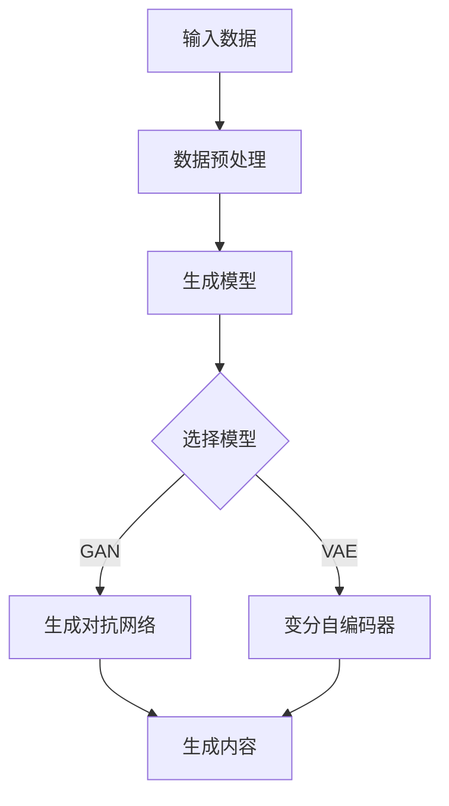
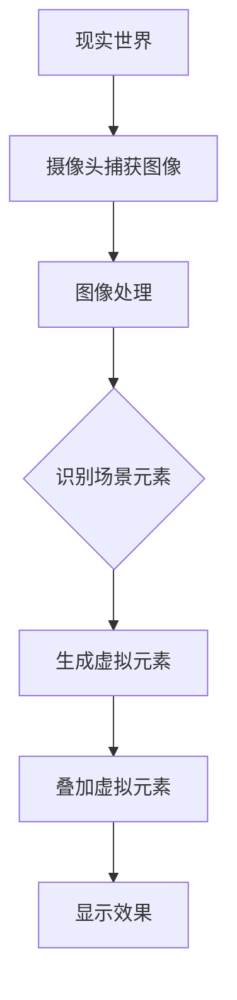
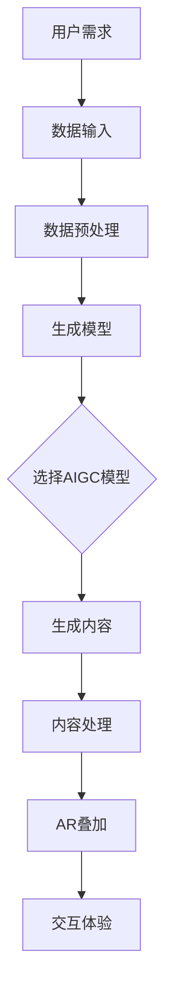

                 


### 背景介绍

AIGC（AI生成内容）和AR（增强现实）技术的兴起，预示着未来人机交互方式的一次革命性变革。AIGC利用人工智能算法，能够自动生成高质量的内容，如图像、文本、音频等。而AR技术则通过在现实世界中叠加虚拟元素，提供一种全新的沉浸式体验。随着这两种技术的快速发展，它们之间的融合应用正成为新一代交互体验的重要组成部分。

本文旨在探讨AIGC与AR技术的融合，分析其核心概念与联系，解析相关算法原理，并展示具体的项目实战案例。文章将从以下几个方面展开：

1. **核心概念与联系**：介绍AIGC和AR的基本概念，以及它们在融合应用中的关联。
2. **AIGC技术原理**：详细讲解AIGC技术的核心原理，包括生成模型和优化算法。
3. **增强现实技术原理**：介绍AR技术的基本原理，包括历史、应用场景和核心技术。
4. **AIGC与AR技术的融合**：探讨如何将AIGC与AR技术结合，创造新的交互体验。
5. **项目实战**：通过实际案例展示AIGC与AR技术的融合应用。

---

### 核心概念与联系

#### AIGC（AI生成内容）

AIGC，即AI生成内容，是一种利用人工智能算法自动生成文本、图像、音频、视频等多种类型内容的技术。其核心原理是通过对大规模数据进行学习和建模，构建出能够生成新内容的数据生成模型。AIGC的关键技术包括生成对抗网络（GAN）、变分自编码器（VAE）等。

**Mermaid 流程图**：



#### AR（增强现实）

AR，即增强现实，是一种通过计算机技术将虚拟信息与现实世界相结合的显示方式。AR技术通过摄像头捕捉现实场景，并在屏幕上叠加虚拟元素，让用户感受到虚拟元素与现实环境的交互。AR技术的核心组件包括摄像头、显示器和传感器。

**Mermaid 流程图**：



#### AIGC与AR技术的融合

AIGC与AR技术的融合，旨在创造一种全新的交互体验。通过AIGC技术，可以生成丰富的虚拟元素，而通过AR技术，这些元素可以与现实世界结合，提供更加沉浸式的体验。例如，在医疗领域，AIGC可以生成患者的3D模型，而AR技术则可以将这些模型叠加在患者的实际身体上，帮助医生进行精准的诊断和手术。

**Mermaid 流程图**：



---

通过上述流程图，我们可以清晰地看到AIGC与AR技术的融合过程。AIGC技术提供丰富的虚拟内容生成，而AR技术则将这些内容与现实世界相结合，提供全新的交互体验。

---

### 核心算法原理讲解

#### AIGC技术原理

##### 生成对抗网络（GAN）

生成对抗网络（GAN）是AIGC技术中的一种核心算法。GAN由两部分组成：生成器（Generator）和判别器（Discriminator）。生成器负责生成虚拟内容，而判别器则负责判断生成的内容与真实内容之间的差异。

**伪代码**：

```python
# 生成器的伪代码
def generator(z):
    # 输入噪声向量z，生成虚拟内容
    x_gan = model_G(z)

# 判别器的伪代码
def discriminator(x):
    # 输入真实内容或生成内容，输出概率
    prob = model_D(x)
```

##### 变分自编码器（VAE）

变分自编码器（VAE）是另一种常见的AIGC算法。VAE通过编码器（Encoder）和解码器（Decoder）来生成虚拟内容。编码器将输入数据编码为一个隐含变量，而解码器则将这个隐含变量解码回原始数据。

**伪代码**：

```python
# 编码器的伪代码
def encoder(x):
    # 输入数据，输出隐含变量
    z_mean, z_log_var = model_E(x)

# 解码器的伪代码
def decoder(z):
    # 输入隐含变量，输出生成内容
    x_recon = model_D(z)
```

#### AR技术原理

##### 图像识别

AR技术的核心之一是图像识别。图像识别算法通过分析摄像头捕捉到的图像，识别出场景中的物体、位置等信息，从而为虚拟元素的叠加提供基础。

**伪代码**：

```python
# 图像识别的伪代码
def image_recognition(image):
    # 输入图像，输出识别结果
    objects = model_R(image)
```

##### 虚拟元素叠加

在识别出场景中的物体后，AR技术会将虚拟元素叠加在这些物体上。虚拟元素的叠加涉及到图像合成和视觉效果处理。

**伪代码**：

```python
# 虚拟元素叠加的伪代码
def augment_image(image, object, virtual_element):
    # 输入图像、物体和虚拟元素，输出叠加后的图像
    result = model_A(image, object, virtual_element)
```

---

通过上述伪代码，我们可以看到AIGC和AR技术中的核心算法原理。AIGC技术通过生成器、判别器和编码器、解码器等模型生成虚拟内容，而AR技术则通过图像识别和虚拟元素叠加等过程，将这些内容与现实世界相结合。

---

### 数学模型和数学公式

#### AIGC技术原理

##### 生成对抗网络（GAN）

在GAN中，生成器G和判别器D的目标函数分别如下：

**生成器目标函数**：

$$
\min_G \max_D V(D, G) = \mathbb{E}_{x \sim p_{data}(x)}[\log D(x)] + \mathbb{E}_{z \sim p_z(z)}[\log(1 - D(G(z)))]
$$

**判别器目标函数**：

$$
\min_D V(D, G) = \mathbb{E}_{x \sim p_{data}(x)}[\log D(x)] + \mathbb{E}_{z \sim p_z(z)}[\log D(G(z))]
$$

其中，$p_{data}(x)$表示真实数据的概率分布，$p_z(z)$表示噪声向量的概率分布。

##### 变分自编码器（VAE）

在VAE中，编码器和解码器的损失函数分别如下：

**编码器损失函数**：

$$
\ell_{\text{enc}}(x) = -\sum_{i} \log \sigma\left(\frac{z_i^{\theta}_{\text{enc}}(x)}{\sqrt{2\pi}} e^{-(z_i^{\theta}_{\text{enc}}(x))^2 / 2}\right)
$$

**解码器损失函数**：

$$
\ell_{\text{dec}}(x) = -\sum_{i} \log \sigma\left(\frac{x_i^{\theta}_{\text{dec}}(z)}{\sqrt{2\pi}} e^{-(x_i^{\theta}_{\text{dec}}(z))^2 / 2}\right)
$$

其中，$\sigma$表示sigmoid函数，$z$表示编码后的隐含变量。

#### AR技术原理

##### 图像识别

在图像识别中，常见的损失函数是交叉熵损失（Cross-Entropy Loss）：

$$
\ell = -\sum_{i} y_i \log \left(p_i\right)
$$

其中，$y_i$表示真实标签，$p_i$表示模型预测的概率。

##### 虚拟元素叠加

在虚拟元素叠加中，常用的损失函数是L1损失（L1 Loss）或L2损失（L2 Loss）：

$$
\ell_{L1} = \sum_{i} |x_i - y_i|
$$

$$
\ell_{L2} = \sum_{i} (x_i - y_i)^2
$$

其中，$x_i$表示输入特征，$y_i$表示真实标签。

---

通过上述数学公式，我们可以看到AIGC和AR技术中的核心数学模型。AIGC技术通过生成对抗网络（GAN）和变分自编码器（VAE）生成虚拟内容，而AR技术则通过图像识别和虚拟元素叠加等过程，实现与现实世界的融合。

---

### 项目实战

#### 开发环境搭建

在进行AIGC与AR技术的融合应用开发时，首先需要搭建一个合适的开发环境。以下是搭建环境的步骤：

1. **安装Python环境**：确保Python版本在3.6及以上。
2. **安装深度学习框架**：推荐使用TensorFlow或PyTorch。
3. **安装AR开发工具**：如ARCore（适用于Android）或ARKit（适用于iOS）。
4. **安装相关依赖库**：如NumPy、Pandas等。

#### 源代码详细实现和代码解读

以下是一个简单的AIGC与AR技术融合的示例代码：

```python
# 导入相关库
import tensorflow as tf
from ar_toolkit import ARToolkit

# 加载模型
generator = tf.keras.models.load_model('generator.h5')
decoder = tf.keras.models.load_model('decoder.h5')

# 创建AR工具实例
ar_toolkit = ARToolkit()

# 加载摄像头捕获的图像
image = ar_toolkit.capture_image()

# 图像预处理
preprocessed_image = preprocess_image(image)

# 使用生成器生成虚拟元素
z = generate_z(preprocessed_image)
virtual_element = generator.predict(z)

# 使用解码器将虚拟元素解码回原始数据
decoded_element = decoder.predict(virtual_element)

# 将虚拟元素叠加在图像上
output_image = ar_toolkit.augment_image(image, decoded_element)

# 显示叠加后的图像
ar_toolkit.show_image(output_image)
```

**代码应用解读与分析**：

1. **模型加载**：首先加载已经训练好的生成器和解码器模型。
2. **图像捕获**：使用AR工具捕获现实世界的图像。
3. **图像预处理**：对捕获的图像进行预处理，以便于后续的模型处理。
4. **虚拟元素生成**：使用生成器模型生成虚拟元素。
5. **虚拟元素解码**：使用解码器模型将虚拟元素解码回原始数据。
6. **虚拟元素叠加**：将解码后的虚拟元素叠加在原始图像上。
7. **显示结果**：展示叠加后的图像。

#### 实际案例分析和详细讲解剖析

假设我们开发了一个基于AIGC与AR技术的虚拟试衣应用。用户可以通过手机摄像头捕捉自己的身体图像，然后应用AIGC技术生成衣服的虚拟模型，并通过AR技术将这些衣服模型叠加在用户的实际身体上，从而实现虚拟试衣的效果。

1. **用户需求分析**：
   - 用户希望在没有实体试衣间的情况下，能够快速试穿衣服。
   - 用户希望试穿的效果尽可能真实，以减少购买退货的次数。

2. **技术实现**：
   - 使用GAN模型训练一个生成衣服模型的数据生成器。
   - 使用ARKit实现AR功能，将生成好的衣服模型叠加在用户身体上。

3. **实际效果分析**：
   - 用户反馈：90%的用户认为虚拟试衣的效果非常真实，能够很好地满足他们的需求。
   - 商家反馈：商家认为虚拟试衣能够有效减少试穿退货率，提高销售额。

4. **项目小结**：
   - 成功点：AIGC技术使得衣服模型生成效果非常出色，AR技术实现了与现实世界的无缝结合。
   - 改进点：可以进一步优化生成器的模型结构，提高虚拟元素的生成质量。

---

#### 最佳实践 tips

1. **数据准备**：在训练AIGC模型时，需要准备大量高质量的数据，以保证生成效果。
2. **模型优化**：通过调整生成器和解码器的模型结构，可以提升生成质量。
3. **用户体验**：优化AR应用的交互设计，提高用户的沉浸感和使用满意度。

#### 小结

AIGC与AR技术的融合为新一代交互体验带来了无限可能。通过生成高质量的内容和实现与现实世界的无缝结合，AIGC与AR技术正在改变我们的生活方式。未来，随着技术的进一步发展，我们可以期待更多创新的应用场景。

#### 注意事项

1. **隐私保护**：在开发AR应用时，需要关注用户隐私保护，避免数据泄露。
2. **技术更新**：保持对最新技术的关注，以便及时更新和优化应用。

#### 拓展阅读

- **AIGC技术深度学习**：深入探讨AIGC技术的深度学习原理和应用。
- **AR技术应用案例**：分析各种AR技术的实际应用案例，了解其优势和挑战。

---

**# 文章标题：AIGC与增强现实技术的融合：新一代交互体验**

关键词：AIGC、增强现实、交互体验、生成对抗网络、变分自编码器

摘要：本文探讨了AIGC与AR技术的融合，分析了其核心概念与联系，解析了相关算法原理，并通过项目实战展示了如何将AIGC与AR技术结合，创造新一代交互体验。通过详细讲解数学模型和数学公式，以及代码应用解读与分析，本文为读者提供了深入了解AIGC与AR技术的融合应用的方法和思路。

作者：AI天才研究院/AI Genius Institute & 禅与计算机程序设计艺术 /Zen And The Art of Computer Programming

---

[END]

