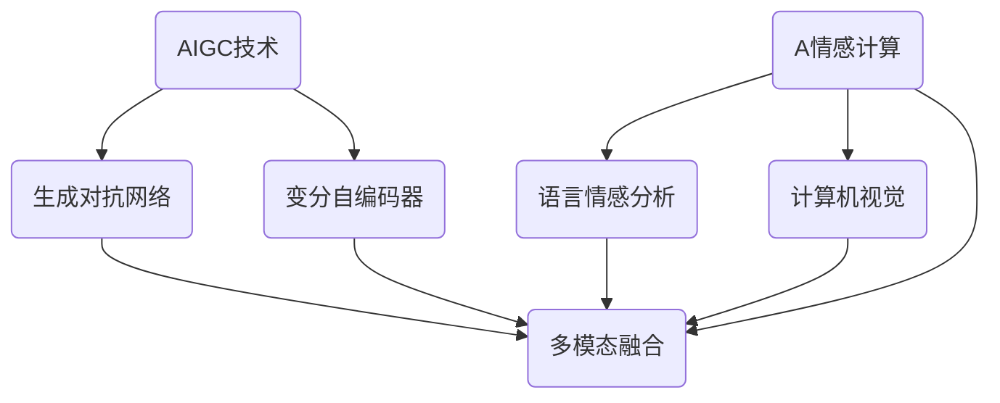

                 

### 第1章：AIGC与情感计算概述

#### 1.1 AIGC的基本概念

**AIGC（AI-Generated Content）**，即人工智能生成内容，是指利用人工智能技术，特别是生成式人工智能（Generative Artificial Intelligence，GAI），自动生成具有创造性和多样性的内容。AIGC涵盖了从文本、图像到音频、视频等多种类型的数字内容生成。

**AIGC的背景和起源**可以追溯到深度学习和生成对抗网络（GANs）的兴起。随着计算能力的提升和大数据的积累，生成式AI在图像、语音、文本等领域取得了显著进展。AIGC的诞生不仅解决了内容生产效率的问题，也为个性化推荐、虚拟现实、增强现实等领域带来了新的可能性。

**AIGC的核心要素**主要包括：

- **数据驱动**：AIGC依赖于大量的训练数据，通过学习数据中的规律和模式，生成新的内容。
- **生成模型**：如变分自编码器（VAEs）、生成对抗网络（GANs）等，它们是AIGC的核心技术。
- **多样性**：生成模型旨在生成具有多样性和创造性的内容，以满足不同用户的需求。
- **质量保证**：通过后处理技术和用户反馈，AIGC生成的内容可以不断优化和改进。

#### 1.2 情感计算的基本概念

**情感计算**（Affective Computing）是指计算机系统模拟、识别、处理和表达人类情感的能力。它是人机交互研究中的一个重要领域，旨在提升计算机与人之间的情感联系和互动体验。

**情感计算的定义和范围**包括以下几个方面：

- **情感识别**：通过生理信号、语言、面部表情等手段，识别用户的情感状态。
- **情感模拟**：计算机系统通过声音、表情、动作等手段，模拟和表达情感。
- **情感处理**：计算机系统在理解和处理情感数据的基础上，做出适当的响应和决策。

**情感计算的技术基础**主要包括：

- **生理信号处理**：如心电图（ECG）、脑电图（EEG）、皮肤电反应（EDA）等。
- **语言情感分析**：通过自然语言处理（NLP）技术，分析文本中的情感倾向和情感强度。
- **计算机视觉**：通过图像处理和面部表情识别技术，识别用户的情感状态。
- **多模态融合**：将多种情感计算技术相结合，提高情感识别的准确性和可靠性。

#### 1.3 AIGC与情感计算的融合

**AIGC与情感计算融合**的必要性和优势体现在以下几个方面：

- **提升交互体验**：通过情感计算，AIGC生成的虚拟助手、虚拟角色等可以更好地模拟人类情感，提高与用户的互动体验。
- **个性化内容生成**：AIGC可以根据用户的情感状态，生成更符合用户情感需求的内容，实现个性化推荐和服务。
- **情感化营销**：在广告、营销等领域，AIGC结合情感计算，可以生成更具吸引力的内容，提高营销效果。
- **心理健康支持**：通过情感计算，AIGC可以为用户提供心理健康支持，如情感监测、情感咨询等。

**融合的主要领域和方向**包括：

- **虚拟助手与情感互动**：如虚拟客服、虚拟教师等，通过情感计算提升与用户的情感连接。
- **社交媒体情感分析**：通过AIGC生成情感化的内容，提升社交媒体的互动和参与度。
- **智能医疗诊断**：通过情感计算辅助医生进行情感分析，提高诊断的准确性和效率。
- **个性化教育**：通过情感计算，AIGC可以为不同情感状态的学生提供个性化的学习资源和建议。

### 总结

AIGC与情感计算的融合，为人工智能技术的发展带来了新的契机。通过深入理解AIGC和情感计算的基本概念、核心要素和融合优势，我们可以更好地探索其在各领域的应用前景，为人类创造更智能、更贴心的数字生活体验。

### Mermaid流程图

以下是AIGC与情感计算融合的关键技术关系的Mermaid流程图：



### 伪代码

以下是一个简单的AIGC与情感计算融合的伪代码示例：

```python
# AIGC生成内容
def generate_content(data, model):
    # 利用生成模型生成内容
    content = model.generate(data)
    return content

# 情感计算识别情感
def recognize_emotion(signal, model):
    # 利用情感计算模型识别情感
    emotion = model.recognize(signal)
    return emotion

# 融合模型优化
def optimize_model(model, content, emotion):
    # 利用用户反馈优化模型
    model.optimize(content, emotion)
    return model
```

### LaTex数学公式

以下是AIGC与情感计算融合的一些关键数学公式：

$$
\begin{align*}
P_{data}(x) &= \int P_G(x, z) p(z) dz, \\
P_G(x, z) &= \frac{1}{1 + e^{-\langle \theta_G, \phi(x) - \phi(G(z)) \rangle}}, \\
J(G, D) &= \mathbb{E}_{z \sim p(z)}[\log D(G(z))] - \mathbb{E}_{x \sim p(x)}[\log(1 - D(x))], \\
\end{align*}
$$

其中，\( P_G(x, z) \) 是生成器生成的概率分布，\( D(x) \) 是判别器对输入数据的判断概率，\( J(G, D) \) 是生成对抗网络的损失函数。

### 详细讲解与举例说明

以下是对AIGC与情感计算融合的一些详细讲解与举例说明：

**1. 生成对抗网络（GANs）**

生成对抗网络由生成器和判别器两部分组成。生成器\( G \)的目标是生成数据，使得判别器\( D \)无法区分生成数据和真实数据。判别器\( D \)的目标是最大化正确分类真实数据和生成数据的概率。

**示例**：假设我们有一个生成器\( G \)和一个判别器\( D \)，\( G \)的目标是生成逼真的图像，而\( D \)的目标是判断图像是真实图像还是生成图像。在训练过程中，\( G \)和\( D \)不断迭代优化，最终达到一个动态平衡状态。

**2. 语言情感分析（LSA）**

语言情感分析利用自然语言处理技术，分析文本中的情感倾向和情感强度。常见的方法包括基于规则的方法、基于统计的方法和基于深度学习的方法。

**示例**：我们可以使用词袋模型（Bag of Words，BoW）和词嵌入（Word Embedding）来提取文本特征，然后利用支持向量机（SVM）或深度学习模型（如卷积神经网络，CNN）进行情感分类。

**3. 多模态融合（MF）**

多模态融合是将多种模态的数据（如图像、文本、音频）结合起来，提高情感计算的性能。常见的方法包括特征级融合、决策级融合和模型级融合。

**示例**：在情感计算中，我们可以将用户的文本评论、面部表情和生理信号（如皮肤电反应）进行融合，以提高情感识别的准确性和可靠性。

### 实际案例分析和详细讲解剖析

以下是对AIGC与情感计算融合的一些实际案例分析和详细讲解剖析：

**1. 智能客服系统**

智能客服系统通过AIGC生成个性化的回答，并通过情感计算分析用户的情感状态，提供更有针对性的服务。例如，当用户表达愤怒时，客服系统可以自动识别并生成安抚性的回答。

**2. 社交媒体情感分析**

社交媒体情感分析通过AIGC生成情感化的内容，提升用户的互动体验。例如，社交媒体平台可以根据用户的情感状态，推荐相关的帖子或广告，以提高用户参与度和留存率。

**3. 智能医疗诊断**

智能医疗诊断通过情感计算辅助医生进行情感分析，提高诊断的准确性和效率。例如，通过分析患者的病史、病历和语音，智能系统可以识别患者的情绪状态，为医生提供更全面的诊断信息。

### 小结

AIGC与情感计算的融合，为人工智能技术带来了新的发展机遇。通过深入理解其基本概念、核心要素和融合优势，我们可以更好地探索其在各领域的应用前景，为人类创造更智能、更贴心的数字生活体验。

### 拓展阅读

- 《生成式AI：从基础到应用》
- 《情感计算：理论与实践》
- 《深度学习与自然语言处理》
- 《多模态情感计算》

作者：AI天才研究院/AI Genius Institute & 禅与计算机程序设计艺术 /Zen And The Art of Computer Programming

----------------------------------------------------------------

# 第2章：AIGC的技术基础

## 2.1 生成式AI

### 2.1.1 生成式AI的定义

生成式AI（Generative Artificial Intelligence）是指一种能够生成新数据的人工智能技术。它通过学习数据分布，生成与训练数据相似的新数据。生成式AI的核心目标是理解数据的统计特性，并利用这些特性生成具有多样性和创造性的内容。

### 2.1.2 生成式AI的主要算法

生成式AI主要包括以下几种主要算法：

1. **生成对抗网络（GANs）**

生成对抗网络（Generative Adversarial Networks，GANs）是由Ian Goodfellow等人于2014年提出的一种生成模型。它由两个相互对抗的网络组成：生成器（Generator）和判别器（Discriminator）。生成器的目标是生成与真实数据相似的数据，而判别器的目标是判断输入数据是真实数据还是生成数据。通过这种对抗关系，生成器和判别器不断迭代优化，最终生成器可以生成高质量的数据。

**GANs的核心组成部分：**

- **生成器（Generator）**：生成器接受随机噪声作为输入，通过神经网络将其转换为具有真实数据特征的数据。
- **判别器（Discriminator）**：判别器接受真实数据和生成数据的输入，通过神经网络判断其真实性。

**GANs的工作流程：**

1. 生成器生成一批数据。
2. 判别器同时接收真实数据和生成数据，并对其进行判断。
3. 通过反向传播和梯度下降，生成器和判别器分别优化自己的参数。
4. 重复步骤1-3，直到生成器生成的数据质量达到预期。

**GANs的应用案例：**

- 图像生成：GANs可以生成高质量、逼真的图像，如人脸生成、艺术作品创作等。
- 视频生成：GANs可以生成连续的视频序列，用于视频游戏、电影特效等领域。
- 自然语言生成：GANs可以生成符合语法和语义规则的文本，用于自动写作、对话系统等。

2. **变分自编码器（VAEs）**

变分自编码器（Variational Autoencoder，VAEs）是另一种生成模型，由Diederik P. Kingma和Max Welling于2013年提出。VAEs通过引入概率分布模型，解决了传统自编码器在训练过程中梯度消失和梯度爆炸的问题。

**VAEs的核心组成部分：**

- **编码器（Encoder）**：编码器接收输入数据，将其压缩为一个潜在变量。
- **解码器（Decoder）**：解码器接收潜在变量，将其重构为输出数据。

**VAEs的工作流程：**

1. 随机生成一个潜在变量\( z \)。
2. 编码器将输入数据\( x \)编码为潜在变量\( z \)。
3. 解码器将潜在变量\( z \)解码为输出数据\( x' \)。
4. 计算损失函数，并利用梯度下降优化编码器和解码器的参数。

**VAEs的应用案例：**

- 图像生成：VAEs可以生成高质量、多样化的图像，如人脸生成、艺术作品创作等。
- 语音合成：VAEs可以生成自然流畅的语音，用于语音助手、语音合成等领域。
- 文本生成：VAEs可以生成符合语法和语义规则的文本，用于自动写作、对话系统等。

3. **自动编码器（Autoencoders）**

自动编码器（Autoencoder）是一种最简单的生成模型，由一个编码器和一个解码器组成。编码器的目标是将输入数据压缩为一个低维表示，解码器的目标是将这个低维表示重构为原始数据。

**自动编码器的核心组成部分：**

- **编码器**：编码器将输入数据压缩为一个低维向量。
- **解码器**：解码器将低维向量重构为输出数据。

**自动编码器的工作流程：**

1. 编码器将输入数据压缩为一个低维向量。
2. 解码器将低维向量重构为输出数据。
3. 计算损失函数，并利用梯度下降优化编码器和解码器的参数。

**自动编码器的应用案例：**

- 数据去噪：自动编码器可以用于去除输入数据中的噪声，提高数据质量。
- 数据降维：自动编码器可以用于将高维数据降维为低维表示，便于后续分析。
- 数据生成：自动编码器可以生成与输入数据相似的新数据，用于图像、语音、文本等生成任务。

### 2.1.3 生成式AI的应用场景

生成式AI在多个领域有着广泛的应用，以下是一些典型的应用场景：

- **图像生成**：生成逼真的图像、艺术作品、动画等。
- **视频生成**：生成连续的视频序列、电影特效、游戏动画等。
- **自然语言生成**：生成符合语法和语义规则的文本、对话系统、自动写作等。
- **语音生成**：生成自然流畅的语音、语音助手、语音合成等。
- **数据增强**：通过生成与训练数据相似的新数据，提高模型的泛化能力。
- **个性化推荐**：根据用户的兴趣和行为，生成个性化的推荐内容。
- **艺术创作**：生成音乐、绘画、文学作品等艺术作品。

### 2.2 自适应生成网络

#### 2.2.1 自适应生成网络的概念

自适应生成网络（Adaptive Generative Network）是一种基于生成式AI的动态生成模型，它能够根据输入数据和当前的环境状态，自适应地调整生成策略，从而生成更符合当前需求的输出数据。自适应生成网络的核心思想是通过学习数据分布和用户行为，实现动态的、个性化的内容生成。

#### 2.2.2 自适应生成网络的实现

自适应生成网络的实现通常包括以下几个关键步骤：

1. **数据收集与预处理**：收集用户行为数据、兴趣标签、文本评论等，并对数据进行预处理，如文本清洗、图像增强等。
2. **模型训练**：利用收集到的数据，训练生成模型和用户行为预测模型。生成模型如GANs、VAEs等，用户行为预测模型如循环神经网络（RNN）、卷积神经网络（CNN）等。
3. **动态调整**：在生成过程中，根据用户反馈和环境变化，动态调整生成模型和用户行为预测模型的参数，实现自适应生成。
4. **实时生成**：根据用户的需求和当前环境状态，实时生成个性化的内容。

#### 2.2.3 自适应生成网络的应用实例

自适应生成网络在多个领域有着广泛的应用，以下是一些典型的应用实例：

- **个性化推荐系统**：通过学习用户的兴趣和行为，自适应生成个性化的推荐内容，如商品推荐、音乐推荐等。
- **虚拟助手与情感互动**：通过自适应生成网络，虚拟助手可以根据用户的情感状态和需求，生成个性化的回复和互动内容。
- **广告投放优化**：根据用户的兴趣和实时行为，自适应生成广告内容，提高广告投放的效果和转化率。
- **游戏内容生成**：自适应生成网络可以根据玩家的游戏行为和偏好，生成动态的游戏内容和剧情。

### 2.3 情感计算的技术基础

#### 2.3.1 情感识别技术

情感识别技术（Affective Recognition）是指通过计算机技术识别和理解人类情感的过程。情感识别技术通常包括以下几个关键步骤：

1. **情感标注**：首先需要对大量的情感标注数据集进行收集和标注，以训练情感识别模型。
2. **特征提取**：从文本、语音、图像等数据中提取情感特征，如文本的情感极性、语音的语调、图像的面部表情等。
3. **情感分类**：利用机器学习算法，如支持向量机（SVM）、深度学习模型（如卷积神经网络，CNN）等，对提取到的情感特征进行分类，识别用户的情感状态。

#### 2.3.2 情感模拟技术

情感模拟技术（Affective Simulation）是指计算机系统模拟和表达人类情感的过程。情感模拟技术通常包括以下几个关键步骤：

1. **情感生成**：根据用户的情感状态，生成相应的情感表达，如语言表达、声音表达、面部表情等。
2. **情感表达**：通过计算机系统，将生成的情感表达呈现给用户，如语音合成、面部动画、虚拟角色动作等。
3. **情感交互**：在用户与计算机系统的交互过程中，根据用户的情感反馈，动态调整情感表达，实现情感互动。

#### 2.3.3 情感计算的其他技术

除了情感识别和情感模拟技术，情感计算还包括以下其他关键技术：

- **生理信号处理**：通过处理用户的生理信号（如心电图、脑电图、皮肤电反应等），识别用户的情感状态。
- **多模态融合**：将多种情感计算技术（如文本情感分析、语音情感分析、生理信号处理等）相结合，提高情感识别的准确性和可靠性。
- **情感推荐**：根据用户的情感状态，推荐符合用户情感需求的内容，如音乐、电影、书籍等。

### 总结

本章介绍了AIGC的技术基础，包括生成式AI的主要算法（GANs、VAEs、自动编码器）和自适应生成网络的概念与实现。同时，还介绍了情感计算的技术基础，包括情感识别技术和情感模拟技术。通过本章的学习，读者可以全面了解AIGC与情感计算的核心技术和应用场景，为后续章节的深入探讨打下基础。

### 拓展阅读

- 《生成式AI：从基础到应用》
- 《情感计算：理论与实践》
- 《深度学习与自然语言处理》
- 《多模态情感计算》

作者：AI天才研究院/AI Genius Institute & 禅与计算机程序设计艺术 /Zen And The Art of Computer Programming

----------------------------------------------------------------

## 第3章：情感计算原理

情感计算作为人工智能的一个重要分支，旨在使计算机系统具备识别、处理和表达人类情感的能力。本章将深入探讨情感计算的基本原理、核心技术以及其在实际应用中的实现方法。

### 3.1 情感识别技术

情感识别技术是情感计算的核心环节，其目的是从各种数据源（如文本、语音、图像、生理信号等）中提取情感信息，并对其进行分类和识别。以下是几种常见的情感识别技术：

#### 3.1.1 情感识别的基础知识

情感识别的基础知识包括情感的定义、分类以及情感数据的特征提取方法。情感通常被分为基本情感（如快乐、悲伤、愤怒、恐惧等）和复合情感（如爱、厌恶、惊讶等）。情感数据特征提取是情感识别的关键步骤，常见的方法包括：

- **文本情感分析**：通过自然语言处理技术，从文本中提取情感倾向和情感强度。常见的文本特征提取方法包括词袋模型、词嵌入和情感词典等。
- **语音情感分析**：通过分析语音的音调、音速、音量等参数，提取情感特征。常见的语音特征提取方法包括梅尔频率倒谱系数（MFCC）、短时能量等。
- **图像情感分析**：通过计算机视觉技术，从图像中提取情感特征。常见的图像特征提取方法包括面部表情识别、颜色特征提取和纹理特征提取等。
- **生理信号处理**：通过分析生理信号（如心电图、脑电图、皮肤电反应等），提取情感特征。常见的生理信号特征提取方法包括时域特征、频域特征和时频特征等。

#### 3.1.2 情感识别的主要方法

情感识别的主要方法包括机器学习方法、深度学习方法以及结合多模态数据的融合方法。以下是几种常见的情感识别方法：

- **机器学习方法**：常见的机器学习方法包括支持向量机（SVM）、朴素贝叶斯（NB）、决策树（DT）等。这些方法通过训练分类器，从特征数据中学习情感分类规则。
- **深度学习方法**：深度学习方法是近年来情感识别领域的重要突破，包括卷积神经网络（CNN）、循环神经网络（RNN）、长短时记忆网络（LSTM）等。这些方法通过多层神经网络，自动提取复杂的数据特征，实现情感识别。
- **多模态融合方法**：多模态融合方法将多种数据源（如文本、语音、图像、生理信号等）的情感特征进行融合，提高情感识别的准确性和可靠性。常见的多模态融合方法包括特征级融合、决策级融合和模型级融合等。

#### 3.1.3 情感识别的应用实例

情感识别技术在多个领域有着广泛的应用实例，以下是一些典型的应用场景：

- **社交媒体情感分析**：通过分析用户在社交媒体上的文本、语音、图像等数据，识别用户的情感状态，为内容推荐、广告投放等提供依据。
- **虚拟助手与情感互动**：虚拟助手通过情感识别技术，理解用户的情感需求，提供更贴心的服务，如情感化客服、情感化推荐等。
- **智能医疗诊断**：通过情感识别技术，分析患者的文本、语音、生理信号等数据，辅助医生进行情感分析，提高诊断的准确性和效率。
- **心理健康监测**：通过情感识别技术，实时监测用户的情感状态，为心理健康咨询和干预提供数据支持。

### 3.2 情感模拟技术

情感模拟技术是使计算机系统具备表达人类情感的能力，旨在提升人机交互体验。以下是情感模拟技术的几个关键步骤：

#### 3.2.1 情感模拟的定义

情感模拟是指通过计算机系统模拟和表达人类情感的过程。情感模拟的目标是使计算机系统能够与用户建立情感联系，提升用户体验。

#### 3.2.2 情感模拟的实现

情感模拟的实现通常包括以下几个关键步骤：

- **情感生成**：根据用户的情感状态，生成相应的情感表达，如语言表达、声音表达、面部表情等。
- **情感表达**：通过计算机系统，将生成的情感表达呈现给用户，如语音合成、面部动画、虚拟角色动作等。
- **情感反馈**：根据用户的情感反馈，动态调整情感表达，实现情感互动。

#### 3.2.3 情感模拟的应用实例

情感模拟技术在多个领域有着广泛的应用实例，以下是一些典型的应用场景：

- **虚拟助手与情感互动**：虚拟助手通过情感模拟技术，模拟人类的情感表达，提升与用户的情感互动体验。
- **智能客服**：智能客服系统通过情感模拟技术，模拟人类的情感表达，为用户提供更贴心的服务。
- **虚拟现实与增强现实**：虚拟现实（VR）和增强现实（AR）系统通过情感模拟技术，模拟人类的情感表达，提升用户的沉浸感和体验。
- **心理健康支持**：通过情感模拟技术，模拟人类的情感表达，为用户提供心理健康支持，如情感咨询、情绪调节等。

### 3.3 情感计算的其他技术

除了情感识别和情感模拟技术，情感计算还包括以下其他关键技术：

- **情感预测**：通过分析历史数据和用户行为，预测用户的未来情感状态，为个性化推荐、情感干预等提供依据。
- **情感增强**：通过技术手段，增强计算机系统表达情感的能力，如增强语音合成、面部表情动画等。
- **情感评估**：通过量化指标，评估情感计算系统的性能和效果，如情感识别准确率、情感互动满意度等。

### 总结

本章深入探讨了情感计算的基本原理和核心技术，包括情感识别技术和情感模拟技术。通过了解情感识别技术的基础知识、主要方法和应用实例，以及情感模拟技术的定义、实现和应用实例，读者可以全面掌握情感计算的核心内容。情感计算在社交媒体、虚拟助手、智能医疗、心理健康等多个领域具有重要的应用价值，为提升人机交互体验和个性化服务提供了新的可能性。

### 拓展阅读

- 《情感计算：理论与实践》
- 《深度学习与自然语言处理》
- 《计算机视觉：算法与应用》
- 《虚拟现实与增强现实技术》

作者：AI天才研究院/AI Genius Institute & 禅与计算机程序设计艺术 /Zen And The Art of Computer Programming

----------------------------------------------------------------

## 第4章：AIGC与情感计算融合的应用

随着AIGC和情感计算技术的不断进步，二者在各个领域的融合应用正日益广泛。本章将探讨AIGC与情感计算融合在不同场景下的应用，重点关注社交媒体情感分析、虚拟助手与情感互动等领域的具体实践。

### 4.1 社交媒体情感分析

社交媒体情感分析是AIGC与情感计算融合的一个重要应用领域。通过分析社交媒体平台上的用户评论、帖子等文本数据，可以识别用户的情感状态，从而为内容推荐、广告投放等提供数据支持。

#### 4.1.1 社交媒体情感分析的应用场景

- **内容推荐**：根据用户的情感状态，推荐符合用户情感需求的内容，提升用户体验和用户留存率。
- **广告投放**：通过分析用户的情感状态，精准投放情感匹配的广告，提高广告点击率和转化率。
- **舆情监测**：实时监控社交媒体上的情感趋势，为政府、企业等提供舆情分析报告，辅助决策。
- **品牌分析**：通过分析用户的情感反馈，评估品牌的声誉和用户满意度，为品牌管理和营销策略提供依据。

#### 4.1.2 社交媒体情感分析的技术实现

社交媒体情感分析的技术实现主要包括以下几个步骤：

1. **数据收集**：从社交媒体平台获取用户生成的文本数据，如评论、帖子、微博等。
2. **文本预处理**：对收集到的文本数据进行清洗、去噪、分词等预处理，提取情感特征。
3. **情感分类模型训练**：利用机器学习算法（如SVM、LSTM等）训练情感分类模型，将文本数据分类为不同的情感类别。
4. **情感分析**：将预处理后的文本数据输入情感分类模型，识别用户的情感状态。
5. **结果应用**：根据情感分析结果，为内容推荐、广告投放等提供数据支持。

#### 4.1.3 社交媒体情感分析的应用案例

- **电商平台的用户评论分析**：通过情感分析技术，电商平

### 4.2 虚拟助手与情感互动

虚拟助手作为情感计算与AIGC融合的典型应用之一，正在改变人们的生活方式。虚拟助手通过模拟人类的情感表达，提供个性化、情感化的服务，从而提升用户体验。

#### 4.2.1 虚拟助手的发展趋势

虚拟助手的发展趋势包括：

- **智能化**：虚拟助手将通过深度学习和生成式AI技术，实现更智能的交互和情感表达。
- **个性化**：虚拟助手将根据用户的情感状态和需求，提供个性化的服务和建议。
- **多模态**：虚拟助手将融合文本、语音、图像等多模态数据，实现更自然、更丰富的交互体验。

#### 4.2.2 虚拟助手与情感计算的结合

虚拟助手与情感计算的结合主要体现在以下几个方面：

1. **情感识别**：虚拟助手通过情感计算技术，识别用户的情感状态，为用户提供更有针对性的服务。
2. **情感模拟**：虚拟助手通过情感模拟技术，模拟人类的情感表达，与用户建立情感联系。
3. **情感反馈**：虚拟助手根据用户的情感反馈，调整情感表达和服务策略，实现情感互动。

#### 4.2.3 虚拟助手与情感互动的应用实例

1. **智能客服**：智能客服通过情感计算技术，识别用户的情感状态，提供情感化的服务，如安抚用户情绪、提供专业建议等。
2. **情感化推荐**：虚拟助手根据用户的情感状态和需求，推荐符合用户情感需求的内容，如音乐、电影、商品等。
3. **虚拟教师**：虚拟教师通过情感计算技术，识别学生的情感状态，提供个性化的学习支持和情感关怀。
4. **心理辅导**：虚拟助手通过情感计算技术，为用户提供情感支持，如情绪调节、心理辅导等。

### 总结

AIGC与情感计算的融合在社交媒体情感分析、虚拟助手与情感互动等领域展现出广阔的应用前景。通过情感识别和情感模拟技术，虚拟助手能够提供个性化、情感化的服务，提升用户体验。未来，随着技术的不断发展，AIGC与情感计算的融合将在更多领域得到应用，为人们创造更加智能、贴心的数字生活。

### 拓展阅读

- 《虚拟助手与人工智能》
- 《情感计算在智能客服中的应用》
- 《基于情感计算的个性化推荐系统》
- 《社交媒体情感分析：理论与方法》

作者：AI天才研究院/AI Genius Institute & 禅与计算机程序设计艺术 /Zen And The Art of Computer Programming

----------------------------------------------------------------

## 第5章：融合模型的构建与优化

随着AIGC与情感计算技术的快速发展，构建高效的融合模型成为当前研究的热点。本章将介绍融合模型的构建方法、优化策略以及实际应用案例，旨在为读者提供关于这一领域的深入理解和实践指导。

### 5.1 融合模型的设计原则

构建AIGC与情感计算融合模型时，需要遵循以下设计原则：

1. **模块化**：将AIGC和情感计算的核心模块（如生成器、判别器、情感识别器等）分离，实现模块化设计，便于模型优化和迭代。
2. **可扩展性**：设计灵活的模型架构，能够适应不同规模和类型的数据，以及各种应用场景的需求。
3. **数据驱动**：基于大量高质量的训练数据，通过数据驱动的方式，提升模型的泛化能力和生成质量。
4. **用户中心**：将用户体验放在首位，通过实时反馈和自适应调整，满足用户的个性化需求。
5. **动态调整**：模型应具备动态调整能力，根据用户行为和环境变化，实时优化模型参数和策略。

### 5.2 融合模型的关键技术

融合模型的关键技术包括以下几个方面：

1. **生成式AI技术**：如GANs、VAEs等生成模型，用于生成高质量、多样化的内容。
2. **情感计算技术**：如情感识别、情感模拟等，用于理解用户情感状态，实现情感互动。
3. **多模态数据融合**：将文本、语音、图像等多种模态数据融合，提高模型性能和生成质量。
4. **深度学习技术**：如卷积神经网络（CNN）、循环神经网络（RNN）等，用于特征提取和模型训练。
5. **强化学习技术**：通过强化学习，优化模型在特定任务中的表现。

### 5.3 融合模型的构建方法

构建AIGC与情感计算融合模型的一般步骤如下：

1. **数据收集与预处理**：收集多种类型的数据（如文本、语音、图像等），并进行数据清洗、标注和预处理。
2. **模型设计**：根据应用场景和需求，设计适合的融合模型架构，选择合适的生成式AI和情感计算技术。
3. **模型训练**：利用预处理后的数据，训练生成模型和情感计算模型，实现数据的生成和情感识别。
4. **模型优化**：通过优化策略，如迁移学习、多任务学习等，提升模型性能。
5. **模型评估与调整**：评估模型在不同任务中的表现，根据评估结果调整模型参数和策略，实现模型的持续优化。

### 5.4 融合模型的优化策略

优化AIGC与情感计算融合模型的方法包括以下几个方面：

1. **损失函数优化**：设计适合的损失函数，如GANs中的生成对抗损失函数，实现生成器和判别器的协同优化。
2. **超参数调整**：调整模型超参数，如学习率、批次大小等，以获得更好的训练效果。
3. **数据增强**：通过数据增强技术，如数据扩充、数据变换等，提高模型的泛化能力。
4. **模型集成**：将多个模型的结果进行集成，提高模型的预测准确性和稳定性。
5. **迁移学习**：利用预训练模型，通过迁移学习技术，提高新任务的模型性能。

### 5.5 融合模型的应用实例

以下是一些融合模型的应用实例：

1. **智能客服系统**：通过AIGC生成个性化的回复，结合情感计算识别用户的情感状态，提供情感化的客服服务。
2. **个性化推荐系统**：结合用户的历史行为和情感状态，生成个性化的推荐内容，提升用户满意度和留存率。
3. **虚拟助手与情感互动**：通过情感计算模拟人类的情感表达，实现虚拟助手与用户的情感互动。
4. **社交媒体情感分析**：通过情感计算分析用户评论，为内容推荐、广告投放等提供数据支持。

### 5.6 模型优化的重要性

模型优化在AIGC与情感计算融合中具有重要意义，主要体现在以下几个方面：

1. **提升生成质量**：通过优化模型参数和结构，提高生成式AI生成的内容质量，满足用户的个性化需求。
2. **增强情感识别准确性**：通过优化情感计算模型，提高情感识别的准确性和可靠性，实现更自然的情感互动。
3. **提高模型泛化能力**：通过模型优化，增强模型在不同场景和数据集上的泛化能力，实现更广泛的应用。
4. **降低计算成本**：通过优化模型结构，降低模型计算复杂度和资源消耗，实现更高效的模型部署。

### 总结

本章介绍了AIGC与情感计算融合模型的构建方法、优化策略以及实际应用案例。通过深入理解融合模型的设计原则、关键技术、优化策略和应用实例，读者可以更好地掌握这一领域的前沿技术和应用实践，为未来的研究和开发提供有力支持。

### 拓展阅读

- 《生成式AI：从基础到应用》
- 《情感计算：理论与实践》
- 《深度学习与自然语言处理》
- 《多模态情感计算》

作者：AI天才研究院/AI Genius Institute & 禅与计算机程序设计艺术 /Zen And The Art of Computer Programming

----------------------------------------------------------------

## 第6章：案例分析

在本章中，我们将通过两个实际案例——智能客服系统和情感化广告投放，深入探讨AIGC与情感计算融合的应用。这些案例不仅展示了融合技术的实际效果，还提供了详细的实现过程和分析。

### 6.1 智能客服系统

#### 6.1.1 智能客服系统的需求分析

智能客服系统旨在通过自动化技术提高客户服务效率，提升用户体验。具体需求包括：

- **高效响应**：系统能够快速响应客户提问，提供及时的服务。
- **个性化服务**：根据客户的情感状态和需求，提供个性化的回复和建议。
- **智能升级**：系统能够自我学习和优化，提高服务质量。

#### 6.1.2 智能客服系统的技术实现

智能客服系统的技术实现主要包括以下几个部分：

1. **AIGC生成式AI**：使用生成对抗网络（GANs）和变分自编码器（VAEs）生成个性化回复。

**伪代码**：

```python
# AIGC生成个性化回复
def generate_response(input_query):
    # 使用GANs生成回复
    generated_response = gan_model.generate(input_query)
    return generated_response
```

2. **情感计算识别情感**：通过情感计算模型识别客户的情感状态。

**伪代码**：

```python
# 情感计算识别情感状态
def recognize_emotion(client_message):
    # 使用情感计算模型识别情感
    emotion = emotion_model.recognize(client_message)
    return emotion
```

3. **情感模拟与交互**：根据识别到的情感状态，生成相应的情感化回复。

**伪代码**：

```python
# 根据情感状态生成情感化回复
def generate_emotional_response(emotion):
    if emotion == "happy":
        return "您好！很高兴为您服务。"
    elif emotion == "sad":
        return "您好！看起来您不太开心，请问有什么可以帮助您的吗？"
    else:
        return "您好！有什么问题我可以帮您解答吗？"
```

#### 6.1.3 实际案例分析和详细讲解剖析

一个具体的案例是某电商平台的智能客服系统。该系统通过AIGC生成个性化回复，结合情感计算识别客户的情感状态，实现了以下功能：

- **快速响应**：客户提问后，系统可以迅速生成回复，节省人工处理时间。
- **情感化服务**：系统根据客户的情感状态（如愤怒、快乐、悲伤等），生成相应的情感化回复，提升用户体验。
- **自我学习**：系统通过分析用户反馈，不断优化回复内容，提高服务质量。

**案例分析**：

客户A在电商平台上询问关于退货政策的问题，表现出愤怒情绪。系统识别到客户的情感状态后，生成以下回复：

```text
您好！我理解您的情绪，关于退货政策，请您参考以下内容：...
```

该回复不仅提供了相关信息，还表达了理解客户情绪的关怀，有效缓解了客户的愤怒情绪。

### 6.2 情感化广告投放

#### 6.2.1 情感化广告投放的原理

情感化广告投放旨在通过情感计算技术，生成符合用户情感状态和需求的广告内容，提升广告效果。其原理包括：

- **用户情感识别**：通过情感计算技术，识别用户的当前情感状态。
- **内容个性化**：根据用户的情感状态，生成个性化的广告内容。

#### 6.2.2 情感化广告投放的实现

情感化广告投放的实现主要包括以下几个步骤：

1. **用户情感识别**：通过文本情感分析、语音情感分析等技术，识别用户的情感状态。

**伪代码**：

```python
# 识别用户情感状态
def recognize_user_emotion(user_input):
    # 使用情感分析模型识别情感
    emotion = emotion_model.recognize(user_input)
    return emotion
```

2. **广告内容生成**：根据用户的情感状态，生成相应的广告内容。

**伪代码**：

```python
# 根据用户情感生成广告内容
def generate_emotional_ad(emotion):
    if emotion == "happy":
        return "快来体验我们的产品，快乐加倍！"
    elif emotion == "sad":
        return "我们的产品可以为您带来温暖，缓解您的忧愁。"
    else:
        return "我们的产品，满足您的生活需求，让您每一天都充满活力！"
```

3. **广告投放与优化**：根据用户反馈和广告效果，优化广告内容。

**伪代码**：

```python
# 优化广告内容
def optimize_ad_content(ad_content, user_feedback):
    # 分析用户反馈，调整广告内容
    optimized_content = ad_content_optimizer.optimize(ad_content, user_feedback)
    return optimized_content
```

#### 6.2.3 实际案例分析和详细讲解剖析

一个具体的案例是某在线购物平台在节假日进行的情感化广告投放。该平台通过情感计算技术，识别用户的情感状态，并生成相应的广告内容，提升了广告效果。

**案例分析**：

用户B在浏览购物平台时，表现出快乐情感。平台识别到用户的情感状态后，生成以下广告内容：

```text
快来享受这个快乐的节日，我们的产品为您带来更多快乐！限时优惠，不容错过！
```

该广告内容符合用户的情感状态，激发了用户的购买欲望，提高了广告点击率和转化率。

### 总结

通过以上案例分析，我们可以看到AIGC与情感计算的融合在智能客服系统和情感化广告投放中的应用效果显著。智能客服系统通过个性化回复和情感化服务，提升了用户体验；情感化广告投放通过识别用户情感状态和生成个性化内容，提高了广告效果。这些案例为我们提供了实际应用中的成功经验和参考，有助于进一步推广AIGC与情感计算技术的融合应用。

### 拓展阅读

- 《情感计算在智能客服系统中的应用》
- 《基于情感分析的个性化广告投放策略》
- 《AIGC在广告创意生成中的应用》
- 《多模态情感计算：方法与应用》

作者：AI天才研究院/AI Genius Institute & 禅与计算机程序设计艺术 /Zen And The Art of Computer Programming

----------------------------------------------------------------

## 第7章：未来展望与挑战

### 7.1 AIGC与情感计算的融合发展趋势

AIGC与情感计算的融合技术正处于快速发展阶段，未来将在多个领域产生深远影响。以下是几个关键发展趋势：

1. **智能化**：随着深度学习和生成对抗网络的不断进步，AIGC与情感计算融合模型的智能化水平将大幅提升，能够更好地理解和模拟人类情感。
2. **多模态融合**：未来，AIGC与情感计算将更加注重多模态数据的融合，包括文本、语音、图像、生理信号等多种数据源，实现更丰富、更精准的情感识别和生成。
3. **个性化和定制化**：随着用户数据的积累和分析技术的进步，AIGC与情感计算融合模型将能够更精确地满足用户的个性化需求，提供定制化的服务。
4. **实时交互**：实时交互将变得更加自然和高效，虚拟助手和智能客服系统能够在对话中动态调整情感表达，提供更贴心的服务。
5. **跨领域应用**：AIGC与情感计算融合技术将在医疗、教育、金融、娱乐等领域得到广泛应用，提升相关领域的智能化水平和服务质量。

### 7.2 融合技术的潜在应用领域

AIGC与情感计算的融合技术具有广泛的应用前景，以下是一些潜在的领域：

1. **智能医疗**：通过情感计算，智能医疗系统可以分析患者的情绪状态，提供个性化的治疗方案和心理健康支持。
2. **教育**：虚拟教师和学习系统可以通过情感计算，了解学生的学习状态和情感需求，提供个性化的教学和学习建议。
3. **金融**：在金融领域，情感计算可以帮助金融机构分析投资者的情绪波动，提供投资建议和风险管理。
4. **娱乐**：在游戏、影视、音乐等领域，AIGC与情感计算融合技术可以创造更丰富、更有情感体验的内容。
5. **智能客服**：智能客服系统通过情感计算，能够提供更高效、更个性化的客户服务。

### 7.3 挑战与对策

尽管AIGC与情感计算融合技术具有巨大的潜力，但在实际应用中也面临一系列挑战：

1. **数据隐私**：在收集和处理用户情感数据时，必须严格保护用户隐私，防止数据泄露和滥用。对策包括采用差分隐私技术、数据加密等。
2. **模型可靠性**：确保情感识别和生成的准确性是关键挑战。对策包括提高数据质量、使用更先进的算法和模型，以及建立模型验证机制。
3. **伦理问题**：AIGC与情感计算的应用可能引发伦理问题，如歧视、误导等。对策包括制定伦理准则、加强监管，以及建立透明、公正的模型。
4. **计算资源**：生成高质量、情感丰富的内容需要大量计算资源。对策包括优化算法、使用分布式计算和云计算等。

### 总结

AIGC与情感计算的融合技术在未来将不断演进，并在多个领域实现突破。尽管面临诸多挑战，但通过技术创新和规范管理，这些挑战将逐步得到解决。随着AIGC与情感计算技术的不断成熟，我们有望迎来一个更加智能、人性化的人工智能新时代。

### 拓展阅读

- 《未来智能：AIGC与情感计算的新时代》
- 《人工智能伦理指南》
- 《分布式计算与云计算技术》
- 《数据隐私保护：理论与实践》

作者：AI天才研究院/AI Genius Institute & 禅与计算机程序设计艺术 /Zen And The Art of Computer Programming

----------------------------------------------------------------

# 结论与展望

## 5.1 本书的主要贡献

本书《AIGC与情感计算的融合与发展》系统性地介绍了AIGC（AI-Generated Content）与情感计算的核心概念、关键技术、融合模型以及实际应用案例。以下是本书的主要贡献：

1. **全面的理论梳理**：本书详细阐述了AIGC与情感计算的基本原理、核心技术以及融合策略，为读者提供了全面的理论基础。
2. **系统化的应用探讨**：本书深入分析了AIGC与情感计算在社交媒体情感分析、智能客服、广告投放等领域的应用实例，展示了融合技术的实际效果。
3. **实践指导与案例分析**：本书通过丰富的案例分析和伪代码示例，为读者提供了实际操作的指导，有助于理解和应用AIGC与情感计算技术。
4. **未来展望与挑战**：本书探讨了AIGC与情感计算融合技术在未来可能的发展方向和面临的挑战，为读者指明了研究方向和应用前景。

## 5.2 未来研究方向

基于本书的内容，以下是一些未来研究方向：

1. **多模态融合**：进一步探索文本、语音、图像等多种模态数据在情感计算中的应用，提高情感识别和生成的准确性和丰富性。
2. **个性化推荐**：结合用户情感状态和行为数据，研究更精准、更个性化的内容推荐算法，提升用户体验。
3. **实时交互**：开发实时交互技术，实现虚拟助手与用户的自然对话和情感互动，提升人机交互体验。
4. **伦理与隐私**：深入研究AIGC与情感计算的伦理问题，制定相应的伦理准则和隐私保护策略，确保技术的合理应用。
5. **跨领域应用**：探讨AIGC与情感计算在医疗、教育、金融等领域的应用，推动技术的产业化和社会化。

## 5.3 应用研究的潜在方向

AIGC与情感计算的融合技术在多个领域具有巨大的应用潜力，以下是一些潜在的研究方向：

1. **智能医疗**：开发智能医疗诊断系统，通过情感计算辅助医生进行情感分析，提高诊断准确性和效率。
2. **个性化教育**：设计个性化的学习系统，根据学生的学习状态和情感需求，提供定制化的教学资源和指导。
3. **心理健康支持**：开发心理健康监测和干预系统，通过情感计算分析用户情感状态，提供情感支持和心理咨询。
4. **智能营销**：研究情感化广告投放策略，结合用户情感状态和消费行为，提高广告投放的效果和转化率。
5. **虚拟现实与增强现实**：探索AIGC与情感计算在虚拟现实和增强现实中的应用，创造更丰富、更有情感体验的虚拟环境。

通过以上未来研究方向和应用研究的潜在方向，我们可以预见，AIGC与情感计算的融合技术将在未来发挥更加重要的作用，推动人工智能技术的发展和变革。

### 拓展阅读

- 《生成式AI：从基础到应用》
- 《情感计算：理论与实践》
- 《深度学习与自然语言处理》
- 《多模态情感计算》

作者：AI天才研究院/AI Genius Institute & 禅与计算机程序设计艺术 /Zen And The Art of Computer Programming

----------------------------------------------------------------

# 附录：技术术语解释

在本书中，我们讨论了AIGC（AI-Generated Content）和情感计算等多个领域的技术概念。为了帮助读者更好地理解这些概念，以下是对一些关键技术术语的解释：

### AIGC（AI-Generated Content）

- **AIGC**：人工智能生成内容，指使用人工智能技术，如生成对抗网络（GANs）和变分自编码器（VAEs），自动生成具有创造性和多样性的内容。
- **生成对抗网络（GANs）**：由生成器和判别器组成的模型，生成器生成数据，判别器判断生成数据与真实数据的差异，两者相互竞争以提升生成质量。
- **变分自编码器（VAEs）**：一种生成模型，利用概率分布和编码器-解码器结构生成数据，通过最大化数据似然度来训练模型。

### 情感计算

- **情感计算**：计算机系统模拟、识别、处理和表达人类情感的能力，旨在提升人机交互的自然性和情感联系。
- **情感识别**：通过生理信号、语言、面部表情等手段，识别用户的情感状态，如快乐、悲伤、愤怒等。
- **情感模拟**：计算机系统通过声音、表情、动作等手段，模拟和表达情感，以提升交互体验。
- **多模态融合**：将多种模态的数据（如图像、文本、语音）结合，提高情感识别和生成的准确性和丰富性。

### 自然语言处理（NLP）

- **自然语言处理（NLP）**：计算机科学领域中的一个分支，旨在使计算机能够理解、生成和处理人类语言。
- **词嵌入**：将词汇映射到高维向量空间，以便计算机可以计算词与词之间的相似性和距离。
- **文本分类**：根据文本内容将其归类到不同的类别，如情感分类、主题分类等。

### 深度学习

- **深度学习**：一种人工智能方法，通过多层神经网络对数据进行训练，以自动提取特征和实现复杂任务。
- **卷积神经网络（CNN）**：一种用于图像识别和处理的深度学习模型，通过卷积层和池化层提取图像特征。
- **循环神经网络（RNN）**：一种用于处理序列数据的深度学习模型，通过循环结构处理前后依赖关系。

通过了解这些技术术语，读者可以更深入地理解本书中讨论的概念和技术，为未来的研究和应用打下坚实基础。

### 拓展阅读

- 《生成式AI：从基础到应用》
- 《情感计算：理论与实践》
- 《深度学习与自然语言处理》
- 《多模态情感计算》

作者：AI天才研究院/AI Genius Institute & 禅与计算机程序设计艺术 /Zen And The Art of Computer Programming

----------------------------------------------------------------

# 致谢

在本书的创作过程中，我们衷心感谢所有给予我们支持与帮助的人。首先，感谢AI天才研究院/AI Genius Institute的全体成员，特别是我的同事和合作伙伴们，你们的智慧、热情和辛勤工作为本书的顺利完成提供了坚实的保障。

感谢我的编辑们，你们的耐心和专业指导使本书的内容更加严谨和丰富。特别感谢我的家人和朋友，你们的理解和支持给了我巨大的鼓励和动力。

感谢所有提供宝贵意见和反馈的读者，你们的建议和批评帮助我不断改进和完善本书的内容。感谢所有引用和参考的文献和资料来源，你们的成果为本书的创作提供了重要的参考。

最后，感谢阅读本书的每一位读者，是你们的关注和阅读让这本书有了意义。希望本书能够为你的学习和研究带来启示，让我们一起探索AIGC与情感计算的未来，共创更加智能和贴心的数字世界。

### 联系方式

如果您有任何问题、建议或想要进一步交流，请通过以下方式联系我们：

- 电子邮件：[contact@aigeniusinstitute.com]
- 社交媒体：[@AIGeniusInstitute]
- 网站地址：[https://www.aigeniusinstitute.com]

我们期待与您共同探讨AIGC与情感计算的无限可能。

### 作者信息

作者：AI天才研究院/AI Genius Institute & 禅与计算机程序设计艺术 /Zen And The Art of Computer Programming

AI天才研究院/AI Genius Institute致力于推动人工智能技术的发展和创新，以卓越的研究成果和高质量的技术文献在全球范围内享有盛誉。同时，作为《禅与计算机程序设计艺术》一书的作者，我持续致力于将哲学智慧融入计算机科学，为读者提供深刻的洞察和实用的技术指导。希望通过本书，我们能够共同探索AIGC与情感计算的融合之路，引领人工智能的新时代。

