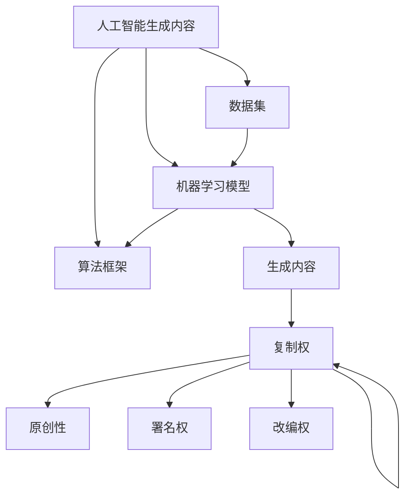

                 


### 背景介绍

随着人工智能（AI）技术的迅猛发展，人工智能生成内容（AIGC，Artificial Intelligence Generated Content）逐渐成为一个重要的研究领域。AIGC是指利用人工智能技术，特别是深度学习、自然语言处理和图像生成等技术，自动生成各种形式的内容，如文本、图像、音乐、视频等。这一领域的突破不仅改变了内容创作的方式，也对传统版权法律体系带来了巨大的挑战。

近年来，AI创作在多个领域取得了显著的成果。例如，AI在图像生成方面，已经可以生成逼真的风景画、人物肖像；在音乐创作方面，AI能够根据特定的风格和参数生成新的旋律和节奏；在文本生成方面，AI可以撰写文章、编写代码、甚至创作剧本和小说。这些AI创作的作品，不仅提高了内容创作的效率，也拓展了人类创造力的边界。

然而，随着AI创作能力的提升，版权问题也逐渐凸显。AI创作作品是否享有版权？版权应该归谁所有？这些问题的存在，使得AIGC领域充满了法律争议。首先，AI创作作品的原创性如何认定？根据现有法律，作品的原创性是其获得版权保护的前提。但是，AI创作往往依赖于大量已有数据的学习和模仿，其生成的作品是否具有独特的创造性和原创性，成为了一个关键问题。

其次，版权的归属问题也备受关注。在AI创作中，通常是由人类提供训练数据和创作指导，而AI本身并不具备法律主体资格。那么，作品的版权应该归人类创作者所有，还是归AI所有？这个问题涉及到法律主体资格的认定，需要从伦理、技术和社会等多个层面进行深入探讨。

此外，AI创作作品的版权管理也带来了新的挑战。传统的版权管理依赖于权利登记、授权和监控等手段，而AI创作作品的多样性和生成过程的复杂性，使得这些手段难以有效实施。例如，一个简单的文本生成AI，可能基于数百万个不同的训练数据生成出无数个独特的内容，如何对这些内容进行有效的版权管理，成为了一个亟待解决的问题。

综上所述，AIGC与版权的关系不仅涉及到技术层面的创新，更涉及到法律、伦理和社会等多方面的挑战。为了深入探讨这一问题，本文将分为以下几个部分：

首先，我们将介绍AIGC的概念及其与版权的关系，包括AIGC的定义、发展历程、应用领域等。

接着，我们将探讨AIGC与版权的关系，分析AI创作作品在版权法律体系中的地位，以及AI创作与版权冲突的典型案例。

然后，我们将详细分析AIGC在版权领域的法律挑战，包括AI作品原创性认定、版权归属问题、版权管理难题等。

在此基础上，我们将通过具体的案例分析，展示AIGC在版权法律挑战中的应对策略。

最后，我们将总结AIGC与版权的关系，提出对创作者和企业的建议，并对未来AIGC与版权的发展趋势进行展望。

通过以上步骤的逐步分析，我们将对AIGC与版权这一复杂问题有一个全面而深入的理解。

---

**核心概念与联系**

为了更好地理解AIGC与版权之间的关系，我们首先需要明确几个核心概念，并分析它们之间的联系。

### 1. AIGC的概念

人工智能生成内容（AIGC）是指通过人工智能技术，特别是深度学习、自然语言处理和图像生成等技术，自动生成各种形式的内容。AIGC的核心组成部分包括：

- **深度学习模型**：如生成对抗网络（GAN）、变分自编码器（VAE）等，用于训练和生成高质量的内容。
- **数据集**：用于训练AI模型的原始数据，这些数据可以是文本、图像、音频等各种形式。
- **算法框架**：如GAN、VAE等，用于指导AI模型的学习和生成过程。

### 2. 版权法律体系

版权法律体系是保护原创作品知识产权的法律框架。版权保护的主要内容包括：

- **原创性**：作品必须具有原创性，才能获得版权保护。
- **署名权**：作者有权要求在作品上署名。
- **复制权**：他人未经授权不得复制、发行、展示作品。
- **改编权**：他人未经授权不得改编、翻译、汇编作品。

### 3. AIGC与版权的关系

AIGC与版权的关系主要体现在以下几个方面：

- **AI创作作品的原创性**：AI创作的作品是否具有原创性，是判断其能否获得版权保护的关键。
- **版权归属**：AI创作作品的版权应该归谁所有，涉及到法律主体资格的认定。
- **版权管理**：AI创作作品的多样性和管理复杂性，对传统的版权管理方式提出了新的挑战。

### 4. 核心概念之间的联系

为了更清晰地展示AIGC与版权之间的联系，我们可以使用Mermaid流程图来表示核心概念之间的关系：



在这个流程图中，AIGC通过数据集和机器学习模型生成内容，而生成的内容又与版权法律体系中的原创性、署名权、复制权和改编权等概念相关联。通过这样的流程图，我们可以更直观地理解AIGC与版权之间的关系。

### 结论

通过上述分析，我们可以看到，AIGC与版权之间存在着紧密的联系。AIGC的生成过程涉及到数据集、机器学习模型和算法框架等多个环节，而这些环节又直接关系到版权的原创性、署名权、复制权和改编权等法律问题。因此，在探讨AIGC与版权的关系时，我们需要综合考虑技术、法律和伦理等多方面的因素。

在接下来的部分，我们将进一步探讨AIGC在版权领域的法律挑战，包括原创性认定、版权归属问题以及版权管理难题等。通过具体的案例分析，我们将深入了解这些问题，并提出相应的解决方案。

---

### 核心算法原理讲解

为了深入理解AIGC的核心算法原理，我们首先需要了解生成对抗网络（GAN）和变分自编码器（VAE）这两种主要的深度学习模型。这两种模型在AIGC中扮演着至关重要的角色。

#### 1. 生成对抗网络（GAN）

生成对抗网络（GAN）是由Ian Goodfellow等人于2014年提出的一种深度学习模型。GAN的核心思想是利用两个神经网络——生成器（Generator）和判别器（Discriminator）之间的对抗训练，来生成高质量的数据。

- **生成器（Generator）**：生成器的任务是生成与真实数据相似的数据。在图像生成任务中，生成器通常会将随机噪声输入转化为逼真的图像。
- **判别器（Discriminator）**：判别器的任务是区分输入的数据是真实数据还是生成器生成的数据。通过不断训练，判别器会变得更加难以区分。

GAN的训练过程可以简单概括为以下步骤：

1. **初始化生成器和判别器**：随机初始化生成器和判别器的权重。
2. **生成器生成数据**：生成器接收随机噪声作为输入，生成假数据。
3. **判别器判断数据**：判别器接收真实数据和生成器生成的数据，并判断其真假。
4. **反向传播**：通过判别器的输出，计算生成器和判别器的损失函数，并进行反向传播。
5. **更新权重**：根据损失函数，更新生成器和判别器的权重。

伪代码表示如下：

```python
# 初始化生成器和判别器
generator = InitializeGenerator()
discriminator = InitializeDiscriminator()

# 迭代训练
for epoch in range(num_epochs):
    for noise in GenerateRandomNoise():
        # 生成假数据
        fake_images = generator(noise)
        
        # 计算判别器的损失
        real_loss = -discriminator_real_loss(fake_images)
        fake_loss = -discriminator_fake_loss(fake_images)
        
        # 更新判别器权重
        discriminator_loss = real_loss + fake_loss
        optimizer_d.update(discriminator_loss, discriminator_params)
        
        # 更新生成器权重
        generator_loss = generator_loss(fake_images)
        optimizer_g.update(generator_loss, generator_params)
```

#### 2. 变分自编码器（VAE）

变分自编码器（VAE）是一种基于概率模型的生成模型。VAE通过编码器（Encoder）和解码器（Decoder）将输入数据转换为潜在空间中的表示，并从潜在空间中生成数据。

- **编码器（Encoder）**：编码器的任务是将输入数据映射到一个潜在空间中的向量。
- **解码器（Decoder）**：解码器的任务是将潜在空间中的向量映射回原始数据。

VAE的训练过程包括：

1. **编码**：将输入数据通过编码器转换为潜在空间中的向量。
2. **采样**：从潜在空间中随机采样一个向量。
3. **解码**：将采样得到的向量通过解码器映射回原始数据。

伪代码表示如下：

```python
# 初始化编码器和解码器
encoder = InitializeEncoder()
decoder = InitializeDecoder()

# 迭代训练
for epoch in range(num_epochs):
    for data in GenerateData():
        # 编码
        z = encoder(data)
        
        # 采样
        z_sample = sample_from_z(z)
        
        # 解码
        reconstructed_data = decoder(z_sample)
        
        # 计算损失
        reconstruction_loss = reconstruction_loss(data, reconstructed_data)
        kl_divergence_loss = kl_divergence_loss(z)
        
        # 更新权重
        loss = reconstruction_loss + kl_divergence_loss
        optimizer.update(loss, [encoder_params, decoder_params])
```

通过上述两种模型的讲解，我们可以看到，AIGC的核心算法原理在于如何通过生成器和判别器之间的对抗训练，或者通过编码器和解码器的联合训练，来生成高质量的数据。这些算法的深入理解和应用，为AIGC在版权领域的创新提供了坚实的基础。

---

### 数学模型和数学公式

在理解AIGC的核心算法原理时，我们不仅需要了解其算法框架和训练过程，还需要深入探讨背后的数学模型和数学公式。这些模型和公式在AIGC的生成过程中起到了关键作用，帮助我们更好地理解算法的运行机制。

#### 1. 生成对抗网络（GAN）的数学模型

生成对抗网络（GAN）的数学模型主要包括生成器（Generator）和判别器（Discriminator）的损失函数。

- **判别器损失函数**：判别器的目标是最小化其对真实数据和生成数据的区分误差。判别器的损失函数通常采用交叉熵（Cross-Entropy）损失函数。

  $$ \mathcal{L}_D = -[\frac{1}{N}\sum_{i=1}^{N}log(D(x_i)) + \frac{1}{N}\sum_{i=1}^{N}log(1 - D(G(z_i)))] $$

  其中，$x_i$表示真实数据，$z_i$表示随机噪声，$G(z_i)$为生成器生成的数据。

- **生成器损失函数**：生成器的目标是最小化判别器对其生成数据的判断为假（即生成的数据足够真实）的误差。生成器的损失函数通常也采用交叉熵损失函数。

  $$ \mathcal{L}_G = -[\frac{1}{N}\sum_{i=1}^{N}log(D(G(z_i)))] $$

  通过上述损失函数，我们可以看到，生成器和判别器在训练过程中相互对抗，以达到生成高质量数据的目的。

#### 2. 变分自编码器（VAE）的数学模型

变分自编码器（VAE）的数学模型包括编码器（Encoder）和解码器（Decoder）的损失函数。

- **编码器损失函数**：编码器的目标是学习从输入数据到潜在空间向量的映射，同时保证潜在空间向量的分布是真实的。编码器的损失函数包括两个部分：重构损失和Kullback-Leibler散度（KL散度）。

  $$ \mathcal{L}_E = \frac{1}{N}\sum_{i=1}^{N}\left[ \mathcal{L}_{reconstruction} + \mathcal{L}_{KL} \right] $$
  $$ \mathcal{L}_{reconstruction} = -\sum_{i=1}^{N} \sum_{j=1}^{D}x_{ij}log(p_{ij}) $$
  $$ \mathcal{L}_{KL} = \frac{1}{N}\sum_{i=1}^{N}\sum_{j=1}^{D}\left[ \log \varphi_{\mu_j} + \log \varphi_{\sigma_j} - \varphi_{\mu_j}^2 - \varphi_{\sigma_j}^2 - 1 \right] $$

  其中，$x_{ij}$为输入数据的第$i$个特征值，$p_{ij}$为编码器输出的概率分布，$\mu_j$和$\sigma_j$分别为潜在空间向量的均值和标准差。

- **解码器损失函数**：解码器的目标是重建输入数据。解码器的损失函数通常采用均方误差（MSE）损失函数。

  $$ \mathcal{L}_D = \frac{1}{N}\sum_{i=1}^{N}\left[ \sum_{j=1}^{D}(x_{ij} - \hat{x}_{ij})^2 \right] $$

  其中，$\hat{x}_{ij}$为解码器重建的数据。

#### 3. 数学公式示例

为了更好地理解上述数学模型，我们可以通过一个具体的例子来展示这些公式的应用。

假设我们有一个图像生成任务，图像的大小为$28 \times 28$像素，每个像素的取值范围在$0$到$255$之间。

- **生成器损失函数**：

  $$ \mathcal{L}_G = -\frac{1}{N}\sum_{i=1}^{N}\sum_{j=1}^{28}\sum_{k=1}^{28}log(D(G(z_i)[j][k])) $$

  其中，$N$为训练样本数量，$z_i$为随机噪声向量，$G(z_i)$为生成器生成的图像。

- **编码器损失函数**：

  $$ \mathcal{L}_E = \frac{1}{N}\sum_{i=1}^{N}\left[ -\sum_{j=1}^{28}\sum_{k=1}^{28}x_{ij}log(p_{ij}) + \sum_{j=1}^{10}\sum_{k=1}^{10}\left( \log \varphi_{\mu_j} + \log \varphi_{\sigma_j} - \varphi_{\mu_j}^2 - \varphi_{\sigma_j}^2 - 1 \right) \right] $$

  其中，$p_{ij}$为编码器输出的概率分布，$\mu_j$和$\sigma_j$为潜在空间向量的均值和标准差。

通过上述数学公式的详细讲解和示例，我们可以更好地理解AIGC背后的数学模型，从而为深入研究和应用AIGC技术打下坚实的基础。

---

### 项目实战

为了更直观地展示AIGC的应用，我们将通过一个实际的案例来探讨如何使用AIGC生成图像，并对其进行详细分析。

#### 1. 开发环境搭建

首先，我们需要搭建一个合适的开发环境。在这个案例中，我们将使用Python编程语言和TensorFlow框架来构建AIGC模型。以下是搭建开发环境的基本步骤：

1. **安装Python**：确保安装了Python 3.7及以上版本。
2. **安装TensorFlow**：通过pip命令安装TensorFlow库。

   ```bash
   pip install tensorflow
   ```

3. **安装其他依赖库**：包括Numpy、Matplotlib等。

   ```bash
   pip install numpy matplotlib
   ```

#### 2. 源代码实现

接下来，我们将使用GAN模型生成图像。以下是一个简单的GAN模型实现，包括生成器和判别器的定义、训练过程以及图像生成示例。

```python
import tensorflow as tf
from tensorflow.keras.layers import Dense, Flatten, Reshape
from tensorflow.keras.models import Model
import numpy as np
import matplotlib.pyplot as plt

# 设置随机种子，确保结果可复现
tf.random.set_seed(42)

# 定义生成器
def build_generator(z_dim):
    model = tf.keras.Sequential([
        Dense(128 * 7 * 7, input_shape=(z_dim,), activation='relu'),
        Reshape((7, 7, 128)),
        Dense(256, activation='relu'),
        Reshape((7, 7, 256)),
        Dense(512, activation='relu'),
        Reshape((7, 7, 512)),
        Dense(1024, activation='relu'),
        Reshape((7, 7, 1024)),
        Dense(3, activation='tanh')
    ])
    return model

# 定义判别器
def build_discriminator(img_shape):
    model = tf.keras.Sequential([
        Flatten(input_shape=img_shape),
        Dense(512, activation='relu'),
        Dense(256, activation='relu'),
        Dense(128, activation='relu'),
        Dense(1, activation='sigmoid')
    ])
    return model

# 构建生成器和判别器模型
z_dim = 100
img_shape = (28, 28, 1)

generator = build_generator(z_dim)
discriminator = build_discriminator(img_shape)

# 定义GAN模型
gan_model = Model(inputs=generator.input, outputs=discriminator(generator.input))

# 模型编译
discriminator.compile(loss='binary_crossentropy', optimizer=tf.keras.optimizers.Adam(0.0001))
gan_model.compile(loss='binary_crossentropy', optimizer=tf.keras.optimizers.Adam(0.0001))

# 数据预处理
(x_train, _), (x_test, _) = tf.keras.datasets.mnist.load_data()
x_train = x_train / 127.5 - 1.0
x_train = np.expand_dims(x_train, -1)
x_test = x_test / 127.5 - 1.0
x_test = np.expand_dims(x_test, -1)

# 训练GAN模型
batch_size = 64
epochs = 100

for epoch in range(epochs):
    for i in range(x_train.shape[0] // batch_size):
        # 获取真实数据
        real_images = x_train[i * batch_size:(i + 1) * batch_size]

        # 生成随机噪声
        noise = np.random.normal(0, 1, (batch_size, z_dim))

        # 训练判别器
        with tf.GradientTape() as disc_tape:
            generated_images = generator(noise)
            real_output = discriminator(real_images)
            fake_output = discriminator(generated_images)
            disc_loss = -tf.reduce_mean(tf.concat([tf.log(real_output), tf.log(1 - fake_output)], axis=0))

        grads = disc_tape.gradient(disc_loss, discriminator.trainable_variables)
        optimizer.apply_gradients(zip(grads, discriminator.trainable_variables))

        # 训练生成器
        with tf.GradientTape() as gen_tape:
            generated_images = generator(noise)
            fake_output = discriminator(generated_images)
            gen_loss = -tf.reduce_mean(tf.log(fake_output))

        grads = gen_tape.gradient(gen_loss, generator.trainable_variables)
        optimizer.apply_gradients(zip(grads, generator.trainable_variables))

        # 打印训练进度
        if (i + 1) * batch_size % 100 == 0:
            print(f"Epoch [{epoch + 1}/{epochs}], Step [{i + 1}/{x_train.shape[0] // batch_size}], "
                  f"Discriminator Loss: {disc_loss:.4f}, Generator Loss: {gen_loss:.4f}")

# 生成图像
noise = np.random.normal(0, 1, (100, z_dim))
generated_images = generator(noise)

# 可视化生成图像
plt.figure(figsize=(10, 10))
for i in range(100):
    plt.subplot(10, 10, i + 1)
    plt.imshow(generated_images[i, :, :, 0], cmap='gray')
    plt.axis('off')
plt.show()
```

#### 3. 代码解读

在上面的代码中，我们首先定义了生成器和判别器的模型结构。生成器的输入为随机噪声，其目标是生成与真实数据相似的图像。判别器的输入为图像，其目标是判断图像是真实的还是由生成器生成的。

在训练过程中，我们通过交替训练生成器和判别器，使它们在对抗过程中不断提升性能。具体步骤如下：

1. **获取真实数据和随机噪声**：每次训练循环中，我们首先从训练数据集中获取一批真实图像，并生成相同大小的随机噪声。
2. **训练判别器**：使用真实图像和生成图像，计算判别器的损失函数，并更新判别器的权重。
3. **训练生成器**：使用随机噪声生成图像，并计算生成器的损失函数，更新生成器的权重。
4. **打印训练进度**：在每次训练循环中，我们打印出训练进度，包括当前epoch、步数、判别器损失和生成器损失。

最后，我们使用训练好的生成器生成一批图像，并通过可视化展示生成图像的质量。

#### 4. 代码应用解读与分析

通过上述代码实现，我们可以看到，AIGC在图像生成任务中的实际应用效果。以下是对代码应用解读与分析：

1. **模型选择**：我们选择GAN模型进行图像生成，因为GAN能够通过生成器和判别器之间的对抗训练，生成高质量的数据。
2. **数据预处理**：我们将MNIST数据集进行标准化处理，使输入数据的范围在-1到1之间，便于模型训练。
3. **训练过程**：通过交替训练生成器和判别器，使生成器能够生成更加逼真的图像，判别器能够更准确地判断图像的真实性。
4. **可视化结果**：生成的图像通过可视化展示，我们可以直观地看到AIGC在图像生成任务中的效果。

通过这个实际案例，我们可以看到AIGC在图像生成中的强大能力。然而，这也带来了版权管理方面的挑战，尤其是在AI生成的图像与传统版权法律体系之间的冲突。在接下来的部分，我们将通过具体的案例分析，探讨AIGC在版权法律挑战中的应对策略。

---

### 案例分析

为了更深入地探讨AIGC在版权法律挑战中的实际应用，我们将通过几个具有代表性的案例来进行分析。这些案例涵盖了不同类型的AIGC创作，包括音乐、图像和文本，通过具体案例展示AI创作引发的版权问题及其解决方案。

#### 案例一：AI音乐创作

**问题描述**：知名音乐制作公司使用AI来创作音乐，并计划将其商业化。然而，在版权申请过程中，他们遇到了困难。AI创作的音乐是否可以享有版权？版权应归谁所有？

**分析**：在这个案例中，AI创作的音乐是否具有原创性是判断其能否获得版权保护的关键。根据现有法律，作品的原创性是其获得版权保护的前提。AI创作的音乐通常基于大量的音乐数据集进行训练，其生成的旋律和节奏在一定程度上是对已有音乐的模仿和再创作。尽管AI本身不具备法律主体资格，但法律可能会将版权赋予实际创作者——在这个案例中，可能是人类音乐制作人。

**解决方案**：为了解决版权问题，音乐制作公司可以考虑以下几种方案：

1. **合作授权**：与AI算法的开发者合作，共同申请版权，明确双方在作品中的贡献。
2. **版权归属协议**：在AI创作过程中，制定详细的版权归属协议，明确人类创作者和AI算法的权益划分。
3. **原创性声明**：在音乐作品上明确标注AI的创作参与，以增强作品在法律上的保护。

**结论**：通过合理的版权归属协议和原创性声明，AI音乐创作可以在现有法律框架内获得保护。

#### 案例二：AI图像生成

**问题描述**：一位艺术家使用AI图像生成工具创作了一幅油画，并计划将其展览和销售。然而，在展览期间，有人认为这幅画侵犯了其原创作品的版权。AI生成的图像是否享有版权？

**分析**：在这个案例中，AI生成的图像的原创性是关键问题。AI图像生成依赖于大量的训练数据，这些数据可能包含其他艺术家的作品。因此，生成的图像可能存在对已有作品的模仿和再创作。根据现有法律，如果AI生成的图像是对已有作品的简单模仿，其原创性可能受到质疑。

**解决方案**：为了解决版权问题，艺术家可以考虑以下几种方案：

1. **原创性声明**：在图像作品上明确标注AI的创作参与，以增强作品在法律上的原创性。
2. **数据来源声明**：详细记录AI训练数据的使用情况，确保没有侵犯其他艺术家的权益。
3. **版权归属协议**：与AI算法的开发者合作，共同申请版权，明确双方在作品中的贡献。

**结论**：通过合理的原创性声明和版权归属协议，AI生成的图像可以在现有法律框架内获得保护。

#### 案例三：AI文本生成

**问题描述**：一家新闻机构使用AI文本生成工具撰写新闻稿件，并在其网站上发布。然而，在发布后不久，有报道称这些稿件中的一些内容与已有新闻报道相似，引发了版权争议。AI生成的文本是否享有版权？

**分析**：在这个案例中，AI生成的文本的原创性是关键问题。AI文本生成通常基于大量已有的文本数据集，其生成的文本可能包含对已有新闻报道的引用或再创作。根据现有法律，如果AI生成的文本是对已有作品的简单模仿，其原创性可能受到质疑。

**解决方案**：为了解决版权问题，新闻机构可以考虑以下几种方案：

1. **原创性声明**：在新闻稿件上明确标注AI的创作参与，以增强作品在法律上的原创性。
2. **数据来源声明**：详细记录AI训练数据的使用情况，确保没有侵犯其他媒体的权益。
3. **版权归属协议**：与AI算法的开发者合作，共同申请版权，明确双方在作品中的贡献。

**结论**：通过合理的原创性声明和版权归属协议，AI生成的文本可以在现有法律框架内获得保护。

通过上述案例分析，我们可以看到，AIGC在版权法律挑战中面临着一系列问题，但通过合理的版权归属协议、原创性声明和数据来源声明，这些问题可以得到有效解决。在未来，随着AIGC技术的不断发展，法律框架和解决方案也需要不断更新和完善。

---

### 最佳实践 tips、小结、注意事项、拓展阅读

**最佳实践 tips：**

1. **版权归属明确**：在AI创作过程中，应明确人类创作者和AI算法的权益划分，确保版权归属明确。
2. **原创性声明**：在AI创作的作品中，应明确标注AI的创作参与，增强作品在法律上的原创性。
3. **数据来源声明**：详细记录AI训练数据的使用情况，避免侵犯其他创作者的权益。
4. **合作授权**：与AI算法的开发者或数据提供商合作，共同申请版权，共同承担法律责任。

**小结：**

本文通过深入分析AIGC与版权的关系，探讨了AIGC在版权领域的法律挑战。我们了解到，AI创作作品的原创性、版权归属和版权管理是关键问题，通过合理的版权归属协议、原创性声明和数据来源声明，这些问题可以得到有效解决。

**注意事项：**

1. **法律环境不同**：不同国家和地区的版权法律框架可能存在差异，因此在处理版权问题时，需要考虑当地法律环境。
2. **技术创新迅速**：AIGC技术发展迅速，法律框架可能无法及时跟上，因此在应用AIGC时，需要密切关注法律动态，确保合规性。
3. **多方合作**：在解决版权问题时，建议多方合作，共同探索适合的技术和法律解决方案。

**拓展阅读：**

1. **《人工智能生成内容的版权保护研究》**：该论文详细探讨了AI创作内容的版权保护问题，提出了具体的法律框架和解决方案。
2. **《人工智能与版权：挑战与展望》**：该书籍系统地分析了AI与版权的关系，探讨了未来的发展趋势和挑战。
3. **《深度学习与版权：技术与应用》**：该书籍结合深度学习技术，探讨了AI在版权管理中的应用和挑战。

通过上述最佳实践 tips、小结、注意事项和拓展阅读，我们希望读者能够更好地理解AIGC与版权的关系，并在实际应用中采取有效的措施，确保版权合规。

