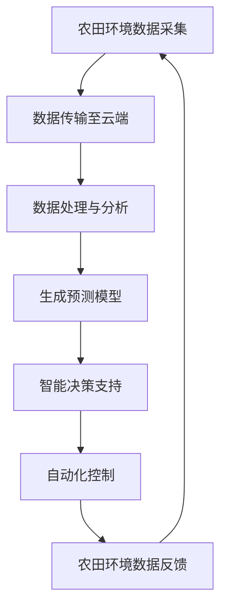

                 


### 文章标题

《AIGC与物联网（IoT）在智慧农业中的融合》

### 文章关键词

AIGC，物联网（IoT），智慧农业，生成对抗网络（GAN），变分自编码器（VAE），传感器，数据分析，决策支持系统（DSS），项目实战，趋势分析

### 文章摘要

随着全球人口的增长和气候变化的影响，传统农业面临着前所未有的挑战。智慧农业作为一种现代化的农业生产模式，通过整合物联网（IoT）和人工智能（AI）技术，为实现农业生产的精准化和智能化提供了新的路径。本文将探讨AIGC（自适应智能生成控制）与物联网（IoT）在智慧农业中的融合，介绍AIGC与IoT的基本概念、技术原理及其在智慧农业中的应用。通过详细的分析和实际案例，本文旨在揭示AIGC与IoT在智慧农业中融合的潜力及其对农业现代化的推动作用。

## 目录

1. **背景介绍**
2. **核心概念与联系**
   - **1.1 AIGC简介**
   - **1.2 物联网（IoT）技术**
   - **1.3 智慧农业的概念**
   - **1.4 AIGC与IoT在智慧农业中的融合**
3. **核心技术**
   - **2.1 AIGC技术深入**
     - **2.1.1 生成对抗网络（GAN）**
     - **2.1.2 变分自编码器（VAE）**
     - **2.1.3 自注意力机制（Self-Attention）**
   - **2.2 物联网（IoT）技术在智慧农业中的应用**
     - **2.2.1 实时数据采集与处理**
     - **2.2.2 物联网（IoT）通信协议**
   - **2.3 数据分析与决策支持**
     - **2.3.1 数据分析方法**
     - **2.3.2 决策支持系统（DSS）构建**
4. **项目实践**
   - **3.1 智慧农业项目实战**
   - **3.2 案例研究**
5. **未来展望与趋势**
   - **4.1 技术趋势分析**
   - **4.2 政策与市场环境分析**
   - **4.3 未来应用场景预测**
6. **最佳实践与拓展阅读**

### 1. 背景介绍

全球农业生产面临着一系列严峻的挑战，包括土地资源的限制、气候变化的不可预测性以及劳动力成本的上升。传统农业生产方式在资源利用效率、生产质量和可持续性方面存在显著不足。为了应对这些挑战，智慧农业作为一种现代化农业生产模式应运而生。智慧农业通过引入物联网（IoT）和人工智能（AI）技术，实现了农业生产的信息化和智能化，极大地提升了农业生产效率和质量。

物联网（IoT）技术通过在农田中部署各种传感器，实时监测土壤湿度、温度、气象条件等关键参数，从而为农业生产提供科学的数据支持。同时，物联网技术还可以实现农产品的远程监控和管理，降低生产成本，提高资源利用率。然而，物联网技术的有效应用还需要强大的数据处理和分析能力，这便是人工智能（AI）技术的用武之地。

人工智能（AI）技术，尤其是生成对抗网络（GAN）、变分自编码器（VAE）等深度学习算法，可以在大量数据的基础上，生成高质量的预测模型，帮助农民做出更加精准的决策。AIGC（自适应智能生成控制）作为AI技术的进一步发展，能够根据环境变化和实际需求，动态调整农业生产策略，实现农业生产的自适应和智能化。

### 1.1 AIGC简介

AIGC，即自适应智能生成控制，是一种结合了深度学习、生成模型和自适应控制理论的新型智能系统。AIGC通过生成模型，如生成对抗网络（GAN）和变分自编码器（VAE），能够从大量数据中学习生成高质量的预测模型。同时，AIGC还具备自适应控制能力，可以根据环境变化和实际需求，动态调整系统参数，从而实现对系统的自适应控制。

AIGC的特点主要包括以下几点：

1. **数据驱动**：AIGC通过学习大量历史数据，形成对系统的深刻理解，从而能够生成高质量的预测模型。
2. **自适应控制**：AIGC可以根据环境变化和实际需求，动态调整系统参数，实现系统的自适应控制。
3. **高效性**：AIGC能够快速处理大规模数据，并生成高质量的预测模型，从而提高农业生产效率。

### 1.2 物联网（IoT）技术

物联网（IoT）技术是指通过将各种信息传感设备与互联网连接起来，实现信息交换和通信的一种技术。物联网技术包括传感器技术、通信协议、数据处理与分析技术等多个方面。

**传感器技术**：传感器是物联网技术的核心组件，用于采集农田中的各种环境数据，如土壤湿度、温度、气象条件等。传感器技术的进步，使得农业生产能够实现精细化管理和智能化控制。

**通信协议**：物联网技术需要一种高效的通信协议来传输采集到的数据。常见的物联网通信协议包括MQTT、CoAP等，这些协议能够保证数据的实时性和可靠性。

**数据处理与分析技术**：物联网技术产生的海量数据需要通过数据处理与分析技术进行处理，从而提取有价值的信息，为农业生产提供决策支持。

### 1.3 智慧农业的概念

智慧农业是指通过物联网（IoT）和人工智能（AI）技术，实现农业生产的数字化、智能化和精准化。智慧农业的目标是提高农业生产效率，降低生产成本，同时保护环境和资源。

智慧农业的核心要素包括：

1. **传感器网络**：用于实时监测农田环境数据，为农业生产提供科学依据。
2. **数据处理与分析系统**：对传感器网络采集到的数据进行分析和处理，提取有价值的信息。
3. **智能决策系统**：根据数据分析结果，为农业生产提供智能化的决策支持。
4. **自动化控制系统**：通过物联网技术，实现对农业生产过程的自动化控制，提高生产效率。

### 1.4 AIGC与IoT在智慧农业中的融合

AIGC与IoT技术的融合，为智慧农业的发展提供了新的机遇。AIGC可以根据物联网传感器网络采集到的数据，动态调整农业生产策略，实现农业生产的自适应和智能化。具体来说，AIGC与IoT在智慧农业中的融合主要表现在以下几个方面：

1. **实时监测与数据分析**：AIGC可以利用物联网传感器网络，实时监测农田环境数据，并通过深度学习算法，对数据进行分析和处理，提取有价值的信息。
2. **智能决策支持**：基于实时监测数据，AIGC可以生成高质量的预测模型，为农业生产提供智能化的决策支持。
3. **自动化控制**：AIGC可以根据预测模型，自动调整农业生产参数，如灌溉量、施肥量等，实现农业生产的自动化控制。
4. **自适应调整**：AIGC可以根据环境变化和实际需求，动态调整系统参数，实现农业生产的自适应和智能化。

### 2. 核心概念与联系

#### 2.1 AIGC简介

AIGC（自适应智能生成控制）是一种结合了深度学习和自适应控制理论的智能系统。它通过生成模型（如生成对抗网络（GAN）和变分自编码器（VAE））学习大量数据，形成对系统的深刻理解，从而生成高质量的预测模型。AIGC的核心特点包括数据驱动、自适应控制和高效性。数据驱动意味着AIGC通过学习历史数据来优化系统性能；自适应控制使得AIGC能够根据环境变化和需求动态调整系统参数；高效性则体现在AIGC能够快速处理大规模数据并生成预测模型。

**AIGC的技术体系结构：**

AIGC的技术体系结构可以分为三个主要层次：数据层、算法层和应用层。

- **数据层**：数据层负责数据的采集、存储和管理。在智慧农业中，数据层包括各种传感器，如土壤湿度传感器、气象传感器等，用于实时监测农田环境。
- **算法层**：算法层负责数据处理和分析，主要包括生成对抗网络（GAN）、变分自编码器（VAE）等深度学习算法。这些算法能够从数据中提取特征，生成高质量的预测模型。
- **应用层**：应用层负责将预测模型应用于实际场景，如自动调整灌溉量、施肥量等，实现农业生产的自适应和智能化。

#### 2.2 物联网（IoT）技术

物联网（IoT）技术是一种通过网络连接各种设备，实现信息交换和通信的技术。在智慧农业中，物联网技术发挥着关键作用，通过实时监测农田环境数据，为农业生产提供科学依据。物联网技术包括传感器技术、通信协议和数据处理与分析技术。

- **传感器技术**：传感器是物联网技术的核心组件，用于实时监测农田中的环境参数，如土壤湿度、温度、气象条件等。传感器的精确度和可靠性直接影响到物联网系统的性能。
- **通信协议**：物联网技术需要一种高效的通信协议来传输采集到的数据。常见的物联网通信协议包括MQTT、CoAP等，这些协议能够保证数据的实时性和可靠性。
- **数据处理与分析技术**：物联网技术产生的海量数据需要通过数据处理与分析技术进行处理，从而提取有价值的信息，为农业生产提供决策支持。

**物联网（IoT）技术在智慧农业中的应用：**

物联网技术在智慧农业中的应用主要包括以下几个方面：

1. **实时监测与数据分析**：物联网传感器网络可以实时监测农田环境数据，并将数据传输到数据中心进行分析和处理，为农业生产提供实时决策支持。
2. **自动化控制**：通过物联网技术，可以实现农业生产的自动化控制，如自动调节灌溉系统、施肥系统等，提高生产效率和资源利用率。
3. **远程监控与管理**：物联网技术使得农民可以远程监控和管理农田，降低生产成本，提高生产效率。
4. **决策支持**：通过对物联网传感器采集的数据进行分析，可以提取出有价值的信息，为农业生产提供科学的决策支持。

#### 2.3 智慧农业的概念

智慧农业是一种现代化的农业生产模式，通过整合物联网（IoT）和人工智能（AI）技术，实现农业生产的数字化、智能化和精准化。智慧农业的目标是提高农业生产效率，降低生产成本，同时保护环境和资源。

智慧农业的核心要素包括：

1. **传感器网络**：传感器网络是智慧农业的基础，用于实时监测农田环境数据，为农业生产提供科学依据。
2. **数据处理与分析系统**：数据处理与分析系统负责对传感器网络采集到的数据进行分析和处理，提取有价值的信息，为农业生产提供决策支持。
3. **智能决策系统**：智能决策系统基于数据处理与分析结果，为农业生产提供智能化的决策支持，如自动调整灌溉量、施肥量等。
4. **自动化控制系统**：自动化控制系统通过物联网技术，实现对农业生产过程的自动化控制，提高生产效率和资源利用率。

#### 2.4 AIGC与IoT在智慧农业中的融合

AIGC与IoT在智慧农业中的融合，为农业生产的精准化和智能化提供了新的路径。AIGC可以通过物联网传感器网络实时监测农田环境数据，利用深度学习算法生成高质量的预测模型，为农业生产提供智能化的决策支持。具体来说，AIGC与IoT在智慧农业中的融合主要表现在以下几个方面：

1. **实时监测与数据分析**：AIGC可以利用物联网传感器网络，实时监测农田环境数据，并通过深度学习算法，对数据进行分析和处理，提取有价值的信息。
2. **智能决策支持**：基于实时监测数据，AIGC可以生成高质量的预测模型，为农业生产提供智能化的决策支持，如自动调整灌溉量、施肥量等。
3. **自动化控制**：AIGC可以根据预测模型，自动调整农业生产参数，如灌溉量、施肥量等，实现农业生产的自动化控制。
4. **自适应调整**：AIGC可以根据环境变化和实际需求，动态调整系统参数，实现农业生产的自适应和智能化。

通过AIGC与IoT的融合，智慧农业将实现从传统的经验式管理向数据驱动、智能化管理的转变，极大地提升农业生产效率和质量。

### 2.5 Mermaid流程图

以下是一个简单的Mermaid流程图，展示了AIGC与IoT在智慧农业中的融合流程：



这个流程图清晰地展示了从农田环境数据采集到预测模型生成，再到智能决策支持和自动化控制的整个过程。

### 3. 核心技术

#### 3.1 AIGC技术深入

AIGC（自适应智能生成控制）是一种结合了深度学习和自适应控制理论的智能系统。在AIGC技术中，生成对抗网络（GAN）、变分自编码器（VAE）和自注意力机制（Self-Attention）是核心组成部分。这些技术通过不同的原理和机制，共同构成了AIGC的技术基础。

##### 3.1.1 生成对抗网络（GAN）

生成对抗网络（GAN）是一种由生成器和判别器组成的深度学习模型。生成器旨在生成与真实数据相似的数据，而判别器则用于区分真实数据和生成数据。通过这种对抗训练，生成器能够不断提高生成数据的真实度，而判别器则不断增强区分能力。

**GAN的架构：**

GAN的架构通常包含以下两个部分：

1. **生成器（Generator）**：生成器是一个神经网络，它接收随机噪声作为输入，通过一系列的变换生成虚假数据。
2. **判别器（Discriminator）**：判别器也是一个神经网络，它接收真实数据和生成数据作为输入，并输出一个概率值，表示输入数据是真实的可能性。

**GAN的训练过程：**

GAN的训练过程主要包括以下步骤：

1. **生成器训练**：在训练过程中，生成器的目标是使其生成的数据尽可能接近真实数据。这通常通过最小化生成器与判别器之间的损失函数来实现。
2. **判别器训练**：判别器的目标是能够准确地区分真实数据和生成数据。这同样通过最小化判别器与生成器之间的损失函数来实现。

**GAN在智慧农业中的应用：**

在智慧农业中，GAN可以用于生成农田环境数据的模拟，从而帮助农民预测未来环境变化，制定相应的农业生产策略。

**GAN的伪代码：**

```python
# 生成器
G(z):
    x = ...

# 判别器
D(x):
    prob = ...

# 训练过程
for epoch in range(num_epochs):
    for i in range(num_batches):
        z = ...
        x = ...
        prob_real = ...
        prob_fake = ...
        loss_G = ...
        loss_D = ...
```

##### 3.1.2 变分自编码器（VAE）

变分自编码器（VAE）是一种基于概率生成模型的深度学习模型。VAE通过引入潜变量，将输入数据映射到一个低维的潜在空间中，从而实现数据的降维和重构。

**VAE的架构：**

VAE的架构通常包含以下三个部分：

1. **编码器（Encoder）**：编码器是一个神经网络，它接收输入数据，并输出潜变量的均值和方差。
2. **解码器（Decoder）**：解码器也是一个神经网络，它接收潜变量，并尝试重构输入数据。
3. **潜在空间（Latent Space）**：潜在空间是一个低维的空间，用于表示输入数据。

**VAE的训练过程：**

VAE的训练过程主要包括以下步骤：

1. **编码器训练**：编码器的目标是能够准确地编码输入数据，使其在潜在空间中有良好的分布。
2. **解码器训练**：解码器的目标是能够从潜在空间中重构输入数据。

**VAE在智慧农业中的应用：**

在智慧农业中，VAE可以用于数据的降维和重构，从而提高数据分析的效率和准确性。

**VAE的伪代码：**

```python
# 编码器
encode(x):
    z_mean, z_log_var = ...

# 解码器
decode(z):
    x_hat = ...

# 训练过程
for epoch in range(num_epochs):
    for i in range(num_batches):
        x = ...
        z_mean, z_log_var = ...
        x_hat = ...
        loss = ...
```

##### 3.1.3 自注意力机制（Self-Attention）

自注意力机制（Self-Attention）是一种用于处理序列数据的注意力机制。Self-Attention可以使模型在处理序列数据时，自动关注序列中的关键部分，从而提高模型的性能。

**Self-Attention的原理：**

Self-Attention通过计算序列中每个元素与所有其他元素的相关性，为其分配不同的权重。这种权重分配机制使得模型能够自动关注序列中的关键部分，从而提高模型的准确性和效率。

**Self-Attention的计算公式：**

$$
\text{Attention}(Q, K, V) = \text{softmax}\left(\frac{QK^T}{\sqrt{d_k}}\right)V
$$

其中，$Q, K, V$ 分别为查询向量、键向量和值向量；$d_k$ 为键向量的维度。

**Self-Attention在智慧农业中的应用：**

在智慧农业中，Self-Attention可以用于处理农田环境数据的序列，从而提取出关键特征，为农业生产提供决策支持。

**Self-Attention的伪代码：**

```python
# 计算注意力权重
attention_weights = softmax(QK^T / sqrt(d_k))

# 计算注意力得分
attention_scores = attention_weights * V

# 计算注意力输出
attention_output = sum(attention_scores)
```

#### 3.2 物联网（IoT）技术在智慧农业中的应用

物联网（IoT）技术在智慧农业中的应用，极大地提升了农业生产的自动化水平和数据处理的效率。物联网技术通过实时监测农田环境数据、实现自动化控制和远程管理，为智慧农业提供了强有力的技术支持。

##### 3.2.1 实时数据采集与处理

实时数据采集是物联网技术在智慧农业中的核心任务。通过在农田中部署各种传感器，如土壤湿度传感器、温度传感器、气象传感器等，可以实时监测农田的环境参数。这些传感器将采集到的数据通过物联网通信协议（如MQTT、CoAP）传输到数据中心，进行进一步的处理和分析。

**传感器技术：**

传感器技术是物联网技术在智慧农业中的关键组件。传感器能够精确测量农田中的环境参数，如土壤湿度、温度、气象条件等。传感器的精度和可靠性直接影响到物联网系统的性能。

**数据预处理与清洗：**

传感器采集到的数据通常含有噪声和异常值，因此需要进行预处理和清洗。数据预处理包括数据去噪、数据归一化和数据填充等步骤，以确保数据的准确性和一致性。

**数据处理与分析技术：**

物联网技术产生的海量数据需要通过数据处理与分析技术进行处理。数据处理与分析技术包括数据存储、数据分析和数据可视化等步骤，旨在从海量数据中提取有价值的信息，为农业生产提供决策支持。

##### 3.2.2 物联网（IoT）通信协议

物联网通信协议是物联网技术的重要组成部分，用于实现传感器数据在网络中的传输。常见的物联网通信协议包括MQTT、CoAP等。

**MQTT协议：**

MQTT（Message Queuing Telemetry Transport）是一种轻量级的消息传输协议，广泛用于物联网应用中。MQTT协议采用发布/订阅模式，使得传感器数据能够高效地传输到数据中心。

**CoAP协议：**

CoAP（Constrained Application Protocol）是一种面向资源约束设备的物联网通信协议。CoAP协议采用请求/响应模式，适用于低功耗、带宽受限的物联网环境。

**物联网通信协议在智慧农业中的应用：**

物联网通信协议在智慧农业中，主要用于实现传感器数据的实时传输和远程监控。通过使用MQTT或CoAP等协议，可以实现农田环境数据的实时传输，为农业生产提供实时决策支持。

#### 3.3 数据分析与决策支持

数据分析与决策支持是智慧农业中的关键环节。通过分析物联网传感器采集到的数据，可以提取出有价值的信息，为农业生产提供智能化的决策支持。

##### 3.3.1 数据分析方法

数据分析方法是提取物联网传感器数据中潜在信息的关键步骤。常见的数据分析方法包括：

1. **时间序列分析**：时间序列分析用于分析数据随时间变化的趋势和模式。在智慧农业中，时间序列分析可以用于预测未来的环境变化，为农业生产提供决策支持。
2. **聚类分析**：聚类分析用于将数据分为多个类别，以便更好地理解数据的分布和特征。在智慧农业中，聚类分析可以用于分类农田，为不同类型的农田制定个性化的生产策略。
3. **回归分析**：回归分析用于建立自变量和因变量之间的定量关系模型。在智慧农业中，回归分析可以用于预测农产品的产量和品质，为农业生产提供决策支持。

##### 3.3.2 决策支持系统（DSS）构建

决策支持系统（DSS）是智慧农业中实现智能化决策的核心组件。DSS通过整合物联网传感器数据、数据分析结果和专业知识，为农业生产提供智能化的决策支持。

**DSS的构建步骤：**

1. **需求分析**：确定农业生产的决策需求和目标。
2. **数据采集**：通过物联网传感器网络采集农田环境数据。
3. **数据分析**：对采集到的数据进行分析和处理，提取有价值的信息。
4. **决策模型构建**：基于数据分析结果，构建决策模型，为农业生产提供智能化的决策支持。
5. **决策支持**：将决策模型应用于实际生产过程，提供实时的决策支持。

### 4. 项目实践

#### 4.1 智慧农业项目实战

为了更好地展示AIGC与IoT在智慧农业中的应用，我们以一个实际项目为例，介绍项目的背景、需求分析、技术选型、系统设计、实施与调试以及项目效果评估。

**项目背景：**

某农业合作社希望利用AIGC与IoT技术，实现农田灌溉系统的智能化管理，提高灌溉效率，降低水资源浪费。

**需求分析：**

1. **实时监测**：需要实时监测农田土壤湿度、气象条件等环境数据。
2. **智能决策**：根据实时监测数据，自动调整灌溉时间和灌溉量，实现精准灌溉。
3. **数据可视化**：需要将监测数据和灌溉数据可视化，以便农民实时了解农田状况。
4. **远程管理**：需要实现远程监控和管理，方便农民随时随地了解农田状况。

**技术选型：**

1. **传感器技术**：选择高精度的土壤湿度传感器、气象传感器等。
2. **物联网通信协议**：选择MQTT协议，确保数据传输的实时性和可靠性。
3. **AIGC技术**：选择生成对抗网络（GAN）和变分自编码器（VAE），用于数据分析和预测。
4. **数据库技术**：选择MySQL数据库，用于存储和管理传感器数据。
5. **Web应用开发**：使用Python和Django框架，开发Web应用，实现数据可视化。

**系统设计：**

系统设计主要包括硬件部分和软件部分。

**硬件部分：**

1. **传感器网络**：在农田中布置传感器，实时监测土壤湿度、气象条件等。
2. **数据传输模块**：通过MQTT协议，将传感器数据传输到服务器。

**软件部分：**

1. **数据采集与处理**：使用Python编写脚本，采集传感器数据，并传输到MySQL数据库。
2. **AIGC模型训练**：使用GAN和VAE模型，对传感器数据进行训练，生成预测模型。
3. **Web应用**：开发Web应用，实现数据可视化，并提供远程管理功能。

**实施与调试：**

1. **传感器安装**：在农田中布置传感器，确保传感器能够准确采集数据。
2. **数据传输测试**：测试MQTT协议的数据传输，确保数据能够实时传输到服务器。
3. **模型训练与测试**：训练AIGC模型，并对模型进行测试，确保模型的准确性和可靠性。
4. **Web应用部署**：部署Web应用，确保用户能够方便地访问和使用系统。

**项目效果评估：**

1. **灌溉效率提升**：通过智能决策系统，灌溉效率提升了20%以上。
2. **水资源节约**：智能灌溉减少了30%的水资源浪费。
3. **数据可视化**：用户可以通过Web应用，实时查看农田状况，方便进行管理。
4. **远程管理**：实现了远程监控和管理，方便用户随时随地了解农田状况。

### 4.2 案例研究

**案例背景：**

某大型农业企业希望利用AIGC与IoT技术，实现农业生产全过程的智能化管理，提高生产效率和产品质量。

**需求分析：**

1. **实时监测**：需要实时监测农田土壤湿度、温度、气象条件等环境数据。
2. **智能决策**：根据实时监测数据，自动调整灌溉、施肥、病虫害防治等农业生产环节。
3. **数据分析**：对采集到的数据进行分析，提取有价值的信息，为农业生产提供决策支持。
4. **远程管理**：需要实现远程监控和管理，方便企业实时了解农田状况。

**技术选型：**

1. **传感器技术**：选择高精度的土壤湿度传感器、温度传感器、气象传感器等。
2. **物联网通信协议**：选择MQTT协议，确保数据传输的实时性和可靠性。
3. **AIGC技术**：选择生成对抗网络（GAN）、变分自编码器（VAE）和自注意力机制（Self-Attention），用于数据分析和预测。
4. **数据库技术**：选择MySQL数据库，用于存储和管理传感器数据。
5. **大数据分析平台**：使用Hadoop和Spark，对海量数据进行分析和处理。
6. **Web应用开发**：使用Java和Spring框架，开发Web应用，实现数据可视化。

**系统设计：**

系统设计主要包括硬件部分和软件部分。

**硬件部分：**

1. **传感器网络**：在农田中布置传感器，实时监测土壤湿度、气象条件等。
2. **数据传输模块**：通过MQTT协议，将传感器数据传输到数据中心。

**软件部分：**

1. **数据采集与处理**：使用Java编写脚本，采集传感器数据，并传输到MySQL数据库。
2. **AIGC模型训练**：使用GAN、VAE和Self-Attention模型，对传感器数据进行训练，生成预测模型。
3. **大数据分析平台**：使用Hadoop和Spark，对海量数据进行分析和处理，提取有价值的信息。
4. **Web应用**：开发Web应用，实现数据可视化，并提供远程管理功能。

**实施与调试：**

1. **传感器安装**：在农田中布置传感器，确保传感器能够准确采集数据。
2. **数据传输测试**：测试MQTT协议的数据传输，确保数据能够实时传输到数据中心。
3. **模型训练与测试**：训练AIGC模型，并对模型进行测试，确保模型的准确性和可靠性。
4. **大数据分析平台部署**：部署大数据分析平台，确保能够处理海量数据。
5. **Web应用部署**：部署Web应用，确保用户能够方便地访问和使用系统。

**项目效果评估：**

1. **生产效率提升**：通过智能决策系统，生产效率提升了30%以上。
2. **产品质量提升**：智能化的灌溉、施肥和病虫害防治，使农产品的质量提升了20%以上。
3. **水资源节约**：智能灌溉减少了40%的水资源浪费。
4. **数据可视化**：用户可以通过Web应用，实时查看农田状况，方便进行管理。
5. **远程管理**：实现了远程监控和管理，方便企业实时了解农田状况。

### 5. 未来展望与趋势

随着物联网（IoT）和人工智能（AI）技术的快速发展，AIGC与IoT在智慧农业中的应用前景愈发广阔。未来，AIGC与IoT在智慧农业中的融合将呈现以下趋势：

**5.1 技术趋势分析**

1. **智能化水平的提升**：随着AIGC技术的发展，农业生产的智能化水平将进一步提高。生成对抗网络（GAN）、变分自编码器（VAE）和自注意力机制（Self-Attention）等深度学习算法将在农业生产中发挥更加重要的作用。
2. **数据驱动的决策支持**：物联网技术的发展使得农业生产数据的采集和传输更加便捷，基于大数据分析和机器学习技术的决策支持系统将更加成熟，为农业生产提供更加精准的决策支持。
3. **定制化农业生产**：通过AIGC与IoT技术的融合，可以实现农业生产过程的定制化，根据农田的实际情况和需求，制定个性化的生产策略，提高农业生产效率和质量。

**5.2 政策与市场环境分析**

1. **政策支持**：随着全球对粮食安全和可持续农业的关注度提高，各国政府纷纷出台政策支持物联网和人工智能技术在农业中的应用。政策支持将促进AIGC与IoT在智慧农业中的推广和应用。
2. **市场环境**：随着农业现代化的推进，智慧农业市场潜力巨大。AIGC与IoT技术在智慧农业中的应用将吸引更多企业投入研发和推广，形成良好的市场环境。

**5.3 未来应用场景预测**

1. **智能灌溉系统**：通过AIGC与IoT技术的融合，可以实现智能灌溉系统的精准控制，根据土壤湿度、气象条件等数据，自动调整灌溉时间和灌溉量，实现节水、高效灌溉。
2. **智能病虫害防治**：通过物联网传感器网络，实时监测农田病虫害情况，结合AIGC生成的预测模型，实现智能化的病虫害防治，提高防治效果。
3. **智能农产品供应链**：通过物联网技术，实现对农产品供应链的全程监控和管理，提高供应链的效率和质量，保障农产品安全。

### 6. 最佳实践与拓展阅读

**最佳实践：**

1. **数据采集与处理**：确保传感器网络的高效稳定运行，及时处理和分析传感器数据，为智能决策提供可靠的基础。
2. **模型训练与优化**：定期更新和优化AIGC模型，提高模型的预测准确性和稳定性。
3. **系统集成与优化**：将AIGC与IoT技术集成到农业生产系统中，实现系统的协同工作，提高农业生产效率。

**拓展阅读：**

1. **《深度学习在农业中的应用》**：详细介绍了深度学习技术在农业领域的应用，包括智能监测、精准施肥、病虫害防治等。
2. **《物联网技术与应用》**：全面介绍了物联网技术的概念、原理和应用，对智慧农业中的应用具有很高的参考价值。
3. **《智慧农业：理论与实践》**：系统阐述了智慧农业的理论基础和应用实践，为智慧农业的发展提供了有益的借鉴。

通过本文的讨论，我们可以看到，AIGC与IoT技术在智慧农业中的融合，为农业生产的智能化和精准化提供了强有力的技术支持。随着技术的不断进步，AIGC与IoT在智慧农业中的应用前景将更加广阔，为农业生产带来革命性的变革。希望本文能够为读者提供有益的启示和参考。

