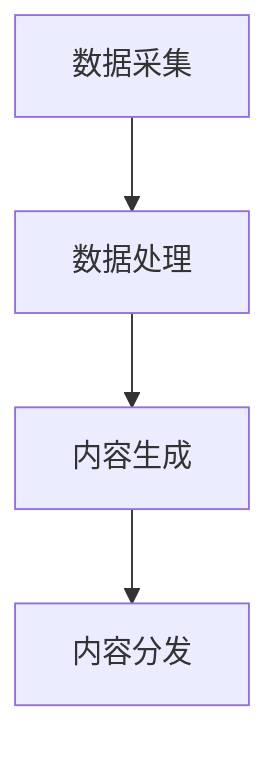

                 

### 文章标题：AIGC与边缘计算在智能家居中的融合

关键词：AIGC，边缘计算，智能家居，融合应用，算法原理，实战案例

摘要：本文将深入探讨人工智能生成内容（AIGC）与边缘计算在智能家居中的融合。通过详细阐述两者的基础理论、融合原理、应用案例以及未来趋势，本文旨在为读者提供全面的技术解析和实践指南，助力智能家居的智能化发展。

### 基础理论

#### AIGC基础

**1.1 AIGC概述**

人工智能生成内容（AIGC）是指通过人工智能技术生成各种类型的内容，包括文本、图像、视频等。AIGC涵盖了自然语言处理、图像生成、视频生成等多种技术，其核心目的是利用人工智能技术提升内容生成的效率和准确性。

**核心概念**：人工智能生成内容（AIGC）的定义与分类

- **文本生成**：基于自然语言处理技术生成文本内容，如自动写作、自动摘要等。
- **图像生成**：基于生成对抗网络（GAN）等技术生成高质量的图像。
- **视频生成**：结合图像生成和视频编辑技术，生成逼真的视频内容。

**1.2 AIGC的关键技术**

- **自然语言处理（NLP）**：NLP是AIGC的重要组成部分，涉及文本理解、文本生成、情感分析等多个领域。
- **图像生成**：通过生成对抗网络（GAN）等技术生成高质量的图像。
- **视频生成**：结合图像生成和视频编辑技术，生成逼真的视频内容。

**核心概念**：自然语言处理、图像生成、视频生成等技术的原理与联系

- **自然语言处理**：主要研究如何让计算机理解和生成人类语言。包括文本分类、情感分析、机器翻译等任务。
- **图像生成**：利用深度学习技术，通过训练大量的图像数据，生成新的图像。
- **视频生成**：结合图像生成和视频编辑技术，生成连续的视频内容。

**1.3 AIGC在智能家居中的应用场景**

- **智能语音助手**：通过自然语言处理技术，实现语音识别、语义理解和语音合成等功能，为用户提供交互式服务。
- **智能安防监控**：利用图像生成技术，实时分析监控视频，识别异常行为。
- **智能家电控制**：通过视频生成技术，实现远程控制家电，提供个性化的用户体验。

**核心概念**：智能家居中的AIGC应用模式与挑战

- **应用模式**：AIGC在智能家居中的应用主要包括智能语音助手、智能安防监控、智能家电控制等。
- **挑战**：包括数据隐私保护、计算资源限制、实时性要求高等。

#### 边缘计算基础

**2.1 边缘计算概述**

边缘计算是一种分布式计算架构，旨在将数据处理的近源（靠近数据源头）进行，从而降低延迟、提高响应速度和减少带宽消耗。边缘计算的核心思想是将部分计算任务从云端转移到网络边缘，如物联网设备、基站等。

**核心概念**：边缘计算的定义、优势与挑战

- **定义**：边缘计算是一种分布式计算架构，旨在将数据处理的近源（靠近数据源头）进行，从而降低延迟、提高响应速度和减少带宽消耗。
- **优势**：降低延迟、提高响应速度、减少带宽消耗。
- **挑战**：计算资源有限、安全性问题、管理复杂性等。

**2.2 边缘计算架构**

边缘计算架构包括边缘设备、边缘网关和云端，三者协同工作，实现数据处理和服务的优化。

**核心概念**：边缘设备、边缘网关、云端的协同工作原理

- **边缘设备**：如智能家电、智能摄像头等，负责数据的采集和处理。
- **边缘网关**：作为边缘设备和云端之间的桥梁，负责数据传输和协同处理。
- **云端**：提供强大的计算能力和数据存储能力，支持边缘计算任务的高效执行。

**2.3 边缘计算在网络协议和通信技术中的应用**

边缘计算在网络协议和通信技术中的应用，如物联网协议、5G网络等，为边缘计算提供了有效的技术支持。

**核心概念**：物联网协议、5G网络在边缘计算中的应用

- **物联网协议**：如MQTT、CoAP等，支持边缘设备和云端的通信。
- **5G网络**：提供高速、低延迟的网络连接，支持边缘计算任务的实时处理。

### 融合实践

#### AIGC与边缘计算的融合原理

**3.1 融合框架**

AIGC与边缘计算的融合框架包括数据采集、数据处理、内容生成和内容分发四个主要环节。

**核心算法**：AIGC与边缘计算融合的架构设计

**3.2 融合优势与挑战**

融合AIGC与边缘计算，可以带来性能提升、安全性和隐私保护等方面的优势，同时也面临一定的挑战。

**核心算法**：融合带来的性能提升、安全性和隐私保护等问题

- **优势**：降低延迟、提高响应速度、减少带宽消耗、增强数据安全性。
- **挑战**：计算资源限制、数据隐私保护、实时数据处理等。

**3.3 融合关键技术**

融合AIGC与边缘计算的关键技术包括边缘推理、实时数据处理、离线训练与在线推理的结合等。

**核心算法**：边缘推理、实时数据处理、离线训练与在线推理的结合

- **边缘推理**：在边缘设备上执行推理任务，降低对云端资源的依赖。
- **实时数据处理**：利用边缘计算技术，实时处理大量数据，提高系统响应速度。
- **离线训练与在线推理**：结合离线训练和在线推理，实现AIGC模型的持续优化和实时应用。

#### 智能家居中的AIGC应用案例

**4.1 智能家居系统概述**

智能家居系统通常包括智能语音助手、智能安防监控、智能家电控制等多个模块，实现家庭自动化和智能化。

**核心概念**：智能家居系统的架构、组件与工作流程

- **架构**：智能家居系统通常采用分布式架构，包括边缘设备、边缘网关和云端。
- **组件**：主要包括传感器、智能设备、智能网关和云平台。
- **工作流程**：数据采集、数据处理、内容生成和内容分发。

**4.2 案例一：智能语音助手**

智能语音助手是智能家居系统的重要组成部分，通过自然语言处理技术，实现语音识别、语义理解和语音合成等功能。

**项目实战**：系统架构、开发环境搭建、代码实现与解读

- **系统架构**：包括语音识别模块、语义理解模块、语音合成模块和用户交互模块。
- **开发环境搭建**：选择合适的开发工具和框架，如ESP8266、ESP32等硬件平台，以及TensorFlow Lite等机器学习框架。
- **代码实现与解读**：实现语音识别、语义理解和语音合成等功能，并进行性能优化和调试。

**4.3 案例二：智能安防监控**

智能安防监控通过图像生成技术，实时分析监控视频，识别异常行为，提高家庭安全。

**项目实战**：系统架构、实时数据处理、边缘推理实现

- **系统架构**：包括视频采集模块、边缘推理模块、报警模块和用户交互模块。
- **实时数据处理**：利用边缘计算技术，实时处理监控视频数据，降低对云端资源的依赖。
- **边缘推理实现**：在边缘设备上部署图像识别模型，实现实时视频分析。

**4.4 案例三：智能家电控制**

智能家电控制通过视频生成技术，实现远程控制家电，提供个性化的用户体验。

**项目实战**：智能设备连接、边缘计算应用、用户体验优化

- **智能设备连接**：利用Wi-Fi、蓝牙等无线通信技术，实现智能设备的连接和控制。
- **边缘计算应用**：在边缘设备上执行视频生成任务，提高系统响应速度和稳定性。
- **用户体验优化**：通过用户行为分析，优化家电控制界面和功能，提高用户满意度。

#### 边缘计算在智能家居中的部署与优化

**5.1 部署策略**

边缘计算在智能家居中的部署策略包括边缘设备选择、边缘网关部署和云端资源分配等。

**核心算法**：边缘计算资源调度、负载均衡策略

- **边缘设备选择**：根据应用需求和性能要求，选择合适的边缘设备。
- **边缘网关部署**：合理部署边缘网关，确保数据传输的稳定性和可靠性。
- **云端资源分配**：根据任务需求和资源限制，合理分配云端资源。

**5.2 性能优化**

边缘计算在智能家居中的性能优化包括缓存策略、网络优化和资源复用技术等。

**核心算法**：缓存策略、网络优化、资源复用技术

- **缓存策略**：利用缓存技术，减少数据访问延迟，提高系统性能。
- **网络优化**：优化网络传输路径，降低网络延迟和带宽消耗。
- **资源复用技术**：通过资源复用，提高边缘设备的利用率，降低系统成本。

**5.3 安全性与隐私保护**

边缘计算在智能家居中的安全性与隐私保护包括数据加密、访问控制和隐私保护机制等。

**核心算法**：数据加密、访问控制、隐私保护机制

- **数据加密**：利用加密技术，保护数据在传输和存储过程中的安全性。
- **访问控制**：通过访问控制策略，限制对数据的非法访问。
- **隐私保护机制**：利用隐私保护技术，保护用户的隐私数据。

### 未来的AIGC与边缘计算融合趋势

**6.1 技术发展展望**

未来的AIGC与边缘计算融合将朝着技术突破、应用前景与挑战等方向发展。

**核心概念**：未来的技术突破、应用前景与挑战

- **技术突破**：包括更高效的算法、更强大的计算能力、更安全的隐私保护技术等。
- **应用前景**：在智能家居、智能医疗、智能交通等领域的广泛应用。
- **挑战**：包括计算资源限制、数据隐私保护、实时数据处理等。

**6.2 智能家居行业的发展趋势**

智能家居行业的发展趋势包括市场增长、用户需求变化、技术融合等。

**核心概念**：智能家居市场的增长、用户需求的变化

- **市场增长**：随着技术的进步和用户需求的提升，智能家居市场将持续增长。
- **用户需求变化**：用户对智能家居产品的需求将更加个性化和智能化。

**6.3 AIGC与边缘计算的未来融合模式**

未来的AIGC与边缘计算融合模式将朝着更加智能化、个性化和高效化的方向发展。

**核心算法**：预测未来融合技术的发展路径

- **智能化**：利用人工智能技术，实现智能家居系统的智能化升级。
- **个性化**：根据用户行为数据，提供个性化的智能家居服务。
- **高效化**：利用边缘计算技术，提高智能家居系统的响应速度和稳定性。

### 总结与展望

AIGC与边缘计算在智能家居中的融合，为智能家居的智能化发展带来了新的机遇和挑战。通过深入探讨两者的基础理论、融合原理、应用案例和未来趋势，本文为读者提供了全面的技术解析和实践指南。未来，随着技术的不断进步，AIGC与边缘计算在智能家居中的融合将迎来更加广阔的发展空间。

**作者：AI天才研究院/AI Genius Institute & 禅与计算机程序设计艺术 /Zen And The Art of Computer Programming**

