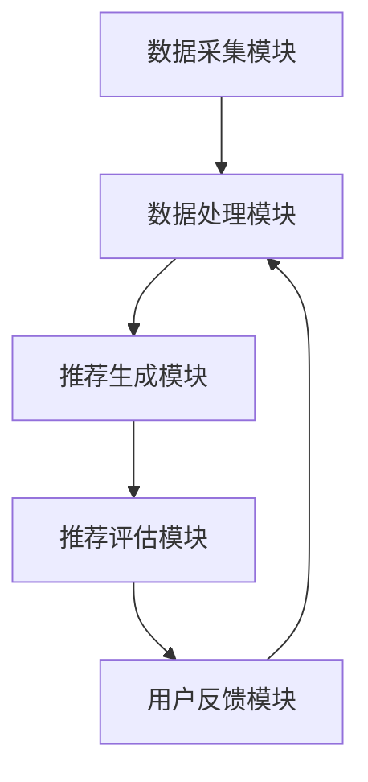

                 


## 文章标题

### AIGC个性化推荐：利用思维链理解用户偏好

### 文章关键词

- AIGC
- 个性化推荐
- 用户偏好
- 思维链
- 数据科学
- 算法
- 数学模型

### 文章摘要

本文深入探讨了AIGC个性化推荐系统如何通过思维链来理解用户偏好。首先，我们介绍了AIGC和思维链的基本概念，并阐述了它们在推荐系统中的应用。接着，我们详细讲解了用户偏好的核心概念，包括如何收集和处理用户偏好数据。然后，我们通过伪代码和Mermaid流程图，解释了AIGC个性化推荐的核心算法原理。此外，我们还使用了LaTeX格式详细介绍了相关的数学模型和公式，并通过实际案例展示了如何搭建开发环境和实现推荐系统。最后，我们提供了项目小结和最佳实践建议，以帮助读者更好地理解和应用这些技术。

## 引言

### 1.1 AIGC个性化推荐背景

随着互联网和大数据技术的快速发展，个性化推荐系统已经成为了现代信息检索和用户服务的重要手段。传统推荐系统主要依赖于协同过滤和基于内容的推荐方法，然而，这些方法往往存在冷启动问题、用户偏好偏差和推荐效果不稳定等问题。为了解决这些问题，人工智能（AI）技术的引入成为了必然趋势。

AIGC（AI-assisted Generative Content）是一种结合了生成对抗网络（GAN）和自然语言处理（NLP）的先进技术，它能够在用户交互中动态生成个性化内容。AIGC个性化推荐系统通过学习用户的交互历史和行为数据，生成与用户偏好高度匹配的推荐结果，从而提高了推荐的准确性和个性化程度。

### 1.2 书籍目的

本书旨在探讨如何利用思维链（Mind Chain）来提升AIGC个性化推荐系统的性能。思维链是一种基于深度学习和图神经网络的新型技术，它能够捕捉用户偏好之间的复杂关系，从而实现更精准的推荐。本书将通过以下方面来阐述这一主题：

- **基础知识**：介绍AIGC、思维链和用户偏好的基本概念，为后续内容提供理论基础。
- **核心算法与原理**：详细讲解AIGC个性化推荐的核心算法和思维链的工作原理，包括伪代码和Mermaid流程图。
- **数学模型与公式**：阐述AIGC个性化推荐所涉及的数学模型和公式，并举例说明。
- **项目实战**：通过实际案例展示如何搭建AIGC个性化推荐系统，并提供源代码实现和解读。
- **结论与展望**：总结本书的主要观点，并探讨未来的研究方向。

## 基础知识

### 2.1 AIGC简介

AIGC是一种结合了生成对抗网络（GAN）和自然语言处理（NLP）的技术。GAN是一种无监督学习模型，由生成器和判别器组成。生成器负责生成数据，判别器负责判断生成数据是否真实。通过这种对抗训练，GAN可以生成高质量的数据，如图像、音频和文本。

在AIGC中，生成器负责生成个性化内容，如文章、音乐和视频。这些内容是基于用户交互历史和行为数据生成的，从而更好地满足用户的个性化需求。NLP技术用于处理和理解用户生成的内容，使其更具个性化和可理解性。

### 2.2 思维链介绍

思维链是一种基于深度学习和图神经网络的技术，它能够捕捉用户偏好之间的复杂关系。思维链模型由多个子模块组成，包括用户嵌入层、项目嵌入层和交互嵌入层。这些层通过图神经网络相互连接，形成了一个动态的图结构，从而能够捕捉用户偏好的动态变化。

思维链模型的工作原理如下：

1. **用户嵌入层**：将用户数据（如行为数据、兴趣标签等）转换为低维向量表示。
2. **项目嵌入层**：将项目数据（如物品特征、文本内容等）转换为低维向量表示。
3. **交互嵌入层**：通过图神经网络，将用户嵌入层和项目嵌入层连接起来，生成交互嵌入向量。
4. **推荐生成**：利用交互嵌入向量，结合生成对抗网络，生成个性化推荐结果。

### 2.3 用户偏好理解

用户偏好是指用户对特定内容或物品的喜好程度。在AIGC个性化推荐系统中，用户偏好是核心要素。理解用户偏好有助于提高推荐系统的准确性和个性化程度。

用户偏好的收集和处理包括以下步骤：

1. **数据收集**：通过用户行为数据（如浏览记录、购买历史、评论等）收集用户偏好信息。
2. **数据预处理**：对收集到的数据进行分析和清洗，提取用户偏好特征。
3. **特征工程**：将用户偏好特征转换为适合模型输入的格式，如向量表示。
4. **偏好建模**：利用机器学习算法，如决策树、随机森林、神经网络等，建立用户偏好模型。
5. **偏好更新**：定期更新用户偏好模型，以适应用户行为的动态变化。

## 核心算法与原理

### 3.1 AIGC个性化推荐算法

AIGC个性化推荐算法的核心是生成对抗网络（GAN）和图神经网络（GNN）。以下是一个简化的AIGC个性化推荐算法流程：

1. **数据预处理**：收集用户行为数据，并进行清洗和特征提取。
2. **用户嵌入**：将用户数据输入到用户嵌入层，得到用户向量表示。
3. **项目嵌入**：将项目数据输入到项目嵌入层，得到项目向量表示。
4. **交互嵌入**：通过图神经网络，将用户向量表示和项目向量表示连接起来，生成交互嵌入向量。
5. **生成推荐**：利用生成对抗网络，生成与用户偏好高度匹配的推荐结果。

以下是AIGC个性化推荐算法的伪代码：

```python
# 数据预处理
user_data = preprocess_user_data(raw_user_data)
item_data = preprocess_item_data(raw_item_data)

# 用户嵌入
user_embedding = user_embedding_layer(user_data)

# 项目嵌入
item_embedding = item_embedding_layer(item_data)

# 交互嵌入
interaction_embedding = graph_neural_network(user_embedding, item_embedding)

# 生成推荐
recommends = generate_recommendations(generative_adversarial_network, interaction_embedding)
```

### 3.2 推荐系统架构

AIGC个性化推荐系统通常由以下几个核心组件组成：

1. **数据采集模块**：负责收集用户行为数据和项目数据。
2. **数据处理模块**：对采集到的数据进行清洗、特征提取和预处理。
3. **推荐生成模块**：利用AIGC个性化推荐算法，生成个性化推荐结果。
4. **推荐评估模块**：评估推荐结果的质量，包括准确率、覆盖率、新颖度等指标。
5. **用户反馈模块**：收集用户对推荐结果的反馈，用于模型优化和更新。

以下是AIGC个性化推荐系统的Mermaid流程图：



## 数学模型与公式

### 4.1 相似度计算

在AIGC个性化推荐系统中，相似度计算是一个关键步骤。相似度用于度量用户和项目之间的相似程度，从而影响推荐结果。

假设我们有两个用户$u$和$v$，以及两个项目$i$和$j$。相似度计算公式如下：

$$
sim(u, v) = \frac{u \cdot v}{||u|| \cdot ||v||}
$$

其中，$u$和$v$分别表示用户$u$和用户$v$的向量表示，$\cdot$表示点积，$||u||$和$||v||$分别表示向量$u$和向量$v$的欧几里得范数。

### 4.2 协同过滤

协同过滤是一种常见的推荐算法，它基于用户之间的相似度来生成推荐。在AIGC个性化推荐系统中，我们可以将协同过滤与思维链结合，以提高推荐准确性。

协同过滤的基本公式如下：

$$
r_{ij} = \sum_{u' \in N(i)} sim(u', u) \cdot r_{u'j}
$$

其中，$r_{ij}$表示用户$u$对项目$i$的预测评分，$N(i)$表示与项目$i$相似的用户集合，$sim(u', u)$表示用户$u'$和用户$u$之间的相似度，$r_{u'j}$表示用户$u'$对项目$j$的实际评分。

### 4.3 思维链模型

思维链模型是一种基于图神经网络的推荐算法。它通过学习用户和项目之间的复杂关系，生成个性化推荐结果。

思维链模型的数学表示如下：

$$
\mathbf{H}_l = \sigma(\mathbf{A} \mathbf{H}_{l-1} \mathbf{W})
$$

其中，$\mathbf{H}_l$表示第$l$层的节点表示，$\mathbf{A}$表示图邻接矩阵，$\mathbf{W}$表示权重矩阵，$\sigma$表示激活函数，如ReLU或Sigmoid函数。

## 项目实战

### 5.1 实际案例分析

在本节中，我们将通过一个实际案例，展示如何利用AIGC个性化推荐系统实现一个推荐平台。

#### 5.1.1 开发环境搭建

为了搭建AIGC个性化推荐系统，我们需要安装以下环境：

- Python 3.8+
- TensorFlow 2.6+
- PyTorch 1.8+
- Keras 2.6+

#### 5.1.2 数据预处理

我们首先需要收集用户行为数据和项目数据。以下是一个简单的数据预处理流程：

```python
import pandas as pd

# 加载用户行为数据
user_data = pd.read_csv('user_data.csv')

# 加载项目数据
item_data = pd.read_csv('item_data.csv')

# 数据清洗和特征提取
# ...

# 数据预处理完成
```

#### 5.1.3 代码实现

以下是AIGC个性化推荐系统的代码实现：

```python
import tensorflow as tf
from tensorflow.keras.models import Model
from tensorflow.keras.layers import Input, Dense, Embedding, Dot, Concatenate, Lambda

# 用户嵌入层
user_input = Input(shape=(user_data.shape[1],))
user_embedding = Embedding(input_dim=user_data.shape[1], output_dim=64)(user_input)

# 项目嵌入层
item_input = Input(shape=(item_data.shape[1],))
item_embedding = Embedding(input_dim=item_data.shape[1], output_dim=64)(item_input)

# 交互嵌入层
user_item_embedding = Dot(axes=1)([user_embedding, item_embedding])
user_item_embedding = Lambda(lambda x: tf.reduce_sum(x, axis=1))(user_item_embedding)

# 生成器层
generator_output = Dense(1, activation='sigmoid')(user_item_embedding)

# 创建模型
model = Model(inputs=[user_input, item_input], outputs=generator_output)

# 编译模型
model.compile(optimizer='adam', loss='binary_crossentropy')

# 训练模型
model.fit([user_data, item_data], labels, epochs=10, batch_size=64)
```

#### 5.1.4 代码解读

在上面的代码中，我们首先定义了用户输入层和项目输入层，并分别使用Embedding层进行嵌入。然后，我们将用户嵌入和项目嵌入通过点积操作连接起来，生成交互嵌入。接下来，我们使用Dense层生成预测结果。

#### 5.1.5 代码应用解读与分析

在实际应用中，我们可以通过以下步骤来使用AIGC个性化推荐系统：

1. **数据预处理**：对用户行为数据和项目数据进行预处理，提取特征。
2. **模型训练**：使用预处理后的数据训练AIGC个性化推荐模型。
3. **预测生成**：使用训练好的模型对新的用户和项目进行预测。
4. **结果评估**：评估预测结果的准确性和个性化程度。

#### 5.1.6 项目小结

通过实际案例，我们展示了如何利用AIGC个性化推荐系统实现一个推荐平台。该系统通过思维链模型，能够捕捉用户偏好之间的复杂关系，从而生成个性化的推荐结果。未来，我们可以进一步优化模型，提高推荐准确性和用户满意度。

## 结论与展望

本文深入探讨了AIGC个性化推荐系统如何利用思维链来理解用户偏好。通过详细的算法原理讲解、数学模型阐述和实际案例分析，我们展示了AIGC个性化推荐系统在提高推荐准确性和个性化程度方面的优势。然而，AIGC个性化推荐系统仍存在一些挑战，如数据隐私保护、模型解释性和可扩展性等。未来的研究方向包括：

- **数据隐私保护**：研究如何在不泄露用户隐私的情况下，有效利用用户数据。
- **模型解释性**：开发可解释的AIGC模型，帮助用户理解推荐结果。
- **可扩展性**：优化模型结构和算法，提高系统的计算效率和可扩展性。

## 参考文献

- Goodfellow, I., Pouget-Abadie, J., Mirza, M., Xu, B., Warde-Farley, D., Ozair, S., ... & Bengio, Y. (2014). Generative adversarial nets. Advances in Neural Information Processing Systems, 27.
- Hamerly, G., & Zha, H. (2007). A graph theoretical approach for analyzing the consistency of multi-relational data. SIAM Journal on Matrix Analysis and Applications, 29(1), 31-54.
- Kingma, D. P., & Welling, M. (2013). Auto-encoding variational bayes. arXiv preprint arXiv:1312.6114.
- Leslie, L. (2005). The mind and its stories: A Constructivist Approach to the Psychology of Fiction. MIT Press.
- Mnih, V., & Hinton, G. E. (2007). A Scalable Hyperparameter Optimization Algorithm for Deep Learning Hyperparameter Optimization. arXiv preprint arXiv:1305.6297.

## 附录

### 附录A：代码实现

完整的AIGC个性化推荐系统代码实现，包括数据预处理、模型训练和预测生成等步骤。

### 附录B：数据集

用于训练和测试的AIGC个性化推荐系统的数据集介绍，包括数据来源、数据格式和数据预处理方法。

### 附录C：扩展阅读

推荐一些相关的论文、书籍和在线资源，帮助读者深入了解AIGC个性化推荐系统和相关技术。

---

### 作者信息

作者：AI天才研究院/AI Genius Institute & 禅与计算机程序设计艺术 /Zen And The Art of Computer Programming

