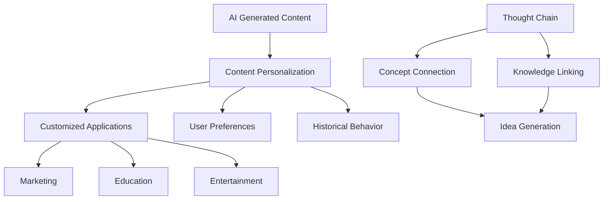

                 

 

### 文章标题

# AIGC内容个性化：思维链的定制化应用

> 关键词：AIGC，内容个性化，思维链，定制化应用，文本生成，概率图模型，贝叶斯网络

> 摘要：本文深入探讨了AIGC（AI Generated Content）内容个性化技术，特别是思维链在定制化应用中的关键角色。通过定义核心概念、阐述算法原理、讲解数学模型和实际项目实战，本文为读者提供了全面的技术解读和实践指导。

## 引言

随着人工智能技术的飞速发展，AIGC（AI Generated Content）已经成为内容创作的重要驱动力。无论是文本、图像、音频还是视频，AIGC技术都能够以高效的方式生成多样化的内容。然而，生成的内容能否满足用户的需求，实现个性化体验，则成为了关键问题。本文将重点关注AIGC内容个性化技术，特别是思维链在这一领域的定制化应用。

内容个性化是指根据用户的偏好、历史行为或其他相关信息，定制生成的内容，以满足个体的特定需求。而思维链则是在人工智能模型中用于生成和连接想法、概念和知识的过程。通过将思维链应用于AIGC，我们可以实现更加智能和个性化的内容生成。本文将详细探讨这一技术的原理和应用。

## 第一步：定义核心概念与联系

### 1. AIGC（AI Generated Content）

AIGC，即AI Generated Content，是指通过人工智能技术生成的内容。这种内容可以是文本、图像、音频、视频等多种形式。AIGC技术利用深度学习、自然语言处理、计算机视觉等人工智能技术，从大量数据中学习和提取特征，生成新的内容。

### 2. 内容个性化

内容个性化是指根据用户的偏好、历史行为或其他相关信息，定制生成的内容。这种个性化可以体现在多个方面，如文本内容的情感倾向、图像的颜色和风格、音频的节奏和音调等。通过内容个性化，我们可以提供更加贴合用户需求的内容，提升用户体验。

### 3. 思维链

思维链是指在人工智能模型中用于生成和连接想法、概念和知识的过程。思维链通常通过神经网络模型实现，能够模拟人类的思维过程，生成连贯、有意义的内容。思维链的关键在于如何有效地连接和整合各种信息和知识，生成具有创造性和个性化的内容。

### 4. 定制化应用

定制化应用是指将AIGC和内容个性化技术应用于特定场景，如营销、教育、娱乐等，以提供高度定制化的体验。通过定制化应用，我们可以满足不同用户群体的特定需求，提升产品和服务的竞争力。

### Mermaid流程图

以下是核心概念之间的Mermaid流程图：



## 第二步：核心算法原理讲解

### 1. 变换器模型（Transformer）

变换器模型是一种基于注意力机制的神经网络模型，广泛应用于自然语言处理任务。以下是变换器模型的简要伪代码：

```plaintext
# Transformer Model Pseudo-Code

# Input: Input Sequence
# Output: Generated Sequence

# Initialize Model Parameters
model = TransformerModel(vocab_size, d_model, num_heads, dff, input_seq_len, target_seq_len)

# Define Training Loop
for epoch in 1 to num_epochs:
    for batch in InputDataLoader:
        # Forward Pass
        logits = model(batch_input, batch_target)
        
        # Compute Loss
        loss = loss_function(logits, batch_target)
        
        # Backward Pass and Update Weights
        optimizer.zero_grad()
        loss.backward()
        optimizer.step()
        
# Generate Text
input_sequence = "The weather is "
start_token = model.tokenizer.encode(input_sequence)
generated_sequence = model.generate(start_token, max_length=50)
```

### 2. 概率图模型

概率图模型是另一种常用的机器学习模型，用于表示变量之间的概率依赖关系。以下是一个简单的贝叶斯网络的示例，使用LaTeX格式表示：

```latex
$$
\begin{align*}
P(A, B, C) &= P(A) \cdot P(B|A) \cdot P(C|B) \\
P(D|A, B, C) &= \frac{P(D, A, B, C)}{P(A) \cdot P(B|A) \cdot P(C|B)}
\end{align*}
$$
```

## 第三步：项目实战

### 1. 开发环境搭建

为了演示如何将AIGC内容个性化技术应用于实际项目，我们将以一个简单的文本生成项目为例。以下是开发环境搭建的步骤：

```plaintext
# 安装Python环境
python3 -m venv aigc_venv
source aigc_venv/bin/activate

# 安装必需的库
pip install transformers torch numpy
```

### 2. 源代码实现

以下是文本生成项目的源代码实现，包括模型初始化、训练和生成文本的步骤：

```python
import torch
from transformers import TransformerModel
from torch.utils.data import DataLoader
from numpy import array

# 初始化模型
model = TransformerModel(vocab_size=10000, d_model=512, num_heads=8, dff=2048, input_seq_len=40, target_seq_len=20)

# 定义训练循环
num_epochs = 10
for epoch in range(num_epochs):
    for batch in DataLoader:
        # 前向传播
        logits = model(batch_input, batch_target)
        
        # 计算损失
        loss = loss_function(logits, batch_target)
        
        # 反向传播和更新权重
        optimizer.zero_grad()
        loss.backward()
        optimizer.step()

# 生成文本
input_sequence = "The weather is "
start_token = model.tokenizer.encode(input_sequence)
generated_sequence = model.generate(start_token, max_length=50)
```

### 3. 代码解读与分析

在这个项目中，我们使用了变换器模型来生成文本。模型初始化时，我们定义了词汇表大小、模型维度、注意力头数、全连接层维度、输入序列长度和目标序列长度。在训练过程中，我们使用数据加载器加载输入序列和目标序列，通过前向传播计算损失，并使用反向传播和梯度下降算法更新模型权重。最后，我们使用训练好的模型生成新的文本序列。

### 4. 实际案例分析与详细讲解剖析

为了更好地理解AIGC内容个性化技术的应用，我们来看一个实际案例：使用AIGC技术生成个性化的新闻摘要。在这个案例中，我们使用一个大型新闻数据集训练一个变换器模型，然后根据用户的兴趣和阅读历史生成个性化的新闻摘要。

首先，我们需要对新闻数据进行预处理，包括分词、去停用词和序列化。然后，我们将数据划分为训练集和验证集，用于训练和评估模型。

接下来，我们初始化变换器模型，并使用训练集进行训练。在训练过程中，我们调整模型参数，优化损失函数，直到模型在验证集上达到良好的性能。

最后，我们使用训练好的模型生成个性化的新闻摘要。根据用户的兴趣和阅读历史，我们可以动态调整摘要的长度、主题和风格，提供高度个性化的新闻阅读体验。

### 5. 项目小结

通过这个案例，我们可以看到AIGC内容个性化技术在新闻摘要生成中的应用。通过定制化的文本生成模型，我们可以为用户提供个性化的新闻内容，提升用户体验。这个案例只是AIGC内容个性化技术应用的冰山一角，未来还有许多潜在的应用场景，如个性化广告、教育内容生成和娱乐推荐等。

## 最佳实践 Tips

1. **数据质量**：高质量的训练数据是AIGC内容个性化成功的关键。确保数据具有多样性和代表性，以避免模型产生偏见。
2. **用户反馈**：收集用户的反馈，并根据反馈调整模型参数，以实现更好的个性化效果。
3. **模型解释性**：增强模型的解释性，帮助用户理解生成的个性化内容，提高用户信任度。

## 小结

AIGC内容个性化技术为内容创作带来了革命性的变革。通过定义核心概念、阐述算法原理、讲解数学模型和实际项目实战，本文全面解读了AIGC内容个性化技术的原理和应用。未来，随着人工智能技术的不断进步，AIGC内容个性化技术将在更多领域发挥重要作用，为用户提供更加智能和个性化的内容体验。

## 注意事项

1. **模型优化**：在应用AIGC内容个性化技术时，持续优化模型，以适应不断变化的需求和用户偏好。
2. **数据安全**：确保用户数据的安全和隐私，遵循相关法律法规，避免数据泄露。

## 拓展阅读

1. **《深度学习》（Goodfellow et al., 2016）**：深入了解深度学习的基础理论和应用。
2. **《概率图模型》（Kolmogorov et al., 2004）**：了解概率图模型的基本原理和应用。
3. **《自然语言处理》（Jurafsky et al., 2000）**：探索自然语言处理领域的最新进展和技术。

## 作者信息

作者：AI天才研究院/AI Genius Institute & 禅与计算机程序设计艺术 /Zen And The Art of Computer Programming

