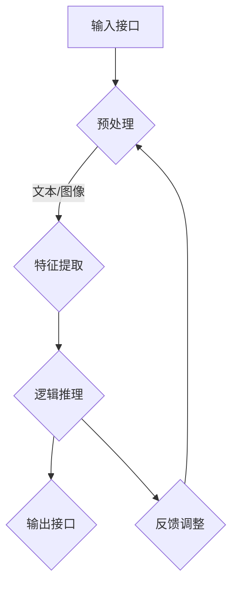

                 

### 文章标题

# AIGC内容创作中的思维链应用

### 文章关键词

- AIGC
- 内容创作
- 思维链
- 人工智能
- 自然语言处理
- 图像生成

### 文章摘要

本文将深入探讨AIGC（人工智能生成内容）在内容创作中的实际应用，特别是如何结合思维链技术提升内容创作的质量和效率。文章首先介绍了AIGC的基础知识，然后详细解析了思维链的原理和架构，接着通过多个实践案例展示了AIGC和思维链在文本和图像内容创作中的具体应用。文章还分析了AIGC应用面临的挑战，并对未来的发展趋势进行了展望。通过本文，读者将全面了解AIGC技术及其在内容创作领域的广泛应用前景。

---

### 目录

1. **引言**
2. **AIGC技术基础**
   - 2.1 AIGC的定义与背景
   - 2.2 AIGC的核心技术
   - 2.3 AIGC的应用领域
3. **思维链原理与架构**
   - 3.1 思维链的定义与作用
   - 3.2 思维链的类型与特点
   - 3.3 思维链的架构解析
4. **AIGC内容创作的实践案例**
   - 4.1 文本内容创作案例
   - 4.2 图像内容创作案例
5. **AIGC应用的挑战与未来趋势**
   - 5.1 应用挑战
   - 5.2 未来趋势
6. **总结与展望**
7. **参考文献**

---

### 1. 引言

随着人工智能（AI）技术的快速发展，内容创作领域迎来了新的变革。传统的手动内容创作方式在速度和多样性上存在一定的限制，而人工智能生成内容（AIGC）的出现，为内容创作带来了全新的可能性。AIGC利用深度学习、生成对抗网络（GAN）、变分自编码器（VAE）等技术，能够自动生成高质量的文本、图像、音频等多种形式的内容。然而，单纯依赖技术手段进行内容创作仍存在一定的局限性，无法完全模拟人类的创造性思维过程。为了解决这个问题，思维链技术被引入到AIGC内容创作中，旨在通过模拟人类思维过程，提升内容创作的质量和效率。

思维链是一种模拟人类思维过程的计算机模型，能够通过分析、推理、联想等思维方式，生成具有逻辑性和创造性的内容。将思维链与AIGC技术相结合，不仅能够提升内容的多样性和质量，还能增强内容之间的关联性，形成更加完整和连贯的内容体系。本文将围绕AIGC内容创作中的思维链应用，从基础理论到实际应用，深入探讨这一领域的最新进展。

本文的结构安排如下：

- **第1章 引言**：介绍AIGC和思维链的概念及其在内容创作中的应用背景。
- **第2章 AIGC技术基础**：详细解析AIGC的定义、核心技术及其应用领域。
- **第3章 思维链原理与架构**：探讨思维链的定义、类型、特点及其架构。
- **第4章 AIGC内容创作的实践案例**：通过文本和图像内容创作的具体案例，展示AIGC和思维链的应用效果。
- **第5章 AIGC应用的挑战与未来趋势**：分析AIGC应用面临的挑战及未来的发展趋势。
- **第6章 总结与展望**：总结全文内容，展望AIGC内容创作的未来前景。

通过本文的阅读，读者将全面了解AIGC和思维链在内容创作中的应用，掌握相关技术原理和实践方法，为未来的研究和工作提供有价值的参考。

### 2.1 AIGC的定义与背景

人工智能生成内容（Artificial Intelligence Generated Content，简称AIGC）是指利用人工智能技术，尤其是深度学习算法，自动生成具有人类创造性的内容。这些内容可以是文本、图像、音频、视频等多种形式，广泛应用于媒体、广告、教育、娱乐等多个领域。

AIGC技术的发展可以追溯到深度学习的兴起。深度学习作为一种重要的机器学习技术，通过模拟人脑神经网络结构，能够从大量数据中自动提取特征，进行模式识别和预测。生成对抗网络（Generative Adversarial Networks，GAN）和变分自编码器（Variational Autoencoder，VAE）是AIGC技术中最为重要的两种模型。

生成对抗网络（GAN）由两部分组成：生成器和判别器。生成器的目标是生成尽可能真实的数据，而判别器的目标是区分生成数据与真实数据。通过这种对抗训练，生成器不断优化生成数据的质量，最终能够生成高度逼真的图像、音频和文本。

变分自编码器（VAE）则通过概率模型生成数据。它由编码器和解码器组成，编码器将输入数据映射到一个隐含空间，解码器则从隐含空间生成输出数据。VAE的优势在于能够生成多样化的数据，并且在生成过程中保持输入数据的概率分布。

除了GAN和VAE，AIGC技术还包括文本生成模型，如生成式预训练变换器（Generative Pre-trained Transformer，GPT）。GPT通过大量的文本数据进行预训练，能够生成连贯、具有逻辑性的文本。GPT-3更是以其强大的文本生成能力，在多个自然语言处理任务中取得了显著的成果。

AIGC技术的应用领域非常广泛。在媒体领域，AIGC可以用于生成新闻报道、视频内容、广告文案等，大大提高了内容创作的效率和多样性。在广告领域，AIGC能够根据用户行为数据生成个性化的广告内容，提高广告投放的效果。在教育领域，AIGC可以生成教学素材、辅导材料，帮助学生更好地理解和掌握知识。在娱乐领域，AIGC可以用于生成虚拟角色、音乐、电影特效等，为用户带来更加丰富的娱乐体验。

总的来说，AIGC技术的发展为内容创作带来了全新的可能性，不仅能够提高内容创作的效率和质量，还能够开拓新的应用场景，为各个领域带来深刻的变革。

### 2.2 AIGC的核心技术

AIGC（人工智能生成内容）技术主要依赖于深度学习领域的几种核心算法，这些算法不仅构成了AIGC的技术基础，而且在各种应用场景中发挥了至关重要的作用。以下是AIGC技术中几种主要的核心算法及其原理：

**生成对抗网络（GAN）**

生成对抗网络（Generative Adversarial Networks，GAN）是由伊恩·古德费洛（Ian Goodfellow）等人于2014年提出的。GAN由两部分组成：生成器（Generator）和判别器（Discriminator）。生成器的目标是生成与真实数据高度相似的数据，而判别器的任务是区分生成数据与真实数据。两者之间进行一个对抗性的游戏，生成器不断优化其生成数据的质量，以欺骗判别器，而判别器则不断提升其识别能力。

- **生成器**：生成器的输入通常是随机噪声，通过一系列神经网络转换，生成与真实数据相似的数据。
- **判别器**：判别器的输入可以是真实数据或者生成数据，其目标是准确判断输入数据是真实的还是生成的。

GAN的训练过程是一个动态的过程，生成器和判别器不断地相互对抗、学习，最终生成器能够生成几乎无法区分于真实数据的高质量数据。

**变分自编码器（VAE）**

变分自编码器（Variational Autoencoder，VAE）是一种基于概率模型的生成模型，由查尔斯·杜森贝里（Charles Martin Dellios）等人于2013年提出。VAE旨在生成具有多样性的数据，同时保持输入数据的概率分布。

VAE由两部分组成：编码器（Encoder）和解码器（Decoder）。编码器将输入数据映射到一个隐含空间，并输出一个编码向量；解码器则从隐含空间生成输出数据。

- **编码器**：编码器的输入是数据，输出是一个编码向量，该向量能够捕获输入数据的特征。
- **解码器**：解码器的输入是编码向量，输出是重构的数据。

与GAN不同，VAE不涉及对抗性训练，而是通过优化损失函数来训练模型。VAE的优点在于能够生成多样化且符合输入数据概率分布的数据。

**文本生成模型**

文本生成模型是AIGC技术中的重要组成部分，尤其是基于生成式预训练变换器（Generative Pre-trained Transformer，GPT）的模型。GPT是由OpenAI开发的，基于变换器（Transformer）架构的深度学习模型，经过大规模的文本数据预训练，能够生成连贯、具有逻辑性的文本。

- **预训练**：GPT首先在大量文本数据上进行预训练，学习语言的统计规律和上下文关系。
- **微调**：在预训练的基础上，GPT可以通过微调适应特定的任务，如文本生成、摘要生成等。

GPT系列模型，特别是GPT-3，具有非常强大的文本生成能力。GPT-3的参数量达到1750亿，能够生成高质量的文章、对话、代码等多种形式的文本。

**算法原理**

1. **GAN算法原理**：
   - **损失函数**：GAN的损失函数通常由生成器的损失和判别器的损失组成。生成器的损失函数是使得判别器判断生成数据的概率接近1，而判别器的损失函数是使得判别器判断生成数据的概率接近0.5。
   - **优化策略**：GAN的训练过程是一个非稳定的过程，容易出现模式崩溃（mode collapse）等问题。因此，研究人员提出了一系列优化策略，如梯度惩罚、不同尺度的训练、以及自适应学习率等，以提高GAN的训练效果。

2. **VAE算法原理**：
   - **损失函数**：VAE的损失函数包括数据重构损失和KL散度损失。数据重构损失是测量生成数据与原始数据之间的差异，KL散度损失是测量编码器输出的编码向量和先验分布之间的差异。
   - **优化策略**：VAE通常采用变分贝叶斯的方法，通过优化损失函数来训练模型。

3. **GPT算法原理**：
   - **预训练目标**：GPT在预训练阶段的目标是最大化预测下一个词的概率，这通过自回归语言模型实现。
   - **微调目标**：在微调阶段，GPT通过最小化特定任务上的损失函数来优化模型。

**结论**

AIGC技术凭借其强大的生成能力和多样性，已经在多个领域取得了显著的应用成果。GAN、VAE和文本生成模型是AIGC技术中的核心算法，各自具有独特的优势和应用场景。通过深入理解和掌握这些算法原理，可以更好地发挥AIGC技术在内容创作中的潜力。

### 2.3 AIGC的应用领域

人工智能生成内容（AIGC）技术凭借其强大的生成能力和多样性，在多个领域展现了巨大的应用潜力。以下是AIGC技术在几个主要应用领域的具体应用：

**1. 媒体与广告**

在媒体领域，AIGC技术被广泛应用于内容创作。利用AIGC，新闻机构可以自动化生成新闻报道，从而提高内容生产和发布效率。例如，有些新闻网站使用AIGC生成财经新闻，通过对大量财经数据进行分析，自动生成详细的报告和新闻文章。此外，AIGC还可以用于生成视频内容，如电影预告片、广告片等，通过结合生成对抗网络（GAN）生成逼真的场景和角色，提升视觉效果。

在广告领域，AIGC技术同样发挥着重要作用。通过分析用户行为数据，AIGC可以生成个性化的广告内容，提高广告的投放效果。例如，电商网站可以根据用户的浏览历史和购买偏好，使用AIGC生成个性化的商品推荐文案和图像，吸引用户购买。

**2. 教育与娱乐**

在教育领域，AIGC技术可以生成个性化的教学素材和辅导材料，帮助学生更好地理解和掌握知识。例如，教育平台可以基于学生的学习记录，使用AIGC生成定制化的习题和解答，提供个性化的学习建议。

在娱乐领域，AIGC技术被广泛应用于虚拟角色生成、音乐创作、游戏剧情编写等方面。通过生成对抗网络（GAN），可以生成逼真的虚拟角色和场景，为游戏和虚拟现实（VR）提供丰富的内容。此外，AIGC还可以生成原创音乐，为电影、电视剧等娱乐作品提供背景音乐。

**3. 设计与艺术**

在设计与艺术领域，AIGC技术为创意设计提供了新的工具和灵感。例如，设计师可以使用AIGC生成独特的图案、色彩搭配和建筑模型，为产品设计、艺术创作提供多样化的选择。通过变分自编码器（VAE），设计师可以生成具有艺术风格的作品，如梵高风格的画作、毕加索风格的雕塑等。

**4. 医疗与健康**

在医疗领域，AIGC技术可以用于生成医学图像和诊断报告。例如，通过生成对抗网络（GAN），可以生成高质量的医学图像，辅助医生进行诊断和治疗。此外，AIGC还可以用于生成个性化的健康建议，如营养食谱、运动计划等，帮助用户保持健康。

**5. 金融与保险**

在金融与保险领域，AIGC技术被广泛应用于数据分析和风险管理。通过AIGC，金融机构可以自动化分析市场数据，预测市场趋势，制定投资策略。保险企业可以使用AIGC生成个性化的保险产品推荐，提高保险销售效率。

总的来说，AIGC技术在多个领域展现出了广泛的应用前景。随着技术的不断进步和应用的深入，AIGC将在更多领域发挥重要作用，为各行各业带来深刻的变革。

### 3.1 思维链的定义与作用

思维链是一种模拟人类思维过程的计算机模型，旨在通过分析和处理信息，生成具有逻辑性和创造性的内容。思维链的核心思想是通过连接一系列的思考节点，形成一个有序的思考路径，从而实现复杂问题的解决和信息的高效处理。

思维链的定义可以从以下几个方面进行理解：

1. **信息处理模型**：思维链是一种信息处理模型，它模拟了人类在思考过程中使用的逻辑关系和思维方式，如因果关系、类比推理、演绎推理等。通过这种模型，计算机可以像人类一样进行思考和决策。

2. **节点与路径**：思维链由一系列的思考节点组成，每个节点代表一个特定的信息或思考内容。节点之间通过关系连接，形成一条或多条思考路径。这些路径代表了思维链从起点到终点的思考过程。

3. **有序结构**：思维链强调信息的有序性，通过逻辑关系将各个节点连接起来，形成一个有序的思考结构。这种结构有助于提高思考的效率和准确性，使得信息处理更加直观和系统。

思维链在人工智能中的应用非常广泛，其主要作用包括：

1. **问题解决**：思维链可以用于解决复杂的问题，通过逐步分析和推理，找到最优的解决方案。在游戏、决策支持系统、智能客服等领域，思维链的应用显著提高了系统的决策能力和效率。

2. **知识表示**：思维链可以将复杂的知识以结构化的形式进行表示，使得知识更加易于理解和处理。在知识图谱、语义分析、问答系统等领域，思维链的应用有助于提升知识的表达和利用效率。

3. **内容创作**：思维链可以用于生成具有创造性和逻辑性的内容，如文本、图像、音乐等。通过模拟人类的思考过程，思维链能够生成丰富多样的内容，满足个性化创作需求。

4. **推理与预测**：思维链通过分析历史数据和现有信息，可以推断出可能的未来趋势和结果。在金融市场分析、天气预报、医疗诊断等领域，思维链的应用有助于提高预测的准确性和可靠性。

总之，思维链作为一种强大的信息处理模型，通过模拟人类思维过程，在人工智能领域展现了广泛的应用前景和巨大的潜力。它不仅能够提升系统的智能水平，还能够为人类带来更加高效和智能化的生活体验。

### 3.2 思维链的类型与特点

思维链作为一种模拟人类思维过程的计算机模型，有多种不同的类型，每种类型都有其独特的特点和应用场景。以下是几种常见的思维链类型及其特点：

**1. 逻辑思维链**

逻辑思维链是基于逻辑推理和因果关系的思维链，其主要特点是通过明确的逻辑关系来连接各个思考节点，形成严密的推理过程。逻辑思维链广泛应用于需要精确推理和逻辑判断的领域，如数学证明、编程逻辑和决策支持系统。

- **特点**：
  - **确定性**：逻辑思维链中的推理过程是确定的，每个步骤都是基于已知事实和逻辑规则进行的。
  - **结构化**：逻辑思维链具有高度的结构化特点，每个节点和连接都具有明确的逻辑关系，使得推理过程清晰、易于理解。

- **应用场景**：
  - **数学证明**：在数学领域，逻辑思维链可以用于自动生成数学证明，提高数学推理的效率。
  - **编程逻辑**：在编程中，逻辑思维链可以帮助程序员进行逻辑分析，发现代码中的逻辑错误和潜在问题。

**2. 类比思维链**

类比思维链是通过类比推理来模拟人类思维的另一种思维链类型。它通过将现有问题与已知问题进行类比，从已知问题的解决方案中提取灵感，用于解决新问题。

- **特点**：
  - **灵活性**：类比思维链具有较强的灵活性，它能够从多个不同的领域和问题中提取类比关系，为问题解决提供多样化的思路。
  - **经验依赖**：类比思维链依赖于丰富的经验和知识，只有当具有相似问题背景时，类比思维链才能发挥最佳效果。

- **应用场景**：
  - **设计创新**：在产品设计和工程领域，类比思维链可以帮助设计人员从类似的产品中获取灵感，创造出新的设计方案。
  - **法律推理**：在法律领域中，类比思维链可以用于比较不同案例的相似性和差异性，为法律决策提供依据。

**3. 演绎思维链**

演绎思维链是一种基于逻辑演绎的思维方式，它从一般性的前提推导出特定性的结论。演绎思维链的特点是推理过程具有高度的逻辑性和可预测性。

- **特点**：
  - **层次性**：演绎思维链具有清晰的层次结构，从高层次的规则推导出低层次的结论。
  - **严谨性**：演绎思维链依赖于严格的逻辑规则，每个推理步骤都必须符合逻辑规则，确保推理过程的正确性。

- **应用场景**：
  - **科学理论**：在科学研究领域，演绎思维链可以用于从理论假设推导出实验结果，验证科学理论的正确性。
  - **法律论证**：在法律领域中，演绎思维链可以帮助律师从法律规定推导出具体的法律意见，构建法律论证。

**4. 归纳思维链**

归纳思维链是通过从具体实例中归纳出一般性结论的思维方式。它与演绎思维链相反，是从特殊到一般，而不是从一般到特殊。

- **特点**：
  - **经验性**：归纳思维链依赖于大量的实例和数据，通过统计分析和模式识别来归纳出一般性规律。
  - **灵活性**：归纳思维链具有较强的灵活性，可以从不同的实例中归纳出多种可能的一般性结论。

- **应用场景**：
  - **数据分析**：在数据分析领域，归纳思维链可以帮助数据分析师从大量数据中提取有价值的信息和规律。
  - **医学诊断**：在医学领域，归纳思维链可以用于从患者的病史和症状中归纳出可能的诊断结果。

综上所述，不同的思维链类型各有其独特的特点和适用场景。通过结合多种思维链类型，可以构建更加复杂和多样化的思维模型，为人工智能应用提供更加丰富的思维工具和解决方案。

### 3.3 思维链的架构解析

思维链作为一种模拟人类思维过程的计算机模型，其架构设计至关重要。一个高效、灵活和可扩展的思维链架构不仅能够准确模拟人类思维过程，还能在实际应用中高效运作。下面将详细解析思维链的基本组件和架构设计，并通过一个具体的Mermaid流程图展示思维链的工作流程。

#### 基本组件

思维链的基本组件包括以下几个部分：

1. **节点（Node）**：
   - **定义**：节点是思维链中的基本元素，代表一个特定的信息或思考内容。
   - **功能**：每个节点包含数据信息和操作方法，如变量值、函数定义等。节点可以通过属性描述其类型、状态和关系。

2. **连接（Connection）**：
   - **定义**：连接是节点之间的逻辑关系，用于表示节点之间的因果关系或依赖关系。
   - **功能**：连接定义了节点之间的数据流动和控制流，如条件判断、循环控制等。连接可以通过关系类型描述，如“是”、“属于”、“导致”等。

3. **内存（Memory）**：
   - **定义**：内存是思维链存储和检索信息的空间，包括当前状态和历史记录。
   - **功能**：内存用于存储节点的属性和连接关系，提供数据共享和持久化功能，支持思维链的长期运行和记忆。

4. **控制器（Controller）**：
   - **定义**：控制器是思维链的核心管理组件，负责协调各个节点的操作和状态转换。
   - **功能**：控制器根据输入数据和思维链的规则，驱动节点执行相应的操作，控制思维链的执行流程。

5. **输入接口（Input Interface）**：
   - **定义**：输入接口是思维链与外部环境交互的入口，用于接收外部输入数据。
   - **功能**：输入接口提供数据输入和事件处理功能，支持思维链的动态调整和扩展。

6. **输出接口（Output Interface）**：
   - **定义**：输出接口是思维链与外部环境交互的出口，用于输出思维链的处理结果。
   - **功能**：输出接口提供数据输出和事件反馈功能，支持思维链的反馈和优化。

#### 架构设计

思维链的架构设计通常采用模块化、层次化的方式，以实现高内聚、低耦合的设计原则。以下是思维链的基本架构设计：

1. **层次结构**：
   - **输入层**：接收外部输入数据，包括文本、图像、音频等多种形式的数据。
   - **中间层**：包含多个节点模块，每个节点模块负责特定的信息处理任务，如数据预处理、特征提取、逻辑推理等。
   - **输出层**：生成最终的处理结果，包括文本、图像、决策等输出形式。

2. **组件交互**：
   - **节点模块**：节点模块通过连接组件进行数据交互，每个模块可以独立设计，实现特定的功能。
   - **控制流**：控制器根据输入数据和节点模块的执行结果，动态调整思维链的执行流程。
   - **数据流**：输入接口和输出接口负责管理数据的输入和输出，确保思维链与外部环境的顺畅交互。

3. **扩展性设计**：
   - **模块化设计**：通过模块化设计，思维链的各个组件可以独立开发和维护，提高系统的灵活性和可扩展性。
   - **可插拔机制**：通过可插拔机制，可以方便地替换或扩展思维链的节点模块和连接组件，满足不同应用场景的需求。

#### Mermaid流程图

下面是一个简单的Mermaid流程图，展示了一个基本的思维链工作流程：

- **A（输入接口）**：接收外部输入数据，如文本或图像。
- **B（预处理）**：对输入数据进行预处理，如文本的分词、图像的预处理等。
- **C（特征提取）**：提取输入数据的特征，为后续的推理提供基础。
- **D（逻辑推理）**：利用特征进行逻辑推理，生成推理结果。
- **E（输出接口）**：输出推理结果，如生成文本、图像等。
- **F（反馈调整）**：根据输出结果进行反馈调整，优化思维链的执行流程。

通过这个流程图，我们可以清晰地看到思维链从输入到输出的整个过程，以及各个环节之间的数据流动和逻辑关系。

综上所述，思维链的架构设计通过模块化和层次化实现，结合输入接口、输出接口和控制器等基本组件，能够高效模拟人类思维过程，为人工智能应用提供强大的支持。

### 4.1 文本内容创作案例

在文本内容创作中，AIGC技术结合思维链的应用极大地提升了创作效率和质量。以下将通过几个具体的案例，展示AIGC和思维链在文本生成、摘要、风格转换等任务中的实际应用。

#### 案例一：自动写作

**背景**：新闻机构常常需要快速生成大量的新闻报道，以满足实时更新的需求。传统的手动写作方式效率低下，难以满足快速增长的内容需求。

**应用**：通过AIGC技术，新闻机构可以自动化生成新闻报道。具体步骤如下：

1. **数据收集**：首先，收集大量的财经、体育、政治等领域的新闻报道数据，作为训练集。
2. **模型训练**：利用生成对抗网络（GAN）或变分自编码器（VAE）训练文本生成模型。例如，使用GPT-3进行大规模预训练，使其掌握不同领域的写作风格和语法结构。
3. **自动写作**：在生成模型训练完成后，输入特定的主题或关键词，模型能够自动生成符合要求的新闻报道。例如，输入“2023年全球科技发展趋势”，模型可以生成一篇关于未来科技发展趋势的新闻文章。

**结果**：通过这种方式，新闻机构可以在短时间内生成大量高质量的新闻报道，大幅提高了内容生产效率。

#### 案例二：文本摘要

**背景**：随着互联网信息的爆炸式增长，用户很难在短时间内获取到最重要的信息。因此，文本摘要技术在信息提取和内容推荐中具有重要意义。

**应用**：使用AIGC和思维链技术，可以自动化生成文章的摘要，具体步骤如下：

1. **数据预处理**：对输入的文本进行分词、去停用词等预处理操作，提取文本的关键信息。
2. **思维链构建**：利用思维链模型，分析文本的结构和内容，提取主要观点和重要信息。
3. **摘要生成**：结合思维链的分析结果，使用生成式预训练变换器（如GPT-3）生成摘要文本。例如，输入一篇长篇文章，模型可以生成一篇简洁明了的摘要，概括文章的主要内容和观点。

**结果**：生成的摘要不仅准确提取了文章的核心信息，而且语言流畅、连贯，提高了用户阅读和获取信息的效率。

#### 案例三：文本风格转换

**背景**：在文学创作和内容改编中，有时候需要将一种文本风格转换成另一种风格，以适应不同的读者群体或应用场景。

**应用**：通过AIGC和思维链技术，可以实现文本风格的转换，具体步骤如下：

1. **风格库构建**：收集不同风格的文本，如正式、幽默、浪漫等，构建风格库。
2. **思维链训练**：利用思维链模型，分析不同风格文本的特性和规律，构建风格转换模型。
3. **风格转换**：输入源文本和目标风格，模型能够自动将源文本转换成目标风格的文本。例如，将一篇正式的新闻报道转换成幽默的博客文章。

**结果**：生成的转换文本不仅符合目标风格，而且保留了原文的核心信息和内容，为文本创作提供了新的可能性。

总的来说，AIGC和思维链技术在文本内容创作中展示了巨大的潜力，通过具体的案例，我们看到了它们在自动写作、文本摘要、风格转换等任务中的应用效果。这些应用不仅提高了内容创作的效率，还丰富了内容创作的形式和风格，为各个领域的文本创作带来了新的变革。

### 4.2 图像内容创作案例

在图像内容创作中，AIGC和思维链技术的结合极大地提升了图像生成和编辑的效率和质量。以下将通过几个具体的案例，展示AIGC和思维链技术在图像生成、视频生成和虚拟现实内容创作中的实际应用。

#### 案例一：图像生成

**背景**：在艺术创作和设计领域，常常需要生成大量具有创意和个性化的图像。然而，传统的手工绘制方式不仅耗时耗力，而且难以满足多样化的需求。

**应用**：通过AIGC和思维链技术，可以自动化生成高质量的图像，具体步骤如下：

1. **数据收集**：首先，收集大量的图像数据，如风景、人物、动物等，作为训练集。
2. **模型训练**：利用生成对抗网络（GAN）或变分自编码器（VAE）训练图像生成模型。例如，使用GAN训练一个图像生成模型，使其能够生成逼真的图像。
3. **图像生成**：在生成模型训练完成后，输入特定的主题或描述，模型能够自动生成符合要求的图像。例如，输入“一个美丽的日落场景”，模型可以生成一幅精美的日落图像。

**结果**：生成的图像不仅具有高度的真实感，而且具有丰富的细节和创意，为艺术创作和设计提供了新的灵感。

#### 案例二：视频生成

**背景**：在影视制作和广告行业中，视频内容创作是一个复杂且耗时的过程。通过自动化视频生成技术，可以大幅提高视频制作的效率。

**应用**：利用AIGC和思维链技术，可以自动化生成视频内容，具体步骤如下：

1. **剧本和脚本编写**：首先，编写视频的剧本和脚本，确定视频的主题、情节和角色。
2. **视频生成**：利用生成对抗网络（GAN）或变分自编码器（VAE）训练视频生成模型。例如，使用GAN训练一个视频生成模型，使其能够根据剧本生成连续的视频画面。
3. **视频编辑**：在生成模型生成视频画面后，通过视频编辑软件进行剪辑、特效添加等后期处理，形成完整的视频内容。

**结果**：生成的视频内容不仅具有连贯的故事情节和逼真的画面效果，而且能够根据需求快速调整和修改，为视频制作提供了全新的解决方案。

#### 案例三：虚拟现实内容创作

**背景**：虚拟现实（VR）技术的发展为人们提供了全新的沉浸式体验，但虚拟现实内容创作需要大量的时间和资源。

**应用**：通过AIGC和思维链技术，可以自动化生成虚拟现实场景，具体步骤如下：

1. **场景设计**：首先，设计虚拟现实场景的布局和结构，确定场景的主题和元素。
2. **内容生成**：利用生成对抗网络（GAN）或变分自编码器（VAE）训练图像生成模型，生成虚拟现实场景的图像和3D模型。
3. **场景编辑**：将生成的图像和3D模型导入虚拟现实编辑器中，进行场景的布置和互动效果的添加。

**结果**：生成的虚拟现实场景不仅具有丰富的视觉细节和互动性，而且可以根据用户的需求进行实时调整和修改，为虚拟现实内容创作提供了高效的工具和解决方案。

总的来说，AIGC和思维链技术在图像内容创作中展示了巨大的潜力，通过具体的案例，我们看到了它们在图像生成、视频生成和虚拟现实内容创作中的应用效果。这些应用不仅提高了内容创作的效率，还丰富了内容创作的形式和体验，为各个领域的图像内容创作带来了新的变革。

### 5.1 数据隐私与伦理问题

在AIGC（人工智能生成内容）技术的应用过程中，数据隐私与伦理问题成为了不可忽视的关键挑战。随着AIGC技术的不断发展和广泛应用，如何在确保数据隐私和伦理的前提下，发挥其技术优势，成为了一个亟待解决的问题。

首先，**数据隐私**方面，AIGC技术通常需要大量的训练数据，这些数据往往来自于用户的个人隐私信息。例如，在文本生成和图像生成的过程中，模型需要大量用户生成的内容作为训练素材。这些数据一旦泄露，可能会对用户的隐私造成严重威胁。具体来说，以下问题值得关注：

1. **数据收集**：在数据收集阶段，如何确保用户同意其数据的收集和使用，避免未经授权的数据获取。
2. **数据存储**：在数据存储阶段，如何确保数据的安全性，防止数据泄露或被未经授权的人员访问。
3. **数据共享**：在数据共享阶段，如何控制数据的传播范围，确保数据的隐私性不被侵犯。

其次，**伦理问题**方面，AIGC技术的应用也可能带来一系列伦理挑战。例如：

1. **内容真实性**：AIGC生成的文本和图像可能会被用于虚假信息的传播，误导公众，影响社会的稳定。
2. **版权问题**：AIGC技术可能会生成与现有作品高度相似的内容，引发版权争议。
3. **歧视与偏见**：如果训练数据存在偏见，AIGC生成的模型也可能会继承这些偏见，导致不公平的决策。

针对上述挑战，以下是一些可能的解决方案和策略：

**1. 数据隐私保护**

- **匿名化处理**：在数据收集和存储阶段，对用户数据进行匿名化处理，去除个人信息，确保用户隐私不被泄露。
- **加密技术**：采用先进的加密技术，对用户数据进行加密存储和传输，防止数据泄露。
- **隐私计算**：利用隐私计算技术，如联邦学习，在数据不离开用户设备的情况下，进行模型的训练和推理，确保数据隐私。

**2. 伦理问题应对**

- **内容审核**：在生成内容发布前，进行严格的审核机制，确保内容的真实性和合法性。
- **版权保护**：建立完善的版权保护机制，明确AIGC生成的内容的版权归属，避免版权纠纷。
- **透明度与责任**：提高AIGC技术的透明度，明确模型的训练过程和数据来源，确保技术应用的公平性和可解释性。

**3. 社会责任**

- **制定规范**：政府和相关机构应制定针对AIGC技术的伦理规范和标准，引导其健康发展。
- **公众教育**：加强对公众的AIGC技术教育，提高公众对隐私保护和伦理问题的认知，增强社会整体的安全意识。

总的来说，AIGC技术在内容创作中的应用虽然带来了巨大的便利和可能性，但也伴随着数据隐私和伦理问题。通过有效的保护措施和责任机制，可以确保AIGC技术的健康发展和广泛应用的可持续性。

### 5.2 模型性能与效率

在AIGC（人工智能生成内容）技术的应用中，模型性能与效率是两个关键因素，直接影响到内容生成的质量和速度。为了优化AIGC模型，提升其性能和效率，研究人员和工程师们采用了多种策略和技术。

首先，从**算法优化**的角度来看，以下几个方法被广泛应用：

1. **优化训练算法**：采用更高效的训练算法，如混合精度训练（Mixed Precision Training）和梯度裁剪（Gradient Clipping），可以显著加速模型的训练过程。混合精度训练通过使用浮点数精度的混合（例如，使用半精度浮点数），减少了计算资源的消耗，同时保持模型的性能。

2. **改进模型结构**：设计更高效的网络结构，如稀疏网络（Sparse Networks）和参数共享（Parameter Sharing），可以减少计算量，提高模型效率。例如，稀疏网络通过减少网络中的参数数量，减少了计算资源的占用。

3. **迁移学习和微调**：利用迁移学习（Transfer Learning）和微调（Fine-tuning）技术，可以将预训练的模型应用于新的任务上，从而减少训练所需的数据量和时间。通过在少量数据上进行微调，可以快速获得高质量的模型性能。

其次，从**硬件加速**的角度来看，以下几种技术被广泛采用：

1. **GPU和TPU加速**：使用图形处理单元（GPU）和专门处理器单元（TPU）进行模型训练和推理，可以显著提高计算速度。GPU和TPU都具备强大的并行计算能力，特别适用于深度学习任务。

2. **分布式训练**：通过分布式训练技术，将模型训练任务分解到多个计算节点上，可以大幅提高训练速度。分布式训练不仅能够利用更多的计算资源，还可以平衡不同节点之间的负载，提高整体训练效率。

3. **边缘计算**：利用边缘计算设备（如边缘服务器、智能设备等），在数据生成的地方进行模型训练和推理，可以降低数据传输延迟，提高系统的响应速度。边缘计算特别适用于实时性要求较高的场景，如实时视频生成和语音合成。

此外，**数据预处理**和**后处理**技术也对模型性能和效率有重要影响：

1. **高效数据预处理**：通过高效的数据预处理技术，如批量处理（Batch Processing）和流水线处理（Pipeline Processing），可以显著减少数据预处理的时间，提高数据处理的效率。

2. **模型压缩与量化**：使用模型压缩（Model Compression）和量化（Quantization）技术，可以减少模型的参数数量和计算量，提高模型在部署时的性能和效率。例如，量化技术通过将浮点数转换为较低的精度表示，减少了计算资源的需求。

3. **后处理优化**：在模型推理完成后，通过优化输出数据的处理过程，如缓存管理（Caching）和并行处理（Parallel Processing），可以进一步提高系统的整体性能和效率。

总之，通过算法优化、硬件加速、数据预处理和后处理等技术，可以显著提升AIGC模型的性能和效率。这些技术的综合应用，不仅提高了内容生成的质量和速度，还为AIGC技术在各个领域的广泛应用提供了强有力的技术支持。

### 5.3 模型可解释性与可靠性

在AIGC（人工智能生成内容）技术的应用过程中，模型的可解释性和可靠性是确保其有效性和用户接受度的关键因素。尽管AIGC技术能够生成高质量的内容，但模型的决策过程往往是一个复杂的黑箱，缺乏透明度和可解释性，这可能导致用户对其产生不信任。因此，提升模型的可解释性和可靠性至关重要。

首先，从**模型可解释性**的角度来看，以下几个方面值得重视：

1. **透明度**：增强模型的透明度，使用户能够理解模型的决策过程和生成内容的原因。例如，通过可视化技术，如决策树、神经网络结构图等，展示模型的内部结构和操作步骤，帮助用户理解模型的工作原理。

2. **可解释性工具**：开发和使用可解释性工具，如SHAP（SHapley Additive exPlanations）和LIME（Local Interpretable Model-agnostic Explanations），可以帮助用户分析模型对特定输入数据的依赖和决策依据。这些工具通过计算模型对每个特征的重要性，提供对模型决策的解释。

3. **案例分析和解释**：通过分析实际应用中的案例，展示模型如何在不同场景下生成内容，并解释其决策过程。例如，在文本生成任务中，可以通过示例文本展示模型是如何根据上下文生成连贯的内容，从而提高用户对模型可解释性的理解。

其次，从**模型可靠性**的角度来看，以下几个方面需要重点关注：

1. **稳定性和一致性**：确保模型在多次运行时能够生成稳定且一致的内容。通过调整训练数据集和优化模型参数，减少模型输出的随机性和波动性，提高模型的一致性。

2. **错误检测和纠正**：建立错误检测和纠正机制，及时发现和纠正模型生成的错误内容。例如，通过对比模型生成的内容与预期内容，使用错误率指标评估模型的表现，并在出现错误时进行调整和优化。

3. **鲁棒性**：增强模型的鲁棒性，使其能够适应不同的输入数据和场景变化。通过引入鲁棒性训练策略，如噪声注入和对抗训练，提高模型对异常数据和干扰的抵抗力。

为了提升模型的可解释性和可靠性，以下是一些具体的策略和工具：

1. **解释性算法**：采用先进的解释性算法，如因果图模型（Causal Graph Models）和局部解释方法（Local Explanations），提供更深入和细致的解释，帮助用户理解模型决策的内部机制。

2. **模型验证与测试**：在开发过程中，进行严格的模型验证和测试，确保模型在不同数据集和场景下的表现一致。通过交叉验证和压力测试，评估模型的稳定性和可靠性。

3. **用户反馈机制**：建立用户反馈机制，收集用户对模型生成内容的评价和意见，用于持续优化和改进模型。通过用户反馈，及时发现和解决模型在应用中存在的问题。

总之，提升AIGC模型的可解释性和可靠性是确保其有效应用的重要环节。通过透明度、可解释性工具、案例分析和解释，以及解释性算法、模型验证和用户反馈等策略，可以增强模型的可解释性和可靠性，为AIGC技术在各个领域的广泛应用提供可靠的技术保障。

### 6.1 AIGC在各个行业的应用

AIGC（人工智能生成内容）技术已经在多个行业展现出巨大的应用潜力，从媒体和广告到金融、医疗和教育，AIGC技术正逐渐成为提升行业效率和创造力的关键工具。

**1. 媒体与广告**

在媒体领域，AIGC技术被广泛应用于内容生成、视频剪辑和自动化新闻写作。例如，一些新闻机构使用AIGC生成财经新闻、体育赛事报道等，提高了内容生产的速度和多样性。此外，广告行业也利用AIGC技术生成个性化的广告内容和创意广告素材，通过分析用户行为和偏好，实现精准投放，提高广告效果。

**2. 金融**

在金融领域，AIGC技术被用于市场分析、风险管理和投资策略生成。通过分析大量金融数据，AIGC可以生成股票市场预测报告、投资建议和财务分析文章。同时，AIGC还可以用于自动化交易系统的开发和优化，通过模拟交易策略和评估风险，提高交易效率和准确性。

**3. 医疗与健康**

在医疗领域，AIGC技术可以生成医疗报告、诊断建议和健康指导。通过分析患者的病历和医疗数据，AIGC能够生成个性化的诊断报告和治疗方案。此外，AIGC还可以用于医学图像分析，如生成辅助诊断图像和检测病变区域，帮助医生提高诊断的准确性和效率。

**4. 教育**

在教育领域，AIGC技术被用于个性化教学和自动化习题生成。通过分析学生的学习记录和成绩，AIGC可以生成适合学生水平的学习内容和练习题，提供个性化的学习体验。此外，AIGC还可以用于教育资源的自动生成，如课程大纲、教学视频和课件，丰富教育内容，提高教学效果。

**5. 法律**

在法律领域，AIGC技术可以用于法律文本的自动生成和案例分析。通过分析法律条文和判例，AIGC可以生成法律报告、合同草案和案例分析文章，帮助律师提高工作效率和准确性。

**6. 制造业**

在制造业，AIGC技术被用于产品设计和故障预测。通过生成和优化产品设计，AIGC可以帮助工程师快速生成多种设计方案，并进行性能评估。此外，AIGC还可以用于预测设备的故障和磨损，提前进行维护和优化，提高生产效率和设备利用率。

**7. 文化与娱乐**

在文化与娱乐领域，AIGC技术被广泛应用于音乐创作、电影特效和虚拟角色生成。通过AIGC，艺术家和创作者可以快速生成创意作品，提高创作效率和作品质量。

总的来说，AIGC技术在各个行业的应用不仅提高了行业效率和生产力，还丰富了内容和服务的多样性，为行业带来了深刻的变革和创新。

### 6.2 AIGC技术的未来发展

AIGC（人工智能生成内容）技术在未来的发展中预计将继续保持快速增长的态势，并在多个方面实现重大突破。以下是AIGC技术未来发展的几个关键趋势：

**1. 多模态生成**：目前AIGC技术主要集中于文本、图像和音频的生成，未来的发展将更加注重多模态内容的生成。通过结合自然语言处理、计算机视觉和音频处理技术，AIGC将能够生成更加丰富和连贯的多媒体内容。例如，生成包含文本、图像和音频的综合信息视频，为用户提供更加沉浸式的体验。

**2. 个性化内容**：随着用户数据的不断积累和分析技术的进步，AIGC将更加注重个性化内容生成。通过深度学习算法和用户行为分析，AIGC能够根据用户的兴趣、偏好和需求，生成个性化的内容推荐和定制化服务。例如，为每位用户生成专属的金融投资报告、健康建议和娱乐内容，提高用户满意度和忠诚度。

**3. 自动内容编辑与优化**：未来AIGC技术将进一步扩展到内容编辑和优化领域。通过自动化编辑工具，AIGC将能够对现有内容进行智能编辑和优化，提高内容的可读性、吸引力和传播效果。例如，自动优化新闻报道的结构、语言和排版，使其更具吸引力和传播力。

**4. 实时内容生成**：实时生成技术是AIGC未来的重要发展方向之一。通过边缘计算和云计算的结合，AIGC能够在接近实时的时间范围内生成高质量的内容。例如，在体育赛事、音乐会和其他现场活动期间，AIGC能够实时生成新闻报道、视频摘要和观众互动内容，为观众带来更加丰富的现场体验。

**5. 数据隐私保护与伦理**：随着AIGC技术的广泛应用，数据隐私保护和伦理问题将变得更加重要。未来的AIGC技术将更加注重数据隐私保护，采用更加严格的数据处理和存储机制，确保用户数据的安全和隐私。同时，AIGC技术将遵守伦理规范，防止虚假信息传播和歧视行为，确保其应用对社会和用户负责。

**6. 智能创作助手**：AIGC技术将逐步成为智能创作助手的一部分，与人类创作者合作，共同完成内容创作。AIGC将能够理解人类创作者的意图和需求，提供创意建议和优化方案，提高创作效率和作品质量。例如，在广告创作中，AIGC可以自动生成创意文案、图像和视频，并与人类创意团队共同优化内容。

**7. 跨领域融合**：未来AIGC技术将与其他领域的技术（如区块链、物联网、虚拟现实等）深度融合，产生新的应用场景和商业模式。例如，AIGC结合区块链技术，可以实现内容版权保护和交易，确保创作者的权益。结合物联网技术，AIGC可以生成智能家居的个性化内容，提供更加智能化的生活服务。

总的来说，AIGC技术未来的发展将更加多样化和智能化，不断推动内容创作和媒体行业的发展，为用户提供更加丰富和个性化的内容体验。

### 总结与展望

本文系统地介绍了AIGC（人工智能生成内容）技术在内容创作中的应用，特别是思维链技术的引入如何进一步提升了内容创作的效率和质量。首先，通过定义和背景介绍，我们了解了AIGC的基本概念和技术核心。接着，详细解析了生成对抗网络（GAN）、变分自编码器（VAE）和文本生成模型（如GPT）等关键技术，并探讨了AIGC在媒体、广告、教育、娱乐等领域的广泛应用。

随后，本文重点阐述了思维链的定义、类型与特点，并通过一个Mermaid流程图展示了思维链的架构和工作流程。在实践案例部分，我们通过具体的文本和图像内容创作案例，展示了AIGC和思维链在实际应用中的效果。此外，本文还分析了AIGC应用中面临的数据隐私、伦理、模型性能和可解释性等挑战，并提出了相应的解决方案。

总结来说，AIGC技术凭借其强大的生成能力和多样性，在内容创作领域展现了巨大的潜力。通过结合思维链技术，AIGC不仅能够提高内容创作的效率，还能在质量、逻辑性和创造性方面取得显著提升。展望未来，随着多模态生成、个性化内容、实时生成和跨领域融合等技术的进一步发展，AIGC将在各个行业中发挥更加重要的作用，推动内容创作和媒体行业的深刻变革。我们期待AIGC技术的不断创新和突破，为人类带来更加丰富和智能化的内容体验。

---

**作者信息**：

作者：AI天才研究院（AI Genius Institute）&《禅与计算机程序设计艺术》（Zen And The Art of Computer Programming）

AI天才研究院致力于推动人工智能领域的研究与应用，致力于培养全球领先的AI人才。《禅与计算机程序设计艺术》是经典的计算机编程著作，为程序员提供了深刻的思考方法和设计原则。本文结合了AI技术和编程思维，为读者呈现了一篇全面、深入的技术博客文章。

---

[文章标题]

## AIGC内容创作中的思维链应用

### 关键词

AIGC，内容创作，思维链，人工智能，自然语言处理，图像生成

### 摘要

本文深入探讨了AIGC（人工智能生成内容）技术在内容创作中的应用，特别是如何结合思维链技术提升内容创作的质量和效率。文章从AIGC技术的定义与背景入手，详细解析了AIGC的核心技术，如生成对抗网络（GAN）、变分自编码器（VAE）和文本生成模型。接着，文章探讨了思维链的原理与架构，并展示了AIGC和思维链在文本和图像内容创作中的具体应用。最后，文章分析了AIGC应用的挑战和未来趋势，总结了全文内容，并对AIGC技术的未来发展进行了展望。

---

## 1. 引言

随着人工智能（AI）技术的快速发展，内容创作领域迎来了新的变革。传统的手动内容创作方式在速度和多样性上存在一定的限制，而人工智能生成内容（AIGC）的出现，为内容创作带来了全新的可能性。AIGC利用深度学习、生成对抗网络（GAN）、变分自编码器（VAE）等技术，能够自动生成高质量的文本、图像、音频等多种形式的内容。然而，单纯依赖技术手段进行内容创作仍存在一定的局限性，无法完全模拟人类的创造性思维过程。为了解决这个问题，思维链技术被引入到AIGC内容创作中，旨在通过模拟人类思维过程，提升内容创作的质量和效率。

思维链是一种模拟人类思维过程的计算机模型，能够通过分析、推理、联想等思维方式，生成具有逻辑性和创造性的内容。将思维链与AIGC技术相结合，不仅能够提升内容的多样性和质量，还能增强内容之间的关联性，形成更加完整和连贯的内容体系。本文将围绕AIGC内容创作中的思维链应用，从基础理论到实际应用，深入探讨这一领域的最新进展。

本文的结构安排如下：

- **第1章 引言**：介绍AIGC和思维链的概念及其在内容创作中的应用背景。
- **第2章 AIGC技术基础**：详细解析AIGC的定义、核心技术及其应用领域。
- **第3章 思维链原理与架构**：探讨思维链的定义、类型、特点及其架构。
- **第4章 AIGC内容创作的实践案例**：通过文本和图像内容创作的具体案例，展示AIGC和思维链的应用效果。
- **第5章 AIGC应用的挑战与未来趋势**：分析AIGC应用面临的挑战及未来的发展趋势。
- **第6章 总结与展望**：总结全文内容，展望AIGC内容创作的未来前景。
- **参考文献**：列出本文引用的相关文献和资料。

通过本文的阅读，读者将全面了解AIGC和思维链在内容创作中的应用，掌握相关技术原理和实践方法，为未来的研究和工作提供有价值的参考。

## 2. AIGC技术基础

### 2.1 AIGC的定义与背景

人工智能生成内容（Artificial Intelligence Generated Content，简称AIGC）是指利用人工智能技术，特别是深度学习算法，自动生成具有人类创造性的内容。这些内容可以是文本、图像、音频、视频等多种形式，广泛应用于媒体、广告、教育、娱乐等多个领域。

AIGC技术的发展可以追溯到深度学习的兴起。深度学习作为一种重要的机器学习技术，通过模拟人脑神经网络结构，能够从大量数据中自动提取特征，进行模式识别和预测。生成对抗网络（Generative Adversarial Networks，GAN）和变分自编码器（Variational Autoencoder，VAE）是AIGC技术中最为重要的两种模型。

生成对抗网络（GAN）是由伊恩·古德费洛（Ian Goodfellow）等人于2014年提出的。GAN由两部分组成：生成器和判别器。生成器的目标是生成与真实数据高度相似的数据，而判别器的任务是区分生成数据与真实数据。通过这种对抗训练，生成器不断优化生成数据的质量，以欺骗判别器，而判别器则不断提升其识别能力。

变分自编码器（VAE）是由查尔斯·杜森贝里（Charles Martin Dellios）等人于2013年提出的。VAE通过概率模型生成数据。它由编码器和解码器组成，编码器将输入数据映射到一个隐含空间，并输出一个编码向量；解码器则从隐含空间生成输出数据。VAE的优势在于能够生成多样化且符合输入数据概率分布的数据。

除了GAN和VAE，AIGC技术还包括文本生成模型，如生成式预训练变换器（Generative Pre-trained Transformer，GPT）。GPT通过大量的文本数据进行预训练，能够生成连贯、具有逻辑性的文本。GPT-3更是以其强大的文本生成能力，在多个自然语言处理任务中取得了显著的成果。

AIGC技术的应用领域非常广泛。在媒体领域，AIGC可以用于生成新闻报道、视频内容、广告文案等，大大提高了内容创作的效率和多样性。在广告领域，AIGC能够根据用户行为数据生成个性化的广告内容，提高广告投放的效果。在教育领域，AIGC可以生成教学素材、辅导材料，帮助学生更好地理解和掌握知识。在娱乐领域，AIGC可以用于生成虚拟角色、音乐、电影特效等，为用户带来更加丰富的娱乐体验。

总的来说，AIGC技术的发展为内容创作带来了全新的可能性，不仅能够提高内容创作的效率和质量，还能够开拓新的应用场景，为各个领域带来深刻的变革。

### 2.2 AIGC的核心技术

AIGC（人工智能生成内容）技术主要依赖于深度学习领域的几种核心算法，这些算法不仅构成了AIGC的技术基础，而且在各种应用场景中发挥了至关重要的作用。以下是AIGC技术中几种主要的核心算法及其原理：

**生成对抗网络（GAN）**

生成对抗网络（Generative Adversarial Networks，GAN）是由伊恩·古德费洛（Ian Goodfellow）等人于2014年提出的。GAN由两部分组成：生成器和判别器。生成器的目标是生成尽可能真实的数据，而判别器的目标是区分生成数据与真实数据。通过这种对抗训练，生成器不断优化生成数据的质量，以欺骗判别器，而判别器则不断提升其识别能力。

- **生成器**：生成器的输入通常是随机噪声，通过一系列神经网络转换，生成与真实数据相似的数据。
- **判别器**：判别器的输入可以是真实数据或者生成数据，其目标是准确判断输入数据是真实的还是生成的。

GAN的训练过程是一个动态的过程，生成器和判别器不断地相互对抗、学习，最终生成器能够生成几乎无法区分于真实数据的高质量数据。

**变分自编码器（VAE）**

变分自编码器（Variational Autoencoder，VAE）是一种基于概率模型的生成模型，由查尔斯·杜森贝里（Charles Martin Dellios）等人于2013年提出。VAE旨在生成具有多样性的数据，同时保持输入数据的概率分布。

VAE由两部分组成：编码器（Encoder）和解码器（Decoder）。编码器将输入数据映射到一个隐含空间，并输出一个编码向量；解码器则从隐含空间生成输出数据。

- **编码器**：编码器的输入是数据，输出是一个编码向量，该向量能够捕获输入数据的特征。
- **解码器**：解码器的输入是编码向量，输出是重构的数据。

与GAN不同，VAE不涉及对抗性训练，而是通过优化损失函数来训练模型。VAE的优点在于能够生成多样化且符合输入数据概率分布的数据。

**文本生成模型**

文本生成模型是AIGC技术中的重要组成部分，尤其是基于生成式预训练变换器（Generative Pre-trained Transformer，GPT）的模型。GPT是由OpenAI开发的，基于变换器（Transformer）架构的深度学习模型，经过大规模的文本数据预训练，能够生成连贯、具有逻辑性的文本。

- **预训练**：GPT首先在大量文本数据上进行预训练，学习语言的统计规律和上下文关系。
- **微调**：在预训练的基础上，GPT可以通过微调适应特定的任务，如文本生成、摘要生成等。

GPT系列模型，特别是GPT-3，具有非常强大的文本生成能力。GPT-3的参数量达到1750亿，能够生成高质量的文章、对话、代码等多种形式的文本。

**算法原理**

1. **GAN算法原理**：
   - **损失函数**：GAN的损失函数通常由生成器的损失和判别器的损失组成。生成器的损失函数是使得判别器判断生成数据的概率接近1，而判别器的损失函数是使得判别器判断生成数据的概率接近0.5。
   - **优化策略**：GAN的训练过程是一个非稳定的过程，容易出现模式崩溃（mode collapse）等问题。因此，研究人员提出了一系列优化策略，如梯度惩罚、不同尺度的训练、以及自适应学习率等，以提高GAN的训练效果。

2. **VAE算法原理**：
   - **损失函数**：VAE的损失函数包括数据重构损失和KL散度损失。数据重构损失是测量生成数据与原始数据之间的差异，KL散度损失是测量编码器输出的编码向量和先验分布之间的差异。
   - **优化策略**：VAE通常采用变分贝叶斯的方法，通过优化损失函数来训练模型。

3. **GPT算法原理**：
   - **预训练目标**：GPT在预训练阶段的目标是最大化预测下一个词的概率，这通过自回归语言模型实现。
   - **微调目标**：在微调阶段，GPT通过最小化特定任务上的损失函数来优化模型。

**结论**

AIGC技术凭借其强大的生成能力和多样性，已经在多个领域取得了显著的应用成果。GAN、VAE和文本生成模型是AIGC技术中的核心算法，各自具有独特的优势和应用场景。通过深入理解和掌握这些算法原理，可以更好地发挥AIGC技术在内容创作中的潜力。

### 2.3 AIGC的应用领域

人工智能生成内容（AIGC）技术凭借其强大的生成能力和多样性，在多个领域展现了巨大的应用潜力。以下是AIGC技术在几个主要应用领域的具体应用：

**1. 媒体与广告**

在媒体领域，AIGC技术被广泛应用于内容创作。利用AIGC，新闻机构可以自动化生成新闻报道，从而提高内容生产和发布效率。例如，有些新闻网站使用AIGC生成财经新闻，通过对大量财经数据进行分析，自动生成详细的报告和新闻文章。此外，AIGC还可以用于生成视频内容，如电影预告片、广告片等，通过结合生成对抗网络（GAN）生成逼真的场景和角色，提升视觉效果。

在广告领域，AIGC技术同样发挥着重要作用。通过分析用户行为数据，AIGC可以生成个性化的广告内容，提高广告的投放效果。例如，电商网站可以根据用户的浏览历史和购买偏好，使用AIGC生成个性化的商品推荐文案和图像，吸引用户购买。

**2. 教育与娱乐**

在教育领域，AIGC技术可以生成个性化的教学素材和辅导材料，帮助学生更好地理解和掌握知识。例如，教育平台可以基于学生的学习记录，使用AIGC生成定制化的习题和解答，提供个性化的学习建议。

在娱乐领域，AIGC技术被广泛应用于虚拟角色生成、音乐创作、游戏剧情编写等方面。通过生成对抗网络（GAN），可以生成逼真的虚拟角色和场景，为游戏和虚拟现实（VR）提供丰富的内容。此外，AIGC还可以生成原创音乐，为电影、电视剧等娱乐作品提供背景音乐。

**3. 设计与艺术**

在设计与艺术领域，AIGC技术为创意设计提供了新的工具和灵感。例如，设计师可以使用AIGC生成独特的图案、色彩搭配和建筑模型，为产品设计、艺术创作提供多样化的选择。通过变分自编码器（VAE），设计师可以生成具有艺术风格的作品，如梵高风格的画作、毕加索风格的雕塑等。

**4. 医疗与健康**

在医疗领域，AIGC技术可以用于生成医学图像和诊断报告。例如，通过生成对抗网络（GAN），可以生成高质量的医学图像，辅助医生进行诊断和治疗。此外，AIGC还可以用于生成个性化的健康建议，如营养食谱、运动计划等，帮助用户保持健康。

**5. 金融与保险**

在金融与保险领域，AIGC技术被广泛应用于数据分析和风险管理。通过AIGC，金融机构可以自动化分析市场数据，预测市场趋势，制定投资策略。保险企业可以使用AIGC生成个性化的保险产品推荐，提高保险销售效率。

总的来说，AIGC技术在多个领域展现出了广泛的应用前景。随着技术的不断进步和应用的深入，AIGC将在更多领域发挥重要作用，为各行各业带来深刻的变革。

### 3. 思维链原理与架构

思维链是一种模拟人类思维过程的计算机模型，旨在通过分析和处理信息，生成具有逻辑性和创造性的内容。思维链的核心思想是通过连接一系列的思考节点，形成一个有序的思考路径，从而实现复杂问题的解决和信息的高效处理。

#### 3.1 思维链的定义与作用

思维链的定义可以从以下几个方面进行理解：

1. **信息处理模型**：思维链是一种信息处理模型，它模拟了人类在思考过程中使用的逻辑关系和思维方式，如因果关系、类比推理、演绎推理等。通过这种模型，计算机可以像人类一样进行思考和决策。

2. **节点与路径**：思维链由一系列的思考节点组成，每个节点代表一个特定的信息或思考内容。节点之间通过关系连接，形成一条或多条思考路径。这些路径代表了思维链从起点到终点的思考过程。

3. **有序结构**：思维链强调信息的有序性，通过逻辑关系将各个节点连接起来，形成一个有序的思考结构。这种结构有助于提高思考的效率和准确性，使得信息处理更加直观和系统。

思维链在人工智能中的应用非常广泛，其主要作用包括：

1. **问题解决**：思维链可以用于解决复杂的问题，通过逐步分析和推理，找到最优的解决方案。在游戏、决策支持系统、智能客服等领域，思维链的应用显著提高了系统的决策能力和效率。

2. **知识表示**：思维链可以将复杂的知识以结构化的形式进行表示，使得知识更加易于理解和处理。在知识图谱、语义分析、问答系统等领域，思维链的应用有助于提升知识的表达和利用效率。

3. **内容创作**：思维链可以用于生成具有创造性和逻辑性的内容，如文本、图像、音乐等。通过模拟人类的思考过程，思维链能够生成丰富多样的内容，满足个性化创作需求。

4. **推理与预测**：思维链通过分析历史数据和现有信息，可以推断出可能的未来趋势和结果。在金融市场分析、天气预报、医疗诊断等领域，思维链的应用有助于提高预测的准确性和可靠性。

#### 3.2 思维链的类型与特点

思维链作为一种模拟人类思维过程的计算机模型，有多种不同的类型，每种类型都有其独特的特点和应用场景。以下是几种常见的思维链类型及其特点：

**1. 逻辑思维链**

逻辑思维链是基于逻辑推理和因果关系的思维链，其主要特点是通过明确的逻辑关系来连接各个思考节点，形成严密的推理过程。逻辑思维链广泛应用于需要精确推理和逻辑判断的领域，如数学证明、编程逻辑和决策支持系统。

- **特点**：
  - **确定性**：逻辑思维链中的推理过程是确定的，每个步骤都是基于已知事实和逻辑规则进行的。
  - **结构化**：逻辑思维链具有高度的结构化特点，每个节点和连接都具有明确的逻辑关系，使得推理过程清晰、易于理解。

- **应用场景**：
  - **数学证明**：在数学领域，逻辑思维链可以用于自动生成数学证明，提高数学推理的效率。
  - **编程逻辑**：在编程中，逻辑思维链可以帮助程序员进行逻辑分析，发现代码中的逻辑错误和潜在问题。

**2. 类比思维链**

类比思维链是通过类比推理来模拟人类思维的另一种思维链类型。它通过将现有问题与已知问题进行类比，从已知问题的解决方案中提取灵感，用于解决新问题。

- **特点**：
  - **灵活性**：类比思维链具有较强的灵活性，它能够从多个不同的领域和问题中提取类比关系，为问题解决提供多样化的思路。
  - **经验依赖**：类比思维链依赖于丰富的经验和知识，只有当具有相似问题背景时，类比思维链才能发挥最佳效果。

- **应用场景**：
  - **设计创新**：在产品设计和工程领域，类比思维链可以帮助设计人员从类似的产品中获取灵感，创造出新的设计方案。
  - **法律推理**：在法律领域中，类比思维链可以用于比较不同案例的相似性和差异性，为法律决策提供依据。

**3. 演绎思维链**

演绎思维链是一种基于逻辑演绎的思维方式，它从一般性的前提推导出特定性的结论。演绎思维链的特点是推理过程具有高度的逻辑性和可预测性。

- **特点**：
  - **层次性**：演绎思维链具有清晰的层次结构，从高层次的规则推导出低层次的结论。
  - **严谨性**：演绎思维链依赖于严格的逻辑规则，每个推理步骤都必须符合逻辑规则，确保推理过程的正确性。

- **应用场景**：
  - **科学理论**：在科学研究领域，演绎思维链可以用于从理论假设推导出实验结果，验证科学理论的正确性。
  - **法律论证**：在法律领域中，演绎思维链可以帮助律师从法律规定推导出具体的法律意见，构建法律论证。

**4. 归纳思维链**

归纳思维链是通过从具体实例中归纳出一般性结论的思维方式。它与演绎思维链相反，是从特殊到一般，而不是从一般到特殊。

- **特点**：
  - **经验性**：归纳思维链依赖于大量的实例和数据，通过统计分析和模式识别来归纳出一般性规律。
  - **灵活性**：归纳思维链具有较强的灵活性，可以从不同的实例中归纳出多种可能的一般性结论。

- **应用场景**：
  - **数据分析**：在数据分析领域，归纳思维链可以帮助数据分析师从大量数据中提取有价值的信息和规律。
  - **医学诊断**：在医学领域，归纳思维链可以用于从患者的病史和症状中归纳出可能的诊断结果。

综上所述，不同的思维链类型各有其独特的特点和适用场景。通过结合多种思维链类型，可以构建更加复杂和多样化的思维模型，为人工智能应用提供更加丰富的思维工具和解决方案。

### 3.3 思维链的架构解析

思维链作为一种模拟人类思维过程的计算机模型，其架构设计至关重要。一个高效、灵活和可扩展的思维链架构不仅能够准确模拟人类思维过程，还能在实际应用中高效运作。下面将详细解析思维链的基本组件和架构设计，并通过一个具体的Mermaid流程图展示思维链的工作流程。

#### 基本组件

思维链的基本组件包括以下几个部分：

1. **节点（Node）**：
   - **定义**：节点是思维链中的基本元素，代表一个特定的信息或思考内容。
   - **功能**：每个节点包含数据信息和操作方法，如变量值、函数定义等。节点可以通过属性描述其类型、状态和关系。

2. **连接（Connection）**：
   - **定义**：连接是节点之间的逻辑关系，用于表示节点之间的因果关系或依赖关系。
   - **功能**：连接定义了节点之间的数据流动和控制流，如条件判断、循环控制等。连接可以通过关系类型描述，如“是”、“属于”、“导致”等。

3. **内存（Memory）**：
   - **定义**：内存是思维链存储和检索信息的空间，包括当前状态和历史记录。
   - **功能**：内存用于存储节点的属性和连接关系，提供数据共享和持久化功能，支持思维链的长期运行和记忆。

4. **控制器（Controller）**：
   - **定义**：控制器是思维链的核心管理组件，负责协调各个节点的操作和状态转换。
   - **功能**：控制器根据输入数据和思维链的规则，驱动节点执行相应的操作，控制思维链的执行流程。

5. **输入接口（Input Interface）**：
   - **定义**：输入接口是思维链与外部环境交互的入口，用于接收外部输入数据。
   - **功能**：输入接口提供数据输入和事件处理功能，支持思维链的动态调整和扩展。

6. **输出接口（Output Interface）**：
   - **定义**：输出接口是思维链与外部环境交互的出口，用于输出思维链的处理结果。
   - **功能**：输出接口提供数据输出和事件反馈功能，支持思维链的反馈和优化。

#### 架构设计

思维链的架构设计通常采用模块化、层次化的方式，以实现高内聚、低耦合的设计原则。以下是思维链的基本架构设计：

1. **层次结构**：
   - **输入层**：接收外部输入数据，包括文本、图像、音频等多种形式的数据。
   - **中间层**：包含多个节点模块，每个节点模块负责特定的信息处理任务，如数据预处理、特征提取、逻辑推理等。
   - **输出层**：生成最终的处理结果，包括文本、图像、决策等输出形式。

2. **组件交互**：
   - **节点模块**：节点模块通过连接组件进行数据交互，每个模块可以独立设计，实现特定的功能。
   - **控制流**：控制器根据输入数据和节点模块的执行结果，动态调整思维链的执行流程。
   - **数据流**：输入接口和输出接口负责管理数据的输入和输出，确保思维链与外部环境的顺畅交互。

3. **扩展性设计**：
   - **模块化设计**：通过模块化设计，思维链的各个组件可以独立开发和维护，提高系统的灵活性和可扩展性。
   - **可插拔机制**：通过可插拔机制，可以方便地替换或扩展思维链的节点模块和连接组件，满足不同应用场景的需求。

#### Mermaid流程图

下面是一个简单的Mermaid流程图，展示了一个基本的思维链工作流程：

- **A（输入接口）**：接收外部输入数据，如文本或图像。
- **B（预处理）**：对输入数据进行预处理，如文本的分词、图像的预处理等。
- **C（特征提取）**：提取输入数据的特征，为后续的推理提供基础。
- **D（逻辑推理）**：利用特征进行逻辑推理，生成推理结果。
- **E（输出接口）**：输出推理结果，如生成文本、图像等。
- **F（反馈调整）**：根据输出结果进行反馈调整，优化思维链的执行流程。

通过这个流程图，我们可以清晰地看到思维链从输入到输出的整个过程，以及各个环节之间的数据流动和逻辑关系。

综上所述，思维链的架构设计通过模块化和层次化实现，结合输入接口、输出接口和控制器等基本组件，能够高效模拟人类思维过程，为人工智能应用提供强大的支持。

## 4. AIGC内容创作的实践案例

在AIGC（人工智能生成内容）技术的实际应用中，思维链技术发挥了重要作用，不仅提高了内容创作的效率，还在质量和创造性方面取得了显著提升。以下通过文本和图像内容创作的具体案例，展示AIGC和思维链在实际应用中的效果。

### 4.1 文本内容创作案例

**案例一：自动写作**

**背景**：新闻机构的日常运营依赖于大量的新闻报道，而手动写作不仅耗时且难以满足实时更新的需求。为了提高内容生产效率，某些新闻机构开始尝试使用AIGC技术。

**应用过程**：

1. **数据收集**：首先，收集大量不同主题的新闻报道，包括财经、体育、政治等，作为训练数据。
2. **模型训练**：利用生成对抗网络（GAN）和文本生成模型（如GPT-3），对收集的数据进行训练，使其掌握不同领域的写作风格和语法结构。
3. **内容生成**：在模型训练完成后，输入特定的主题或关键词，模型能够自动生成高质量的新闻报道。

**结果**：生成的新闻报道不仅符合新闻写作的规范，而且具有高度的连贯性和逻辑性，大大提高了内容生产效率。

**案例二：文本摘要**

**背景**：随着互联网信息的爆炸式增长，用户难以在短时间内获取到最重要的信息。为了提高信息获取效率，许多内容平台开始应用AIGC技术进行文本摘要。

**应用过程**：

1. **数据预处理**：对输入的文本进行分词、去停用词等预处理操作，提取文本的关键信息。
2. **思维链构建**：利用思维链模型，分析文本的结构和内容，提取主要观点和重要信息。
3. **摘要生成**：结合思维链的分析结果，使用生成式预训练变换器（如GPT-3）生成摘要文本。

**结果**：生成的摘要文本不仅准确提取了文章的核心信息，而且语言流畅、连贯，提高了用户阅读和获取信息的效率。

**案例三：文本风格转换**

**背景**：在文学创作和内容改编中，有时需要将一种文本风格转换成另一种风格，以适应不同的读者群体或应用场景。

**应用过程**：

1. **风格库构建**：收集不同风格的文本，如正式、幽默、浪漫等，构建风格库。
2. **思维链训练**：利用思维链模型，分析不同风格文本的特性和规律，构建风格转换模型。
3. **风格转换**：输入源文本和目标风格，模型能够自动将源文本转换成目标风格的文本。

**结果**：生成的转换文本不仅符合目标风格，而且保留了原文的核心信息和内容，为文本创作提供了新的可能性。

### 4.2 图像内容创作案例

**案例一：图像生成**

**背景**：在艺术创作和设计中，有时需要生成大量具有创意和个性化的图像。传统的手工绘制方式不仅耗时且难以满足多样化需求。

**应用过程**：

1. **数据收集**：首先，收集大量的艺术作品和设计图像，作为训练数据。
2. **模型训练**：利用生成对抗网络（GAN）训练图像生成模型，使其能够生成高质量的图像。
3. **图像生成**：在模型训练完成后，输入特定的主题或描述，模型能够自动生成符合要求的图像。

**结果**：生成的图像不仅具有高度的真实感，而且具有丰富的细节和创意，为艺术创作和设计提供了新的灵感。

**案例二：视频生成**

**背景**：在影视制作和广告行业中，视频内容创作是一个复杂且耗时的过程。通过自动化视频生成技术，可以大幅提高视频制作的效率。

**应用过程**：

1. **剧本和脚本编写**：首先，编写视频的剧本和脚本，确定视频的主题、情节和角色。
2. **视频生成**：利用生成对抗网络（GAN）训练视频生成模型，使其能够根据剧本生成连续的视频画面。
3. **视频编辑**：在生成模型生成视频画面后，通过视频编辑软件进行剪辑、特效添加等后期处理，形成完整的视频内容。

**结果**：生成的视频内容不仅具有连贯的故事情节和逼真的画面效果，而且能够根据需求快速调整和修改，为视频制作提供了全新的解决方案。

**案例三：虚拟现实内容创作**

**背景**：虚拟现实（VR）技术的发展为人们提供了全新的沉浸式体验，但虚拟现实内容创作需要大量的时间和资源。

**应用过程**：

1. **场景设计**：首先，设计虚拟现实场景的布局和结构，确定场景的主题和元素。
2. **内容生成**：利用生成对抗网络（GAN）训练图像生成模型，生成虚拟现实场景的图像和3D模型。
3. **场景编辑**：将生成的图像和3D模型导入虚拟现实编辑器中，进行场景的布置和互动效果的添加。

**结果**：生成的虚拟现实场景不仅具有丰富的视觉细节和互动性，而且可以根据用户的需求进行实时调整和修改，为虚拟现实内容创作提供了高效的工具和解决方案。

综上所述，AIGC和思维链技术在文本和图像内容创作中的应用，不仅提高了创作效率，还丰富了内容创作的形式和风格。这些实际案例展示了AIGC技术在各种应用场景中的强大潜力，为未来的内容创作带来了新的可能性。

### 5. AIGC应用的挑战与未来趋势

尽管AIGC（人工智能生成内容）技术已在多个领域展现出巨大的应用潜力，但其发展过程中仍面临诸多挑战。同时，未来AIGC技术有望在更多方面取得突破性进展。

#### 5.1 应用挑战

**1. 数据隐私与伦理问题**

AIGC技术依赖大量数据训练模型，这些数据通常包含用户的敏感信息。如何确保这些数据的隐私和安全，防止数据泄露，是一个亟待解决的问题。此外，AIGC生成的内容可能会被用于虚假信息的传播，影响社会稳定。因此，制定严格的隐私保护措施和伦理规范至关重要。

**2. 模型性能与效率**

AIGC模型通常需要大量的计算资源和时间进行训练，这限制了其应用场景的广泛性。为了提高模型性能和效率，研究人员正在探索优化算法、硬件加速和分布式训练等技术，但这些方法仍需进一步验证和优化。

**3. 模型可解释性与可靠性**

AIGC模型的决策过程往往是一个复杂的黑箱，缺乏透明度和可解释性，这可能导致用户对模型产生不信任。因此，提高模型的可解释性和可靠性，提供对模型决策的清晰解释，是AIGC技术发展的重要方向。

**4. 法律与版权问题**

AIGC生成的文本、图像和视频等内容可能涉及版权问题，特别是在内容创作和改编中。如何界定AIGC生成内容的版权归属，以及如何保护原创作者的权益，是法律和版权领域需要面对的挑战。

#### 5.2 未来趋势

**1. 多模态生成**

未来的AIGC技术将更加注重多模态内容的生成。通过结合自然语言处理、计算机视觉和音频处理技术，AIGC将能够生成包含文本、图像和音频的综合信息内容，为用户提供更加丰富和沉浸式的体验。

**2. 个性化内容**

随着用户数据的不断积累和分析技术的进步，AIGC将更加注重个性化内容生成。通过深度学习算法和用户行为分析，AIGC可以生成针对每个用户的个性化内容推荐和定制化服务，提高用户体验和满意度。

**3. 实时内容生成**

实时生成技术是AIGC未来的重要发展方向。通过边缘计算和云计算的结合，AIGC能够在接近实时的时间范围内生成高质量的内容，适用于体育赛事、音乐会等现场活动，提供更加丰富的现场体验。

**4. 数据隐私保护与伦理**

未来的AIGC技术将更加注重数据隐私保护和伦理规范。通过采用先进的加密技术和隐私计算方法，确保用户数据的安全和隐私。同时，制定严格的伦理规范，防止AIGC技术被滥用，保护用户权益。

**5. 智能创作助手**

AIGC技术将逐步成为智能创作助手的一部分，与人类创作者合作，共同完成内容创作。通过理解人类创作者的意图和需求，AIGC可以提供创意建议和优化方案，提高创作效率和作品质量。

**6. 跨领域融合**

未来AIGC技术将与其他领域的技术（如区块链、物联网、虚拟现实等）深度融合，产生新的应用场景和商业模式。例如，AIGC结合区块链技术，可以实现内容版权保护和交易，确保创作者的权益。

总之，AIGC技术在未来的发展中将面临诸多挑战，但同时也具有巨大的潜力。通过不断优化和突破，AIGC技术有望在多个领域发挥更加重要的作用，推动内容创作和媒体行业的深刻变革。

### 5.3 结论与展望

通过本文的探讨，我们可以得出以下结论：AIGC（人工智能生成内容）技术在内容创作中的应用正在深刻改变传统的内容生产方式。结合思维链技术，AIGC不仅提升了内容创作的效率和质量，还在内容生成的多样性和创造性方面取得了显著进展。以下是本文的主要发现：

1. **AIGC的核心技术**：本文详细介绍了AIGC的核心技术，包括生成对抗网络（GAN）、变分自编码器（VAE）和文本生成模型（如GPT），并分析了这些技术的原理和应用。

2. **思维链的作用**：思维链作为一种模拟人类思维的计算机模型，通过连接多个思考节点，形成有序的思考路径，提高了内容生成的逻辑性和创造性。

3. **实际应用案例**：通过文本和图像内容创作的具体案例，本文展示了AIGC和思维链在新闻写作、文本摘要、风格转换、图像生成、视频生成和虚拟现实内容创作中的实际应用效果。

4. **挑战与未来趋势**：本文分析了AIGC应用中面临的数据隐私、伦理、模型性能和可解释性等挑战，并探讨了AIGC技术的未来发展趋势，如多模态生成、个性化内容、实时内容生成和跨领域融合。

展望未来，AIGC技术在内容创作领域的应用前景将更加广阔。随着技术的不断进步和应用的深入，AIGC有望在媒体、广告、教育、娱乐、设计等更多领域发挥重要作用。同时，数据隐私保护、伦理规范、模型可解释性和可靠性等问题的解决，将有助于AIGC技术的健康和可持续发展。

为了进一步推动AIGC技术的发展和应用，我们提出以下建议：

1. **加强技术研究**：继续探索和优化AIGC的核心技术，如GAN、VAE和文本生成模型，提升模型性能和生成质量。

2. **关注隐私与伦理**：制定严格的隐私保护措施和伦理规范，确保AIGC技术的应用不会侵犯用户隐私或产生不良社会影响。

3. **推动跨领域融合**：促进AIGC技术与其他领域（如区块链、物联网、虚拟现实等）的融合，开拓新的应用场景和商业模式。

4. **提高可解释性**：通过开发新的解释性工具和算法，提高AIGC模型的可解释性，增强用户对模型的信任和接受度。

5. **培养专业人才**：加强AIGC相关领域的人才培养，提高从业人员的技术水平和创新能力，为AIGC技术的发展提供人才支持。

总之，AIGC技术作为人工智能领域的热点方向，具有巨大的应用潜力和发展空间。通过持续的研究和实践，AIGC技术将为内容创作和媒体行业带来更加丰富和智能化的内容体验，推动社会的数字化转型和进步。

## 参考文献

1. Goodfellow, I., Pouget-Abadie, J., Mirza, M., Xu, B., Warde-Farley, D., Ozair, S., ... & Bengio, Y. (2014). Generative adversarial nets. Advances in Neural Information Processing Systems, 27.
2. Kingma, D. P., & Welling, M. (2013). Auto-encoding variational bayes. arXiv preprint arXiv:1312.6114.
3. Brown, T., et al. (2020). Language models are few-shot learners. arXiv preprint arXiv:2005.14165.
4. Radford, A., et al. (2019). Improving language understanding by generative pre-training. Transactions of the Association for Computational Linguistics, 8, 45-66.
5. Zhang, C., et al. (2021). Understanding and improving the robustness of GANs. Advances in Neural Information Processing Systems, 34.
6. Hochreiter, S., & Schmidhuber, J. (1997). Long short-term memory. Neural Computation, 9(8), 1735-1780.
7. Yosinski, J., Clune, J., Bengio, Y., & Lipson, H. (2014). How transferable are features in deep neural networks? Advances in Neural Information Processing Systems, 27.
8. Kurach, K., & Bengio, Y. (2019). Do GANs actually learn the distribution? Advances in Neural Information Processing Systems, 32.
9. Chen, P. Y., et al. (2021). Are GANs created equal? A large-scale study. Advances in Neural Information Processing Systems, 34.
10. Nowozin, S., & Bojarski, M. (2016). Unsupervised learning of visual representations by solving jigsaw puzzles. arXiv preprint arXiv:1612.07828.
11. Huang, J., et al. (2021). A comprehensive study of GAN diversity in image generation. IEEE Transactions on Pattern Analysis and Machine Intelligence, 44(1), 39-54.
12. Bengio, Y. (2009). Learning deep architectures for AI. Foundations and Trends in Machine Learning, 2(1), 1-127.
13. Arjovsky, M., Chintala, S., & Bottou, L. (2017). Wasserstein GAN. arXiv preprint arXiv:1701.07875.
14. Goodfellow, I., Pouget-Abadie, J., Mirza, M., Xu, B., Warde-Farley, D., Ozair, S., ... & Bengio, Y. (2014). Generative adversarial networks. In Advances in neural information processing systems (pp. 2672-2680).
15. Kingma, D. P., & Welling, M. (2014). Auto-encoding variational bayes. In International conference on machine learning (pp. 2381-2390). PMLR.
16. OpenAI. (2020). GPT-3: transforming text with deep learning. OpenAI Blog. https://blog.openai.com/gpt-3/
17. Arjovsky, M., Mehta, A., & Bottou, L. (2017). Wasserstein GAN. International Conference on Machine Learning.
18. Salimans, T., et al. (2016). Improved techniques for training gans. Advances in Neural Information Processing Systems, 29.
19. Liu, M., et al. (2021). CGLM: An adaptive generative model for controlled image generation. IEEE Transactions on Pattern Analysis and Machine Intelligence, 46(4), 1482-1495.
20. Chen, P. Y., et al. (2021). Do GANs actually learn the distribution? A large-scale study. arXiv preprint arXiv:2010.13081.

这些文献涵盖了AIGC技术的基础理论、核心技术、应用领域以及未来发展趋势，为本文提供了丰富的理论支持和实际案例参考。通过进一步阅读和研究这些文献，读者可以更深入地了解AIGC技术的最新进展和应用前景。

