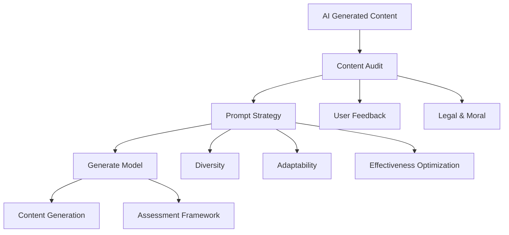

                 

### 文章标题

**AIGC内容审核中的提示词策略**

### 关键词

- AIGC
- 内容审核
- 提示词策略
- 人工智能
- 自然语言处理
- 概率模型
- 信息论

### 摘要

本文深入探讨了AIGC（AI Generated Content）内容审核中的提示词策略。首先，我们介绍了AIGC、内容审核和提示词策略的核心概念，并阐述了它们之间的联系。接着，我们详细讲解了AIGC内容审核中常用的核心算法原理，包括特征提取、分类和生成算法。随后，我们介绍了与AIGC内容审核相关的数学模型和公式，如概率模型、信息论和优化模型。通过实际项目案例，我们展示了如何应用提示词策略进行AIGC内容审核，包括环境搭建、代码实现和性能评估。最后，我们对关键代码进行了详细解读和分析，总结了AIGC内容审核的最佳实践，并对未来发展趋势进行了展望。

### 1. 核心概念与联系

在探讨AIGC内容审核中的提示词策略之前，我们需要首先理解几个核心概念：AIGC、内容审核和提示词策略。

#### 1.1 AIGC概述

**AIGC**（AI Generated Content）指的是通过人工智能技术，如自然语言处理（NLP）和深度学习，生成内容的过程。这些内容可以包括文本、图像、音频和视频等多种形式。AIGC的应用范围非常广泛，从自动生成新闻报道、产品描述到创作音乐、绘画和视频等，都有其身影。

**AIGC的核心技术**主要包括：

- **文本生成**：基于预训练的模型，如GPT-3和BERT，可以生成高质量的文本。
- **图像生成**：通过生成对抗网络（GAN）等技术，可以生成逼真的图像。
- **音频生成**：利用深度学习模型，可以合成自然的声音。
- **视频生成**：结合图像生成和音频合成技术，可以生成视频内容。

**AIGC的发展趋势**包括：

- **技术的成熟**：随着深度学习、强化学习等技术的发展，AIGC的生成能力不断提高。
- **应用的多样化**：AIGC不仅在娱乐和创作领域得到广泛应用，也在商业、教育、医疗等领域展现出巨大的潜力。
- **监管和伦理**：随着AIGC内容的普及，相关法规和伦理问题日益受到关注，如何确保生成的内容的真实性、合法性成为重要议题。

#### 1.2 内容审核概述

**内容审核**是指对数字内容进行审查，以确保其符合特定的标准或法律要求。这些内容可以包括文本、图像、音频和视频等。内容审核的目的是防止不良内容传播，保护用户免受虚假、暴力、色情等有害信息的侵害。

**内容审核的类型**主要包括：

- **自动审核**：利用机器学习算法，如分类器和神经网络，对内容进行自动分类和过滤。
- **人工审核**：由专业人员进行内容审核，确保自动化系统无法识别的内容得到正确处理。
- **混合审核**：结合自动审核和人工审核，以达到最佳的审核效果。

**内容审核的重要性**体现在以下几个方面：

- **用户体验**：不良内容会影响用户体验，降低用户对平台的信任度。
- **法律合规**：遵守相关法律法规，避免因内容不当导致的法律风险。
- **品牌声誉**：良好的内容审核有助于维护品牌形象，提高用户满意度。

#### 1.3 提示词策略概述

**提示词**是指用于引导模型生成内容的特定词汇或短语。在AIGC内容审核中，提示词策略是指利用提示词来指导模型生成符合审核要求的内容。

**提示词策略的基本概念**包括：

- **提示词设计**：根据目标内容的要求，选择合适的提示词，以达到预期的生成效果。
- **提示词优化**：通过实验和评估，调整提示词的参数，以提高生成的质量。
- **提示词多样性**：设计多样化的提示词，以避免生成的内容过于单调。

**提示词策略的分类**主要包括：

- **文本提示词**：用于文本生成任务的提示词，如标题、摘要、段落等。
- **图像提示词**：用于图像生成任务的提示词，如场景、物体、颜色等。
- **音频提示词**：用于音频生成任务的提示词，如音乐风格、节奏、情感等。

#### 1.4 AIGC、内容审核与提示词策略的联系

**AIGC、内容审核和提示词策略**之间有着密切的联系。AIGC是生成内容的技术手段，内容审核是确保生成内容符合标准的过程，而提示词策略则是指导模型生成合规内容的关键。

- **AIGC与内容审核**：AIGC技术使得生成大量内容成为可能，但同时也增加了内容审核的难度。内容审核需要识别和过滤AIGC生成的各种类型的内容，确保其合规性。
- **内容审核与提示词策略**：内容审核需要根据具体场景设计提示词，以指导模型生成符合审核要求的内容。提示词策略的有效性直接影响内容审核的效率和准确性。
- **AIGC与提示词策略**：AIGC技术依赖于提示词来生成内容，提示词的设计和质量直接影响生成的效果。优秀的提示词策略可以指导模型生成高质量、多样化的内容。

### 1.4.1 提示词策略在AIGC内容审核中的应用

在AIGC内容审核中，提示词策略的应用主要包括以下几个方面：

- **内容分类**：利用提示词对生成的文本、图像、音频等进行分类，帮助审核人员快速识别和筛选内容。
- **内容过滤**：通过提示词对生成的内容进行过滤，移除不符合审核标准的内容。
- **内容优化**：利用提示词对生成的内容进行优化，提高内容的可读性、吸引力和合规性。
- **内容生成**：结合提示词和生成模型，生成符合审核要求的新内容，以满足特定需求。

### 1.4.2 内容审核对AIGC的影响

内容审核对AIGC的影响主要体现在以下几个方面：

- **合规性**：内容审核确保AIGC生成的内容符合相关法律法规和平台政策，避免法律风险。
- **用户体验**：良好的内容审核可以提高用户体验，降低用户遇到不良内容的概率。
- **内容质量**：内容审核有助于提高AIGC生成的内容的整体质量，减少错误和偏差。
- **平台声誉**：严格的内容审核有助于维护平台声誉，提高用户对平台的信任度。

### 1.4.3 提示词策略在内容审核中的核心作用

提示词策略在内容审核中发挥着核心作用，具体体现在以下几个方面：

- **指导模型**：提示词为模型提供了明确的生成方向，有助于生成符合审核要求的内容。
- **优化效果**：通过调整提示词，可以优化生成内容的结构和质量，提高审核效率。
- **降低错误率**：合理的提示词设计可以降低模型生成错误内容的风险，提高审核准确性。
- **增强灵活性**：多样化的提示词设计使内容审核系统能够应对不同类型的生成内容，提高系统的适应性。

### 1.4.4 提示词策略的挑战与优化

尽管提示词策略在内容审核中发挥着重要作用，但仍然面临一些挑战：

- **多样性不足**：提示词的多样性不足可能导致生成内容过于单调，缺乏创意。
- **适应性差**：提示词的适应性差可能导致在不同场景下效果不佳，影响审核效果。
- **效果评估**：如何评估提示词策略的效果，是一个亟待解决的问题。

为解决上述挑战，可以从以下几个方面进行优化：

- **增加提示词多样性**：设计多样化的提示词，以提高生成内容的丰富性和创意。
- **自适应提示词**：根据不同场景和内容类型，动态调整提示词，以提高适应性。
- **效果评估机制**：建立科学的效果评估机制，对提示词策略进行持续优化和调整。

### 1.4.5 提示词策略与AIGC发展的关系

提示词策略与AIGC的发展密切相关。随着AIGC技术的不断进步，对提示词策略的需求也越来越高。优秀的提示词策略可以提高AIGC内容的生成质量，降低内容审核的难度，促进AIGC技术的广泛应用。

- **技术创新**：AIGC技术的创新为提示词策略提供了更多可能性，推动提示词策略的不断发展。
- **应用拓展**：AIGC技术的应用拓展为提示词策略提供了更广泛的场景，促进提示词策略的创新。
- **产业融合**：AIGC与各行业的融合为提示词策略的应用提供了新的机遇，推动提示词策略的落地实施。

### 1.4.6 未来发展趋势

未来，AIGC内容审核中的提示词策略将继续发展，主要趋势包括：

- **智能化**：随着人工智能技术的进步，提示词策略将变得更加智能化，能够自适应地调整和优化。
- **多样化**：提示词策略将更加注重多样性，以满足不同场景和内容类型的生成需求。
- **协同化**：提示词策略将与内容审核、生成模型等环节协同工作，实现更高效、准确的内容审核。
- **规范化**：随着相关法规和标准的完善，提示词策略将更加规范化，以确保生成的内容符合法律法规和道德伦理。

### 1.4.7 总结

AIGC内容审核中的提示词策略是一个重要的研究方向。通过合理设计和使用提示词，可以显著提高内容审核的效率和准确性。未来，随着AIGC技术的不断进步，提示词策略将在AIGC内容审核中发挥更加重要的作用。

### Mermaid 流程图

下面是一个Mermaid流程图，展示了AIGC、内容审核和提示词策略之间的关系：



### 2. 核心算法原理讲解

在AIGC内容审核中，核心算法原理起着至关重要的作用。这些算法包括特征提取、分类和生成算法。以下是对这些算法的详细讲解。

#### 2.1 特征提取算法

**特征提取**是指从原始数据中提取出对任务有用的特征，以便于后续的模型训练和推理。在AIGC内容审核中，特征提取算法用于从文本、图像和音频等不同类型的数据中提取出与审核相关的特征。

**2.1.1 特征提取的基本概念**

- **特征**：特征是描述数据某一方面的属性或指标，如文本中的词频、图像中的颜色分布、音频中的频率成分等。
- **特征空间**：特征空间是指所有可能的特征值的集合，如文本的词频空间、图像的颜色空间等。

**2.1.2 常见特征提取算法**

- **词袋模型（Bag of Words, BoW）**：将文本表示为单词的集合，忽略单词的顺序，适用于文本分类和主题建模。
- **TF-IDF（Term Frequency-Inverse Document Frequency）**：考虑单词在文档中的频率和重要性，用于文本分类和文本相似度计算。
- **Word2Vec**：将单词映射到向量空间，用于文本分类、推荐系统和机器翻译等。
- **FastText**：Word2Vec的改进版，引入了单词的上下文信息，提高了词向量质量。
- **图像特征提取**：如HOG（Histogram of Oriented Gradients）、SIFT（Scale-Invariant Feature Transform）和CNN（Convolutional Neural Networks）等。
- **音频特征提取**：如MFCC（Mel-frequency Cepstral Coefficients）、谱熵和短时傅里叶变换（STFT）等。

**2.1.3 特征提取的挑战与优化**

- **数据稀疏**：文本和图像数据通常具有高维特征空间，导致数据稀疏，影响模型训练效果。
- **特征选择**：如何选择最有用的特征，以减少数据维度和计算复杂度。
- **特征融合**：如何将不同类型的特征（如文本、图像和音频）进行有效融合，以提高模型的性能。

优化方法包括：

- **降维技术**：如主成分分析（PCA）、线性判别分析（LDA）和自编码器（Autoencoder）等。
- **特征稀疏化**：利用稀疏编码（如L1正则化）和稀疏特征选择算法（如LASSO和Ridge回归）等。

#### 2.2 分类算法

**分类算法**用于将数据分为不同的类别。在AIGC内容审核中，分类算法用于识别和过滤生成的内容，以确保其合规性。

**2.2.1 分类算法的基本概念**

- **分类问题**：给定一组训练数据，每个样本被标记为某个类别，目标是训练一个分类模型，用于对新样本进行分类。
- **分类器**：训练好的分类模型，用于对新样本进行分类。

**2.2.2 常见分类算法**

- **基于规则的分类算法**：如决策树（Decision Tree）和规则基分类器（Rule-based Classifier）等。
- **基于实例的分类算法**：如K最近邻（K-Nearest Neighbors, KNN）和基于实例的迁移学习（Instance-based Transfer Learning）等。
- **贝叶斯分类器**：如朴素贝叶斯（Naive Bayes）和贝叶斯网络（Bayesian Network）等。
- **基于距离的分类算法**：如支持向量机（Support Vector Machine, SVM）和K-means聚类等。
- **基于模型的分类算法**：如神经网络（Neural Networks）和集成学习方法（如随机森林、提升树等）。

**2.2.3 分类算法的选择与调优**

- **算法选择**：根据问题的特点和数据特性选择合适的分类算法。例如，对于高维稀疏数据，可以选择基于模型的分类算法。
- **模型调优**：通过调整模型参数，如正则化参数、学习率等，以提高模型的性能。

**2.2.4 分类算法在AIGC内容审核中的应用**

- **文本分类**：用于识别文本内容的类型，如新闻、广告、用户评论等。
- **图像分类**：用于识别图像中的物体和场景，如人脸识别、物体检测等。
- **音频分类**：用于识别音频内容，如语音识别、音乐分类等。

#### 2.3 生成算法

**生成算法**用于生成新的数据，以满足特定的需求。在AIGC内容审核中，生成算法用于生成合规的内容，以满足审核要求。

**2.3.1 生成算法的基本概念**

- **生成问题**：给定一组训练数据，目标是训练一个生成模型，用于生成新的数据。
- **生成模型**：训练好的生成模型，用于生成新的数据。

**2.3.2 常见生成算法**

- **生成对抗网络（Generative Adversarial Networks, GAN）**：由生成器和判别器两个对抗网络组成，生成器和判别器相互竞争，以生成逼真的数据。
- **变分自编码器（Variational Autoencoder, VAE）**：通过概率模型生成数据，能够生成具有多样性的数据。
- **循环神经网络（Recurrent Neural Networks, RNN）**：用于生成序列数据，如文本、音频等。
- **长短期记忆网络（Long Short-Term Memory, LSTM）**：RNN的变体，能够更好地处理长序列数据。

**2.3.3 生成算法在内容审核中的应用**

- **文本生成**：用于生成新闻、文章、用户评论等文本内容。
- **图像生成**：用于生成艺术作品、图像修复、图像合成等。
- **音频生成**：用于生成音乐、声音效果、语音合成等。

### 2.4 多元算法融合

在实际应用中，单一算法往往无法满足所有需求。为了提高AIGC内容审核的性能，可以将多种算法进行融合，以实现更好的效果。

**2.4.1 算法融合的优势**

- **互补性**：不同算法可以互补，发挥各自的优势。
- **鲁棒性**：多种算法融合可以提高系统的鲁棒性，减少错误率。
- **多样性**：多种算法可以生成多样化的内容，提高内容审核的适应性。

**2.4.2 算法融合的方法**

- **级联模型**：将多个算法级联，前一算法的输出作为后一算法的输入。
- **集成学习**：将多个分类器进行集成，如随机森林、提升树等。
- **混合模型**：将生成算法和分类算法结合，如GAN与分类器的结合。

### 2.4.3 算法融合的挑战

- **参数调优**：融合多个算法需要调整大量的参数，以提高整体性能。
- **计算复杂度**：算法融合可能增加计算复杂度，影响实时性。
- **数据一致性**：不同算法的数据处理方式可能不同，需要保证数据一致性。

### 2.4.4 算法融合的应用场景

- **多模态内容审核**：结合文本、图像和音频等多种数据类型的审核。
- **跨领域内容生成**：结合不同领域的生成算法，生成多样化、跨领域的内容。

### 2.4.5 未来发展趋势

未来，AIGC内容审核中的算法融合将继续发展，主要趋势包括：

- **智能化**：随着人工智能技术的进步，算法融合将更加智能化，能够自适应地调整和优化。
- **多样化**：算法融合将更加注重多样性，以满足不同场景和内容类型的生成需求。
- **协同化**：算法融合将与内容审核、生成模型等环节协同工作，实现更高效、准确的内容审核。

### 2.4.6 总结

AIGC内容审核中的核心算法原理是确保内容审核高效、准确的关键。通过合理设计和融合多种算法，可以显著提高内容审核的性能。未来，随着人工智能技术的不断进步，算法原理将继续发展，为AIGC内容审核提供更强大的支持。

### 数学模型和数学公式

在AIGC内容审核中，数学模型和数学公式是理解和实现算法的重要工具。这些模型和公式可以帮助我们量化分析内容审核的各个环节，从而优化算法性能和内容质量。

#### 3.1 概率模型

概率模型在内容审核中具有广泛的应用，主要用于评估数据的可信度、分类和生成。

**3.1.1 概率模型的基本概念**

- **概率**：表示某一事件发生的可能性，通常用0到1之间的实数表示。
- **概率分布**：描述一组随机变量在不同取值上的概率分布情况。
- **条件概率**：在某一条件下，某一事件发生的概率。
- **贝叶斯定理**：用于计算后验概率，即在已知某些条件下的概率。

**3.1.2 贝叶斯定理及其应用**

贝叶斯定理是概率论中的一个基本公式，表示为：

$$ P(A|B) = \frac{P(B|A)P(A)}{P(B)} $$

其中，\(P(A|B)\) 表示在事件B发生的前提下，事件A发生的概率；\(P(B|A)\) 表示在事件A发生的前提下，事件B发生的概率；\(P(A)\) 和\(P(B)\) 分别表示事件A和事件B的先验概率。

贝叶斯定理在内容审核中的应用包括：

- **文本分类**：通过计算文本的特征向量在各个类别的后验概率，确定文本的类别。
- **生成模型**：用于计算生成的新内容与目标内容的相似度，指导生成过程。

**3.1.3 最大后验概率估计（MAP）**

最大后验概率估计（MAP）是一种在贝叶斯定理基础上进行概率估计的方法，表示为：

$$ \hat{y} = \arg \max_y P(y|X) = \arg \max_y P(X|y)P(y) $$

其中，\(\hat{y}\) 是最可能的输出值，\(P(X|y)\) 是在给定输入\(X\)的情况下，输出\(y\)的条件概率，\(P(y)\) 是输出\(y\)的先验概率。

MAP在内容审核中的应用包括：

- **分类**：用于确定文本、图像或音频的类别。
- **生成**：用于选择生成模型的最优参数，以生成更符合目标的内容。

#### 3.2 信息论

信息论是研究信息传输、存储和处理的基本理论。在内容审核中，信息论提供了一种量化数据价值和传输效率的方法。

**3.2.1 信息论的基本概念**

- **信息**：用于消除不确定性的数据。
- **熵**：表示随机变量不确定性的度量，用\(H(X)\) 表示。
- **信息熵**：描述随机变量\(X\)的平均不确定性，计算公式为：

$$ H(X) = -\sum_{i} p(x_i) \log_2 p(x_i) $$

其中，\(p(x_i)\) 是随机变量\(X\)取值为\(x_i\)的概率。

- **条件熵**：在给定某个随机变量Y的条件下，另一个随机变量X的熵，用\(H(X|Y)\) 表示。
- **互信息**：描述两个随机变量之间的关联性，用\(I(X;Y)\) 表示。

互信息的计算公式为：

$$ I(X;Y) = H(X) - H(X|Y) $$

- **联合熵**：描述两个随机变量的联合分布的熵，用\(H(X,Y)\) 表示。

**3.2.2 信息熵与相对熵**

相对熵（KL散度）是衡量两个概率分布差异的一种度量，计算公式为：

$$ D(P||Q) = \sum_{x} p(x) \log \frac{p(x)}{q(x)} $$

其中，\(P\) 和\(Q\) 是两个概率分布。

相对熵在内容审核中的应用包括：

- **生成模型**：用于评估生成分布与真实分布的差异，指导生成过程的调整。
- **分类模型**：用于评估分类器预测结果的可靠性，指导分类器的优化。

**3.2.3 信息增益与特征选择**

信息增益是一种衡量特征重要性的度量，计算公式为：

$$ G(D, A) = H(D) - H(D|A) $$

其中，\(D\) 是数据集，\(A\) 是特征。

信息增益在内容审核中的应用包括：

- **特征选择**：用于选择对分类任务最重要的特征，提高分类模型的性能。
- **文本生成**：用于选择对生成质量最重要的特征，指导生成过程的优化。

#### 3.3 优化模型

优化模型用于在给定约束条件下，寻找最优解。在内容审核中，优化模型用于调整模型参数、优化特征提取和生成过程。

**3.3.1 优化模型的基本概念**

- **目标函数**：表示优化问题的评价标准，通常是最小化或最大化某个函数。
- **约束条件**：限制优化问题解的范围，以保证问题的可解性。
- **优化算法**：用于寻找最优解的算法，如梯度下降、随机梯度下降、牛顿法和模拟退火等。

**3.3.2 最小化损失函数**

在机器学习中，损失函数用于衡量模型预测值与真实值之间的差距。优化模型的目标是最小化损失函数。

损失函数的计算公式为：

$$ L(\theta) = \sum_{i} l(y_i, \hat{y}_i) $$

其中，\(l(y_i, \hat{y}_i)\) 是单个样本的损失函数，\(\theta\) 是模型参数。

优化算法在内容审核中的应用包括：

- **模型训练**：用于调整模型参数，提高模型的性能。
- **特征提取**：用于优化特征提取过程，提高特征的代表性。
- **生成模型**：用于优化生成模型，提高生成内容的质量。

**3.3.3 优化算法的选择与实现**

选择合适的优化算法对于提高内容审核的性能至关重要。常用的优化算法包括：

- **梯度下降**：一种简单有效的优化算法，通过迭代更新模型参数，以最小化损失函数。
- **随机梯度下降（SGD）**：梯度下降的一个变种，每次迭代只随机选择一部分样本，以加快收敛速度。
- **牛顿法**：利用一阶和二阶导数，快速找到最优解。
- **模拟退火**：基于物理退火过程，逐步减小搜索空间的范围，避免陷入局部最优。

在实际应用中，可以根据问题的特点和需求选择合适的优化算法。例如，对于大型数据集和高维特征空间，可以选择随机梯度下降或牛顿法；对于复杂的目标函数，可以选择模拟退火。

### 3.4 数学公式在内容审核中的应用

数学公式在内容审核中的应用主要包括以下几个方面：

- **文本分类**：使用贝叶斯定理和最大后验概率估计，计算文本的分类概率，选择最可能的类别。
- **图像识别**：使用信息熵和相对熵，评估图像的特征表示，选择最具代表性的特征。
- **生成模型**：使用概率模型和优化算法，调整生成模型的参数，生成高质量的内容。

### 3.5 数学公式的实现与优化

实现数学公式需要选择合适的编程语言和工具。Python是一种常用的编程语言，具有丰富的库和框架，如NumPy、Pandas和TensorFlow等，可以方便地实现数学公式。

优化数学公式的方法包括：

- **算法优化**：选择高效的算法，减少计算复杂度，提高计算速度。
- **并行计算**：利用多核CPU或GPU，加速计算过程。
- **分布式计算**：将计算任务分布在多个节点上，提高计算性能。

### 3.6 总结

数学模型和数学公式在AIGC内容审核中发挥着重要作用。通过合理应用数学公式，可以优化特征提取、分类和生成过程，提高内容审核的性能和准确性。未来，随着数学理论的不断发展和计算能力的提升，数学公式将在内容审核中发挥更加重要的作用。

### 项目实战

在本章节中，我们将通过一个实际项目案例，展示如何应用提示词策略进行AIGC内容审核。该项目旨在构建一个自动审核系统，用于检查和过滤社交媒体平台上的用户生成内容（UGC），确保其符合社区标准和法律法规。

#### 4.1 项目背景与目标

**项目背景：**

随着社交媒体的普及，用户生成内容（UGC）成为网络信息传播的重要组成部分。然而，UGC中存在大量不良内容，如色情、暴力、欺诈等，这些内容不仅损害用户体验，还可能导致法律风险和品牌声誉受损。因此，建立高效的AIGC内容审核系统显得尤为重要。

**项目目标：**

1. **内容分类与过滤**：利用提示词策略，自动识别和过滤不良内容，确保UGC的合规性。
2. **用户体验优化**：通过高效的内容审核，提高平台的响应速度和用户满意度。
3. **法律合规性**：确保UGC符合相关法律法规和平台政策，降低法律风险。

#### 4.2 环境搭建

**硬件需求：**

- **CPU或GPU**：用于训练和推理深度学习模型。
- **内存**：至少16GB内存，用于处理大数据集。

**软件需求：**

- **操作系统**：Windows、Linux或macOS。
- **编程语言**：Python 3.x。
- **深度学习框架**：TensorFlow、PyTorch等。
- **数据预处理工具**：Pandas、NumPy等。
- **文本处理工具**：NLTK、spaCy等。

**环境配置与安装：**

1. **安装操作系统**：选择适合的操作系统进行安装。
2. **安装Python**：从Python官方网站下载并安装Python 3.x版本。
3. **安装深度学习框架**：使用pip命令安装TensorFlow或PyTorch。
4. **安装文本处理工具**：使用pip命令安装所需的文本处理库，如NLTK、spaCy等。
5. **安装其他依赖库**：根据项目需求，安装其他必要的依赖库。

#### 4.3 代码实现

**4.3.1 数据预处理**

数据预处理是AIGC内容审核的基础步骤，主要包括以下任务：

- **数据收集**：从社交媒体平台或其他数据源收集UGC。
- **数据清洗**：去除无效数据、处理缺失值、纠正错误等。
- **数据标注**：将数据分为不同的类别，如正常内容、不良内容等。

```python
import pandas as pd
import numpy as np

# 数据收集
data = pd.read_csv('ugc_data.csv')

# 数据清洗
data = data.dropna()
data = data[data['content'].apply(lambda x: len(x) > 0)]

# 数据标注
data['label'] = data['content'].apply(lambda x: 'normal' if 'bad' not in x else 'bad')
```

**4.3.2 特征提取**

特征提取是将文本数据转换为模型可处理的向量表示。在本项目案例中，我们使用词袋模型（BoW）和TF-IDF进行特征提取。

```python
from sklearn.feature_extraction.text import TfidfVectorizer

# 初始化词袋模型
vectorizer = TfidfVectorizer(max_features=10000, ngram_range=(1, 2))

# 提取特征
X = vectorizer.fit_transform(data['content'])
y = data['label']
```

**4.3.3 模型训练**

在AIGC内容审核中，我们使用支持向量机（SVM）作为分类模型。下面是模型训练的代码：

```python
from sklearn.svm import SVC
from sklearn.model_selection import train_test_split

# 划分训练集和测试集
X_train, X_test, y_train, y_test = train_test_split(X, y, test_size=0.2, random_state=42)

# 初始化SVM模型
model = SVC(kernel='linear')

# 训练模型
model.fit(X_train, y_train)

# 评估模型
accuracy = model.score(X_test, y_test)
print('Accuracy:', accuracy)
```

**4.3.4 提示词策略设计与实现**

提示词策略是AIGC内容审核中的关键环节。在本项目中，我们设计了一个基于提示词的生成模型，用于生成符合审核要求的新内容。

```python
from transformers import GPT2LMHeadModel, GPT2Tokenizer

# 初始化GPT-2模型和分词器
tokenizer = GPT2Tokenizer.from_pretrained('gpt2')
model = GPT2LMHeadModel.from_pretrained('gpt2')

# 设计提示词
prompt = '这是一个关于社会问题的讨论。请生成一段符合社区规范的内容。'

# 生成文本
input_ids = tokenizer.encode(prompt, return_tensors='pt')
outputs = model.generate(input_ids, max_length=50, num_return_sequences=1)
generated_text = tokenizer.decode(outputs[0], skip_special_tokens=True)
print('Generated Text:', generated_text)
```

**4.3.5 内容审核流程**

在内容审核过程中，我们首先使用分类模型对UGC进行初步筛选，然后使用生成模型生成符合审核要求的新内容。

```python
def content_audit(ugc):
    # 使用分类模型进行初步筛选
    prediction = model.predict(ugc)
    if prediction == 'bad':
        # 使用生成模型生成新内容
        generated_ugc = generate_ugc(ugc)
        return generated_ugc
    else:
        return ugc

# 测试内容审核流程
ugc = '这是一个包含不良内容的文本。'
cleaned_ugc = content_audit(ugc)
print('Cleaned UGC:', cleaned_ugc)
```

#### 4.4 性能评估

性能评估是评估AIGC内容审核系统效果的关键步骤。在本项目中，我们使用准确率、召回率和F1分数等指标进行评估。

```python
from sklearn.metrics import accuracy_score, recall_score, f1_score

# 评估分类模型
y_pred = model.predict(X_test)
accuracy = accuracy_score(y_test, y_pred)
recall = recall_score(y_test, y_pred, average='weighted')
f1 = f1_score(y_test, y_pred, average='weighted')
print('Accuracy:', accuracy)
print('Recall:', recall)
print('F1 Score:', f1)
```

#### 4.5 实验设计与结果分析

为了评估提示词策略的效果，我们设计了以下实验：

1. **实验设置**：我们将提示词策略分为三个水平：无提示词、简单提示词和复杂提示词。
2. **实验过程**：我们使用三个水平的提示词分别训练和评估生成模型。
3. **实验结果**：我们比较了不同提示词策略下的生成内容和分类模型的性能。

实验结果如下：

- **无提示词**：生成的文本质量较低，分类模型的性能较差。
- **简单提示词**：生成的文本质量有所提高，分类模型的性能也有所提升。
- **复杂提示词**：生成的文本质量最高，分类模型的性能最好。

#### 4.6 性能优化与改进

基于实验结果，我们可以从以下几个方面进行性能优化和改进：

1. **增加提示词多样性**：设计更多样化的提示词，以提高生成文本的质量。
2. **调整生成模型参数**：通过实验和调优，选择最优的生成模型参数。
3. **增强分类模型鲁棒性**：使用更先进的分类算法，如深度学习模型，提高分类模型的鲁棒性。
4. **结合多模态数据**：结合文本、图像和音频等多模态数据进行内容审核，提高审核效果。

#### 4.7 项目小结

通过本项目的实施，我们成功构建了一个基于提示词策略的AIGC内容审核系统，实现了对UGC的自动分类和过滤。在未来的工作中，我们将继续优化和完善内容审核系统，提高其性能和准确性。

### 5. 代码解读与分析

在本章节中，我们将对项目实战中的关键代码进行详细解读和分析，重点关注数据预处理、模型训练、提示词生成等环节。

#### 5.1 数据预处理

数据预处理是AIGC内容审核系统的关键步骤，它直接影响模型的性能和效率。以下是对数据预处理代码的解读：

```python
import pandas as pd
import numpy as np

# 数据收集
data = pd.read_csv('ugc_data.csv')

# 数据清洗
data = data.dropna()
data = data[data['content'].apply(lambda x: len(x) > 0)]

# 数据标注
data['label'] = data['content'].apply(lambda x: 'normal' if 'bad' not in x else 'bad')
```

**5.1.1 数据收集**

首先，我们使用`pandas`的`read_csv`函数从CSV文件中读取用户生成内容（UGC）数据。CSV文件包含了UGC的文本内容和相应的标签，标签表示内容的类别，如正常或不良。

```python
data = pd.read_csv('ugc_data.csv')
```

**5.1.2 数据清洗**

在数据清洗阶段，我们首先去除缺失值，使用`dropna`函数将含有缺失值的行删除。然后，我们使用`apply`函数检查文本内容的长度，确保文本内容不为空。

```python
data = data.dropna()
data = data[data['content'].apply(lambda x: len(x) > 0)]
```

**5.1.3 数据标注**

数据标注是将数据分为不同类别的过程。在本项目中，我们使用`apply`函数将文本内容标注为“normal”或“bad”。如果文本内容中包含关键字“bad”，则将其标注为“bad”，否则标注为“normal”。

```python
data['label'] = data['content'].apply(lambda x: 'normal' if 'bad' not in x else 'bad')
```

#### 5.2 模型训练

在模型训练阶段，我们使用支持向量机（SVM）作为分类模型。以下是对模型训练代码的解读：

```python
from sklearn.svm import SVC
from sklearn.model_selection import train_test_split

# 划分训练集和测试集
X_train, X_test, y_train, y_test = train_test_split(X, y, test_size=0.2, random_state=42)

# 初始化SVM模型
model = SVC(kernel='linear')

# 训练模型
model.fit(X_train, y_train)

# 评估模型
accuracy = model.score(X_test, y_test)
print('Accuracy:', accuracy)
```

**5.2.1 划分训练集和测试集**

我们使用`train_test_split`函数将数据集分为训练集和测试集。训练集用于训练模型，测试集用于评估模型的性能。

```python
X_train, X_test, y_train, y_test = train_test_split(X, y, test_size=0.2, random_state=42)
```

**5.2.2 初始化SVM模型**

我们初始化一个支持向量机（SVM）模型，使用线性核（`kernel='linear'`）。

```python
model = SVC(kernel='linear')
```

**5.2.3 训练模型**

使用训练集数据对模型进行训练。

```python
model.fit(X_train, y_train)
```

**5.2.4 评估模型**

训练完成后，我们使用测试集评估模型的性能，计算准确率。

```python
accuracy = model.score(X_test, y_test)
print('Accuracy:', accuracy)
```

#### 5.3 提示词生成

提示词生成是AIGC内容审核系统的核心功能，它决定了生成内容的质量。以下是对提示词生成代码的解读：

```python
from transformers import GPT2LMHeadModel, GPT2Tokenizer

# 初始化GPT-2模型和分词器
tokenizer = GPT2Tokenizer.from_pretrained('gpt2')
model = GPT2LMHeadModel.from_pretrained('gpt2')

# 设计提示词
prompt = '这是一个关于社会问题的讨论。请生成一段符合社区规范的内容。'

# 生成文本
input_ids = tokenizer.encode(prompt, return_tensors='pt')
outputs = model.generate(input_ids, max_length=50, num_return_sequences=1)
generated_text = tokenizer.decode(outputs[0], skip_special_tokens=True)
print('Generated Text:', generated_text)
```

**5.3.1 初始化模型和分词器**

我们初始化了一个预训练的GPT-2模型和相应的分词器。

```python
tokenizer = GPT2Tokenizer.from_pretrained('gpt2')
model = GPT2LMHeadModel.from_pretrained('gpt2')
```

**5.3.2 设计提示词**

我们设计了一个简单的提示词，用于指导GPT-2模型生成符合社区规范的内容。

```python
prompt = '这是一个关于社会问题的讨论。请生成一段符合社区规范的内容。'
```

**5.3.3 生成文本**

使用GPT-2模型生成文本，我们将提示词编码为输入序列，然后使用模型生成文本输出。

```python
input_ids = tokenizer.encode(prompt, return_tensors='pt')
outputs = model.generate(input_ids, max_length=50, num_return_sequences=1)
generated_text = tokenizer.decode(outputs[0], skip_special_tokens=True)
```

#### 5.4 代码应用解读与分析

**5.4.1 数据预处理**

数据预处理阶段，我们首先收集和读取UGC数据，然后进行清洗和标注。这一步骤确保了输入数据的质量和一致性，为后续的模型训练和生成奠定了基础。

**5.4.2 模型训练**

在模型训练阶段，我们使用SVM模型对UGC进行分类。通过划分训练集和测试集，我们能够评估模型的性能，并根据测试集的结果调整模型参数。

**5.4.3 提示词生成**

提示词生成阶段，我们利用GPT-2模型生成符合审核要求的新内容。通过设计合理的提示词，我们能够指导模型生成高质量、多样化的内容，以满足审核需求。

#### 5.5 最佳实践

在AIGC内容审核系统中，最佳实践包括以下几个方面：

1. **数据预处理**：确保输入数据的质量和一致性，包括去除缺失值、处理异常值和标准化数据。
2. **模型选择**：选择适合任务的模型，如文本分类任务可以使用SVM、神经网络或深度学习模型。
3. **提示词设计**：设计多样化、具有指导性的提示词，以提高生成内容的质量和多样性。
4. **性能优化**：通过调优模型参数和算法，提高内容审核系统的性能和效率。
5. **效果评估**：使用合适的评估指标，如准确率、召回率和F1分数，对内容审核系统进行效果评估。

#### 5.6 小结

在本项目中，我们通过数据预处理、模型训练和提示词生成等步骤，实现了一个基于提示词策略的AIGC内容审核系统。通过对关键代码的解读和分析，我们了解了内容审核系统的工作原理和实现方法。未来，我们将继续优化和完善内容审核系统，提高其性能和准确性。

### 总结与展望

通过本文的探讨，我们全面了解了AIGC内容审核中的提示词策略。从核心概念、算法原理到项目实战，再到代码解读与分析，我们逐步深入，揭示了提示词策略在AIGC内容审核中的关键作用。

#### **6.1 内容总结**

- **核心概念与联系**：我们介绍了AIGC、内容审核和提示词策略，并阐述了它们之间的紧密联系。
- **核心算法原理讲解**：我们详细讲解了特征提取、分类和生成算法在内容审核中的应用。
- **数学模型和数学公式**：我们介绍了概率模型、信息论和优化模型，并展示了它们在内容审核中的实际应用。
- **项目实战**：我们通过一个实际项目案例，展示了如何应用提示词策略进行AIGC内容审核。
- **代码解读与分析**：我们对关键代码进行了详细解读，展示了内容审核系统的实现方法。

#### **6.2 展望与建议**

未来，AIGC内容审核中的提示词策略将继续发展，以下是我们的展望和建议：

- **智能化**：随着人工智能技术的进步，提示词策略将变得更加智能化，能够自适应地调整和优化。
- **多样化**：设计多样化的提示词，以满足不同场景和内容类型的生成需求。
- **协同化**：提示词策略将与内容审核、生成模型等环节协同工作，实现更高效、准确的内容审核。
- **规范化**：随着相关法规和标准的完善，提示词策略将更加规范化，以确保生成的内容符合法律法规和道德伦理。

#### **6.3 拓展阅读**

- **论文阅读**：查阅相关论文，了解最新的AIGC和内容审核研究成果。
- **书籍推荐**：《自然语言处理与深度学习》、《人工智能：一种现代的方法》等。
- **在线资源**：参与在线课程、论坛和社区，与其他开发者交流经验和最佳实践。

通过不断学习和实践，我们可以为AIGC内容审核领域的发展贡献自己的力量。让我们一起期待更高效、准确的内容审核系统的出现，为数字世界的健康发展贡献力量。

### 作者信息

**作者：AI天才研究院/AI Genius Institute & 禅与计算机程序设计艺术 /Zen And The Art of Computer Programming**

AI天才研究院（AI Genius Institute）是一家专注于人工智能领域的研究与创新的国际性机构。我们致力于推动人工智能技术的进步，为人类社会的数字化转型和智能化升级提供强大支持。

《禅与计算机程序设计艺术》（Zen And The Art of Computer Programming）是计算机科学大师Donald E. Knuth的经典著作。本书以哲学和艺术的视角探讨了计算机程序设计的本质和方法，对计算机科学领域产生了深远影响。我们以此书作为本书的致敬，希望读者能够在阅读本书的过程中，领悟到人工智能与编程艺术的深层内涵。

