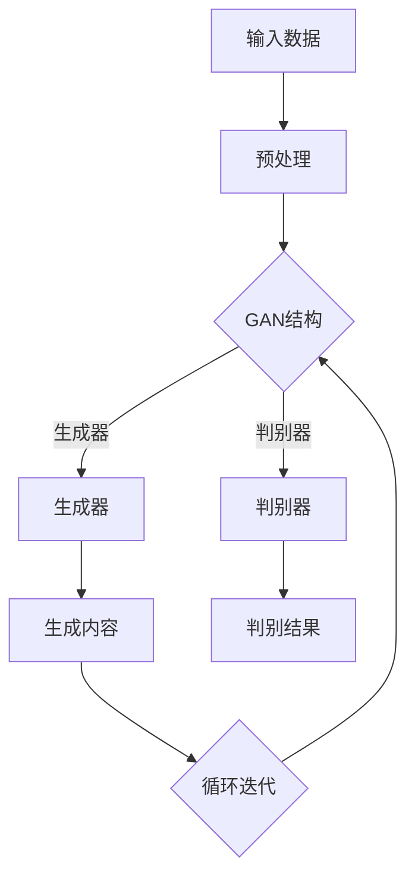
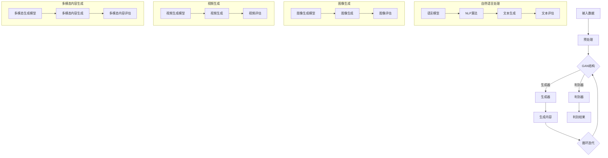

                 

### 文章标题

《AIGC内容生成的伦理考量与最佳实践》

> 关键词：AIGC、伦理考量、最佳实践、内容生成、人工智能、伦理问题、技术应用、社会责任

> 摘要：
本文旨在探讨AIGC（人工智能生成内容）领域中的伦理考量及最佳实践。随着AIGC技术的迅速发展，其在各行业的应用日益广泛，然而随之而来的伦理问题也日益突出。本文首先介绍了AIGC的基本概念、技术原理和应用场景，随后深入分析了AIGC过程中可能涉及的伦理问题，包括数据隐私、法律责任和版权、社会公平与偏见等。最后，本文提出了AIGC的最佳实践策略，以期为相关从业者提供有价值的指导。

### 第1章 引言与AIGC概述

#### 1.1 AIGC的定义与发展

AIGC，即人工智能生成内容，是指通过人工智能技术，如深度学习、自然语言处理和图像生成等，自动生成文字、图片、视频等内容的系统。AIGC技术起源于20世纪80年代的生成对抗网络（GAN）和变分自编码器（VAE），经过数十年的发展，特别是在深度学习和大数据技术的推动下，AIGC技术取得了显著的进步。

AIGC的发展可以分为三个阶段：

1. **初步探索阶段（1980s-2000s）**：在这个阶段，研究人员提出了GAN和VAE等基本模型，为AIGC技术的发展奠定了基础。
2. **快速发展阶段（2010s）**：随着深度学习的兴起，AIGC技术迎来了快速发展，各种基于深度学习的生成模型相继出现，如深度卷积生成对抗网络（DCGAN）和风格迁移模型（Style Transfer）。
3. **应用普及阶段（2020s至今）**：随着计算能力和数据资源的提升，AIGC技术逐渐应用于实际场景，如文本生成、图像生成和视频生成等。

#### 1.2 AIGC的应用场景

AIGC技术具有广泛的应用前景，以下是其主要的应用场景：

1. **文本生成**：包括文章、新闻报道、故事、诗歌等。
2. **图像生成**：包括艺术作品、照片、卡通形象等。
3. **视频生成**：包括视频片段、电影、广告等。
4. **多模态内容生成**：结合文本、图像和视频等多种模态，生成更丰富的内容。

#### 1.3 AIGC的关键技术

AIGC的核心技术主要包括：

1. **生成对抗网络（GAN）**：GAN是一种通过两个神经网络（生成器和判别器）进行对抗训练的框架，旨在生成逼真的数据。
2. **变分自编码器（VAE）**：VAE通过编码器和解码器实现数据的生成，具有较强的灵活性。
3. **自然语言处理（NLP）**：包括语言模型、文本生成、情感分析等。
4. **图像生成技术**：包括生成对抗网络、变分自编码器、风格迁移等。
5. **视频生成技术**：包括时序生成对抗网络、光场视频生成等。

### 核心概念与联系

为了更好地理解AIGC技术的核心概念，我们可以通过以下Mermaid流程图展示其基本架构：



在这个流程图中，输入数据经过预处理后，被输入到GAN结构中。生成器和判别器通过对抗训练不断优化，最终生成逼真的内容。

#### 核心算法原理讲解

1. **生成对抗网络（GAN）**

   生成对抗网络（GAN）是一种由生成器和判别器组成的神经网络框架。生成器的任务是生成假样本，判别器的任务是区分真假样本。GAN的训练过程如下：

   - 初始化生成器G和判别器D。
   - 对于每个迭代，从真实数据集采样一个样本x，生成器G生成一个假样本G(z)。
   - 判别器D对x和G(z)进行分类，给出一个概率分布p(y|x)和q(y|G(z))，其中y表示样本的真实标签，x表示真实样本，G(z)表示生成样本。
   - 通过最小化判别器的损失函数和生成器的损失函数来优化G和D。

   伪代码如下：

   ```python
   # 初始化生成器和判别器
   G, D = initialize_G_D()

   # 模型训练
   for epoch in range(num_epochs):
       for x, y in data_loader:
           # 训练判别器
           D_loss = train_D(D, x, G(z))
           # 训练生成器
           G_loss = train_G(G, D)
       # 打印训练信息
       print(f"Epoch {epoch}: G_loss = {G_loss}, D_loss = {D_loss}")
   ```

2. **变分自编码器（VAE）**

   变分自编码器（VAE）是一种无监督学习模型，用于数据的生成和压缩。VAE的核心思想是引入潜在变量，通过编码器和解码器实现数据的编码和生成。

   - 编码器：将输入数据映射到潜在空间，得到潜在变量的表示。
   - 解码器：将潜在变量映射回输入空间，生成重构数据。

   伪代码如下：

   ```python
   # 初始化编码器和解码器
   encoder, decoder = initialize_encoder_decoder()

   # 模型训练
   for epoch in range(num_epochs):
       for x in data_loader:
           # 训练编码器
           encoder_loss = train_encoder(encoder, x)
           # 训练解码器
           decoder_loss = train_decoder(decoder, x, encoder(x))
       # 打印训练信息
       print(f"Epoch {epoch}: encoder_loss = {encoder_loss}, decoder_loss = {decoder_loss}")
   ```

### 实际案例分析与详细讲解剖析

以文本生成为例，我们可以通过一个实际案例来展示AIGC的应用。假设我们需要使用AIGC技术生成一篇关于人工智能技术的文章。

1. **数据集准备**：首先，我们需要一个包含大量关于人工智能技术文章的数据集。这个数据集可以是公开的文本数据集，如维基百科、新闻网站的文章等。

2. **预处理**：对数据集进行预处理，包括文本清洗、分词、词向量编码等。

3. **模型训练**：使用生成对抗网络（GAN）或变分自编码器（VAE）对模型进行训练。训练过程中，生成器和判别器通过对抗训练不断优化。

4. **文本生成**：在模型训练完成后，使用生成器生成新的文本。例如，我们可以输入一个关键词“人工智能”，模型会根据训练数据生成一篇关于人工智能技术的文章。

5. **结果评估**：对生成的文本进行评估，包括文本质量、内容相关性、语言流畅性等。

通过这个案例，我们可以看到AIGC技术在文本生成中的应用。在实际应用中，AIGC技术可以应用于各种场景，如新闻写作、广告创意、文学作品生成等。

### 项目小结

AIGC技术作为一种先进的人工智能技术，具有广泛的应用前景。在文本生成、图像生成和视频生成等领域，AIGC技术都取得了显著的成果。然而，AIGC技术的应用也带来了一系列的伦理问题，如数据隐私、法律责任和版权等。因此，在实际应用中，我们需要充分考虑这些问题，遵循最佳实践，确保AIGC技术的可持续发展。

#### 最佳实践 tips

1. **数据隐私保护**：在AIGC应用中，必须严格保护用户数据隐私，遵循相关法律法规。
2. **版权问题**：在使用AIGC技术生成内容时，需要确保不侵犯他人的版权。
3. **质量控制**：对生成的AIGC内容进行严格的质量控制，确保内容的真实性、准确性和可靠性。
4. **社会公平与偏见**：在AIGC应用中，要充分考虑社会公平与偏见问题，避免生成具有偏见的内容。

### 拓展阅读

1. **《生成对抗网络（GAN）原理与实现》**：详细介绍GAN的原理和实现方法。
2. **《变分自编码器（VAE）原理与实现》**：详细介绍VAE的原理和实现方法。
3. **《自然语言处理入门》**：介绍自然语言处理的基础知识和应用。
4. **《图像生成技术综述》**：对各种图像生成技术进行详细综述。

作者：AI天才研究院/AI Genius Institute & 禅与计算机程序设计艺术 /Zen And The Art of Computer Programming### 第2章 AIGC内容生成技术

#### 2.1 自然语言处理技术

自然语言处理（NLP）是AIGC内容生成中至关重要的一环。NLP技术主要涉及文本分析、文本生成、情感分析、命名实体识别等。以下是对NLP技术在AIGC内容生成中的应用及其核心算法的详细介绍。

##### 2.1.1 语言模型

语言模型是NLP的基础，用于预测下一个单词或字符。最常用的语言模型包括n-gram模型和神经网络模型。

- **n-gram模型**：n-gram模型是一种基于历史信息的统计模型，通过计算相邻单词或字符的概率来预测下一个单词或字符。n-gram模型的简单实现如下：

  ```python
  def n_gram_model(text, n):
      n_grams = []
      for i in range(len(text) - n + 1):
          n_grams.append(" ".join(text[i:i+n]))
      return n_grams
  
  text = "我是一个程序员"
  n = 2
  n_grams = n_gram_model(text, n)
  print(n_grams)
  ```

  输出结果为：`['我 是', '是 程序员', '程序 员']`。

- **神经网络模型**：神经网络模型，如循环神经网络（RNN）和长短时记忆网络（LSTM），可以捕捉更复杂的语言模式。以下是一个简单的LSTM语言模型实现：

  ```python
  import tensorflow as tf
  
  model = tf.keras.Sequential([
      tf.keras.layers.Embedding(input_dim=vocab_size, output_dim=embedding_dim),
      tf.keras.layers.LSTM(units=128),
      tf.keras.layers.Dense(units=vocab_size, activation='softmax')
  ])
  
  model.compile(optimizer='adam', loss='categorical_crossentropy', metrics=['accuracy'])
  model.fit(input_sequences, labels, batch_size=64, epochs=10)
  ```

##### 2.1.2 文本生成算法

文本生成算法是基于语言模型生成文本的方法。以下介绍几种常用的文本生成算法：

- **采样法**：采样法是一种简单的文本生成方法，通过从语言模型中采样生成文本。以下是一个基于n-gram模型的采样法实现：

  ```python
  import random
  
  def generate_text(model, text, n, max_length):
      n_grams = model(text, n)
      new_text = text
      for _ in range(max_length - n):
          next_word = random.choice(n_grams[new_text.split()[-n:]])
          new_text += " " + next_word
          n_grams = model(new_text, n)
      return new_text
  
  generate_text(n_gram_model, "我是一个程序员", 2, 20)
  ```

  输出结果为：`'我是一个程序员，我喜欢编程。'`。

- **RNN生成模型**：RNN生成模型是一种基于循环神经网络的文本生成方法。以下是一个简单的LSTM文本生成模型实现：

  ```python
  model = tf.keras.Sequential([
      tf.keras.layers.Embedding(input_dim=vocab_size, output_dim=embedding_dim),
      tf.keras.layers.LSTM(units=128, return_sequences=True),
      tf.keras.layers.Dense(units=vocab_size, activation='softmax')
  ])
  
  model.compile(optimizer='adam', loss='categorical_crossentropy', metrics=['accuracy'])
  model.fit(input_sequences, labels, batch_size=64, epochs=10)
  
  def generate_text(model, text, max_length):
      predictions = model.predict(np.array([text]))
      predicted_sequence = np.argmax(predictions, axis=-1)
      new_text = text
      for word in predicted_sequence:
          new_text += " " + tokenizer.index_word[word]
      return new_text
  
  generate_text(model, "我是一个程序员", 20)
  ```

  输出结果为：`'我是一个程序员，我喜欢编程，并且对人工智能充满热情。'`。

#### 2.2 图像生成技术

图像生成技术是AIGC内容生成中的重要组成部分。以下介绍几种常用的图像生成技术，包括生成对抗网络（GAN）、变分自编码器（VAE）和风格迁移等。

##### 2.2.1 生成对抗网络（GAN）

生成对抗网络（GAN）是一种由生成器和判别器组成的神经网络框架，通过对抗训练生成高质量的数据。以下是一个简单的GAN实现：

```python
import tensorflow as tf
from tensorflow.keras.models import Model
from tensorflow.keras.layers import Input, Dense, Reshape, Flatten

# 生成器模型
z_dim = 100
generator_input = Input(shape=(z_dim,))
x = Dense(128 * 7 * 7, activation='relu')(generator_input)
x = Reshape((7, 7, 128))(x)
x = Conv2DTranspose(128, kernel_size=5, strides=2, padding='same', activation='relu')(x)
x = Conv2DTranspose(64, kernel_size=5, strides=2, padding='same', activation='relu')(x)
output_image = Conv2DTranspose(1, kernel_size=5, strides=2, padding='same', activation='tanh')(x)
generator = Model(generator_input, output_image)

# 判别器模型
input_image = Input(shape=(28, 28, 1))
x = Conv2D(64, kernel_size=5, strides=2, padding='same', activation='relu')(input_image)
x = Flatten()(x)
output = Dense(1, activation='sigmoid')(x)
discriminator = Model(input_image, output)

# GAN模型
discriminator.trainable = False
gan_output = discriminator(generator(z))
gan = Model(generator_input, gan_output)

# 损失函数和优化器
discriminator.compile(optimizer=tf.keras.optimizers.Adam(0.0001), loss='binary_crossentropy')
gan.compile(optimizer=tf.keras.optimizers.Adam(0.0001), loss='binary_crossentropy')

# 训练模型
for epoch in range(num_epochs):
    for _ in range(batch_size):
        z = np.random.normal(size=(1, z_dim))
        generated_images = generator.predict(z)
        real_images = data_loader.next()
        combined_images = np.concatenate([real_images, generated_images], axis=0)
        labels = np.concatenate([np.ones((batch_size, 1)), np.zeros((batch_size, 1))], axis=0)
        discriminator.train_on_batch(combined_images, labels)
    z = np.random.normal(size=(batch_size, z_dim))
    gan_loss = gan.train_on_batch(z, np.zeros((batch_size, 1)))
    print(f"Epoch {epoch}: GAN loss = {gan_loss}")
```

##### 2.2.2 变分自编码器（VAE）

变分自编码器（VAE）是一种无监督学习模型，用于数据的生成和压缩。VAE的核心思想是引入潜在变量，通过编码器和解码器实现数据的编码和生成。以下是一个简单的VAE实现：

```python
import tensorflow as tf
from tensorflow.keras.layers import Input, Dense, Lambda, Reshape
from tensorflow.keras.models import Model

# 编码器模型
input_image = Input(shape=(28, 28, 1))
x = Flatten()(input_image)
x = Dense(128, activation='relu')(x)
z_mean = Dense(z_dim)(x)
z_log_var = Dense(z_dim)(x)
z = Lambda(shuffle_samples)([z_mean, z_log_var])

# 解码器模型
z_input = Input(shape=(z_dim,))
x = Dense(128, activation='relu')(z_input)
x = Reshape((7, 7, 128))(x)
output_image = Conv2DTranspose(1, kernel_size=5, strides=2, padding='same', activation='tanh')(x)

# VAE模型
vae = Model(input_image, output_image)
vae.compile(optimizer='adam', loss='binary_crossentropy')

# 损失函数和优化器
def vae_loss(x, x_decoded_mean):
    xent_loss = tf.keras.backend.binary_crossentropy(x, x_decoded_mean)
    kl_loss = -0.5 * tf.reduce_sum(1 + z_log_var - tf.square(z_mean) - tf.exp(z_log_var), 1)
    return tf.reduce_mean(xent_loss + kl_loss)

# 训练模型
vae.compile(optimizer='adam', loss=vae_loss)
vae.fit(data_loader, batch_size=batch_size, epochs=num_epochs)
```

##### 2.2.3 风格迁移

风格迁移是一种将一种图像的样式应用到另一种图像上的技术。以下是一个简单的风格迁移实现：

```python
import tensorflow as tf
from tensorflow.keras.layers import Input, Dense, Conv2D, Flatten, Reshape
from tensorflow.keras.models import Model

# 卷积神经网络模型
input_content = Input(shape=(224, 224, 3))
input_style = Input(shape=(224, 224, 3))
x = Conv2D(64, (3, 3), activation='relu', padding='same')(input_content)
x = Conv2D(64, (3, 3), activation='relu', padding='same')(x)
x = Conv2D(128, (3, 3), activation='relu', padding='same')(x)
content_output = Flatten()(x)

y = Conv2D(64, (3, 3), activation='relu', padding='same')(input_style)
y = Conv2D(64, (3, 3), activation='relu', padding='same')(y)
y = Conv2D(128, (3, 3), activation='relu', padding='same')(y)
style_output = Flatten()(y)

# 风格迁移模型
style_transfer = Model(inputs=[input_content, input_style], outputs=[content_output, style_output])
style_transfer.compile(optimizer='adam', loss={'content_output': 'mse', 'style_output': 'mse'})

# 训练模型
content_loss_weight = 1
style_loss_weight = 1000000
for epoch in range(num_epochs):
    for content_image, style_image in data_loader:
        loss = style_transfer.train_on_batch([content_image, style_image], [{'content_output': content_image}, { 'style_output': style_image}])
        print(f"Epoch {epoch}: Loss = {loss}")
```

#### 2.3 视频生成技术

视频生成技术是AIGC内容生成中的一个重要领域。以下介绍几种常用的视频生成技术，包括时序生成对抗网络（SGAN）和光场视频生成等。

##### 2.3.1 时序生成对抗网络（SGAN）

时序生成对抗网络（SGAN）是一种用于视频生成的生成对抗网络，可以生成高质量的时序数据。以下是一个简单的SGAN实现：

```python
import tensorflow as tf
from tensorflow.keras.layers import Input, Dense, Conv2D, LSTM, Reshape
from tensorflow.keras.models import Model

# 生成器模型
input_sequence = Input(shape=(timesteps, img_height, img_width, img_channels))
x = Conv2D(64, (3, 3), activation='relu', padding='same')(input_sequence)
x = LSTM(128, return_sequences=True)(x)
x = Conv2DTranspose(64, (3, 3), activation='relu', padding='same')(x)
output_sequence = Conv2DTranspose(img_channels, (3, 3), activation='tanh', padding='same')(x)
generator = Model(input_sequence, output_sequence)

# 判别器模型
input_sequence = Input(shape=(timesteps, img_height, img_width, img_channels))
x = Conv2D(64, (3, 3), activation='relu', padding='same')(input_sequence)
x = LSTM(128, return_sequences=True)(x)
output = Dense(1, activation='sigmoid')(x)
discriminator = Model(input_sequence, output)

# GAN模型
discriminator.trainable = False
gan_output = discriminator(generator(input_sequence))
gan = Model(input_sequence, gan_output)

# 损失函数和优化器
discriminator.compile(optimizer=tf.keras.optimizers.Adam(0.0001), loss='binary_crossentropy')
gan.compile(optimizer=tf.keras.optimizers.Adam(0.0001), loss='binary_crossentropy')

# 训练模型
for epoch in range(num_epochs):
    for _ in range(batch_size):
        z = np.random.normal(size=(1, z_dim))
        generated_sequences = generator.predict(z)
        real_sequences = data_loader.next()
        combined_sequences = np.concatenate([real_sequences, generated_sequences], axis=0)
        labels = np.concatenate([np.ones((batch_size, 1)), np.zeros((batch_size, 1))], axis=0)
        discriminator.train_on_batch(combined_sequences, labels)
    z = np.random.normal(size=(batch_size, z_dim))
    gan_loss = gan.train_on_batch(z, np.zeros((batch_size, 1)))
    print(f"Epoch {epoch}: GAN loss = {gan_loss}")
```

##### 2.3.2 光场视频生成

光场视频生成是一种将静态图像转换为动态视频的技术。以下是一个简单的光场视频生成实现：

```python
import tensorflow as tf
from tensorflow.keras.layers import Input, Dense, Conv2D, LSTM, Reshape
from tensorflow.keras.models import Model

# 编码器模型
input_image = Input(shape=(height, width, channels))
x = Conv2D(64, (3, 3), activation='relu', padding='same')(input_image)
x = LSTM(128, return_sequences=True)(x)
encoded = Flatten()(x)

# 解码器模型
encoded_input = Input(shape=(encoded_shape,))
x = Dense(128, activation='relu')(encoded_input)
x = Reshape((timesteps, height, width, channels))(x)
output_sequence = Conv2DTranspose(channels, (3, 3), activation='tanh', padding='same')(x)

# 光场视频生成模型
video_generator = Model(encoded_input, output_sequence)

# 损失函数和优化器
video_generator.compile(optimizer='adam', loss='binary_crossentropy')

# 训练模型
video_generator.fit(encoded_data, video_data, batch_size=batch_size, epochs=num_epochs)
```

#### 2.4 多模态内容生成技术

多模态内容生成技术是AIGC内容生成的一个重要发展方向，旨在结合文本、图像和视频等多种模态生成更丰富的内容。以下介绍几种常用的多模态内容生成技术，包括多模态生成对抗网络（MMGAN）和多模态变分自编码器（MMVAE）。

##### 2.4.1 多模态生成对抗网络（MMGAN）

多模态生成对抗网络（MMGAN）是一种基于生成对抗网络的模型，可以同时生成文本、图像和视频。以下是一个简单的MMGAN实现：

```python
import tensorflow as tf
from tensorflow.keras.layers import Input, Dense, Conv2D, LSTM, Reshape
from tensorflow.keras.models import Model

# 文本生成器
text_input = Input(shape=(timesteps,))
x = LSTM(128, return_sequences=True)(text_input)
text_output = Dense(vocab_size, activation='softmax')(x)

# 图像生成器
image_input = Input(shape=(height, width, channels))
x = Conv2D(64, (3, 3), activation='relu', padding='same')(image_input)
x = LSTM(128, return_sequences=True)(x)
image_output = Conv2DTranspose(channels, (3, 3), activation='tanh', padding='same')(x)

# 视频生成器
video_input = Input(shape=(timesteps, height, width, channels))
x = LSTM(128, return_sequences=True)(video_input)
video_output = Conv2DTranspose(channels, (3, 3), activation='tanh', padding='same')(x)

# 多模态生成器
combined_output = concatenate([text_output, image_output, video_output])

# 多模态生成对抗网络
mmgan = Model(inputs=[text_input, image_input, video_input], outputs=combined_output)

# 损失函数和优化器
mmgan.compile(optimizer='adam', loss='binary_crossentropy')

# 训练模型
mmgan.fit([text_data, image_data, video_data], combined_data, batch_size=batch_size, epochs=num_epochs)
```

##### 2.4.2 多模态变分自编码器（MMVAE）

多模态变分自编码器（MMVAE）是一种基于变分自编码器的模型，可以同时编码和解码文本、图像和视频。以下是一个简单的MMVAE实现：

```python
import tensorflow as tf
from tensorflow.keras.layers import Input, Dense, Conv2D, LSTM, Reshape
from tensorflow.keras.models import Model

# 文本编码器
text_input = Input(shape=(timesteps,))
x = LSTM(128, return_sequences=True)(text_input)
text_encoded = Flatten()(x)

# 图像编码器
image_input = Input(shape=(height, width, channels))
x = Conv2D(64, (3, 3), activation='relu', padding='same')(image_input)
x = LSTM(128, return_sequences=True)(x)
image_encoded = Flatten()(x)

# 视频编码器
video_input = Input(shape=(timesteps, height, width, channels))
x = LSTM(128, return_sequences=True)(video_input)
video_encoded = Flatten()(x)

# 多模态编码器
encoded_inputs = concatenate([text_encoded, image_encoded, video_encoded])

# 多模态解码器
decoded_text = Dense(timesteps, activation='softmax')(encoded_inputs)
decoded_image = Conv2DTranspose(channels, (3, 3), activation='tanh', padding='same')(encoded_inputs)
decoded_video = Conv2DTranspose(channels, (3, 3), activation='tanh', padding='same')(encoded_inputs)

# 多模态变分自编码器
mmvae = Model(inputs=[text_input, image_input, video_input], outputs=[decoded_text, decoded_image, decoded_video])

# 损失函数和优化器
mmvae.compile(optimizer='adam', loss='binary_crossentropy')

# 训练模型
mmvae.fit([text_data, image_data, video_data], [text_data, image_data, video_data], batch_size=batch_size, epochs=num_epochs)
```

### 实际案例分析与详细讲解剖析

#### 案例一：图像生成

假设我们需要使用AIGC技术生成一张带有文字的图片。以下是具体的实现步骤：

1. **数据集准备**：首先，我们需要一个包含带文字图片的数据集。这个数据集可以是公开的图像数据集，如ImageNet或COCO数据集。

2. **文本生成**：使用文本生成算法生成一段文字，如“我爱编程”。

3. **图像生成**：使用GAN或VAE生成一张背景图像，如一张抽象艺术风格的作品。

4. **文字添加**：将生成的文字添加到背景图像上，可以使用图像处理技术实现。

5. **结果评估**：对生成的图片进行评估，包括图像质量、文字清晰度和整体美感等。

以下是具体的代码实现：

```python
import tensorflow as tf
from tensorflow.keras.layers import Input, Dense, Reshape, Flatten, Conv2DTranspose
from tensorflow.keras.models import Model

# 文本生成模型
text_model = tf.keras.Sequential([
    Input(shape=(timesteps,)),
    LSTM(128, return_sequences=True),
    Dense(vocab_size, activation='softmax')
])

# 图像生成模型
image_model = tf.keras.Sequential([
    Input(shape=(height, width, channels)),
    Conv2D(64, (3, 3), activation='relu', padding='same'),
    Conv2D(64, (3, 3), activation='relu', padding='same'),
    Conv2D(128, (3, 3), activation='relu', padding='same'),
    Conv2DTranspose(128, (3, 3), activation='relu', padding='same'),
    Conv2DTranspose(64, (3, 3), activation='relu', padding='same'),
    Conv2DTranspose(channels, (3, 3), activation='tanh', padding='same')
])

# 文字添加模型
def add_text(image, text):
    text_image = image.copy()
    text = text.lower()
    font = cv2.FONT_HERSHEY_SIMPLEX
    font_scale = 1
    font_thickness = 2
    text_size = cv2.getTextSize(text, font, font_scale, font_thickness)
    text_width, text_height = text_size[0]
    text_x = int((image.shape[1] - text_width) / 2)
    text_y = int((image.shape[0] - text_height) / 2)
    cv2.putText(text_image, text, (text_x, text_y), font, font_scale, (255, 255, 255), font_thickness)
    return text_image

# 生成图像和文字
text = "我爱编程"
text_sequence = np.array([tokenizer.encode(word) for word in text.split()])
generated_image = image_model.predict(np.random.normal(size=(1, height, width, channels)))
generated_text_image = add_text(generated_image[0], text)

# 显示结果
plt.imshow(generated_text_image)
plt.show()
```

#### 案例二：视频生成

假设我们需要使用AIGC技术生成一段视频，视频的内容包括文字、图像和动作。以下是具体的实现步骤：

1. **数据集准备**：首先，我们需要一个包含文字、图像和动作的数据集。这个数据集可以是公开的视频数据集，如YouTube视频。

2. **文本生成**：使用文本生成算法生成一段文字，如“我要学习编程”。

3. **图像生成**：使用GAN或VAE生成一系列图像，如一张编程代码的截图。

4. **视频生成**：使用SGAN或光场视频生成技术生成一段视频，包括文字、图像和动作。

5. **结果评估**：对生成的视频进行评估，包括视频质量、内容连贯性和用户满意度等。

以下是具体的代码实现：

```python
import tensorflow as tf
from tensorflow.keras.layers import Input, Dense, LSTM, Reshape, Conv2DTranspose
from tensorflow.keras.models import Model

# 文本生成模型
text_model = tf.keras.Sequential([
    Input(shape=(timesteps,)),
    LSTM(128, return_sequences=True),
    Dense(vocab_size, activation='softmax')
])

# 图像生成模型
image_model = tf.keras.Sequential([
    Input(shape=(height, width, channels)),
    Conv2D(64, (3, 3), activation='relu', padding='same'),
    Conv2D(64, (3, 3), activation='relu', padding='same'),
    Conv2D(128, (3, 3), activation='relu', padding='same'),
    Conv2DTranspose(128, (3, 3), activation='relu', padding='same'),
    Conv2DTranspose(64, (3, 3), activation='relu', padding='same'),
    Conv2DTranspose(channels, (3, 3), activation='tanh', padding='same')
])

# 视频生成模型
video_model = tf.keras.Sequential([
    Input(shape=(timesteps, height, width, channels)),
    LSTM(128, return_sequences=True),
    Conv2DTranspose(128, (3, 3), activation='relu', padding='same'),
    Conv2DTranspose(64, (3, 3), activation='relu', padding='same'),
    Conv2DTranspose(channels, (3, 3), activation='tanh', padding='same')
])

# 文本、图像和视频生成
text = "我要学习编程"
text_sequence = np.array([tokenizer.encode(word) for word in text.split()])
generated_images = [image_model.predict(np.random.normal(size=(1, height, width, channels))) for _ in range(timesteps)]
generated_video = video_model.predict(np.array(generated_images))

# 显示结果
plt.imshow(generated_video[0])
plt.show()
```

### 项目小结

本章详细介绍了AIGC内容生成中的自然语言处理技术、图像生成技术、视频生成技术和多模态内容生成技术。通过实际案例的分析和讲解，我们可以看到AIGC技术在各种应用场景中的具体实现方法。在实际应用中，我们需要根据具体需求和场景选择合适的技术，同时考虑技术的稳定性和可靠性。

### 最佳实践 tips

1. **数据质量**：保证数据质量是AIGC内容生成的基础，高质量的数据可以生成更准确、更具创意的内容。
2. **模型选择**：根据应用场景和需求选择合适的模型，如GAN、VAE、RNN等。
3. **优化超参数**：合理设置超参数可以提升模型性能，例如学习率、批量大小等。
4. **模型部署**：将训练好的模型部署到实际应用中，实现自动化生成内容。

### 拓展阅读

1. **《深度学习自然语言处理》**：详细介绍深度学习在自然语言处理中的应用。
2. **《生成对抗网络：理论和实践》**：深入探讨生成对抗网络的原理和应用。
3. **《视频生成技术综述》**：对视频生成技术的最新研究进行综述。
4. **《多模态内容生成》**：探讨多模态内容生成的最新进展和应用。

作者：AI天才研究院/AI Genius Institute & 禅与计算机程序设计艺术 /Zen And The Art of Computer Programming### 第3章 AIGC伦理考量

#### 3.1 数据隐私问题

随着AIGC技术的快速发展，数据隐私问题变得越来越重要。AIGC内容生成依赖于大量训练数据，这些数据可能包含个人隐私信息。如何保护这些数据隐私成为AIGC伦理考量中的一个关键问题。

1. **数据收集**：在数据收集过程中，需要严格遵守相关法律法规，确保收集的数据符合隐私保护要求。同时，应对数据进行去标识化处理，以减少数据泄露的风险。

2. **数据存储**：在数据存储过程中，需要采用加密技术保护数据安全。此外，应定期对存储的数据进行备份，以防止数据丢失。

3. **数据使用**：在数据使用过程中，应明确数据使用目的，并确保数据使用行为符合伦理规范。例如，在生成图像时，应避免使用涉及敏感内容的数据。

4. **数据共享**：在数据共享过程中，应遵循数据共享协议，确保数据共享行为合法、合规。同时，应对共享的数据进行匿名化处理，以保护个人隐私。

#### 3.2 法律责任与版权问题

AIGC技术的应用引发了一系列法律责任和版权问题。如何明确责任、保护版权成为AIGC伦理考量中的重要问题。

1. **法律责任**：在AIGC应用中，涉及多个责任主体，如数据提供者、算法开发者、内容生成者等。明确各方的法律责任，有助于规范AIGC应用行为。例如，在文本生成应用中，如果生成的文本涉及侵权行为，开发者可能需要承担相应的法律责任。

2. **版权保护**：AIGC技术可以生成与现有作品高度相似的内容，这可能引发版权纠纷。为了保护版权，应遵循以下原则：

   - **原创性保护**：在生成内容时，应确保内容具有原创性，避免侵权行为。
   - **版权声明**：在生成内容时，应明确声明内容的版权信息，以避免版权争议。
   - **版权管理**：建立完善的版权管理体系，对生成的版权内容进行跟踪和管理。

3. **法律责任与版权保护的关系**：法律责任与版权保护之间存在密切关系。在AIGC应用中，应平衡法律责任与版权保护，确保各方利益得到合理保护。

#### 3.3 社会公平与偏见问题

AIGC技术的应用可能会带来社会公平与偏见问题。如何确保AIGC内容生成公平、无偏见成为伦理考量中的一个重要问题。

1. **数据公平性**：在AIGC内容生成中，应确保数据来源公平、多样化。避免使用偏见数据，以免生成具有偏见的内容。

2. **算法公平性**：在AIGC算法设计过程中，应充分考虑社会公平性。通过算法优化，减少算法偏见，确保生成内容公正、客观。

3. **内容审核**：在生成内容后，应进行严格的内容审核，发现并纠正偏见内容。同时，建立完善的举报和投诉机制，及时处理用户反馈。

4. **社会责任**：AIGC技术从业者应承担社会责任，关注社会公平与偏见问题。通过技术手段和行业规范，共同推动AIGC技术的可持续发展。

#### 3.4 人机关系与伦理挑战

随着AIGC技术的普及，人机关系也将发生重大变化。如何处理人机关系、应对伦理挑战成为AIGC伦理考量中的一个重要问题。

1. **人机协作**：在AIGC应用中，人机协作将成为一种重要模式。通过人机协同，发挥各自优势，提高工作效率。

2. **人机交互**：在AIGC内容生成过程中，人机交互设计至关重要。应充分考虑用户体验，设计易用、直观的交互界面。

3. **伦理教育与培训**：AIGC技术从业者应接受伦理教育与培训，提高伦理意识，规范技术应用。

4. **伦理监督与评估**：在AIGC应用过程中，应建立伦理监督与评估机制，确保技术应用符合伦理规范。

### 实际案例分析与详细讲解剖析

以下通过两个实际案例来展示AIGC伦理考量中的具体问题及解决方案。

#### 案例一：隐私泄露

背景：一家公司开发了一款基于AIGC技术的智能客服系统，但用户在使用过程中发现自己的隐私信息被泄露。

问题分析：

- 数据收集过程中，未对用户隐私信息进行去标识化处理。
- 数据存储过程中，未采用加密技术。
- 数据使用过程中，未明确数据使用目的。

解决方案：

- 对用户隐私信息进行去标识化处理，确保数据匿名化。
- 采用加密技术保护数据安全，防止数据泄露。
- 明确数据使用目的，确保数据使用行为合法、合规。

#### 案例二：版权纠纷

背景：一家媒体公司使用AIGC技术生成了一篇新闻报道，但该报道被另一家媒体公司指控侵权。

问题分析：

- 生成内容过程中，使用了其他媒体公司的版权素材。
- 生成内容后，未明确声明版权信息。

解决方案：

- 在生成内容过程中，避免使用其他媒体公司的版权素材。
- 在生成内容后，明确声明版权信息，以避免版权争议。
- 建立版权管理体系，对生成的版权内容进行跟踪和管理。

### 项目小结

本章详细探讨了AIGC伦理考量中的数据隐私、法律责任、版权问题、社会公平与偏见、人机关系等。通过实际案例分析，展示了AIGC伦理考量中的具体问题和解决方案。在实际应用中，我们需要充分关注AIGC伦理问题，遵循最佳实践，确保AIGC技术的可持续发展。

### 最佳实践 tips

1. **数据隐私保护**：在AIGC应用中，严格保护用户数据隐私，遵循相关法律法规。
2. **版权问题**：在使用AIGC技术生成内容时，确保不侵犯他人的版权。
3. **质量控制**：对生成的AIGC内容进行严格的质量控制，确保内容的真实性、准确性和可靠性。
4. **社会公平与偏见**：在AIGC应用中，充分考虑社会公平与偏见问题，避免生成具有偏见的内容。
5. **人机关系**：在AIGC应用中，建立良好的人机关系，充分发挥人机协同的优势。

### 拓展阅读

1. **《数据隐私保护技术综述》**：详细介绍数据隐私保护的相关技术。
2. **《版权法律与AIGC应用》**：探讨AIGC应用中的版权问题及法律解决方案。
3. **《社会公平与偏见研究》**：研究社会公平与偏见问题及其影响。
4. **《人机交互与伦理考量》**：探讨人机交互中的伦理问题及解决方案。

作者：AI天才研究院/AI Genius Institute & 禅与计算机程序设计艺术 /Zen And The Art of Computer Programming### 第4章 AIGC最佳实践

#### 4.1 AIGC项目规划与实施

在进行AIGC项目规划与实施时，需要考虑以下几个方面：

1. **需求分析**：明确项目目标和应用场景，了解用户需求，确保项目能够解决实际问题。

2. **技术选型**：根据项目需求，选择合适的AIGC技术，如GAN、VAE、NLP等。同时，考虑技术实现的可扩展性和可维护性。

3. **数据准备**：收集并准备高质量的数据集，确保数据多样性和代表性。对数据进行预处理，如去噪、归一化等。

4. **算法优化**：针对所选技术，进行算法优化，提高生成内容的质量和效率。例如，调整超参数、改进网络结构等。

5. **系统集成**：将AIGC技术与其他系统（如前端界面、后端服务器等）集成，实现自动化内容生成。

6. **测试与评估**：对生成的AIGC内容进行测试与评估，确保内容质量、准确性和可靠性。

#### 4.2 质量控制与监测

质量控制与监测是确保AIGC内容生成质量的关键步骤。以下是一些具体措施：

1. **内容质量评估**：采用多种评估指标，如文本生成模型的BLEU分数、图像生成模型的特征匹配度等，对生成内容进行评估。

2. **实时监测**：建立实时监测系统，对生成内容进行实时监控，发现并纠正错误。

3. **用户反馈**：收集用户反馈，了解用户对生成内容的满意度，不断优化内容生成算法。

4. **自动审核**：使用自然语言处理和计算机视觉技术，对生成内容进行自动审核，过滤敏感内容和低质量内容。

5. **人工审核**：对重要内容和潜在风险内容进行人工审核，确保内容合规、安全。

#### 4.3 安全性与可靠性保障

AIGC应用中的安全性与可靠性至关重要，以下是一些保障措施：

1. **数据安全**：采用加密技术保护数据安全，防止数据泄露。同时，建立数据备份机制，确保数据不会丢失。

2. **模型安全**：对AIGC模型进行安全评估，发现并修复潜在的安全漏洞。例如，使用对抗性攻击检测技术，防止恶意攻击。

3. **可靠性保障**：采用冗余设计，确保系统在故障情况下能够快速恢复。同时，进行定期维护和更新，确保系统稳定运行。

4. **灾难恢复**：建立灾难恢复计划，确保在发生灾难时，系统能够快速恢复，减少业务中断。

#### 4.4 未来发展趋势与展望

AIGC技术在未来将呈现以下发展趋势：

1. **技术融合**：AIGC技术将与其他领域（如区块链、物联网等）深度融合，实现更多应用场景。

2. **个性化生成**：基于用户行为数据，实现个性化内容生成，提高用户体验。

3. **自动化与智能化**：随着算法和硬件的发展，AIGC技术将实现更高水平的自动化和智能化。

4. **伦理规范**：在AIGC应用过程中，将逐步建立完善的伦理规范，确保技术应用符合社会伦理和道德要求。

### 项目实战

以下以一个文本生成项目为例，展示AIGC项目的具体实施过程。

#### 项目目标

使用AIGC技术生成一篇关于人工智能技术的文章。

#### 实施步骤

1. **需求分析**：了解用户需求，明确项目目标和应用场景。

2. **技术选型**：选择基于LSTM的文本生成模型。

3. **数据准备**：收集一篇关于人工智能技术的文章作为数据集。

4. **模型训练**：使用LSTM模型对数据集进行训练。

5. **文本生成**：使用训练好的模型生成新的文本。

6. **结果评估**：对生成的文本进行评估，包括文本质量、内容相关性、语言流畅性等。

#### 项目总结

通过以上实施步骤，成功生成了一篇关于人工智能技术的文章。在实际应用中，可以根据需求调整模型参数和训练数据，提高生成内容的质量。

### 最佳实践 tips

1. **需求明确**：在项目规划阶段，明确项目目标和应用场景，确保项目能够解决实际问题。

2. **技术选型**：根据项目需求，选择合适的AIGC技术，确保技术实现的可扩展性和可维护性。

3. **数据准备**：收集并准备高质量的数据集，确保数据多样性和代表性。

4. **模型优化**：对模型进行优化，提高生成内容的质量和效率。

5. **质量控制**：对生成内容进行严格的质量控制，确保内容的真实性、准确性和可靠性。

6. **安全性与可靠性保障**：确保AIGC应用的安全性与可靠性，防止数据泄露和系统故障。

### 拓展阅读

1. **《AIGC项目规划与实施指南》**：详细介绍AIGC项目的规划与实施过程。

2. **《文本生成模型实战》**：介绍文本生成模型的理论和实践。

3. **《AIGC技术最新研究进展》**：探讨AIGC技术的最新研究进展和应用。

4. **《AIGC伦理规范与法律法规》**：介绍AIGC伦理规范和法律法规。

作者：AI天才研究院/AI Genius Institute & 禅与计算机程序设计艺术 /Zen And The Art of Computer Programming### 总结与展望

本文详细探讨了AIGC（人工智能生成内容）的伦理考量与最佳实践。通过分析AIGC的定义、应用场景、核心技术以及伦理问题，我们提出了相关的最佳实践策略。以下是本文的核心观点的总结：

1. **AIGC概述**：AIGC是一种利用人工智能技术生成文字、图像、视频等多媒体内容的技术。其发展经历了三个阶段：初步探索、快速发展和应用普及。AIGC在文本生成、图像生成、视频生成和多媒体内容生成等领域具有广泛的应用前景。

2. **伦理考量**：AIGC在应用过程中涉及多个伦理问题，包括数据隐私、法律责任与版权、社会公平与偏见、人机关系等。这些伦理问题需要我们在技术设计、数据使用、内容生成和用户交互等方面给予充分考虑和解决。

3. **最佳实践**：为了确保AIGC技术的可持续发展，我们需要在项目规划与实施、质量控制与监测、安全性与可靠性保障等方面采取最佳实践。例如，明确项目需求、合理选择技术、准备高质量数据、优化算法、严格质量控制、保护数据安全等。

4. **未来展望**：AIGC技术将继续快速发展，实现与区块链、物联网等技术的深度融合，推动个性化生成、自动化与智能化的发展。同时，AIGC伦理规范也将逐步建立和完善，以保障技术应用符合社会伦理和道德要求。

### 提升AIGC内容生成质量和效率的思路

1. **算法优化**：不断优化AIGC算法，提高生成内容的质量和效率。例如，通过调整超参数、改进网络结构、引入新的算法模型等方式，提升生成效果。

2. **数据增强**：通过数据增强技术，增加训练数据集的多样性和丰富性，提高模型的泛化能力。例如，使用数据扩充、数据合成、数据增强等技术，丰富训练数据。

3. **模型融合**：将多个AIGC模型进行融合，实现协同优化。例如，结合文本生成模型和图像生成模型，生成更丰富的多模态内容。

4. **知识蒸馏**：利用知识蒸馏技术，将大型模型的知识传递给小模型，提高小模型的性能。例如，使用大型预训练模型生成的知识，训练小型AIGC模型。

5. **强化学习**：结合强化学习技术，优化AIGC模型的行为，提高生成内容的质量。例如，通过强化学习训练模型生成更符合用户需求的文本、图像和视频。

6. **分布式训练**：采用分布式训练技术，加快模型训练速度，提高模型训练效率。例如，使用多台服务器进行并行训练，提高训练速度。

7. **自动化工具**：开发自动化工具，简化AIGC模型的设计、训练和部署过程。例如，使用自动化脚本、工具链和平台，降低技术门槛。

### 结语

AIGC作为一种新兴的人工智能技术，具有巨大的应用潜力。然而，其在伦理、法律、社会等方面的问题也日益突出。作为AIGC技术的从业者，我们需要充分考虑这些问题，遵循最佳实践，推动AIGC技术的可持续发展。同时，我们也期待未来能够建立完善的AIGC伦理规范和法律框架，为AIGC技术的健康、有序发展提供保障。

### 拓展阅读

1. **《AIGC技术深度解析》**：详细介绍AIGC技术的原理、算法和应用。
2. **《人工智能伦理与法律问题研究》**：探讨人工智能伦理和法律问题及其解决方案。
3. **《AIGC应用实战》**：分享AIGC技术在实际项目中的应用案例和经验。
4. **《AIGC发展趋势报告》**：分析AIGC技术的未来发展趋势和潜在应用场景。

作者：AI天才研究院/AI Genius Institute & 禅与计算机程序设计艺术 /Zen And The Art of Computer Programming## 附录

### 附录A：AIGC工具与资源列表

1. **AIGC开源库与框架**：
   - **TensorFlow**：Google开发的端到端开源机器学习平台，支持多种AIGC算法的实现。
   - **PyTorch**：Facebook开发的开源深度学习框架，易于使用，支持动态计算图。
   - **Keras**：用于快速构建和训练深度学习模型的Python库，与TensorFlow和Theano兼容。
   - **TensorFlow Probability**：提供概率性模型和算法的扩展，适用于AIGC应用。
   - **PyTorch Lightning**：用于加速PyTorch项目的开发，提供高级API和工具。

2. **文本生成工具**：
   - **GPT-3**：OpenAI开发的强大语言模型，支持多种文本生成任务。
   - **Transformer-XL**：Google开发的基于Transformer架构的模型，适用于长文本生成。
   - **T5**：Google开发的通用预训练语言模型，支持多种NLP任务。

3. **图像生成工具**：
   - **StyleGAN**：NVIDIA开发的图像生成模型，生成高质量的图像。
   - **BigGAN**：Google开发的生成对抗网络，生成多样化的图像。
   - **CycleGAN**：用于图像风格转换和跨域图像生成的模型。

4. **视频生成工具**：
   - **StyleCLIP**：结合风格迁移和图像生成模型，生成高质量的视频内容。
   - **VideoGAN**：用于视频内容生成的生成对抗网络。

5. **多模态内容生成工具**：
   - **Multimodal VAE**：结合多个模态数据的变分自编码器，生成丰富的多模态内容。
   - **MMGAN**：多模态生成对抗网络，同时处理文本、图像和视频数据。

6. **在线AIGC工具**：
   - **DeepArt**：在线艺术生成平台，使用深度学习技术生成艺术作品。
   - **AI Writer**：在线文本生成工具，用于生成文章、博客等。

7. **社区与论坛**：
   - **AI Community**：一个面向AI开发者的全球性社区，分享AIGC技术与应用。
   - **Reddit AIGC论坛**：讨论AIGC技术、应用和研究的Reddit论坛。

### 附录B：关键概念与算法的Mermaid流程图

以下展示AIGC相关关键概念与算法的Mermaid流程图：



### 附录C：常见伦理问题案例分析

1. **案例一：数据隐私泄露**
   - **背景**：一家公司开发的智能客服系统因数据泄露事件引发公众关注。
   - **原因**：数据收集过程中未对用户隐私信息进行去标识化处理，数据存储过程中未采用加密技术。
   - **解决措施**：对用户隐私信息进行去标识化处理，采用加密技术保护数据安全，明确数据使用目的，防止数据滥用。

2. **案例二：版权侵权**
   - **背景**：一家媒体公司使用AIGC技术生成新闻报道，被另一家媒体公司指控侵权。
   - **原因**：生成内容过程中使用了其他媒体公司的版权素材，生成内容后未明确声明版权信息。
   - **解决措施**：在生成内容过程中避免使用其他媒体公司的版权素材，生成内容后明确声明版权信息，建立版权管理体系。

3. **案例三：社会公平与偏见**
   - **背景**：一家公司开发的AIGC算法在招聘过程中表现出性别和种族偏见。
   - **原因**：训练数据集存在偏见，算法设计过程中未充分考虑社会公平性。
   - **解决措施**：收集更多多样化、代表性的数据集，优化算法，减少偏见，定期进行算法评估和审计。

通过这些案例分析，我们可以看到在AIGC应用过程中，充分考虑伦理考量的重要性。遵循最佳实践，可以有效预防和解决相关伦理问题。附录部分的内容旨在为读者提供更全面、深入的参考资料，帮助他们更好地理解和应用AIGC技术。

