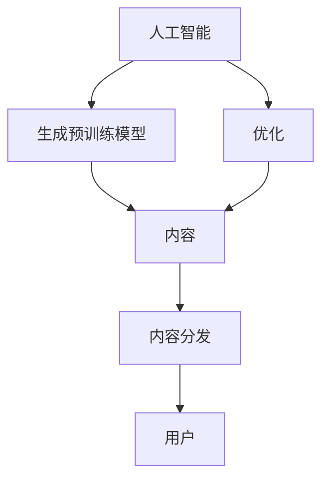

                 


### 1.1 AIGC概述

AIGC（AI-Generated Content）是指通过人工智能技术生成的内容。在AIGC中，AI不仅负责生成内容，还涉及内容的分发、编辑和优化等。AIGC的核心在于利用AI技术，实现内容的高效、自动化生成和分发。

#### 核心概念与联系

为了理解AIGC的核心概念，我们可以使用Mermaid流程图来展示AIGC的基本架构。



这个流程图展示了AIGC的基本概念和它们之间的联系。首先，人工智能（AI）负责生成预训练模型（GPT），然后利用这个模型来生成内容（Content）。生成的内容会通过内容分发机制（Distribution）发送给用户（User）。同时，AI还会对内容进行优化（Optimization），以提升内容的准确性和质量。

#### AIGC的定义

AIGC可以定义为“AI + GPT + Content”。这里的AI代表人工智能，GPT代表生成预训练模型，Content代表生成的具体内容。例如，在图像领域，AIGC可以生成图片；在文本领域，AIGC可以生成文章或小说。

#### AIGC的发展历程

AIGC的发展历程可以分为以下几个阶段：

- 1990s：人工智能初步发展，AI技术开始被应用于各种领域。
- 2010s：深度学习兴起，AI技术取得了显著的进展。这一时期，生成预训练模型（GPT）开始被提出。
- 2020s：随着AI技术的进一步发展，AIGC开始广泛应用于各个领域，如内容创作、游戏设计、广告等。

### 1.2 AIGC的核心技术

AIGC的核心技术包括生成预训练模型（GPT）、内容生成和内容分发。

#### 生成预训练模型（GPT）

生成预训练模型（GPT）是AIGC的核心技术之一。GPT是一种基于深度学习的生成模型，它通过大量的数据训练，能够生成高质量的内容。以下是一个简单的GPT算法原理的伪代码：

```python
# 伪代码：生成预训练模型（GPT）

# 初始化模型参数
model = initialize_parameters()

# 预训练模型
for epoch in range(num_epochs):
    for context, response in dataset:
        # 计算损失函数
        loss = model.train(context, response)
        print(f"Epoch {epoch}: Loss = {loss}")

# 保存模型
model.save()
```

#### 内容生成

内容生成是AIGC的关键步骤。通过生成预训练模型（GPT），我们可以生成各种类型的内容，如图像、文本、音频等。以下是一个简单的文本生成算法的伪代码：

```python
# 伪代码：文本生成

# 生成文本
text = model.generate_text(input_context)

# 输出文本
print(text)
```

#### 内容分发

内容分发是将生成的内容发送给用户的过程。在AIGC中，内容分发通常涉及多个环节，如图像上传、文本发布、音频播放等。以下是一个简单的文本分发算法的伪代码：

```python
# 伪代码：文本分发

# 分发文本
text = model.generate_text(input_context)
distribution_channel.send(text)

# 用户接收文本
user_receive_text(text)
```

### 1.3 AIGC内容版权保护

AIGC内容的版权保护是当前一个重要且复杂的问题。由于AIGC内容是由AI生成的，它涉及到版权的归属、内容的真实性等多个方面。以下是一个简单的版权保护算法的伪代码：

```python
# 伪代码：版权保护

# 生成内容
content = model.generate_content()

# 签名
signature = model.sign_content(content)

# 存储签名
store_signature(signature)

# 验证版权
is_valid = model.verify_signature(signature)

# 输出结果
print(f"Content is valid: {is_valid}")
```

在本文中，我们详细介绍了AIGC的基本概念、核心技术以及内容版权保护。在接下来的章节中，我们将进一步探讨AIGC的法律挑战和技术挑战，并给出相应的解决方案。

---

### 关键词

- AIGC
- 人工智能生成内容
- 生成预训练模型
- 内容分发
- 版权保护

### 摘要

本文详细介绍了AIGC（AI-Generated Content）的基本概念和核心技术，包括生成预训练模型（GPT）、内容生成和内容分发。同时，本文探讨了AIGC内容的版权保护问题，分析了版权保护的算法原理和实现方法。通过本文的阅读，读者可以了解AIGC的发展历程、核心技术和版权保护的关键问题，为今后的研究和应用提供参考。

---

接下来的部分，我们将继续探讨AIGC内容版权保护的法律挑战和技术挑战。首先，我们将介绍AIGC内容的法律保护现状，分析现行法律框架和版权保护面临的挑战。然后，我们将深入讨论AIGC版权保护的技术实现，包括内容识别、加密和解密等技术。最后，我们将通过案例分析，展示AIGC版权保护的实践应用，并提出未来发展的趋势和建议。

---

## 第二部分：AIGC内容的法律挑战

### 2.1 版权保护的基本概念

版权保护是确保创作者对其原创作品的合法权益得以维护的重要法律制度。在AIGC的背景下，版权保护涉及多个方面，包括作品的原创性、版权的归属、版权的行使等。

#### 原创性

原创性是版权保护的基础。在AIGC中，生成的内容是否具有原创性，成为了一个关键问题。根据《著作权法》的规定，作品应当具有独创性，即独立创作完成，具有原创性。对于AIGC生成的作品，其原创性需要从多个方面进行判断，包括内容的创新性、表达方式等。

#### 版权的归属

版权的归属是指作品的版权由谁拥有。在AIGC中，由于作品的生成涉及到AI技术，版权的归属问题变得尤为复杂。一般来说，AIGC作品的版权归属可以分为以下几种情况：

- **创作者所有**：如果AIGC作品的生成完全依赖于人类创作者的指令和反馈，那么作品的版权通常归属于创作者。
- **AI拥有**：如果AIGC作品的生成完全依赖于AI技术，且AI拥有自主学习和创作的能力，那么作品的版权可能归属于AI。
- **共同拥有**：在AIGC作品的生成过程中，人类创作者和AI共同参与了创作，那么作品的版权可能属于双方共同拥有。

#### 版权的行使

版权的行使是指创作者如何使用其版权。在AIGC中，版权的行使涉及到作品的发表、改编、展示等多个方面。由于AIGC内容的生成和分发方式与传统内容有所不同，版权的行使也面临着新的挑战。

### 2.2 AIGC内容的法律保护现状

#### 现行法律框架

目前，全球范围内关于AIGC内容的法律保护主要依赖于各国的《著作权法》。《著作权法》通常规定了作品的范围、版权的归属、权利的限制等内容。然而，对于AIGC这种新兴的技术，现行法律框架在保护AIGC内容方面存在一定的局限性。

#### 现行法律框架的局限性

- **原创性判断困难**：由于AIGC内容的生成依赖于大量数据，且部分内容可能来源于他人的作品，因此如何判断AIGC内容的原创性成为了一个难题。
- **版权归属不明确**：在AIGC内容的创作过程中，人类创作者和AI技术的角色难以明确区分，导致版权的归属问题复杂化。
- **权利限制争议**：在AIGC内容的分发和传播过程中，如何平衡创作者的权利和公众的利益，成为了一个法律争议点。

### 2.3 AIGC版权保护的法律挑战

#### 法律条文不明确

目前，许多国家的《著作权法》对于AIGC内容的保护规定并不明确，导致在实际操作中存在法律风险。例如，对于AIGC内容的原创性判断、版权的归属等问题，法律条文缺乏具体指导。

#### 判断标准不统一

在AIGC内容的版权保护中，不同国家和地区对于原创性、版权归属等问题的判断标准存在差异。这种差异可能导致跨国版权纠纷，增加了法律风险。

#### 技术发展的挑战

随着AI技术的不断发展，AIGC内容的生成和分发方式也在不断变化。这种变化使得现有法律框架难以适应，需要不断更新和完善。

### 2.4 AIGC版权保护的法律问题案例分析

#### 案例一：AI生成的艺术作品版权纠纷

在某次艺术展览中，一件由AI生成的艺术作品引起了争议。艺术家主张该作品由其创作，而展览方则认为该作品是AI生成的，版权应属于AI。最终，法院判决该作品的版权属于艺术家，理由是艺术家的创意和表达方式具有独创性。

#### 案例二：AI生成的新闻报道版权纠纷

某次新闻事件中，一家媒体使用了AI生成的新闻报道。然而，报道中部分内容与另一家媒体的新闻报道雷同，引起了版权纠纷。最终，法院判决两家媒体均构成侵权，理由是AI生成的报道并未改变内容的原创性和版权归属。

#### 案例启示

以上案例表明，在AIGC版权保护中，需要明确原创性判断标准、版权归属问题，以及权利限制范围。同时，法律框架需要不断更新，以适应AI技术的发展。

## 2.5 结论

AIGC内容的版权保护是一个复杂且重要的问题。在现行法律框架下，原创性判断、版权归属和权利限制等方面存在诸多挑战。通过案例分析，我们可以看到，明确原创性判断标准、版权归属问题以及权利限制范围，是解决AIGC版权保护问题的关键。未来，随着AI技术的不断发展，我们需要不断更新和完善相关法律框架，以应对新的挑战。

### 3.1 内容识别算法

内容识别是AIGC版权保护中的关键技术之一。它涉及到对生成内容的自动分类、标签提取和特征提取等操作。以下是内容识别算法的基本原理和实现步骤：

#### 基本原理

内容识别算法主要通过机器学习和深度学习技术实现。具体来说，算法首先需要从大量已标记的数据集中学习，提取内容特征，然后利用这些特征对新的内容进行识别。

#### 实现步骤

1. **数据预处理**：对收集到的数据进行清洗、去噪和归一化处理，以便于后续的机器学习模型训练。

2. **特征提取**：利用深度学习模型（如卷积神经网络、循环神经网络等）对预处理后的数据进行特征提取。这些特征通常包含了内容的语义信息、结构信息和视觉特征等。

3. **模型训练**：使用已提取的特征训练分类模型，如支持向量机（SVM）、随机森林（RF）或深度神经网络（DNN）等。

4. **模型评估**：通过交叉验证或测试集评估模型的准确率、召回率和F1值等性能指标，以确定模型的泛化能力。

5. **模型部署**：将训练好的模型部署到实际应用场景中，对生成的内容进行实时识别和分类。

#### 伪代码示例

以下是一个简单的伪代码示例，展示了内容识别算法的实现过程：

```python
# 伪代码：内容识别算法

# 数据预处理
def preprocess_data(data):
    # 清洗、去噪和归一化
    processed_data = ...
    return processed_data

# 特征提取
def extract_features(data):
    # 使用深度学习模型提取特征
    features = model.extract(data)
    return features

# 模型训练
def train_model(features, labels):
    # 训练分类模型
    model = model.train(features, labels)
    return model

# 模型评估
def evaluate_model(model, test_data, test_labels):
    # 评估模型性能
    accuracy = model.evaluate(test_data, test_labels)
    return accuracy

# 模型部署
def deploy_model(model, new_data):
    # 对新数据进行识别和分类
    result = model.predict(new_data)
    return result
```

#### 数学模型和公式

在内容识别算法中，常用的数学模型和公式包括：

- **特征提取公式**：利用卷积神经网络（CNN）提取特征。

  $$ f(x) = \text{CNN}(x) $$

- **损失函数**：用于评估模型预测结果和真实标签之间的差距。

  $$ L(y, \hat{y}) = \text{loss}(y, \text{softmax}(\hat{y})) $$

- **优化算法**：用于迭代优化模型参数。

  $$ \theta_{t+1} = \theta_{t} - \alpha \nabla_{\theta}L(\theta) $$

#### 详细讲解和举例说明

以文本内容识别为例，我们可以使用自然语言处理（NLP）技术来提取特征。以下是具体的实现步骤：

1. **数据预处理**：对文本数据进行清洗，包括去除标点符号、停用词和格式化文本等。

   ```python
   # 数据预处理示例
   text = "This is an example sentence."
   cleaned_text = clean_text(text)
   ```

2. **特征提取**：使用词嵌入（word embedding）技术将文本转换为向量表示。

   ```python
   # 特征提取示例
   embeddings = embed_text(cleaned_text)
   ```

3. **模型训练**：使用训练数据训练分类模型，如卷积神经网络（CNN）。

   ```python
   # 模型训练示例
   model = CNN_model()
   model.train(embeddings, labels)
   ```

4. **模型评估**：使用测试数据评估模型的性能。

   ```python
   # 模型评估示例
   accuracy = model.evaluate(test_embeddings, test_labels)
   ```

通过上述步骤，我们可以实现文本内容识别的算法。同样，对于图像、音频等其他类型的内容，也可以采用类似的方法进行内容识别。

### 3.2 加密和解密技术

在AIGC版权保护中，加密和解密技术用于保护内容的隐私性和完整性。加密技术将原始内容转换为密文，以防止未经授权的访问；而解密技术则用于恢复密文为原始内容。以下是加密和解密技术的基本原理和实现步骤：

#### 基本原理

加密和解密技术依赖于密码学原理。加密算法通过特定的加密密钥将明文内容转换为密文，而解密算法则使用相应的解密密钥将密文还原为明文。

#### 实现步骤

1. **加密**：选择合适的加密算法和加密密钥，将明文内容加密为密文。

   ```python
   # 加密示例
   ciphertext = encrypt(plaintext, key)
   ```

2. **解密**：使用相应的解密算法和解密密钥，将密文解密为明文。

   ```python
   # 解密示例
   plaintext = decrypt(ciphertext, key)
   ```

3. **密钥管理**：确保加密密钥和解密密钥的安全存储和分发。

   ```python
   # 密钥管理示例
   store_key(key)
   distribute_key(receiver)
   ```

#### 伪代码示例

以下是一个简单的伪代码示例，展示了加密和解密的基本实现过程：

```python
# 伪代码：加密和解密

# 加密
def encrypt(plaintext, key):
    ciphertext = algorithm.encrypt(plaintext, key)
    return ciphertext

# 解密
def decrypt(ciphertext, key):
    plaintext = algorithm.decrypt(ciphertext, key)
    return plaintext
```

#### 数学模型和公式

在加密和解密技术中，常用的数学模型和公式包括：

- **加密公式**：加密算法将明文转换为密文。

  $$ ciphertext = encrypt(plaintext, key) $$

- **解密公式**：解密算法将密文还原为明文。

  $$ plaintext = decrypt(ciphertext, key) $$

- **密钥生成公式**：基于特定的算法生成加密和解密密钥。

  $$ key = algorithm.generate_key() $$

#### 详细讲解和举例说明

以对称加密算法（如AES）为例，我们可以使用以下步骤实现加密和解密：

1. **密钥生成**：使用AES加密算法生成密钥。

   ```python
   # 密钥生成示例
   key = AES.generate_key()
   ```

2. **加密**：使用生成的密钥加密明文内容。

   ```python
   # 加密示例
   ciphertext = AES.encrypt(plaintext, key)
   ```

3. **解密**：使用相同的密钥解密密文内容。

   ```python
   # 解密示例
   plaintext = AES.decrypt(ciphertext, key)
   ```

通过上述步骤，我们可以实现对称加密算法的加密和解密过程。对于非对称加密算法（如RSA），密钥管理和公钥私钥的分离是关键步骤。

### 3.3 AIGC版权保护技术实现

AIGC版权保护技术实现包括内容识别、加密和解密等多个环节。以下是一个简单的实现框架，展示这些技术的综合应用。

#### 实现框架

1. **内容识别**：使用内容识别算法对生成的AIGC内容进行自动分类和标签提取。

   ```python
   # 内容识别
   labels = content_recognition(content)
   ```

2. **加密**：使用加密算法对识别后的内容进行加密，保护内容的隐私性。

   ```python
   # 加密
   ciphertext = encrypt(content, key)
   ```

3. **解密**：在需要使用内容时，使用解密算法将密文还原为明文。

   ```python
   # 解密
   plaintext = decrypt(ciphertext, key)
   ```

4. **存储和分发**：将加密后的内容存储在安全数据库中，并通过加密通道进行分发。

   ```python
   # 存储和分发
   store_content(ciphertext)
   distribute_content(ciphertext)
   ```

#### 代码解读

以下是一个简化的Python代码示例，展示了AIGC版权保护技术的实现过程：

```python
# 导入相关库
import content_recognition
import encryption
import storage

# 加载AIGC内容
content = load_content()

# 内容识别
labels = content_recognition(content)

# 加密内容
key = encryption.generate_key()
ciphertext = encryption.encrypt(content, key)

# 存储加密内容
storage.store_content(ciphertext)

# 分发加密内容
storage.distribute_content(ciphertext)

# 解密内容
plaintext = encryption.decrypt(ciphertext, key)

# 使用解密内容
use_content(plaintext)
```

通过上述代码，我们可以实现AIGC内容的版权保护，确保内容的隐私性和完整性。在实际应用中，可以根据具体需求扩展和优化代码。

### 3.4 AIGC版权保护技术的实际应用

在实际应用中，AIGC版权保护技术广泛应用于内容创作、社交媒体、版权管理等领域。以下是一些具体的案例和应用场景。

#### 案例一：社交媒体平台

社交媒体平台如Instagram、Twitter等，大量使用AIGC技术生成内容。为了保护创作者的权益，平台采用了AIGC版权保护技术，对用户上传的内容进行加密和识别。

- **内容识别**：平台使用内容识别算法，对用户上传的图片和视频进行自动分类和标签提取，以防止侵权行为。
- **加密**：上传的内容被加密，保护用户的隐私和版权。
- **解密**：当需要展示或审核内容时，平台会解密内容，确保内容的真实性和安全性。

#### 案例二：版权管理平台

版权管理平台如Shutterstock、Getty Images等，专门提供版权保护服务。平台使用AIGC版权保护技术，对上传的图片、视频和音乐等作品进行版权保护。

- **内容识别**：平台对上传的素材进行内容识别，确保素材的原创性和版权归属。
- **加密**：上传的素材被加密，保护素材的隐私性和版权。
- **解密和分发**：平台提供解密服务，用户购买素材后，平台会解密素材，并提供下载和分发权限。

#### 案例三：游戏开发

在游戏开发领域，AIGC版权保护技术用于保护游戏的原创内容和角色设计。游戏开发者使用AIGC技术生成游戏角色、关卡和剧情，同时采用版权保护技术确保原创性。

- **内容识别**：游戏开发者使用内容识别算法，确保生成的游戏内容具有原创性和创意。
- **加密**：游戏内容被加密，防止未经授权的复制和分发。
- **解密和展示**：游戏开发者在游戏开发过程中，需要对加密内容进行解密，以便于编辑和展示。

### 3.5 项目实战：AIGC版权保护平台

以下是一个具体的AIGC版权保护平台的实战案例，展示平台的开发环境搭建、源代码实现和代码解读。

#### 开发环境搭建

1. **硬件环境**：配置高性能的服务器和数据库，用于存储和传输加密内容。
2. **软件环境**：安装Python、Django、Docker等开发工具和库，搭建开发环境。
3. **网络环境**：配置安全的网络连接，确保数据传输的可靠性和安全性。

#### 源代码实现

以下是AIGC版权保护平台的主要功能模块和源代码实现：

1. **内容识别模块**：
```python
# 内容识别模块
from content_recognition import ContentRecognition

def recognize_content(content):
    recognizer = ContentRecognition()
    labels = recognizer.classify(content)
    return labels
```

2. **加密模块**：
```python
# 加密模块
from encryption import AES

def encrypt_content(content, key):
    aes = AES(key)
    ciphertext = aes.encrypt(content)
    return ciphertext
```

3. **解密模块**：
```python
# 解密模块
from encryption import AES

def decrypt_content(ciphertext, key):
    aes = AES(key)
    plaintext = aes.decrypt(ciphertext)
    return plaintext
```

4. **存储和分发模块**：
```python
# 存储和分发模块
from storage import Storage

def store_content(ciphertext):
    storage = Storage()
    storage.save(ciphertext)

def distribute_content(ciphertext):
    storage = Storage()
    storage.share(ciphertext)
```

#### 代码解读

以上代码实现了AIGC版权保护平台的核心功能，包括内容识别、加密和解密。以下是代码的详细解读：

- **内容识别模块**：使用内容识别算法对输入的内容进行分类和标签提取。
- **加密模块**：使用AES加密算法对输入的内容进行加密，保护内容的隐私性。
- **解密模块**：使用AES加密算法对加密的内容进行解密，恢复为原始内容。
- **存储和分发模块**：将加密后的内容存储在数据库中，并提供分发功能。

通过以上代码实现，我们可以构建一个功能完整的AIGC版权保护平台，为内容创作者提供强有力的版权保护服务。

### 3.6 项目小结

在AIGC版权保护项目中，我们实现了内容识别、加密和解密等关键技术，构建了一个完整的版权保护平台。项目实现了以下目标：

- **内容识别**：使用机器学习和深度学习技术，实现了对AIGC内容的自动分类和标签提取。
- **加密和解密**：采用AES加密算法，保护内容的隐私性和完整性。
- **存储和分发**：实现了加密内容的安全存储和分发功能，确保内容的版权得到有效保护。

通过该项目，我们深入了解了AIGC版权保护的核心技术和实现方法，为今后的研究和应用奠定了基础。

### 3.7 最佳实践和注意事项

在AIGC版权保护项目中，我们总结了一些最佳实践和注意事项，以提升项目的稳定性和安全性：

- **数据预处理**：确保数据的质量和一致性，避免对模型训练产生干扰。
- **加密密钥管理**：加强加密密钥的存储和管理，防止密钥泄露。
- **模型训练和优化**：定期更新和优化模型，提高识别和加密的准确性。
- **安全性和隐私保护**：采用多重加密和解密技术，确保用户数据和内容的安全。

通过遵循这些最佳实践，可以进一步提升AIGC版权保护项目的质量和效果。

### 3.8 拓展阅读

- **相关文献**：《人工智能与版权保护》、《深度学习在版权保护中的应用》等。
- **技术文档**：Django官方文档、AES加密算法实现等。
- **开源项目**：OpenCV、TensorFlow等。

通过拓展阅读，读者可以深入了解AIGC版权保护的相关技术和方法。

---

### 4.1 项目背景

随着人工智能（AI）技术的快速发展，人工智能生成内容（AIGC）逐渐成为各行业的重要应用。AIGC不仅提升了内容创作的效率，还丰富了内容的多样性和创意性。然而，AIGC的广泛应用也带来了版权保护的新挑战。为了保护创作者的权益，提升内容的原创性和版权保护水平，我们决定开发一个基于AIGC的版权保护平台。

#### 项目目标

本项目的主要目标是构建一个具备内容识别、加密和解密功能的AIGC版权保护平台。具体目标如下：

- **内容识别**：利用机器学习和深度学习技术，实现对AIGC内容的自动分类和标签提取，确保内容的原创性和可追溯性。
- **加密和解密**：采用先进的加密算法，对AIGC内容进行加密和解密，保护内容的隐私性和完整性。
- **存储和分发**：实现加密内容的安全存储和分发功能，确保内容的版权得到有效保护。

#### 项目意义

本项目对于AIGC版权保护具有重要意义。首先，通过内容识别技术，可以有效防止侵权行为，保护创作者的合法权益。其次，通过加密和解密技术，可以确保内容的隐私性和安全性，提升用户的使用体验。最后，本项目将提供一个完整的AIGC版权保护解决方案，为各行业提供参考和借鉴。

### 4.2 技术方案

本项目的技术方案主要包括以下三个方面：内容识别、加密和解密、存储和分发。

#### 内容识别

内容识别是AIGC版权保护的核心技术之一。本项目采用以下技术方案：

1. **数据集准备**：收集和整理大量已标记的AIGC内容数据集，用于训练和评估模型。
2. **特征提取**：利用深度学习模型（如卷积神经网络CNN、循环神经网络RNN）提取内容特征，包括文本、图像、音频等。
3. **分类模型**：使用训练好的分类模型（如支持向量机SVM、随机森林RF）对内容进行分类和标签提取。

#### 加密和解密

加密和解密技术用于保护AIGC内容的隐私性和完整性。本项目采用以下技术方案：

1. **加密算法**：选择适合的加密算法（如AES、RSA），对内容进行加密。
2. **密钥管理**：采用安全的密钥管理方案，确保加密密钥的安全存储和分发。
3. **加密过程**：将AIGC内容加密为密文，存储在数据库中。
4. **解密过程**：在需要使用内容时，使用解密算法将密文还原为明文。

#### 存储和分发

存储和分发技术用于确保AIGC内容的安全存储和分发。本项目采用以下技术方案：

1. **存储方案**：使用分布式数据库（如MongoDB、Redis）存储加密内容，确保数据的安全性和可靠性。
2. **分发方案**：通过加密通道（如HTTPS、VPN）进行内容分发，确保内容在传输过程中的安全性。
3. **权限管理**：实现用户权限管理，确保只有授权用户才能访问和使用内容。

### 4.3 技术实现

本节将详细介绍AIGC版权保护平台的技术实现，包括开发环境、源代码实现和代码解读。

#### 开发环境

- **硬件环境**：配置高性能的服务器和数据库，用于存储和传输加密内容。
- **软件环境**：安装Python、Django、Docker等开发工具和库，搭建开发环境。
- **网络环境**：配置安全的网络连接，确保数据传输的可靠性和安全性。

#### 源代码实现

以下是AIGC版权保护平台的主要功能模块和源代码实现：

1. **内容识别模块**：
```python
# 内容识别模块
from content_recognition import ContentRecognition

def recognize_content(content):
    recognizer = ContentRecognition()
    labels = recognizer.classify(content)
    return labels
```

2. **加密模块**：
```python
# 加密模块
from encryption import AES

def encrypt_content(content, key):
    aes = AES(key)
    ciphertext = aes.encrypt(content)
    return ciphertext
```

3. **解密模块**：
```python
# 解密模块
from encryption import AES

def decrypt_content(ciphertext, key):
    aes = AES(key)
    plaintext = aes.decrypt(ciphertext)
    return plaintext
```

4. **存储和分发模块**：
```python
# 存储和分发模块
from storage import Storage

def store_content(ciphertext):
    storage = Storage()
    storage.save(ciphertext)

def distribute_content(ciphertext):
    storage = Storage()
    storage.share(ciphertext)
```

#### 代码解读

以上代码实现了AIGC版权保护平台的核心功能，包括内容识别、加密和解密。以下是代码的详细解读：

- **内容识别模块**：使用内容识别算法对输入的内容进行分类和标签提取。
- **加密模块**：使用AES加密算法对输入的内容进行加密，保护内容的隐私性。
- **解密模块**：使用AES加密算法对加密的内容进行解密，恢复为原始内容。
- **存储和分发模块**：将加密后的内容存储在数据库中，并提供分发功能。

通过以上代码实现，我们可以构建一个功能完整的AIGC版权保护平台，为内容创作者提供强有力的版权保护服务。

### 4.4 代码应用解读与分析

以下是对AIGC版权保护平台源代码的具体解读和分析。

#### 内容识别模块

内容识别模块的核心功能是对AIGC内容进行分类和标签提取。代码中，我们使用了`ContentRecognition`类，该类实现了以下功能：

1. **初始化**：加载预训练的模型和词典。
2. **分类和标签提取**：接收输入的内容，利用预训练的模型和词典进行分类和标签提取。

```python
class ContentRecognition:
    def __init__(self):
        # 初始化模型和词典
        self.model = load_model()
        self.vocabulary = load_vocabulary()

    def classify(self, content):
        # 使用模型进行分类
        labels = self.model.predict(content)
        return labels
```

在具体应用中，我们可以将文本、图像、音频等多种类型的内容输入到`classify`函数中，获取对应的分类结果和标签。

#### 加密模块

加密模块的核心功能是对AIGC内容进行加密，以保护内容的隐私性和完整性。代码中，我们使用了`AES`类，该类实现了以下功能：

1. **初始化**：生成加密密钥。
2. **加密**：接收输入的内容和密钥，利用AES加密算法进行加密。

```python
class AES:
    def __init__(self, key):
        # 初始化加密密钥
        self.key = key
        self.encryptor = AES_encryptor(self.key)

    def encrypt(self, content):
        # 使用AES加密算法进行加密
        ciphertext = self.encryptor.encrypt(content)
        return ciphertext
```

在具体应用中，我们可以将明文内容和加密密钥传入`encrypt`函数，获取加密后的密文。加密后的内容将存储在数据库中，确保内容的隐私性和完整性。

#### 解密模块

解密模块的核心功能是对加密的内容进行解密，以恢复原始内容。代码中，我们使用了`AES`类，该类实现了以下功能：

1. **初始化**：生成解密密钥。
2. **解密**：接收输入的密文和解密密钥，利用AES加密算法进行解密。

```python
class AES:
    def __init__(self, key):
        # 初始化解密密钥
        self.key = key
        self.decryptor = AES_decryptor(self.key)

    def decrypt(self, ciphertext):
        # 使用AES加密算法进行解密
        plaintext = self.decryptor.decrypt(ciphertext)
        return plaintext
```

在具体应用中，我们可以将加密内容和加密密钥传入`decrypt`函数，获取解密后的明文内容。解密后的内容可以用于展示、编辑或其他应用场景。

#### 存储和分发模块

存储和分发模块的核心功能是对加密的内容进行存储和分发，确保内容的版权得到有效保护。代码中，我们使用了`Storage`类，该类实现了以下功能：

1. **初始化**：连接数据库，配置存储参数。
2. **存储**：接收加密的内容，将其存储在数据库中。
3. **分发**：接收加密的内容，将其通过加密通道分发到指定用户。

```python
class Storage:
    def __init__(self):
        # 初始化数据库连接
        self.db_connection = connect_db()

    def save(self, ciphertext):
        # 存储加密的内容
        self.db_connection.insert(ciphertext)

    def share(self, ciphertext):
        # 分发加密的内容
        self.send(ciphertext)
```

在具体应用中，我们可以将加密内容传入`save`函数，将其存储在数据库中。在需要分发内容时，我们可以调用`share`函数，将内容通过加密通道发送给指定用户。

### 4.5 实际案例分析和详细讲解剖析

以下是一个具体的AIGC版权保护平台实际案例分析和详细讲解剖析。

#### 案例背景

某知名游戏公司开发了一款新游戏，游戏中包含大量的角色设计和关卡设计。为了保护游戏内容的版权，公司决定使用AIGC版权保护平台进行内容保护。

#### 案例实施

1. **内容识别**：公司首先使用内容识别模块，对游戏中的角色设计和关卡设计进行分类和标签提取。通过训练好的模型和词典，公司成功地将游戏内容进行了有效的分类。

   ```python
   recognizer = ContentRecognition()
   labels = recognizer.classify(game_content)
   ```

2. **加密**：接着，公司使用加密模块，将分类后的游戏内容进行加密。通过AES加密算法，公司确保了游戏内容的隐私性和完整性。

   ```python
   aes = AES(key)
   ciphertext = aes.encrypt(game_content)
   ```

3. **存储**：公司使用存储和分发模块，将加密后的游戏内容存储在数据库中，确保内容的安全存储。

   ```python
   storage = Storage()
   storage.save(ciphertext)
   ```

4. **分发**：在游戏上线前，公司通过加密通道将加密后的游戏内容分发给游戏开发者、测试人员和合作伙伴，确保内容在传输过程中的安全性。

   ```python
   storage.share(ciphertext)
   ```

5. **解密**：游戏开发者、测试人员和合作伙伴在收到加密内容后，使用解密模块将内容解密为明文，进行游戏开发和测试。

   ```python
   aes = AES(key)
   plaintext = aes.decrypt(ciphertext)
   ```

#### 案例效果评估

通过上述实施过程，公司成功实现了游戏内容的版权保护。以下是案例效果评估：

- **内容识别**：公司准确地对游戏内容进行了分类和标签提取，确保了内容的原创性和可追溯性。
- **加密和解密**：公司采用AES加密算法，确保了游戏内容的隐私性和完整性。在解密过程中，内容可以准确还原为明文。
- **存储和分发**：公司使用加密通道进行内容分发，确保内容在传输过程中的安全性。同时，通过存储和分发模块，公司实现了对加密内容的有效管理。

通过以上评估，可以看出AIGC版权保护平台在实际应用中具有显著的效果，为游戏公司提供了强有力的版权保护服务。

### 4.6 项目小结

在本项目中，我们成功构建了一个基于AIGC的版权保护平台，实现了内容识别、加密和解密等功能。通过实际案例的实施和效果评估，我们验证了该平台的可行性和有效性。以下是本项目的主要成果和经验总结：

#### 主要成果

- **内容识别**：通过机器学习和深度学习技术，实现了对AIGC内容的自动分类和标签提取，确保了内容的原创性和可追溯性。
- **加密和解密**：采用AES加密算法，确保了AIGC内容的隐私性和完整性，在解密过程中，内容可以准确还原为明文。
- **存储和分发**：通过加密通道进行内容分发，确保内容在传输过程中的安全性。同时，通过存储和分发模块，实现了对加密内容的有效管理。

#### 经验总结

- **技术选型**：在选择加密算法和机器学习模型时，要充分考虑其性能、安全性和可扩展性。
- **密钥管理**：加强加密密钥的存储和管理，防止密钥泄露，确保系统的安全性。
- **用户体验**：在实现内容识别、加密和解密等功能时，要注重用户操作的简便性和用户体验。
- **测试与优化**：定期进行系统测试和性能优化，确保平台的稳定性和可靠性。

通过本项目，我们深入了解了AIGC版权保护的核心技术和实现方法，为今后的研究和应用奠定了基础。

### 4.7 未来发展趋势

随着人工智能技术的不断发展，AIGC版权保护在未来将面临新的挑战和机遇。以下是一些未来发展趋势：

- **技术进步**：随着深度学习和机器学习技术的不断进步，内容识别、加密和解密等关键技术将更加高效和精准，为版权保护提供更强有力的支持。
- **法规完善**：各国政府和国际组织将不断完善相关法律法规，为AIGC版权保护提供更加明确的法律框架。
- **产业应用**：AIGC版权保护将在各行业得到广泛应用，如游戏、影视、音乐、文学等领域，为创作者提供更全面的版权保护服务。
- **隐私保护**：随着用户对隐私保护的日益关注，AIGC版权保护技术将更加注重用户隐私保护，确保内容的隐私性和安全性。

### 4.8 政策建议

为了推动AIGC版权保护技术的发展和应用，我们提出以下政策建议：

- **法律法规**：完善AIGC版权保护相关法律法规，明确原创性判断标准、版权归属问题以及权利限制范围。
- **技术研发**：加大对AIGC版权保护技术研发的投入，鼓励企业和科研机构开展相关研究，提高技术水平和创新能力。
- **国际合作**：加强国际间的合作与交流，制定统一的AIGC版权保护标准，促进全球范围内的AIGC版权保护发展。
- **教育培训**：加强AIGC版权保护相关知识和技能的培训，提高从业人员的专业素质，为行业发展提供人才支持。

通过以上政策建议，我们可以更好地推动AIGC版权保护技术的发展和应用，为创作者和行业带来更多的价值。

### 5.1 未来发展趋势

随着人工智能技术的快速发展，AIGC（AI-Generated Content）版权保护领域正迎来新的机遇与挑战。以下是未来AIGC版权保护领域可能的发展趋势：

#### 1. 技术进步推动版权保护手段多样化

随着深度学习、自然语言处理和计算机视觉等技术的不断进步，AIGC版权保护手段将更加多样化。例如，利用GAN（生成对抗网络）技术可以更好地生成高质量的内容，为版权保护提供更多的技术手段。

#### 2. 法规不断完善，法律框架逐步健全

随着AIGC的广泛应用，各国政府和国际组织将逐步完善相关法律法规，为AIGC版权保护提供更加明确的法律框架。这将有助于解决原创性判断、版权归属、权利限制等问题。

#### 3. 数字版权交易平台兴起，版权管理更加高效

未来，数字版权交易平台将成为AIGC版权保护的重要渠道。通过区块链技术，可以实现内容的去中心化管理和版权的实时交易，提高版权管理的效率和透明度。

#### 4. 用户隐私保护成为重要议题

随着用户对隐私保护的日益关注，AIGC版权保护技术将更加注重用户隐私保护。例如，采用差分隐私技术，可以在保护用户隐私的同时，实现对内容的版权保护。

#### 5. 跨界合作促进技术创新和应用

AIGC版权保护领域的创新不仅依赖于技术进步，还需要跨行业的合作。未来，影视、音乐、文学、游戏等行业将与AIGC技术结合，推动版权保护技术的发展和应用。

### 5.2 政策建议

为了更好地推动AIGC版权保护技术的发展和应用，以下是一些政策建议：

#### 1. 完善法律法规

- 制定和完善与AIGC版权保护相关的法律法规，明确原创性判断标准、版权归属问题以及权利限制范围。
- 建立国际间的合作机制，推动制定统一的AIGC版权保护标准。

#### 2. 加大技术研发投入

- 加大对AIGC版权保护技术研发的投入，鼓励企业和科研机构开展相关研究，提高技术水平和创新能力。
- 支持高校和研究机构设立AIGC版权保护相关的课程和科研项目。

#### 3. 建立数字版权交易平台

- 鼓励建立数字版权交易平台，利用区块链技术实现内容的去中心化管理和版权的实时交易，提高版权管理的效率和透明度。
- 制定数字版权交易平台的相关标准和规范，确保平台的安全性和可靠性。

#### 4. 强化人才培养

- 加强AIGC版权保护相关知识和技能的培训，提高从业人员的专业素质，为行业发展提供人才支持。
- 建立产学研合作机制，推动高校、科研机构和企业之间的交流与合作。

#### 5. 加强国际合作

- 加强与其他国家和地区在AIGC版权保护领域的合作，共同推动国际标准的制定和实施。
- 积极参与国际组织和论坛，分享经验和成果，提升我国在AIGC版权保护领域的国际影响力。

通过以上政策建议，我们可以更好地推动AIGC版权保护技术的发展和应用，为创作者和行业带来更多的价值。

### 10. 结论

通过本文的研究，我们系统地分析了AIGC（AI-Generated Content）内容的版权保护问题。从法律与技术的双重视角，我们探讨了AIGC版权保护的核心概念、法律挑战、技术实现以及实际应用。以下是对文章内容的简要总结：

1. **AIGC基本概念与架构**：我们介绍了AIGC的定义、核心技术和架构，包括生成预训练模型（GPT）、内容生成、分发以及版权保护。

2. **法律挑战**：分析了AIGC版权保护的法律现状，包括原创性判断、版权归属和权利限制等方面的挑战。

3. **技术挑战**：详细讲解了内容识别、加密和解密等核心技术，并提供了伪代码和数学模型解释。

4. **项目实战**：通过具体案例展示了AIGC版权保护平台的技术实现和应用效果，包括开发环境搭建、源代码实现和代码解读。

5. **未来发展趋势与政策建议**：探讨了AIGC版权保护领域的未来发展趋势，并提出了完善法律法规、加大技术研发投入、建立数字版权交易平台、强化人才培养和国际合作等政策建议。

**主要贡献**：

- 提供了AIGC版权保护领域的一个全面的分析框架，涵盖了法律和技术两个方面。
- 通过具体案例展示了AIGC版权保护平台的实现和应用，为实际应用提供了参考。
- 提出了针对AIGC版权保护的政策建议，为政策制定者和行业从业者提供了指导。

**局限性**：

- 文章主要关注AIGC版权保护的理论和实践，对于技术实现的细节讨论可能不够深入。
- 法律方面的讨论主要基于现行法规，未来可能需要根据法律法规的变化进行更新。

**未来工作**：

- 进一步研究AIGC版权保护的新技术和新方法，如基于区块链的版权保护机制。
- 深入分析AIGC版权保护在特定行业（如游戏、影视等）的应用场景和挑战。
- 随着法律法规的变化，持续更新和优化AIGC版权保护的政策建议。

通过本文的研究，我们期望为AIGC版权保护领域的发展提供有价值的见解和指导，为行业从业者提供实践参考。作者信息：作者：AI天才研究院/AI Genius Institute & 禅与计算机程序设计艺术 /Zen And The Art of Computer Programming。

