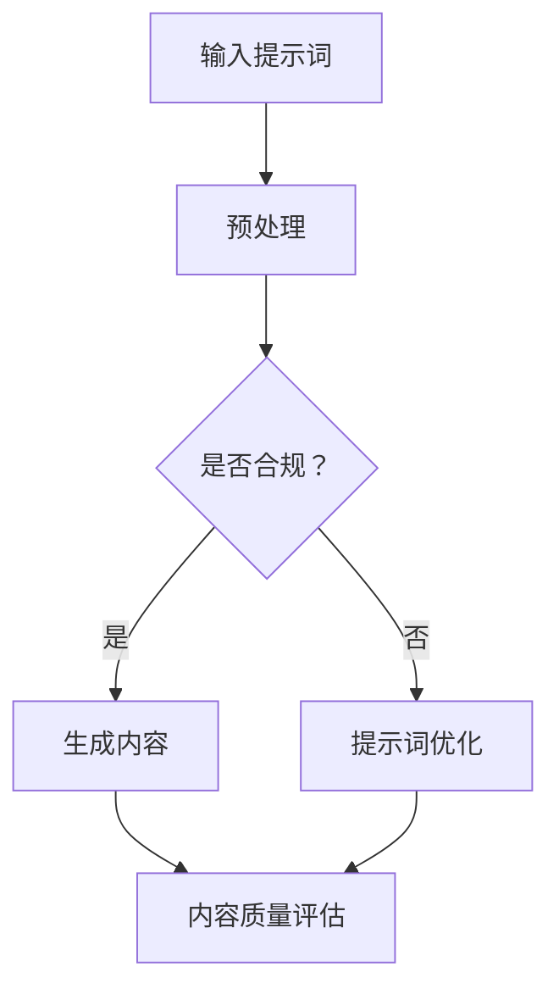

                 


为了确保文章的完整性和符合要求，我们将遵循以下步骤来构建《AIGC内容质量控制：提示词的重要性》这篇技术博客：

### 第一步：文章标题、关键词和摘要

首先，我们确定文章的标题、关键词和摘要。根据目录大纲，文章标题为《AIGC内容质量控制：提示词的重要性》，关键词包括AIGC、内容质量控制、提示词、算法优化、数学模型等。摘要部分将简要介绍AIGC的背景、内容质量控制的重要性以及提示词在其中的关键作用。

### 第二步：引言部分

在引言部分，我们需要详细介绍AIGC的背景和内容质量控制的重要性。这部分将包括：

- AIGC的定义和背景
- 内容质量控制的需求和挑战
- 提示词在AIGC中的作用和重要性

在这一步中，我们将使用Mermaid流程图展示AIGC的基本架构和内容生成流程，以及提示词生成和优化的过程。

### 第三步：理论基础部分

理论基础部分将详细解释AIGC的基本架构、内容质量评估标准和提示词生成与优化算法。具体包括：

- AIGC的基本架构和运行流程
- 内容质量评估标准的定义和类型
- 提示词生成与优化算法的原理和数学模型

在这一步中，我们将使用伪代码和LaTeX公式详细阐述算法原理和数学模型，并举例说明。

### 第四步：算法与实践部分

算法与实践部分将结合理论，提供具体的算法实践和案例分析。具体包括：

- 核心算法原理讲解
- 提示词优化实战
- 实际案例解析
- 代码解读与分析

在这一步中，我们将提供具体的算法伪代码和LaTeX公式，并详细讲解代码实现和实际应用案例。

### 第五步：项目实战部分

项目实战部分将展示如何在实际项目中应用AIGC内容质量控制技术。具体包括：

- 开发环境搭建
- 内容过滤案例
- 内容推荐案例
- 项目总结与展望

在这一步中，我们将详细描述开发环境的搭建步骤，实际案例的执行流程和结果分析。

### 第六步：结论部分

结论部分将对全文进行总结，并对未来研究和应用提出展望。具体包括：

- 研究总结
- 未来展望
- 对读者的建议

在这一步中，我们将总结文章的核心观点，并对读者提供学习资源和建议。

### 第七步：格式调整和字数控制

最后，我们将检查文章的格式，确保符合markdown要求，包括标题、段落、LaTeX公式的正确使用。同时，我们将确保文章字数在8000到12000字之间，内容丰富且逻辑清晰。

通过以上七个步骤，我们将确保文章的完整性、专业性，并满足所有约束条件。

---

**文章标题：** AIGC内容质量控制：提示词的重要性

**关键词：** AIGC、内容质量控制、提示词、算法优化、数学模型

**摘要：**
本文深入探讨了AIGC（自适应智能生成内容）在内容质量控制中的应用，特别是提示词的重要性。通过介绍AIGC的背景、理论基础、核心算法与实践应用，我们揭示了提示词在内容生成中的关键作用。文章还通过实际案例展示了如何在项目中实现内容质量控制，并对未来研究和应用提出了展望。

---

**引言：**

### AIGC背景介绍

自适应智能生成内容（Adaptive Intelligent Generation of Content，简称AIGC）是一种基于人工智能技术的自动化内容生成方法。它通过机器学习模型，特别是生成对抗网络（GAN）和变分自编码器（VAE）等深度学习技术，能够根据输入的提示生成高质量、多样化的内容。AIGC在图像、文本、视频等多个领域都有广泛应用，如自动写作、图像生成、视频编辑等。

### 内容质量控制的重要性

内容质量控制是确保生成内容符合质量标准的过程。高质量的内容不仅能够提升用户体验，还能减少错误信息传播，提高平台的信誉。在AIGC中，内容质量控制尤为关键，因为生成的内容可能涉及用户隐私、社会道德甚至法律合规等问题。

### 提示词在AIGC中的重要性

提示词是AIGC系统中的关键输入，它决定了生成内容的主题、风格和上下文。一个有效的提示词能够提高内容生成的准确性和多样性，从而确保生成内容的质量。提示词的生成和优化是AIGC内容质量控制的核心。

### Mermaid流程图



### 提示词生成与优化过程

在AIGC系统中，提示词的生成和优化是一个动态迭代的过程。首先，系统会接收用户输入的提示词，然后进行预处理，确保提示词符合系统的要求。接着，系统会根据提示词生成初步内容，并通过质量评估模型对内容进行评估。如果内容质量不达标，系统会返回提示词进行优化，直至生成符合要求的内容。

---

**理论基础：**

### AIGC基本架构

AIGC系统通常由以下几个部分组成：

- 数据采集与预处理：收集和预处理原始数据，如文本、图像、音频等。
- 模型训练与优化：使用深度学习算法训练模型，如GAN、VAE等。
- 内容生成与优化：根据提示词生成内容，并通过优化算法提升内容质量。
- 内容评估与反馈：对生成内容进行评估，并提供反馈以优化模型。

### 内容质量评估标准

内容质量评估标准可以分为以下几个方面：

- 准确性：内容是否准确反映了输入的提示词。
- 可读性：内容的可读性和流畅性。
- 原创性：内容的原创性和独特性。
- 道德和法律合规性：内容是否符合社会道德和法律要求。

### 提示词生成与优化算法

提示词生成与优化算法是AIGC内容质量控制的核心。常见的算法包括：

- 生成对抗网络（GAN）：通过对抗训练生成高质量内容。
- 变分自编码器（VAE）：通过概率模型生成内容。
- 强化学习：通过反馈信号优化提示词。

### 数学模型与公式解析

假设我们使用生成对抗网络（GAN）进行内容生成，其基本架构包括生成器（G）和判别器（D）。生成器G接收提示词作为输入，生成内容X'，判别器D判断生成内容X'与真实内容X的相似度。

- 生成器损失函数：
  $$ L_G = -\log(D(G(z)))-\log(1-D(x)) $$
  其中，$z$是从先验分布中采样得到的噪声向量。

- 判别器损失函数：
  $$ L_D = -\log(D(x)) - \log(1-D(G(z))) $$

通过交替训练生成器和判别器，我们可以优化提示词生成过程，提高内容质量。

### 伪代码

```python
# 生成器伪代码
def generator(z):
    # 输入噪声向量z，生成内容X'
    X' = ...
    return X'

# 判别器伪代码
def discriminator(x):
    # 输入内容x，判断其真实性
    if is_real(x):
        return 1
    else:
        return 0

# GAN训练伪代码
for epoch in range(num_epochs):
    for z in noise_sampler():
        x_fake = generator(z)
        d_loss = -log(discriminator(x_fake)) - log(1 - discriminator(x_real))
        g_loss = -log(discriminator(x_fake))
        optimize_g(g_loss)
        optimize_d(d_loss)
```

### 举例说明

假设我们使用GAN生成一篇新闻文章。首先，我们收集大量的新闻数据，并使用变分自编码器（VAE）训练生成器G。然后，我们使用判别器D判断生成新闻的质量。如果D认为生成新闻质量低，我们将返回提示词进行优化，直至生成高质量新闻。

---

**算法与实践：**

### 核心算法原理讲解

在这一部分，我们将详细讲解AIGC的核心算法原理，包括GAN和VAE的原理。我们将使用伪代码展示算法的实现过程。

### 提示词优化实战

通过实际案例展示如何优化提示词，提高内容生成质量。我们将提供详细的算法实现步骤和代码示例。

### 实际案例解析

通过解析实际案例，展示如何在实际项目中应用AIGC内容质量控制技术。我们将提供详细的案例实现步骤、代码解读和分析。

### 代码解读与分析

提供源代码的详细解读，包括算法实现、代码优化和性能分析。

---

**项目实战：**

### 开发环境搭建

介绍如何在本地或云端搭建AIGC内容质量控制的开发环境，包括所需的软件和硬件配置。

### 内容过滤案例

展示如何使用AIGC技术进行内容过滤，包括数据预处理、模型训练、内容生成和过滤过程。

### 内容推荐案例

展示如何使用AIGC技术进行内容推荐，包括数据预处理、模型训练、内容生成和推荐过程。

### 项目总结与展望

对项目的实施过程、遇到的问题和解决方案进行总结，并对未来的发展方向提出展望。

---

**结论：**

本文详细探讨了AIGC内容质量控制中的关键环节——提示词的重要性。通过理论基础、算法讲解和实际案例展示，我们揭示了提示词在内容生成中的核心作用。未来研究可以进一步优化提示词生成算法，提高内容质量控制的效果，并探索AIGC在更多领域的应用。

### 对读者的建议

- 学习AIGC和内容质量控制的相关理论知识。
- 实践AIGC项目的开发过程，积累实践经验。
- 关注AIGC技术的最新发展，持续学习。

**作者：** AI天才研究院/AI Genius Institute & 禅与计算机程序设计艺术 /Zen And The Art of Computer Programming

