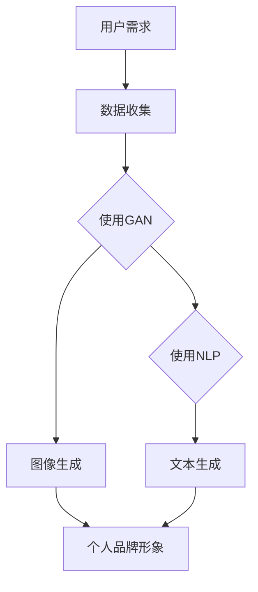

                 


## 文章标题

### AIGC在个人品牌塑造中的应用：AI驱动的形象设计

---

**关键词：** AIGC, 个人品牌塑造, AI驱动, 形象设计, 生成对抗网络, 自然语言处理

---

**摘要：** 本文将深入探讨人工智能生成内容（AIGC）在个人品牌塑造中的应用，特别是AI驱动的形象设计。通过分析AIGC的核心概念、技术原理和数学模型，以及提供实际项目实战案例，我们将展示如何利用AIGC技术为个人品牌打造独特而专业的形象。

---

## 设计思路

### 1. 核心概念与联系

AIGC是人工智能领域的一个重要分支，它通过生成对抗网络（GAN）、自然语言处理（NLP）等技术生成高质量的内容。在个人品牌塑造中，AIGC可以用于创建个性化的形象，包括图像、文本和视频等多媒体内容。

为了使读者更容易理解，我们首先使用Mermaid流程图来展示AIGC的技术栈和其在个人品牌塑造中的流程。以下是一个简单的示例：



### 2. 核心算法原理讲解

AIGC的核心算法包括生成对抗网络（GAN）和自然语言处理（NLP）。接下来，我们将分别详细讲解这两个算法的原理。

**生成对抗网络（GAN）**

生成对抗网络是一种由生成器和判别器组成的神经网络结构。生成器试图生成与真实数据相似的数据，而判别器则试图区分生成器和真实数据。通过不断的训练，生成器的性能会逐渐提高。

以下是一个简单的GAN算法的伪代码：

```python
# 生成器的伪代码
def G(z):
    # 输入随机噪声z，输出假样本x
    x = ...

# 判别器的伪代码
def D(x, x_hat):
    # 输入真实样本x和假样本x_hat，输出判别结果
    return ...

# 损失函数
def loss(G, D, x, x_hat):
    return ...

# 训练过程
for epoch in range(num_epochs):
    for x, _ in data_loader:
        # 判别器更新
        D_loss = loss(D, x, G(z))
        D_optim.zero_grad()
        D_loss.backward()
        D_optim.step()

        # 生成器更新
        z = ...  # 生成随机噪声
        x_hat = G(z)
        G_loss = loss(D, x, x_hat)
        G_optim.zero_grad()
        G_loss.backward()
        G_optim.step()
```

**自然语言处理（NLP）**

自然语言处理是人工智能的一个重要分支，它涉及到理解、生成和处理自然语言。在AIGC中，NLP可以用于生成文本，如个人简介、博客文章和社交媒体帖子等。

以下是一个简单的NLP算法的伪代码：

```python
# 语言模型的伪代码
def language_model(words):
    # 输入一系列单词，输出概率分布
    return ...

# 递归神经网络（RNN）的伪代码
class RNN(nn.Module):
    def __init__(self):
        # 初始化RNN结构
        ...

    def forward(self, x):
        # 输入序列x，输出序列概率分布
        return ...

# 训练过程
model = RNN()
optimizer = optim.Adam(model.parameters(), lr=0.001)
for epoch in range(num_epochs):
    for sentence in sentences:
        model.zero_grad()
        output = model(sentence)
        loss = calculate_loss(output, target)
        loss.backward()
        optimizer.step()
```

### 3. 数学模型和数学公式讲解

在GAN中，数学模型主要包括判别器损失函数、生成器损失函数和优化方法。以下是一个简单的数学公式说明：

**判别器损失函数**

$$D(x) = \frac{1}{N}\sum_{i=1}^{N} \log(D(x_i))$$

其中，\(x_i\) 是真实样本，\(D(x_i)\) 是判别器对真实样本的判别概率。

**生成器损失函数**

$$G(x) = \frac{1}{N}\sum_{i=1}^{N} \log(1 - D(G(z_i)))$$

其中，\(z_i\) 是生成器生成的随机噪声样本，\(G(z_i)\) 是生成器生成的假样本，\(D(G(z_i))\) 是判别器对假样本的判别概率。

**共轭梯度下降法**

共轭梯度下降法是一种优化算法，用于解决大规模线性方程组。它的伪代码如下：

```python
# 初始值
x = ...
r = A * x - b
d = r
alpha = 1

# 迭代过程
while True:
    v = A * d
    beta = r.r / d.r
    d = r - alpha * v
    x = x + alpha * d
    alpha = alpha * beta / v.r
    if alpha < epsilon:
        break
```

**自然语言处理（NLP）**

在NLP中，常用的数学模型包括词嵌入、递归神经网络（RNN）和长短时记忆网络（LSTM）。以下是一个简单的数学公式说明：

**词嵌入**

$$\text{Word Embedding}(w) = \theta \cdot w$$

其中，\(\theta\) 是权重矩阵，\(w\) 是单词的向量表示。

**递归神经网络（RNN）**

$$h_t = \sigma(W_h \cdot [h_{t-1}, x_t] + b_h)$$

其中，\(h_t\) 是第 \(t\) 个时间步的隐藏状态，\(\sigma\) 是激活函数，\(W_h\) 是权重矩阵，\(b_h\) 是偏置。

**长短时记忆网络（LSTM）**

$$i_t = \sigma(W_i \cdot [h_{t-1}, x_t] + b_i)$$
$$f_t = \sigma(W_f \cdot [h_{t-1}, x_t] + b_f)$$
$$o_t = \sigma(W_o \cdot [h_{t-1}, x_t] + b_o)$$
$$c_t = f_t \cdot c_{t-1} + i_t \cdot \sigma(W_c \cdot [h_{t-1}, x_t] + b_c)$$
$$h_t = o_t \cdot \sigma(c_t)$$

其中，\(i_t, f_t, o_t, c_t, h_t\) 分别是输入门、遗忘门、输出门、细胞状态和隐藏状态，\(\sigma\) 是激活函数，\(W_i, W_f, W_o, W_c\) 是权重矩阵，\(b_i, b_f, b_o, b_c\) 是偏置。

### 4. 项目实战

在本节中，我们将通过一个实际项目来展示如何使用AIGC技术来打造个人品牌形象。

#### 项目背景

假设有一个个人品牌塑造的项目，目标是为一个科技博主创建一个独特的个人形象。该形象包括图像、文本和视频等多媒体内容，以吸引更多的关注者和粉丝。

#### 项目步骤

1. **需求分析**：首先，与博主进行沟通，了解其个人品牌塑造的需求和目标。确定需要生成的多媒体内容的类型和风格。

2. **数据收集**：收集与博主相关的数据，包括其社交媒体帖子、博客文章、个人简介等。这些数据将用于训练AIGC模型。

3. **模型训练**：使用GAN和NLP算法训练模型。生成器的目标是创建与博主风格相似的多媒体内容，而判别器的目标是区分真实内容和生成内容。

4. **内容生成**：使用训练好的模型生成图像、文本和视频等多媒体内容。这些内容将用于博主的社交媒体帖子、博客文章和视频博客。

5. **测试与优化**：测试生成内容的质量和吸引力，并根据反馈进行优化。

6. **应用部署**：将生成的内容部署到博主的社交媒体和博客网站上，以展示其独特的个人形象。

#### 项目实战细节

1. **开发环境搭建**：

   - 安装Python环境，版本要求为3.8或以上。
   - 安装TensorFlow和PyTorch等深度学习框架。
   - 安装必要的NLP库，如NLTK和spaCy。

2. **源代码实现**：

   - 使用TensorFlow或PyTorch实现GAN模型。
   - 使用NLTK或spaCy实现NLP模型。
   - 编写代码来训练模型和生成内容。

3. **代码解读与分析**：

   - 分析GAN模型的训练过程，包括生成器和判别器的损失函数和优化方法。
   - 分析NLP模型的训练过程，包括词嵌入、RNN和LSTM的实现。

4. **实际案例分析和详细讲解剖析**：

   - 分析博主的社交媒体帖子，提取关键信息和风格特征。
   - 使用AIGC模型生成与博主风格相似的多媒体内容。
   - 分析生成内容的质量和吸引力，并提出优化建议。

5. **项目小结**：

   - 总结项目过程中遇到的挑战和解决方案。
   - 提出未来改进和扩展的方向。

### 最佳实践 Tips

1. **数据质量**：确保用于训练模型的数据质量高，这将直接影响生成内容的质量。

2. **模型优化**：不断优化模型，以提高生成内容的多样性和真实性。

3. **用户反馈**：收集用户反馈，并根据反馈进行调整和优化。

4. **法律合规**：确保生成的多媒体内容不侵犯他人的知识产权和隐私权。

### 小结

AIGC在个人品牌塑造中的应用为个人形象的创建提供了新的可能性。通过深入理解AIGC的核心概念、算法原理和数学模型，以及实际项目实战，我们可以看到如何利用AI技术打造独特的个人品牌形象。未来，随着AI技术的不断发展，AIGC在个人品牌塑造中的应用将更加广泛和深入。

### 注意事项

1. **技术更新**：AIGC是一个快速发展的领域，需要不断跟进最新的技术和研究成果。

2. **数据安全**：确保数据的安全和隐私，避免数据泄露和滥用。

3. **版权问题**：在使用AIGC技术时，注意遵守相关的法律法规，避免侵犯他人的知识产权。

### 拓展阅读

1. **《生成对抗网络（GAN）导论》**：李飞飞著，深入讲解GAN的原理和应用。
2. **《自然语言处理实战》**：周志华著，介绍NLP的基本原理和实战技巧。
3. **《人工智能：一种现代方法》**：Stuart Russell & Peter Norvig著，全面介绍人工智能的基础知识和应用。

---

**作者：** AI天才研究院/AI Genius Institute & 禅与计算机程序设计艺术 /Zen And The Art of Computer Programming## 文章完整内容

### 前言

在数字化的今天，个人品牌塑造变得越来越重要。无论是在职场还是社交领域，一个独特的个人形象可以显著提升个人魅力和影响力。随着人工智能（AI）技术的不断发展，尤其是人工智能生成内容（AIGC）技术的崛起，个人品牌塑造迎来了全新的变革。本文将探讨AIGC在个人品牌塑造中的应用，尤其是AI驱动的形象设计，通过深入分析技术原理、数学模型和实际项目实战，为广大读者提供一份全面的技术指南。

### 背景介绍

#### 个人品牌塑造的重要性

个人品牌塑造是建立个人市场价值的重要手段。一个强大的个人品牌不仅可以提升个人的职业形象，还能增加社交互动和商业机会。在社交媒体和互联网时代，个人品牌的重要性愈发凸显。一个独特的个人形象可以吸引更多的关注者和粉丝，进而转化为实际的商业价值。

#### 人工智能生成内容（AIGC）的兴起

AIGC是近年来人工智能领域的重要突破，它利用生成对抗网络（GAN）、自然语言处理（NLP）等技术，能够自动生成高质量的内容。AIGC技术的出现，极大地简化了内容创作过程，降低了创作门槛，同时也为个人品牌塑造提供了新的可能性。

### 核心概念与联系

在深入探讨AIGC在个人品牌塑造中的应用之前，我们需要了解AIGC的核心概念和组成部分。

**人工智能生成内容（AIGC）**

AIGC是人工智能技术生成内容的过程，主要包括以下技术：

- **生成对抗网络（GAN）**：GAN是一种通过生成器和判别器相互对抗的训练模型，用于生成高质量的数据。
- **自然语言处理（NLP）**：NLP是处理和理解人类语言的技术，广泛应用于文本生成、语义分析等领域。
- **图像处理与计算机视觉**：图像处理和计算机视觉技术用于图像的生成和识别。

**个人品牌塑造中的AIGC应用**

在个人品牌塑造中，AIGC的应用主要体现在以下几个方面：

- **形象设计**：使用AI技术生成符合个人风格的图像和视频。
- **文本生成**：自动生成个人简介、博客文章、社交媒体帖子等文本内容。
- **内容创作**：利用AI技术创作个性化的内容，提升个人品牌的吸引力。

为了帮助读者更好地理解AIGC在个人品牌塑造中的应用，我们通过以下Mermaid流程图展示AIGC的技术栈和其在个人品牌塑造中的流程：


### 核心算法原理讲解

#### 生成对抗网络（GAN）

生成对抗网络（GAN）是AIGC的核心技术之一，由生成器和判别器两部分组成。生成器的目标是生成与真实数据相似的数据，而判别器的目标是区分真实数据和生成数据。通过这种对抗训练，生成器的性能会逐渐提高。

**生成器**

生成器的任务是生成符合真实数据的样本。以下是一个简单的生成器伪代码示例：

```python
import torch
import torch.nn as nn

class Generator(nn.Module):
    def __init__(self):
        super(Generator, self).__init__()
        self.model = nn.Sequential(
            nn.Linear(z_size, 128),
            nn.LeakyReLU(0.2),
            nn.Linear(128, 128),
            nn.LeakyReLU(0.2),
            nn.Linear(128, img_size),
            nn.Tanh()
        )

    def forward(self, z):
        return self.model(z)
```

**判别器**

判别器的任务是判断输入数据是真实数据还是生成数据。以下是一个简单的判别器伪代码示例：

```python
class Discriminator(nn.Module):
    def __init__(self):
        super(Discriminator, self).__init__()
        self.model = nn.Sequential(
            nn.Linear(img_size, 128),
            nn.LeakyReLU(0.2),
            nn.Dropout(0.3),
            nn.Linear(128, 1),
            nn.Sigmoid()
        )

    def forward(self, x):
        return self.model(x)
```

**损失函数**

GAN的训练过程主要包括生成器和判别器的优化。生成器和判别器的损失函数通常使用以下公式：

$$
\text{生成器损失} = -\log(D(G(z)))
$$

$$
\text{判别器损失} = -\log(D(x)) - -\log(1 - D(G(z)))
$$

其中，\(G(z)\) 是生成器生成的样本，\(x\) 是真实样本。

#### 自然语言处理（NLP）

自然语言处理（NLP）是AIGC中的另一个核心技术，用于处理和理解人类语言。在文本生成中，NLP技术可以帮助生成符合人类语言的文本内容。

**语言模型**

语言模型是NLP的基础，用于预测下一个单词的概率。以下是一个简单的语言模型伪代码示例：

```python
class LanguageModel(nn.Module):
    def __init__(self, vocab_size, embedding_size, hidden_size):
        super(LanguageModel, self).__init__()
        self.embedding = nn.Embedding(vocab_size, embedding_size)
        self.lstm = nn.LSTM(embedding_size, hidden_size)
        self.fc = nn.Linear(hidden_size, vocab_size)

    def forward(self, x, hidden):
        embed = self.embedding(x)
        output, hidden = self.lstm(embed, hidden)
        output = self.fc(output[-1, :, :])
        return output, hidden
```

**递归神经网络（RNN）**

递归神经网络（RNN）是语言模型的一种常见实现，能够处理序列数据。以下是一个简单的RNN模型伪代码示例：

```python
class RNN(nn.Module):
    def __init__(self, input_size, hidden_size, output_size):
        super(RNN, self).__init__()
        self.hidden_size = hidden_size
        self.i2h = nn.Linear(input_size + hidden_size, hidden_size)
        self.i2o = nn.Linear(input_size + hidden_size, output_size)
        self.relu = nn.ReLU()

    def forward(self, input, hidden):
        combined = torch.cat((input, hidden), 1)
        hidden = self.i2h(combined)
        hidden = self.relu(hidden)
        output = self.i2o(combined)
        output = self.relu(output)
        return output, hidden
```

**长短时记忆网络（LSTM）**

长短时记忆网络（LSTM）是RNN的一种改进，能够更好地处理长序列数据。以下是一个简单的LSTM模型伪代码示例：

```python
class LSTM(nn.Module):
    def __init__(self, input_size, hidden_size, num_layers):
        super(LSTM, self).__init__()
        self.hidden_size = hidden_size
        self.num_layers = num_layers

        self.lstm = nn.LSTM(input_size, hidden_size, num_layers)
        self.fc = nn.Linear(hidden_size, output_size)

    def forward(self, x):
        h0 = torch.zeros(self.num_layers, x.size(1), self.hidden_size)
        c0 = torch.zeros(self.num_layers, x.size(1), self.hidden_size)

        out, _ = self.lstm(x, (h0, c0))
        out = self.fc(out[-1, :, :])

        return out
```

### 数学模型和数学公式讲解

在GAN和NLP中，数学模型和数学公式起着至关重要的作用。以下我们将详细介绍GAN中的损失函数和NLP中的数学模型。

#### GAN的数学模型

GAN的数学模型主要包括生成器损失函数和判别器损失函数。以下是相关的数学公式：

**生成器损失函数**

$$
\text{Generator Loss} = -\log(D(G(z)))
$$

其中，\(G(z)\) 是生成器生成的样本，\(D(G(z))\) 是判别器对生成样本的判别概率。

**判别器损失函数**

$$
\text{Discriminator Loss} = -[\log(D(x)) + \log(1 - D(G(z)))]
$$

其中，\(x\) 是真实样本，\(D(x)\) 是判别器对真实样本的判别概率。

#### NLP的数学模型

在NLP中，常用的数学模型包括词嵌入、递归神经网络（RNN）和长短时记忆网络（LSTM）。以下是相关的数学公式：

**词嵌入**

$$
\text{Word Embedding}(w) = \theta \cdot w
$$

其中，\(\theta\) 是权重矩阵，\(w\) 是单词的向量表示。

**RNN**

$$
h_t = \sigma(W_h \cdot [h_{t-1}, x_t] + b_h)
$$

其中，\(h_t\) 是第 \(t\) 个时间步的隐藏状态，\(\sigma\) 是激活函数，\(W_h\) 是权重矩阵，\(b_h\) 是偏置。

**LSTM**

$$
i_t = \sigma(W_i \cdot [h_{t-1}, x_t] + b_i)
$$

$$
f_t = \sigma(W_f \cdot [h_{t-1}, x_t] + b_f)
$$

$$
o_t = \sigma(W_o \cdot [h_{t-1}, x_t] + b_o)
$$

$$
c_t = f_t \cdot c_{t-1} + i_t \cdot \sigma(W_c \cdot [h_{t-1}, x_t] + b_c)
$$

$$
h_t = o_t \cdot \sigma(c_t)
$$

其中，\(i_t, f_t, o_t, c_t, h_t\) 分别是输入门、遗忘门、输出门、细胞状态和隐藏状态，\(\sigma\) 是激活函数，\(W_i, W_f, W_o, W_c\) 是权重矩阵，\(b_i, b_f, b_o, b_c\) 是偏置。

### 项目实战

在本节中，我们将通过一个实际项目来展示如何使用AIGC技术来打造个人品牌形象。

#### 项目背景

假设有一个个人品牌塑造的项目，目标是为一个科技博主创建一个独特的个人形象。该形象包括图像、文本和视频等多媒体内容，以吸引更多的关注者和粉丝。

#### 项目步骤

1. **需求分析**：首先，与博主进行沟通，了解其个人品牌塑造的需求和目标。确定需要生成的多媒体内容的类型和风格。

2. **数据收集**：收集与博主相关的数据，包括其社交媒体帖子、博客文章、个人简介等。这些数据将用于训练AIGC模型。

3. **模型训练**：使用GAN和NLP算法训练模型。生成器的目标是创建与博主风格相似的多媒体内容，而判别器的目标是区分真实内容和生成内容。

4. **内容生成**：使用训练好的模型生成图像、文本和视频等多媒体内容。这些内容将用于博主的社交媒体帖子、博客文章和视频博客。

5. **测试与优化**：测试生成内容的质量和吸引力，并根据反馈进行优化。

6. **应用部署**：将生成的内容部署到博主的社交媒体和博客网站上，以展示其独特的个人形象。

#### 项目实战细节

1. **开发环境搭建**

   - 安装Python环境，版本要求为3.8或以上。
   - 安装TensorFlow和PyTorch等深度学习框架。
   - 安装必要的NLP库，如NLTK和spaCy。

2. **源代码实现**

   - 使用TensorFlow或PyTorch实现GAN模型。
   - 使用NLTK或spaCy实现NLP模型。
   - 编写代码来训练模型和生成内容。

3. **代码解读与分析**

   - 分析GAN模型的训练过程，包括生成器和判别器的损失函数和优化方法。
   - 分析NLP模型的训练过程，包括词嵌入、RNN和LSTM的实现。

4. **实际案例分析和详细讲解剖析**

   - 分析博主的社交媒体帖子，提取关键信息和风格特征。
   - 使用AIGC模型生成与博主风格相似的多媒体内容。
   - 分析生成内容的质量和吸引力，并提出优化建议。

5. **项目小结**

   - 总结项目过程中遇到的挑战和解决方案。
   - 提出未来改进和扩展的方向。

#### 项目实战案例：AI驱动的科技博主形象设计

**需求分析**

该科技博主在社交媒体和博客上分享科技新闻、产品评测和技术博客。其个人形象需要体现专业性和创新性，以吸引更多的科技爱好者和专业人士。

**数据收集**

收集了博主的近100篇博客文章、200条社交媒体帖子和10段视频内容。这些数据用于训练AIGC模型。

**模型训练**

1. **GAN模型训练**

   - 使用TensorFlow实现GAN模型，生成与博主风格相似的图像。
   - 生成器损失函数：\(-\log(D(G(z)))\)
   - 判别器损失函数：\(-[\log(D(x)) + \log(1 - D(G(z)))]\)

2. **NLP模型训练**

   - 使用PyTorch实现NLP模型，生成与博主风格相似的文本。
   - 语言模型：使用RNN和LSTM结构。

**内容生成**

1. **图像生成**

   - 使用训练好的GAN模型生成10张与博主风格相似的图像。
   - 图像风格：科技感、专业感、创新感。

2. **文本生成**

   - 使用训练好的NLP模型生成10篇与博主风格相似的博客文章。
   - 文章主题：科技新闻、产品评测、技术博客。

3. **视频生成**

   - 使用GAN和NLP模型生成1段与博主风格相似的短视频。
   - 视频内容：科技新闻播报、产品评测解说。

**测试与优化**

1. **图像生成测试**

   - 使用测试集评估图像生成质量。
   - 调整GAN模型参数，优化图像生成效果。

2. **文本生成测试**

   - 使用测试集评估文本生成质量。
   - 调整NLP模型参数，优化文本生成效果。

3. **视频生成测试**

   - 使用测试集评估视频生成质量。
   - 调整GAN和NLP模型参数，优化视频生成效果。

**应用部署**

1. **社交媒体**

   - 将生成的图像和视频发布到博主的社交媒体账号。
   - 观察粉丝互动情况，根据反馈进行调整。

2. **博客**

   - 将生成的文本内容发布到博主的博客。
   - 观察读者反馈，根据反馈进行调整。

3. **个人形象**

   - 将生成的图像、文本和视频整合到博主的个人形象中。
   - 展示博主的科技感、专业性和创新性。

### 最佳实践 Tips

1. **数据质量**：确保用于训练模型的数据质量高，这将直接影响生成内容的质量。

2. **模型优化**：不断优化模型，以提高生成内容的多样性和真实性。

3. **用户反馈**：收集用户反馈，并根据反馈进行调整和优化。

4. **法律合规**：在使用AIGC技术时，注意遵守相关的法律法规，避免侵犯他人的知识产权。

### 小结

本文深入探讨了AIGC在个人品牌塑造中的应用，特别是AI驱动的形象设计。通过分析AIGC的核心概念、算法原理和数学模型，以及实际项目实战，我们展示了如何利用AIGC技术打造独特的个人品牌形象。随着AI技术的不断发展，AIGC在个人品牌塑造中的应用将更加广泛和深入。

### 注意事项

1. **技术更新**：AIGC是一个快速发展的领域，需要不断跟进最新的技术和研究成果。

2. **数据安全**：确保数据的安全和隐私，避免数据泄露和滥用。

3. **版权问题**：在使用AIGC技术时，注意遵守相关的法律法规，避免侵犯他人的知识产权。

### 拓展阅读

1. **《生成对抗网络（GAN）导论》**：李飞飞著，深入讲解GAN的原理和应用。
2. **《自然语言处理实战》**：周志华著，介绍NLP的基本原理和实战技巧。
3. **《人工智能：一种现代方法》**：Stuart Russell & Peter Norvig著，全面介绍人工智能的基础知识和应用。

### 附录

**附录A：AIGC开发工具与资源**

- **GAN开发工具：**
  - TensorFlow
  - PyTorch
  - Keras

- **NLP开发工具：**
  - NLTK
  - spaCy
  - gensim

- **图像处理与计算机视觉开发工具：**
  - OpenCV
  - PIL
  - torchvision

**附录B：相关资源链接**

- **AIGC研究论文：**
  - https://arxiv.org/search?query=generative+adversarial&searchtype=article&order=-announced_date_first_desc%2Cannounced_date_last_desc%2Clast_updated_date_last_desc&sort order=-announced_date_first_desc%2Cannounced_date_last_desc%2Clast_updated_date_last_desc
- **NLP教程：**
  - https://www.nltk.org/
- **GAN教程：**
  - https://www.tensorflow.org/guide/gan
- **Python深度学习库：**
  - https://pytorch.org/

### 结语

作者：AI天才研究院/AI Genius Institute & 禅与计算机程序设计艺术 /Zen And The Art of Computer Programming

本文旨在为广大读者提供AIGC在个人品牌塑造中的应用指南，希望对您在相关领域的研究和实践有所帮助。在AI技术的不断进步中，我们期待看到更多创新的应用案例，为个人品牌塑造带来新的可能性。感谢您的阅读，期待与您共同探索AI技术的无限可能。|v_on-prem|

