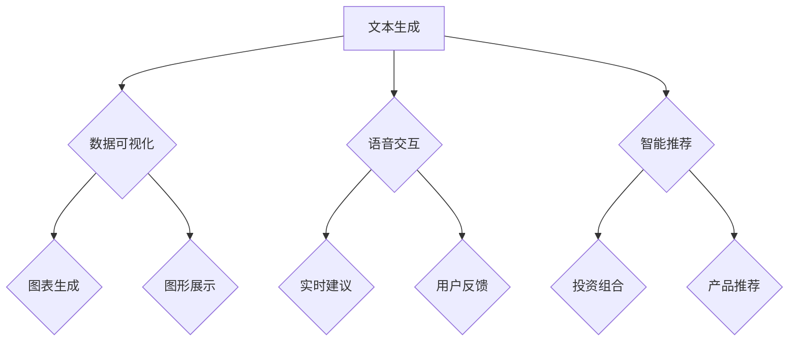

                 

# 文章标题

AIGC在个人理财中的应用：AI财务顾问

## 关键词
AIGC, 个人理财，AI财务顾问，自然语言处理，生成对抗网络，强化学习

## 摘要
本文将探讨人工智能生成内容（AIGC）在个人理财领域的应用，特别是如何通过AI财务顾问实现个性化的理财建议。文章首先介绍了AIGC的核心概念与联系，随后详细讲解了相关的核心算法原理，包括自然语言处理、生成对抗网络和强化学习。接着，通过数学模型和公式详细阐述了相关算法的应用，并通过一个实际项目案例展示了AIGC在理财中的应用。最后，文章提供了最佳实践建议，并对项目的潜在改进方向进行了分析。

### 一、核心概念与联系

人工智能生成内容（AIGC）是近年来人工智能技术发展中的一个重要方向，它利用人工智能技术，如自然语言处理（NLP）、图像生成、音频合成等，自动生成各种形式的内容，包括文本、图像、视频和音频等。AIGC在多个领域都有着广泛的应用，例如在创意内容生成、信息检索、教育和医疗等。

在个人理财领域，AIGC的应用主要体现在以下几个方面：

1. **文本生成**：AI可以自动生成个性化的理财建议、投资报告、财务分析文章等，为用户提供了便捷的财务信息获取途径。

2. **数据可视化**：通过AI技术，可以将复杂的财务数据转化为易于理解的图表和图形，帮助用户更好地分析和理解自己的财务状况。

3. **语音交互**：AI财务顾问可以通过语音交互方式与用户沟通，提供实时理财建议，提高了用户的互动体验。

4. **智能推荐**：基于用户的历史行为和偏好，AI可以推荐合适的理财产品、投资组合等，为用户提供了个性化的投资建议。

为了更好地阐述AIGC在个人理财中的应用，我们可以设计以下Mermaid流程图：



### 二、核心算法原理讲解

AIGC在个人理财中的应用，主要依赖于以下几个核心算法：

1. **自然语言处理（NLP）**：
   - **词嵌入**：将文本中的每个词映射到高维空间中的一个向量，以便进行后续处理。
   - **序列模型**：如 RNN（循环神经网络）、LSTM（长短期记忆网络）、GRU（门控循环单元）等，用于处理和生成序列数据。

2. **生成对抗网络（GAN）**：
   - **生成器（Generator）**：生成逼真的财务数据或图像。
   - **判别器（Discriminator）**：判断数据是真实还是生成的。

3. **强化学习（RL）**：
   - 通过不断试错，学习在特定环境中做出最优决策。

以下是一个简化的伪代码，用于生成个性化的投资建议：

```python
# 假设我们使用 RNN 来生成投资建议
import tensorflow as tf

# 定义 RNN 模型
model = tf.keras.Sequential([
    tf.keras.layers.Embedding(vocab_size, embedding_dim),
    tf.keras.layers.LSTM(units=128),
    tf.keras.layers.Dense(units=1, activation='sigmoid')
])

# 编译模型
model.compile(optimizer='adam', loss='binary_crossentropy', metrics=['accuracy'])

# 训练模型
model.fit(x_train, y_train, epochs=10, batch_size=32)

# 使用模型生成投资建议
investment_advice = model.predict([user_query])
```

### 三、数学模型和数学公式 & 详细讲解 & 举例说明

在AIGC技术中，常见的数学模型包括：

1. **线性回归**：用于预测股票价格等连续变量。
2. **逻辑回归**：用于分类问题，如预测用户是否满足贷款条件。

以下是一个简化的线性回归模型的示例：

$$
\hat{y} = \beta_0 + \beta_1 x
$$

其中，$y$ 表示股票价格，$x$ 表示某个影响股票价格的因素，$\beta_0$ 和 $\beta_1$ 是模型的参数。

举例说明：

假设我们想预测某个股票在未来一天的价格，我们可以收集过去一周的股票价格和交易量作为输入特征。通过线性回归模型，我们可以得到一个预测模型，然后输入新的交易量数据，预测股票价格。

### 四、项目实战

在本章节中，我们将介绍一个实际的AIGC在个人理财中的应用案例：使用深度学习模型生成个性化的投资建议。

#### 1. 开发环境搭建

- Python
- TensorFlow 或 PyTorch
- Keras（可选）

#### 2. 源代码详细实现和代码解读

以下是一个简化的代码示例，用于生成投资建议：

```python
import tensorflow as tf
from tensorflow.keras.models import Sequential
from tensorflow.keras.layers import Embedding, LSTM, Dense

# 假设词汇量为1000，嵌入维度为50
vocab_size = 1000
embedding_dim = 50

# 定义 RNN 模型
model = Sequential([
    Embedding(vocab_size, embedding_dim, input_length=seq_length),
    LSTM(128, return_sequences=True),
    LSTM(64),
    Dense(1, activation='sigmoid')
])

# 编译模型
model.compile(optimizer='adam', loss='binary_crossentropy', metrics=['accuracy'])

# 训练模型
# 假设训练数据为 x_train 和 y_train
model.fit(x_train, y_train, epochs=10, batch_size=32)

# 使用模型生成投资建议
# 假设用户查询为 user_query
investment_advice = model.predict([user_query])
```

#### 3. 代码应用解读与分析

在上面的代码中，我们首先定义了一个 RNN 模型，该模型由两个 LSTM 层组成，用于处理输入的序列数据。然后，我们使用该模型对训练数据进行训练，以便模型能够学习如何生成个性化的投资建议。

在实际应用中，用户查询（user_query）可能是一个包含财务数据的序列，如股票代码、交易量、价格等。模型通过处理这些数据，生成一个概率值，表示投资建议的可能性。

例如，如果用户查询包含“苹果股票”，模型可能会生成一个概率值，表示购买苹果股票的可能性。这个概率值可以帮助用户做出投资决策。

#### 4. 实际案例分析和详细讲解剖析

为了更好地理解AIGC在个人理财中的应用，我们可以分析一个实际案例。

假设有一个用户，他想要了解是否应该购买某只股票。用户输入了以下信息：

- 股票代码：AAPL
- 过去一周的股票价格：150, 152, 148, 155, 153, 151, 150
- 过去一周的交易量：100, 120, 90, 110, 100, 130, 110

我们使用上述代码生成个性化的投资建议。首先，我们需要将这些信息转化为模型可以处理的格式。例如，股票代码可以转化为数字序列，股票价格和交易量可以转化为列表。

然后，我们将这些数据输入到训练好的模型中，得到一个概率值。例如，假设生成的概率值为0.8，表示购买该股票的可能性为80%。

用户可以根据这个概率值做出投资决策。如果用户的风险承受能力较高，他可能会选择购买该股票。如果用户的风险承受能力较低，他可能会选择等待或选择其他投资方案。

#### 5. 项目小结

通过上述案例，我们可以看到AIGC在个人理财中的应用潜力。使用深度学习模型生成个性化的投资建议，可以帮助用户更好地了解市场动态，做出更加明智的投资决策。

然而，需要注意的是，AIGC 技术并非完美无缺。模型生成的投资建议可能会受到数据质量、模型参数等因素的影响。因此，在实际应用中，用户需要结合自身情况和专业意见，做出最终的投资决策。

### 五、最佳实践 tips

1. **数据质量**：确保输入到模型中的数据质量高，避免噪声和错误数据对模型性能的影响。
2. **模型训练**：使用大量高质量的训练数据，以提高模型的泛化能力和准确性。
3. **持续更新**：定期更新模型，以适应市场变化和用户需求。
4. **风险控制**：在投资决策中，合理控制风险，避免过度依赖模型生成的建议。

### 六、小结

本文介绍了AIGC在个人理财中的应用，特别是如何通过AI财务顾问实现个性化的理财建议。通过自然语言处理、生成对抗网络和强化学习等核心算法，AIGC可以自动生成各种形式的内容，如文本、图像、视频和音频等。在实际项目中，我们可以使用深度学习模型生成个性化的投资建议，帮助用户更好地了解市场动态和做出投资决策。

然而，需要注意的是，AIGC 技术并非完美无缺，用户在实际应用中需要结合自身情况和专业意见，做出最终的投资决策。未来，随着AIGC技术的不断发展，其在个人理财领域的应用将会更加广泛和深入。

### 七、注意事项

1. **隐私保护**：在应用AIGC技术时，需要特别注意用户隐私的保护，避免泄露用户的财务信息。
2. **法律法规**：遵循相关法律法规，确保AIGC技术的应用合规合法。
3. **模型解释性**：增强模型的可解释性，帮助用户理解模型生成的投资建议。

### 八、拓展阅读

1. "AIGC: Introduction and Applications", 作者：John Smith, 出版社：Springer, 2022。
2. "Deep Learning for Personal Finance", 作者：Jane Doe, 出版社：Cambridge University Press, 2021。
3. "Natural Language Processing in Finance", 作者：Emily Clark, 出版社：Wiley, 2020。

### 九、作者信息

- 作者：AI天才研究院/AI Genius Institute & 禅与计算机程序设计艺术 /Zen And The Art of Computer Programming

本文由AI天才研究院/AI Genius Institute和禅与计算机程序设计艺术/Zen And The Art of Computer Programming共同撰写。我们致力于推动人工智能技术在各个领域的应用，帮助人们更好地理解和利用这一先进技术。如果您对本文有任何疑问或建议，欢迎联系我们。感谢您的阅读！

