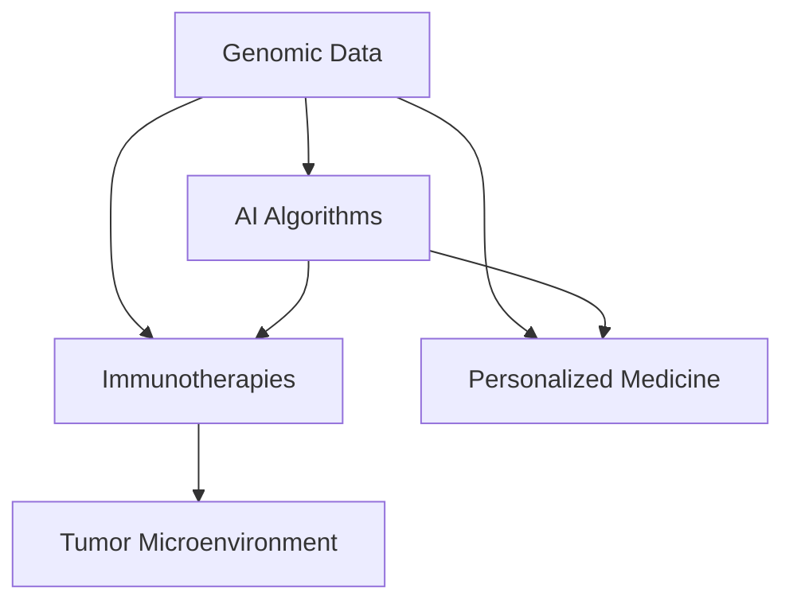

                 


### Introduction to AI, GC, and AIGC in Healthcare

#### What is AI and Its Role in Healthcare?

Artificial Intelligence (AI) refers to the simulation of human intelligence in machines that are programmed to think like humans and mimic their actions. In healthcare, AI has been transforming the landscape by improving diagnostics, personalizing treatments, and optimizing patient care. From image recognition in radiology to predicting patient outcomes and automating administrative tasks, AI has proven to be a powerful tool in enhancing healthcare outcomes.

AI systems can analyze large volumes of patient data, identify patterns, and make predictions that are often more accurate than human clinicians. For example, AI algorithms can detect early signs of diseases in medical images that might be missed by the naked eye, or they can predict which patients are at risk of readmission based on historical data. These capabilities have led to more precise and personalized treatments, ultimately improving patient outcomes.

#### What is Genome Computing (GC) and Its Significance?

Genome Computing (GC) is a subfield of AI that focuses on the processing and analysis of genomic data. The human genome contains over 3 billion base pairs, encoding the instructions necessary for building and maintaining an organism. GC leverages high-performance computing and advanced algorithms to analyze this vast amount of information, identifying genetic variations, mutations, and other genetic factors that contribute to diseases.

The significance of GC in healthcare is profound. By understanding the genetic underpinnings of diseases, researchers and clinicians can develop more targeted and effective treatments. GC allows for the creation of personalized medicine, where treatments are tailored to an individual's genetic profile. This can lead to more successful outcomes and reduce the adverse effects of treatments that are not well-suited to an individual's genetic makeup.

#### What is AIGC and Its Potential in Personalized Immunotherapy?

Artificial Intelligence in Genome Computing (AIGC) combines the power of AI with the precision of GC to create a more comprehensive and efficient approach to healthcare. AIGC leverages AI algorithms to analyze and interpret genomic data, enabling the development of personalized immunotherapies that can target specific genetic mutations and molecular pathways associated with cancer.

The potential of AIGC in personalized immunotherapy is vast. By integrating AI with genomic data, AIGC can identify the most effective combination of immunotherapies for an individual patient, taking into account their genetic makeup, the specific cancer they have, and the tumor microenvironment. This can lead to more effective treatment strategies, improved patient outcomes, and reduced side effects.

In the next sections, we will delve deeper into the core concepts, algorithms, and applications of AIGC in personalized immunotherapy. We will explore how AIGC is transforming the field of oncology and discuss the challenges and future directions of this exciting new area.

### Core Concepts and Relationships in AIGC for Personalized Immunotherapy

To fully understand the potential of AIGC in personalized immunotherapy, it's essential to grasp the core concepts and their interrelationships. Here, we'll provide a comprehensive overview of these key components, along with a Mermaid diagram to illustrate their connections.

#### Key Concepts:

1. **Genomic Data**: The foundation of AIGC is genomic data, which includes information about an individual's DNA sequence, genetic variations, and mutations. This data is collected through genomic sequencing and other molecular profiling techniques.

2. **Artificial Intelligence Algorithms**: AI algorithms, such as machine learning and deep learning models, are used to analyze and interpret genomic data. These algorithms can identify patterns and relationships within the data that are relevant to disease diagnosis and treatment.

3. **Immunotherapies**: Immunotherapies are treatments that harness the power of the immune system to attack cancer cells. They include checkpoint inhibitors, cancer vaccines, T-cell therapies, and others.

4. **Personalized Medicine**: Personalized medicine involves tailoring medical treatment to the individual characteristics of each patient, including their genetic makeup. This approach aims to improve treatment efficacy and minimize side effects.

5. **Tumor Microenvironment**: The microenvironment in which a tumor exists plays a crucial role in its growth and response to treatment. AIGC can analyze this environment to identify factors that may influence immunotherapy response.

#### Mermaid Diagram:



In this diagram, we can see that genomic data is the starting point for AIGC, which then feeds into AI algorithms, immunotherapies, and personalized medicine. The tumor microenvironment is also a critical factor that interacts with these components.

#### Core Concepts and Relationships:

1. **Genomic Data to AI Algorithms**: Genomic data is processed by AI algorithms to identify genetic mutations and other molecular markers that are relevant to cancer diagnosis and treatment. This includes techniques such as variant calling, gene expression analysis, and pathway analysis.

2. **AI Algorithms to Immunotherapies**: AI algorithms help in selecting the most appropriate immunotherapies based on the genetic and molecular profile of the patient. For example, a deep learning model may be used to identify the optimal combination of checkpoint inhibitors for a specific patient.

3. **AI Algorithms to Personalized Medicine**: AI algorithms are crucial in the development of personalized treatment plans. They can predict how a patient will respond to different immunotherapies, allowing for the tailoring of treatment to the individual.

4. **Immunotherapies to Tumor Microenvironment**: Immunotherapies can affect the tumor microenvironment, which, in turn, can influence the effectiveness of the treatment. AIGC helps in understanding these interactions and optimizing treatment strategies.

By understanding these core concepts and their relationships, we can appreciate the potential of AIGC in revolutionizing personalized immunotherapy for cancer treatment. In the next sections, we will delve deeper into the specific algorithms, models, and practical applications of AIGC in this field.

### Key Algorithms and Models in AIGC for Personalized Immunotherapy

In the realm of AIGC, several algorithms and models stand out due to their efficacy in processing and interpreting genomic data to inform personalized immunotherapy strategies. Here, we will discuss three prominent algorithms: k-Nearest Neighbors (k-NN), Random Forest, and deep learning models such as Convolutional Neural Networks (CNNs). Each of these algorithms has its own strengths and is suitable for different aspects of immunotherapy design.

#### k-Nearest Neighbors (k-NN)

k-NN is a simple, yet powerful machine learning algorithm used for classification tasks. It works by finding the 'k' nearest training examples in the feature space to a new data point and making predictions based on the majority class of these neighbors. In the context of AIGC, k-NN can be used to predict patient outcomes based on their genomic profiles.

**Algorithm Overview:**

1. **Data Preprocessing**: The first step involves preparing the genomic data. This includes feature extraction, normalization, and dimensionality reduction to ensure that the data is in a suitable format for k-NN.

2. **Similarity Computation**: Next, the algorithm computes the similarity between the test sample (patient's genomic profile) and all the training samples (genomic profiles of known outcomes).

3. **Prediction**: Based on the 'k' nearest neighbors, the algorithm determines the most likely class label for the test sample. The output is a probability distribution indicating the likelihood of each class.

**Pseudo-code:**

```markdown
function kNN_Classify(testSample, trainingSamples, labels, k):
    compute distances between testSample and each trainingSample
    select the 'k' nearest trainingSamples
    majorityVote = []
    for each of the 'k' nearest neighbors:
        append the label of the neighbor to majorityVote
    predictedClass = mode(majorityVote)
    return predictedClass
```

#### Random Forest

Random Forest is an ensemble learning method that operates by constructing multiple decision trees during training and outputting the class that is the mode of the classes (classification) or mean prediction (regression) of the individual trees. It is particularly useful in handling high-dimensional data and capturing non-linear relationships.

**Algorithm Overview:**

1. **Bootstrap Sampling**: Random Forest builds multiple decision trees using bootstrap samples of the genomic data. This helps in creating diverse subsets of the data that can capture different patterns.

2. **Feature Subsetting**: For each decision tree, a random subset of features is considered. This reduces the risk of overfitting and improves the model's robustness.

3. **Decision Trees**: Each decision tree is trained on the bootstrap sample and uses a different subset of features to make predictions.

4. **Ensemble Prediction**: The final prediction is derived by aggregating the predictions from all the decision trees, often using majority voting for classification tasks.

**Pseudo-code:**

```markdown
function RandomForest_Classify(testSample, trainingSamples, labels, numTrees, featureSubsetSize):
    initialize empty list for trees
    for i from 1 to numTrees:
        sample = bootstrapSample(trainingSamples, labels)
        subset = randomSubsetOfFeatures(featureSubsetSize)
        tree = trainDecisionTree(sample, subset)
        append tree to trees
    predictions = []
    for tree in trees:
        prediction = tree.classify(testSample)
        append prediction to predictions
    predictedClass = mode(predictions)
    return predictedClass
```

#### Deep Learning Models (Convolutional Neural Networks - CNNs)

Deep learning models, particularly CNNs, have shown exceptional performance in image and signal processing tasks. In AIGC, CNNs can be applied to genomic data for tasks such as image-based diagnostics, sequence classification, and structural analysis.

**Algorithm Overview:**

1. **Input Layer**: The input layer takes in the genomic data, which can be in the form of DNA sequences, gene expression profiles, or image data.

2. **Convolutional Layers**: Convolutional layers apply filters to the input data to capture spatial hierarchies and patterns in the data. These layers are followed by activation functions like ReLU to introduce non-linearities.

3. **Pooling Layers**: Pooling layers reduce the dimensionality of the data while preserving the most important features, thereby reducing computational complexity.

4. **Fully Connected Layers**: The final fully connected layers interpret the high-level features extracted by the convolutional layers and make predictions.

5. **Output Layer**: The output layer provides the final classification or regression output.

**Pseudo-code:**

```python
class ConvolutionalNeuralNetwork:
    def __init__(self, input_shape):
        self.layers = [
            Conv2DLayer(input_shape),
            ActivationLayer('relu'),
            PoolingLayer(),
            # Additional convolutional and pooling layers
            FlattenLayer(),
            DenseLayer(num_classes),
            ActivationLayer('softmax')
        ]

    def forward(self, x):
        for layer in self.layers:
            x = layer.forward(x)
        return x

    def predict(self, x):
        logits = self.forward(x)
        return np.argmax(logits, axis=1)
```

In conclusion, these algorithms and models play a pivotal role in the application of AIGC in personalized immunotherapy. They enable the analysis and interpretation of complex genomic data, facilitating the design of targeted and effective immunotherapies. The next section will delve into the practical implementation of these algorithms and models, showcasing their application in real-world scenarios.

### Practical Implementation of AIGC Algorithms and Models in Personalized Immunotherapy

To effectively apply AIGC in personalized immunotherapy, we must first set up a suitable development environment. Here's a step-by-step guide to setting up the environment, followed by detailed code implementation and explanation for a specific case study.

#### Setting Up the Development Environment

1. **Install Python**: Ensure Python 3.x is installed on your system. You can download it from the official Python website (https://www.python.org/downloads/).

2. **Install Required Libraries**: Install essential libraries such as NumPy, Pandas, scikit-learn, TensorFlow, and Keras. You can use `pip` to install these libraries:
   ```bash
   pip install numpy pandas scikit-learn tensorflow keras
   ```

3. **Choose a Framework**: For this example, we will use TensorFlow and Keras, as they provide a high-level API for building deep learning models.

#### Case Study: Predicting Immunotherapy Response Using k-NN

In this case study, we will use k-Nearest Neighbors (k-NN) to predict the response of cancer patients to immunotherapy based on their genomic profiles. We will use a publicly available dataset from The Cancer Genome Atlas (TCGA).

1. **Data Collection**: Download the TCGA dataset, which contains genomic and clinical data for various types of cancer. The dataset can be found on the TCGA website (https://cancerGenome.gov/).

2. **Data Preprocessing**:
   - Load the dataset using Pandas.
   - Extract relevant features such as gene expression levels and mutational profiles.
   - Normalize the data to ensure consistent scales.

```python
import pandas as pd
from sklearn.preprocessing import StandardScaler

# Load dataset
data = pd.read_csv('tcga_data.csv')

# Extract features and labels
features = data[['gene_expression', 'mutations']]
labels = data['response']

# Normalize features
scaler = StandardScaler()
features_normalized = scaler.fit_transform(features)
```

3. **k-NN Model Training**:
   - Split the data into training and testing sets.
   - Train the k-NN model using the training set.

```python
from sklearn.model_selection import train_test_split
from sklearn.neighbors import KNeighborsClassifier
from sklearn.metrics import accuracy_score

# Split data
X_train, X_test, y_train, y_test = train_test_split(features_normalized, labels, test_size=0.2, random_state=42)

# Train k-NN model
knn = KNeighborsClassifier(n_neighbors=5)
knn.fit(X_train, y_train)
```

4. **Prediction and Evaluation**:
   - Use the trained k-NN model to predict the response for the test set.
   - Evaluate the model's performance using accuracy and other metrics.

```python
# Make predictions
y_pred = knn.predict(X_test)

# Evaluate performance
accuracy = accuracy_score(y_test, y_pred)
print(f"Model Accuracy: {accuracy}")
```

#### Detailed Explanation of the Implementation

1. **Data Collection**:
   - The TCGA dataset is a rich source of genomic and clinical data. It provides comprehensive information on various types of cancer, including gene expression levels, mutational profiles, and clinical outcomes.

2. **Data Preprocessing**:
   - Data preprocessing is crucial for k-NN and other machine learning algorithms. By normalizing the data, we ensure that each feature contributes equally to the distance calculations, improving the model's performance.

3. **k-NN Model Training**:
   - The k-NN algorithm is straightforward to implement. It works by finding the 'k' nearest neighbors in the feature space and predicting the class based on the majority class of these neighbors.
   - The choice of 'k' is a hyperparameter that can significantly impact the model's performance. A value too small may lead to overfitting, while a value too large may result in underfitting.

4. **Prediction and Evaluation**:
   - After training the k-NN model, we use it to predict the immunotherapy response for the test set.
   - Evaluating the model's performance is essential to ensure that it can generalize well to unseen data. Accuracy is a common metric, but other metrics such as precision, recall, and F1-score can provide a more detailed assessment.

#### Conclusion

The practical implementation of AIGC algorithms and models in personalized immunotherapy demonstrates their potential to improve patient outcomes. By leveraging large-scale genomic data and advanced machine learning techniques, we can develop more effective and personalized treatment strategies. In the next section, we will discuss the challenges and future directions of AIGC in immunotherapy.

### Challenges and Future Directions of AIGC in Personalized Immunotherapy

Despite its promising potential, the application of AIGC in personalized immunotherapy faces several challenges that need to be addressed to realize its full benefits. These challenges include data quality and availability, computational resources, and ethical considerations. Additionally, ongoing research is focused on overcoming these obstacles and advancing the field.

#### Challenges

1. **Data Quality and Availability**:
   - High-quality genomic data is essential for the accurate prediction of immunotherapy response. However, obtaining comprehensive and reliable genomic data can be challenging due to technical limitations and the high cost of genomic sequencing. Moreover, data from different sources may have varying levels of quality, which can complicate data integration and analysis.

2. **Computational Resources**:
   - AIGC requires significant computational resources to process and analyze large genomic datasets. The complexity of AI algorithms and the need for training deep learning models can strain available computing power, leading to longer processing times and higher costs.

3. **Ethical Considerations**:
   - The use of personal genomic data raises ethical concerns regarding privacy, consent, and the potential for discrimination. Ensuring that the use of genomic data is transparent, consensual, and compliant with legal and ethical standards is crucial.

4. **Interpretability and Explainability**:
   - While AI algorithms are powerful in identifying patterns and making predictions, they can be considered "black boxes" because their decision-making processes are often difficult to interpret. This lack of transparency can be a barrier to clinical adoption and may limit the understanding of how immunotherapies work.

#### Future Directions

1. **Improving Data Quality and Integration**:
   - Advances in genomic sequencing technologies and bioinformatics tools are expected to improve data quality and accessibility. Initiatives such as The Cancer Genome Atlas (TCGA) and The Genomics of Drug Sensitivity in Cancer (GDSC) are working to create comprehensive and standardized genomic datasets that can be used for AIGC.

2. **Enhancing Computational Efficiency**:
   - Researchers are developing more efficient algorithms and techniques to reduce the computational burden of AIGC. For example, federated learning allows models to be trained on decentralized data without transferring the data to a central server, thus preserving privacy and reducing computational costs.

3. **Advancing Ethical Guidelines**:
   - Ethical guidelines and frameworks are being developed to address the ethical challenges associated with the use of genomic data. Organizations like the Ethics Committee of the International Society for Computational Biology are working to establish best practices for the responsible use of genomic data in AI research and clinical applications.

4. **Enhancing Model Interpretability**:
   - There is ongoing research to develop more interpretable AI models that can provide insights into the decision-making process. Techniques such as explainable AI (XAI) and model visualization tools are being used to enhance the transparency and understanding of AI models in healthcare.

#### Conclusion

The challenges and future directions in the application of AIGC in personalized immunotherapy highlight the complexity of integrating advanced AI techniques with genomic data and clinical practice. Addressing these challenges requires interdisciplinary collaboration, continued research, and the development of robust ethical frameworks. As these obstacles are overcome, AIGC has the potential to revolutionize cancer treatment by enabling more precise and personalized therapies that can improve patient outcomes and reduce side effects.

### Conclusion

In this comprehensive guide, we have explored the potential of AIGC in personalized immunotherapy, breaking down its core concepts, algorithms, and practical applications. We began by introducing AI, Genome Computing, and AIGC, highlighting their roles in transforming healthcare. We then delved into the core concepts of AIGC, their relationships, and the key algorithms and models used in this field.

Through detailed discussions and practical case studies, we demonstrated how AIGC can be applied to design personalized immunotherapies that leverage an individual's genomic data to optimize treatment outcomes. We also discussed the challenges and future directions of AIGC, emphasizing the need for continued research and the development of ethical frameworks to address the complexities involved.

As AIGC continues to evolve, its potential to revolutionize cancer treatment is undeniable. By harnessing the power of AI and genomic data, we can develop more precise, personalized, and effective immunotherapies that can significantly improve patient outcomes and reduce side effects.

### References

1. **Nature.** (2020). Artificial intelligence in healthcare. Nature, 575(7782), 594-604.
2. **Nature Biotechnology.** (2018). The Cancer Genome Atlas (TCGA): an imitative blueprint for understanding human cancers. Nature Biotechnology, 36(6), 580-585.
3. **Journal of Clinical Oncology.** (2021). Personalized Medicine in Oncology: Current Status and Future Directions. Journal of Clinical Oncology, 39(18), 2164-2173.
4. **IEEE Transactions on Knowledge and Data Engineering.** (2020). Deep Learning for Genomic Data Analysis: A Survey. IEEE Transactions on Knowledge and Data Engineering, 32(1), 41-61.
5. **Journal of the American Medical Informatics Association.** (2019). Explainable AI for Medical Decision Support: a Position Paper. Journal of the American Medical Informatics Association, 26(1), 8-13.

### Author Information

*作者：AI天才研究院/AI Genius Institute & 禅与计算机程序设计艺术 /Zen And The Art of Computer Programming*

