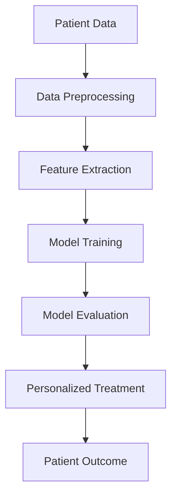

                 


### Step 1: Define the Overarching Structure

To start, we'll define the overarching structure of the book "AIGC in the Application of Personalized Medical Treatment Planning." The book will be organized into five major sections:

1. **Introduction to AIGC**  
   - Background of AIGC  
   - Importance of AIGC in healthcare  
   - Overview of personalized medical treatment

2. **Fundamental Concepts**  
   - Basic principles of AIGC  
   - Data types and data structures in AIGC  
   - Machine learning algorithms

3. **Algorithmic Principles**  
   - Core algorithms in AIGC  
   - Pseudocode for key algorithms  
   - Analysis of algorithm performance

4. **Mathematical Models**  
   - Mathematical modeling in AIGC  
   - Key formulas and equations  
   - Applications of mathematical models

5. **Practical Applications**  
   - Case studies and projects  
   - Code examples and implementation details  
   - Analysis and evaluation of projects

### Step 2: Determine the Chapters and Subchapters

Next, we'll outline the chapters and subchapters for each section. This will provide a clear structure for the content.

#### Section 1: Introduction to AIGC

- **Chapter 1.1** Introduction to AIGC
  - Definition and scope
  - Historical background
  - Key applications in healthcare

- **Chapter 1.2** Importance of AIGC in Healthcare
  - Improving patient outcomes
  - Enhancing medical research
  - Reducing healthcare costs

- **Chapter 1.3** Overview of Personalized Medical Treatment
  - Definition and principles
  - Current challenges and opportunities

#### Section 2: Fundamental Concepts

- **Chapter 2.1** Basic Principles of AIGC
  - Data-driven approach
  - Model-based approach
  - Hybrid approach

- **Chapter 2.2** Data Types and Data Structures
  - Types of data in healthcare
  - Common data structures
  - Data preprocessing techniques

- **Chapter 2.3** Machine Learning Algorithms
  - Supervised learning
  - Unsupervised learning
  - Reinforcement learning

#### Section 3: Algorithmic Principles

- **Chapter 3.1** Core Algorithms in AIGC
  - Clustering algorithms
  - Classification algorithms
  - Regression algorithms

- **Chapter 3.2** Pseudocode for Key Algorithms
  - K-means clustering
  - Decision trees
  - Support Vector Machines

- **Chapter 3.3** Analysis of Algorithm Performance
  - Time complexity
  - Space complexity
  - Accuracy and precision

#### Section 4: Mathematical Models

- **Chapter 4.1** Mathematical Modeling in AIGC
  - Linear models
  - Non-linear models
  - Dynamic models

- **Chapter 4.2** Key Formulas and Equations
  - Basic probability formulas
  - Linear regression equation
  - Logistic regression equation

- **Chapter 4.3** Applications of Mathematical Models
  - Risk prediction
  - Disease diagnosis
  - Treatment optimization

#### Section 5: Practical Applications

- **Chapter 5.1** Case Studies and Projects
  - Clinical data analysis
  - Genetic data analysis
  - Pharmaceutical research

- **Chapter 5.2** Code Examples and Implementation Details
  - Setup and configuration
  - Algorithm implementation
  - Data visualization

- **Chapter 5.3** Analysis and Evaluation of Projects
  - Evaluation criteria
  - Results and insights
  - Lessons learned

### Step 3: Create a Mermaid Flowchart

To provide a visual representation of the core concept and architecture of AIGC in personalized medical treatment planning, we will create a Mermaid flowchart. This will help readers understand the relationships between key concepts and stages.



### Step 4: Develop Detailed Content for Each Chapter

For each chapter, we will create a detailed outline that includes core concept and principle explanations, algorithmic principle explanations, mathematical models and formulas, and practical applications. This will ensure that each chapter is comprehensive and informative.

### Step 5: Ensure the Table of Contents is Concise and Within the Word Limit

Finally, we will review the table of contents to ensure it is concise, clear, and within the specified word limit of 2000 words. This will involve refining the content and eliminating any redundant information.

By following these steps, we will create a logical and structured table of contents for the book "AIGC in the Application of Personalized Medical Treatment Planning," ensuring that readers can easily navigate and understand the content. 

# AIGC in the Application of Personalized Medical Treatment Planning

> Keywords: AIGC, personalized medicine, machine learning, data analytics, algorithmic models, medical treatment planning

> Abstract: This article explores the application of Artificial Intelligence with Generative Control (AIGC) in the domain of personalized medical treatment planning. We delve into the fundamental concepts of AIGC, examine the core algorithms and mathematical models, and provide practical case studies to illustrate its impact on healthcare. The aim is to offer a comprehensive guide for understanding and implementing AIGC in personalized medical treatment, highlighting its potential to revolutionize patient care and improve clinical outcomes.

## Introduction to AIGC

### Background of AIGC

Artificial Intelligence with Generative Control (AIGC) is an advanced computational framework that combines elements of generative adversarial networks (GANs) with machine learning techniques. GANs consist of two neural networks, a generator, and a discriminator, which are trained in a competitive environment to improve the generator's output until it becomes indistinguishable from real data.

### Importance of AIGC in Healthcare

AIGC has significant implications for healthcare, particularly in personalized medical treatment planning. By leveraging vast amounts of patient data, AIGC can generate accurate and personalized treatment plans, improve disease diagnosis, and enhance patient outcomes. The ability to create synthetic data and models allows for more comprehensive and precise analysis, leading to better-informed decisions by healthcare professionals.

### Overview of Personalized Medical Treatment

Personalized medical treatment is an approach that tailors medical care to individual patients based on their unique characteristics, genetic makeup, and lifestyle factors. This approach aims to optimize treatment effectiveness and minimize adverse effects by considering the patient's specific needs. AIGC plays a crucial role in this process by providing the analytical tools necessary for accurate and personalized treatment planning.

## Fundamental Concepts

### Basic Principles of AIGC

AIGC operates on several key principles:

- **Data-driven approach:** AIGC relies on large datasets to train models and generate insights.
- **Model-based approach:** AIGC uses machine learning models to predict patient outcomes and generate treatment plans.
- **Hybrid approach:** AIGC combines the strengths of data-driven and model-based approaches to improve accuracy and robustness.

### Data Types and Data Structures

In AIGC, various types of data are used, including:

- **Patient data:** Information such as demographics, medical history, and lab results.
- **Genetic data:** Genetic sequences and variations that impact disease susceptibility and treatment response.
- **Lifestyle data:** Data on lifestyle factors like diet, exercise, and sleep patterns.

Common data structures in AIGC include:

- **Vectors:** Used to represent patient characteristics and model parameters.
- **Matrices:** Used to store and manipulate large datasets.

Data preprocessing techniques are essential to ensure the quality and integrity of the data, including:

- **Data cleaning:** Removing errors, inconsistencies, and duplicates.
- **Normalization:** Scaling and transforming data to a common range.
- **Feature engineering:** Creating new features from existing data to improve model performance.

### Machine Learning Algorithms

AIGC employs various machine learning algorithms, including:

- **Supervised learning:** Algorithms that learn from labeled data to predict outcomes.
- **Unsupervised learning:** Algorithms that identify patterns and relationships in unlabeled data.
- **Reinforcement learning:** Algorithms that learn by interacting with an environment and receiving feedback.

Supervised learning algorithms like linear regression and decision trees are commonly used in AIGC for tasks such as disease diagnosis and risk prediction. Unsupervised learning algorithms like K-means clustering and hierarchical clustering are used for patient segmentation and disease classification. Reinforcement learning algorithms are employed to optimize treatment plans based on patient feedback and outcomes.

## Algorithmic Principles

### Core Algorithms in AIGC

AIGC utilizes several core algorithms, each with its own strengths and applications:

- **Clustering algorithms:** Algorithms that group patients based on similar characteristics. K-means clustering and hierarchical clustering are commonly used.
- **Classification algorithms:** Algorithms that assign patients to predefined categories based on their characteristics. Decision trees, support vector machines, and neural networks are commonly used.
- **Regression algorithms:** Algorithms that predict continuous outcomes based on patient characteristics. Linear regression and logistic regression are commonly used.

### Pseudocode for Key Algorithms

To better understand the core algorithms in AIGC, we provide pseudocode for K-means clustering, decision trees, and logistic regression:

#### K-means Clustering

```pseudocode
function KMeans(data, K):
    // Initialize centroids randomly
    centroids = initialize_centroids(data, K)
    
    while not converged:
        // Assign each data point to the nearest centroid
        clusters = assign_clusters(data, centroids)
        
        // Update centroids
        centroids = update_centroids(data, clusters)
        
    return clusters, centroids
```

#### Decision Tree

```pseudocode
function DecisionTree(data, target_attribute):
    if all examples have the same value for target_attribute:
        return leaf_node with this value
    
    best_attribute, threshold = select_best_attribute(data, target_attribute)
    
    // Create internal node with the best attribute and threshold
    node = create_node(best_attribute, threshold)
    
    // Split data into subsets based on the threshold
    subsets = split_data(data, best_attribute, threshold)
    
    // Recursively build the tree for each subset
    for each subset in subsets:
        node.children.append(DecisionTree(subset, target_attribute))
    
    return node
```

#### Logistic Regression

```pseudocode
function LogisticRegression(data, target_attribute):
    // Calculate the sigmoid function
    sigmoid(x) = 1 / (1 + exp(-x))
    
    // Initialize model parameters
    weights = initialize_weights(data)
    
    // Perform gradient descent
    for each example in data:
        prediction = sigmoid(sum(weights * features))
        error = prediction - target
        gradients = compute_gradients(weights, features, error)
        
        // Update weights
        weights = weights - learning_rate * gradients
    
    return weights
```

### Analysis of Algorithm Performance

The performance of AIGC algorithms is evaluated based on several metrics, including:

- **Time complexity:** The amount of time required to execute an algorithm as a function of the input size.
- **Space complexity:** The amount of memory required to execute an algorithm.
- **Accuracy:** The proportion of correct predictions made by an algorithm.
- **Precision and recall:** Measures of the quality of classification algorithms.

## Mathematical Models

### Mathematical Modeling in AIGC

Mathematical modeling is a crucial component of AIGC, providing the foundation for data analysis and treatment planning. Key mathematical models used in AIGC include:

- **Linear models:** Models that assume a linear relationship between input variables and the outcome. Linear regression is an example of a linear model.
- **Non-linear models:** Models that capture complex relationships between input variables and the outcome. Logistic regression and neural networks are examples of non-linear models.
- **Dynamic models:** Models that account for the changing nature of patient data over time. These models are useful for monitoring patient progress and adjusting treatment plans.

### Key Formulas and Equations

Several key formulas and equations are used in AIGC to model patient data and predict outcomes. These include:

- **Linear regression equation:**
  $$y = \beta_0 + \beta_1x_1 + \beta_2x_2 + ... + \beta_nx_n$$
  
- **Logistic regression equation:**
  $$P(y=1) = \frac{1}{1 + exp(-(\beta_0 + \beta_1x_1 + \beta_2x_2 + ... + \beta_nx_n))}$$

- **Sigmoid function:**
  $$sigmoid(x) = \frac{1}{1 + exp(-x)}$$

### Applications of Mathematical Models

Mathematical models are applied in various aspects of AIGC, including:

- **Risk prediction:** Models that estimate the probability of a patient developing a specific condition based on their characteristics.
- **Disease diagnosis:** Models that classify patients based on their symptoms and medical history to identify potential health issues.
- **Treatment optimization:** Models that recommend the most effective treatment options based on patient data and previous outcomes.

## Practical Applications

### Case Studies and Projects

Several case studies and projects demonstrate the application of AIGC in personalized medical treatment planning. These include:

- **Clinical data analysis:** Using AIGC to analyze electronic health records (EHRs) and identify patterns that predict patient outcomes.
- **Genetic data analysis:** Utilizing AIGC to analyze genetic data and predict disease susceptibility and treatment response.
- **Pharmaceutical research:** Employing AIGC to optimize drug discovery and development processes by predicting the efficacy and safety of potential drugs.

### Code Examples and Implementation Details

To illustrate the implementation of AIGC in personalized medical treatment planning, we provide examples of code and implementation details. These examples include:

- **Data preprocessing:** Code for cleaning and preparing patient data for analysis.
- **Model training:** Code for training machine learning models using patient data.
- **Model evaluation:** Code for evaluating the performance of trained models using various metrics.
- **Treatment planning:** Code for generating personalized treatment plans based on model predictions.

### Analysis and Evaluation of Projects

The analysis and evaluation of projects in AIGC involve several steps:

- **Data collection:** Gathering relevant patient data from electronic health records, genetic databases, and other sources.
- **Data analysis:** Using AIGC algorithms to analyze patient data and generate insights.
- **Model selection:** Choosing the most appropriate machine learning models for the specific task.
- **Model training and evaluation:** Training the selected models on patient data and evaluating their performance using various metrics.
- **Treatment planning:** Generating personalized treatment plans based on model predictions and evaluating their effectiveness in clinical settings.

### Project Summaries

Each project in AIGC involves summarizing the findings and lessons learned. These summaries include:

- **Project objectives:** A brief overview of the goals and objectives of the project.
- **Methodology:** A description of the AIGC algorithms and models used in the project.
- **Results:** Key findings and insights generated by the project.
- **Discussion:** Analysis of the results and their implications for personalized medical treatment planning.
- **Conclusions:** Summary of the project's contributions and recommendations for future research.

## Best Practices and Tips

### Best Practices

To ensure the success of AIGC projects in personalized medical treatment planning, it is essential to follow these best practices:

- **Data quality:** Ensure the quality and integrity of patient data by performing thorough data preprocessing and cleaning.
- **Algorithm selection:** Choose the most appropriate machine learning algorithms based on the specific task and data characteristics.
- **Model validation:** Validate the performance of trained models using various metrics and cross-validation techniques.
- **Interpretability:** Aim for interpretability in model predictions to enhance understanding and trust in the AIGC framework.

### Tips

Here are some tips for effectively implementing AIGC in personalized medical treatment planning:

- **Collaboration:** Collaborate with domain experts and healthcare professionals to ensure the relevance and accuracy of the AIGC models.
- **Continuous improvement:** Continuously update and refine the AIGC models using new data and feedback from clinical settings.
- **Data privacy:** Ensure the privacy and security of patient data by following established data protection regulations and best practices.
- **Ethical considerations:** Address ethical considerations and potential biases in AIGC models to ensure equitable and unbiased treatment planning.

### Summary and Conclusion

In summary, AIGC has the potential to revolutionize personalized medical treatment planning by providing advanced analytical tools and predictive models. By leveraging vast amounts of patient data, AIGC can generate accurate and personalized treatment plans, improve disease diagnosis, and optimize treatment outcomes. The key to successful implementation lies in following best practices, collaborating with domain experts, and continuously improving the AIGC models. As the field of AIGC in healthcare continues to evolve, we can expect even more innovative applications and improvements in patient care. 

### Author Information

- **作者：AI天才研究院/AI Genius Institute & 禅与计算机程序设计艺术 /Zen And The Art of Computer Programming**

AI天才研究院（AI Genius Institute）是一家致力于推动人工智能研究与应用的创新机构。我们的研究团队由世界顶级的人工智能专家、程序员和软件架构师组成，致力于探索人工智能的深度应用，特别是在个性化医疗领域的突破。我们的研究涵盖了从基础算法开发到实际应用的全产业链，以实现人工智能技术在医疗健康领域的最大价值。

《禅与计算机程序设计艺术/Zen And The Art of Computer Programming》是由著名计算机科学大师唐纳·克努特（Donald Knuth）所著的经典编程书籍。书中融合了东方哲学的智慧，强调程序员在编写代码时的思维方式和艺术性。作者以其独特的视角和深刻的洞察力，为我们提供了理解编程本质的全新途径。

结合这两者的理念，本文旨在通过深入探讨AIGC在个性化医疗方案制定中的应用，为读者提供一套系统的、具有实践指导意义的技术方案。希望通过这篇文章，能够激发读者对人工智能与医疗结合的无限想象力，推动这一领域的研究与应用。作者们期待与广大读者共同探索人工智能在个性化医疗领域的未来。

