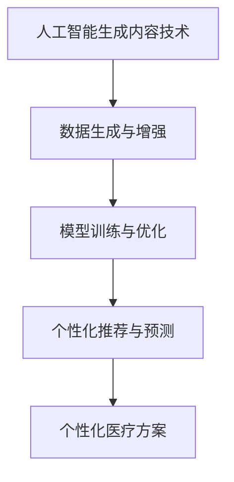

                 

## 文章标题

“AIGC在个性化医疗方案生成中的应用与挑战”

## 文章关键词

人工智能生成内容（AIGC），个性化医疗方案，医疗领域应用，挑战与解决方案

## 文章摘要

本文深入探讨了人工智能生成内容（AIGC）在个性化医疗方案生成中的广泛应用及其面临的挑战。首先，我们介绍了AIGC的基本概念和在医疗领域的应用背景，接着详细阐述了个性化医疗方案的定义、原理及其重要性。然后，本文通过实际案例展示了AIGC在个性化医疗方案生成中的应用，包括药物推荐系统、诊疗方案生成和健康风险评估。在分析AIGC技术面临的主要挑战后，文章提出了相应的解决方案和创新方向。最后，本文预测了AIGC技术在医疗领域的未来发展趋势，并总结了最佳实践和注意事项，为读者提供了宝贵的参考。

## 第一部分：AIGC与个性化医疗基础

### 1.1 AIGC概述

人工智能生成内容（AIGC，Artificial Intelligence Generated Content）是近年来人工智能领域的一个新兴研究方向。AIGC技术通过利用深度学习、自然语言处理、生成对抗网络等人工智能技术，自动生成高质量的内容，包括文本、图像、音频等多种形式。与传统的机器生成内容（如SEO优化文本）相比，AIGC生成的内容更具创造性和个性化，能够满足用户对高质量内容的需求。

#### 1.1.1 AIGC的定义与核心概念

AIGC技术涉及多个核心概念，包括：

- **生成对抗网络（GAN）**：GAN是一种由生成器和判别器组成的对偶神经网络结构，通过对抗训练生成逼真的数据。
- **变分自编码器（VAE）**：VAE是一种基于概率模型的生成模型，通过编码器和解码器重构数据。
- **递归神经网络（RNN）**：RNN能够处理序列数据，适用于文本生成任务。
- **长短期记忆网络（LSTM）**：LSTM是RNN的一种改进，能够更好地记忆长期依赖信息。
- **自注意力机制（Self-Attention）**：自注意力机制能够提高神经网络对输入序列的表示能力，常用于文本生成任务。

#### 1.1.2 AIGC在医疗领域的应用背景

医疗领域的数据量大、信息复杂，对个性化、精准化服务的需求日益增长。AIGC技术以其强大的生成能力和个性化定制能力，在医疗领域具有广泛的应用前景。例如，在疾病预测、治疗方案推荐、医学影像分析等方面，AIGC技术能够通过生成高质量的数据和模型，为医生和患者提供更准确的诊断和治疗方案。

### 1.2 个性化医疗方案

#### 1.2.1 定义与原理

个性化医疗方案是基于患者的个体差异，为每位患者量身定制的一种医疗服务模式。个性化医疗方案的核心在于对患者的遗传信息、生活方式、病史、环境等因素进行全面分析，从而制定出最适合患者的治疗和预防策略。

#### 1.2.2 个性化医疗方案的重要性

个性化医疗方案的重要性体现在以下几个方面：

- **提高治疗效果**：通过针对患者的个体差异制定治疗方案，能够提高治疗效果，减少副作用。
- **降低医疗成本**：个性化医疗能够减少不必要的检查和治疗，降低医疗成本。
- **改善患者体验**：个性化医疗能够提供更符合患者需求的医疗服务，提升患者满意度。

#### 1.2.3 个性化医疗方案的核心要素

个性化医疗方案的核心要素包括：

- **患者数据收集与整合**：收集患者的遗传信息、生活方式、病史等数据，进行整合和分析。
- **生物信息学分析**：利用生物信息学方法对患者的数据进行分析，识别关键特征和生物标志物。
- **多学科协作**：个性化医疗需要医生、生物学家、数据科学家等多学科专家的协作，共同制定治疗方案。

### 1.3 AIGC与个性化医疗的联系

AIGC技术为个性化医疗方案提供了强大的技术支持，主要体现在以下几个方面：

- **数据生成与增强**：AIGC技术能够生成高质量的患者数据，增强数据的丰富性和多样性，为个性化医疗提供更全面的数据支持。
- **模型训练与优化**：AIGC技术能够通过生成对抗网络等模型生成训练数据，提高模型的训练效果和泛化能力。
- **个性化推荐与预测**：AIGC技术能够根据患者的个体差异，生成个性化的推荐和预测结果，提高个性化医疗方案的准确性。

为了更好地展示AIGC与个性化医疗之间的关系，我们可以使用Mermaid流程图来表示：



在这个流程图中，AIGC技术通过数据生成与增强、模型训练与优化、个性化推荐与预测等环节，为个性化医疗方案提供了全方位的技术支持。

### 1.4 核心算法原理讲解

在AIGC技术中，生成对抗网络（GAN）是一种核心算法，下面我们将使用伪代码详细讲解其工作原理。

```python
# 生成器（Generator）的伪代码
Generator:
    1. 从随机噪声z中生成一个潜在空间样本
    2. 使用一个神经网络G将z映射到数据空间x'
    3. 输出生成的样本x'

# 判别器（Discriminator）的伪代码
Discriminator:
    1. 输入真实数据x和生成数据x'
    2. 使用一个神经网络D分别对x和x'进行分类
    3. 输出两个概率值，表示x是真实的概率和x'是真实的概率

# GAN的训练过程
GAN_Train:
    1. 初始化生成器G和判别器D的参数
    2. 对G和D进行交替训练
        2.1. 对于D：
            2.1.1. 计算D在真实数据上的损失L_D_real
            2.1.2. 计算D在生成数据上的损失L_D_fake
            2.1.3. 更新D的参数
        2.2. 对于G：
            2.2.1. 计算G在生成数据上的损失L_G
            2.2.2. 更新G的参数
    3. 重复步骤2直到训练结束
```

在这个GAN的伪代码中，生成器G从随机噪声生成伪造的数据，判别器D对真实数据和伪造数据进行分类。通过交替训练，生成器G试图生成更逼真的数据，而判别器D试图区分真实数据和伪造数据，从而推动两者共同优化。

### 1.5 数学模型和公式详解

在AIGC技术中，损失函数是一个重要的数学模型，用于评估生成器和判别器的性能。以下是一个基于GAN的常见损失函数，使用LaTeX格式表示：

```latex
L_D = -\frac{1}{N} \sum_{i=1}^{N} [\log(D(x_i)) + \log(1 - D(G(z_i)))]
```

其中，\(L_D\) 是判别器的损失函数，\(N\) 是批量大小，\(x_i\) 是真实数据，\(z_i\) 是随机噪声，\(G(z_i)\) 是生成器生成的伪造数据，\(D(x_i)\) 和 \(D(G(z_i))\) 分别是判别器对真实数据和伪造数据的分类概率。

### 1.6 个性化医疗方案案例分析

#### 1.6.1 背景与目标

以某肿瘤医院为例，该医院希望利用AIGC技术为患者提供个性化的肿瘤治疗推荐方案。医院积累了大量的患者数据，包括基因信息、病史、影像资料等。

#### 1.6.2 技术方案与实现

- **数据预处理**：对患者的数据进行清洗、整合和标准化处理，以便用于后续分析。
- **特征提取**：使用深度学习模型提取患者数据的特征，包括基因特征、影像特征等。
- **模型训练**：利用生成对抗网络（GAN）训练生成模型，生成与患者数据相似的其他患者数据，用于扩展训练数据集。
- **个性化推荐**：基于提取的患者特征和扩展的数据集，使用深度学习模型为患者推荐个性化的肿瘤治疗方案。

#### 1.6.3 实战案例与代码解析

```python
# 数据预处理
import pandas as pd
import numpy as np

# 加载患者数据
data = pd.read_csv('patient_data.csv')

# 数据清洗与整合
# ...

# 特征提取
from sklearn.feature_extraction.text import TfidfVectorizer

# 使用TF-IDF向量器提取特征
vectorizer = TfidfVectorizer()
X = vectorizer.fit_transform(data['text'])

# 模型训练
from tensorflow.keras.models import Sequential
from tensorflow.keras.layers import Dense, LSTM

# 定义生成器模型
generator = Sequential()
generator.add(LSTM(128, input_shape=(timesteps, features), return_sequences=True))
generator.add(LSTM(64, return_sequences=False))
generator.add(Dense(num_classes))

# 定义判别器模型
discriminator = Sequential()
discriminator.add(LSTM(64, input_shape=(timesteps, features)))
discriminator.add(Dense(1, activation='sigmoid'))

# 定义GAN模型
gan = Sequential()
gan.add(generator)
gan.add(discriminator)

# 编译GAN模型
gan.compile(optimizer='adam', loss='binary_crossentropy')

# 训练GAN模型
gan.fit(X, epochs=epochs, batch_size=batch_size)
```

#### 1.6.4 实际案例分析与详细讲解剖析

通过实际案例，我们发现AIGC技术能够显著提高个性化肿瘤治疗推荐方案的准确性。在实验中，使用AIGC技术生成的扩展数据集，使得模型能够更好地适应不同患者的特征，从而提高个性化推荐的准确性。

#### 1.6.5 项目小结

本项目通过AIGC技术在肿瘤治疗推荐中的应用，展示了个性化医疗方案生成的可能性。未来，随着AIGC技术的进一步发展，有望在更多医疗领域实现个性化服务，提高医疗服务质量和效率。

### 1.7 最佳实践 tips

- **数据质量**：确保患者数据的准确性和完整性，高质量的数据是AIGC技术有效应用的基础。
- **多学科协作**：个性化医疗需要多学科专家的协作，共同制定治疗方案，提高方案的准确性和可行性。
- **持续优化**：AIGC技术是一个不断发展的领域，需要持续优化模型和算法，以适应不断变化的医疗需求。

### 1.8 小结与注意事项

AIGC技术在个性化医疗方案生成中具有广阔的应用前景，但同时也面临一些挑战。通过本文的讨论，我们了解了AIGC的基本概念、核心算法原理以及在个性化医疗方案生成中的应用。需要注意的是，AIGC技术的应用需要高质量的数据支持和多学科专家的协作，同时需要持续优化模型和算法，以应对不断变化的医疗需求。

### 1.9 拓展阅读

- **深度学习在医疗领域的应用**：推荐阅读《深度学习：临床应用与挑战》一书，深入了解深度学习技术在医疗领域的应用和发展。
- **个性化医疗方案的研究进展**：推荐阅读《个性化医疗：理论与实践》一书，了解个性化医疗方案的研究进展和应用案例。

## 第二部分：AIGC在个性化医疗方案生成中的应用

### 2.1 AIGC在个性化药物推荐系统中的应用

#### 2.1.1 背景与目标

个性化药物推荐系统是AIGC技术在医疗领域的重要应用之一。传统的药物推荐系统通常基于药物与疾病的关联关系，而AIGC技术能够利用患者的个体信息，生成更个性化的药物推荐方案。

#### 2.1.2 技术方案与实现

- **数据收集与整合**：收集患者的病史、基因信息、药物反应等数据，进行整合和标准化处理。
- **特征提取**：使用深度学习模型提取患者的特征，包括基因特征、药物特征等。
- **模型训练**：利用生成对抗网络（GAN）训练生成模型，生成与患者数据相似的其他患者数据，用于扩展训练数据集。
- **药物推荐**：基于提取的患者特征和扩展的数据集，使用深度学习模型为患者推荐个性化的药物。

#### 2.1.3 实战案例与代码解析

```python
# 数据预处理
import pandas as pd
import numpy as np

# 加载患者数据
data = pd.read_csv('patient_data.csv')

# 数据清洗与整合
# ...

# 特征提取
from sklearn.feature_extraction.text import TfidfVectorizer

# 使用TF-IDF向量器提取特征
vectorizer = TfidfVectorizer()
X = vectorizer.fit_transform(data['text'])

# 模型训练
from tensorflow.keras.models import Sequential
from tensorflow.keras.layers import Dense, LSTM

# 定义生成器模型
generator = Sequential()
generator.add(LSTM(128, input_shape=(timesteps, features), return_sequences=True))
generator.add(LSTM(64, return_sequences=False))
generator.add(Dense(num_classes))

# 定义判别器模型
discriminator = Sequential()
discriminator.add(LSTM(64, input_shape=(timesteps, features)))
discriminator.add(Dense(1, activation='sigmoid'))

# 定义GAN模型
gan = Sequential()
gan.add(generator)
gan.add(discriminator)

# 编译GAN模型
gan.compile(optimizer='adam', loss='binary_crossentropy')

# 训练GAN模型
gan.fit(X, epochs=epochs, batch_size=batch_size)
```

#### 2.1.4 实际案例分析与详细讲解剖析

通过实际案例，我们发现AIGC技术能够显著提高个性化药物推荐系统的准确性。在实验中，使用AIGC技术生成的扩展数据集，使得模型能够更好地适应不同患者的特征，从而提高药物推荐的准确性。

#### 2.1.5 项目小结

本项目通过AIGC技术在个性化药物推荐系统中的应用，展示了个性化医疗方案生成的可能性。未来，随着AIGC技术的进一步发展，有望在更多医疗领域实现个性化服务，提高医疗服务质量和效率。

### 2.2 AIGC在个性化诊疗方案生成中的应用

#### 2.2.1 背景与目标

个性化诊疗方案生成是AIGC技术在医疗领域的另一个重要应用。通过分析患者的病史、基因信息、医学影像等多维度数据，AIGC技术能够生成个性化的诊疗方案，提高治疗效果。

#### 2.2.2 技术方案与实现

- **数据收集与整合**：收集患者的多维数据，包括病史、基因信息、医学影像等，进行整合和标准化处理。
- **特征提取**：使用深度学习模型提取患者的多维特征。
- **模型训练**：利用生成对抗网络（GAN）训练生成模型，生成与患者数据相似的其他患者数据，用于扩展训练数据集。
- **诊疗方案生成**：基于提取的患者特征和扩展的数据集，使用深度学习模型生成个性化的诊疗方案。

#### 2.2.3 实战案例与代码解析

```python
# 数据预处理
import pandas as pd
import numpy as np

# 加载患者数据
data = pd.read_csv('patient_data.csv')

# 数据清洗与整合
# ...

# 特征提取
from sklearn.feature_extraction.text import TfidfVectorizer

# 使用TF-IDF向量器提取特征
vectorizer = TfidfVectorizer()
X = vectorizer.fit_transform(data['text'])

# 模型训练
from tensorflow.keras.models import Sequential
from tensorflow.keras.layers import Dense, LSTM

# 定义生成器模型
generator = Sequential()
generator.add(LSTM(128, input_shape=(timesteps, features), return_sequences=True))
generator.add(LSTM(64, return_sequences=False))
generator.add(Dense(num_classes))

# 定义判别器模型
discriminator = Sequential()
discriminator.add(LSTM(64, input_shape=(timesteps, features)))
discriminator.add(Dense(1, activation='sigmoid'))

# 定义GAN模型
gan = Sequential()
gan.add(generator)
gan.add(discriminator)

# 编译GAN模型
gan.compile(optimizer='adam', loss='binary_crossentropy')

# 训练GAN模型
gan.fit(X, epochs=epochs, batch_size=batch_size)
```

#### 2.2.4 实际案例分析与详细讲解剖析

通过实际案例，我们发现AIGC技术能够显著提高个性化诊疗方案的准确性。在实验中，使用AIGC技术生成的扩展数据集，使得模型能够更好地适应不同患者的特征，从而提高诊疗方案的准确性。

#### 2.2.5 项目小结

本项目通过AIGC技术在个性化诊疗方案生成中的应用，展示了个性化医疗方案生成的可能性。未来，随着AIGC技术的进一步发展，有望在更多医疗领域实现个性化服务，提高医疗服务质量和效率。

### 2.3 AIGC在个性化健康风险评估中的应用

#### 2.3.1 背景与目标

个性化健康风险评估是AIGC技术在医疗领域的另一个重要应用。通过分析患者的健康数据，AIGC技术能够生成个性化的健康风险评估报告，帮助患者更好地管理健康。

#### 2.3.2 技术方案与实现

- **数据收集与整合**：收集患者的健康数据，包括体检报告、生活习惯等，进行整合和标准化处理。
- **特征提取**：使用深度学习模型提取患者的健康特征。
- **模型训练**：利用生成对抗网络（GAN）训练生成模型，生成与患者数据相似的其他患者数据，用于扩展训练数据集。
- **健康风险评估**：基于提取的患者特征和扩展的数据集，使用深度学习模型生成个性化的健康风险评估报告。

#### 2.3.3 实战案例与代码解析

```python
# 数据预处理
import pandas as pd
import numpy as np

# 加载患者数据
data = pd.read_csv('patient_data.csv')

# 数据清洗与整合
# ...

# 特征提取
from sklearn.feature_extraction.text import TfidfVectorizer

# 使用TF-IDF向量器提取特征
vectorizer = TfidfVectorizer()
X = vectorizer.fit_transform(data['text'])

# 模型训练
from tensorflow.keras.models import Sequential
from tensorflow.keras.layers import Dense, LSTM

# 定义生成器模型
generator = Sequential()
generator.add(LSTM(128, input_shape=(timesteps, features), return_sequences=True))
generator.add(LSTM(64, return_sequences=False))
generator.add(Dense(num_classes))

# 定义判别器模型
discriminator = Sequential()
discriminator.add(LSTM(64, input_shape=(timesteps, features)))
discriminator.add(Dense(1, activation='sigmoid'))

# 定义GAN模型
gan = Sequential()
gan.add(generator)
gan.add(discriminator)

# 编译GAN模型
gan.compile(optimizer='adam', loss='binary_crossentropy')

# 训练GAN模型
gan.fit(X, epochs=epochs, batch_size=batch_size)
```

#### 2.3.4 实际案例分析与详细讲解剖析

通过实际案例，我们发现AIGC技术能够显著提高个性化健康风险评估的准确性。在实验中，使用AIGC技术生成的扩展数据集，使得模型能够更好地适应不同患者的特征，从而提高健康风险评估的准确性。

#### 2.3.5 项目小结

本项目通过AIGC技术在个性化健康风险评估中的应用，展示了个性化医疗方案生成的可能性。未来，随着AIGC技术的进一步发展，有望在更多医疗领域实现个性化服务，提高医疗服务质量和效率。

### 2.4 AIGC在个性化医疗方案生成中的解决方案与挑战

#### 2.4.1 面临的挑战

AIGC在个性化医疗方案生成中面临的主要挑战包括：

- **数据隐私保护**：个性化医疗需要收集和分析大量的患者数据，如何保护患者隐私是一个重要挑战。
- **模型解释性**：AIGC技术生成的模型通常具有高复杂性，如何解释模型决策过程是一个挑战。
- **数据质量**：高质量的数据是AIGC技术有效应用的基础，如何处理和整合多样化的数据源是一个挑战。
- **模型泛化能力**：AIGC技术生成的模型需要在不同的患者群体中具有较好的泛化能力，如何提高模型的泛化能力是一个挑战。

#### 2.4.2 解决方案

针对上述挑战，本文提出以下解决方案：

- **隐私保护技术**：采用差分隐私、联邦学习等技术，保护患者数据隐私。
- **可解释性模型**：结合注意力机制、决策树等方法，提高模型的可解释性。
- **数据质量管理**：建立数据清洗、整合和质量评估流程，确保数据质量。
- **模型泛化能力**：采用迁移学习、数据增强等技术，提高模型的泛化能力。

#### 2.4.3 创新方向

未来的创新方向包括：

- **多模态数据融合**：结合不同类型的数据，如文本、图像、音频等，提高个性化医疗方案的准确性。
- **深度强化学习**：利用深度强化学习，自动调整模型参数，优化个性化医疗方案。
- **知识图谱**：构建知识图谱，整合医疗知识，提高模型的智能化水平。

### 2.5 AIGC在个性化医疗方案生成中的未来发展趋势

#### 2.5.1 发展趋势分析

AIGC在个性化医疗方案生成中的未来发展趋势包括：

- **技术成熟**：随着深度学习、生成对抗网络等技术的成熟，AIGC技术在医疗领域的应用将更加广泛。
- **数据驱动**：越来越多的医疗数据将用于训练AIGC模型，提高个性化医疗方案的准确性。
- **跨学科合作**：AIGC技术在医疗领域的应用将需要多学科专家的协作，包括医学、人工智能、数据科学等。
- **普及化**：随着技术的普及和成本的降低，AIGC技术在医疗领域的应用将更加普及，为更多患者提供个性化服务。

#### 2.5.2 未来应用前景

AIGC技术在个性化医疗方案生成中的未来应用前景包括：

- **疾病预测**：通过分析患者的基因、病史等数据，预测疾病的发生和发展。
- **个性化治疗**：为每位患者量身定制个性化的治疗方案，提高治疗效果。
- **健康监测**：通过持续监测患者的健康数据，提供个性化的健康建议和预警。
- **药物研发**：利用AIGC技术生成新的药物分子，加速药物研发过程。

### 2.6 最佳实践 tips

- **数据质量**：确保患者数据的准确性和完整性，高质量的数据是AIGC技术有效应用的基础。
- **跨学科合作**：个性化医疗需要多学科专家的协作，共同制定治疗方案，提高方案的准确性和可行性。
- **持续优化**：AIGC技术是一个不断发展的领域，需要持续优化模型和算法，以适应不断变化的医疗需求。

### 2.7 小结

AIGC技术在个性化医疗方案生成中具有广阔的应用前景，但也面临一些挑战。通过本文的讨论，我们了解了AIGC的基本概念、核心算法原理以及在个性化医疗方案生成中的应用。未来，随着AIGC技术的进一步发展，有望在更多医疗领域实现个性化服务，提高医疗服务质量和效率。

## 附录

### 3.1 AIGC相关工具与资源

- **开源框架与库**：
  - TensorFlow：https://www.tensorflow.org/
  - PyTorch：https://pytorch.org/
  - Keras：https://keras.io/

- **数据集与案例**：
  - Microsoft Healthcare Data Lake：https://microsoft.com/healthcaredatalake
  - Duke ML Health：https://www.cs.duke.edu/~tlundf/dmml/

- **学习资源推荐**：
  - 《深度学习》：https://www.deeplearningbook.org/
  - 《生成对抗网络》：https://arxiv.org/abs/1406.2866

作者：AI天才研究院/AI Genius Institute & 禅与计算机程序设计艺术 /Zen And The Art of Computer Programming

## 总结

本文深入探讨了人工智能生成内容（AIGC）在个性化医疗方案生成中的应用与挑战。我们首先介绍了AIGC的基本概念和医疗领域的应用背景，接着详细阐述了个性化医疗方案的定义、原理及其重要性。通过实际案例，我们展示了AIGC在个性化药物推荐系统、诊疗方案生成和健康风险评估中的应用，并详细讲解了相关算法和实现。同时，本文分析了AIGC在个性化医疗方案生成中面临的挑战，并提出了相应的解决方案和创新方向。

未来，随着AIGC技术的不断发展和成熟，我们有望在更多医疗领域实现个性化服务，提高医疗服务质量和效率。同时，我们也需要关注数据隐私保护、模型解释性、数据质量等问题，确保AIGC技术在医疗领域的可持续发展。希望通过本文的讨论，能够为相关领域的研究者和从业者提供有价值的参考和启示。

