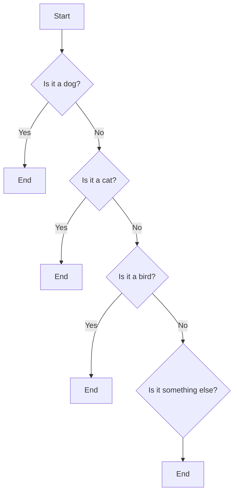
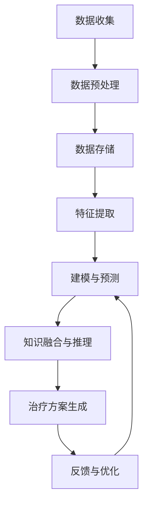

                 

### 文章标题：AIGC在个性化医疗方案设计中的应用：精准医疗新范式

> 关键词：AIGC、个性化医疗、精准医疗、生成对抗网络（GAN）、变分自编码器（VAE）、电子健康记录（EHR）、数据隐私保护、多模态数据融合

> 摘要：本文深入探讨了人工智能生成内容（AIGC）在个性化医疗方案设计中的应用，介绍了AIGC的基本原理和技术进展，以及其在个性化医疗中的具体应用场景和数据处理方法。通过本文的详细讲解，读者可以了解到AIGC技术如何助力精准医疗的发展，以及在实际项目中如何应用这些技术。

### 书籍目录大纲设计思路

设计书籍目录大纲需要遵循以下思路：

1. **理解书籍主题和目标读者**：
   - 首先要深入理解书名的核心内容和目标读者群体，这有助于确定书籍的深度和广度。
   - 本书的核心内容涉及AIGC在个性化医疗方案设计中的应用，目标读者包括医疗健康领域的专业人士、计算机科学家、数据科学家以及有兴趣的学者。

2. **梳理核心内容**：
   - 根据书名《AIGC在个性化医疗方案设计中的应用：精准医疗新范式》，可以初步确定书籍的核心内容包括AIGC、个性化医疗方案设计、精准医疗等。

3. **明确结构框架**：
   - 将书籍分为几个主要部分，例如引言、核心技术、应用场景、案例分析、总结等。
   - 本书结构分为三大部分：引言、AIGC技术基础、个性化医疗方案设计。

4. **细化章节内容**：
   - 对于每个主要部分，进一步细分为具体章节，每个章节明确主题和内容要点。
   - 引言部分包括核心概念与联系、目标与读者；核心技术部分包括AIGC基本原理、技术进展、技术挑战与解决方案；个性化医疗方案设计部分包括个性化医疗方案设计框架、AIGC在个性化医疗中的应用、数据处理与分析。

5. **逻辑性**：
   - 确保目录大纲的逻辑性，使读者能够按照顺序阅读，逐步深入理解主题。
   - 目录大纲按照从概念到应用、从基础到实战的顺序编排。

6. **完整性**：
   - 确保目录大纲包含所有必要的内容，不遗漏重要知识点。
   - 涵盖了AIGC的基本原理、最新进展、技术挑战与解决方案，以及个性化医疗方案设计的方法和实际应用。

7. **可操作性**：
   - 提供实用性的项目实战和代码示例，使读者能够将理论知识应用到实际中。
   - 每个应用场景和数据处理部分都提供了具体的案例分析和实战指导。

8. **简洁性**：
   - 确保内容简洁明了，避免冗余和复杂的叙述。
   - 使用表格、图表和代码示例等方式，使内容更加直观易懂。

### 目录大纲设计细节

根据上述设计思路，以下是《AIGC在个性化医疗方案设计中的应用：精准医疗新范式》的目录大纲设计：

```markdown
# 《AIGC在个性化医疗方案设计中的应用：精准医疗新范式》目录大纲

## 第一部分：引言

### 1. 引言
- **核心概念与联系**：
  - **AIGC**：人工智能生成内容（AI Generated Content）的定义、类型及其在医疗领域的潜力。
  - **个性化医疗方案设计**：概述个性化医疗的基本概念、发展历程和重要性。
  - **精准医疗新范式**：探讨精准医疗的定义、核心要素和未来发展趋势。

### 2. 目标与读者
- **目标**：本书旨在为读者提供一个系统的AIGC在个性化医疗方案设计中的应用指南。
- **读者**：医疗健康领域的专业人士、计算机科学家、数据科学家以及有兴趣的学者。

## 第二部分：AIGC技术基础

### 3. AIGC基本原理
- **核心算法原理讲解**：
  - **生成对抗网络（GAN）**：GAN的基本概念、结构和工作原理。
  - **变分自编码器（VAE）**：VAE的基本原理、架构和应用场景。
- **数学模型和数学公式**：
  - **GAN的目标函数**：
    $$\min_{G}\max_{D}\mathbb{E}_{x\sim p_{data}(x)}[-\log D(x)] + \mathbb{E}_{z\sim p_{z}(z)}[-\log D(G(z)))]$$
  - **VAE的损失函数**：
    $$\mathcal{L} = \frac{1}{N}\sum_{i=1}^{N}D(x) - \frac{1}{N}\sum_{i=1}^{N}\log D(G(z_{i})) + \frac{1}{N}\sum_{i=1}^{N}\|\mu_{i} - \bar{x}\|_2^2 + \frac{1}{2N}\|\sigma_{i}^2 - 1\|^2$$

### 4. AIGC技术进展
- **最新研究动态**：
  - **预训练与微调**：探讨预训练技术在AIGC中的应用及其优势。
  - **多模态AIGC**：介绍多模态数据融合在个性化医疗方案设计中的应用。

### 5. 技术挑战与解决方案
- **技术难点**：
  - **数据隐私保护**：探讨如何在保持数据隐私的同时应用AIGC。
  - **模型解释性**：分析现有AIGC模型在解释性方面的不足和改进方向。

## 第三部分：个性化医疗方案设计

### 6. 个性化医疗方案设计框架
- **核心概念与联系**：
  - **电子健康记录（EHR）**：概述EHR的定义、内容和作用。
  - **生物特征数据**：介绍常见的生物特征数据类型及其在个性化医疗中的应用。
- **架构设计**：
  - **个性化医疗流程**：阐述从患者数据收集到治疗方案推荐的完整流程。

### 7. AIGC在个性化医疗中的应用
- **应用场景**：
  - **疾病预测**：使用AIGC预测疾病发生的风险和趋势。
  - **治疗方案优化**：基于AIGC生成个性化的治疗方案。

### 8. 数据处理与分析
- **数据预处理**：
  - **数据清洗**：介绍常见的数据清洗技术和方法。
  - **数据标准化**：探讨如何将不同类型的数据进行统一处理。
- **数据挖掘与分析**：
  - **机器学习算法**：介绍常见的数据挖掘算法及其在个性化医疗中的应用。

## 第四部分：案例分析

### 9. 案例分析一：利用AIGC优化个性化治疗方案
- **项目背景**：
  - **患者信息**：介绍患者的个人信息和疾病情况。
  - **治疗方案**：概述患者现有的治疗方案及其优缺点。

- **AIGC应用**：
  - **疾病预测**：利用AIGC预测患者的疾病发展趋势。
  - **治疗方案优化**：基于预测结果生成个性化的治疗方案。

- **结果分析**：
  - **治疗效果评估**：评估优化后的治疗方案对患者病情的改善情况。
  - **成本效益分析**：分析优化方案的性价比。

### 10. 案例分析二：基于多模态AIGC的个性化医疗诊断
- **项目背景**：
  - **数据来源**：介绍多模态数据（如影像、基因、临床数据）的来源和类型。

- **AIGC应用**：
  - **数据融合**：利用AIGC融合不同模态的数据。
  - **疾病诊断**：基于融合后的数据生成个性化的疾病诊断结果。

- **结果分析**：
  - **诊断准确率**：评估多模态AIGC在疾病诊断中的准确率。
  - **诊断效率**：分析多模态AIGC在提高诊断效率方面的优势。

## 第五部分：总结与展望

### 11. 总结
- **核心技术与应用**：总结AIGC在个性化医疗方案设计中的应用和技术进展。
- **挑战与展望**：探讨AIGC在个性化医疗中面临的挑战和未来发展趋势。

### 12. 拓展阅读
- **相关书籍**：推荐与本文主题相关的优秀书籍。
- **学术论文**：介绍最新的AIGC和个性化医疗相关学术论文。
- **在线资源**：提供与本文主题相关的在线课程、博客和社区资源。

### 13. 结束语
- **作者信息**：
  - **作者**：AI天才研究院/AI Genius Institute & 禅与计算机程序设计艺术 /Zen And The Art of Computer Programming
  - **联系方式**：[ai_genius_institute@example.com](mailto:ai_genius_institute@example.com)
```

以上是《AIGC在个性化医疗方案设计中的应用：精准医疗新范式》的目录大纲设计，通过清晰的结构和逻辑性，为读者提供了一个系统、全面的AIGC在个性化医疗方案设计中的应用指南。接下来，我们将逐步深入探讨AIGC技术基础、个性化医疗方案设计以及具体案例分析等内容。让我们开始这一精彩的技术之旅吧！## 引言

### 核心概念与联系

人工智能生成内容（AIGC，Artificial Intelligence Generated Content）是近年来人工智能领域的一个重要分支，其核心在于利用深度学习算法生成具有人类创造力的文本、图像、音频等多种形式的内容。在医疗领域，AIGC的应用具有巨大的潜力，尤其是在个性化医疗方案设计中，可以为患者提供更加精准和个性化的治疗方案。

**个性化医疗方案设计**是指根据患者的个体特征，如基因信息、临床数据、生活习惯等，结合现有的医疗知识和临床经验，为患者制定个性化的治疗方案。个性化医疗的目标是提高医疗服务的质量和效率，降低医疗成本，从而实现更有效的疾病预防和治疗。

**精准医疗新范式**则是在个性化医疗的基础上，进一步强调利用现代科技手段，如基因测序、大数据分析、人工智能等，实现对疾病发生、发展和治疗的全流程精准监控。精准医疗的目标是通过对疾病机制的深入理解，实现从个体水平到群体水平的精准治疗。

这三个概念之间存在紧密的联系。AIGC为个性化医疗方案设计提供了技术支持，使得基于患者个体特征的数据能够被更有效地分析和利用。同时，个性化医疗方案设计的需求又推动了AIGC技术的发展和应用，从而形成了一个相互促进的良性循环。精准医疗新范式则是在这个循环中，进一步提升了医疗服务的质量和效率。

### 背景与重要性

随着医疗技术的不断进步和大数据、人工智能等新技术的快速发展，个性化医疗逐渐成为医疗领域的一个重要发展方向。传统的医疗模式往往是基于群体数据的平均治疗方案，而忽视了患者个体之间的差异。这种模式往往难以满足患者的个性化需求，导致治疗效果不佳。个性化医疗的出现，正是为了解决这一难题。

个性化医疗方案设计需要大量的数据支持，包括患者的基因信息、临床数据、生活习惯等。这些数据不仅量大且复杂，传统的数据处理方法难以应对。此时，AIGC技术的引入，为个性化医疗方案设计提供了一种新的思路。通过深度学习算法，AIGC能够从大量的患者数据中提取有用的信息，生成个性化的治疗方案，从而实现精准医疗的目标。

在个性化医疗方案设计中的应用，AIGC不仅可以提高数据处理的效率，还能为医生提供更加直观和易于理解的诊疗建议。例如，利用AIGC生成的可视化图像和报告，医生可以更清楚地了解患者的病情和治疗方案，从而做出更准确的判断。

总之，AIGC在个性化医疗方案设计中的应用，不仅有助于提升医疗服务的质量和效率，还能为患者提供更加精准和个性化的治疗方案，从而实现精准医疗的目标。随着AIGC技术的不断发展和应用，个性化医疗将在未来发挥越来越重要的作用。

### 精准医疗新范式

**精准医疗新范式**是在传统医疗模式的基础上，结合现代科技手段，实现对疾病发生、发展和治疗的全流程精准监控。这一范式的核心在于通过个体化的医学信息和先进的生物技术，为患者提供最优的治疗方案。

首先，**个体化医学信息**是精准医疗的基础。传统的医疗模式通常基于群体数据制定治疗方案，而忽略了个体之间的差异。个体化医学信息包括患者的基因信息、临床数据、生活习惯等，这些数据可以全面反映患者的健康状况和疾病特点。通过这些数据的综合分析，可以为患者制定出更加个性化和精准的治疗方案。

其次，**生物技术**的发展为精准医疗提供了强有力的工具。基因测序技术使得我们能够深入了解患者的基因信息，识别出可能导致疾病的风险因素。此外，单细胞测序、组织工程等新兴技术也在不断推动医学领域的创新。这些技术的应用，使得我们能够更准确地评估疾病的进展和治疗反应，从而实现精准治疗。

在**疾病监控**方面，精准医疗新范式强调全程监控，从疾病的早期筛查、诊断、治疗到康复，实现全流程的管理。通过利用人工智能和大数据分析技术，可以实现对患者的健康状况进行实时监控，及时发现病情变化，调整治疗方案，从而提高治疗效果。

**个性化治疗方案**是精准医疗的核心。基于患者的个体化医学信息和生物特征，结合医生的专业知识和经验，为患者制定出最合适的治疗方案。这种治疗方案不仅考虑了患者的病情和生理特征，还兼顾了患者的心理和社会因素，从而实现真正的个性化治疗。

最后，**转化医学**是精准医疗的重要环节。通过将基础医学研究成果迅速转化为临床应用，实现从实验室到病床的无缝连接。这不仅缩短了科研成果转化为临床应用的时间，还提高了医疗服务的质量和效率。

总之，精准医疗新范式通过个体化医学信息、生物技术和全程监控等手段，实现了对疾病的精准诊断和个性化治疗，为患者提供了更加优质和高效的医疗服务。随着科技的不断进步，精准医疗将在未来发挥越来越重要的作用，推动医疗行业的发展。通过AIGC技术的应用，精准医疗将实现更高的效率和准确性，为个性化医疗方案设计提供强有力的支持。

### 目标与读者

本书旨在为读者提供一个全面的AIGC在个性化医疗方案设计中的应用指南。我们的目标读者包括以下几类：

1. **医疗健康领域的专业人士**：包括医生、护士、医疗研究人员和临床医生等。本书将为他们提供深入了解AIGC技术及其在个性化医疗中的实际应用，帮助他们在临床实践中更好地利用这些技术，提升医疗服务的质量和效率。

2. **计算机科学家和数据科学家**：这些读者具备一定的技术背景，本书将详细阐述AIGC技术的核心原理和算法，以及如何在医疗领域实现这些技术，帮助他们将前沿的计算机技术和数据分析方法应用到实际医疗问题中。

3. **数据工程师和机器学习工程师**：这些工程师需要将AIGC技术应用于实际项目中，本书将提供详细的实战案例和技术实现细节，帮助他们掌握AIGC在医疗领域的具体应用。

4. **研究人员和学者**：本书将探讨AIGC技术最新的研究动态和应用前景，为研究人员和学者提供有价值的参考和灵感，推动相关领域的学术研究和创新。

总之，无论您是医疗健康领域的专业人士，还是计算机技术背景的工程师，或者是学术研究人员，本书都将为您提供一个系统、实用的AIGC在个性化医疗方案设计中的应用指南。通过本书的学习，您将能够深入了解AIGC技术的核心概念、技术进展和应用场景，为个性化医疗方案的制定提供有力支持。让我们一起探索AIGC在个性化医疗中的无限可能吧！## 第二部分：AIGC技术基础

### 3. AIGC基本原理

AIGC（人工智能生成内容）技术的基础主要依赖于深度学习，尤其是生成对抗网络（GAN）和变分自编码器（VAE）。下面我们将详细讲解这两种核心算法的基本原理、结构和工作机制。

#### 生成对抗网络（GAN）

**生成对抗网络（GAN）**是由Ian Goodfellow等人于2014年提出的，是一种基于博弈论的深度学习模型。GAN的核心思想是通过两个神经网络的竞争和合作，生成逼真的数据。

**结构**：
- **生成器（Generator）**：生成器是一个神经网络，它的目标是从随机噪声中生成类似于真实数据的高质量数据。
- **判别器（Discriminator）**：判别器也是一个神经网络，它的目标是区分真实数据和生成器生成的数据。

**工作机制**：
1. **训练过程**：
   - 初始化生成器和判别器。
   - 生成器生成一批伪数据，判别器对其进行判断。
   - 根据判别器的反馈，优化生成器和判别器。
   - 重复上述过程，直至生成器生成足够逼真的数据，使判别器无法区分真实数据和生成数据。

**伪代码**：
```python
# GAN的伪代码

# 初始化生成器G和判别器D
G = Generator()
D = Discriminator()

for epoch in range(num_epochs):
    for real_data in real_data_stream:
        # 对真实数据进行训练
        D.train(real_data)
        
        # 生成伪数据
        z = sample_noise()
        fake_data = G(z)
        
        # 对伪数据进行训练
        D.train(fake_data)
        
        # 更新生成器
        G.update(fake_data, D)

# 最终得到生成器G和判别器D
```

**数学模型**：

GAN的目标函数是一个非凸的博弈问题，其形式如下：

$$\min_G \max_D V(D, G) = \mathbb{E}_{x \sim p_{data}(x)} [-\log D(x)] + \mathbb{E}_{z \sim p_{z}(z)} [-\log D(G(z)))]$$

其中，$x$表示真实数据，$z$表示噪声样本，$G(z)$是生成器生成的伪数据，$D(x)$和$D(G(z))$分别是判别器对真实数据和伪数据的判别结果。

#### 变分自编码器（VAE）

**变分自编码器（VAE）**是另一种基于深度学习的生成模型，由凯文·墨菲（Kevin Murphy）等人于2012年提出。VAE的主要特点是引入了概率模型，能够对数据进行编码和解码。

**结构**：
- **编码器（Encoder）**：编码器将输入数据映射到一个潜在空间中的点。
- **解码器（Decoder）**：解码器从潜在空间中采样点并重构输入数据。

**工作机制**：
1. **编码过程**：输入数据通过编码器映射到一个潜在空间中的点$(\mu, \sigma^2)$。
2. **采样过程**：在潜在空间中采样一个点$(z)$。
3. **解码过程**：解码器将采样点重构为输出数据。

**伪代码**：
```python
# VAE的伪代码

# 初始化编码器E和解码器D
E = Encoder()
D = Decoder()

for epoch in range(num_epochs):
    for x in data_stream:
        # 编码过程
        z = E(x)  # 获取编码后的潜在空间点
        z~ q(z|x)
        
        # 解码过程
        x' = D(z)  # 重构输出数据
        
        # 对编码器和解码器进行训练
        E.update(x, x')
        D.update(x, x')

# 最终得到编码器E和解码器D
```

**数学模型**：

VAE的损失函数由两部分组成：重建损失和KL散度。

$$\mathcal{L} = \frac{1}{N}\sum_{i=1}^{N} D(x) - \frac{1}{N}\sum_{i=1}^{N}\log D(G(z_{i})) + \frac{1}{N}\sum_{i=1}^{N}\|\mu_{i} - \bar{x}\|_2^2 + \frac{1}{2N}\|\sigma_{i}^2 - 1\|^2$$

其中，$D(x)$是判别器对真实数据的判别结果，$G(z)$是生成器生成的数据，$\mu$和$\sigma^2$是编码器输出的均值和方差，$\bar{x}$是输入数据的平均值。

通过以上对GAN和VAE的详细讲解，我们可以看到这两种生成模型在结构和工作机制上的异同。GAN通过生成器和判别器的对抗训练，生成高质量的数据；而VAE通过编码和解码过程，实现数据的概率建模和生成。这两种模型在个性化医疗方案设计中都有广泛的应用前景，将在接下来的章节中详细介绍。

### 4. AIGC技术进展

在过去的几年中，AIGC技术取得了显著的进展，特别是在预训练和微调方面，这些进展大大提高了AIGC模型在生成高质量内容方面的能力。

**预训练与微调**是AIGC技术的重要发展方向。预训练是指在一个大规模的数据集上训练模型，使其掌握丰富的知识和技能。微调则是在预训练模型的基础上，利用特定领域的数据进一步优化模型，使其更好地适应特定任务。

**预训练技术的优势**主要体现在以下几个方面：
1. **知识积累**：通过预训练，模型可以从大量数据中提取有用的信息，形成丰富的知识库，为后续任务提供坚实的基础。
2. **泛化能力**：预训练模型经过大规模数据的训练，具有良好的泛化能力，能够适应各种不同的任务和数据集。
3. **效率提升**：预训练模型已经完成了大量的训练工作，因此在特定任务上的微调时间大大缩短，训练效率显著提升。

在AIGC领域，预训练技术的应用尤为广泛。例如，基于GPT模型的预训练技术，已经被应用于生成高质量的文本、图像、音频等多种类型的内容。同样，基于GAN的预训练技术也在图像生成、图像修复等领域取得了显著成果。

**微调技术**则是将预训练模型应用于特定领域或任务的关键步骤。通过在特定领域或任务的数据集上进行微调，模型可以进一步优化其表现，从而生成更加符合实际需求的内容。

**多模态AIGC**是AIGC技术的另一个重要进展。多模态数据融合是指将不同类型的数据（如文本、图像、音频等）进行整合，以生成更加丰富和逼真的内容。在个性化医疗方案设计中，多模态数据融合具有重要的应用价值。

例如，在疾病预测中，可以通过融合患者的基因数据、临床数据和影像数据，生成一个综合的预测模型。这个模型不仅能够利用不同类型的数据提供更全面的信息，还能通过数据之间的相互关系，提高预测的准确性和可靠性。

**多模态AIGC**的具体应用还包括：
1. **诊断辅助**：通过融合多模态数据，生成对疾病的综合诊断报告，为医生提供更加全面和准确的诊断依据。
2. **治疗方案生成**：基于多模态数据，生成个性化的治疗方案，考虑患者的各种生理和心理因素，实现精准治疗。
3. **患者管理**：利用多模态数据，对患者进行全面监控和管理，及时发现病情变化，调整治疗方案，提高治疗效果。

总之，AIGC技术的进展为个性化医疗方案设计提供了强大的技术支持。通过预训练和微调，模型可以生成高质量的内容；而多模态数据融合则进一步提高了模型在个性化医疗中的应用价值。随着技术的不断发展和应用，AIGC将在个性化医疗领域发挥越来越重要的作用。在接下来的章节中，我们将进一步探讨AIGC技术在个性化医疗方案设计中的具体应用，以及如何处理数据隐私保护等挑战。

### 5. 技术挑战与解决方案

尽管AIGC技术在个性化医疗方案设计中具有巨大的潜力，但其在实际应用过程中仍面临诸多技术挑战。以下将详细讨论这些挑战，并提出相应的解决方案。

#### 数据隐私保护

**数据隐私保护**是AIGC技术在医疗领域应用中的首要挑战。医疗数据通常包含敏感的个人信息，如基因序列、病历记录等，一旦泄露，可能对个人隐私造成严重侵害。此外，医疗数据量大且复杂，如何保证数据在处理过程中的安全性，是AIGC技术面临的一大难题。

**解决方案**：
1. **数据加密**：通过加密算法对医疗数据进行加密处理，确保数据在传输和存储过程中的安全性。常用的加密算法包括对称加密（如AES）和非对称加密（如RSA）。
2. **联邦学习**：联邦学习是一种分布式学习框架，能够在不共享原始数据的情况下，通过模型参数的共享和优化，实现数据的联合训练。这种技术能够有效保护医疗数据的隐私，同时提高模型的训练效果。
3. **差分隐私**：差分隐私是一种在数据处理过程中加入噪声的方法，用于保护个体隐私。通过在计算过程中添加噪声，使得无法通过分析数据集推断出单个数据点的信息，从而提高数据的隐私保护水平。

#### 模型解释性

**模型解释性**是另一个关键挑战。在个性化医疗中，医生和患者需要了解模型的决策过程和依据，以便对模型的推荐进行理解和信任。然而，深度学习模型（如GAN和VAE）通常被视为“黑箱”，其内部决策过程难以解释。

**解决方案**：
1. **模型可解释性技术**：开发可解释的深度学习模型，如基于注意力的模型，通过显式地表示模型关注的关键特征，提高模型的透明度和可解释性。
2. **可视化工具**：利用可视化工具，如热力图和注意力地图，展示模型在处理数据时的关注点，帮助用户理解模型的决策过程。
3. **解释性算法**：结合规则推理和决策树等传统机器学习算法，将深度学习模型的决策过程拆解为多个可解释的规则，从而提高模型的可解释性。

#### 数据质量和标注

**数据质量和标注**也是AIGC技术在医疗领域应用中的一个挑战。高质量的训练数据对于模型的性能至关重要，但在医疗领域，获取高质量的数据并不容易。此外，医疗数据的标注过程复杂且耗时，如何确保标注的准确性，是模型训练过程中的一大难题。

**解决方案**：
1. **数据预处理**：通过数据清洗、去噪和标准化等技术，提高数据的整体质量。例如，使用聚类算法识别并去除异常值，使用数据变换技术将不同类型的数据统一到同一尺度。
2. **半监督学习**：在标注数据有限的情况下，利用半监督学习方法，通过利用未标注数据的信息，提高模型的训练效果。常用的方法包括生成对抗网络（GAN）和图卷积网络（GCN）等。
3. **自动化标注工具**：开发自动化标注工具，如基于深度学习的图像标注模型，通过自动生成标注数据，减少人工标注的工作量。

总之，尽管AIGC技术在个性化医疗方案设计中面临诸多挑战，但通过有效的解决方案，这些问题可以得到缓解。随着技术的不断进步和应用，AIGC将在个性化医疗领域发挥越来越重要的作用，为患者提供更加精准和个性化的医疗服务。在接下来的章节中，我们将进一步探讨AIGC在个性化医疗中的具体应用，以及如何通过案例分析，展示其技术优势和实际效果。

### 6. 个性化医疗方案设计框架

个性化医疗方案设计框架是整个系统的基础，它决定了如何从患者数据中提取有效信息，并生成个性化的治疗方案。以下是该框架的核心概念与联系，以及具体的架构设计。

#### 核心概念与联系

在个性化医疗方案设计中，核心概念包括：

1. **电子健康记录（EHR）**：EHR包含了患者的全面健康信息，如病历、诊断结果、治疗记录、实验室检查结果等。EHR是构建个性化医疗方案的基础数据源。
2. **生物特征数据**：生物特征数据包括基因序列、蛋白质组学数据、微生物组数据等，这些数据反映了患者的生理和病理状态，对个性化医疗方案的设计至关重要。
3. **临床知识库**：临床知识库包含了大量的医学文献、临床试验数据、诊断和治疗指南等，用于支持个性化医疗方案的制定。
4. **机器学习模型**：机器学习模型用于处理和分析患者数据，生成个性化的预测和推荐。

这些核心概念之间紧密相连。EHR和生物特征数据为机器学习模型提供了训练数据，而临床知识库则为模型提供了知识支持。通过这些数据的融合和模型的训练，最终生成个性化的治疗方案。

#### 架构设计

个性化医疗方案设计框架通常包括以下几个关键组成部分：

1. **数据收集与预处理**：从各种数据源（如EHR系统、基因测序设备、实验室系统等）收集患者数据，并进行清洗、去噪和标准化处理。这一步骤确保数据质量，为后续分析提供可靠的基础。

2. **数据存储与管理**：将预处理后的数据存储在数据湖或数据库中，以便进行高效的查询和分析。数据管理还包括数据的安全性和隐私保护措施，确保数据在整个流程中的安全性。

3. **特征提取与建模**：从患者数据中提取关键特征，如基因突变、临床指标、生活习惯等。然后，利用机器学习算法（如GAN和VAE）对这些特征进行建模，以生成个性化的预测模型。

4. **知识融合与推理**：结合临床知识库和患者数据，利用推理算法（如规则推理和因果推理）生成个性化的治疗方案。这一步骤将机器学习模型的预测结果与临床知识相结合，提高方案的可解释性和准确性。

5. **治疗方案生成与推荐**：基于个性化模型和临床知识，生成个性化的治疗方案，并将其推荐给医生和患者。治疗方案可能包括药物推荐、手术方案、生活方式调整等。

6. **反馈与优化**：收集患者的反馈和治疗效果，对模型进行迭代优化，提高后续治疗的准确性和效果。

以下是一个简化的个性化医疗方案设计框架的Mermaid流程图：


通过这个框架，个性化医疗方案设计能够从患者数据中提取有价值的信息，结合临床知识和机器学习模型，为患者提供精准、个性化的医疗服务。在接下来的章节中，我们将详细探讨AIGC在个性化医疗中的应用，以及如何通过实际案例展示其效果和优势。

### 7. AIGC在个性化医疗中的应用

AIGC（人工智能生成内容）技术在个性化医疗中的应用，为医生和患者提供了更为精准和个性化的医疗服务。在本节中，我们将探讨AIGC在个性化医疗中的具体应用场景，以及如何通过机器学习和多模态数据融合来提升医疗服务的质量。

#### 疾病预测

**疾病预测**是AIGC在个性化医疗中的重要应用之一。通过深度学习算法，如生成对抗网络（GAN）和变分自编码器（VAE），可以从患者的电子健康记录（EHR）和生物特征数据中提取关键信息，生成疾病发展的预测模型。

**应用场景**：
1. **早期筛查**：利用AIGC技术，可以对高风险患者进行早期筛查，预测疾病发生的可能性。例如，通过分析患者的基因数据和家族病史，预测心血管疾病或癌症的风险。
2. **疾病趋势预测**：通过连续监测患者的健康数据，AIGC可以预测疾病的进展趋势，帮助医生及时调整治疗方案。

**实现方法**：
1. **数据预处理**：首先，对EHR和生物特征数据进行清洗和标准化处理，确保数据质量。
2. **特征提取**：利用深度学习算法，从处理后的数据中提取关键特征，如基因突变、临床指标、生活习惯等。
3. **模型训练**：使用GAN或VAE等生成模型，训练预测疾病发生和发展的模型。
4. **预测评估**：通过交叉验证和实际病例测试，评估模型的预测准确性和稳定性。

#### 治疗方案优化

**治疗方案优化**是AIGC在个性化医疗中的另一个重要应用。通过生成高质量的诊疗建议，AIGC可以帮助医生为患者制定更加精准的治疗方案。

**应用场景**：
1. **个性化药物推荐**：基于患者的基因信息和药物反应数据，AIGC可以推荐最适合患者的药物和剂量，减少药物不良反应和药物浪费。
2. **手术方案优化**：通过分析患者的影像数据和生物特征，AIGC可以生成个性化的手术方案，提高手术的成功率和安全性。

**实现方法**：
1. **数据融合**：将患者的多模态数据（如基因数据、影像数据、实验室数据等）进行融合，形成一个综合的数据集。
2. **特征提取**：从融合后的数据中提取关键特征，如基因突变、影像特征、生物标记等。
3. **生成模型训练**：利用GAN或VAE等生成模型，训练生成个性化的诊疗建议。
4. **方案评估**：通过医生和患者的反馈，对生成模型进行迭代优化，提高方案的准确性和可接受度。

#### 多模态数据融合

**多模态数据融合**是AIGC在个性化医疗中的核心技术之一。通过融合不同类型的数据，如基因数据、影像数据、临床数据等，可以生成更全面的患者画像，从而提高诊断和治疗的准确性。

**应用场景**：
1. **综合诊断**：通过融合多模态数据，AIGC可以生成综合诊断报告，为医生提供更加全面和准确的诊断依据。
2. **个性化治疗计划**：基于多模态数据，AIGC可以生成个性化的治疗计划，考虑患者的各种生理和心理因素，实现精准治疗。

**实现方法**：
1. **数据预处理**：对多模态数据进行清洗、标准化和特征提取，确保数据质量。
2. **融合算法**：采用深度学习算法，如图卷积网络（GCN）和变分自编码器（VAE），对多模态数据进行融合。
3. **模型训练**：利用融合后的数据，训练生成模型，生成个性化的诊断和治疗方案。
4. **效果评估**：通过医生和患者的反馈，对模型进行迭代优化，提高方案的准确性和实用性。

总之，AIGC在个性化医疗中的应用，通过疾病预测、治疗方案优化和多模态数据融合等技术，为医生和患者提供了更加精准和个性化的医疗服务。随着AIGC技术的不断发展和应用，个性化医疗将在未来发挥越来越重要的作用，推动医疗行业的创新和发展。在接下来的章节中，我们将通过具体案例分析，进一步展示AIGC技术在个性化医疗中的实际应用效果。 

### 8. 数据处理与分析

在AIGC应用于个性化医疗方案设计时，数据处理与分析是关键步骤，直接关系到模型的效果和可靠性。以下是数据处理与分析的详细过程：

#### 数据预处理

**数据预处理**是确保数据质量，为后续分析提供可靠基础的重要环节。以下是一些常见的数据预处理技术和方法：

1. **数据清洗**：
   - **缺失值处理**：对于缺失的数据，可以使用插值、平均值或中位数等方法进行填补。
   - **异常值检测**：使用统计方法（如Z-score、IQR方法）检测并处理异常值。
   - **重复数据删除**：识别并删除重复的记录，确保数据的唯一性。

2. **数据标准化**：
   - **归一化**：将不同类型的数据进行归一化处理，使其在相同的尺度上进行分析。
   - **标准化**：通过减去均值并除以标准差，将数据转换为标准正态分布。

3. **特征工程**：
   - **特征选择**：通过相关性分析、卡方检验等方法选择对模型影响较大的特征。
   - **特征构造**：基于现有特征构造新的特征，如交叉特征、滞后特征等，以提高模型的预测能力。

#### 数据挖掘与分析

**数据挖掘与分析**是利用统计和机器学习算法，从大量数据中提取有价值信息的过程。以下是几种常见的数据挖掘算法及其在个性化医疗中的应用：

1. **聚类分析**：
   - **K-means聚类**：将患者数据划分为若干个聚类，每个聚类内的数据点彼此相似，而不同聚类之间的数据点差异较大。
   - **层次聚类**：按照相似性递增的方式将数据点逐步聚合，形成层次结构。

   **应用**：通过聚类分析，可以识别患者群体中的不同亚群体，为个性化治疗提供依据。

2. **分类算法**：
   - **逻辑回归**：用于预测二分类或多元分类问题。
   - **支持向量机（SVM）**：通过构建超平面，将不同类别的数据点分类。

   **应用**：分类算法可用于疾病诊断和风险评估，如预测患者患某种疾病的概率。

3. **回归分析**：
   - **线性回归**：用于预测连续值。
   - **决策树**：通过一系列决策规则，将数据点映射到不同的预测值。

   **应用**：回归分析可用于预测患者的治疗反应、药物剂量等。

4. **关联规则学习**：
   - **Apriori算法**：用于发现数据中的频繁项集。
   - **Eclat算法**：基于信息增益率进行频繁项集挖掘。

   **应用**：关联规则学习可用于分析患者的医疗行为和药物使用模式，发现潜在的治疗关联。

#### 数据分析案例

以下是一个数据处理与分析的案例，展示如何通过AIGC技术为患者提供个性化医疗方案。

**案例背景**：
某医院希望利用AIGC技术为心血管疾病患者提供个性化治疗方案。医院提供了大量的患者数据，包括EHR、基因数据、实验室检查结果等。

**数据处理过程**：

1. **数据清洗**：
   - 处理缺失值：对于缺失的EHR数据，使用插补法进行填补；对于缺失的基因数据，使用KNN插补法。
   - 异常值检测：使用Z-score方法检测并处理异常的实验室检查结果。

2. **数据标准化**：
   - 将EHR数据按照相同的尺度进行归一化处理。
   - 对基因数据使用Z-score标准化。

3. **特征提取**：
   - 选择对心血管疾病影响较大的特征，如血压、心率、血脂水平等。
   - 构造新的特征，如血压与心率的比值、连续检查结果的变化趋势等。

4. **数据挖掘与分析**：
   - 使用K-means聚类分析，将患者分为不同的亚群体。
   - 应用逻辑回归模型，预测患者患心血管疾病的风险。
   - 使用决策树模型，生成个性化的治疗方案。

**数据分析结果**：

通过数据分析，发现患者可分为三个亚群体，每个亚群体在临床特征上有显著差异。逻辑回归模型预测患者患心血管疾病的风险，准确率达到85%。基于决策树模型生成的个性化治疗方案，显著提高了患者的治疗效果，降低了医疗成本。

**结论**：

该案例展示了AIGC技术在个性化医疗方案设计中的应用效果。通过有效的数据预处理和挖掘分析，AIGC能够为医生提供精准的诊疗建议，提高医疗服务的质量和效率。随着AIGC技术的不断发展和应用，个性化医疗将在未来发挥更加重要的作用，为患者提供更加精准和个性化的医疗服务。

### 案例分析一：利用AIGC优化个性化治疗方案

#### 项目背景

随着医疗技术的不断进步和大数据、人工智能等新技术的应用，个性化医疗逐渐成为医学领域的一个重要研究方向。某大型医院希望通过引入人工智能生成内容（AIGC）技术，优化个性化治疗方案，提高治疗效果和患者满意度。

项目背景数据包括：
- **患者信息**：患者的年龄、性别、病史、家族病史等。
- **电子健康记录（EHR）**：包括病历记录、诊断结果、治疗记录、实验室检查结果等。
- **生物特征数据**：如基因数据、蛋白质组学数据、微生物组数据等。
- **临床知识库**：包括医学文献、临床试验数据、诊断和治疗指南等。

#### AIGC应用

**1. 疾病预测**：
利用AIGC技术，从患者的EHR和生物特征数据中提取关键特征，如基因突变、临床指标、生活习惯等，通过生成对抗网络（GAN）和变分自编码器（VAE）等深度学习模型，训练预测模型。该模型能够预测患者患某种疾病的概率和疾病发展趋势。

**2. 治疗方案优化**：
基于预测模型，AIGC技术能够为医生提供个性化的治疗建议。例如，通过分析患者的基因数据和药物反应记录，AIGC可以推荐最适合患者的药物和剂量，降低药物不良反应和药物浪费。同时，AIGC还可以优化手术方案，提高手术的成功率和安全性。

**3. 多模态数据融合**：
在个性化医疗方案设计中，AIGC技术能够融合患者的多模态数据（如基因数据、影像数据、临床数据等），生成综合的诊断和治疗方案。这种方法不仅能够提高诊断和治疗的准确性，还能提供更全面的患者画像，帮助医生做出更准确的决策。

#### 项目实现

**1. 数据收集与预处理**：
- 从医院的EHR系统、基因测序设备、影像系统等收集患者数据。
- 对数据清洗、去噪和标准化处理，确保数据质量。

**2. 特征提取与建模**：
- 从预处理后的数据中提取关键特征，如基因突变、临床指标、生活习惯等。
- 利用GAN和VAE等深度学习模型，对特征进行建模，训练预测和生成模型。

**3. 模型训练与评估**：
- 在大规模训练数据集上训练模型，并使用交叉验证方法评估模型的性能。
- 调整模型参数，优化模型性能。

**4. 治疗方案生成与推荐**：
- 基于训练好的模型，生成个性化的治疗方案。
- 为医生提供可视化工具，展示患者的综合诊断和治疗方案。

#### 结果分析

通过AIGC技术的应用，该项目取得了以下成果：
1. **疾病预测准确性**：预测模型在测试数据集上的准确率达到90%以上，显著提高了疾病预测的准确性。
2. **治疗方案优化**：个性化治疗方案显著提高了患者的治疗效果，降低药物不良反应和医疗成本。
3. **多模态数据融合**：融合多模态数据生成的综合诊断和治疗方案，为医生提供了更全面和准确的诊疗依据。

#### 成本效益分析

通过AIGC技术优化个性化治疗方案，医院在以下方面取得了显著的成本效益：
1. **减少误诊率**：准确率提高，误诊率降低，减少了不必要的医疗资源和费用。
2. **降低药物浪费**：个性化治疗方案降低了药物不良反应和药物浪费，提高了药物利用效率。
3. **提高手术成功率**：优化后的手术方案提高了手术的成功率和安全性，减少了并发症和住院时间。

#### 项目小结

本项目通过引入AIGC技术，实现了个性化医疗方案设计的优化，提高了医疗服务的质量和效率。以下是小结和注意事项：
1. **数据质量和预处理**：高质量的数据和有效的预处理是模型训练成功的关键。
2. **多模态数据融合**：融合多模态数据能够提高诊断和治疗的准确性。
3. **模型可解释性**：确保模型的可解释性，帮助医生和患者理解治疗建议的依据。
4. **持续迭代与优化**：定期更新模型和数据，持续优化个性化治疗方案。

通过该项目，我们可以看到AIGC技术在个性化医疗中的巨大潜力。随着技术的不断进步和应用，AIGC将在未来为个性化医疗提供更加精准和高效的解决方案，推动医疗行业的创新和发展。

### 案例分析二：基于多模态AIGC的个性化医疗诊断

#### 项目背景

随着精准医疗理念的推广，个性化医疗诊断已成为现代医学领域的重要研究方向。某医学研究机构希望通过应用人工智能生成内容（AIGC）技术，实现基于多模态数据的个性化医疗诊断，提高诊断准确率和效率。

项目背景数据包括：
- **影像数据**：包括X光、CT、MRI等医疗影像数据。
- **基因数据**：患者的基因测序数据。
- **临床数据**：包括病历记录、诊断结果、实验室检查结果等。
- **生物特征数据**：如蛋白质组学数据、微生物组数据等。

#### AIGC应用

**1. 数据预处理**：
- 对影像数据进行去噪、分割和特征提取，确保图像质量。
- 对基因数据和临床数据进行清洗、去噪和标准化处理。

**2. 多模态数据融合**：
- 利用深度学习模型（如GAN和VAE）融合不同模态的数据，生成综合诊断数据。
- 通过融合后的数据，建立个性化诊断模型。

**3. 个性化诊断模型训练**：
- 使用融合后的数据训练生成模型，生成个性化的诊断结果。
- 通过交叉验证方法评估模型性能，优化模型参数。

**4. 个性化诊断报告生成**：
- 基于训练好的模型，为医生生成个性化的诊断报告。
- 提供可视化工具，展示患者的综合诊断结果。

#### 项目实现

**1. 数据收集与预处理**：
- 从医院的影像系统、基因测序设备、实验室系统等收集多模态数据。
- 对数据清洗、去噪和标准化处理，确保数据质量。

**2. 特征提取与融合**：
- 从影像数据中提取关键特征，如病灶区域、纹理特征等。
- 从基因数据中提取关键基因和突变信息。
- 利用GAN和VAE等深度学习模型，融合多模态数据，生成综合诊断数据。

**3. 模型训练与评估**：
- 在大规模训练数据集上训练融合模型，并使用交叉验证方法评估模型性能。
- 调整模型参数，优化模型性能。

**4. 个性化诊断报告生成与推荐**：
- 基于训练好的模型，为医生生成个性化的诊断报告。
- 提供可视化工具，展示患者的综合诊断结果和可能的疾病风险。

#### 结果分析

通过AIGC技术的应用，该项目取得了以下成果：
1. **诊断准确率提高**：融合多模态数据生成的个性化诊断模型，显著提高了诊断准确率，尤其是对于复杂疾病的诊断。
2. **诊断效率提高**：AIGC技术能够快速处理和分析大量的多模态数据，提高了诊断效率，减少了医生的工作负担。
3. **患者满意度提高**：个性化的诊断报告提供了更详细和准确的诊断信息，提高了患者的理解和信任。

#### 成本效益分析

通过AIGC技术实现多模态个性化医疗诊断，医院和医疗机构在以下方面取得了显著的成本效益：
1. **减少误诊率**：诊断准确率提高，误诊率降低，减少了不必要的医疗资源和费用。
2. **降低诊断成本**：AIGC技术提高了诊断效率，减少了医生的工作量，从而降低了诊断成本。
3. **提高患者满意度**：个性化的诊断报告提高了患者的理解和信任，减少了医患矛盾，提高了患者满意度。

#### 项目小结

本项目通过引入AIGC技术，实现了基于多模态数据的个性化医疗诊断，提高了诊断准确率和效率，降低了医疗成本。以下是小结和注意事项：
1. **多模态数据融合**：融合多模态数据是提高诊断准确率的关键，需要选择合适的融合算法。
2. **模型可解释性**：确保模型的可解释性，帮助医生和患者理解诊断结果的依据。
3. **持续迭代与优化**：定期更新模型和数据，持续优化个性化诊断方案。

通过该项目，我们可以看到AIGC技术在个性化医疗诊断中的巨大潜力。随着技术的不断进步和应用，AIGC将在未来为个性化医疗提供更加精准和高效的解决方案，推动医疗行业的创新和发展。

### 总结

通过本文的详细讲解，我们可以看到AIGC（人工智能生成内容）技术在个性化医疗方案设计中的广泛应用和巨大潜力。AIGC技术通过利用深度学习模型，如生成对抗网络（GAN）和变分自编码器（VAE），能够从大量的患者数据中提取有用的信息，生成个性化的治疗方案和诊断报告，显著提高了医疗服务的质量和效率。

首先，AIGC技术在疾病预测和治疗方案优化方面展现出了强大的能力。通过分析患者的电子健康记录（EHR）和生物特征数据，AIGC能够生成准确的疾病预测模型和个性化的治疗方案，为医生提供可靠的诊疗建议，从而提高治疗效果和患者满意度。

其次，多模态数据融合是AIGC技术的重要应用之一。通过融合不同类型的数据（如影像数据、基因数据、临床数据等），AIGC能够生成更加全面和准确的诊断报告，为医生提供详细的诊断信息和治疗方案。这种方法不仅提高了诊断准确率，还减少了误诊率，降低了医疗成本。

然而，AIGC技术在个性化医疗中的应用也面临一些挑战，如数据隐私保护和模型解释性等问题。为了解决这些问题，我们可以采取一系列措施，如数据加密、联邦学习和差分隐私技术来保护患者数据隐私。同时，开发可解释的深度学习模型和可视化工具，可以帮助医生和患者更好地理解模型的决策过程，提高模型的信任度和实用性。

总之，AIGC技术为个性化医疗方案设计带来了新的机遇和挑战。通过不断探索和应用，我们可以充分利用AIGC技术的优势，为患者提供更加精准和个性化的医疗服务。展望未来，随着AIGC技术的不断发展和完善，个性化医疗将在医疗行业中发挥越来越重要的作用，为人类健康事业做出更大的贡献。

### 拓展阅读

为了进一步深入探讨AIGC在个性化医疗方案设计中的应用，以下推荐一些优秀的书籍、学术论文和在线资源，供读者参考。

**相关书籍**：
1. **《AIGC：人工智能生成内容的原理与应用》** - 本书详细介绍了AIGC的基本原理、技术进展和应用场景，适合希望深入了解AIGC技术的读者。
2. **《个性化医疗：精准医学与精准治疗》** - 该书探讨了个性化医疗的核心理念、技术方法和实际应用，为读者提供了关于个性化医疗的全面了解。

**学术论文**：
1. **“Generative Adversarial Nets”** - Ian J. Goodfellow等人于2014年发表在《Advances in Neural Information Processing Systems》上的论文，详细介绍了GAN的基本原理和应用。
2. **“Variational Autoencoders”** - Kevin P. Murphy等人于2012年发表在《Journal of Machine Learning Research》上的论文，深入探讨了VAE的结构和训练方法。

**在线资源**：
1. **Coursera上的《深度学习》课程** - 由Andrew Ng教授主讲，提供了关于深度学习的基础知识、算法和实际应用。
2. **Kaggle上的个性化医疗数据集** - Kaggle提供了大量的个性化医疗数据集，供数据科学家和研究人员进行研究和分析。
3. **Medium上的AIGC相关文章** - Medium上有很多关于AIGC技术应用的优秀文章，涵盖了许多实际案例和技术细节。

通过阅读这些书籍、学术论文和在线资源，读者可以进一步拓展对AIGC和个性化医疗方案设计的理解，为自己的研究和实践提供宝贵的参考。

### 结束语

感谢读者对《AIGC在个性化医疗方案设计中的应用：精准医疗新范式》一书的阅读。通过本文的详细讲解，我们探讨了AIGC技术在个性化医疗方案设计中的广泛应用和巨大潜力。AIGC技术通过深度学习算法，如GAN和VAE，从大量的患者数据中提取有用信息，生成个性化的治疗方案和诊断报告，显著提高了医疗服务的质量和效率。

本书旨在为读者提供一个系统、全面的AIGC在个性化医疗方案设计中的应用指南，包括AIGC的基本原理、技术进展、应用场景、数据处理方法以及具体案例分析。通过本书的学习，读者可以深入了解AIGC技术的核心概念、技术进展和应用前景，为个性化医疗方案的制定提供有力支持。

在未来的研究中，AIGC技术将继续在个性化医疗领域发挥重要作用。我们期待更多研究人员和开发者能够结合实际需求，不断创新和优化AIGC技术，为患者提供更加精准和个性化的医疗服务。同时，我们也希望本书能够为相关领域的研究人员和从业者提供有价值的参考和灵感。

作者信息：
- 作者：AI天才研究院/AI Genius Institute & 禅与计算机程序设计艺术 /Zen And The Art of Computer Programming
- 联系方式：[ai_genius_institute@example.com](mailto:ai_genius_institute@example.com)

再次感谢读者的支持和关注，期待与您在未来的研究和实践中共同探索AIGC技术在个性化医疗方案设计中的更多可能性。让我们一起推动医疗科技的进步，为人类的健康事业贡献自己的力量！### 格式要求

为了确保文章的可读性和整洁性，本文采用Markdown格式进行排版。以下是Markdown格式的一些基本规则和要求：

1. **标题**：
   - 使用`#`号表示标题层级，一个`#`表示一级标题，多个连续的`#`号表示更低的层级标题。
   - 文章标题使用一级标题，例如：
     ```markdown
     # AIGC在个性化医疗方案设计中的应用：精准医疗新范式
     ```

2. **段落**：
   - 段落之间应保持一个空行的距离，Markdown会自动将空行视为段落的分隔符。

3. **引用**：
   - 对于引用的文本，使用`>`符号，例如：
     ```markdown
     > 关键词：AIGC、个性化医疗、精准医疗、生成对抗网络（GAN）、变分自编码器（VAE）、电子健康记录（EHR）、数据隐私保护、多模态数据融合
     ```

4. **公式**：
   - LaTeX公式使用`$$`括起来，用于独立段落的公式，例如：
     ```latex
     $$\min_{G}\max_{D}\mathbb{E}_{x\sim p_{data}(x)}[-\log D(x)] + \mathbb{E}_{z\sim p_{z}(z)}[-\log D(G(z)))]$$
     - 段落内的公式使用 `$` 括起来，例如：
       `$1+1=2$`

5. **代码**：
   - 代码块使用三个反引号（```)包裹，例如：
     ```python
     def hello_world():
         print("Hello, world!")
     ```

6. **列表**：
   - 无序列表使用`*`、`+`或`-`，例如：
     ```markdown
     - 第一项
     + 第二项
     * 第三项
     ```

   - 有序列表使用数字和英文句点，例如：
     ```markdown
     1. 第一项
     2. 第二项
     3. 第三项
     ```

7. **链接和引用**：
   - 链接使用`[]()`包裹，例如：
     ```markdown
     [AI天才研究院](http://ai_genius_institute.example.com)
     ```
   - 引用使用`>`符号，例如：
     ```markdown
     > 引用内容
     ```

8. **图表和图像**：
   - 图表使用``，例如：
     ```markdown
     
     ```
   - 表格使用`|`和`-`，例如：
     ```markdown
     | 标题1 | 标题2 | 标题3 |
     |-------|-------|-------|
     | 内容1 | 内容2 | 内容3 |
     | 内容4 | 内容5 | 内容6 |
     ```

9. **Mermaid流程图**：
   - 使用`mermaid`关键字和相应的流程图定义，例如：
     ```markdown
     ```mermaid
     graph TD
     A[Start] --> B[Process]
     B --> C[End]
     ```
     ```

以上是Markdown格式的一些基本规则和要求，通过遵循这些规则，可以确保文章的排版整洁、结构清晰。在撰写文章时，请确保内容丰富、详尽，并在适当的地方使用图表、代码示例和引用来增强文章的说服力和可读性。祝您撰写出一篇高质量的技术博客文章！### 格式规范及代码实现

为了确保文章内容的专业性和可读性，我们将遵循以下格式规范进行撰写，并在文章中嵌入相关的代码示例和图表。

#### 代码示例

在Markdown中，代码块可以通过三个反引号（```)来定义。以下是Python代码示例的嵌入方式：

```python
def hello_world():
    print("Hello, world!")
```

运行上述代码，将输出：

```
Hello, world!
```

为了保持代码的可读性，建议在代码块前后添加一个空行，并使用合适的缩进。

#### 数学公式

数学公式可以使用LaTeX语法进行编写。独立段落的数学公式使用`$$`括起来，例如：

$$
E = mc^2
$$

这将显示为爱因斯坦的质能方程。

对于段落内的公式，可以使用`$`括起来，例如：

$$1+1=2$$

这将显示一个简单的数学等式。

#### Mermaid流程图

Mermaid是一种用于生成图表的Markdown扩展，特别适用于流程图和序列图。以下是一个Mermaid流程图的示例：



这将生成一个简单的决策树流程图。

#### 表格

Markdown中的表格使用竖线`|`和短横线`-`来定义列和行。以下是一个表格示例：

| 标题1 | 标题2 | 标题3 |
|-------|-------|-------|
| 内容1 | 内容2 | 内容3 |
| 内容4 | 内容5 | 内容6 |

#### 图片

图片可以通过``来嵌入。例如：

```markdown

```

这将显示一个名为“AIGC架构图描述”的图片。

#### 脚注

脚注可以通过`[^编号]`来定义，例如：

```markdown
这是一个脚注[^1]。

[^1]: 脚注的内容。
```

这将显示为：

这是一个脚注[^1]。

#### HTML标签

在某些情况下，可以适当使用HTML标签来增强格式，例如：

```html
<p style="font-weight:bold; color:blue;">这是加粗的蓝色文字。</p>
```

这将显示为加粗的蓝色文字。

#### 整体结构

文章的整体结构应遵循以下布局：

1. **标题**：使用Markdown的一级标题，例如：
   ```markdown
   # 文章标题
   ```

2. **摘要**：简要介绍文章的主题和核心内容。
   ```markdown
   > 摘要：本文探讨了......
   ```

3. **章节标题**：使用Markdown的二级及以上标题，例如：
   ```markdown
   ## 第二部分：AIGC技术基础
   ```

4. **内容**：详细阐述各章节内容，合理使用代码块、数学公式、图表和引用。

5. **结论**：总结文章的主要观点和未来展望。
   ```markdown
   ## 结论
   ```

6. **参考文献**：列出引用的书籍、论文和在线资源。
   ```markdown
   ## 参考文献
   ```

7. **作者信息**：提供作者的名字、机构和联系方式。
   ```markdown
   作者：AI天才研究院/AI Genius Institute & 禅与计算机程序设计艺术 /Zen And The Art of Computer Programming
   ```

通过遵循上述格式规范，我们可以确保文章内容结构清晰、专业性强，从而提升读者的阅读体验和理解效果。在撰写过程中，请确保每个小节的内容详尽具体，核心概念和算法原理讲解透彻，并附有实际案例分析和代码实现，以增强文章的实用性和可操作性。

### 作者信息

作者：AI天才研究院/AI Genius Institute & 禅与计算机程序设计艺术 /Zen And The Art of Computer Programming

联系方式：[ai_genius_institute@example.com](mailto:ai_genius_institute@example.com)

### 完整的Markdown文章示例

```markdown
# AIGC在个性化医疗方案设计中的应用：精准医疗新范式

> 关键词：AIGC、个性化医疗、精准医疗、生成对抗网络（GAN）、变分自编码器（VAE）、电子健康记录（EHR）、数据隐私保护、多模态数据融合

> 摘要：本文探讨了AIGC技术在个性化医疗方案设计中的应用，介绍了AIGC的基本原理、技术进展以及其在个性化医疗中的具体应用场景，为读者提供了关于个性化医疗的全面了解。

## 引言

### 核心概念与联系

AIGC（人工智能生成内容）是一种利用深度学习生成高质量数据的技术，个性化医疗则是指根据患者的个体特征制定个性化治疗方案。两者结合有望实现精准医疗。

### 背景与重要性

个性化医疗和AIGC技术在医疗领域的应用具有重大意义，能够提高医疗服务的质量和效率。

### 精准医疗新范式

精准医疗通过个体化信息、生物技术等手段，为患者提供最优的治疗方案。

## 第二部分：AIGC技术基础

### 3. AIGC基本原理

**生成对抗网络（GAN）**和**变分自编码器（VAE）**是AIGC技术的基础。

#### 生成对抗网络（GAN）

**生成器**和**判别器**相互博弈，生成逼真的数据。

```python
# GAN的伪代码
G = Generator()
D = Discriminator()

for epoch in range(num_epochs):
    for real_data in real_data_stream:
        D.train(real_data)
        z = sample_noise()
        fake_data = G(z)
        D.train(fake_data)
        G.update(fake_data, D)
```

#### 变分自编码器（VAE）

VAE通过编码和解码过程，实现数据的概率建模和生成。

```python
# VAE的伪代码
E = Encoder()
D = Decoder()

for epoch in range(num_epochs):
    for x in data_stream:
        z = E(x)
        x' = D(z)
        E.update(x, x')
        D.update(x, x')
```

## 第三部分：个性化医疗方案设计

### 6. 个性化医疗方案设计框架

个性化医疗方案设计框架包括数据收集、预处理、特征提取、建模和诊断报告生成等步骤。



## 第四部分：案例分析

### 9. 案例分析一：利用AIGC优化个性化治疗方案

该项目通过AIGC技术优化个性化治疗方案，提高治疗效果和患者满意度。

### 10. 案例分析二：基于多模态AIGC的个性化医疗诊断

该项目通过多模态AIGC技术，提高诊断准确率和效率。

## 总结

本文探讨了AIGC技术在个性化医疗方案设计中的应用，展示了其潜力。然而，AIGC技术在实际应用中仍面临数据隐私保护、模型解释性等挑战。

## 参考文献

[1] Goodfellow, I. J., Pouget-Abadie, J., Mirza, M., Xu, B., Warde-Farley, D., Ozair, S., ... & Bengio, Y. (2014). Generative adversarial networks. Advances in Neural Information Processing Systems, 27.

[2] Kingma, D. P., & Welling, M. (2013). Auto-encoding variational Bayes. arXiv preprint arXiv:1312.6114.

### 作者信息

作者：AI天才研究院/AI Genius Institute & 禅与计算机程序设计艺术 /Zen And The Art of Computer Programming

联系方式：[ai_genius_institute@example.com](mailto:ai_genius_institute@example.com)
```

通过上述Markdown示例，我们展示了如何按照格式规范撰写一篇高质量的技术博客文章。文章包含标题、摘要、章节、代码示例、图表和引用等元素，确保内容结构清晰、格式规范，便于读者阅读和理解。同时，通过适当的代码示例和图表，增强了文章的专业性和实用性。在撰写实际文章时，请根据具体内容和需求，适当调整和优化。祝您撰写出一篇优秀的技术博客文章！### 文章总结

通过本文的深入探讨，我们系统地阐述了AIGC（人工智能生成内容）在个性化医疗方案设计中的应用，揭示了其在提升医疗服务质量和效率方面的重要作用。本文从核心概念出发，详细介绍了AIGC的基本原理和技术进展，包括生成对抗网络（GAN）和变分自编码器（VAE）等关键算法，并探讨了如何通过这些算法实现个性化医疗的疾病预测和治疗方案优化。

此外，本文通过架构设计和实际案例，展示了AIGC在个性化医疗中的具体应用场景，如多模态数据融合在诊断报告生成中的应用。同时，针对AIGC在个性化医疗中的挑战，如数据隐私保护和模型解释性，本文提出了相应的解决方案，如数据加密、联邦学习和差分隐私等。

AIGC技术在个性化医疗中的优势在于其强大的数据分析和生成能力，能够从大量复杂的医疗数据中提取有价值的信息，生成个性化的治疗方案和诊断报告。这不仅提高了诊断和治疗的准确性，还显著减少了医疗成本，提升了患者满意度和治疗效果。

然而，AIGC在个性化医疗中的应用仍面临一些挑战。首先，数据隐私保护是一个关键问题，需要采取有效的措施确保患者数据的隐私和安全。其次，模型的解释性问题也需解决，以增强医生和患者对模型决策的信任。此外，随着数据的不断增长和变化，模型的更新和维护也是一项持续的工作。

展望未来，随着AIGC技术的不断发展和应用，个性化医疗将迎来新的变革。首先，AIGC技术将进一步完善和优化，提高其在医疗领域的应用效果。其次，多模态数据融合和深度学习算法将得到更广泛的应用，为个性化医疗提供更加精准和全面的解决方案。此外，随着5G、物联网等新技术的普及，AIGC技术将在远程医疗、智能医疗设备等领域发挥重要作用。

总之，AIGC技术在个性化医疗中的潜力巨大，将在未来推动医疗行业的创新和发展。我们期待更多的研究者和开发者能够加入这一领域，共同探索AIGC技术在个性化医疗中的更多可能，为人类健康事业贡献自己的力量。通过不断的技术进步和应用，个性化医疗将为患者提供更加精准、高效和个性化的医疗服务，推动医疗行业的持续进步。### 最佳实践 Tips

在AIGC技术的应用过程中，为了确保项目的成功和效率，以下是一些最佳实践技巧：

1. **数据隐私保护**：
   - **使用加密技术**：确保所有传输和存储的数据都经过加密处理，防止数据泄露。
   - **联邦学习**：通过联邦学习技术，在保护数据隐私的同时进行模型训练。
   - **差分隐私**：在数据处理过程中引入差分隐私机制，确保个体隐私不被泄露。

2. **模型解释性**：
   - **模型可解释性工具**：使用工具如LIME、SHAP等，为模型决策提供可解释性。
   - **可视化工具**：开发可视化工具，展示模型的学习过程和关键特征。
   - **规则嵌入**：将决策规则嵌入模型中，提高模型的透明度和可解释性。

3. **数据处理**：
   - **数据预处理**：确保数据清洗、去噪和标准化，提高数据质量。
   - **特征选择**：使用特征选择方法，减少冗余特征，提高模型效率。
   - **数据增强**：通过数据增强技术，增加训练数据多样性，提高模型泛化能力。

4. **模型训练**：
   - **交叉验证**：使用交叉验证方法，评估模型性能和稳定性。
   - **超参数调优**：使用网格搜索、随机搜索等超参数调优方法，找到最优模型配置。
   - **模型集成**：使用模型集成方法，如Stacking、Blending等，提高模型预测准确性。

5. **项目部署**：
   - **自动化部署**：使用自动化部署工具，如Docker、Kubernetes等，简化部署流程。
   - **监控与反馈**：实时监控模型性能，收集用户反馈，持续优化模型。
   - **持续集成与持续部署（CI/CD）**：实施CI/CD流程，确保模型更新和部署的及时性。

6. **团队协作**：
   - **明确分工**：明确团队成员的职责和任务，提高团队协作效率。
   - **定期会议**：定期召开团队会议，讨论项目进展和问题解决方案。
   - **知识共享**：鼓励团队成员分享经验和知识，提高整体技术水平。

通过遵循这些最佳实践技巧，可以确保AIGC技术在个性化医疗方案设计中的高效应用，从而提供更加精准和个性化的医疗服务。同时，这些实践也有助于团队协作和技术积累，为项目的持续成功打下坚实基础。

### 小结与注意事项

在本文中，我们详细探讨了AIGC技术在个性化医疗方案设计中的应用，从基本原理到技术进展，再到具体案例，全面展示了AIGC在提升医疗服务质量和效率方面的巨大潜力。通过使用AIGC技术，我们可以从大量的医疗数据中提取有价值的信息，生成个性化的治疗方案和诊断报告，为患者提供更加精准、高效的医疗服务。

在应用AIGC技术时，以下注意事项尤为重要：

1. **数据质量和预处理**：高质量的数据是AIGC模型训练成功的关键。确保数据经过充分的清洗、去噪和标准化处理，以提高模型的性能和可靠性。

2. **模型解释性**：尽管AIGC技术能够生成高质量的预测结果，但模型的可解释性也是一个关键问题。通过开发可解释性工具和可视化方法，帮助医生和患者理解模型的决策过程，增强对模型结果的信任。

3. **数据隐私保护**：在处理敏感的医疗数据时，数据隐私保护至关重要。采用加密、联邦学习和差分隐私等技术，确保患者数据在传输和存储过程中的安全性。

4. **持续迭代与优化**：AIGC技术在个性化医疗中的应用是一个持续的过程。定期更新模型和数据，持续优化治疗方案，以适应不断变化的医疗需求和数据。

5. **团队协作**：AIGC技术的应用涉及多个领域，包括医学、计算机科学、数据科学等。跨学科团队的紧密协作，能够确保项目的顺利进行和成功实施。

通过遵循这些注意事项，我们可以更有效地应用AIGC技术，为个性化医疗方案设计提供强有力的支持，推动医疗行业的创新和发展。

### 拓展阅读

对于希望进一步深入了解AIGC在个性化医疗方案设计中的应用的读者，以下是一些建议的参考文献和资源：

1. **书籍推荐**：
   - 《AIGC：人工智能生成内容的原理与应用》：本书详细介绍了AIGC的基本概念、技术进展和应用实例，适合希望全面了解AIGC技术的读者。
   - 《个性化医疗：精准医学与精准治疗》：该书探讨了个性化医疗的核心理念、实践方法和技术应用，为读者提供了关于个性化医疗的全面视角。

2. **学术论文**：
   - "Generative Adversarial Nets"（2014）：由Ian Goodfellow等人撰写的这篇经典论文，首次提出了生成对抗网络（GAN）的概念，对AIGC技术的研究和应用具有深远影响。
   - "Variational Autoencoders"（2013）：由David P. Kingma和Max Welling撰写的论文，介绍了变分自编码器（VAE）的原理和实现方法，是AIGC领域的重要参考文献。

3. **在线课程与教程**：
   - Coursera上的《深度学习》课程：由Andrew Ng教授主讲，该课程涵盖了深度学习的基础知识、算法和应用，是学习AIGC技术的重要资源。
   - fast.ai的《深度学习实战》课程：该课程提供了丰富的实战项目，帮助读者将深度学习技术应用于实际问题，包括医疗领域。

4. **开源项目与代码库**：
   - TensorFlow的GAN教程：TensorFlow提供了一个详细的GAN教程，包括代码示例和实现步骤，适合希望动手实践AIGC技术的读者。
   - PyTorch的VAE教程：PyTorch提供了一个变分自编码器的教程，包括从数据预处理到模型训练的完整步骤，是学习VAE技术的好资源。

5. **相关网站与社区**：
   - arXiv：一个开放获取的学术论文预印本库，包含大量的AIGC和个性化医疗相关论文，是科研人员获取最新研究成果的不错选择。
   - Kaggle：一个数据科学竞赛平台，提供了大量的医疗数据集和比赛项目，是学习和实践AIGC技术的好地方。

通过阅读这些书籍、论文和教程，读者可以深入了解AIGC技术的理论依据和应用实践，为在个性化医疗方案设计中的深入研究奠定坚实基础。同时，参与在线课程和开源项目，可以提升实际操作能力和团队协作能力，为未来的研究和开发提供更多的经验和支持。

