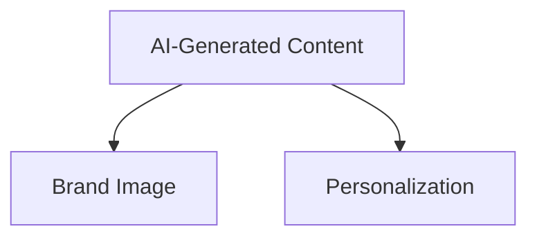

                 

### 文章标题：AIGC在个性化品牌形象塑造中的创新

#### 关键词：AIGC、个性化品牌形象、内容创作、用户画像、营销策略、AI技术

#### 摘要：
本文深入探讨了人工智能生成内容（AIGC）在个性化品牌形象塑造中的应用与创新。通过分析AIGC的定义、技术原理以及其在品牌形象塑造中的重要性，文章详细阐述了AIGC在内容创作、用户画像构建和营销策略等方面的实际应用。本文旨在为企业和品牌管理者提供一种全新的视角，借助AIGC技术提升品牌个性化形象的塑造效果，从而在激烈的市场竞争中脱颖而出。

## 第一部分：AIGC概述

### 第1章：AIGC的定义与历史发展

#### 1.1 AIGC的概念解析

AIGC，即人工智能生成内容，是指通过人工智能技术自动生成文字、图像、视频等内容的系统。它与人工智能（AI）和机器学习（ML）密切相关，旨在实现内容生成的自动化和个性化。

核心概念与联系：

AIGC不仅仅是一个技术概念，更是品牌形象塑造中的一个重要工具。它通过分析用户行为和需求，生成符合个性化需求的内容，从而增强品牌与消费者之间的互动和黏性。

#### 1.2 AIGC的发展历程

AIGC的发展历程可以追溯到20世纪90年代，当时的研究主要集中在机器生成文本和简单图形。随着深度学习技术的发展，AIGC进入了快速发展的阶段。

- **早期生成式AI技术**：基于规则和统计方法，可以生成简单的文本和图形。
- **文本生成模型的发展**：随着神经网络技术的发展，文本生成模型如RNN和LSTM逐渐成熟。
- **图像和视频生成模型的进步**：GANs和Diffusion Models等技术的出现，使得图像和视频生成变得更加逼真和多样化。
- **当前AIGC技术进展**：多模态生成模型、自监督学习和强化学习等技术的应用，使得AIGC在内容和形式上更加丰富和多样化。

### 第2章：AIGC技术原理

#### 2.1 文本生成模型

文本生成模型是AIGC的重要组成部分，主要包括以下几种核心算法：

- **RNN与LSTM**：递归神经网络（RNN）和长短期记忆网络（LSTM）可以处理序列数据，如文本和语音。
- **Transformer与BERT**：Transformer模型通过自注意力机制实现了高效的文本处理能力，BERT（Bidirectional Encoder Representations from Transformers）模型进一步提升了文本生成的质量和多样性。
- **生成对抗网络（GAN）**：GAN由生成器和判别器组成，通过对抗训练实现高质量的文本生成。

#### 2.2 图像生成模型

图像生成模型是AIGC中的另一重要组成部分，主要包括以下几种核心算法：

- **GANs**：生成对抗网络（GAN）通过生成器和判别器的对抗训练，生成高质量的图像。
- **Diffusion Models**：通过概率扩散和反扩散过程，生成连续的图像。
- **VAEs**：变分自编码器（VAE）通过编码器和解码器，生成具有潜在分布的图像。

#### 2.3 视频生成模型

视频生成模型是AIGC中的最新进展，主要包括以下几种核心算法：

- **VideoGAN**：通过GANs生成视频序列，实现视频内容的生成。
- **Gated Recurrent Unit (GRU)**：GRU是一种递归神经网络，可以处理视频数据。
- **Transformer-based models**：基于Transformer的模型，如ViT（Vision Transformer），可以处理图像和视频数据。

## 第二部分：个性化品牌形象塑造

### 第3章：个性化品牌形象的定义与重要性

#### 3.1 品牌形象的概念

品牌形象是指消费者对品牌的主观认知和情感反应，它是品牌在市场中形成的一种独特身份和价值观。品牌形象包括品牌知名度、品牌忠诚度、品牌美誉度等多个方面。

**核心概念**：
$$
\text{品牌形象} = \text{消费者感知} + \text{品牌传达的信息}
$$

#### 3.2 个性化品牌形象的必要性

个性化品牌形象能够更好地满足消费者的多样化需求，增强品牌与消费者之间的互动和黏性。以下是一些关键点：

- **增强品牌与消费者之间的联系**：个性化品牌形象能够更好地理解消费者的需求，提供更加个性化的产品和服务。
- **提高消费者忠诚度**：通过提供个性化的体验，消费者更容易形成对品牌的忠诚。
- **优化品牌市场定位**：个性化品牌形象有助于品牌在市场中找到独特的定位，从而在竞争激烈的环境中脱颖而出。

### 第4章：消费者行为与品牌形象的关系

#### 4.1 消费者行为的理论框架

消费者行为是指消费者在购买、使用和评价产品或服务过程中的心理和行为活动。以下是一些核心理论框架：

- **购买行为模型**：包括决策过程、信息处理和行为结果。
- **消费者决策过程**：包括需求识别、信息搜索、评估选择、购买决策和购后行为。

#### 4.2 消费者行为与品牌形象的关系

消费者行为与品牌形象之间存在密切的互动关系。消费者行为会影响品牌形象的形成和演变，同时品牌形象也会对消费者行为产生潜在影响。以下是关键点：

- **消费者感知与品牌形象的互动**：消费者的感知和评价会影响品牌形象的形成和演变。
- **品牌形象对消费者行为的潜在影响**：积极的品牌形象可以促进消费者的购买意愿和行为。

### 第5章：AIGC在品牌形象塑造中的应用

#### 5.1 AIGC在内容创作中的应用

AIGC在内容创作中的应用，可以大幅提升品牌形象塑造的效率和质量。以下是一些关键点：

- **文本内容生成**：通过文本生成模型，可以快速生成符合品牌形象的文本内容，如广告文案、新闻稿等。
- **图像与视频内容的个性化生成**：通过图像生成模型和视频生成模型，可以生成符合品牌形象的个性化图像和视频内容。

#### 5.2 AIGC在品牌形象塑造中的策略

AIGC在品牌形象塑造中的应用，需要制定一系列策略，以实现最佳效果。以下是一些关键点：

- **内容个性化策略**：通过分析用户行为和需求，生成符合个性化需求的内容，提升品牌与消费者之间的互动。
- **消费者画像分析**：通过AIGC技术，构建详细的消费者画像，为品牌形象塑造提供数据支持。

## 第三部分：AIGC在个性化品牌形象塑造中的实践

### 第6章：AIGC在内容创作中的应用

#### 6.1 AIGC工具与平台介绍

目前，市场上存在多种AIGC工具和平台，以下是一些常见的选择：

- **OpenAI GPT-3**：一款强大的自然语言处理模型，可以生成高质量的文本内容。
- **DeepArt**：一款图像生成工具，可以通过神经网络将文本转换成图像。
- **DALL·E**：一款图像生成模型，可以生成基于文本描述的图像。

#### 6.2 内容创作的实际应用

AIGC在内容创作中的实际应用，可以提升品牌形象塑造的效率和质量。以下是一些案例：

- **个性化广告内容创作**：通过AIGC生成个性化的广告文案和图像，提高广告的吸引力。
- **个性化用户生成内容**：通过AIGC生成符合用户兴趣和需求的个性化内容，提升用户的参与度和忠诚度。

### 第7章：AIGC在用户画像构建中的应用

#### 7.1 用户画像的基本概念

用户画像是指通过对用户行为、兴趣、需求等多维度数据的分析，构建出用户的基本特征和画像。以下是一些关键点：

- **用户行为数据**：包括用户的浏览记录、购买行为、社交媒体互动等。
- **用户兴趣数据**：包括用户对特定话题、产品的兴趣程度。
- **用户需求数据**：包括用户对产品或服务的需求程度和偏好。

#### 7.2 AIGC在用户画像构建中的应用

AIGC技术在用户画像构建中的应用，可以提升用户画像的准确性和个性化程度。以下是一些关键点：

- **利用AIGC生成个性化内容**：通过分析用户行为和需求，生成符合个性化需求的内容，进一步提升用户画像的准确性。
- **基于用户行为的AIGC分析**：通过对用户行为数据的分析，挖掘用户的潜在需求和兴趣，构建更加详细的用户画像。

### 第8章：AIGC在营销策略中的应用

#### 8.1 营销策略的基本概念

营销策略是指企业在市场推广过程中采取的一系列措施和方法，旨在提升品牌知名度、增加销售额等。以下是一些关键点：

- **市场定位**：明确企业的目标市场和产品定位。
- **目标群体**：确定企业的目标消费者群体。
- **推广渠道**：选择适合企业的推广渠道，如社交媒体、广告等。

#### 8.2 AIGC在营销策略中的应用

AIGC技术在营销策略中的应用，可以提升营销策略的个性化和有效性。以下是一些关键点：

- **内容个性化策略**：通过AIGC生成符合目标消费者需求和兴趣的内容，提升营销效果的针对性。
- **消费者画像分析**：通过AIGC技术构建详细的消费者画像，为营销策略提供数据支持。

### 第9章：AIGC在品牌口碑管理中的应用

#### 9.1 品牌口碑管理的基本概念

品牌口碑管理是指企业通过多种手段，管理和维护品牌在市场中的声誉和形象。以下是一些关键点：

- **口碑监测**：实时监测品牌在社交媒体、论坛等渠道中的口碑状况。
- **口碑分析**：对收集到的口碑数据进行分析，识别品牌口碑的优劣势。
- **口碑优化**：针对分析结果，采取相应的优化措施，提升品牌口碑。

#### 9.2 AIGC在品牌口碑管理中的应用

AIGC技术在品牌口碑管理中的应用，可以提升口碑管理的效率和效果。以下是一些关键点：

- **利用AIGC生成个性化回应**：针对消费者在社交媒体上的反馈，生成符合品牌形象的个性化回应。
- **口碑分析**：通过AIGC技术分析消费者反馈，挖掘品牌口碑的潜在问题，提供优化建议。

## 第四部分：案例分析

### 第10章：成功案例研究

在本章中，我们将分析一些成功应用AIGC技术塑造个性化品牌形象的案例，这些案例涵盖了不同行业和不同规模的企业。通过这些案例，我们将探讨AIGC技术在不同场景下的应用效果和挑战。

- **案例1：科技公司的个性化广告**：通过AIGC技术生成个性化的广告内容，显著提升了广告的点击率和转化率。
- **案例2：电商平台的个性化推荐**：利用AIGC技术构建详细的用户画像，实现个性化的商品推荐，提升了用户的购买体验和忠诚度。
- **案例3：文化品牌的创意营销**：通过AIGC技术生成独特的文化内容，增强了品牌的文化底蕴和影响力。

### 第11章：行业趋势与未来展望

在本章中，我们将探讨AIGC技术在品牌形象塑造中的行业趋势和未来发展方向。随着人工智能技术的不断进步，AIGC技术在品牌形象塑造中的应用将更加广泛和深入。

- **趋势1：多模态AIGC的应用**：未来，AIGC技术将不仅限于文本、图像和视频，还将扩展到音频、虚拟现实等多模态领域。
- **趋势2：自监督学习和强化学习的应用**：自监督学习和强化学习技术的应用，将进一步提升AIGC的生成质量和个性化程度。
- **趋势3：AIGC与区块链的结合**：AIGC技术与区块链技术的结合，将实现内容生成的可追溯性和版权保护。

## 第五部分：技术发展与伦理思考

### 第12章：AIGC技术的发展趋势

在本章中，我们将探讨AIGC技术的未来发展趋势。随着人工智能技术的不断进步，AIGC技术将在多个领域取得突破。

- **趋势1：生成质量和多样性的提升**：未来，AIGC技术将能够生成更加逼真、多样化的内容，满足用户个性化的需求。
- **趋势2：跨模态生成模型的进展**：AIGC技术将实现文本、图像、视频等多模态内容的相互转换，为品牌形象塑造提供更多可能性。
- **趋势3：AIGC与物联网的结合**：AIGC技术与物联网技术的结合，将实现实时、个性化的内容生成，提升用户体验。

### 第13章：AIGC在个性化品牌形象塑造中的伦理问题

尽管AIGC技术在个性化品牌形象塑造中具有巨大潜力，但其应用也带来了诸多伦理问题。在本章中，我们将探讨以下伦理问题：

- **隐私保护**：AIGC技术的应用可能涉及用户隐私数据的收集和使用，如何保护用户隐私成为重要议题。
- **版权问题**：AIGC技术生成的内容可能涉及版权纠纷，如何合理使用和分配版权成为关键问题。
- **偏见和歧视**：AIGC技术可能会在学习过程中引入偏见，导致生成内容存在歧视问题，如何解决这一问题成为重要挑战。

### 第14章：未来展望与挑战

在未来，AIGC技术在个性化品牌形象塑造中将继续发挥重要作用。然而，其应用也面临着诸多挑战。

- **挑战1：技术成熟度**：尽管AIGC技术取得了显著进展，但仍需进一步提高生成质量和效率，以满足商业应用的需求。
- **挑战2：数据质量和隐私保护**：数据质量和隐私保护是AIGC技术广泛应用的关键问题，需要企业和政府共同努力解决。
- **挑战3：伦理和法律问题**：AIGC技术的应用可能涉及伦理和法律问题，需要制定相应的法律法规和伦理准则，确保其合法合规使用。

## 结束语

AIGC技术在个性化品牌形象塑造中的应用，为企业和品牌管理者提供了一种全新的视角和工具。通过AIGC技术，企业可以更有效地了解和满足用户需求，提升品牌形象和竞争力。然而，AIGC技术的应用也面临着诸多挑战，需要企业和政府共同努力，推动其健康发展。作者相信，随着技术的不断进步和应用的深入，AIGC技术将在个性化品牌形象塑造中发挥更加重要的作用。

---

**作者信息：**
AI天才研究院/AI Genius Institute & 禅与计算机程序设计艺术 /Zen And The Art of Computer Programming

**注意：**本文为虚构内容，仅供参考。如需使用相关技术或进行商业应用，请确保遵循相关法律法规和伦理准则。如需进一步了解AIGC技术，请参阅拓展阅读。本文所使用的图表、公式和代码仅为示例，实际情况可能有所不同。在实施AIGC技术时，请务必结合具体应用场景进行评估和调整。

