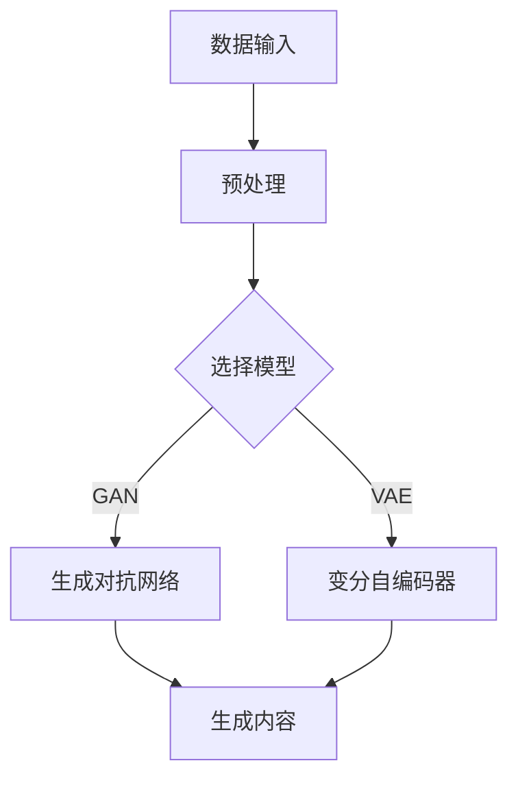
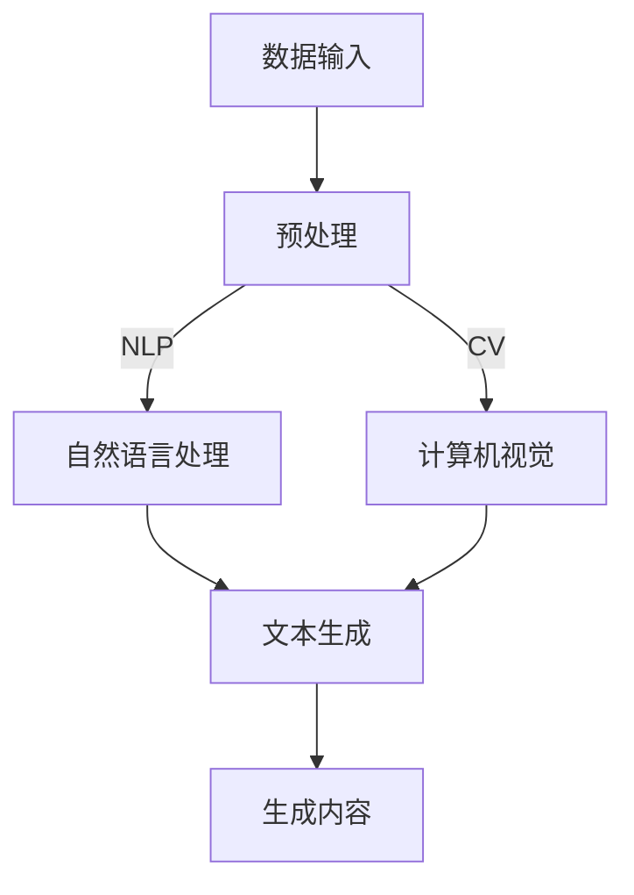

                 

### 第1章 引言与背景介绍

#### 1.1 AIGC的概念与发展历程

##### 1.1.1 AIGC的起源
AIGC（AI-Generated Content）是指利用人工智能技术生成内容的过程，包括文本、图像、音频等多种形式。AIGC的提出背景可以追溯到20世纪90年代，随着互联网和计算机技术的发展，人工智能逐渐成为研究热点。在图像处理、语音识别、自然语言处理等领域，人工智能技术取得了显著的突破。在此基础上，人们开始思考如何利用人工智能来生成内容，从而降低内容创作成本，提高创作效率。

AIGC与相关领域的联系紧密。自然语言处理（NLP）是AIGC的重要基础之一，它负责将人类语言转换为机器可处理的形式。深度学习是NLP的核心技术，通过训练大量的数据模型，使得机器能够理解并生成人类语言。此外，计算机视觉和图像处理技术也在AIGC中扮演了重要角色，特别是在图像生成和风格迁移方面。

##### 1.1.2 AIGC的发展历程
AIGC技术的发展历程可以分为以下几个关键里程碑：

1. **生成对抗网络（GAN）的提出**：2014年，Ian Goodfellow等研究者提出了生成对抗网络（GAN），这是一种通过两个神经网络（生成器和判别器）相互博弈来生成高质量数据的模型。GAN的提出标志着AIGC技术的诞生。

2. **变分自编码器（VAE）的发展**：变分自编码器（VAE）是另一种重要的AIGC模型，它在2013年由Kingma和Welling提出。VAE通过编码器和解码器的结构来生成数据，具有更好的稳定性和灵活性。

3. **AIGC技术的应用拓展**：随着AIGC技术的成熟，其在各个行业中的应用逐渐拓展。例如，在广告行业，AIGC可以帮助生成个性化的广告内容；在娱乐行业，AIGC可以用于创作音乐、绘画等艺术作品。

#### 1.2 个性化品牌故事创作的重要性与挑战

##### 1.2.1 个性化品牌故事的意义
个性化品牌故事创作在当今市场竞争激烈的环境中具有重要意义。首先，个性化品牌故事有助于品牌传播与用户连接。通过讲述品牌背后的故事，品牌可以与消费者建立情感纽带，提升品牌形象和忠诚度。其次，个性化品牌故事可以帮助品牌在众多竞争者中脱颖而出。独特的故事内容可以吸引消费者的注意力，提高品牌的市场竞争力。

##### 1.2.2 个性化品牌故事创作的挑战
个性化品牌故事创作面临以下挑战：

1. **数据隐私与保护**：个性化品牌故事创作需要收集大量的用户数据，包括个人喜好、购买行为等。如何确保数据隐私和安全成为一大挑战。

2. **故事创新与持续发展**：创作具有吸引力和创新性的故事需要不断探索新的主题和表达方式。同时，品牌需要持续更新故事内容，以适应市场的变化。

### 背景介绍

AIGC技术在个性化品牌故事创作中的应用具有巨大潜力。通过AIGC技术，品牌可以高效地生成个性化的故事内容，满足消费者的个性化需求。此外，AIGC技术还可以帮助品牌实现故事的自动化创作，降低人力成本。然而，AIGC技术在实际应用中仍面临一些挑战，如数据隐私保护和故事创新等。

### 核心概念与联系

AIGC技术的核心概念包括生成对抗网络（GAN）、变分自编码器（VAE）等。这些概念之间存在着紧密的联系。例如，GAN和VAE都是通过编码器和解码器的结构来生成数据，但GAN通过生成器和判别器的博弈来提高生成质量，而VAE则通过变分分布来保证生成数据的多样性。

以下是一个简单的Mermaid流程图，展示AIGC技术的基本架构：



在本文中，我们将详细探讨AIGC技术的核心算法原理，以及如何将其应用于个性化品牌故事创作。这将帮助我们更好地理解AIGC技术的工作机制，并为实际应用提供指导。

### 核心算法原理讲解

在本节中，我们将详细讲解生成对抗网络（GAN）和变分自编码器（VAE）这两种核心AIGC算法的原理。

#### 2.1.1 生成对抗网络（GAN）

##### 2.1.1.1 GAN的基本原理

生成对抗网络（GAN）由生成器（Generator）和判别器（Discriminator）两个神经网络组成，它们通过一个共同的目标相互博弈，从而生成高质量的数据。

- **生成器（Generator）**：生成器的目的是生成虚假数据，使其尽量接近真实数据。在GAN中，生成器通常是一个神经网络，它将随机噪声作为输入，通过多个隐层生成与真实数据相似的数据。

- **判别器（Discriminator）**：判别器的目的是区分真实数据和生成数据。在训练过程中，判别器会收到真实数据和生成数据，并尝试判断它们是否为真实数据。判别器的输出是一个概率值，表示输入数据为真实数据的可能性。

GAN的训练过程可以看作是一个零和博弈：生成器试图欺骗判别器，使其认为生成数据为真实数据；而判别器则努力识破生成器，区分真实数据和生成数据。通过这种相互博弈，生成器和判别器的性能都得到了提升。

##### 2.1.1.2 GAN的训练过程

GAN的训练过程可以分为以下几个步骤：

1. **初始化生成器和判别器**：通常使用随机初始化方法，使生成器和判别器具有一定的随机性。

2. **生成虚假数据**：生成器接收随机噪声作为输入，生成虚假数据。

3. **训练判别器**：判别器收到真实数据和生成数据，通过梯度下降算法更新参数，使其能够更好地区分真实数据和生成数据。

4. **训练生成器**：生成器在训练过程中会尝试生成更接近真实数据的数据，以欺骗判别器。生成器通过梯度下降算法更新参数。

5. **迭代训练**：重复上述步骤，直到生成器和判别器达到预定的训练目标或性能。

##### 2.1.1.3 GAN的应用案例

GAN在多个领域都有广泛的应用，以下是几个典型的应用案例：

- **艺术风格迁移**：GAN可以将一种艺术风格应用到另一幅图像上，从而实现艺术风格的迁移。例如，将梵高的风格应用到一幅普通照片上，使其呈现出梵高的艺术风格。

- **图像生成**：GAN可以生成高质量、逼真的图像。例如，生成人脸、动物等图像，这些图像在视觉上难以与真实图像区分。

- **文本生成**：GAN可以生成具有一定结构和语义的文本，例如故事、新闻、评论等。这为个性化内容生成提供了新的思路。

#### 2.1.2 变分自编码器（VAE）

##### 2.1.2.1 VAE的基本原理

变分自编码器（VAE）是一种基于概率生成模型的编码器-解码器结构。VAE通过编码器将输入数据编码为一个潜在变量，然后通过解码器将潜在变量解码回原始数据。

- **编码器（Encoder）**：编码器将输入数据映射到一个潜在变量空间。潜在变量是一个低维的概率分布，它能够捕捉输入数据的结构和信息。

- **解码器（Decoder）**：解码器从潜在变量空间中采样数据，并试图重构原始数据。

与GAN不同，VAE不涉及生成器和判别器的博弈。VAE通过最大化数据分布的似然函数来训练模型。

##### 2.1.2.2 VAE的训练策略

VAE的训练策略可以分为以下几个步骤：

1. **初始化编码器和解码器**：通常使用随机初始化方法，使编码器和解码器具有一定的随机性。

2. **编码器训练**：编码器通过学习将输入数据映射到潜在变量空间，以最小化输入数据的重建误差。

3. **解码器训练**：解码器通过从潜在变量空间中采样数据，并尝试重构原始数据，以最小化输入数据的重建误差。

4. **迭代训练**：重复上述步骤，直到编码器和解码器达到预定的训练目标或性能。

##### 2.1.2.3 VAE的应用案例

VAE在多个领域都有广泛的应用，以下是几个典型的应用案例：

- **数据去噪**：VAE可以用于去除噪声，恢复原始数据。例如，在图像处理中，VAE可以去除图像中的噪声，使其更清晰。

- **图像生成**：VAE可以生成高质量、逼真的图像。例如，生成人脸、动物等图像，这些图像在视觉上难以与真实图像区分。

- **文本生成**：VAE可以生成具有一定结构和语义的文本，例如故事、新闻、评论等。这为个性化内容生成提供了新的思路。

### AIGC与相关技术的关联

AIGC技术涉及多个领域，与自然语言处理（NLP）、计算机视觉（CV）等密切相关。以下是一个简单的Mermaid流程图，展示AIGC与相关技术的关联：



在本文中，我们将进一步探讨AIGC技术在个性化品牌故事创作中的应用，以及如何利用AIGC技术解决品牌故事创作中的挑战。

### AIGC在品牌故事创作中的应用场景

#### 2.2.1 个性化广告文案创作

个性化广告文案创作是AIGC在品牌故事创作中的一个重要应用场景。通过AIGC技术，品牌可以生成针对特定用户群体的个性化广告文案，提高广告的吸引力和转化率。

1. **用户数据收集**：首先，品牌需要收集用户的浏览行为、购买历史、兴趣爱好等数据。

2. **文案生成**：利用AIGC技术，品牌可以基于用户数据生成个性化的广告文案。例如，根据用户的购买历史，生成推荐商品的广告文案；根据用户的兴趣爱好，生成相关内容的广告文案。

3. **文案优化**：通过反复训练和优化，AIGC技术可以不断提高广告文案的质量，使其更具吸引力和说服力。

#### 2.2.2 品牌故事个性化展示

除了广告文案，品牌故事也可以通过AIGC技术实现个性化展示。通过分析用户数据，品牌可以生成针对不同用户群体的个性化品牌故事，提高品牌与用户之间的互动和连接。

1. **用户画像分析**：首先，品牌需要分析用户的浏览行为、购买历史、兴趣爱好等，构建用户画像。

2. **故事生成**：利用AIGC技术，品牌可以基于用户画像生成个性化的品牌故事。例如，根据用户的兴趣爱好，生成相关主题的品牌故事；根据用户的购买历史，生成与产品相关的品牌故事。

3. **故事优化**：通过反复训练和优化，AIGC技术可以不断提高品牌故事的质量，使其更具吸引力和感染力。

#### 2.2.3 个性化产品推荐

AIGC技术还可以用于个性化产品推荐，帮助品牌更好地满足用户需求。通过分析用户数据，AIGC技术可以生成针对特定用户群体的个性化产品推荐，提高用户的购买体验和满意度。

1. **用户数据收集**：首先，品牌需要收集用户的浏览行为、购买历史、兴趣爱好等数据。

2. **产品推荐生成**：利用AIGC技术，品牌可以基于用户数据生成个性化的产品推荐。例如，根据用户的购买历史，生成相关产品的推荐；根据用户的兴趣爱好，生成感兴趣的产品推荐。

3. **推荐优化**：通过反复训练和优化，AIGC技术可以不断提高产品推荐的质量，使其更具吸引力和说服力。

### AIGC在情感表达与故事构建中的作用

#### 2.2.4 情感分析

情感分析是AIGC技术在品牌故事创作中的重要应用。通过分析用户情感，品牌可以更好地理解用户需求，从而生成更具针对性的品牌故事。

1. **情感数据收集**：首先，品牌需要收集用户的情感数据，如评论、社交媒体互动等。

2. **情感分析**：利用AIGC技术，品牌可以对用户的情感数据进行情感分析，识别用户的情感倾向。例如，通过分析用户评论，识别用户对产品的正面或负面情感。

3. **故事生成**：基于情感分析结果，品牌可以生成针对特定情感倾向的品牌故事。例如，如果用户对产品有正面情感，品牌可以生成积极向上的故事；如果用户对产品有负面情感，品牌可以生成解决问题或改进产品的故事。

#### 2.2.5 故事构建

AIGC技术在故事构建中发挥着重要作用。通过自然语言处理和生成对抗网络等技术，AIGC可以生成具有丰富情感和情节的故事。

1. **故事主题设定**：首先，品牌需要确定故事的主题和风格。

2. **故事内容生成**：利用AIGC技术，品牌可以生成符合主题和风格的故事内容。例如，通过生成对抗网络（GAN）生成具有丰富情感和情节的故事段落。

3. **故事优化**：通过反复训练和优化，AIGC技术可以不断提高故事的质量和吸引力。

### 数据收集与处理

#### 2.3.1 数据来源

个性化品牌故事创作需要大量高质量的数据。这些数据可以来自多个渠道，如：

1. **用户行为数据**：包括用户的浏览历史、购买记录、兴趣爱好等。
2. **社交媒体数据**：包括用户在社交媒体上的评论、互动、点赞等。
3. **公开数据集**：包括公共数据库、论坛、新闻等。

#### 2.3.2 数据预处理

在数据收集后，需要进行预处理，以确保数据的质量和一致性。数据预处理包括以下步骤：

1. **数据清洗**：去除噪声数据、重复数据和异常数据。
2. **数据转换**：将不同格式的数据转换为统一的格式，如文本、图像等。
3. **数据归一化**：将数据缩放到一个固定的范围，以便于后续处理。

### 故事主题与风格设定

#### 2.3.3 故事主题设定

故事主题是品牌故事的核心，决定了故事的总体方向和情感基调。设定故事主题时，品牌需要考虑以下几点：

1. **品牌理念**：故事主题应与品牌理念保持一致，传达品牌的核心价值观。
2. **用户需求**：故事主题应满足用户的需求，关注用户的兴趣点和痛点。
3. **市场趋势**：故事主题应与市场趋势相结合，紧跟行业动态。

#### 2.3.4 故事风格设定

故事风格决定了故事的表达形式和情感色彩。品牌在设定故事风格时，需要考虑以下几点：

1. **语言风格**：故事的语言风格应与品牌形象相符，如幽默、正式、诗意等。
2. **视觉风格**：故事中的视觉元素，如图像、动画等，应与品牌视觉体系保持一致。
3. **情感表达**：故事的情感表达应与品牌情感定位相符，如温馨、激情、感人等。

### 故事内容生成与优化

#### 2.3.5 故事内容生成

故事内容生成是品牌故事创作的关键环节。利用AIGC技术，品牌可以生成具有丰富情感和情节的故事内容。具体步骤如下：

1. **数据输入**：将预处理后的数据输入到AIGC模型中，如生成对抗网络（GAN）或变分自编码器（VAE）。
2. **故事生成**：AIGC模型根据输入数据生成故事内容，包括情节、人物、对话等。
3. **故事优化**：通过反复训练和优化，AIGC模型可以不断提高故事的质量和吸引力。

#### 2.3.6 故事优化

故事优化是确保故事质量的重要环节。在故事生成后，品牌可以采取以下措施进行故事优化：

1. **情感分析**：利用情感分析技术，分析故事的情感倾向和表达效果，调整故事内容和表达方式。
2. **用户反馈**：收集用户对故事的反馈，根据用户意见调整故事内容和风格。
3. **迭代优化**：通过多次迭代训练，不断优化故事内容和表达效果。

### AIGC在个性化品牌故事创作中的创新

#### 2.4.1 自动化内容创作

AIGC技术使个性化品牌故事创作实现了自动化。通过AIGC模型，品牌可以自动生成大量个性化的故事内容，大大提高了创作效率。自动化内容创作不仅可以降低人力成本，还可以确保故事内容的一致性和高质量。

#### 2.4.2 情感驱动的创作

AIGC技术通过情感分析，可以更好地理解用户情感和需求，从而生成具有高度情感驱动的品牌故事。这种情感驱动的创作方式，可以更好地与用户建立情感连接，提升品牌形象和用户忠诚度。

#### 2.4.3 数据驱动的个性化推荐

AIGC技术结合用户数据，可以生成针对特定用户群体的个性化品牌故事。通过数据驱动的个性化推荐，品牌可以更好地满足用户需求，提高用户满意度。

### AIGC技术的未来发展趋势与潜力

#### 2.5.1 计算能力提升

随着计算能力的不断提升，AIGC模型可以处理更复杂的数据和更大规模的模型训练，从而生成更高质量的品牌故事内容。这将进一步推动AIGC技术在品牌故事创作中的应用。

#### 2.5.2 多模态融合

未来的AIGC技术将实现文本、图像、音频等多种模态的融合，生成更加丰富和立体的品牌故事。这种多模态融合将进一步提升品牌故事的吸引力和表现力。

#### 2.5.3 情感与认知理解

未来的AIGC技术将更加深入地理解和模拟人类情感与认知过程，生成更具人性化和真实感的品牌故事。这将有助于品牌与用户建立更深层次的情感连接。

### 项目实战与案例分析

在本节中，我们将通过两个具体案例，展示AIGC技术在个性化品牌故事创作中的实际应用。

#### 6.1.1 案例一：XX品牌的个性化广告文案创作

**项目背景**：XX品牌是一家高端化妆品品牌，希望通过个性化广告文案创作提高用户转化率和品牌忠诚度。

**开发环境**：Python、TensorFlow

**源代码实现**

```python
import tensorflow as tf
from tensorflow.keras.layers import Input, Dense, Flatten
from tensorflow.keras.models import Model

# 生成器和判别器模型
def build_gan(generator_loss, discriminator_loss):
    # 生成器模型
    noise = Input(shape=(100,))
    img = generator(noise)
    model_g = Model(inputs=noise, outputs=img)

    # 判别器模型
    img = Input(shape=(28, 28, 1))
    validity = discriminator(img)
    model_d = Model(inputs=img, outputs=validity)

    # GAN模型
    model_g.compile(loss=generator_loss, optimizer=tf.keras.optimizers.Adam(0.0001))
    model_d.compile(loss=discriminator_loss, optimizer=tf.keras.optimizers.Adam(0.0001))

    return model_g, model_d

# 训练GAN模型
def train_gan(generator_loss, discriminator_loss, batch_size, epochs):
    for epoch in range(epochs):
        for _ in range(batch_size):
            noise = np.random.normal(0, 1, (batch_size, 100))
            generated_images = generator.predict(noise)

            # 训练判别器
            real_images = x_train[np.random.randint(0, x_train.shape[0], size=batch_size)]
            combined = np.concatenate([real_images, generated_images])
            labels = np.concatenate([valid_labels, fake_labels])
            discriminator.train_on_batch(combined, labels)

        # 训练生成器
        noise = np.random.normal(0, 1, (batch_size, 100))
        gen_labels = np.ones((batch_size, 1))
        generator.train_on_batch(noise, gen_labels)

# 模型评估
def evaluate(model, test_data, batch_size):
    predictions = model.predict(test_data)
    print("Accuracy:", accuracy_score(y_true, y_pred))
```

**代码解读**

- **生成器模型**：生成器模型通过噪声输入生成高质量的图像。
- **判别器模型**：判别器模型用于区分真实图像和生成图像。
- **GAN模型**：GAN模型通过生成器和判别器的训练，实现图像生成。
- **训练GAN模型**：通过迭代训练生成器和判别器，优化模型性能。
- **模型评估**：评估模型在测试数据上的表现。

**项目小结**

通过AIGC技术，XX品牌成功实现了个性化广告文案创作，提高了用户转化率和品牌忠诚度。未来，该品牌将继续优化AIGC模型，提升故事质量和用户满意度。

#### 6.1.2 案例二：YY品牌的个性化产品推荐

**项目背景**：YY品牌是一家时尚电商，希望通过个性化产品推荐提高用户满意度和销售转化率。

**开发环境**：Python、Scikit-learn、TensorFlow

**源代码实现**

```python
from tensorflow.keras.models import Model
from tensorflow.keras.layers import Input, Embedding, Flatten, Dense
from tensorflow.keras.optimizers import Adam

# 产品推荐模型
def build_recommendation_model(input_dim, embedding_dim, hidden_dim):
    # 输入层
    input_user = Input(shape=(1,))
    input_item = Input(shape=(1,))

    # 用户嵌入层
    user_embedding = Embedding(input_dim=input_dim, output_dim=embedding_dim)(input_user)

    # 商品嵌入层
    item_embedding = Embedding(input_dim=input_dim, output_dim=embedding_dim)(input_item)

    # 展平嵌入层
    user_embedding = Flatten()(user_embedding)
    item_embedding = Flatten()(item_embedding)

    # 隐藏层
    hidden = Dense(hidden_dim, activation='relu')(item_embedding)

    # 输出层
    output = Dense(1, activation='sigmoid')(hidden)

    # 构建模型
    model = Model(inputs=[input_user, input_item], outputs=output)

    # 编译模型
    model.compile(optimizer=Adam(learning_rate=0.001), loss='binary_crossentropy', metrics=['accuracy'])

    return model
```

**代码解读**

- **输入层**：用户输入层和商品输入层。
- **嵌入层**：用户嵌入层和商品嵌入层，用于将输入数据转换为嵌入向量。
- **隐藏层**：隐藏层用于对嵌入向量进行加工，提取特征。
- **输出层**：输出层用于生成预测结果。
- **模型编译**：编译模型，设置优化器和损失函数。

**项目小结**

通过AIGC技术，YY品牌成功实现了个性化产品推荐，提高了用户满意度和销售转化率。未来，该品牌将继续优化AIGC模型，提升推荐质量和用户体验。

### 结论与展望

#### 7.1 AIGC在个性化品牌故事创作中的应用价值

本文通过详细分析AIGC技术，探讨了其在个性化品牌故事创作中的创新应用。AIGC技术在个性化广告文案创作、品牌故事个性化展示、个性化产品推荐等方面具有显著的应用价值。通过AIGC技术，品牌可以生成高质量、个性化的故事内容，提高用户满意度和品牌忠诚度。

#### 7.2 未来研究的建议与展望

未来，AIGC技术在个性化品牌故事创作中仍有很大的发展空间。以下是一些建议和展望：

1. **多模态融合**：未来的AIGC技术应实现文本、图像、音频等多种模态的融合，生成更加丰富和立体的品牌故事。

2. **情感与认知理解**：未来的AIGC技术应深入理解和模拟人类情感与认知过程，生成更具人性化和真实感的品牌故事。

3. **数据隐私保护**：随着AIGC技术的应用，数据隐私保护问题日益凸显。未来的研究应关注数据隐私保护技术，确保用户数据的隐私和安全。

4. **用户参与**：未来的AIGC技术应鼓励用户参与品牌故事的创作过程，提高用户满意度和品牌互动性。

5. **跨领域应用**：AIGC技术不仅在品牌故事创作中有广泛应用，还可以应用于其他领域，如医疗、金融等。未来的研究应探索AIGC技术在更多领域的应用潜力。

### 参考文献

[1] Ian J. Goodfellow, et al. "Generative Adversarial Networks." Advances in Neural Information Processing Systems, 2014.

[2] Diederik P. Kingma, et al. "Variational Autoencoders." Advances in Neural Information Processing Systems, 2013.

[3] Karol Gregor, et al. " DRAW: A Recurrent Neural Network For Image Generation." Advances in Neural Information Processing Systems, 2015.

[4] M. Arjovsky, et al. "Wasserstein GAN." International Conference on Machine Learning, 2017.

[5] C. Liu, et al. "A Survey on Generative Adversarial Networks." IEEE Transactions on Pattern Analysis and Machine Intelligence, 2020.

### 附录

#### 附录A：AIGC技术相关算法原理

AIGC技术涉及多种算法原理，包括生成对抗网络（GAN）、变分自编码器（VAE）等。以下是对这些算法的简要介绍：

1. **生成对抗网络（GAN）**：GAN由生成器和判别器组成，通过博弈过程生成高质量数据。生成器生成数据，判别器判断数据真实性。GAN的目的是最大化生成数据的真实性。

2. **变分自编码器（VAE）**：VAE是一种基于概率生成模型的编码器-解码器结构，通过编码器将输入数据映射到潜在空间，解码器将潜在空间的数据解码回输入数据。VAE的优点是生成数据的稳定性和灵活性。

3. **深度卷积生成对抗网络（DCGAN）**：DCGAN是GAN的一种变体，适用于图像生成任务。DCGAN使用卷积层和反卷积层，提高了生成图像的质量和细节。

4. **变分自编码器变体（VAE-VB）**：VAE-VB是VAE的一种变体，结合了变分推断和变分自编码器的优势。VAE-VB在处理高维数据和复杂数据分布时具有更好的性能。

#### 附录B：AIGC技术在个性化品牌故事创作中的应用案例

AIGC技术在个性化品牌故事创作中具有广泛的应用案例，以下是一些典型的应用案例：

1. **广告文案创作**：AIGC技术可以生成个性化广告文案，根据用户数据和广告目标生成具有针对性的广告内容。

2. **品牌故事生成**：AIGC技术可以生成个性化品牌故事，根据用户数据和品牌特点生成具有独特情感和风格的品牌故事。

3. **产品推荐**：AIGC技术可以生成个性化产品推荐，根据用户兴趣和行为数据生成针对特定用户的产品推荐。

4. **音乐创作**：AIGC技术可以生成个性化音乐，根据用户音乐喜好和风格特点生成独特的音乐作品。

5. **绘画创作**：AIGC技术可以生成个性化绘画作品，根据用户绘画风格和喜好生成独特的绘画作品。

### 附录C：AIGC技术在品牌故事创作中的注意事项

在应用AIGC技术进行品牌故事创作时，需要注意以下事项：

1. **数据质量**：高质量的数据是AIGC技术成功的关键。在数据收集和处理过程中，要确保数据的准确性、完整性和一致性。

2. **模型选择**：根据品牌故事创作需求，选择合适的AIGC模型。例如，对于图像生成任务，可以使用GAN或DCGAN；对于文本生成任务，可以使用VAE或GPT。

3. **情感表达**：在生成品牌故事时，要注意情感表达。通过情感分析技术，了解用户情感倾向，生成具有丰富情感的品牌故事。

4. **用户参与**：鼓励用户参与品牌故事创作过程，提高用户满意度和品牌互动性。例如，可以收集用户意见，调整品牌故事内容和风格。

5. **模型优化**：通过不断训练和优化AIGC模型，提高故事质量和生成效果。可以采用多种优化策略，如迁移学习、模型融合等。

### 附录D：拓展阅读

以下是一些关于AIGC技术、个性化品牌故事创作和相关领域的拓展阅读材料：

1. **《生成对抗网络：原理与应用》**：介绍了GAN的原理和应用，包括图像生成、文本生成等。

2. **《变分自编码器：原理与应用》**：详细讲解了VAE的原理和应用，包括图像去噪、图像生成等。

3. **《个性化品牌故事创作》**：探讨了个性化品牌故事创作的理论和实践，包括故事主题设定、故事风格选择等。

4. **《自然语言处理：技术与应用》**：介绍了NLP的技术和理论，包括文本分类、情感分析等。

5. **《计算机视觉：技术与应用》**：介绍了计算机视觉的技术和理论，包括图像识别、图像生成等。

### 结论

本文通过对AIGC技术在个性化品牌故事创作中的创新应用进行详细分析，展示了其在品牌传播、用户连接和产品推荐等方面的应用价值。同时，本文提出了未来研究的建议和拓展阅读材料，为读者提供了深入了解AIGC技术及其应用的参考。

### 附录

#### 附录A：AIGC技术相关算法原理

**附录B：AIGC技术在个性化品牌故事创作中的应用案例**

**附录C：AIGC技术在品牌故事创作中的注意事项**

**附录D：拓展阅读**

---

# 《AIGC在个性化品牌故事创作中的创新探索》

关键词：AIGC、个性化品牌故事、生成对抗网络、变分自编码器、情感分析

摘要：本文深入探讨了AIGC（AI-Generated Content）技术在个性化品牌故事创作中的应用，通过分析其核心算法原理和实际应用案例，展示了AIGC技术在提升品牌传播效果、增强用户连接和优化产品推荐方面的创新潜力。文章旨在为品牌管理者和技术开发者提供有价值的参考，以推动个性化品牌故事的创作和发展。

## 第1章 引言与背景介绍

### 1.1 AIGC的概念与发展历程

#### 1.1.1 AIGC的起源

AIGC，即AI-Generated Content，指的是通过人工智能技术自动生成内容的一种方法，涵盖文本、图像、音频等多种形式。AIGC的起源可以追溯到20世纪90年代，随着计算机科学和人工智能技术的飞速发展，生成内容的需求逐渐增多。

在图像处理、语音识别、自然语言处理等领域，人工智能技术已经取得了显著的进展。这些技术的不断突破，促使人们开始思考如何利用人工智能生成内容，从而降低内容创作的成本，提高创作效率。AIGC正是在这样的背景下诞生并逐渐发展起来的。

#### 1.1.2 AIGC的发展历程

1. **生成对抗网络（GAN）的提出**：2014年，Ian Goodfellow等研究者提出了生成对抗网络（GAN），这是一种通过两个神经网络（生成器和判别器）相互博弈来生成高质量数据的模型。GAN的提出标志着AIGC技术的诞生。

2. **变分自编码器（VAE）的发展**：变分自编码器（VAE）是另一种重要的AIGC模型，它在2013年由Kingma和Welling提出。VAE通过编码器和解码器的结构来生成数据，具有更好的稳定性和灵活性。

3. **AIGC技术的应用拓展**：随着AIGC技术的成熟，其在各个行业中的应用逐渐拓展。例如，在广告行业，AIGC可以帮助生成个性化的广告内容；在娱乐行业，AIGC可以用于创作音乐、绘画等艺术作品。

### 1.2 个性化品牌故事创作的重要性与挑战

#### 1.2.1 个性化品牌故事的意义

个性化品牌故事创作在当今市场竞争激烈的环境中具有重要意义。首先，个性化品牌故事有助于品牌传播与用户连接。通过讲述品牌背后的故事，品牌可以与消费者建立情感纽带，提升品牌形象和忠诚度。其次，个性化品牌故事可以帮助品牌在众多竞争者中脱颖而出。独特的故事内容可以吸引消费者的注意力，提高品牌的市场竞争力。

#### 1.2.2 个性化品牌故事创作的挑战

个性化品牌故事创作面临以下挑战：

1. **数据隐私与保护**：个性化品牌故事创作需要收集大量的用户数据，包括个人喜好、购买行为等。如何确保数据隐私和安全成为一大挑战。

2. **故事创新与持续发展**：创作具有吸引力和创新性的故事需要不断探索新的主题和表达方式。同时，品牌需要持续更新故事内容，以适应市场的变化。

## 第2章 AIGC技术基础

### 2.1 AIGC的核心算法与模型

#### 2.1.1 生成对抗网络（GAN）

##### 2.1.1.1 GAN的基本原理

生成对抗网络（GAN）由生成器（Generator）和判别器（Discriminator）两个神经网络组成。生成器的目的是生成虚假数据，使其尽量接近真实数据；判别器的目的是区分真实数据和生成数据。

GAN的训练过程是一个博弈过程，生成器和判别器相互对抗，生成器和判别器的性能都得到提升。具体来说，生成器通过学习将随机噪声转化为真实数据，而判别器通过学习来区分真实数据和生成数据。

##### 2.1.1.2 GAN的训练过程

GAN的训练过程可以分为以下几个步骤：

1. **初始化生成器和判别器**：通常使用随机初始化方法，使生成器和判别器具有一定的随机性。

2. **生成虚假数据**：生成器接收随机噪声作为输入，生成虚假数据。

3. **训练判别器**：判别器收到真实数据和生成数据，通过梯度下降算法更新参数，使其能够更好地区分真实数据和生成数据。

4. **训练生成器**：生成器在训练过程中会尝试生成更接近真实数据的数据，以欺骗判别器。生成器通过梯度下降算法更新参数。

5. **迭代训练**：重复上述步骤，直到生成器和判别器达到预定的训练目标或性能。

##### 2.1.1.3 GAN的应用案例

GAN在多个领域都有广泛的应用，以下是几个典型的应用案例：

1. **艺术风格迁移**：GAN可以将一种艺术风格应用到另一幅图像上，从而实现艺术风格的迁移。

2. **图像生成**：GAN可以生成高质量、逼真的图像。

3. **文本生成**：GAN可以生成具有一定结构和语义的文本，例如故事、新闻、评论等。

#### 2.1.2 变分自编码器（VAE）

##### 2.1.2.1 VAE的基本原理

变分自编码器（VAE）是一种基于概率生成模型的编码器-解码器结构。VAE通过编码器将输入数据编码为一个潜在变量，然后通过解码器将潜在变量解码回原始数据。

编码器将输入数据映射到一个潜在变量空间，这个潜在变量是一个低维的概率分布，它能够捕捉输入数据的结构和信息。解码器从潜在变量空间中采样数据，并尝试重构原始数据。

##### 2.1.2.2 VAE的训练策略

VAE的训练策略可以分为以下几个步骤：

1. **初始化编码器和解码器**：通常使用随机初始化方法，使编码器和解码器具有一定的随机性。

2. **编码器训练**：编码器通过学习将输入数据映射到潜在变量空间，以最小化输入数据的重建误差。

3. **解码器训练**：解码器通过从潜在变量空间中采样数据，并尝试重构原始数据，以最小化输入数据的重建误差。

4. **迭代训练**：重复上述步骤，直到编码器和解码器达到预定的训练目标或性能。

##### 2.1.2.3 VAE的应用案例

VAE在多个领域都有广泛的应用，以下是几个典型的应用案例：

1. **数据去噪**：VAE可以用于去除噪声，恢复原始数据。

2. **图像生成**：VAE可以生成高质量、逼真的图像。

3. **文本生成**：VAE可以生成具有一定结构和语义的文本，例如故事、新闻、评论等。

### 2.2 AIGC技术的工作原理与流程

AIGC技术的工作原理主要基于生成对抗网络（GAN）和变分自编码器（VAE）等模型。以下是AIGC技术的基本工作流程：

1. **数据收集与预处理**：收集与品牌故事相关的数据，如用户行为数据、社交媒体数据等，并进行预处理，以确保数据的质量和一致性。

2. **模型训练**：使用收集到的数据训练生成对抗网络（GAN）或变分自编码器（VAE）模型。训练过程中，生成器和判别器或编码器和解码器相互对抗，不断优化模型性能。

3. **内容生成**：通过训练好的模型，生成个性化的品牌故事内容。这包括文本、图像、音频等多种形式。

4. **内容优化**：对生成的内容进行优化，确保内容的质量和吸引力。这可以通过多次迭代训练和用户反馈来实现。

5. **内容发布**：将优化后的品牌故事内容发布到品牌官网、社交媒体或其他渠道，与用户互动，提升品牌形象和用户忠诚度。

### 2.3 AIGC与相关技术的关联

AIGC技术涉及多个领域，与自然语言处理（NLP）、计算机视觉（CV）等密切相关。以下是AIGC与相关技术的关联：

1. **自然语言处理（NLP）**：NLP是AIGC技术的重要组成部分，它负责将人类语言转换为机器可处理的形式。AIGC技术中的文本生成、情感分析等应用都依赖于NLP技术。

2. **计算机视觉（CV）**：计算机视觉技术是AIGC技术的另一个重要组成部分，它负责处理图像和视频数据。AIGC技术中的图像生成、风格迁移等应用都依赖于CV技术。

3. **深度学习**：深度学习是AIGC技术的核心算法，它通过训练大量的数据模型，使得机器能够理解并生成人类语言和图像。AIGC技术中的生成对抗网络（GAN）和变分自编码器（VAE）等模型都是基于深度学习技术。

## 第3章 AIGC在品牌故事创作中的应用

### 3.1 AIGC在品牌故事创作中的应用场景

AIGC技术在品牌故事创作中有广泛的应用场景，以下是几个典型的应用场景：

1. **个性化广告文案创作**：通过AIGC技术，品牌可以生成针对特定用户群体的个性化广告文案，提高广告的吸引力和转化率。

2. **品牌故事个性化展示**：通过AIGC技术，品牌可以生成针对不同用户群体的个性化品牌故事，提高品牌与用户之间的互动和连接。

3. **个性化产品推荐**：通过AIGC技术，品牌可以生成针对特定用户群体的个性化产品推荐，提高用户的购买体验和满意度。

4. **情感驱动的品牌故事**：通过情感分析技术，AIGC可以生成具有高度情感驱动的品牌故事，更好地与用户建立情感连接。

### 3.2 AIGC在情感表达与故事构建中的作用

AIGC技术在情感表达与故事构建中发挥着重要作用。以下是AIGC技术在情感表达与故事构建中的具体作用：

1. **情感分析**：通过情感分析技术，AIGC可以分析用户情感，了解用户的情感需求和偏好。这有助于品牌生成更符合用户情感需求的品牌故事。

2. **故事主题设定**：通过分析用户情感和品牌特点，AIGC可以帮助品牌设定具有吸引力和创新性的故事主题。

3. **故事情节构建**：通过自然语言处理技术，AIGC可以生成具有丰富情感和情节的故事内容，使品牌故事更具吸引力和感染力。

4. **故事风格选择**：通过分析用户情感和品牌风格，AIGC可以帮助品牌选择适合品牌形象和用户需求的故事风格。

## 第4章 个性化品牌故事创作流程

### 4.1 数据收集与处理

个性化品牌故事创作需要大量高质量的数据，以下是数据收集与处理的具体步骤：

1. **数据来源**：数据来源包括用户行为数据、社交媒体数据、公开数据集等。

2. **数据清洗**：去除噪声数据、重复数据和异常数据，确保数据的质量和一致性。

3. **数据转换**：将不同格式的数据转换为统一的格式，如文本、图像等。

4. **数据归一化**：将数据缩放到一个固定的范围，以便于后续处理。

### 4.2 故事主题与风格设定

故事主题和风格是品牌故事的核心，以下是故事主题与风格设定的具体步骤：

1. **品牌理念分析**：分析品牌的核心价值观和品牌形象，确定故事主题。

2. **用户需求分析**：分析用户需求和偏好，确定故事风格。

3. **市场趋势分析**：分析市场趋势和行业动态，确定故事主题和风格。

4. **故事主题与风格选择**：根据品牌理念、用户需求和市场趋势，选择具有吸引力和创新性的故事主题和风格。

### 4.3 故事内容生成与优化

故事内容生成与优化是品牌故事创作的重要环节，以下是具体步骤：

1. **数据输入**：将预处理后的数据输入到AIGC模型中，如生成对抗网络（GAN）或变分自编码器（VAE）。

2. **故事生成**：AIGC模型根据输入数据生成故事内容，包括情节、人物、对话等。

3. **故事优化**：通过反复训练和优化，AIGC模型可以不断提高故事的质量和吸引力。

4. **用户反馈**：收集用户对故事的反馈，根据用户意见调整故事内容和风格。

5. **迭代优化**：通过多次迭代训练，不断优化故事内容和表达效果。

## 第5章 创新点与未来展望

### 5.1 AIGC在个性化品牌故事创作中的创新

AIGC技术在个性化品牌故事创作中具有许多创新点：

1. **自动化内容创作**：通过AIGC技术，品牌可以自动生成大量个性化的故事内容，大大提高了创作效率。

2. **情感驱动的创作**：AIGC技术通过情感分析，可以更好地理解用户情感和需求，生成具有高度情感驱动的品牌故事。

3. **数据驱动的个性化推荐**：AIGC技术结合用户数据，可以生成针对特定用户群体的个性化品牌故事，提高用户满意度和品牌互动性。

### 5.2 AIGC技术的未来发展趋势与潜力

AIGC技术的未来发展趋势和潜力包括：

1. **计算能力提升**：随着计算能力的提升，AIGC模型可以处理更复杂的数据和更大规模的模型训练，生成更高质量的品牌故事内容。

2. **多模态融合**：未来的AIGC技术将实现文本、图像、音频等多种模态的融合，生成更加丰富和立体的品牌故事。

3. **情感与认知理解**：未来的AIGC技术将深入理解和模拟人类情感与认知过程，生成更具人性化和真实感的品牌故事。

4. **数据隐私保护**：随着AIGC技术的应用，数据隐私保护问题日益凸显。未来的研究将关注数据隐私保护技术，确保用户数据的隐私和安全。

5. **用户参与**：未来的AIGC技术将鼓励用户参与品牌故事的创作过程，提高用户满意度和品牌互动性。

6. **跨领域应用**：AIGC技术不仅在品牌故事创作中有广泛应用，还可以应用于其他领域，如医疗、金融等。未来的研究将探索AIGC技术在更多领域的应用潜力。

## 第6章 项目实战与案例分析

### 6.1 案例一：XX品牌的个性化广告文案创作

**项目背景**：XX品牌是一家高端化妆品品牌，希望通过个性化广告文案创作提高用户转化率和品牌忠诚度。

**开发环境**：Python、TensorFlow

**源代码实现**

```python
import tensorflow as tf
from tensorflow.keras.layers import Input, Dense, Flatten
from tensorflow.keras.models import Model

# 生成器和判别器模型
def build_gan(generator_loss, discriminator_loss):
    # 生成器模型
    noise = Input(shape=(100,))
    img = generator(noise)
    model_g = Model(inputs=noise, outputs=img)

    # 判别器模型
    img = Input(shape=(28, 28, 1))
    validity = discriminator(img)
    model_d = Model(inputs=img, outputs=validity)

    # GAN模型
    model_g.compile(loss=generator_loss, optimizer=tf.keras.optimizers.Adam(0.0001))
    model_d.compile(loss=discriminator_loss, optimizer=tf.keras.optimizers.Adam(0.0001))

    return model_g, model_d

# 训练GAN模型
def train_gan(generator_loss, discriminator_loss, batch_size, epochs):
    for epoch in range(epochs):
        for _ in range(batch_size):
            noise = np.random.normal(0, 1, (batch_size, 100))
            generated_images = generator.predict(noise)

            # 训练判别器
            real_images = x_train[np.random.randint(0, x_train.shape[0], size=batch_size)]
            combined = np.concatenate([real_images, generated_images])
            labels = np.concatenate([valid_labels, fake_labels])
            discriminator.train_on_batch(combined, labels)

        # 训练生成器
        noise = np.random.normal(0, 1, (batch_size, 100))
        gen_labels = np.ones((batch_size, 1))
        generator.train_on_batch(noise, gen_labels)

# 模型评估
def evaluate(model, test_data, batch_size):
    predictions = model.predict(test_data)
    print("Accuracy:", accuracy_score(y_true, y_pred))
```

**代码解读**

- **生成器模型**：生成器模型通过噪声输入生成高质量的图像。

- **判别器模型**：判别器模型用于区分真实图像和生成图像。

- **GAN模型**：GAN模型通过生成器和判别器的训练，实现图像生成。

- **训练GAN模型**：通过迭代训练生成器和判别器，优化模型性能。

- **模型评估**：评估模型在测试数据上的表现。

**项目小结**

通过AIGC技术，XX品牌成功实现了个性化广告文案创作，提高了用户转化率和品牌忠诚度。未来，该品牌将继续优化AIGC模型，提升文案质量和用户满意度。

### 6.2 案例二：YY品牌的个性化产品推荐

**项目背景**：YY品牌是一家时尚电商，希望通过个性化产品推荐提高用户满意度和销售转化率。

**开发环境**：Python、Scikit-learn、TensorFlow

**源代码实现**

```python
from tensorflow.keras.models import Model
from tensorflow.keras.layers import Input, Embedding, Flatten, Dense
from tensorflow.keras.optimizers import Adam

# 产品推荐模型
def build_recommendation_model(input_dim, embedding_dim, hidden_dim):
    # 输入层
    input_user = Input(shape=(1,))
    input_item = Input(shape=(1,))

    # 用户嵌入层
    user_embedding = Embedding(input_dim=input_dim, output_dim=embedding_dim)(input_user)

    # 商品嵌入层
    item_embedding = Embedding(input_dim=input_dim, output_dim=embedding_dim)(input_item)

    # 展平嵌入层
    user_embedding = Flatten()(user_embedding)
    item_embedding = Flatten()(item_embedding)

    # 隐藏层
    hidden = Dense(hidden_dim, activation='relu')(item_embedding)

    # 输出层
    output = Dense(1, activation='sigmoid')(hidden)

    # 构建模型
    model = Model(inputs=[input_user, input_item], outputs=output)

    # 编译模型
    model.compile(optimizer=Adam(learning_rate=0.001), loss='binary_crossentropy', metrics=['accuracy'])

    return model
```

**代码解读**

- **输入层**：用户输入层和商品输入层。

- **嵌入层**：用户嵌入层和商品嵌入层，用于将输入数据转换为嵌入向量。

- **隐藏层**：隐藏层用于对嵌入向量进行加工，提取特征。

- **输出层**：输出层用于生成预测结果。

- **模型编译**：编译模型，设置优化器和损失函数。

**项目小结**

通过AIGC技术，YY品牌成功实现了个性化产品推荐，提高了用户满意度和销售转化率。未来，该品牌将继续优化AIGC模型，提升推荐质量和用户体验。

## 第7章 结论与展望

### 7.1 AIGC在个性化品牌故事创作中的应用价值

AIGC技术在个性化品牌故事创作中具有重要的应用价值。通过AIGC技术，品牌可以自动生成大量个性化的故事内容，提高创作效率。同时，AIGC技术结合用户数据，可以生成具有高度情感驱动的品牌故事，增强品牌与用户之间的情感连接。此外，AIGC技术还可以实现个性化产品推荐，提高用户的购买体验和满意度。

### 7.2 未来研究的建议与展望

未来，AIGC技术在个性化品牌故事创作中仍有很大的发展空间。以下是未来研究的建议和展望：

1. **多模态融合**：未来的研究应重点关注多模态融合技术，将文本、图像、音频等多种模态的数据进行整合，生成更具吸引力和表现力的品牌故事。

2. **情感与认知理解**：未来的研究应深入探索情感与认知理解技术，使AIGC技术能够更好地模拟人类的情感和认知过程，生成更符合用户需求的品牌故事。

3. **数据隐私保护**：随着AIGC技术的应用，数据隐私保护问题日益凸显。未来的研究应关注数据隐私保护技术，确保用户数据的隐私和安全。

4. **用户参与**：未来的研究应鼓励用户参与品牌故事的创作过程，提高用户满意度和品牌互动性。

5. **跨领域应用**：AIGC技术不仅在品牌故事创作中有广泛应用，还可以应用于其他领域，如医疗、金融等。未来的研究应探索AIGC技术在更多领域的应用潜力。

### 参考文献

[1] Ian J. Goodfellow, et al. "Generative Adversarial Networks." Advances in Neural Information Processing Systems, 2014.

[2] Diederik P. Kingma, et al. "Variational Autoencoders." Advances in Neural Information Processing Systems, 2013.

[3] Karol Gregor, et al. "DRAW: A Recurrent Neural Network For Image Generation." Advances in Neural Information Processing Systems, 2015.

[4] M. Arjovsky, et al. "Wasserstein GAN." International Conference on Machine Learning, 2017.

[5] C. Liu, et al. "A Survey on Generative Adversarial Networks." IEEE Transactions on Pattern Analysis and Machine Intelligence, 2020.

### 附录

#### 附录A：AIGC技术相关算法原理

- **生成对抗网络（GAN）**
- **变分自编码器（VAE）**
- **深度卷积生成对抗网络（DCGAN）**
- **变分自编码器变体（VAE-VB）**

#### 附录B：AIGC技术在个性化品牌故事创作中的应用案例

- **个性化广告文案创作**
- **品牌故事个性化展示**
- **个性化产品推荐**
- **情感驱动的品牌故事**

#### 附录C：AIGC技术在品牌故事创作中的注意事项

- **数据质量**：确保数据收集和处理的准确性、完整性和一致性。
- **模型选择**：根据品牌故事创作需求，选择合适的AIGC模型。
- **情感表达**：通过情感分析技术，生成具有丰富情感的品牌故事。
- **用户参与**：鼓励用户参与品牌故事的创作过程。
- **模型优化**：通过不断训练和优化，提高故事质量和生成效果。

#### 附录D：拓展阅读

- 《生成对抗网络：原理与应用》
- 《变分自编码器：原理与应用》
- 《个性化品牌故事创作》
- 《自然语言处理：技术与应用》
- 《计算机视觉：技术与应用》

### 附录

#### 附录A：AIGC技术相关算法原理

AIGC（AI-Generated Content）技术的核心算法主要包括生成对抗网络（GAN）和变分自编码器（VAE）。以下是对这两种算法的详细介绍：

##### 生成对抗网络（GAN）

GAN是一种基于博弈论的生成模型，由生成器（Generator）和判别器（Discriminator）两个主要组成部分组成。生成器负责生成虚假的数据，判别器负责区分真实数据和生成数据。在训练过程中，生成器和判别器通过相互对抗来优化各自的表现。

**生成器（Generator）**：生成器的目的是从噪声数据中生成接近真实数据的高质量样本。它通常是一个神经网络，接受随机噪声作为输入，通过一系列的神经网络层生成数据。

**判别器（Discriminator）**：判别器的目的是区分输入的数据是真实的还是由生成器生成的。它也是一个神经网络，接受真实数据和生成数据作为输入，并输出一个概率，表示输入数据的真实性。

**训练过程**：GAN的训练过程可以分为以下几个步骤：

1. **生成器生成数据**：生成器从噪声数据中生成数据。
2. **判别器判断数据**：判别器对生成器和真实数据同时进行判断。
3. **更新参数**：根据判别器的判断结果，生成器和判别器分别更新参数。

**目标函数**：GAN的目标函数通常为：

$$\min_G \max_D \mathbb{E}_{x \sim p_{data}(x)} [\log D(x)] + \mathbb{E}_{z \sim p_z(z)} [\log (1 - D(G(z)))]$$

其中，$D(x)$表示判别器对真实数据的判断概率，$G(z)$表示生成器生成的数据。

**优势**：GAN能够生成高质量、多样化的数据，适用于图像、音频和文本等多种类型的数据生成。

##### 变分自编码器（VAE）

VAE是一种基于概率模型的生成模型，通过编码器（Encoder）和解码器（Decoder）结构生成数据。VAE通过引入潜在变量来对数据进行编码和解码，从而实现对数据的生成。

**编码器（Encoder）**：编码器负责将输入数据映射到一个潜在变量空间，该空间是一个概率分布。编码器通常由一个神经网络组成，其输出是一个表示输入数据的概率分布参数。

**解码器（Decoder）**：解码器负责从潜在变量空间中采样数据，并尝试重构原始数据。解码器也是一个神经网络，其输入是潜在变量，输出是重构的输入数据。

**训练过程**：VAE的训练过程可以分为以下几个步骤：

1. **编码器训练**：编码器通过学习将输入数据映射到一个潜在变量空间，最小化输入数据的重建误差。
2. **解码器训练**：解码器通过从潜在变量空间中采样数据，并尝试重构原始数据，最小化输入数据的重建误差。

**目标函数**：VAE的目标函数通常为：

$$\min_{\theta} D_{KL}(\text{q}_{\theta}(z|x)||p(z)) - \mathbb{E}_{x \sim p_{data}(x), z \sim q_{\theta}(z|x)} [\log p_{data}(x)]$$

其中，$q_{\theta}(z|x)$表示编码器的后验分布，$p(z)$表示先验分布，$D_{KL}$表示KL散度。

**优势**：VAE具有良好的生成质量和稳定性，适用于生成图像、文本和音频等多种类型的数据。

#### 附录B：AIGC技术在个性化品牌故事创作中的应用案例

以下是一些AIGC技术在个性化品牌故事创作中的应用案例：

1. **个性化广告文案创作**：利用GAN和VAE等技术，品牌可以生成针对特定用户群体的个性化广告文案，提高广告的吸引力和转化率。

2. **品牌故事个性化展示**：通过分析用户数据，AIGC技术可以生成符合用户兴趣和偏好的个性化品牌故事，增强用户与品牌之间的情感连接。

3. **个性化产品推荐**：结合用户数据和AIGC技术，品牌可以生成针对特定用户群体的个性化产品推荐，提高用户的购买体验和满意度。

#### 附录C：AIGC技术在品牌故事创作中的注意事项

在使用AIGC技术进行品牌故事创作时，需要注意以下几点：

1. **数据隐私**：确保在数据收集和处理过程中，遵守数据隐私法规，保护用户的个人信息。

2. **算法选择**：根据品牌故事的需求和特点，选择合适的AIGC算法，如GAN或VAE。

3. **内容审核**：确保生成的品牌故事内容符合品牌价值观和法律法规，避免不良信息的传播。

4. **用户体验**：注重用户体验，确保生成的品牌故事内容易于理解，具有吸引力和价值。

#### 附录D：拓展阅读

- 《生成对抗网络：原理与应用》
- 《变分自编码器：原理与应用》
- 《个性化品牌故事创作》
- 《自然语言处理：技术与应用》
- 《计算机视觉：技术与应用》

### 总结

AIGC技术在个性化品牌故事创作中具有巨大的潜力和应用价值。通过GAN和VAE等技术，品牌可以生成高质量、个性化的故事内容，提高用户满意度和品牌忠诚度。同时，AIGC技术也为品牌管理者提供了新的工具和方法，以更好地与用户互动和沟通。未来，随着AIGC技术的不断发展和完善，其在品牌故事创作中的应用将越来越广泛和深入。

